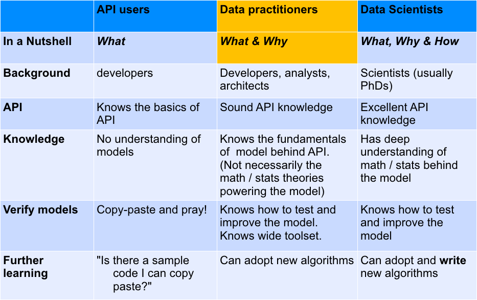
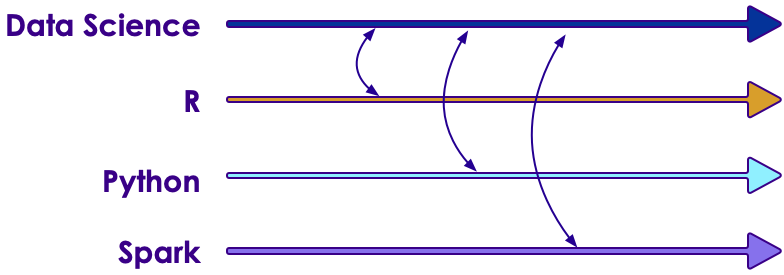
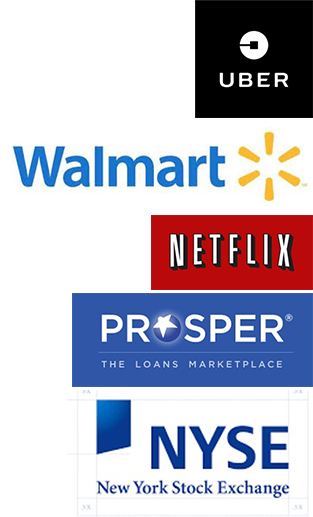
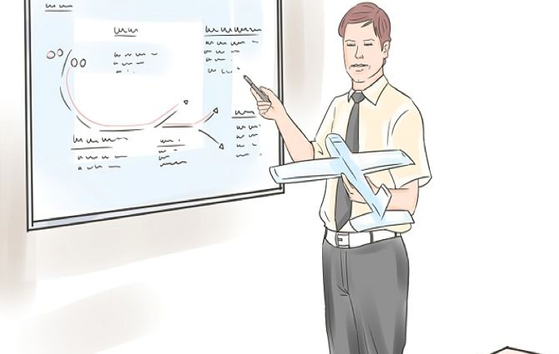

# Machine Learning

---

## About This Class

* A **practical approach to ML**

* Goals
    - **'Top-Down' learning**
    - **Learn** fundamentals of ML
    - And **implement** them in an ML environment
    - Then you can drill into details / Math theory behind the algorithm at your leisure

* Beyond the scope
    - Deep Math / Stats coverage
    - Advanced concepts

Notes:

---

## Prerequisites & Expectations

* Development background
    - Need to be comfortable programming - there are many labs
    - Our labs are in Python and Scala. (If you don't know Scala, we will do a Scala Primer at the start)

* Basic knowledge of Linux

* We don't expect Math / Statistics background

Notes:

---

## What if I Don't Know Enough Math / Stats?

* Most often people are told to start Machine Learning with Linear Algebra / Calculus

* These are hard subjects and lot of people loose interest pretty quickly

* Or people spend too much time in Math / Stats

* Our approach:
    - We acknowledge Math / Stats are essential inner workings of Machine Learning
    - A practitioner can go far in ML with a little fundamentals and without too deep knowledge in Math / Stats 
    
    **Learn by practicing**

    - We do recommend you review the theories behind ML at your leisure

Notes:

---

## Data Science Totem pole

 <!-- {"left" : 0.55, "top" : 1.09, "height" : 5.48, "width" : 9.16} -->


Notes:

---

## Goal For This ML Class

* Goal for this class is to give you 'data practitioner' level of knowledge

 <!-- {"left" : 0.93, "top" : 1.84, "height" : 5.27, "width" : 8.39} -->


Notes:

---

## Our Teaching Philosophy

* Enable you to be a **'data practitioner'** by giving you
    - The essential knowledge of ML
    - Plenty of time and playground environment for learning the API
    - Show how to evaluate, test, and tweak the models
    - Expose you to useful tools

* Emphasis on concepts & fundamentals, not API
    - Trust us, API is the easy part!

* Highly interactive (questions, discussions ..etc  are welcome)

* Hands-on – lots and lots of labs! (learn by doing)


Notes:

* All the labs are verified at 1.3 even though latest is 1.4

---

## Some Highlights of this Class

* This is v2.0 of our previous DS class.  We re-wrote this class to reflect our learnings from the field
* Goals
    - Go deeper: Provide deeper understanding of ML concepts
    - Elevate people from 'copy paste API' level
    - Common track to be taught in R / Python / Spark (Python / Scala)

 <!-- {"left" : 0.97, "top" : 3.87, "height" : 2.91, "width" : 8.3} -->


Notes:


---

## Real World Datasets

* We will work on real world datasets such as
    - Uber Trips data
    - Walmart Shopping data
    - Netflix recommendation
    - Health studies
    - Credit card default data
    - Prosper loan data
    - NYSE Stock data


 <!-- {"left" : 7.73, "top" : 1.1, "height" : 3.48, "width" : 2.11} -->


* No old-worn-out datasets like Iris / Titanic ...


Notes:


---

## Workshop Overview

* **Day 1**
    - ML intro
    - ML Concepts
    - Statistics Primer
    - Data Exploration & Visualizing
    - Feature Engineering
    - Linear Regression

* **Day 2**
    - Logistic Regression
    - SVM
    - Decision Trees
    - Random Forest
    - Naïve Bayes


---

## Workshop Overview

* **Day 3**
    - Clustering
    - K-Means
    - PCA
    - Recommendations

* **Workshops**
    - Final day, solve a problem end to end
    - Daily workshops (time permitting)

Notes:
---

## Lots of Labs : Learn By Doing

 <!-- {"left" : 1.7, "top" : 0.97, "height" : 5.53, "width" : 6.85} -->


---

## Analogy : Learning To Fly...


 <!-- {"left" : 0.26, "top" : 0.9, "height" : 6.17, "width" : 9.74} -->


Notes:

* Image: http://aviation-schools.regionaldirectory.us/learn-to-fly-720.jpg

---

## Instruction

 <!-- {"left" : 0.26, "top" : 0.9, "height" : 6.17, "width" : 9.74} -->


Notes:
* Image: http://www.wikihow.com/Become-a-Certified-Flight-Instructor

---

## + Flight Time

 <!-- {"left" : 0.26, "top" : 0.9, "height" : 6.17, "width" : 9.74} -->


---

## After The Class...

 <!-- {"left" : 1.69, "top" : 0.93, "height" : 5.65, "width" : 6.88} -->


Notes:

* By the end of the class...

---

## About You And Me

* About you
    - Your Name
    - Your background (developer, admin, manager, etc.)
    - Technologies you are familiar with
    - Familiarity with Machine Learning 
    
    (scale of 1 – 4 ;  1 – new,   4 – expert)

    - Something non-technical about you!
    
    (favorite ice cream flavor / hobby…etc)

 <!-- {"left" : 1.79, "top" : 4.6, "height" : 2.14, "width" : 2.89} -->

 
<!-- {"left" : 5.02, "top" : 4.6, "height" : 2.14, "width" : 3.44} -->


Notes:


---

## Recommended Resources

* Please see our handout

Notes:

* Image credit : http://shop.oreilly.com/

---

## Class Logistics

* Instructor’s contact

* Slides
    - For each session, slides will be emailed out or delivered via virtual classroom

* Labs
    - Lab files will be distributed

* Playground
    - Provided in the cloud

---

## Typographic Conventions

* Code in the text uses a fixed-width code font, e.g.:

* catalog: Catalog = new CatalogImpl
    - Code fragments are the same, e.g. catalog.speakTruth
    - We **bold/color** text for emphasis
    - Filenames are in italics, e.g. `Catalog.scala`
    - Notes are indicated with a superscript number<sup>(1)</sup> or a **star** *
    - Longer code examples appear in a separate code box - e.g.

```java
object TestApp {  // Basic Spark App (Scala)
  def main(args: Array[String]) {
		val sc = new SparkContext(
      new SparkConf().setMaster("local").setAppName(”TestApp")
		val totalWords = sc.textFile(“file”)
               .flatMap(l => l.split(" ")).count()
		println (“# lines : “ + totalWords)
	}
}
```
<!-- {"left" : 0, "top" : 4.44, "height" : 2.45, "width" : 10.25} -->


Notes:

* (1) If we had additional information about a particular item in the slide, it would appear here in the notes

* We might also put related information that generally pertains to the material covered in the slide

---

## Questions?

* Any Questions?
