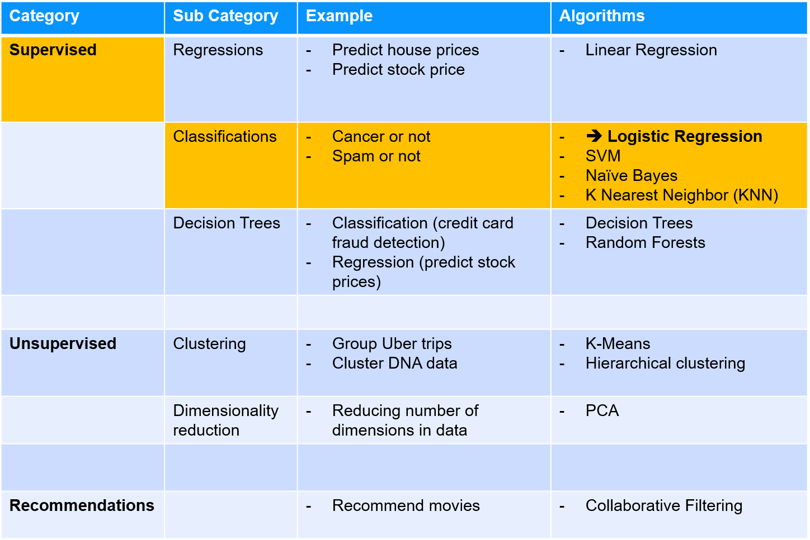
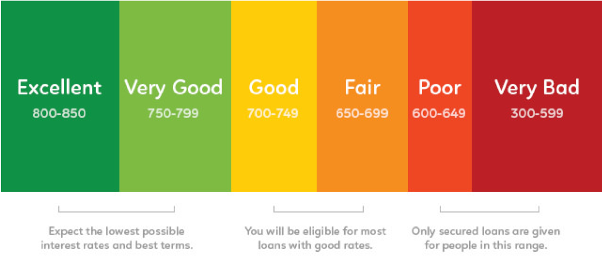
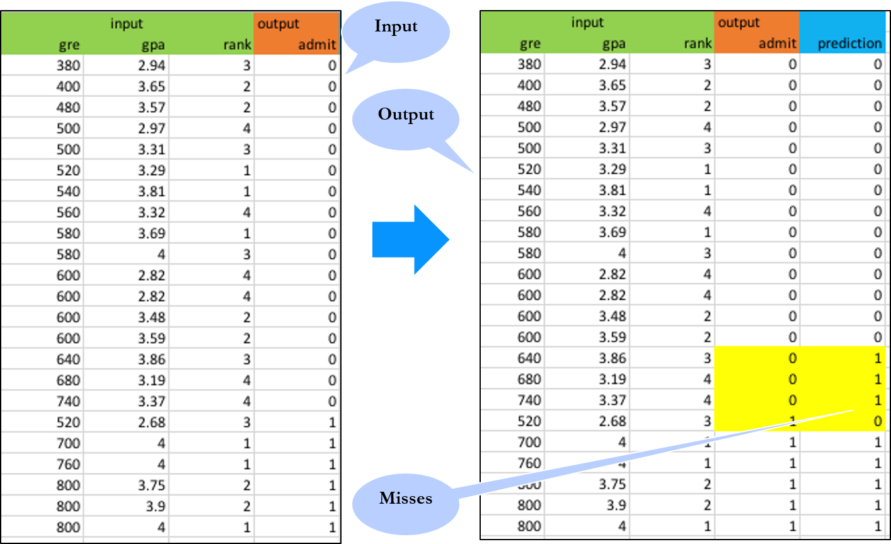
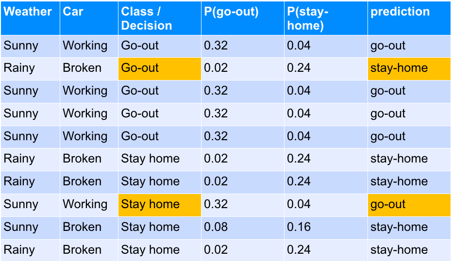

# Classification Algorithms

---

## Lesson Objectives

* Learn the following classification algorithms
* SVM
* Naïve Bayes

Notes:

---


# Logistic Regression

---

## Algorithm Summary

<!-- {"left" : 1.02, "top" : 1.24, "height" : 5.48, "width" : 8.21} -->


Notes:

http://machinelearningmastery.com/supervised-and-unsupervised-machine-learning-algorithms/


---

## Problem: Applying for Credit Card


 * In US most adults have a 'credit score' (a.k.a. FICO score)

 * Ranges from 300 (very poor) to 850 (excellent)

 * Credit score is a big determining factor when applying for loans / mortgages / credit cards

<!-- {"left" : 1.02, "top" : 3.28, "height" : 3.66, "width" : 8.21} -->


Notes:

Image credit : (CC) : https://www.flickr.com/photos/cafecredit/27321078025


---

### Problem : Applying for Credit Card


 * Here is historical data on credit score and if the credit application is approved

 * What is the chance some one with score of  **700**  getting a credit card approved?


| Credit Score | Approved? |
|--------------|-----------|
| 560          | No        |
| 750          | Yes       |
| 680          | Yes       |
| 650          | No        |
| 450          | No        |
| 800          | Yes       |
| 775          | Yes       |
| 525          | No        |
| 620          | No        |
| 705          | No        |
| 830          | Yes       |
| 610          | Yes       |
| 690          | No        |

Notes:


---

## Plotting Credit Approval Data

<!-- {"left" : 1.02, "top" : 1.28, "height" : 5.42, "width" : 8.21} -->


Notes:


---

## Plotting Credit Approval Data


 * X axis = credit score

 * Y axis = 0 (declined), 1 (approved), nothing in between

 * There is no linear fit line!

<!-- {"left" : 2.11, "top" : 2.49, "height" : 4.61, "width" : 6.03} -->


Notes:


---

## Linear vs. Logistic


 * Linear Regression provides continuous Y values

 * Classification gives out discrete output (Spam / Not-Spam)

 * Logistic Regression produces numbers that are probabilities

<!-- {"left" : 2.02, "top" : 2.41, "height" : 4.2, "width" : 6.22} -->


Notes:


---

## Logistic Regression

<!-- {"left" : 7.7, "top" : 4.24, "height" : 3.03, "width" : 2.37} -->

 * Logistic Regression gives out probability between 0 to 1

     - 70% chance this email is Spam

     - 40% this loan will fail

 * This probability is mapped into<br/>
  binary outcome (true/false,  yes / no)

 * **Logistic uses Regression algorithm,<br/>
  but used for classification**

 * Logistic regression is Linear (classification) algorithm

 * Invented by Sir David Cox<br/>
   (author of 364 books and papers!)


Notes:


---

## Math Behind  Logistic Regression


```text
X : input
Y : output
b0,b1 : coefficients

         (b0 + b1 * X)
      e
Y = ---------------------------
         (b0 + b1 * X)
  1 + e

Rewrite this as:
Log(odds) = ln (y / (1-y)) = b0 + b1* X

Log (odds) =  ln (p / 1-p)    where p is the probability of the event will occur

```

Notes:


---

## Math Behind Logistic Regression

 * 'Logit' function calculates 'odds'

 
 <!-- {"left" : 4.31, "top" : 0.95, "height" : 3.85, "width" : 5.77} -->
<!-- {"left" : 0.29, "top" : 4.05, "height" : 2.99, "width" : 7.05} -->


Notes:

Image attribution : https://commons.wikimedia.org/wiki/File%3ALogistic-curve.svg


---

## Applying Logistic Regression To Credit Card Application

```
Coefficients for our credit card problem: b0 = -1.69754 ,  b1 = 0.002319     

For score of 700

        e b0 + b1*X                      exp (-1.69754 + 0.002319 * 700)
 Y = ------------------------- =   ------------------------------------------------   =  0.84
        1 + e b0 + b1 * X               1 + exp (-1.69754 + 0.002319 * 700)

Predicts 84% chance of getting the loan approved.
So this mapped to YES

```
<!-- {"left" : 2.49, "top" : 3.13, "height" : 3.47, "width" : 5.26} -->


Notes:

---

## Multiple Logistic Regression


 * So far we have seen ONE predictor determining the outcome

     - Credit score determining  approval / denial

 * We can have multiple factors (independent variables) determining an outcome as well

     - This is called 'multiple logistic regression'

<!-- {"left" : 0.77, "top" : 3.36, "height" : 3.63, "width" : 8.71} -->


Notes:


---

## Math Behind Multiple Logistic Regression


 * Let's say  
     - β represents parameters

     - X is independent variable (we have more than one)

 * Log(odds) = ln (y / (1-y)) = β<sub>0</sub> + β<sub>1</sub>* X<sub>1</sub> + β<sub>2</sub>* X<sub>2</sub> + …. + β<sub>n</sub>* X<sub>n</sub> <br/><br/>

 * Log (odds) or log-odds ration = <!-- {"left" : 6.86, "top" : 3.37, "height" : 1.74, "width" : 2.99} -->


 * Where p is the probably the event will occur


Notes:


---

## Logistic Regression Example


 * We are going to look college admission data

<!-- {"left" : 1.02, "top" : 1.57, "height" : 5.02, "width" : 8.21} -->


Notes:


---

[ML-concepts.md##Confusion Matrix and ROC Curve](ML-concepts.md##Confusion Matrix and ROC Curve)


---

## Measuring Accuracy of Logistic Model


 * Since Logistic Regression is used for classification we can use
     - Confusion Matrix
     - ROC and AUC (Area Under Curve)

<!-- {"left" : 3.71, "top" : 4.55, "height" : 2.54, "width" : 6.31} -->

 * Confusion Matrix:

    correct : 14 + 5 = 19

    missed : 3 + 1 = 4

    accuracy = 19/(19+4) = 82.6%

 * ROC / AUC = 0.874


Notes:


---

## Preparing Data for Logistic Regression


 *  **Binary Output Variable**

    Logistics Regression predicts probability of an instance belonging to default class.  This is snapped into 0 or 1 classification

 *  **Remove Noise**

    Remove outliers from input data

 *  **Gaussian Distribution**

    If you can shape the data into a Gaussian distribution (Logarithmic, etc.) Logistics will yield better results

---

## Preparing Data for Logistic Regression

 *  **Remove Correlated Output**

    Remove highly correlated inputs to avoid overfitting

 *  **Failure to converge**

    Causes

     - Highly correlated input

     - Data is very sparse (lots of zeros in data)

Notes:


---

## Multinomial logistic regression


 * We have seen Logistic Regression predicting binary outcomes

     - Approved / Denied

 * We can use it to calculate 'more than two' states as well

     - multinomial logistic regression

 * For K possible outcomes

     - Chose one outcome as a “pivot”

        * against the pivot outcome

Notes:


---

## Logistic Regression: Strengths, Weaknesses, and Parameters


 * Logistic Regression: Strengths, Weaknesses, and Parameters

 *  **Strengths**
     - Relatively simple to understand
     - Linear algorithm -> Fast learner
     - Works well on high dimensional (100s of features) datasets
     - Very scalable to large data sets

 *  **Weaknesses**
     - Can underfit some times

 *  **Parameters**
     - Use regularization to minimize overfitting

Notes:


---

## Lab: Logistic Regression


 *  **Overview**:

     - Practice Logistic Regression

 *  **Approximate Time**:

     - 30 mins

 *  **Instructions**:

    Follow appropriate Python / R / Spark instructions

     -  **LOGIT-1: Credit card approval (single variable)**

     -  **LOGIT-2: College Admission (multiple variables)**

Notes:


---

## Lab: Cross Validation: Hyper Parameter Tuning


 *  **Overview**:

    - Learn to do Cross Validation

 *  **Approximate Time**:

    - 30 mins

 *  **Instructions**:

     - Follow  appropriate Python / R / Spark instructions

     -  **Cross Validation 1 : Tuning the model**


Notes:


---

# SVM - Support Vector Machines

---

## Algorithm Summary

<!-- {"left" : 1.02, "top" : 1.26, "height" : 5.44, "width" : 8.21} -->


Notes:
* http://machinelearningmastery.com/supervised-and-unsupervised-machine-learning-algorithms/

---

## Exercise: College Admission


<!-- {"left" : 7.13, "top" : 4.64, "height" : 2.59, "width" : 2.82} -->

* Consider college application and admittance data

* **Inputs:**
    - GRE:  max 800
    - GPA: 1.0  to4.0
    - Rank: 1 (better) to 4

* **Output**
    - Admitted : Yes or No

* We did this Multiple Logistics Regression before. <br/> Now we will try SVM


Notes:

---

## SVM - Support Vector Machines

* SVM is a supervised classifier

* It was introduced in mid-1990s

* Became  very popular due to
    - Very accurate classifications
    - High performance (computationally)

* When classes are well separated, SVM performs very well

* When there are overlaps, others like Logistic Regression might work better

Notes:

---

## Theory Behind SVM

* Consider the following data points – Blue and Red

* Since they are in 2D data, a single line can potentially separate them

* Out of many possibilities we choose one, that separates the classes cleanly

<!-- {"left" : 1.02, "top" : 3.3, "height" : 3.84, "width" : 8.21} -->


Notes:

Diagram from "Introduction to Statistical Learning" with thanks to authors

---

## Hyper Planes

* When we choose a separating boundary, we want to choose one that separates the points by widest margin

* --> more confidence in the classification

* This is called **Maximal Margin Classifier**

<!-- {"left" : 2.83, "top" : 3.06, "height" : 3.97, "width" : 4.58} -->


Notes:

---

## SVM is Sensitive to Input Data

* Here new point (blue) added shifts the hyper plane dramatically.

* Now even though we have a clean separation, the 'margin' is much narrower

* This leads to lower confidence in prediction

<!-- {"left" : 1.02, "top" : 3.3, "height" : 3.83, "width" : 8.21} -->


Notes:


---

## Math Behind Hyper Planes

* For a 2D problem the hyper plane is a line

<!-- {"left" : 5.22, "top" : 1.35, "height" : 0.86, "width" : 4.31} -->


* For 3D problem hyper plane is a surface / plane

* For P-dimension problem hyper plane is (P-1) dimensional
    - Hard to visualize

<!-- {"left" : 2.54, "top" : 3.55, "height" : 0.86, "width" : 6.85} -->


* When you plugin X to the equation, if it evaluates to positive, it belongs in one class

* If it evaluates to negative, belongs in the other class

Notes:

---

## What if Linear Separation is Not Possible

* Here no linear classification may be possible

<!-- {"left" : 2.13, "top" : 1.66, "height" : 5.78, "width" : 5.99} -->


Notes:

---

## Soft Margin Classifier

* In practice, real data is messy and a clean separation by a hyper plane may not be possible

* So the constraint of maximizing the margin of the line that separates classes needs to be relaxed

* Allows some observations to be on the 'wrong side' of the margin or even hyperplane


---

## Soft Margin Classifier

* This is called **'soft margin classifier'**  (soft because it is violated by some observations)

* Here points 8, 11 & 12 are on the wrong side of hyper plane

<!-- {"left" : 0.71, "top" : 3.01, "height" : 3.61, "width" : 8.84} -->


Notes:

---

## Using Soft Margin Classifier

* The tuning parameter is called C (slack variable)

* Defines magnitude of the wiggle allowed across all dimensions

    - C = 0 means no violation is allowed and we are back to the inflexible Maximal-Margin Classifier

    - The larger the value of C the more violations of the hyperplane are permitted

* The smaller the value of C, the more sensitive the algorithm is to the training data (**higher variance and lower bias**)

* The larger the value of C, the less sensitive the algorithm is to the training data (**lower variance and higher bias**)

* Compromise : optimize for overall good prediction, even if we get a few wrong

Notes:

---

## SVM With Kernel Trick

* Standard linear kernel of SVM provides linear separation of data

* As we have seen linear separation is sometimes not possible

    - Solutions: Kernels

    - Polynomial kernel

    - Radical kernel

* SVM Kernels allow SVM to adopt to complex data


Notes:


---

## SVM With Kernel Examples

* Left : Polynomial kernel of degree 3

* Right: Radical kernel

<!-- {"left" : 0.73, "top" : 2.18, "height" : 4.62, "width" : 8.78} -->


Notes:

---

## SVM Kernel Example

* In this (synthetic) data linear separation is not possible


&nbsp;&nbsp;&nbsp;&nbsp;&nbsp;<!-- {"left" : 0.61, "top" : 2.41, "height" : 3.14, "width" : 4.42} --><!-- {"left" : 5.22, "top" : 2.41, "height" : 3.14, "width" : 4.42} -->

Notes:

Reference : Chapter 2, "Introduction to Machine Learning With Python"

---

## SVM Kernel Example

* But adding a higher dimension allows us to separate the points (feature1^2)

&nbsp;<!-- {"left" : 0.58, "top" : 2.71, "height" : 3.33, "width" : 4.54} --><!-- {"left" : 5.14, "top" : 2.71, "height" : 3.33, "width" : 4.54} -->


Notes:

Reference : Chapter 2, "Introduction to Machine Learning With Python"

---

## SVM Kernel Example

* This is the decision boundary of SVM kernel in the above example

<!-- {"left" : 1.91, "top" : 2.23, "height" : 4.36, "width" : 6.43} -->


Notes:

Reference : Chapter 2, "Introduction to Machine Learning With Python"

---

## SVM Kernel Trick Demo

* [Link](https://www.youtube.com/watch?v=3liCbRZPrZA)

<!-- {"left" : 1.71, "top" : 1.16, "height" : 4.55, "width" : 6.82} -->


* The transformation used is: f([x y]) = [x y (x^2+y^2)]

Notes:

https://www.youtube.com/watch?v=3liCbRZPrZA

---

## Preparing Data for SVM

* **Binary Classification**
    - Standard SVM is a binary classifier (class A or B).Extensions are developed for multiclass classification and regressions

* **Numerical Inputs**
    - SVM assumes inputs are numerical.If you have categorical inputs convert it to binary dummy variables

* **Normalize Inputs**
    - SVM assumes that the input data is within standard range.
    - If you have feature-1 that ranges from 1 to 10
    - And feature-2 that ranges from 1 to 1000
    - feature2 will become more important and skew predictions


Notes:


---

## SVM : Strengths, Weaknesses, and Parameters

* **Strengths**
    - Linear SVM can learn fast on linearly separable data
    - Using kernel trick, SVM can adopt to complex data

* **Weaknesses**
    - Sensitive to input data (high variance)
    - Sensitive to tuning parameters
    - Prone to overfit
    - Need to scale data
    - May not scale huge volume of data
    - Complex models can be hard to explain

Notes:

---

## SVM : Strengths, Weaknesses, and Parameters

* **Parameters**
    - Slack variable (C)
    - Regularization parameter (lambda)
    - Choice of kernel (linear, radial, polynomial etc.)

Notes:

---

## Lab: SVM

* **Overview:**
    - Work with SVM algorithm

* **Approximate time:**
    - 20-30 mins

* **Instructions:**

    - Follow instructions for R / Python / Spark

    - SVM1 - 'college-admission' data

    - SVM2 – Customer churn data


Notes:

---

## Lab: Cross Validation: Hyper Parameter Tuning

* **Instructor:**
    - Run this lab if not done before

* **Overview:**
    - Learn to do Cross Validation

* **Approximate Time:**
    - 30 mins

* **Instructions:**

    - Follow appropriate Python / R / Spark instructions

    - **Cross Validation 1:Tuning the model**

Notes:

---

# Naïve Bayes

---

## Algorithm Summary


<!-- {"left" : 0.86, "top" : 1.15, "height" : 5.67, "width" : 8.52} -->


Notes:
* http://machinelearningmastery.com/supervised-and-unsupervised-machine-learning-algorithms/

---

## Naïve Bayes

* Naïve Bayes a probability based classification algorithm that can do binary and multi-class classifications

* It makes pretty strong assumptions about data

    - Inputs are independent

    - Inputs are equally important

* These may not hold up on real world data sets

* Naïve Bayes is surprisingly effective for some domains

    - Categorical

    - Text

Notes:

---

## Naïve Bayes Implementations

| Implementation  | Use Case                                                          |
|-----------------|-------------------------------------------------------------------|
| **Gaussian**    | continuous data (e.g. stock price)                                |
| **Bernoulli**   | Binary data                                                       |
| **Multinomial** | integer count data  (e.g. how often a word appears in a document) |


Notes:

---

## Example 1

| Weather |   Car   | Class / Decision |
|:-------:|:-------:|:----------------:|
|  Sunny  | Working |      Go-out      |
|  Rainy  |  Broken |      Go-out      |
|  Sunny  | Working |      Go-out      |
|  Sunny  | Working |      Go-out      |
|  Sunny  | Working |      Go-out      |
|  Rainy  |  Broken |     Stay home    |
|  Rainy  |  Broken |     Stay home    |
|  Sunny  | Working |     Stay home    |
|  Sunny  |  Broken |     Stay home    |
|  Rainy  |  Broken |     Stay home    |
<br/>

* **Question for class**:

Are the input variables (weather / car) independent?


Notes:

---

## Example 2

* **Question for class**: Are the inputs independent in this dataset?


<!-- {"left" : 1.97, "top" : 2.32, "height" : 3.33, "width" : 6.31} -->


Notes:


---

## Example 3

* **Question for class** :Are the inputs independent in this dataset?

<!-- {"left" : 1.85, "top" : 1.89, "height" : 4.2, "width" : 6.54} -->


Notes:


---

## Example

* Let's convert this to numbers

* Weather : Sunny=1,  rainy=0

* Car: working=1,  broken=0

* Class: Go-out=1, Stay-home=0

<!-- {"left" : 1.02, "top" : 2.96, "height" : 4.16, "width" : 8.21} -->


Notes:

---

## A Little Statistics

* The conditional probability (denoted by P) of event A given event B occurred is

```text
                 P (A ∩ B)     P (B|A) * P(A)
   P (A | B) = ------------ = ----------------
                   P (B)          P(B)
```

* If A and B are independent

```text
   P (A ∩ B) = P (B|A) * P(A) = P(A) * P(B)
```

* Example

    - Probability of HEADS in coin toss = 1/2

    - Probability of getting a 6 on a dice throw = 1/6

    - Achieving both  =  1/2∗1/6=1/12 = 8%


Notes:

---

## Calculating Probabilities

```python
                        count(class = 1)
* P(class = 1) = ------------------------------
                count (class = 1) + count (class = 0)

                        count(class = 0)
* P(class = 0) = ------------------------------
                count (class = 1) + count (class = 0)

                            5
* P(class = 1 / go-out) = --------  = 50%
                          5 + 5

                              5
* P(class = 0 / stay-home) = --------  = 50%
                             5 + 5
```

Notes:


---

## Calculating Conditional Probabilities
```text
                                  count(weather=sunny AND class=go-out)
P(class=go-out | weather=sunny ) = ------------------------------------
                                  count (class = go-out)
                                    4
                                =  ----  = 0.8 = 80%
                                    5
```

* **How weather influences decision**

```text
P (class = go-out | weather = sunny)    = 4 / 5 = 0.8
P (class = go-out | weather = rainy)    = 1 / 5 = 0.2
P (class = stay-home | weather = sunny) = 2 / 5 = 0.2
P (class = stay-home | weather = rainy) = 3 / 5 = 0.6
```


* **How car influences decision**

```text
 P (class = go-out | car = working)    = 4 / 5 = 0.8
 P (class = go-out | car = broken)     = 1 / 5 = 0.2
 P (class = stay-home | car = working) = 1 / 5 = 0.2
 P (class = stay-home | car = broken)  = 4 / 5 = 0.8
```

Notes:


---

## Bayes Theorem

* Bayes theorem provides way to calculate the probability of hypothesis

* **P(h|d)** is the probability of **hypothesis h given the data d.** This is called the posterior probability

* **P(d|h)** is the **probability of data d given that the hypothesis** h was true

* **P(h)** is the **probability of hypothesis h being true** (regardless of the data). This is called the prior probability of h

* **P(d)** is the **probability of the data** (regardless of the hypothesis)

```python

            P(h|d)x P (h)
P(h | d) = ---------------
                 P(d)
```
<!-- {"left" : 0, "top" : 5.72, "height" : 1.07, "width" : 5.11} -->
Notes:


---

## 'Naïve' in Naïve Bayes

* Probability of P(h) happening given events  d1,d2,d3 is `P(h | d1,d2,d3)`

* To simplify this we can calculate the probability as `P(d1 | h) *  P(d2 | h) *  P(d3 | h)`

    - Combining individual probabilities together

    - If we assume  events `d1, d2, d3 are independent`

    - `A big assumption!`

* It is called '`Naive Bayes`' or '`idiot Bayes`' because the calculation of the probabilities for each hypothesis are simplified to make their calculation tractable

* '**Each attribute is independent**' is strong assumption is most unlikely in real world data

* NBC works surprisingly well even on data where this assumption doesn't hold.


Notes:

---

## Making Predictions With Naïve Bayes Model

* Given a NB model we can predict new data as follows

    - MAP(h) =  max ( P (d|h) *  P(h) )

* MAP = Maximum Probable Hypothesis

```python
If weather=sunny
P(go-out)    = P (weather = sunny|class = go-out) * P (class = go-out)
P(stay-home) = P (weather = sunny|class = stay-home) *
               P (class = stay-home)
                              go-out
P(go-out | weather=sunny) = -----------
                             go-out + stay-home

                                 stay-home
P(stay-home | weather=sunny) = -----------
                                go-out + stay-home

```
<!-- {"left" : 0, "top" : 2.68, "height" : 2.62, "width" : 10.25} -->

Notes:

---

## Making Predictions With Naïve Bayes Model

```python
What is the prediction if weather=sunny, car=working ?
(we are plugging in probabilities we calculated before

P(go-out)    = P (weather = sunny|class = go-out) *
               P (car=working | class=go-out) *
               P (class = go-out)
             = 0.8 * 0.8 * 0.5
             = 0.32

P(stay-home) = P (weather = sunny|class = stay-home) *
               P (car=working | class=stay-home) *
               P (class = stay-home)
             = 0.4 * 0.2 * 0.5
             = 0.04

P(go-out) 0.32 > P(stay-home) 0.04

So we predict 'go-out'

**So weather=sunny, car=working-->prediction=go-out**
```

Notes:


---

## Naïve Bayes Prediction Table

* Our model predicts with accuracy of 80%.Miss-predictions are `highlighted`

<!-- {"left" : 1.02, "top" : 2.11, "height" : 4.74, "width" : 8.21} -->


Notes:


---

## Preparing Data for Naïve Bayes

* **Classification**

    - NB is for doing binary or multi-class classification

* **Categorical Inputs**

    - NB assumes inputs are binary, categorical or nominal
* **Gaussian Inputs:**
    - If input is real values Gaussian distribution is assumed.  Algorithm will perform better if distribution is Gaussian or near-Gaussian.

    - Need to remove outliers (values more than 3 or 4 standard deviations from mean)

* **Log Probabilities**

    - Calculation of probabilities involves multiplying a lot of small numbers together.This can lead to underflow of numerical precision.Log transforming will help:log (0.003) = -5.8


Notes:

---

## Naïve Bayes :Strengths, Weaknesses, and Parameters

* **Strengths**
    - simple, easy to explain
    - fast learner
    - very effective in some real world situations
    - handles noisy and missing data well
    - can learn with few samples
    - can also scale to large datasets
---

## Naïve Bayes :Strengths, Weaknesses, and Parameters

* **Weaknesses**
    - Assumes all features are independent
    - and equally important
    - Not ideal for datasets with many numerical features

* **Parameters**
    - **Type of algorithm**
        - **Gaussian:** can be applied to continuous data
        - **Bernoulli:** can be applied to binary data
        - **Multinomial:** integer count data (e.g. how often a word appears in a document)

Notes:

---

## Lab: Naïve Bayes

* **Overview:** Use Naïve Bayes implementation

* **Approximate Time:** 20-30 min.

* **Instructions:**

    - Follow instructions for Spark / Python / R

    - NB1 : Spam classification

    - NB2 : Income classification

Notes:

---

## Further Reading

* ["Introduction to Statistical Learning"](http://www-bcf.usc.edu/~gareth/ISL) – Chapter 9

* [http://tdlc.ucsd.edu/events/boot_camp_2009/tingfansvm.pdf](http://tdlc.ucsd.edu/events/boot_camp_2009/tingfansvm.pdf)

Notes:

http://www-bcf.usc.edu/~gareth/ISL


---

## Review Questions
