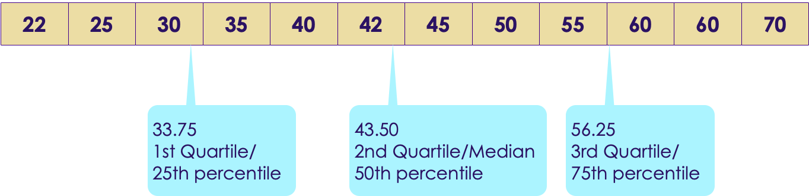

# Data Exploration

---

## Lesson Objectives


 * Learn to do explorative data analysis

 * Learn some basic statistics

Notes:

---

# Data Types
---

## Data Types

| **Type**    | **Description**                                                | **Example**                             |
|-------------|----------------------------------------------------------------|-----------------------------------------|
| Continuous  | Data can take any value within an interval Numeric, float, int | Exam score: 0  - 100                    |
| Discrete    | Only integer values                                            | Clicks per day                          |
| Categorical | Specific values from a set Enums, factors                      | Colors: Red, White, Blue <br/> States: AL, CA |
| Binary      | Just two values, binary 0/1 or true/false                      | Transaction fraud or not                |
| Ordinal     | Categorical data, but with ordering                            | Grades: A, B, C, D <br/> A > B > C > D        |


Notes:

---

## Structured Data

 

Notes:


---

# Statistics Primer
---

# Numerical Data Analysis
---

## Numerical Data Analysis


 * Analyze the following salary data.  
 [30k, 35k, 22k, 70k, 50k, 55k, 45k, 40k, 25k, 42k, 60k, 65k]

 * Sorting the data  
 [22k, 25k, 30k, 35k, 40k, 42k, 45k, 50k, 55k, 60k, 65k, 70k]

 * Min: 22k  
  Max: 70k  
 ==> Range o data: 22k to 70k

Notes:


---

## Mean (Average)

|               |                                                 |
|---------------|-------------------------------------------------|
| Mean          | Sum (values) / total number of samples          |
| Weighted Mean | Sum(values * weights) / total number of samples |

* [30k, 35k, 22k, 70k, 50k, 55k, 45k, 40k, 25k, 42k, 60k, 65k]
*  **Average / Mean** = Total sum of all salaries /  (number of salaries )  
 = (30k +  35k +  22k + 70k + 50k +  55k +  45k +  40k + 25k + 42k + 60k + 65k)  /  12  
 = 44.9k
 * Mean is denoted by x 


Notes:


---

## Outliers & Trimmed Mean

|                                   |                                                                                                                                                                                                                                                                                                                                                                             |
|-----------------------------------|-----------------------------------------------------------------------------------------------------------------------------------------------------------------------------------------------------------------------------------------------------------------------------------------------------------------------------------------------------------------------------|
| Outliers                          | Extreme values. These influence plain mean. <br/>e.g. When Bill Gates walks into a bar, everyone's net worth goes up by few 100s of millions!                                                                                                                                                                                                                                    |
| Trimmed Mean       Truncated Mean | Take mean, after dropping a number of extreme values from the bottom and top. <br/> <br/>  10% Trimmed Mean drops 10% of largest and 10% of smallest values and calculates mean in remaining 80% of data. <br/> <br/>Used in competition scoring, to avoid one judge influencing the outcome.<br/><br/> Example :  [ 5,  6, 7,  8,  10] <br/>Mean = sum(5+6+7+8+10) / 5 = 7.2 <br/>Trimmed Mean = sum (6,7,8) / 3 = 7 |

Notes:


---

## Outliers / Trimmed Mean Example

 * Consider this annual income data (note the outliers in low end and high end)  
 [**5k**, 40k, 42k, 45k, 50k, 55k, 60k, 65k, 70k, **400k**]

 * Mean income, considering all data  
 = (5 + 40 + 42 + 45 + 50 + 55 + 60 + 65 + 70 + 400) / 10  
 =  **83.2**

* 10% trimmed mean  
==> drop lowest 10% (5k)   
==> drop highest 10% (400k)  
= (40+42+45+50+55+60+65+70)/8  
= **53.4**

* As you can see, trimmed mean helps us deal with outliers

Notes:

http://www.cabrillo.edu/~evenable/ch03.pdf


---

## Median (≠ Mean!)
* Median is the middle/center point of sorted data

* Example, find median of  
  [50k, 55k, 40k, 42k, 45k, 65k, 70k, 75k, 60k]

* First sort the data  
[40k, 42k, 45k, 50k, 55k, 60k, 65k, 70k, 75k]

* Find middle point :  
[40k, 42k, 45k, 50k, **55k**, 60k, 65k, 70k, 75k]

* If there are even number of records:  
[40k, 42k, 45k, 50k, **55k**, **60k**, 65k, 70k, 75k, 80k]

* Median is average of both middle numbers :  
(55k + 60k)/2 = **57.5k**

Notes:

http://www.cabrillo.edu/~evenable/ch03.pdf

---


## Median, Mean and Outliers

  * Consider this dataset  
  [40k, 42k, 45k, 50k, 55k, 60k, 65k, 70k]

  * Mean / Average  
  = (40 + 42 + 45 + 50 + 55 + 60 + 65 + 70 ) / 8   
  = 53.4

  * Median  
  = (50 + 55) / 2   
  = 52.5


Notes:


---

## Median, Mean and Outliers

* Now introduce an outlier (400k)  
  [40k, 42k, 45k, 50k, 55k, 60k, 65k, 70k, **400k** ]
* Mean (average)  
  = (40k +  42k +  45k +  50k +  55k +  60k +  65k +  70k +  400k ) / 9  
  = 91.89
* Median = 55


* So **median** is less influenced by outliers
* This is why we hear 'median' used in news stories
    - '**Median** house price in San Jose is 1 M'

Notes:


---

## Mean : Sample Code ( R )


```R
a = c (5,40,42,45,50,55,60,65,70,400)

summary(a)
#   Min. 1st Qu.  Median    Mean 3rd Qu.    Max.
#    5.00   42.75   52.50   83.20   63.75  400.00

mean(a)
# 83.2

median(a)
# 52.5

## trimmed mean
mean(a, trim=0.1)
# 53.375

```

Notes:


---

## Mean : Sample Code (Python)

```python
import numpy as np
import pandas as pd
from scipy import stats

a = np.array([5,40,42,45,50,55,60,65,70,400])
# [ 5 40 42 45 50 55 60 65 70 400]

np.mean(a)
# 83.2

stats.trim_mean(a,0.1)) # 10%
# 53.375*  

np.median(a)
# 52.5*  
```
Notes:


---

## Variability  / Dispersion


 * Consider sample annual incomes from two cities.

 * City1 = [ 30k, 32k, 35k, 40k, 45k, 48k, 50k ]   
   City2 = [ 10k, 15k, 20k, 40k, 60k, 65k, 70k ]

 * Mean for both datasets is  **40k**

 * But it doesn't tell the whole story

 * City2 data is more widely 'dispersed' than City1


Notes:


---

## Measuring Variability / Dispersion

| Term | Description | Also known as |
|----------------------|-----------------------------------------------------------------------------------------------------------------------|-------------------------------|
| Range | Largest Value - Smallest Value | spread |
| Deviations | Difference between estimated value and actual value | Residuals  , errors |
| Variance | Sum(squared deviations from mean) / N <br/> N = number of samples | Mean-squared-error, MSE, S<sup>2</sup/> |
| **Standard deviation** | Square root of variance. (most used measurement of dispersion) | l2-norm, Euclidean norm |
| Percentile | The value such that P percent of the values take on this value or less and (100-P) percent take on this value or more | quantile |
| Interquartile range | The difference between the 75th percentile and the 25th percentile | IQR |

Notes:


---

## Variance  -  S<sup>2</sup> , σ<sup>2</sup>,  var(x)

* Measures how far apart the data is spread out from their mean
* Symbols : **S<sup>2</sup>** , **σ<sup>2</sup>**,  **var(x)**
* Method:
    - Find differences from Xi and mean (μ)
    - Square it
    - Add them all up
    - Divide by number of observations (N)


* Properties
    - Variance is positive or zero (since we are squaring the diff)
    - If Variance of a dataset is zero, they all have the same value

Notes:
* Formula credit : wikipedia (creative commons): https://en.wikipedia.org/wiki/Variance

---
## Standard Deviation (SD) : σ  (sigma)

* SD is the most used measure of dispersion
* Measures how closely data values are clustered around mean
* Lower SD means values are closely clustered around mean
* Higher SD indicates larger dispersion

**Variance & standard deviation** ( μ is mean )  


Notes:

---

## Variability  / Dispersion


---

## Standard Deviation : Sample Code (R)

```r
city1 = c(30,32,35,40,45,48,50)
city2 = c(10,15,20,40,60,65,70)

mean(city1)
# 40

mean(city2)
# 40

var(city1)
# 63

var(city2)
# 641.6667

sd(city1)
# 7.937254

sd(city2)
# 25.33114
```

Notes:


---

## Standard Deviation : Sample Code (Python)
```python
import numpy as np
import pandas as pd
from scipy import stats

city1 = np.array([30,32,35,40,45,48,50])
city2 = np.array([10,15,20,40,60,65,70])

### Mean
np.mean(city1)     # 40.0
np.mean(city2)     # 40.0  

### variance
np.var(city1)    # 54.0
np.var(city2)    # 550.0 <- much larger than var(city1)

### Standard Deviation
np.std(city1)    # 7.34846922835
np.std(city2)    # 23.4520787991 <-- larger than sd(city1)  
```

 Notes:


---

## Quartiles


 * Quartiles are summary measures that divide the ranked (sorted) data into four equal parts
 * First quartile @ 25% mark = Q1 = 25th percentile
 * Second quartile @ 50% mark = Q2 = 50th percentile
     - Equals to median'
 * Third quartile @ 75% mark = Q3 = 75th percentile
 * IQR = distance between Q3 and Q1


Notes:


---

## Quartiles


 * Income data (sorted):  
 [22k, 25k, 30k, 35k, 40k, 42k, 45k, 50k, 55k, 60k, 65k, 70k]

 * Approximately 25% of data is below Q1
 75% is more than Q1




Notes:


---

## Quartiles: Sample Code ( R )


```r
a  = c (5,40,42,45,50,55,60,65,70,400)

summary(a)
#   Min. 1st Qu.  Median    Mean 3rd Qu.    Max.
#    5.00   42.75   52.50   83.20   63.75  400.00

quantile(a)
#    0%    25%    50%    75%   100%
#   5.00  42.75  52.50  63.75 400.00

quantile(a)["25%"]  
# 25%
# 42.75

IQR(a)
# 21

```

Notes:


---

## Quartiles: Sample Code (Python)
```python
import numpy as np

a = np.array([5,40,42,45,50,55,60,65,70,400])

# 20 pc
print (np.percentile(a, 20))
# 41.6

# q1, q2, q3
print (np.percentile(a, [25, 50, 75]))
# [ 42.75 52.5  63.75]  
```
Notes:


---

## Percentiles

 * Percentiles are summary measures that divide the ranked (sorted) data into 100 equal parts

 * k% of values  < Pk <  (100-k) % of values

 * 95th  percentile: P95

     - 95% of data below this point

     - 5% of data above this point


Notes:


---

## Calculating Percentiles Example
 * Income data (sorted): <br/>
 [22k, 25k, 30k, 35k, 40k, 42k, 45k, 50k, 55k, 60k, 65k, 70k]

 * Finding k percentile  point = k * N / 100 <br/>
 N = number of data points  = 12

 * Find 30th percentile point: <br/>
 = 30 * 12 / 100 = 3.6th item = 4th item (approx) <br/>
 = 35k <br/>
 = 30% of data is below 35k

 * Finding percentile rank k <br/>
 = number of values less than Xk * 100 / N <br/>
 (N number of items)

 * What is the percentile rank of income 52k <br/>
 = number of items less than 52k / 12 * 100 <br/>
 = 8/12 * 100 <br/>
 = 66.67%

Notes:


---

## Percentiles : Sample Code (R)

```r
income = c(22, 25, 30, 35, 40, 42, 45, 50, 55, 60, 65, 70)

# find 30th percentile
quantile(income, c(0.3))
# 36.5
# 36.5k is the 30th percentile

# what percentile is income 52k
ecdf(income)(52)
# 0.6666667
# 52k is at 66.67%


```

Notes:


---

## Percentiles Sample Code (Python)
```python
import numpy as np
a = np.array([5,40,42,45,50,55,60,65,70,400])

# 20 pc
print (np.percentile(a, 20))
# 41.6

# q1, q2, q3
print (np.percentile(a, [25, 50, 75]))
# [ 42.75 52.5  63.75]  
```
Notes:


---

# Relationship Between Two Variables

---
# Covariance

---
## Covariance

 

* Variance,  and Standard Deviation measures the data dispersion in a SINGLE variable

* How can we tell if two variables  X & Y are related

* Here we see positive trend between Netflix stock price and Google stock pricing.
 When one goes up, other one goes up too


Notes:


---

## Covariance Formula


Notes:

Image credit (Cretive commons)  : Ncalculators (http://ncalculators.com/statistics/covariance-calculator.htm)


---

## Covariance Example


Notes:

Image credit thanks to :  https://www.youtube.com/watch?v=xGbpuFNR1ME


---

## Covariance Example


Notes:

Image credit thanks to :  https://www.youtube.com/watch?v=xGbpuFNR1ME


---

## Covariance Summary


 * We only care about the positive / negative / zero of covariance

     - Positive means, both variables move in the same direction
     - Negative => they move in opposite direction
     - Zero => no relation


 * We don't care about the actual number (could be 2.3  or 2300) of covariance

     - It does NOT indicate the strength of the relationship

     - It has no upper / lower bound - it is not standardized

     - That is done by  **Correlation**  (later)

Notes:


---

# Correlation

---

## Correlation / Pearson Correlation Coefficient (r)


 * Measures  **strength and direction of linear relationship** between two variables
 * Also known as  **Pearson Correlation Coefficient** (in honor of its developer Karl Pearson)
 * Values between  -1 and +1   (standardized)(-1 <= r <= +1)
 * If X & Y are positively related, r will be close +1
     - When X goes up Y goes up too
     - E.g. When 'years of experience' goes up 'salary' goes up too
 * If X & Y are negatively related,  r will be close to -1
     - When X goes up Y goes down
     - E.g. ??? (quiz for class)
 * If no correlation between X & Y , then r will be close to 0


Notes:

- https://mathbits.com/MathBits/TISection/Statistics2/correlation.htm
- http://www.r-tutor.com/elementary-statistics/numerical-measures/correlation-coefficient
- https://en.wikipedia.org/wiki/Correlation_coefficient


---

## Correlation Coefficient


 *  **Perfect correlation** occurs when

     - r = -1  (negative)

     - r = +1  (positive)

     - This is when the data points all lie in straight line (regression line!)

 * A correlation |r| >= 0.8 is considered  **strong**

 * A correlation |r| < 0.5  is considered  **weak** .

 


Notes:


---

## Covariance vs. Correlation

| Covariance | Correlation |
|-----------------------------------------------------------------------------------------------------|---------------------------------|
| Measures linear relationship between two variables | (ditto) |
| Provides the **DIRECTION** (positive / negative  /  zero) of the linear relationship between 2 variables | Provides **DIRECTION** and **STRENGH** |
| No upper / lower bound.  Not standardized | Between -1 and +1  standardized |

Notes:


---

## Correlation Patterns


Notes:


---

## Correlation Formula


Notes:

Image credit to : Think calculator  (http://www.thinkcalculator.com/statistics/correlation-coefficient-calculator.php)


---

## Correlation Summary


 * Correlation is NOT Causation

 * Two independent variables can have mathematical correlation, but have NO sensible connection / correlation in real life

 * E.g. : Number of cars sold  vs  number of pets adopted

Notes:


---

##  Correlation Code ( R )
```r
bill = c(50,30,60,40,65,20,10,15,25,35)
tip = c(12,7,13,8,15,5,2,2,3,4)

cor(bill, tip)
# [1] 0.9522154 ## strong correlation!
```
Notes:


---

##  Correlation  Code (Python)
```python
import** numpy as  np
import  pandas  as  pd

bills = np.array([50,30,60,40,65,20,10,15,25,35])
tips = np.array([12,7,13,8,15,5,2,2,3,4])

# correlation
p.corrcoef(bills,tips)
# array([[ 1.    , 0.95221535],
#        [ 0.95221535, 1.      ]])
```
Notes:


---

# Covariance/Correlation Matrix

---
## Covariance Matrix


 * When we have more than two variables we create a covariance matrix

 * The **diagonal is simply Variance** of that variable  
`cov(x1,x1) = variance(x1)`

 * The matrix is  **symmetric**,   
 `cov(x1,x2)  = cov(x2,x1)`

 


Notes:

---

## Correlation Matrix

* The diagonal cells are **1.0**  
Each variable is perfectly correlated with itself


---

##  Correlation Matrix Code ( R )


```R
a <- c(1,2,3,4,5,6)
b <- c(2,3,5,6,1,9)
c <- c(3,5,5,5,10,8)
d <- c(10,20,30,40,50,55)
e <- c(7,8,9,4,6,10)

m <- cbind(a,b,c,d,e)
m

cor_matrix = cor(m)
cor_matrix
```

<br clear="all"/>

- Which of the variables are strongly correlated?


Notes:


---

##  Correlaion Matrix Code (Python)

```python
import numpy as np

a = np.array([1,2,3,4,5,6])
b = np.array([2,3,5,6,1,9])
c = np.array([3,5,5,5,10,8])
d = np.array([10,20,30,40,50,55])
e = np.array([7,8,9,4,6,10])

m = np.vstack([a,b,c,d,e])
print(m)

print(np.corrcoef(m))
```

```
# output : m
[[ 1  2  3  4  5  6]
 [ 2  3  5  6  1  9]
 [ 3  5  5  5 10  8]
 [10 20 30 40 50 55]
 [ 7  8  9  4  6 10]]
```

```
# output : correlation matrix
       a             b           c           d           e
a [[ 1.          0.54470478 0.84515425  0.99607842  0.09897433]
b [ 0.54470478  1.          0.05370862  0.49341288  0.38786539]
c [ 0.84515425  0.05370862  1.          0.86126699  0.07319251]
d [ 0.99607842  0.49341288  0.86126699  1.          0.03538992]
e [ 0.09897433  0.38786539  0.07319251  0.03538992  1.        ]]
```

Notes:


---

## Covariance Matrix Applications


 * Financial economics

     - Figure our relationships with different stocks

 * Principal Component Analysis (PCA)
 This will be covered in PCA section

Notes:


---

## Data Analytics With R / Python


 *  **Ends here**

 * Jump off to  **data-analytics-R/slides/Analytics.pptx**

Notes:


---

## Lab Preparation for Machine Learning Class


 * Please follow instructions in **Labs-Prep.md**

Notes:


---

## Optional Lab : Basic Numpy, Pandas


 *  **Overview** : Get familiar with Numpy and Pandas

 *  **Approximate time** : 10 mins

 *  **Instructions** :

     -  Numpy

     -  Pandas

Notes:


---

## Optional Lab: Statistics


 *  **Overview** : Learn basic statistics functions

 *  **Approximate time** : 10 mins

 *  **Instructions** :

     -  **Basics/stats**

     - Follow appropriate instructions for  R / Python / Spark

Notes:


---

# Visualizing Data

---

## Visualizing Data

| Method | Description |
|-----------------|-------------------------------------------------------------|
| Boxplot | A quick way to visualize the data |
| Frequency table | Count number of data points that fall into intervals (bins) |
| Histogram | Plot of frequency table |
| Density plot | Smoothed version of histogram (Kernel Density Estimate) |

Notes:


---

## Boxplot / Box-and-Whisker Plot


 * Boxplot displays 5 measures : min, Q1, Q2 (median), Q3, max

 * Smallest / Largest values are measured within upper/lower fences

 * Fences are 1.5 times IQR

 * Income data (sorted):  
 [22k, 25k, 30k, 35k, 40k, 42k, 45k, 50k, 55k, 60k, 65k, 70k]


Notes:


---

## BoxPlot : Sample Code (R)


```r
income = c(22, 25, 30, 35, 40, 42, 45, 50, 55, 60, 65, 70)

bp = boxplot(income)

bp

$stats
#    [,1]
# [1,] 22.0
# [2,] 32.5
# [3,] 43.5
# [4,] 57.5
# [5,] 70.0

$n
# 12
```


Notes:


---

## BoxPlot : Sample Code (Python)

```python
%matplotlib inline
import numpy as np
import matplotlib.pyplot as plt

salaries = np.array([22, 25, 30, 35, 40, 42, 45, 50, 55, 60, 65, 70])

plt.boxplot(salaries)
```


Notes:


---

## Histogram ( R )


* Histogram counts data points per bin

```r
income = c(22, 25, 30, 35, 40, 42, 45, 50, 55, 60, 65, 70)
hist(income)

```


Notes:


---

## Histogram (Python)
 * Histogram counts data points per bin

```python
%matplotlib inline
import pandas as pd
import numpy as np
import matplotlib.pyplot as plt

salaries = np.array([22, 25, 30, 35, 40, 42, 45, 50, 55, 60, 65, 70])

plt.hist(salaries, rwidth=0.7)

```


Notes:


---

## Scatter Plot (Python)

```python
%matplotlib inline
import numpy as np
import matplotlib.pyplot as plt

bills = np.array([50,30,60,40,65,20,10,15,25,35])
tips= np.array([12,7,13,8,15,5,2,2,3,4])

plt.xlabel("bill amount")
plt.ylabel("tip")
plt.scatter(bills, tips)

```


Notes:


---

## Lab : Visualizing


 *  **Overview** : Learn basic plot functions

 *  **Builds on previous labs** :

 *  **Approximate time** : 10 mins

 *  **Instructions** :

     -  **basic/visualizing**

     - Follow appropriate instructions for  R / Python / Spark

Notes:


---

## Lab  Data Cleanup


 *  **Overview** :
  Cleaning up data, getting it ready for analytics

 *  **Approximate Time** : 10 - 15 mins

 *  **Instructions** :

     - '**exploration/data-cleanup** ' lab for Python / R / Spark


Notes:


---

## To Instructor


 * Option 1: STOP here,  if continuing onto **`ML-Concepts`**

 * Option 2: continue to next 2 labs, if this is standalone module

Notes:


---

## [Optional] Lab : Exploring Dataset


 *  **Instructor, If covering ML-Concepts, do this at the end of Part-1 ML-Concepts**

 *  **Overview** :  Explore a dataset

 *  **Approximate Time** : 10 - 15 mins

 *  **Instructions** :

     -  **'exploration/explore-house-sales'**  lab for Python / R / Spark

 *  **To Instructor** : Demo this lab on screen first, and explain the results

Notes:


---

## BONUS Lab : Graphing And Visualizing


 *  **Overview** : Visualize house-sales dataset

 *  **Approximate Time** : 10 - 15 mins

 *  **Instructions** :

     -  **exploration/visualize-house-sales**  lab for Python / R / Spark

 *  **To Instructor** : Demo this lab on screen first, and explain the results

Notes:


---

## Further Reading


 * "Practical Statistics for Data Scientists"O'Reilly books

 * http://www.cabrillo.edu/~evenable/ch03.pdf

 * Fantastic YouTube video series on Statistics by Brandon Foltz

     - Covariance :  https://www.youtube.com/watch?v=xGbpuFNR1ME

     - Correlation : https://www.youtube.com/watch?v=4EXNedimDMs  

     - Covariance Matrix : https://www.youtube.com/watch?v=locZabK4Als

Notes:


---

## Review Questions


Notes:
