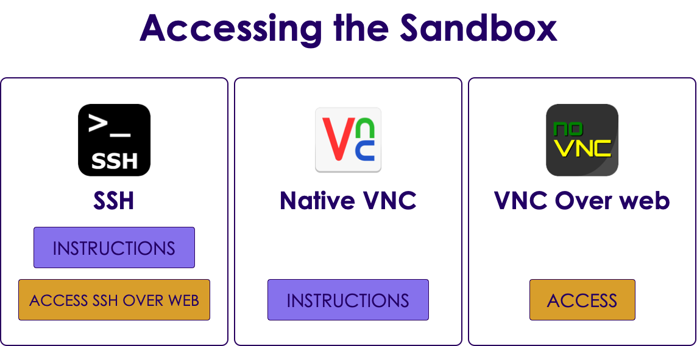

# Machine Learning Lab Prep

---

## Lesson Objectives

 * Getting labs up and running

Notes:

---

## Labs Prep - Step 1: Distribute VMs

 *  **Instructor**

 * Allocate VMs to students in class

 * Point them to IP address of the machine

 * Access the IP address in a browser

 * Make sure they can see the sandbox splash page

<!-- {"left" : 1.49, "top" : 3.53, "height" : 3.54, "width" : 7.28} -->

Notes:

---

## Labs Prep - Step 2: Test Jupyter

 *  **Instructor**

 * Ask students to access Jupyter Labs environment

 * Provide username and password

 * If port 8888 doesn't work, highly likely it is a network issue.  Try the following

     - Disable any VPN software on student's laptop

     - Connect to 'guest' network

     - Try connecting via 'mobile hotspot'

Notes:

---

## Labs Prep - Step 3: Distribute Lab Bundle to Students

 *  **To instructor:**

 * cd to  ml-labs-xxx-yyy

 * Run  ./package-labs.sh

 * This will create a zip file with notebooks and the html content

 * Distribute this bundle to students

 *  **Explain the difference between *.md, *.ipynb, *.html files**

 *  **To students**

 * Students can open *.html files in browser to see lab instructions

 * If they have Jupyter environment setup, they can run ./run-jupyter.sh and view the notebooks

Notes:

---

## Lab Prep - Step 4: Setup

 *  **Overview**: 
 
     - Setting up the environment

 *  **Approximate time**:
 
     - 10 mins

 *  **Instructions**: 
  
     - Follow  ' **setup.html** '  file in the lab bundle

Notes:

---

## Lab Prep - Step 5:  Testing123

 *  **Overview**: 
 
     - Testing the environment

 *  **Approximate time**: 
 
     - 5 mins

 *  **Instructions**:

     - Testing123

Notes:

---

## Jupyter - Interactive Notebook

 * Jupyter is like the newspapers in ‘Harry Potter’ => they are live !

 * [https://www.youtube.com/watch?v=xaBEFqFVSE8](https://www.youtube.com/watch?v=xaBEFqFVSE8)

<!-- {"left" : 2.14, "top" : 2.63, "height" : 3.78, "width" : 5.98} -->

Notes:

https://www.youtube.com/watch?v=xaBEFqFVSE8

---

## Lab Prep - Step 6 : Jupyter

 *  **Instructor**

 * Survey students if they have used Jupyter notebooks before.

 * If not, demo ' **Hello Jupyter** ' lab.

 * Explain how Jupyter works

<!-- {"left" : 2.07, "top" : 3.07, "height" : 3.3, "width" : 6.1} -->

Notes:
