# Spark Machine Learning Overview
---


## Lesson Objectives


 * Understand Spark ML library


Notes:

---

# Introduction

---

## Spark Illustrated

<!-- {"left" : 0.74, "top" : 1.52, "height" : 4.93, "width" : 8.77} -->


Notes:

See the next slide for a brief explanation of each component


---

## History of Machine Learning @ Scale


 * Hadoop
     - Hadoop is the first popular distributed platform
     - MapReduce is the execution engine
     - Did great at batch computes
     - 'Mahout' is a machine learning library built on top of Hadoop's MapReduce
     - Not so great for iterative algorithms (machine learning)
 * Spark
     - Execution engine is faster than MapReduce (less overhead)
        - Iterative algorithms work well
     - Native Machine Learning library that has many algorithms implemented
     - Support in-memory computations (very fast and great for iterative computes)

Notes:


---

## Spark ML Features


 * Implements many popular algorithms  (classifications, clustering, regressions, collaborative filtering)
     - All parallelized out of the box!

 * Utilities: Linear algebra, statistics, data handling
 
 * Feature Engineering : feature extraction / transformation / dimensionality reduction / selection

 * Pipelines: create, evaluate and tune Pipeline

 * Persistence: saving and loading of algorithms/models/pipelines

 * Multi Language support: Python / Java / Scala / R
     - Equal coverage!

Notes:


---

## MLLib => ML

* **Spark.mllib** contains the original API built on top of RDDs

* MLLib has been migrating to a new API called Spark.ML

* **Spark.ml** provides higher-level API built on top of Dataframes for constructing ML pipelines

    - Dataframes provide faster data access, better caching ..etc

* As of Spark v2.0, RDD based spark.mllib package is in maintenance mode (no new features, bug fixes only)
    - May be removed in Spark v3


Notes:


---

## Streamlining Prototyping -> deploy


  * Data scientists might work on laptop using  R/Python
  * Now they want to deploy this at scale, how ever the infrastructure is in Java/Scala
  * How?
    - Usually need to re-code it in Java/Scala
    - Extra work
    - Different code path
    - Possible bugs!
    - Updating models is slow!

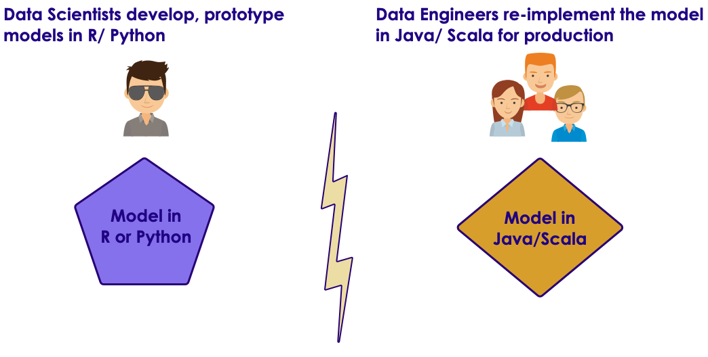<!-- {"left" : 1.47, "top" : 0.95, "height" : 3.69, "width" : 7.3} -->


Notes:

* https://www.slideshare.net/julesdamji/apache-spark-mllib-2x-how-to-productionize-your-machine-learning-models


---

## Streamlining Prototyping -> deploy


* Spark ML has a simple solution:
    - Save the model from laptop 
    - Load the saved model on production and deploy
* Saved format language neutral (json + parquet)
* Same model – no need to re-implement
* Fast deploy!

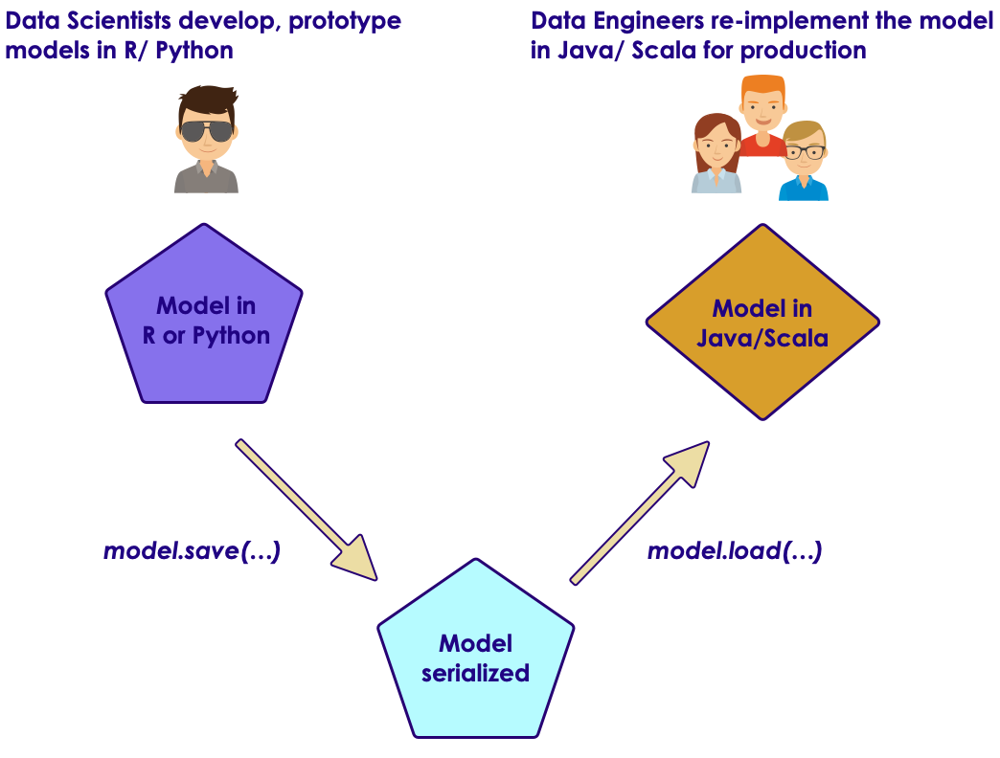<!-- {"left" : 2.69, "top" : 1.02, "height" : 3.7, "width" : 4.88} -->

Notes:

* https://www.slideshare.net/julesdamji/apache-spark-mllib-2x-how-to-productionize-your-machine-learning-models


---

## ML Algorithm overview

<!-- {"left" : 1.11, "top" : 1.42, "height" : 5.13, "width" : 8.04} -->


Notes:


---

# ML Data Types And Utilities

---

## ML Vectors


 * One dimensional array of Numerics / Doubles

 *  **DenseVector**

    When most positions in the vector have value

 *  **SparseVector**

    When most elements have no value

<!-- {"left" : 2.27, "top" : 3.64, "height" : 3.21, "width" : 5.72} -->


Notes:


---

## DenseVector vs. Spark Vector

 * DenseVector = simply an array[1,  2,  3,  4,  5]
 * SparseVector
     - We specify size
     - Index array
     - and value array
 * Vectors.sparse (length,   index array,   value array)  
   Vectors.sparse(10,  (0,9),   (100,200) )
     - Size is 10
     - 0<sup>th</sup>  (first) element  = 100
     - 9<sup>th</sup>  (last) element = 200
     - [ 100. 0. 0. 0. 0. 0. 0. 0. 0. 200.]

Notes:


---

## Creating Vectors (Scala)

* We use  **Vectors**  class to create dense or sparse vectors

```scala
import org.apache.spark.ml.linalg.{Vector, Vectors}

// Create a dense vector (1.0, 0.0, 3.0).
val dv: Vector = Vectors.dense(1.0, 0.0, 3.0)

// Create a sparse vector (1.0, 0.0, 3.0) by specifying its indices
//  and values corresponding to nonzero entries.
val sv1: Vector = Vectors.sparse(3, Array(0, 2), Array(1.0, 3.0))

// Create a sparse vector (1.0, 0.0, 3.0) by specifying its nonzero entries.
val sv2: Vector = Vectors.sparse(3, Seq((0, 1.0), (2, 3.0)))

```
<!-- {"left" : 0, "top" : 1.69, "height" : 1.54, "width" : 10.25} -->


Notes:


---

## Creating Vectors (Python)

 * We use  **Vectors**  class to create dense or sparse vectors

```python
from pyspark.ml.linalg import Vectors

v1 = Vectors.dense(3,2,1)
print(v1)
# [3.0,  2.0,   1.0]

## sparse (size of array,  indexe array,  value array)
v2 = Vectors.sparse(10, (0, 9), (100, 200))
print(v2) # (10,[0,9],[100.0,200.0])

print(v2.toArray())
# [ 100.    0.    0.    0.    0.    0.    0.    0.    0.  200.]

```
<!-- {"left" : 0, "top" : 1.86, "height" : 3.13, "width" : 10.25} -->


Notes:


---

# ML Utilities

---

## Splitting Data Into Training / Test Subsets


 *  **Dataframe.randomSplit**  **(weights)**

 *  **Dataframe.randomSplit**  **(weights, seed)**

     - Use the 'seed' to consistent split

 * Weights should add up to 1.0

```python
# 70% for training,  30% for testing
(train, test) = df.randomSplit( [0.7, 0.3])

## specify a seed to get reproduceable splits
## seed is any integer
(train, test) = df.randomSplit( [0.7, 0.3], seed=123)

```

Notes:


---

## Training / Test Split  Code (Python)

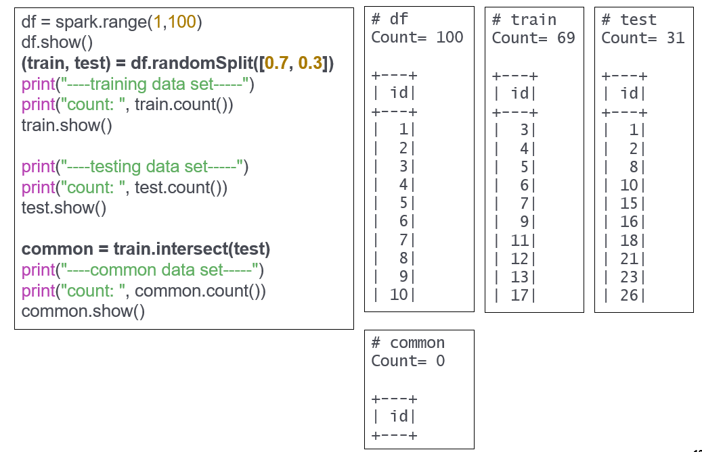<!-- {"left" : 1.02, "top" : 1.34, "height" : 5.3, "width" : 8.21} -->


Notes:


---

# ML Transformers

---

## Transformers


 * A Transformer is an algorithm which can transform one DataFrame into another DataFrame.

 * E.g., an ML model is a Transformer which transforms a DataFrame with features into a DataFrame with predictions.

 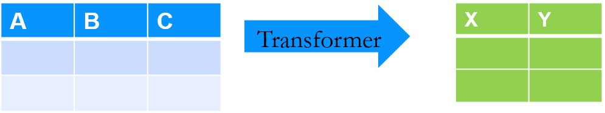<!-- {"left" : 0.94, "top" : 3.89, "height" : 1.57, "width" : 8.38} -->


Notes:


---

## Vector Assembler
* Transforms a Dataframe To Another Dataframe
    - By adding (or appending) to a “features” column

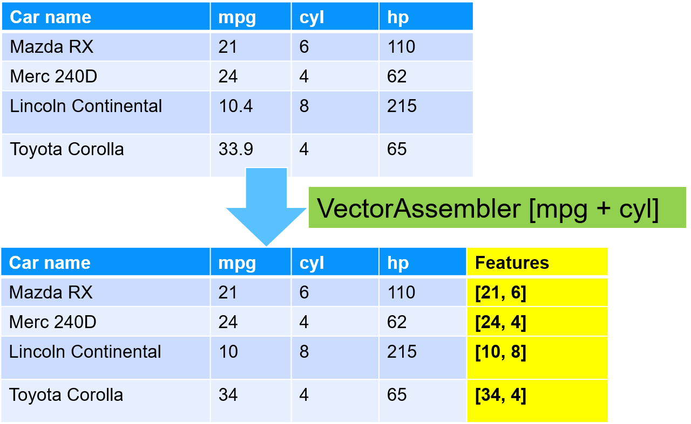<!-- {"left" : 1.02, "top" : 2.08, "height" : 5.05, "width" : 8.21} -->


---

## VectorAssembler Example Code (Python)


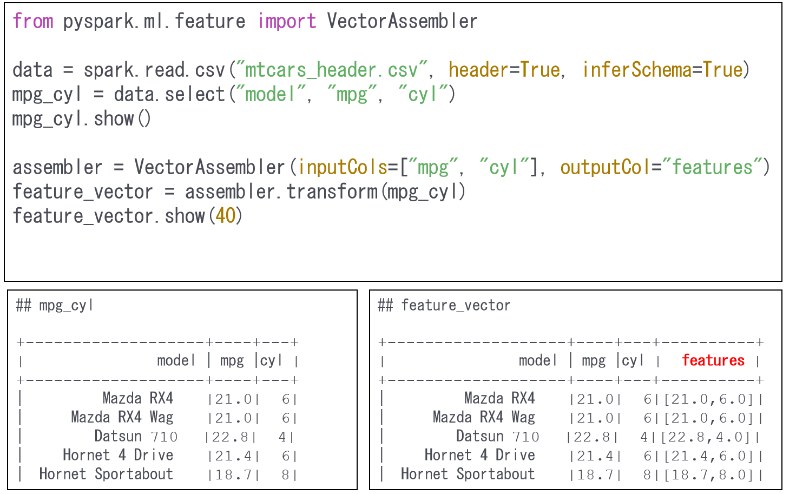<!-- {"left" : 0.64, "top" : 1.2, "height" : 5.57, "width" : 8.98} -->

Notes:


---

## String Indexer


 * Converts string based values into numeric values

 * Numeric values are in [0, Number of Labels-1]

 * Most frequently used label gets 0 and so on

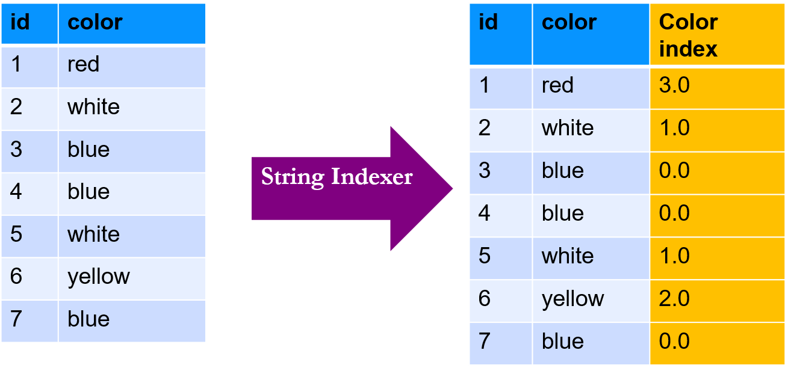<!-- {"left" : 1.02, "top" : 2.73, "height" : 3.84, "width" : 8.21} -->


Notes:


---

## String Indexer Example Code (Python)

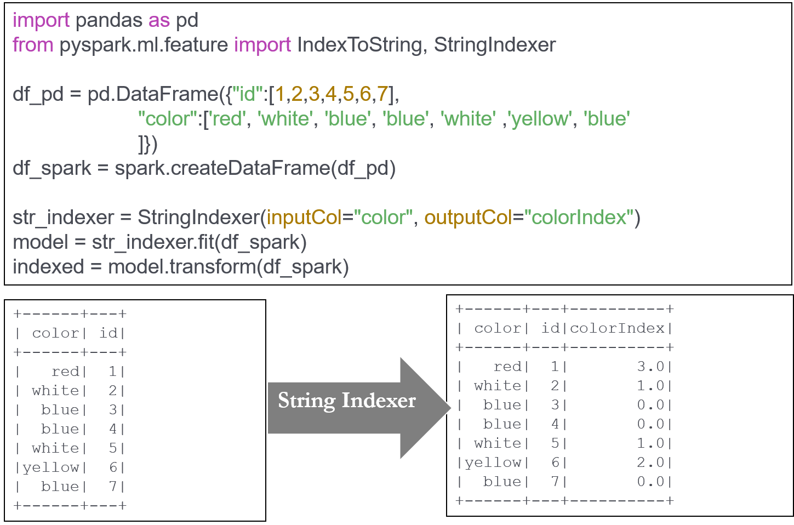<!-- {"left" : 0.71, "top" : 1.07, "height" : 5.84, "width" : 8.83} -->


Notes:


---

## Reverse String Indexer Example Code (Python)

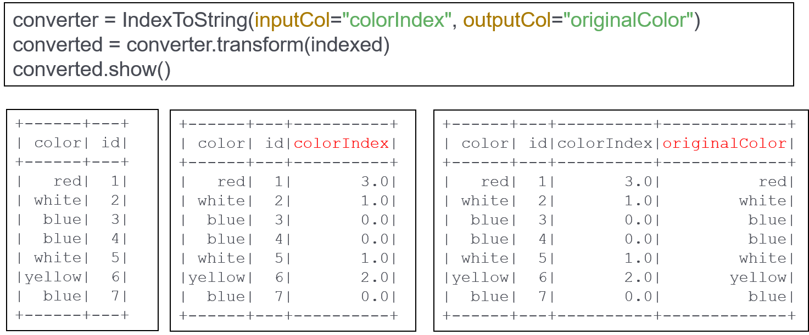<!-- {"left" : 0.51, "top" : 1.83, "height" : 3.83, "width" : 9.22} -->


Notes:


---

## One Hot Encoding


 * Most ML algorithms need numeric data
 * So we need to convert categorical / string data into numerical data before training the model
 * Below we see two approaches of encoding 'marital status' data
 * The one in middle has various indexes
 * The one in right creates 'dummy variables' and assigns  true / false to each.
     - Note, only one bit is on
     - This is called  **ONE-HOT-Encoding**   
     
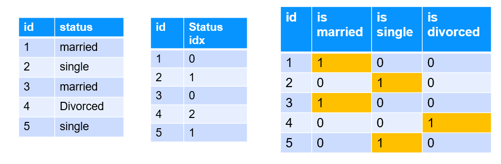<!-- {"left" : 1.48, "top" : 4.84, "height" : 2.4, "width" : 7.3} -->


Notes:


---

## Hot Encoder Code (Python)


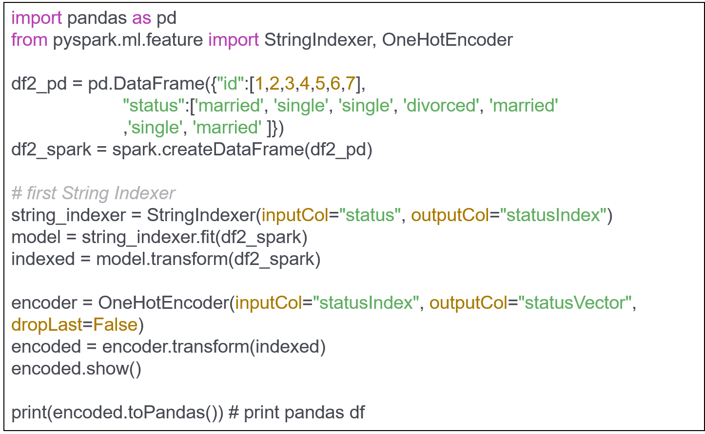<!-- {"left" : 0.84, "top" : 1.35, "height" : 5.28, "width" : 8.57} -->


Notes:


---

## Hot Encoder Code (Python)


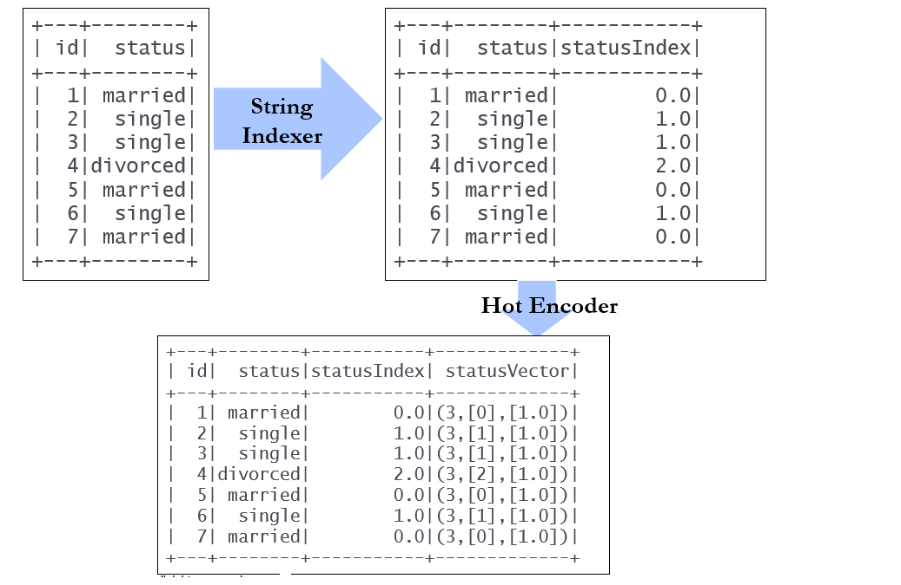<!-- {"left" : 1.01, "top" : 1.06, "height" : 5.85, "width" : 8.99} -->


Notes:


---

## Understanding Hot Encoded Sparse Vectors


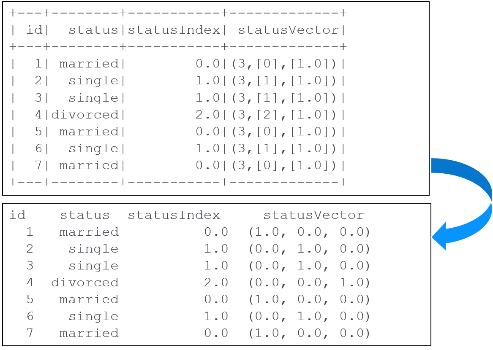<!-- {"left" : 1.02, "top" : 1.07, "height" : 5.84, "width" : 8.21} -->


Notes:


---

## Scaling Data


 * Sometimes we want to scale input data, so the algorithms produce better results

 * Scaling prevents against features with very large variances exerting an overly large influence during model training.

 * Consider the following dataSalary with its larger range, might influence the outcome more

 *  Scaling can improve the convergence rate during the optimization process

 * Spark ML has  - Standard Scaler and - MinMax Scaler

| Age | Salary  |
|-----|---------|
| 20  | 50,000  |
| 23  | 65,000  |
| 40  | 100,000 |
| 35  | 86,000  |
| 30  | 75,000  |

Notes:


---

## Scaling: Standard Scalar


 *  **StandardScaler**  standardizes features by scaling to unit variance and around mean (can be zeroed optionally)

 * Uses column summary statistics on the samples in the training set

 * This is a very common pre-processing step

Notes:


---

## Standard Scaler Code 1/2- Python


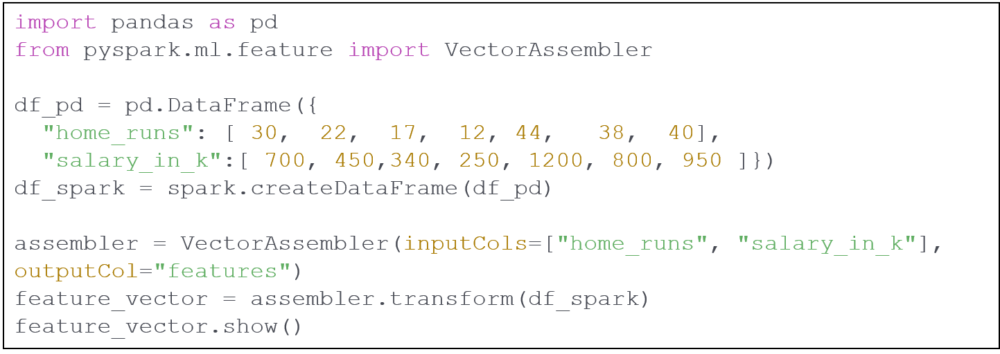<!-- {"left" : 1.02, "top" : 0.99, "height" : 2.91, "width" : 8.21} -->


```text
+---------+-----------+-------------+
|home_runs|salary_in_k|     features|
+---------+-----------+-------------+
|       30|        700| [30.0,700.0]|
|       22|        450| [22.0,450.0]|
|       17|        340| [17.0,340.0]|
|       12|        250| [12.0,250.0]|
|       44|       1200|[44.0,1200.0]|
|       38|        800| [38.0,800.0]|
|       40|        950| [40.0,950.0]|
+---------+-----------+-------------+

```
<!-- {"left" : 0, "top" : 3.95, "height" : 3.18, "width" : 6.94} -->


Notes:


---

## Standard Scaler Code 2/2- Python


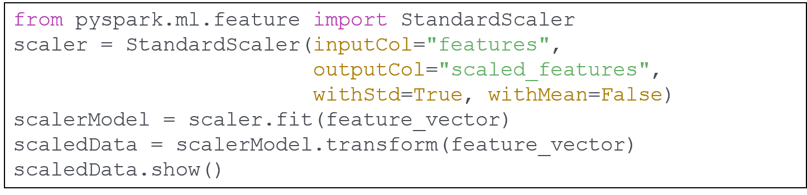<!-- {"left" : 0.3, "top" : 1.04, "height" : 2.34, "width" : 9.64} -->


```text
+---------+-----------+-------------+---------------------------------------+
|home_runs|salary_in_k|features     |scaled_features                        |
+---------+-----------+-------------+---------------------------------------+
|30       |700        |[30.0,700.0] |[2.435993828823451,2.03376119068933]   |
|22       |450        |[22.0,450.0] |[1.7863954744705306,1.3074179083002835]|
|17       |340        |[17.0,340.0] |[1.3803965029999554,0.987826864049103] |
|12       |250        |[12.0,250.0] |[0.9743975315293804,0.7263432823890463]|
|44       |1200       |[44.0,1200.0]|[3.572790948941061,3.4864477554674225] |
|38       |800        |[38.0,800.0] |[3.085592183176371,2.324298503644948]  |
|40       |950        |[40.0,950.0] |[3.2479917717646014,2.760104473078376] |
+---------+-----------+-------------+---------------------------------------+

```
<!-- {"left" : 0, "top" : 3.67, "height" : 2.4, "width" : 10.25} -->

Notes:


---

## Scaling : MinMaxScaler


 * MinMax Scaler allows you to scale data at arbitrary range – 0.0 to 1.0 is default or  0 to 100)

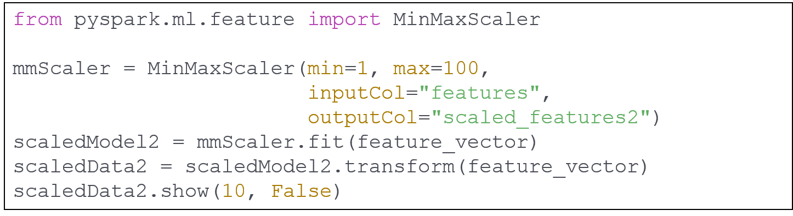<!-- {"left" : 0.3, "top" : 1.92, "height" : 2.64, "width" : 9.64} -->


```text
+---------+-----------+-------------+-----------------------------+
|home_runs|salary_in_k|features     |scaled_features2             |
+---------+-----------+-------------+-----------------------------+
|30       |700        |[30.0,700.0] |[56.6875,47.89473684210526]  |
|22       |450        |[22.0,450.0] |[31.9375,21.842105263157894] |
|17       |340        |[17.0,340.0] |[16.46875,10.378947368421054]|
|12       |250        |[12.0,250.0] |[1.0,1.0]                    |
|44       |1200       |[44.0,1200.0]|[100.0,100.0]                |
|38       |800        |[38.0,800.0] |[81.4375,58.31578947368421]  |
|40       |950        |[40.0,950.0] |[87.625,73.94736842105263]   |
+---------+-----------+-------------+-----------------------------+

```
<!-- {"left" : 0, "top" : 4.58, "height" : 2.76, "width" : 10.25} -->

Notes:


---

## Creating Vectors From Text


 * TF/IDF: Term Frequency/Inverse Document Frequency

     - This essentially means the frequency of a term divided by its frequency in the larger group of documents (the “corpus”)

     - Each word in the corpus is then a “dimension” – you would have thousands of dimensions.

 * Word2Vec

     - Created at Google

Notes:


---

## Spark ML Workflow

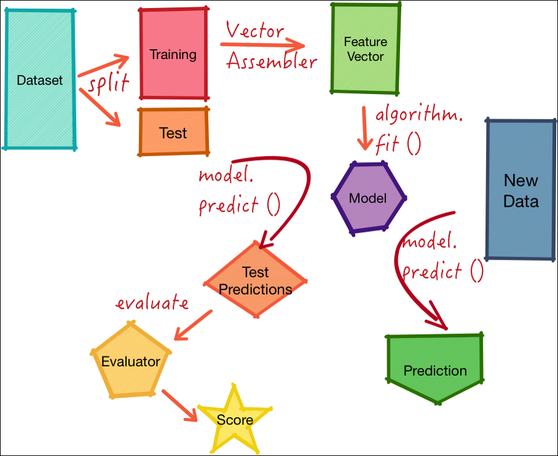<!-- {"left" : 1.05, "top" : 1.07, "height" : 5.83, "width" : 8.14} -->


Notes:


---

## Lab 5.1: ML Basics


 *  **Overview**:

     - Get familiar with ML APIs in Spark

 *  **Approximate time**:
 
     - 10 – 15 mins

 *  **Instructions**:

     -  **5.1: 'basics/spark-ml-basics'** lab for Scala / Python


Notes:


---

# Pipelines

---

## ML Pipelines


 * Spark ML Pipelines is a powerful concept combining multiple steps to be carried out as a single unit

     - Reusable, repeatable

     - Makes very modular code

 * This feature is modelled after the Python 'Scikit.Learn' pipeline feature

 * Also allows tuning various parameters of the pipeline.'Hyper Tuning'

Notes:


---

## Pipeline Example


 * Imagine a text processing task.

 * On left are individual steps

 * On right we create a pipeline encompassing multiple steps

 * This pipeline is re-useable by other programs too!

```python
# text processing

df1 = spark.read(...)

# step1 - lower case the text
df2 = df1.lowercase()

# step2 - remove numbers / punctuations
df3 = df2.removeNumbersPunct()

# step3 – break into words
df4 = df3.splitIntoWords()

# step4 – create word vectors
df5 = df4.word2Vec()

# process df5

```
<!-- {"left" : 0, "top" : 2.98, "height" : 4.21, "width" : 6.43} -->

Notes:

---
## Pipeline Example

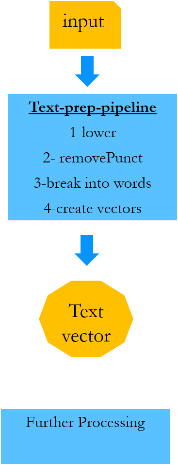<!-- {"left" : 4.17, "top" : 1.5, "height" : 4.98, "width" : 1.91} -->


Notes:


---

## Pipeline Concepts


 *  **Dataframe**: Contains data
 *  **Transformer**: Converts one dataframe into another

<!-- {"left" : 3.35, "top" : 1.86, "height" : 0.81, "width" : 4.32} -->

 *  **Estimator**: fits the data in Dataframe to create a transformer.
     - E.g. a learning model is an estimator

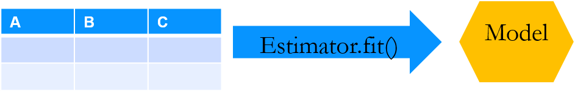<!-- {"left" : 3.31, "top" : 3.74, "height" : 0.7, "width" : 4.4} -->


 *  **Pipeline**: Contains multiple Transformers and Estimators
 *  **Parameter**: Parameters can be passed uniformly to all components within a pipeline

Notes:


---

## Pipeline Example Code (Python)


 * Here we are creating a pipeline consisting of 3 stages
     - Tokenizer:  breaks text into words
     - HashingTF: converts words into Vector
     - And finally, a LogisticRegression model
 * Also note, we train the model on the  **entire**  pipeline in one go!

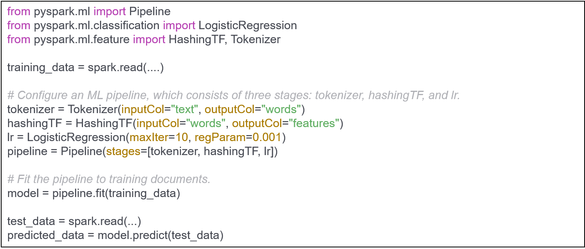<!-- {"left" : 1.02, "top" : 3.5, "height" : 3.51, "width" : 8.21} -->


Notes:


---

## Pipeline Explained


 * 3 stage pipeline shown

 * First two (Tokenizer, hashingTF) are transformers (blue),  third LogisticRegression is estimator (red)

 * Pipeline executes 'transform' on first two and 'fit' on Logistic Regression

<!-- {"left" : 0.98, "top" : 3.87, "height" : 2.12, "width" : 8.29} -->


Notes:

 photo courtesy of  spark.apache.org


---

## Further Reading


 * [http://spark.apache.org/docs/latest/ml-guide.html](http://spark.apache.org/docs/latest/ml-guide.html)

 * [https://www.slideshare.net/julesdamji/apache-spark-mllib-2x-how-to-productionize-your-machine-learning-models](https://www.slideshare.net/julesdamji/apache-spark-mllib-2x-how-to-productionize-your-machine-learning-models)

Notes:
