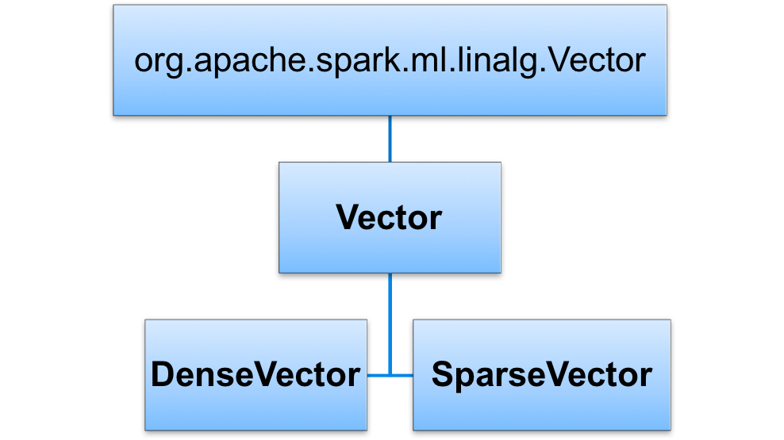

# Session: Machine Learning in Spark
---


## Lesson Objectives


 * Understand some of the basics of Machine Learning (ML)

 * Learn how Spark MLlib supports ML

 * Become familiar with some of the algorithms in MLlib

Notes:

---

# Introduction

---

## Spark Illustrated


Notes:

See the next slide for a brief explanation of each component


---

## History of Machine Learning @ Scale


 * Hadoop

     - Hadoop is the first popular distributed platform

     - MapReduce is the execution engine

     - Did great at batch computes

     - 'Mahout' is a machine learning library built on top of Hadoop's MapReduce

     - Not so great for iterative algorithms (machine learning)

---

## History of Machnie Learning @ Scale

 * Spark

     - Native Machine Learning component

     - Execution engine is faster than MapReduce (less overhead)

     - Iterative algorithms work well

     - Support in-memory computations (very fast and great for iterative computes)

Notes:


---

## Spark ML Features


 * Wide variety of algorithms  (classifications, clustering, regressions, collaborative filtering)

     - All parallelized out of the box!

 * Featurization: feature extraction / transformation / dimensionality reduction / selection

 * Pipelines: create, evaluate and tune Pipeline

 * Persistence: saving and loading of algorithms/models/pipelines

 * Utilities: Linear algebra, statistics, data handling

 * Multi Language support: Python / Java / Scala / R

     - Equal coverage!

Notes:


---

## MLLib => ML

* Spark.mllib contains the original API built on top of RDDs

* MLLib has been migrating to a new API called Spark.ML

* **Spark.ml** provides higher-level API built on top of Dataframes for constructing ML pipelines

    - Dataframes provide faster data access, better caching ..etc

* As of Spark v2.0, RDD based spark.mllib package is in maintenance mode (no new features, bug fixes only)

    - Removed in Spark v3.0


Notes:


---

## Streamlining Prototyping -> deploy


  * Extra work
  * Different code path
    - Possible bugs!
  * Updating models is slow!


Notes:

* https://www.slideshare.net/julesdamji/apache-spark-mllib-2x-how-to-productionize-your-machine-learning-models


---

## Streamlining Prototyping -> deploy


* Language neutral

* Same model – no need to re-implement

* Fast deploy!


Notes:

* https://www.slideshare.net/julesdamji/apache-spark-mllib-2x-how-to-productionize-your-machine-learning-models


---

## ML Algorithm overview


Notes:


---

# ML Data Types And Utilities

---

## ML Vectors


 * One dimensional array of Numerics / Doubles

 *  **DenseVector**

    When most positions in the vector have value

 *  **SparseVector**

    When most elements have no value



Notes:


---

## DenseVector vs. Spark Vector


 * DenseVector = simply an array[1,  2,  3,  4,  5]

 * SparseVector

     - We specify size

     - Index array

     - and value array

 * Vectors.sparse (length,   index array,   value array)

    Vectors.sparse(10,  (0,9),   (100,200) )

     - Size is 10

     - 0<sup>th</sup>  (first) element  = 100

     - 9<sup>th</sup>  (last) element = 200

     - [ 100. 0. 0. 0. 0. 0. 0. 0. 0. 200.]

Notes:


---

## Creating Vectors (Scala)

* We use  **Vectors**  class to create dense or sparse vectors

```text
import org.apache.spark.ml.linalg.{Vector, Vectors}

// Create a dense vector (1.0, 0.0, 3.0).
val dv: Vector = Vectors.dense(1.0, 0.0, 3.0)

// Create a sparse vector (1.0, 0.0, 3.0) by specifying its indices and values corresponding to nonzero entries.
val sv1: Vector = Vectors.sparse(3, Array(0, 2), Array(1.0, 3.0))

// Create a sparse vector (1.0, 0.0, 3.0) by specifying its nonzero entries.
val sv2: Vector = Vectors.sparse(3, Seq((0, 1.0), (2, 3.0)))

```


Notes:


---

## Creating Vectors (Python)

 * We use  **Vectors**  class to create dense or sparse vectors

```
from pyspark.ml.linalg import Vectors

v1 = Vectors.dense(3,2,1)
print(v1)
# [3.0,  2.0,   1.0]

## sparse (size of array,  indexe array,  value array)
v2 = Vectors.sparse(10, (0, 9), (100, 200))
print(v2) # (10,[0,9],[100.0,200.0])

print(v2.toArray())
# [ 100.    0.    0.    0.    0.    0.    0.    0.    0.  200.]

```


Notes:


---

# ML Utilities

---

## Splitting Data Into Training / Test Subsets


 *  **Dataframe.randomSplit**  **(weights)**

 *  **Dataframe.randomSplit**  **(weights, seed)**

     - Use the 'seed' to consistent split

 * Weights should add up to 1.0

```text
(train, test) = df.randomSplit( [0.7, 0.3])

```

Notes:


---

## Training / Test Split  Code (Python)


Notes:


---

# ML Transformers

---

## Transformers


 * A Transformer is an algorithm which can transform one DataFrame into another DataFrame.

 * E.g., an ML model is a Transformer which transforms a DataFrame with features into a DataFrame with predictions.

 


Notes:


---

## Vector Assembler
* Transforms a Dataframe To Another Dataframe
    - By adding (or appending) to a “features” column


---

## VectorAssembler Example Code (Python)


Notes:


---

## String Indexer


 * Converts string based values into numeric values

 * Numeric values are in [0, Number of Labels-1]

 * Most frequently used label gets 0 and so on


Notes:


---

## String Indexer Example Code (Python)


Notes:


---

## Reverse String Indexer Example Code (Python)


Notes:


---

## One Hot Encoding


 * Most ML algorithms need numeric data

 * So we need to convert categorical / string data into numerical data before training the model

 * Below we see two approaches of encoding 'marital status' data

 * The one in middle has various indexes

 * The one in right creates 'dummy variables' and assigns  true / false to each.

     - Note, only one bit is on

     - This is called  **ONE-HOT-Encoding**   


Notes:


---

## Hot Encoder Code (Python)


Notes:


---

## Hot Encoder Code (Python)


Notes:


---

## Understanding Hot Encoded Sparse Vectors


Notes:


---

## Scaling Data


 * Sometimes we want to scale input data, so the algorithms produce better results

 * Scaling prevents against features with very large variances exerting an overly large influence during model training.

 * Consider the following dataSalary with its larger range, might influence the outcome more

 *  Scaling can improve the convergence rate during the optimization process

 * Spark ML has  - Standard Scaler and - MinMax Scaler

| Age | Salary  |
|-----|---------|
| 20  | 50,000  |
| 23  | 65,000  |
| 40  | 100,000 |
| 35  | 86,000  |
| 30  | 75,000  |

Notes:


---

## Scaling: Standard Scalar


 *  **StandardScaler**  standardizes features by scaling to unit variance and around mean (can be zeroed optionally)

 * Uses column summary statistics on the samples in the training set

 * This is a very common pre-processing step

Notes:


---

## Standard Scaler Code 1/2- Python


```text
+---------+-----------+-------------+
|home_runs|salary_in_k|     features|
+---------+-----------+-------------+
|       30|        700| [30.0,700.0]|
|       22|        450| [22.0,450.0]|
|       17|        340| [17.0,340.0]|
|       12|        250| [12.0,250.0]|
|       44|       1200|[44.0,1200.0]|
|       38|        800| [38.0,800.0]|
|       40|        950| [40.0,950.0]|
+---------+-----------+-------------+

```

Notes:


---

## Standard Scaler Code 2/2- Python


```text
+---------+-----------+-------------+---------------------------------------+
|home_runs|salary_in_k|features     |scaled_features                        |
+---------+-----------+-------------+---------------------------------------+
|30       |700        |[30.0,700.0] |[2.435993828823451,2.03376119068933]   |
|22       |450        |[22.0,450.0] |[1.7863954744705306,1.3074179083002835]|
|17       |340        |[17.0,340.0] |[1.3803965029999554,0.987826864049103] |
|12       |250        |[12.0,250.0] |[0.9743975315293804,0.7263432823890463]|
|44       |1200       |[44.0,1200.0]|[3.572790948941061,3.4864477554674225] |
|38       |800        |[38.0,800.0] |[3.085592183176371,2.324298503644948]  |
|40       |950        |[40.0,950.0] |[3.2479917717646014,2.760104473078376] |
+---------+-----------+-------------+---------------------------------------+

```

Notes:


---

## Scaling : MinMaxScaler


 * MinMax Scaler allows you to scale data at arbitrary range – 0.0 to 1.0 is default or  0 to 100)


```text
+---------+-----------+-------------+-----------------------------+
|home_runs|salary_in_k|features     |scaled_features2             |
+---------+-----------+-------------+-----------------------------+
|30       |700        |[30.0,700.0] |[56.6875,47.89473684210526]  |
|22       |450        |[22.0,450.0] |[31.9375,21.842105263157894] |
|17       |340        |[17.0,340.0] |[16.46875,10.378947368421054]|
|12       |250        |[12.0,250.0] |[1.0,1.0]                    |
|44       |1200       |[44.0,1200.0]|[100.0,100.0]                |
|38       |800        |[38.0,800.0] |[81.4375,58.31578947368421]  |
|40       |950        |[40.0,950.0] |[87.625,73.94736842105263]   |
+---------+-----------+-------------+-----------------------------+

```

Notes:


---

## Creating Vectors From Text


 * TF/IDF: Term Frequency/Inverse Document Frequency

     - This essentially means the frequency of a term divided by its frequency in the larger group of documents (the “corpus”)

     - Each word in the corpus is then a “dimension” – you would have thousands of dimensions.

 * Word2Vec

     - Created at Google

Notes:


---

## Spark ML Workflow


Notes:


---

## Lab 5.1: ML Basics


 *  **Overview**:

     - Get familiar with ML APIs in Spark

 *  **Approximate time**:
 
     - 10 – 15 mins

 *  **Instructions**:

     -  **5.1: 'basics/spark-ml-basics'** lab for Scala / Python


Notes:


---

# Pipelines

---

## ML Pipelines


 * Spark ML Pipelines is a powerful concept combining multiple steps to be carried out as a single unit

     - Reusable, repeatable

     - Makes very modular code

 * This feature is modelled after the Python 'Scikit.Learn' pipeline feature

 * Also allows tuning various parameters of the pipeline.'Hyper Tuning'

Notes:


---

## Pipeline Example


 * Imagine a text processing task.

 * On left are individual steps

 * On right we create a pipeline encompassing multiple steps

 * This pipeline is re-useable by other programs too!

```python
# text processing

df1 = spark.read(...)

# step1 - lower case the text
df2 = df1.lowercase()

# step2 - remove numbers / punctuations
df3 = df2.removeNumbersPunct()

# step3 – break into words
df4 = df3.splitIntoWords()

# step4 – create word vectors
df5 = df4.word2Vec()

# process df5

```
---
## Pipeline Example


Notes:


---

## Pipeline Concepts


 *  **Dataframe** : Contains data

 *  **Transformer** : Converts one dataframe into another


 *  **Estimator** : fits the data in Dataframe to create a transformer.

     - E.g. a learning model is an estimator


 *  **Pipeline** : Contains multiple Transformers and Estimators

 *  **Parameter** : Parameters can be passed uniformly to all components within a pipeline

Notes:


---

## Pipeline Example Code (Python)


 * Here we are creating a pipeline consisting of 3 stages

     - Tokenizer:  breaks text into words

     - HashingTF: converts words into Vector

     - And finally, a LogisticRegression model

 * Also note, we train the model on the  **entire**  pipeline in one go!


Notes:


---

## Pipeline Explained


 * 3 stage pipeline shown

 * First two (Tokenizer, hashingTF) are transformers (blue),  third LogisticRegression is estimator (red)

 * Pipeline executes 'transform' on first two and 'fit' on Logistic Regression


Notes:

 photo courtesy of  spark.apache.org


---

## Further Reading


 * [http://spark.apache.org/docs/latest/ml-guide.html](http://spark.apache.org/docs/latest/ml-guide.html)

 * [https://www.slideshare.net/julesdamji/apache-spark-mllib-2x-how-to-productionize-your-machine-learning-models](https://www.slideshare.net/julesdamji/apache-spark-mllib-2x-how-to-productionize-your-machine-learning-models)

Notes:


---

# Backup Slides

---

## Vectors in Spark


Notes:


