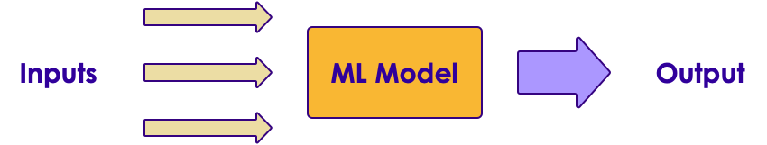
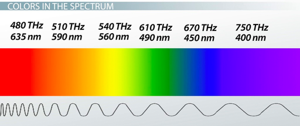
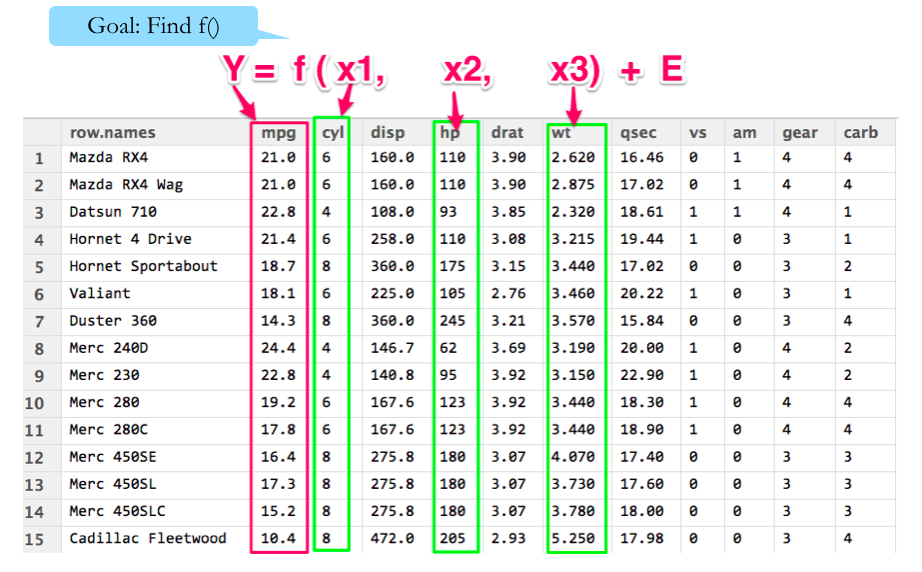

Machine Learning Concepts
======================================
# Machine Learning Terminology
## ML Terminology

| Algorithm                                             	| Example                                     	| Input                                              	| Output                                      |
|-------------------------------------------------	|-----------------------------------------	|----------------------------------------------------	|-------------------------------------	|
| Classification – produces 'discrete' or 'qualitative' 	| Spam or not                                 	|Features   (email text, origin IP address)        	|Label (Spam / Not-Spam)                  |
|                                                       	|                                             	|                                                    	|                                             |
| Regression – produces 'continuous' or 'quantitative'  	| Weather forecasting, predicting temperature 	|Variables (current temperature, pressure ..etc) 	|Target   (predicted temperature -50.5 ' F) 	|

Notes:

---
## Algorithm vs. Model

  * Often Algorithm and Model are used interchangeably
  * Algorithm: Mathematical / statistical formula or methodology
  * Training the algorithm with data yields a model
    - Algorithm + training data -> model
    - Model = Algorithm(data)

 <!-- {"left" : 1.9, "top" : 3.63, "height" : 3.5, "width" : 6.44} -->

Notes:

---
## Algorithm and Model

 <!-- {"left" : 0.63, "top" : 1.2, "height" : 5.44, "width" : 8.98} -->

Notes:

---
## Model

  * We can treat ML model as a 'black box'
  * Input goes in,  model produces an output
  * **'Model'**:
    - Mathematical object describing the relationship between input and output

 <!-- {"left" : 0.53, "top" : 3.99, "height" : 1.68, "width" : 9.19} -->

Notes:

---
# Feature Engineering

## Feature Engineering

  * **Feature Engineering:**
    - *"Using transformations of raw input data to create new features to be used in ML model"*

  * Feature Engineering examples
    - Join two database tables to have all data in one place
    - Convert to same units of measurements  (imperial to metric)
    - Enriching data by combining with other data sources e.g. combining house sales prices with census data

Notes:

---
## Features To Consider: Class Quiz

  * Assume we are evaluating a credit card application
  * **Q: What data points to consider?**
  * **Q: How will you get this data?**

    - For existing customer?
    - For new customer?

| Customer_id | Name | Zipcode | Age | Income | Marital Status | Owns a Home |
|-------------|------|---------|-----|--------|----------------|-------------|
| 1           | Joe  | 11111   | 24  | 45,000 | Single         | No          |
| 2           | Jane | 22222   | 34  | 84,000 | Married        | Yes         |

<!-- {"left" : 0.25, "top" : 3.63, "height" : 1.69, "width" : 9.75} -->

Notes:

---
## Feature Extraction

  * Here is a sample data for credit card applications
  * Our algorithm only uses selected input (features) to determine credit worthiness
  * Here 'name' and 'zipcode' aren't considered

## Feature Extraction

| Customer_id | Name | Zipcode | Age | Income | Marital Status | Owns a Home |
|-------------|------|---------|-----|--------|----------------|-------------|
| 1           | Joe  | 11111   | 24  | 45,000 | Single         | No          |
| 2           | Jane | 22222   | 34  | 84,000 | Married        | Yes         |

<!-- {"left" : 0.26, "top" : 0.86, "height" : 1.7, "width" : 9.75, "columnwidth" : [1.39, 1.39, 1.39, 1.39, 1.39, 1.39, 1.39]} -->

 <!-- {"left" : 1.83, "top" : 2.67, "height" : 0.79, "width" : 3.49} -->

|             |      |         | Age | Income | Marital Status | Owns a Home |
|-------------|------|---------|-----|--------|----------------|-------------|
|             |      |         | 24  | 45,000 | Single         | No          |
|             |      |         | 34  | 84,000 | Married        | Yes         |

<!-- {"left" : 0.26, "top" : 3.54, "height" : 1.7, "width" : 9.75, "columnwidth" : [1.39, 1.39, 1.39, 1.39, 1.39, 1.39, 1.39]} -->

 <!-- {"left" : 1.89, "top" : 5.45, "height" : 1.59, "width" : 7.98} -->

Notes:

---
## Categorical Variables

  * Some of the variables have string content
  * Example: Marital Status / Owns a Home
  * Feature vectors must be numeric.
  * We have to convert the variable to a numeric value.
  * Example:  `”Owns A Home” -> 0 = No, 1 = Yes`
  * Categorical Variables are essentially structured data, despite being strings.
  * Unstructured data would include things like: documents, emails, tweets

 <!-- {"left" : 0.26, "top" : 5.16, "height" : 1.64, "width" : 9.74} -->

Notes:

---
## Encoding Categorical Variables

  * We have to convert our categorical variables into numbers
  * 3 Strategies:
    - Factorization / Indexing
    - One-Hot-Encoding/Dummy Variables
    - Quantization

Notes:

---
## Example of Factorization / Indexing

  * We can convert our string variables into factors / numbers
  * This means we assign a number to each unique value of the column
  * Added benefits
    - Numbers are more efficient to store
    - And compute!

| id | status   |
|----|----------|
| 1  | married  |
| 2  | single   |
| 3  | married  |
| 4  | Divorced |
| 5  | single   |

<!-- {"left" : 1.73, "top" : 4.13, "height" : 2.41, "width" : 1.75, "columnwidth" : [0.45, 1.3]} -->

 <!-- {"left" : 3.96, "top" : 4.27, "height" : 2.14, "width" : 2.34} -->

| id | status idx |
|----|----------  |
| 1  | 0          |
| 2  | 1          |
| 3  | 0          |
| 4  | 2          |
| 5  | 1          |

<!-- {"left" : 6.77, "top" : 4.13, "height" : 2.41, "width" : 1.75, "columnwidth" : [0.45, 1.3]} -->

Notes:

---
## Potential Problems With Factorization / Indexing

  * Some ML algorithms can start interpreting the numbers!
  * In the example below, an ML algorithm can think
    - 2 (Divorced)  >  1 (Single)  > 0 (Married)

  * This can lead to surprising outcomes
  * We can fix this by 'one-hot-encoding' method

| id | status   |
|----|----------|
| 1  | married  |
| 2  | single   |
| 3  | married  |
| 4  | Divorced |
| 5  | single   |

<!-- {"left" : 1.73, "top" : 4.13, "height" : 2.41, "width" : 1.75, "columnwidth" : [0.45, 1.3]} -->

 <!-- {"left" : 3.96, "top" : 4.27, "height" : 2.14, "width" : 2.34} -->

| id | status idx |
|----|----------  |
| 1  | 0          |
| 2  | 1          |
| 3  | 0          |
| 4  | 2          |
| 5  | 1          |

<!-- {"left" : 6.77, "top" : 4.13, "height" : 2.41, "width" : 1.75, "columnwidth" : [0.45, 1.3]} -->

Notes:

---
## Dummy Variables / One-Hot-Encoding

  * Dummy variables can help us treat the different values separately
    - Without trying to infer some relationship between values.
  * 'dummy variables' assigns  true / false to each.
    - Note, only one bit is on
    - This is called **ONE-HOT-Encoding**

 <!-- {"left" : 0.52, "top" : 3.76, "height" : 2.9, "width" : 9.21} -->

Notes:

---
## Quantization

  * Sometimes we do want the ML model to interpret categorical variables
    - Grades :  A > B > C > D
    - Domain specific meaning
  * For example, colors in physics has a numeric meaning:
    - Red: 480 THz frequency of light
    - Green: 600 THz
  * This might allow our models to make inferences
    - e.g., Orange is close to red on the spectrum, but more distant from violet.

 <!-- {"left" : 3, "top" : 4.94, "height" : 2.12, "width" : 5.03} -->

Notes:

Image credit : https://study.com/academy/lesson/the-nature-of-light-origin-spectrum-color-frequency.html

---
## FE: Generating New Dimensions

  * Problem: Comparing house prices
  * Can we say Mountain View is most expensive city?

  * On first table, there is no data point for 'size of the house'
  * May be an 'apples-to-apples' comparison would be 'price per sq. foot'

| City           | House Price   |
|--------        |----------     |
| San Jose       | 800k          |
| Mountain View  | 1,200 k (1.2M)|
| San Francisco  | 1,000 k (1 M) |
| Gilroy         | 700 k         |

<!-- {"left" : 0.49, "top" : 3.62, "height" : 2.01, "width" : 3.6, "columnwidth" : [1.82, 1.78]} -->

 <!-- {"left" : 4.35, "top" : 3.59, "height" : 2.64, "width" : 5.47} -->

Notes:

---
## FE: Group Discussion

  * **Problem:**
    - A comment is left on the website.  Determine if it is a 'spam' comment or legitimate comment

  * **Data we have:**
    - Comment text
    - IP address of user

  * **Discuss:**
    - What other data you may need to determine if the comment is 'spam' ?
    - How can we acquire the data?

Notes:

---
## Converting Word to Vectors

 <!-- {"left" : 0.3, "top" : 1.07, "height" : 5.36, "width" : 9.66} -->

Notes:

---
## FE: Dealing With Time

  * Usually timestamps are stored in two formats:
    - Human readable format: '2017-02-01 14:10:45 PST'
    - Unix timestamp: 1489792175 (time elapsed since 1970-01-01 00:00:00)
  * Sometimes we need to 'slice / dice' timestamp

  * Hypothesis:  
  "On Facebook users click on photos more during lunch time"
    - Include 'time of day' on model calculation

  * Some other interesting attributes:
    - 'time of day'  (work hours,   after hours)
    - 'day of week'  (Mon / Tue / Wed …   work day  / weekend)

  * **Question for class:**
    - Any other time based behavior?

Notes:

Use https://www.epochconverter.com/ to easily convert unix time and human readable time

---
## FE: Incorporating Domain Knowledge

  * Using knowledge acquired in the domain and add that to raw input data. **VERY IMPORTANT**

  * Observation: Online shopping is usually higher on Fridays
    - Include an attribute: 'Day of week'

  * Observation: Spam emails typically come from free email accounts
    - Add 'is free account' field to data

  * **Question for the class:**
    - Can you think of any other examples?

Notes:

---
## Lab 3.4: Exploratory Data Analysis (EDA)

  * **Overview:**
    - Perform EDA on a dataset

  * **Approximate Time:**
    - 10 – 15 mins

  * **Instructions:**
    - **3.4: 'exploration/explore-house-sales' lab for Python / R / Spark**

  * **To Instructor:**
    - Demo this lab on screen first, and explain the results

Notes:

---
## BONUS Lab 3.5: Exploratory Data Analysis (EDA) 2: Graphing And Visualizing

  * **Overview:**
    - Visualize house-sales dataset

  * **Approximate Time:**
    - 10 – 15 mins

  * **Instructions:**
    - **3.5: 'exploration/visualize-house-sales' lab for Python / R / Spark**

  * **To Instructor:**
    - Demo this lab on screen first, and explain the results

Notes:

---
## Bonus Lab 4.1: Feature Engineering

  * **Overview:**
    - Feature engineering exercises

  * **Approximate Time:**
    - 15 – 20 mins

  * **Instructions:**
    - **4.1 'feature-eng' lab for Python / R / Spark**

Notes:

---
# Developing A Model
## Sample Data Set: Cars

  * We want to predict MPG of a car
  * What attributes to consider?

 <!-- {"left" : 0.39, "top" : 2.08, "height" : 4.71, "width" : 9.48} -->

Notes:

---
## Sample Model for Predicting MPG

 <!-- {"left" : 0.02, "top" : 0.74, "height" : 6.36, "width" : 10.25} -->

Notes:

---
## Model Building

  * Designate inputs as X
    - X1: first input  (e.g.  number of cylinders)
    - X2: second input  (e.g. weight of car)
    - Xi: ith input  (e.g. horsepower)
  * Output  / target variable is denoted as Y

  * Our Mathematical model is
    - `Y = f(X) + E`
      - Y: TargetX:
      - Inputs (X1, X2 ..etc)
      - f: function
      - E: error / noise

Notes:

---
## Using the Model

  * Our Model:
    - **MPG  = f  ( cylinders,   horse power,  weight)  + E**

  * **Goal: figure out 'f' from given data**
    - Once we figure out 'f' then we can plug-in values for *cylinders , horse power and weight  and predict MPG*
    - Prediction is the most common use of ML

  * **Inference**
    - Which of the 3 attributes (cylinders / horse power / weight) influences MPG more?
    - Figuring this out might give us insight into better products. *'what is the best way to get best MPG?'*

Notes:

---
## Modeling Techniques (Little Math!)

  * ML model has two types: Parametric / Non-Parametric
  * Parametric models assume a strong 'f'
    - Tend to be simple models
    - May not be very accurate

  * Non-parametric models don't assume a rigid 'f'
    - Adopt to data very well
    - More accurate
    - More difficult to understand than parametric models

Notes:

---
## Parametric vs. Non Parametric

|               	| Parametric                                                                        	| Non Parametric                                                                                                                           	|
|---------------	|-----------------------------------------------------------------------------------	|------------------------------------------------------------------------------------------------------------------------------------------	|
| Advantages    	| - Simpler - Very fast to learn from data - Don't required, a lot of training data 	| -Flexible: can adopt to complex data, -No assumptions about underlying function, -good prediction performance                            	|
| Disadvantages 	| - limited by function - Can not adopt to complex data - Can underfit              	| -Complex to understand and explain, -Require more data for learning,-Slower to train as they have more parameters to tweak, -Canover-fit 	|
| Algorithms    	| - Linear Regression - Logistic Regression - Linear Discriminant Analysis          	| -Decision Trees, -Support Vector Machines, -Naïve Bayes                                                                                  	|
| Best for      	| small size data with previous knowledge of features                               	| when having lots of data and no prior knowledge of features                                                                              	|

Notes:

---
## Parametric vs. Non Parametric

|                         	| Parametric         	| Non Parametric    	|
|-------------------------	|--------------------	|-------------------	|
| Model complexity        	| Simple             	| More complex      	|
| Training speed          	| Fast               	| Slow              	|
| Amount of training data 	| Doesn't need a lot 	| Needs more data   	|
| Explainability          	| Simple to explain  	| Harder to explain 	|
| Fit                     	| under-fit          	| over-fit          	|
| Adopting to data        	| simple data        	| complex data      	|
| Prediction accuracy     	| good               	| better            	|

Notes:

---
# Evaluating A Model
## Data Science Methodology: Iterative Learning Process

 <!-- {"left" : 0.34, "top" : 0.93, "height" : 6.1, "width" : 9.56} -->

Notes:

---
## Evaluating A Model

  * How do we know our model is 'good'?

  * One way to measure the performance, is how well it is predicting on 'new data'
    - Model is trained with 'training data'
    - Measure its performance on 'test data' (the model hasn't seen 'test data')

 <!-- {"left" : 2.87, "top" : 3.47, "height" : 2.88, "width" : 6.57} -->

Notes:

---
## Under-fitting / Over-fitting

  * Here we have 3 models
  * One on left: is not really capturing the essence of the data
    - Underfitting
  * One on right: following every small variation of data, not really generalizing
    - Overfitting
  * One in the middle is just right

  <!-- {"left" : 0.26, "top" : 4.13, "height" : 3.07, "width" : 9.74} -->

Notes:

---
## Under-fitting

  * Model is 'too simple'  to capture the trends in input data
  * Hot to detect under-fitting?
    - We will get poor performance in both training & testing data
    - E.g.:
      - Training accuracy : 45%
      - Testing accuracy : 42%
  * Resolution:
    - Try a different algorithm / model, that better fits the data

 <!-- {"left" : 0.83, "top" : 4.4, "height" : 2.79, "width" : 8.59} -->

Notes:

---
## Over-fitting

  * Model is 'too complex'  that is 'memorizing' training data, but not **'generalizing' for new data**
  * Hot to detect over-fitting?
    - Excellent performance on training data, but poor performance on testing (new) data
    - E.g.:
      - Training accuracy : 95%
      - Testing accuracy : 62%
  * Resolution:
    - Try a different algorithm / model, that better fits the data
    - Simplify inputs

 <!-- {"left" : 3.67, "top" : 5.07, "height" : 2.13, "width" : 6.38} -->

Notes:

---
## Achieving a Good Fit

  * In ML we strive to find the 'sweet spot' between under-fitting models and over-fitting models

 <!-- {"left" : 1.4, "top" : 1.97, "height" : 5.08, "width" : 6.96} -->

Notes:

---
## Achieving a Good Fit

  * Both overfitting and underfitting can lead to poor model performance

  * underfitting is easier to spot
    - Bad performance on training data
    - Bad performance on test data

  * Overfitting can be hard to spot
    - because it performs well on training data
    - But doesn't do well on 'unseen' test data

  * Avoiding overfitting
    - Resampling technique
    - Hold back a validation dataset
    - Most popular method is: k-fold validation (more on this later)

  * For **decision trees**, we **prune** the tree to limit overfitting

Notes:

---
# Cross Validation

## Common Mistakes in Model Validation

  * **Mistake: Re-using 'training data' as 'testing data'**
    - Model can predict accurately on testing (because it has 'seen' the data before)
    - Giving the designer 'false confidence'
    - But will do badly on new data

  * Solution:
    - **Cross Validation**

## Common Mistakes in Model Validation

  * **Mistake: Using overly simplistic validation methods**
    - Model might appear to be working well

  * **Mistake: Using more parameters (20 attributes) than actual observations (10 observations)**
    - Model will 'memorize' the data rather than learning
    - Will do well on testing data / but poorly on new data

  * Solution:
    - Use more data

Notes:

---
## Hold Out Method (Validation Set)

  * Do not use the same data for training and testing!
    - Model will do well in testing (it has seen the questions before!)
  * Separate the data set into
    - Training set  (60-70%)
    - Testing set (30-40%)
  * This is done  randomly

 <!-- {"left" : 2.16, "top" : 3.74, "height" : 2.61, "width" : 5.94} -->

Notes:

---
## Hold Out Method Drawbacks

  * Drawbacks
    - Error rate can significantly fluctuate based on how data is divided (randomly)
    - When we do a randomly split data into training/test
    - If we are 'lucky', we get an easy test set -> resulting in higher than usual accuracy
      - If we are 'unlucky' we get a hard test set -> resulting in lower than usual accuracy

## Hold Out Method Drawbacks

  * Example
    - Assume we want to test a student's knowledge in a subject
    - We have a pool of 20 questions
    - Test 1:
      - Out of 20, we randomly choose 15 questions And the student scores 60%
      - Is this the final score?  No.
      - We need to do more tests and average out the score

  * Solution: k-fold Cross validation
    - Rigorously tests model accuracy

Notes:

---
## K-Fold Cross Validation

  * Divide the data into equal k sections (k folds, usually 10 to 20)
  * Reserve one fold for testing (say fold-i)
  * Use others folds for training
  * Then test with fold-I
  * After we have cycled through all k folds, prediction accuracies are aggregated and compared

 <!-- {"left" : 2.32, "top" : 4.11, "height" : 3.08, "width" : 5.61} -->

Notes:

---
## Cross-Validation Example

 <!-- {"left" : 0.67, "top" : 0.81, "height" : 2.31, "width" : 8.92} -->

  * Here we are doing a 5-fold cross validation
  * Data is split into 5 splits – one held for testing, remaining 4 used for training
  * Accuracy varies from 80% to 90%
    - If the accuracy range is big (say from 40% to 80%) then it might be an indication of high-variance (sensitive to input data)
  * Average accuracy is `AVG(80,84,90,86,82) = 85%`

Notes:

---
## Cross Validation Takeaways

  * We don't choose the 'best performing model' from CV
    - CV is used to understand a particular algorithm's performance for the given data
    - And how well it can generalize to new data

  * Pros
    - Helps us systematically tests a model through the data
    - Can identify high-variance / over-fitting models

  * Cons
    - Increased compute time to create multiple models and test
      - Solution: run CV tasks in parallel across multiple CPU-cores or on a cluster (embarrassingly parallelizable problem)

Notes:

---
# Bootstrapping
## Bootstrap

  * Randomly selecting data for training with replacement
  * It may seem counter-intuitive to draw the same data again and again
  * But in some scenarios, bootstrapping really helps to train the model
  * See next slides to understand sampling with and without replacement

Notes:

---
## Sampling Without Replacement

 <!-- {"left" : 1.5, "top" : 1.16, "height" : 5.85, "width" : 7.25} -->

Notes:

---
## Sampling With Replacement (aka Bootstrapping)

 <!-- {"left" : 2.33, "top" : 1.21, "height" : 5.56, "width" : 5.59} -->

Notes:

---
## Bootstrapping Example 1

  * Data points : [a, b, c, d, e ]
  * Bootstrap selection 1 : [  b,  d,  d,   c ]
  * Bootstrap selection 2 : [ d,  a, d,  a ]

Notes:

---
## Bootstrapping Example 2

 <!-- {"left" : 0.39, "top" : 1.75, "height" : 4.01, "width" : 9.48} -->

Notes:

---
# Errors / Residuals

## Problem : Estimating Tips for Meals

  * A waiter at a restaurant is collecting data on tips
  * Usually tips correspond to total of the bill.
  * Higher the bill -> higher the tip
  * But in this case, bill total is missing, we only have tip amounts
  * How can we predict the tip amount for next meal?

| Meal # | Tip ($)  |
|--------|----------|
| 1      | 12       |
| 2      | 7        |
| 3      | 13       |
| 4      | 8        |
| 5      | 15       |
| 7      | 5        |

<!-- {"left" : 0.25, "top" : 3.57, "height" : 3.5, "width" : 9.75} -->

Notes:

https://www.youtube.com/playlist?list=PLIeGtxpvyG-LoKUpV0fSY8BGKIMIdmfCi

---
## Tip Calculation

  * We can calculate average tip calculating AVERAGE of all the  tip amounts
  * Next tip = AVERAGE(all tips)  =  MEAN (all tips)   = $10

 <!-- {"left" : 0.68, "top" : 2.35, "height" : 4.41, "width" : 8.89} -->

Notes:

---
## Residuals / Errors

  * None of the tip amounts are exactly $10
  * $10 is just an average of all tip amounts
  * **Residual** = difference between actual tip and predicted tip
  * Sum of all residuals = **ZERO**

 <!-- {"left" : 8.24, "top" : 2.49, "height" : 2.14, "width" : 1.57} -->

 <!-- {"left" : 1.84, "top" : 3.68, "height" : 3.24, "width" : 6.58} -->

Notes:

---
## Sum of Squared Errors (SSE)

  * Squaring residuals
     - To make the positive
     - To amplify 'outliers' (large deviations)
   * Goal is to minimize SSE
     - Minimize errors

 <!-- {"left" : 6.9, "top" : 0.94, "height" : 2.62, "width" : 3.12} -->

 <!-- {"left" : 0.6, "top" : 3.05, "height" : 4.04, "width" : 8.21} -->

Notes:

---
## Sum of Squared Errors (SSE)

  * Also known as
    - [Residual Sum of Squares (RSS)]
    - Sum of Squared Residuals (SSR)
  * In Regressions RSS/SSE is a measure used to select / optimize models
  * Lower RSS indicates a tighter model fit to data
  * Example:
    - If model-A yields  RSS = 70
    - And model-B yields RSS=50
    - Model-B might be better fit
  * In this formula
    - Yi: actual value
    - Ŷi: predicted value

 <!-- {"left" : 5.35, "top" : 5.16, "height" : 1.49, "width" : 4.21} -->

Notes:

https://en.wikipedia.org/wiki/Residual_sum_of_squares

---
# Confusion Matrix and ROC curve

## Evaluating Classification Models

  * Let's consider a binary classifier
    - Picks one of two outcomes  (spam / not-spam)
  * Two approaches
    - Confusion matrix
    - ROC curve

Notes:

---
## Confusion Matrix / Error Matrix

  * Let's consider a binary classifier
    - Picks one of two outcomes  (spam / not-spam)
  * Say we are classifying 10 emails (6 spam, 4 not-spam)

 <!-- {"left" : 1.71, "top" : 2.48, "height" : 4.55, "width" : 6.82} -->

Notes:

---
## Confusion Matrix: More Than 2 Outcomes

 <!-- {"left" : 1.13, "top" : 0.99, "height" : 2.79, "width" : 7.98} -->

  * Which animal the algorithm has trouble classifying? (too many misclassifications)
  * Which animal the algorithm is good at classifying?

Notes:

Answers :
algorithm is bad at predicting dogs (too many miss classifications, and only gets 50% right)
Algorithm is good at identifying rabbits

---
## Interpreting Confusion Matrix (True/False Positives/Negatives)

 <!-- {"left" : 0.51, "top" : 0.9, "height" : 6.17, "width" : 9.22} -->

Notes:

Story: A shepherd who cried wolf

---
## Confusion Matrix: Accuracy / Error Rate

  * Accuracy
    - Overall how accurate is the model?= (TP + TN) / total= (90 + 70) / 200= 0.8  or 80%

  * Misclassifications / Error rate
    - How wrong is the model?= (FP + FN) / total= (10 + 30) / 200= 0.2 or 20%= 1 - accuracy

 <!-- {"left" : 4.4, "top" : 3.62, "height" : 3.46, "width" : 5.45} -->

Notes:

http://www.dataschool.io/simple-guide-to-confusion-matrix-terminology/

---
## Confusion Matrix: Accuracy May Not Be Enough

  * Let's say our classifier is used to diagnose cancer patients.

  * We have total 100 patients
    - 98 healthy
    - 2 have cancer

  * Accuracy= (TP + TN) / total= (1 + 98) / 100= 99%  (very good!)

  * Misclassifications / Error rate= (FP + FN) / total= (0 + 1) / 100= 1%  (1 – accuracy)

## Confusion Matrix: Accuracy May Not Be Enough

  * **Question for class:**

  * What is the implication of 'False Positive'
  * What is the implication of 'False Negative' ?
  * Which is more serious?

 <!-- {"left" : 2.39, "top" : 3.52, "height" : 3.47, "width" : 5.47} -->

Notes:

Answers
False positive : a healthy patient is diagnosed as cancer patient.They have to go through additional testing.  Costing time and money and of course causing mental anxiety
False negative : a caner patient is diagnosed as healthy.This is pretty serious, because now a patient has missed treatment, potentially leading to health deterioration and may be loss of life.

http://www.dataschool.io/simple-guide-to-confusion-matrix-terminology/

---
## Confusion Matrix

  * Since accuracy may not be enough of a metric, there are other metrics
    - Precision
    - Recall

  * Next few slides will explain these

Notes:

---
## Confusion Matrix: TPR / FPR

  * **True Positive Rate (TPR)  /Sensitivity / Hit Rate / Recall** How often model predicts 'positive' as 'positive' (correctly) ? = TP / (TP + FN) actual Positive= 90 / 120= 0.75  or 75%

  * **False Positive Rate (FPR)** How often model predicts 'negative' as 'positive' (incorrectly)= FP / (FP + TN) actual negative= 10 / 80= 0.125 or 12.5%

 <!-- {"left" : 2.35, "top" : 3.54, "height" : 3.58, "width" : 5.54} -->

Notes:

http://www.dataschool.io/simple-guide-to-confusion-matrix-terminology/

---
## Confusion Matrix: Specificity / Precision / Prevalence

  * **Specificity** How often model predicts negative' as negative' (correctly)?= TN / (TN + FP) actual no= 70 / (70 + 10)= 0.875 or 87.5 %= 1 - FPR

* **Precision / Positive Predictive Value (PPV)** When model predicts 'positive' how often it is right?= TP / (TP + FP)= true / predicted positive= 90 / (90 + 10)= 0.9  or 90%

 <!-- {"left" : 2.22, "top" : 3.47, "height" : 3.74, "width" : 5.81} -->

Notes:

http://www.dataschool.io/simple-guide-to-confusion-matrix-terminology/

---
## Confusion Matrix: PPV / Null Error Rate

  * **Prevalence** How often does 'positive' occurs in our sample= actual positive  / total= 120 / 200= 0.6  or 60%

  * **Null Error Rate**
How often would the model be wrong if it always predicted the majority class?
Here our majority = Positive
If we always predicted 'positive' we would be wrong 80 times (negative)
80/200 = 40% of time

 <!-- {"left" : 2.25, "top" : 3.48, "height" : 3.75, "width" : 5.76} -->

Notes:

http://www.dataschool.io/simple-guide-to-confusion-matrix-terminology/
https://en.wikipedia.org/wiki/Positive_and_negative_predictive_values

---
## Confusion Matrix : F-Score

  * So, while precision and recall are very important measures, looking at only one of them will not provide us with the full picture.
  * One way to summarize them is the f-score or f-measure, which is with the harmonic mean of precision and recall

  * **F = 2 * (Precision * Recall) / (Precision + Recall)**

Notes:

---
## How is ROC Curve Generated

  * Y-axis: True Positive Rate (TPR)
    - Actual=positive, predicted=positive
    - Correct!

  * X-axis: False Positive Rate (FPR)
    - Actual=negative, predicted=positive
    - Incorrect!

  * `0.0 <= TPR & FPR  <= 1.0`

  * Plot TPR / FPR while varying 'threshold'

Notes:

---
## Threshold

  * Our spam classifier provides a 'spam probability' for each email
    - Probability is between 0.0. and 1.0 (or 0 to 100%)
    - 1.0  definitely spam
    - 0.0 definitely not spam
  * When an email's 'spam score' is above a certain number we mark it as spam
  * This is called 'threshold'

## Threshold

  * If spam threshold is lower (say 50%)
    - more emails will be classified as spam (email2, email3)
    - Users will miss emails (as they are in Spam folder)
  * If spam threshold is higher (70%)
    - Fewer emails will be classified as spam (email2)
    - Users will see more spam emails be in Inbox
  * We need to find the sweet spot!

 <!-- {"left" : 7.01, "top" : 2.83, "height" : 4.36, "width" : 3.07} -->

Notes:

---
## Threshold

  * In first table our threshold is 0.7
    - 90 emails are correctly predicted as spam

  * Next table, our threshold is higher 0.8
    - Only 70 emails are classified as spam
Lower TPR

 <!-- {"left" : 4.95, "top" : 3.04, "height" : 2.62, "width" : 4.8} -->

 <!-- {"left" : 0.5, "top" : 4.48, "height" : 2.62, "width" : 4} -->

Notes:

---
## ROC Curve: Receiver Operating Characteristic

 <!-- {"left" : 1.27, "top" : 1, "height" : 5.98, "width" : 7.7} -->

Notes:

---
## ROC Curve Example

 <!-- {"left" : 1.19, "top" : 1.24, "height" : 5.5, "width" : 7.88} -->

Notes:

---
## Interpreting ROC Curve

  * The red line plots 'random guess' = B

  * Approaching 'top left' corner would be a perfect classifier!
So  D is better A

  * C performs worse than random --> bad

 <!-- {"left" : 3, "top" : 2.67, "height" : 4.49, "width" : 4.25} -->

Notes:

https://en.wikipedia.org/wiki/Receiver_operating_characteristic
http://www.dataschool.io/roc-curves-and-auc-explained/

Image credit (CC) : https://commons.wikimedia.org/wiki/File:ROC_space-2.png

---
## Interpreting ROC Curve

  * Shows tradeoff of TPR (sensitivity) vs. FPR (1 – specificity)
  * The closer to top-left , the more accurate the model
  * Upper left corner (0,1) = perfect classification!
  * The closer to middle line (45 degree) the less accurate the test
    - Middle line represents: random classification (50%)

 <!-- {"left" : 2.48, "top" : 3.80, "height" : 3.68, "width" : 5.28} -->

Notes:

---
## Area Under Curve – AUC (ROC Space)

  * Measures the percentage of area 'under the curve'
  * AUC is between 0 and 1
  * Higher AUC --> more accurate the model
  * See 3 scenarios below
    - Leftmost is bad (50%)
    - Middle: OK (70%)
    - Rightmost: very good (90%)

 <!-- {"left" : 6.66, "top" : 2.29, "height" : 2.28, "width" : 3.26} -->

 <!-- {"left" : 1.02, "top" : 4.94, "height" : 2.1, "width" : 8.21} -->

Notes:

---
## Using AUC to Measure Accuracy

* Accuracy can be specified using a grading system

| AUC        | Grade         |
|--------    |----------     |
| 0.9 – 1.00 | A - Excellent |
| 0.80 – 0.90| B - good      |
| 0.70 - 0.80| C - fair      |
| 0.60 – 0.70| D - poor      |
| 0.50 – 0.60| F - Fail      |

<!-- {"left" : 6.7, "top" : 1.78, "height" : 2.38, "width" : 3.3, "columnwidth" : [1.61, 1.69]} -->

 <!-- {"left" : 0.42, "top" : 2.75, "height" : 4.26, "width" : 5.71} -->

Notes:

https://www.youtube.com/watch?v=21Igj5Pr6u4
http://gim.unmc.edu/dxtests/roc3.htm

Image credit (CC) : http://gim.unmc.edu/dxtests/roc3.htm

---
## ROC / AUC For Multiclass Classifiers

  * Say our algorithm recognizes hand-written digits (postal code) into numbers.
  * Its ROC can be drawn as follows

 <!-- {"left" : 2.28, "top" : 2.58, "height" : 4.24, "width" : 5.69} -->

Notes:

---
# Bias Variance Tradeoff
## Estimating Target Function

  * In supervised algorithms try to estimate target function
'f'`Y = f(X)``Y: output,   X: input`

  * The error can be broken down to
    - Bias error
    - Variance error
    - Irreducible error

* Irreducible error can not be minimized.May be caused by unknown variables, noise ..etc

Notes:

---
## Bias Error

  * Bias are the **simplifying assumptions** made by a model to make target function easier to learn
  * Generally **parametric algorithms have high bias**
    - Fast learning
    - Easier to understand
    - But less flexible
    - Lower predicting performance on complex data (That doesn't fit the simplifying assumptions of algorithm)
  * **Low Bias (good!):**
    - Less assumptions made about target function
    - E.g. Decision Trees, KNN, SVM
  * **High Bias (not good):**
    - more assumptions of target function
    - E.g. Linear regression, Logistic regression

Notes:

---
## Variance

  * Target function is estimated from training data
    - So it is influenced by training data
  * **Variance is the amount that the estimate of the target function will change if different training data was used**
  * Ideally target function should not change drastically from one training set to next
    - meaning that the algorithm is good at picking out the hidden underlying mapping between the inputs and the output variables

## Variance

  * **Low Variance:**
    - Suggests small changes to the estimate of the target function with changes to the training dataset
    - E.g. parametric algorithms: Linear Regression, Logistic Regression
  * **High Variance:**
    - Suggests large changes to the estimate of the target function with changes to the training dataset.
    - Generally nonparametric machine learning algorithms that have a lot of flexibility have a high variance
    - E.g. decision trees have a high variance, that is even higher if the trees are not pruned before use

Notes:

---
## Bias - Variance Tradeoff

  * Goal of supervised algorithm is to achieve **low bias and low variance**
  * Low bias: less assumptions of target function form --> more flexibility
  * Low variance: less swings in target function for changes in training data --> stable algorithm
  * Parametric or linear machine learning algorithms often have a high bias but a low variance

## Bias - Variance Tradeoff

  * Nonparametric or nonlinear machine learning algorithms often have a low bias but a high variance
  * There is no escaping the relationship between bias and variance in machine learning
    - Increasing the bias will decrease the variance
    - Increasing the variance will decrease the bias
  * Bias-Variance can be adjusted for particular algorithms

Notes:

---
## Bias Variance Trade Off

 <!-- {"left" : 1.59, "top" : 1.5, "height" : 5.32, "width" : 7.07} -->

Notes:

---
## Bias-Variance Tradeoff

| Low Bias (good)                                                 	| High Bias,(not good)                                                    	|
|-----------------------------------------------------------------	|-------------------------------------------------------------------------	|
| Decision Trees, k-Nearest Neighbors and Support Vector Machines 	| Linear Regression, Linear Discriminant Analysis and Logistic Regression 	|
| More able to adopt to complex data                              	| May not be able to adopt to complex data                                	|

| Low Variance (good)                                                     	| High Variance (not good)                                                                      	|
|-------------------------------------------------------------------------	|-----------------------------------------------------------------------------------------------	|
| Modestly influenced by change of data                                   	| Strongly influenced by change of data                                                         	|
| Parametric methods usually have low variance                            	| nonparametric machine learning algorithms that have a lot of flexibility have a high variance 	|
| Linear Regression, Linear Discriminant Analysis and Logistic Regression 	| Decision Trees, k-Nearest Neighbors and Support Vector Machines.                              	|

Notes:

---
## Bias-Variance Trade Off

 <!-- {"left" : 1.02, "top" : 1.5, "height" : 5.32, "width" : 8.21} -->

Notes:

---
## Review Questions

  * Define the following:
    - Supervised learning
    - Model  / Algorithm
    - Feature
    - Target / Label

Notes:

---
## Review Questions

* Explain the following
* Confusion Matrix
* ROC curve
* Area under Curve  (AUC)
* Over / under fitting
* Cross validation / Boosting
* Feature Engineering

Notes:

---
## Further Reading
