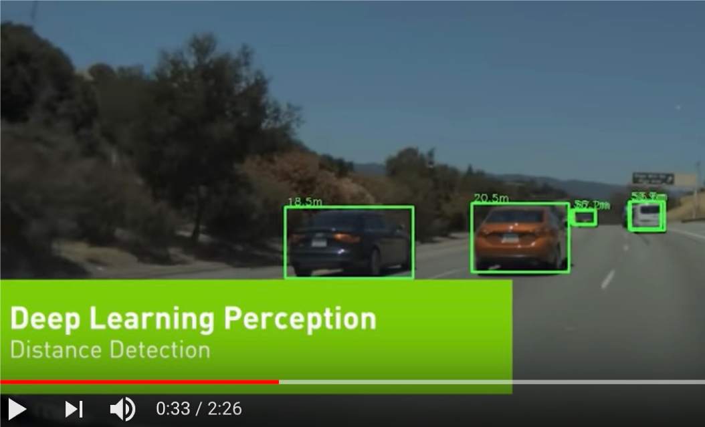

# Machine Learning Primer

---


## Lesson Objectives


 * Learn Machine Learning use cases

 * Understand ML vocabulary

 * Overview of major machine learning algorithms

Notes:


---

# Machine Learning Evolution

---

## Question for Audience

 * Think of something you did today / this week that is AI powered?

Notes:

---
## Demo - Gmail AI Helper


Notes:


---

## Why Machine Learning Matters?


[Link](https://www.youtube.com/watch?v=HcqpanDadyQ)

Notes:

https://www.youtube.com/watch?v=HcqpanDadyQ

---


## What is  Machine Learning


> **"The field of study that gives computers the ability to learn without being explicitly programmed."**  
 -- Arthur Samuel


* Example: Self-driving cars
    - Historical approach:  
    Write a massive program to instruct the car to handle all possible scenarios encountered while driving 
        - This is immensely difficult

    - AI approach:  
        - Let AI learn by observing the scenery and your  reactions
        - Once it learnt enough, let the AI predict the next reaction for a scenary


Notes:


---

## AI Evolution


 * Initial AI thinking was TOP DOWN (or symbolic logic)

 * Write a  **big, comprehensive**  program
     - Program  **all the rules**  (expert systems)

 * Problem:

     - Too many rules
     - Works only for specific domain, e.g. math theorems or chess

 * Success stories: playing chess at the grand master level
     - Domains with limited, clear rules

 * Not so successful: image recognition

Notes:


---

## Another AI Approach – Bottom Up


 * Computers can learn from 'ground up’ (data-driven)

 * E.g. how babies learn to talk:
     - Learn from example
     - They don't know the 'whole dictionary' or 'grammatical rules'

 * The focus shifts from  **logic to data**
 
 * More data => smarter systems

 * Success stories
     - Image recognition
     - Language translation
     - Self-driving cars

Notes:


---

## Spam Detection - Traditional (Rule Based) Approach

* Here is an example of spam detection rule engine

* The rules are coded by developers

* There could be 100s of 1000s of rules!

```java

if (email.from_ip.one_of("ip1", "ip2", "ip3")) {
	result = "no-spam"
}
else if ( email.text.contains ("free loans", "cheap degrees"))
{
	result = "spam"
}

```

Notes:


---

## Spam Detection - AI Approach


 * Show the algorithm with spam and non-spam emails

 * Algorithm 'learns' which attributes are indicative of spam

 * Then algorithm predicts spam/no-spam on new email


Notes:


---

## How is AI Different from Rule Based Systems


 * Rule based systems are static
     - They are programmed in
     - They don't learn from data

 * AI can learn from data
     - It gets better every day with more data it sees


Notes:


---

## Translation - Early Approach

 * Creating a translation system from English <--> Japanese

 * Code in the following:
     - English dictionary + grammar rules
     - Japanese dictionary + grammar rules
     - Translation rules

 * Now the system is ready to translate

 * But this approach really doesn't work well:
     - Rules have too many exceptions
     - Context and subtle meanings are lost

 * "Minister of agriculture" -> "Priest of farming"

Notes:


---

##  Translation - 'Bottom Up' Approach (Google Translate)


 * Google Translate has been ported to 'Google Brain' on Sept 2016

 * System learned from 'data'

 * AI based system improved the accuracy many times over

 * [Link to case study] (https://www.nytimes.com/2016/12/14/magazine/the-great-ai-awakening.html)


Notes:

* https://en.wikiquote.org/wiki/Jorge_Luis_Borges
* https://www.nytimes.com/2016/12/14/magazine/the-great-ai-awakening.html


---

## Bottom Up AI Success Stories


 * Image recognition

 * Translation

 * Self driving cars

&nbsp;&nbsp;&nbsp;&nbsp;

Notes:


---

## AI Success Story : Image Recognition: Cats & Dogs


Notes:


---

## Kaggle Competition


 * Recognize dogs & cats

 * Given 25,000 sample images to train

 * Then tested on 15,000 test images

 * Winning algorithm correctly classified 98.9% time !

 * [https://www.kaggle.com/c/dogs-vs-cats](https://www.kaggle.com/c/dogs-vs-cats )


Notes:


---

## A Glimpse of AI History


 * Sixties

     - Commercial computers & mainframes

     - Computers play chess

 * Eighties

     - Artificial intelligence (AI) get  **'oversold'**, doesn't live up to the promise and gets a bad rap

 * 21<sup>st</sup> century

     - Big Data changes it all

Notes:


---

## The Great AI Revival (2010 on)


 * AI is going through a resurgence now

 *  **'Big Data** ' - now we have so much data to train our models

 *  **'Big Data ecosystem** ' - excellent big data platforms (Hadoop, Spark, NoSQL) are available as open source

 *  **'Big Compute** ' - **cloud**  platforms significantly lowered the barrier to massive compute power

     - $1 rents you 16 core + 128 G + 10 Gigabit machine for 1 hr on AWS!
     - So running a 100 node cluster for 5 hrs --> $500

 *  **Advances in hardware** - CPU / GPUs / TPUs
 
 - **Advances in Algorithms**

 - **Availability of pre-trained models**


Notes:

https://www.nytimes.com/2016/12/14/magazine/the-great-ai-awakening.html

---

## Hardware - GPU


 * Recently GPUs – Graphics Processing Units - have become popular (especially in Deep Learning)

 * GPU cores are good at compute intensive calculations (math, matrix operations)

 * Each GPU core is capable of executing small set instructions, but there are 1000s of core per GPU

     - Running in parallel


Notes:


---

## Hardware – Modern CPU


 * Modern Intel Xeon CPUs (E5 or later) have vectorized linear algebra

     - Properly optimized, approaches speed of GPUs

     - And offers faster I/O performance for Big Data.

 * Intel Math Kernel Library - highly optimized, threaded, and vectorized math functions that maximize performance on each processor family


Notes:


---

## Hardware – TPU (Tensor Processing Unit)


 * A [Tensor processing unit (TPU)](https://github.com/tensorflow/tensorflow) is an AI accelerator application-specific integrated circuit (ASIC) developed by Google specifically for neural network machine learning

 * More capable the CPUs / GPUs in certain tasks

 * Designed for [Tensorflow](https://github.com/tensorflow/tensorflow)

 * Designed for high volume computes

     - A TPU can process 100 million photos a day

 * Available in Google Cloud platform

Notes:

* https://en.wikipedia.org/wiki/Tensor_processing_unit
* https://github.com/tensorflow/tensorflow


---

## Google TPU System in Data Center


Notes:

* Image credit : NY Times : https://www.nytimes.com/2018/02/12/technology/google-artificial-intelligence-chips.html


---
## Video - Advances in Hardware - Nvidia



[Video Nvidia Self Driving DL](https://www.youtube.com/watch?v=0rc4RqYLtEU)


Notes:

- [Video Nvidia Self Driving DL](https://www.youtube.com/watch?v=0rc4RqYLtEU)


---

## Video - Advances in Hardware - Nvidia


[Nvidia GPU, Audi autonomous driving](https://www.youtube.com/watch?v=DjAJnQoNdMA)   
Cool comparison of learning rate of Brain vs. CPU vs. GPU around 50 second mark

Notes:

* [Nvidia GPU, Audi autonomous driving](https://www.youtube.com/watch?v=DjAJnQoNdMA)


---
## Video - TPU


[Google TPU](https://www.youtube.com/watch?v=UsDhVx6cOrw)  
(up to 5 min mark)


Notes:

https://www.youtube.com/watch?v=UsDhVx6cOrw

---

# Machine Learning Use Cases

---

## How ML Can Help a Business

 * Credit Card Application use case

 * In the beginning, all applications are reviewed manually by analysts

     - Approved or rejected based on criteria

 * As the application volume goes up

     - Hire more analysts to keep up with volume
     - Human bias might lead to inconsistent or unfair approval process


Notes:

---


## How ML Can Help a Business


 * Machine Learning algorithm can learn from past loan applications

     - E.g., if applicant already has a credit line and making minimum payments, he/she is likely to default on new credit

 * ML can process applications very quickly and only send "flagged" applications for manual review


Notes:


---

## ML Advantages/Challenges

|Advantages                                   |Challenges                                   |
|-------------------------------------------------------- |-------------------------------------------------------- |
|**- Accurate:** ML can learn from data, the more data it learns from the better it gets <br/>**- Automated:** Bulk of the decisions can be automated <br/>**- Fast:** ML can process data within milliseconds <br/>**- Customizable:** ML algorithms can be adopted for various scenarios <br/>**- Scalable:** ML algorithms can scale for large amount of data       |<br/>**- Data prep:**  Data may not be in ready-to-use form <br/>**- Accuracy:** Measuring accuracy can get complicated <br/>**- Algorithm Choice:** Different algorithms perform differently, choosing the best algorithm is very important   |


Notes:


---

## Machine Learning Applications


 * Detect credit card fraud

 * Recommendations
     - Millions of products
     - To millions of users

 * Genome analysis

 * Language translation

Notes:


---

# Machine Learning Ecosystem

---

## AI Vocabulary : AI / Machine Learning / Deep Learning


 *  **Artificial Intelligence (AI):** Broader concept of "making machines smart"

 *  **Machine Learning:** Current application of AI that machines learn from data using mathematical, statistical models

 *  **Deep Learning: (Hot!)** Using Neural Networks to solve some hard problems


Notes:

* http://www.teglor.com/b/deep-learning-libraries-language-cm569/

---

## AI / Machine Learning / Deep Learning


Notes:

---

## Deep Learning (DL)


 * Deep Learning uses Neural networks techniques

 * Neural Networks fell out of favor in the 90s as statistics-based methods yielded better results

 * Now making a comeback due to Big Data & Big Compute ((cluster computing , GPU and TPU)

 * Examples

     - Facebook Deep Face

     - Google Translate

     - Google DeepMind playing GO game

     - IBM Deep Blue winning Jeopardy

Notes:

* https://www.quora.com/What-is-the-difference-between-deep-learning-and-usual-machine-learning
* https://www.wired.com/2016/06/deep-learning-isnt-dangerous-magic-genie-just-math/
* https://en.wikipedia.org/wiki/AlphaGo


---

## Deep Neural Network – Face Recognition


Notes:

* Image credit : Facebook research
* Source: https://deeplearning4j.org/neuralnet-overview


---

## Machine Learning vs. Deep Learning


| Features                             	| Machine Learning                                              	| Deep Learning                                                    	|
|--------------------------------------	|---------------------------------------------------------------	|------------------------------------------------------------------	|
| Data size (see next slide for graph) 	| Performs reasonably well on small / medium data               	| Need large amount of data for reasonable performance             	|
| Scaling                              	| Doesn't scale with large amount of data                       	| Scales well with large amount of data                            	|
| Compute power                        	| Doesn't need a lot of compute (works well on single machines) 	| Needs a lot of compute power (usually runs on clusters)          	|
| CPU/GPU                              	| Mostly CPU bound                                              	| Can utilize GPU for certain computes (massive matrix operations) 	|
| Feature Engineering                  	| Features needs to specified manually (by experts)             	| DL can learn high level features from data automatically         	|
| Execution Time                       	| Training usually takes seconds, minutes, hours                	| Training takes lot longer (days)                                 	|
| Interpretability                     	| Easy to interpret                                             	| Hard to understand the final result                              	|

Notes:

* https://www.analyticsvidhya.com/blog/2017/04/comparison-between-deep-learning-machine-learning/


---

## Machine Learning vs. Deep Learning


Notes:


---

## 1980’s and 1990’s


Notes:

Source: Jeff Dean


---

## 1990+


Notes:

Source: Jeff Dean


---

## Now


Notes:

---

## AI Vocabulary : Training vs. Inference

*  **Training**
    - Feeding data to an algorithm to create a model
    - Computationally expensive (can take hours, days, weeks)
        - Google translate model trains on 3 billion+ words on 100+ GPUs for week+
*  **Prediction / Inference**
    - Created model answering questions (very fast)
    - "is this transaction fraud / not-fraud"
    - "What are the recommended movies for this user"


---

## Data Size Vs. Model Size

- An algorithm can train on small / large / huge amount of data (depending on problem complexity)
    - Since it can be computationally very intensive;  So we may use cluster of computers for training
    - Clusters can contain 100s (or 1000s) of CPUs/GPUs/TPUs

- The resulting model is orders of magnitude smaller in size 
    - it could fit in your phone!


---

## AI Software Eco System

| Machine Learning 	| Deep Learning              	|                             	|
|------------------	|----------------------------	|-----------------------------	|
| Java             	| - Weka <br/>- Mahout              	| - DeepLearning4J             	|
| Python           	| - SciKit <br/>- (Numpy, Pandas)   	| - Tensorflow <br/>- Theano <br/>- Caffe  	|
| R                	| - Many libraries            	| - Deepnet <br/>- Darch             	|
| Distributed      	| - H20 <br/>- Spark                	| - H20 <br/>- Spark                 	|
| Cloud            	| - AWS <br/>- Azure  <br/>- Google Cloud 	| - AWS  <br/>- Azure  <br/>- Google Cloud 	|

Notes:


---


## Machine Learning and Big Data

 * Until recently most of the machine learning is done on “single computer” (with lots of memory–100s of GBs)

 * Most R/Python/Java libraries are “single node based”

 * Now Big Data tools make it possible to run machine learning algorithms at massive scale–distributed across a cluster


Notes:


---

## Machine Learning vs. Big Data

| Traditional ML                                 	| ML on Big Data                               	|
|------------------------------------------------	|----------------------------------------------	|
| All (or most) data fits into single machine    	| Data is distributed across multiple machines 	|
| Data almost / always in memory                 	| Memory is scarce                             	|
| Optimized for heavy iterative computes         	| Optimized for single pass computes           	|
| Maintains state between stages                 	| stateless                                    	|
| CPU bound                                      	| IO bound (disk / network).                   	|
| GPU (Graphical Processing Unit) seldom engaged 	| GPUs are utilized increasingly               	|

Notes:


---

## Tools for Scalable Machine Learning


 *  **Spark ML**
     - Runs on top of popular Spark framework
     - Massively scalable
     - Can use memory (caching) effectively for iterative algorithms
     - Language support: Scala, Java, Python, R


 *  **Cloud Vendors**
     - Ready to go algorithms
     - Visualization tools
     - Wizards to guide
     - Virtually 'unlimited' scale
     - [Amazon Machine Learning](https://aws.amazon.com/machine-learning/), Azure Machine Learning,  Google ML
     
     
  
  
 


Notes:

* http://www.kdnuggets.com/2016/04/top-15-frameworks-machine-learning-experts.html
* http://www.infoworld.com/article/2853707/machine-learning/11-open-source-tools-machine-learning.html
* https://aws.amazon.com/machine-learning/


---


## Tools for Scalable Deep Learning


 *  **`TensorFlow`**
     - Based on “data flow graphs”
     - “Tensor” = batches of data
     - Language support: Python, C++
     - Run time: CPU, GPU

<br  clear="all"/>


 *  **`Intel BigDL`**  

     - Deep learning library
     - Built on Apache Spark
     - Language support: Python, Scala


Notes:

* https://www.tensorflow.org/


---

# Machine Learning Algorithms

---

[Algorithm-Summary.md](Algorithm-Summary.md)

---
## How to do Machine Learning


 *  **Collect data**

    More data we have, the better the algorithms become.  This data can come from internal logs (clickstreams) or external sources (credit scores of customers)

 *  **Prepare Data**

    Raw data is hardly in a form to be used.  It needs to be cleansed, tagged and curated before ready to use

 *  **Train a model**

    Feed the training data to model so it can learn

 *  **Evaluate the model**

    Test the model accuracy

 *  **Improve the model**

    Either by adding more training data, choosing a different algorithm ..etc.

Notes:


---

## Types of Machine Learning


 *  **Supervised Machine Learning:**
     - Algorithm learns from labeled training data
     - And predicts on new data

 *  **Unsupervised Machine Learning**
     - Algorithm tries to find natural patterns in the data

 *  **Semi-Supervised Learning**
     - Algorithm is trained with a training set which contains unlabeled (usually lot) and labeled (usually little) data
     - Example: Large images archive only a few of them are labeled (cat, dog, person) and majority are unlabelled

 *  **Reinforcement Learning**
     - Based on 'game play'  (rewards vs penalties)

Notes:


---

## Supervised Machine Learning 


 * Algorithm learns from (training) data

 * Then predicts on 'unseen' data

<br clear="all" />

| Algorithms     	| Description                                                            	| Applications                                	|
|----------------	|------------------------------------------------------------------------	|---------------------------------------------	|
| Classification 	| Categorize things into groups                                          	| -Spam classification <br/>-Fraud / no fraud      	|
| Regression     	| Dealing with numbers and calculate the probability something happening 	| -Predict house prices <br/>-Predict stock market 	|

Notes:

Image credit (Creative Commons) : Pexels.com

---


## Supervised Learning Example – Regression


 * Predicting stock market

 * Train the model using training data (already known)

 * Test performance using test data (already known)

 * Predict no new data (unseen)


Notes:


---

## Supervised Learning Methodology


 * Split the data set into

     - **Training set**: Train the algorithm (training set should represent data well enough)

     - **Test set**: Validate the model

 * Start with 70% training, 30% test
    - Tweak the dials to increase or decrease the proportion


Notes:


---

## Supervised Learning - Classification


 * Classification is a model that predicts data into "buckets"
 * Examples:
     - Email is  **SPAM**  or  **HAM**  (not-SPAM)
     - A cell is  **cancerous**  or  **healthy**
     - Hand-written numbers -> any digits 0, 1, 2,…, 9
 * Classification algorithm learns from training data
     - Supervised learning
 * Also predicted classes are **discrete** or **qualitative**


Notes:


---

## Classification Applications


 * Web

     - Email is spam or not

     - Website is authentic or fraudulent

 * Medicine

     - Is this cell cancerous or not?

 * Finance

     - Credit card transaction fraudulent or not

 * OCR

     - Recognizing characters and symbols

Notes:


---

## Un Supervised Machine Learning


 * No training needed

 * Algorithm tries to find patterns in data


<br clear="all"/>


| Algorithms               	| Description                             	| Applications                                                 	|
|--------------------------	|-----------------------------------------	|--------------------------------------------------------------	|
| Clustering               	| Find naturally present patterns in data 	| -Identify news stories (sports / business) <br/>-Gnome clustering 	|
| Association              	| Find similar patterns                   	| -people who buy A also buy B                                 	|
| Dimensionality Reduction 	| Reduces number of features              	| -Reducing 1000s of variables into manageable size            	|

Notes:


---

## Clustering


 * Clustering finds natural groupings in data

 * Humans naturally cluster data we encounter
     - Categorizing, organizing, etc.
     - Our brains seek patterns

 * Why do we cluster?
     - To understand our data
     - To find “more like this”


Notes:

* Clustering allows us to group similar objects or events or data sets.
* This is a method of unsupervised learning.


---


## Clustering Use Cases: Fraud / Anomaly Detection


 * Anomaly detection

     - Find fraud

     - Detect network intrusion attack

     - Discover problems on servers


Notes:

* Image credit : Pixabay : Creative Commons Zero :
* https://pixabay.com/en/nuts-black-acorn-oak-animal-food-60812/


---

## Clustering Applications


 * Biology

     - Genomics grouping

 * Medicine

     - Xray/CAT image analysis

 * Marketing

     - Consumer grouping ("soccer mom“...etc.) and behavior analysis

 * Web

     - Search result grouping
     - News article grouping (Google news)

 * Computer Science : Image analysis

 * Climatology: Weather pattern analysis (high pressure/warm regions)

Notes:

* https://en.wikipedia.org/wiki/Cluster_analysis

---

## Unsupervised Example: Google News


 * Google News algorithm automatically groups **related news stories**  into sections


Notes:


---

## Semi-Supervised


 * We are still learning, but not all data points are 'labelled'

 * But by grouping data points together, the algorithm can 'infer' information, even when labels are missing


Notes:


---

## Reinforcement Learning


 * Imagine you are playing a new video game.  You have no idea how to play it.How will you learn?

 * Try a few things:
    - Open a door -> get more money / ammo
    - Jump from a cliff -> got hurt.. Loose health points .. Ouch!

 * This is how 'Reinforcement Learning' works.
     - Algorithm tries a few moves.. And learns automatically

Notes:


---

## Reinforcement Learning


 * Here the robot gets rewarded for 'food' and penalized for walking into fire


Notes:


---

## Reinforcement Learning Demo: Atari Breakout


[Link](https://www.youtube.com/watch?v=V1eYniJ0Rnk)


Notes:

* [Video](https://www.youtube.com/watch?v=V1eYniJ0Rnk)
* https://money.cnn.com/2017/09/29/technology/future/alphago-movie/index.html


---

## Reinforcement Learning Demo : Open AI Bots Playing Dota


<a href="https://www.youtube.com/watch?v=eHipy_j29Xw">Link</a>

Notes:

* https://www.youtube.com/watch?v=eHipy_j29Xw


---


## Reinforcement Learning Success Stories


 * [OpenAI trounces Dota-2 players](https://www.theinquirer.net/inquirer/news/3037136/openais-dota-2-playing-bots-trounce-semi-pro-players)

 * [Deep Mind's AI beats GO champion](https://www.theverge.com/2017/10/18/16495548/deepmind-ai-go-alphago-zero-self-taught)

    The company’s latest AlphaGo AI learned superhuman skills by playing itself over and over

 * [Google's Alpha-GO defeats GO master](https://qz.com/639952/googles-ai-won-the-game-go-by-defying-millennia-of-basic-human-instinct/)

 * [OpenAI](https://openai.com/research/) is founded by Elon Musk.

     - To promote AI research for public bood

Notes:

* https://www.theinquirer.net/inquirer/news/3037136/openais-dota-2-playing-bots-trounce-semi-pro-players
* https://openai.com/research/
* https://www.theverge.com/2017/10/18/16495548/deepmind-ai-go-alphago-zero-self-taught
* https://qz.com/639952/googles-ai-won-the-game-go-by-defying-millennia-of-basic-human-instinct/


---

# Final Thoughts

---

[algorithm-summary](Algorithm-Summary.md)

---

## ML Algorithm Cheat Sheet


Notes:


---

## Elon Musk:  "AI will take over humanity"


Notes:


---

## Lab: Design ML Algorithm


 *  **Problem** :

     - Domestic tension

 *  **Solution** :

     - Buy flowers

 *  **Questions** :

     - How much $$$ to spend

     - Which flowers to choose


Notes:

- Image used with 'Creative Commons Zero' permissions from pexels.com   (https://www.pexels.com/photo/man-in-gray-suit-holding-bouquet-of-pink-and-blue-petaled-flowers-30196/)


---

## Review Questions


 * What is Machine Learning and how is it different from regular programming?

 * Name a few of Machine Learning use cases

 * How does Big Data help Machine Learning?

 * What is supervised learning? Unsupervised learning?

Notes:


---

## Further Reading


 * [Great AI Awakening](https://www.nytimes.com/2016/12/14/magazine/the-great-ai-awakening.html) – New York Times profile of on Google Brain and the people behind it

 * [Gentle Intro to Machine Learning](https://monkeylearn.com/blog/a-gentle-guide-to-machine-learning/)

 * [Machine Learning Basics](https://www.analyticsvidhya.com/blog/2015/06/machine-learning-basics/)

Notes:

* https://www.nytimes.com/2016/12/14/magazine/the-great-ai-awakening.html
* https://monkeylearn.com/blog/a-gentle-guide-to-machine-learning/
* https://www.analyticsvidhya.com/blog/2015/06/machine-learning-basics/
