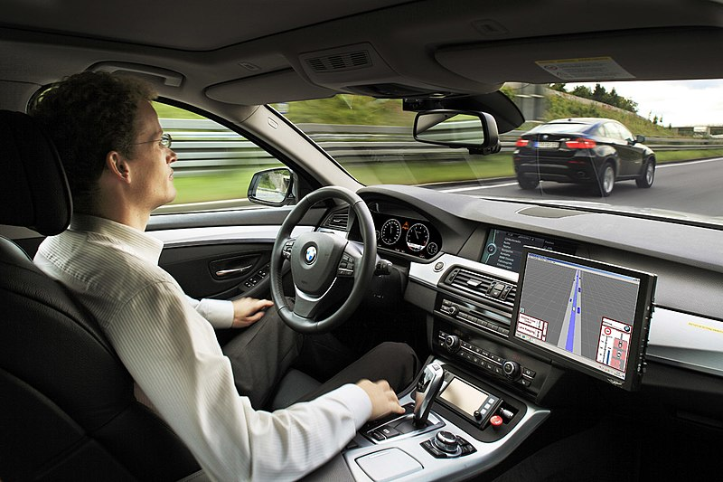
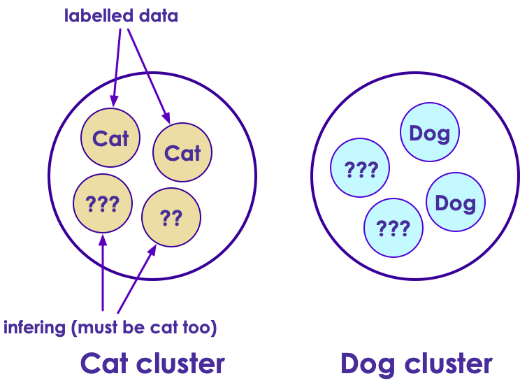
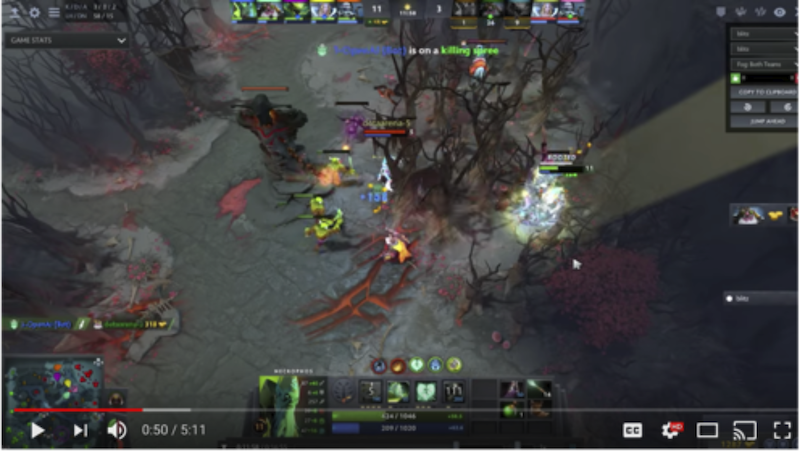

# Machine Learning Primer

---


## Lesson Objectives


 * See the potential of machine learning

 * Get the basic vocabulary

 * Overview of major machine learning algorithms

Notes:


---

## Machine Learning!

<!-- {"left" : 1.02, "top" : 0.91, "height" : 6.16, "width" : 8.21} -->


Notes:

Image copy right to owners


---

# Machine Learning Evolution

---

## Informal Definition of Machine Learning


 * Arthur Samuel

     -  “ **The field of study that gives computers the ability to learn without being explicitly programmed."**

 * Example: Self-driving cars

     - Tell the car the rules, or

     - Let it record the scenery and your reactions

     - Let it predict the next reaction

<!-- {"left" : 7.35, "top" : 3.53, "height" : 3.67, "width" : 2.6} -->

Notes:


---

## AI Evolution


 * Initial AI thinking was TOP DOWN (or symbolic logic)

 * Write a  **big, comprehensive**  program

     - Program  **all the rules**  (expert systems)

 * Problem:

     - Too many rules

     - Works only for specific domain, e.g. math theorems or chess

 * Success stories: playing chess at the grand master level

     - Domains with limited, clear rules

 * Not so successful: image recognition

Notes:


---

## Another AI Approach – Bottom Up


 * Computers can learn from 'ground up’ (data-driven)

 * E.g. how babies learn to talk:

     - Learn from example

     - They don't know the 'whole dictionary' or 'grammatical rules'

 * The focus shifts from  **logic to data**
 * More data => smarter systems

 * Success stories

     - Image recognition

     - Language translation

     - Self-driving cars

Notes:


---

## Spam Detection – Traditional (Rule Based) Approach


 * Computers follow explicit instructions (code)

 * Can be tens of millions code lines but still explicit instructions, something like this:

```java
// explicitly coding the rules

if (email.from_ip.one_of("ip1", "ip2", "ip3")) {
	result = "no-spam"
}
else if ( email.text.contains ("free loans", "cheap degrees"))
{
	result = "spam"
}

```
<!-- {"left" : 0, "top" : 2.53, "height" : 2.45, "width" : 10.25} -->

Notes:


---

## Spam Detection - Machine Learning Approach

 * Show the algorithm with spam and non-spam emails

 * Algorithm 'learns' which attributes are indicative of spam

 * Then algorithm predicts spam/no-spam on new email


<!-- {"left" : 0.88, "top" : 2.74, "height" : 4.24, "width" : 8.48} -->


Notes:


---

## Translation - Early Approach

 * Creating a translation system from English <--> Japanese

 * Code in the following:

     - English dictionary + grammar rules

     - Japanese dictionary + grammar rules

     - Translation rules

 * Now the system is ready to translate

 * But this approach really doesn't work well:

     - Rules have too many exceptions

     - Context and subtle meanings are lost

 * ”Minister of agriculture" -> ”Priest of farming"

Notes:


---

##  Translation - 'Bottom Up' Approach (Google Translate)


 * Google Translate has been ported to 'Google Brain' on Sept 2016

 * System learned from 'data'

 * AI based system improved the accuracy many times over

 * [Link to case study](https://www.nytimes.com/2016/12/14/magazine/the-great-ai-awakening.html)

<!-- {"left" : 3.38, "top" : 3.52, "height" : 3.72, "width" : 6.12} -->


Notes:

* https://en.wikiquote.org/wiki/Jorge_Luis_Borges
* https://www.nytimes.com/2016/12/14/magazine/the-great-ai-awakening.html


---

## Bottom Up AI Success Stories


 * Image recognition

 * Translation

 * Self driving cars

&nbsp;&nbsp;&nbsp;&nbsp;<!-- {"left" : 0.35, "top" : 2.92, "height" : 3.12, "width" : 4.68} --><!-- {"left" : 5.23, "top" : 2.9, "height" : 3.12, "width" : 4.67} -->

Notes:

Image credit : Wikimedia : CCZero license : https://commons.wikimedia.org/wiki/File:Driver_free_car.jpg
Image credit : WikiMedia : (Creative Commons) : https://commons.wikimedia.org/wiki/File:Face_detection.jpg


---

## AI Success Story : Image Recognition: Cats & Dogs

<!-- {"left" : 2.89, "top" : 1.03, "height" : 5.9, "width" : 4.47} -->


Notes:

* All images are used with  'creative common zero – CCZero' permissions  from Pexels.com
* https://www.pexels.com/photo/silver-tabby-cat-lying-on-brown-wooden-surface-126407/
* https://www.pexels.com/photo/grey-and-white-short-fur-cat-104827/
* https://www.pexels.com/photo/tabby-cat-side-view-26511/
* https://www.pexels.com/photo/cat-whiskers-kitty-tabby-20787/
* https://www.pexels.com/photo/animal-dog-pet-brown-5018/
* https://www.pexels.com/photo/light-golden-retriever-puppy-close-up-photography-159541/
* https://www.pexels.com/photo/brown-and-black-belgian-shepherd-on-green-grassy-field-200008/


---

## Kaggle Competition


 * Recognize dogs & cats

 * Given 25,000 sample images to train

 * Then tested on 15,000 test images

 * Winning algorithm correctly classified 98.9% time !

 * [https://www.kaggle.com/c/dogs-vs-cats](https://www.kaggle.com/c/dogs-vs-cats )

<!-- {"left" : 0.64, "top" : 3.83, "height" : 2.79, "width" : 8.96} -->


Notes:

* All images are used with 'creative common zero -  cc-zero' permissions from  Pexels.com
* https://www.pexels.com/photo/silver-tabby-cat-lying-on-brown-wooden-surface-126407/
* https://www.pexels.com/photo/brown-and-black-belgian-shepherd-on-green-grassy-field-200008/
* https://www.pexels.com/photo/dogs-pets-puppies-animals-38008/
* https://www.pexels.com/photo/orange-tabby-cat-beside-fawn-short-coated-puppy-24104/


---

## A Glimpse of AI History


 * Sixties

     - Commercial computers & mainframes

     - Computers play chess

 * Eighties

     - Artificial intelligence (AI) get  **'oversold'**, doesn't live up to the promise and gets a bad rap

 * 21<sup>st</sup> century

     - Big Data changes it all

Notes:


---

## The Great AI Revival – 21st century (2010 on)


 * AI is going through a resurgence now

 *  **'Big Data'** – now we have so much data to train our models

 *  **'Big Data ecosystem'** – excellent big data platforms (Hadoop, Spark, NoSQL) are available as open source

 *  **'Big Compute'** -  **cloud**  platforms significantly lowered the barrier to massive compute power

     - $1 buys you 16 core + 128 G + 10 Gigabit machine for 1 hr on AWS!

     - So running a 100 node cluster for 5 hrs -> $500

 *  **Advances in hardware** – CPU / GPUs

Notes:

https://www.nytimes.com/2016/12/14/magazine/the-great-ai-awakening.html


---

## Hardware - GPU


 * Recently GPUs – Graphics Processing Units - have become popular (especially in Deep Learning)

 * GPU cores are good at compute intensive calculations (math, matrix operations)

 * Each GPU core is capable of executing small set instructions, but there are 1000s of core per GPU

     - Running in parallel


<!-- {"left" : 4.82, "top" : 3.61, "height" : 3.51, "width" : 5.11} -->


Notes:


---

## Hardware – Modern CPU


 * Modern Intel Xeon CPUs (E5 or later) have vectorized linear algebra

     - Properly optimized, approaches speed of GPUs

     - And offers faster I/O performance for Big Data.

 * Intel Math Kernel Library - highly optimized, threaded, and vectorized math functions that maximize performance on each processor family

<!-- {"left" : 1.54, "top" : 4.13, "height" : 2.91, "width" : 7.17} -->


Notes:


---

## Hardware – TPU (Tensor Processing Unit)


 * A [Tensor processing unit (TPU)](https://github.com/tensorflow/tensorflow) is an AI accelerator application-specific integrated circuit (ASIC) developed by Google specifically for neural network machine learning

 * More capable the CPUs / GPUs in certain tasks

 * Designed for [Tensorflow](https://github.com/tensorflow/tensorflow)

 * Designed for high volume computes

     - A TPU can process 100 million photos a day

 * Available in Google Cloud platform

Notes:

* https://en.wikipedia.org/wiki/Tensor_processing_unit
* https://github.com/tensorflow/tensorflow


---

## Google TPU System in Data Center

<!-- {"left" : 0.26, "top" : 1.67, "height" : 4.63, "width" : 9.74} -->


Notes:

* Image credit : NY Times : https://www.nytimes.com/2018/02/12/technology/google-artificial-intelligence-chips.html


---

# Machine Learning Use Cases

---

## How ML Can Help a Business

 * Credit Card Application use case

 * In the beginning, all applications are reviewed manually by analysts

     - Approved or rejected based on criteria

 * As the application volume goes up

     - Hire more analysts to keep up with volume

     - Human bias might lead to inconsistent or unfair approval process

<!-- {"left" : 1.02, "top" : 4.61, "height" : 2.43, "width" : 8.21} -->


Notes:


---

## How ML Can Help a Business


 * Machine Learning algorithm can learn from past loan applications

     - E.g., if applicant already has a credit line and making minimum payments, he/she is likely to default on new credit

 * ML can process applications very quickly and only send "flagged" applications for manual review

<!-- {"left" : 0.75, "top" : 4.19, "height" : 2.38, "width" : 8.75} -->


Notes:


---

## ML Advantages/Challenges

|Advantages                                   |Challenges                                   |
|-------------------------------------------------------- |-------------------------------------------------------- |
|**- Accurate:** ML can learn from data, the more data it learns from the better it gets <br/>**- Automated:** Bulk of the decisions can be automated <br/>**- Fast:** ML can process data within milliseconds <br/>**- Customizable:** ML algorithms can be adopted for various scenarios <br/>**- Scalable:** ML algorithms can scale for large amount of data       |<br/>**- Data prep:**  Data may not be in ready-to-use form <br/>**- Accuracy:** Measuring accuracy can get complicated <br/>**- Algorithm Choice:** Different algorithms perform differently, choosing the best algorithm is very important   |


Notes:


---

## Machine Learning Applications


 * Detect credit card fraud

     - Thousands of features

     - Billions of transactions

 * Recommendations

     - Millions of products

     - To millions of users

 * Genome data manipulation

     - Thousands of human genomes

     - Detect genetic associations with disease

 * Language translation

Notes:


---

# Machine Learning Ecosystem

---

## AI / Machine Learning / Deep Learning


 *  **Artificial Intelligence (AI):**<br/>
  Broader concept of <br/>
  machines being able to <br/>
  carry out 'smart' tasks

 *  **Machine Learning:** <br/>
 Current application of AI <br/>
 that machines learn from<br/>
  data using mathematical,<br/>
   statistical models

 *  **Deep Learning: (Hot!)**<br/>
  Using Neural Networks to <br/>
  solve some hard problems

<!-- {"left" : 5.27, "top" : 1.81, "height" : 4.35, "width" : 4.35} -->


Notes:

* http://www.teglor.com/b/deep-learning-libraries-language-cm569/


---

## Deep Learning (DL)


 * Deep Learning uses Neural networks techniques

 * Neural Networks fell out of favor in the 90s as statistics-based methods yielded better results

 * Now making a comeback due to Big Data & Big Compute ((cluster computing , GPU and TPU)

 * Examples

     - Facebook Deep Face

     - Google Translate

     - Google DeepMind playing GO game

     - IBM Deep Blue winning Jeopardy

Notes:

* https://www.quora.com/What-is-the-difference-between-deep-learning-and-usual-machine-learning
* https://www.wired.com/2016/06/deep-learning-isnt-dangerous-magic-genie-just-math/
* https://en.wikipedia.org/wiki/AlphaGo


---

## Deep Neural Network – Face Recognition


<!-- {"left" : 3.02, "top" : 1.2, "height" : 5.58, "width" : 4.22} -->


Notes:

* Image credit : Facebook research
* Source: https://deeplearning4j.org/neuralnet-overview


---

## Machine Learning vs. Deep Learning


| Features                             	| Machine Learning                                              	| Deep Learning                                                    	|
|--------------------------------------	|---------------------------------------------------------------	|------------------------------------------------------------------	|
| Data size (see next slide for graph) 	| Performs reasonably well on small / medium data               	| Need large amount of data for reasonable performance             	|
| Scaling                              	| Doesn't scale with large amount of data                       	| Scales well with large amount of data                            	|
| Compute power                        	| Doesn't need a lot of compute (works well on single machines) 	| Needs a lot of compute power (usually runs on clusters)          	|
| CPU/GPU                              	| Mostly CPU bound                                              	| Can utilize GPU for certain computes (massive matrix operations) 	|
| Feature Engineering                  	| Features needs to specified manually (by experts)             	| DL can learn high level features from data automatically         	|
| Execution Time                       	| Training usually takes seconds, minutes, hours                	| Training takes lot longer (days)                                 	|
| Interpretability                     	| Easy to interpret                                             	| Hard to understand the final result                              	|

Notes:

* https://www.analyticsvidhya.com/blog/2017/04/comparison-between-deep-learning-machine-learning/


---

## Machine Learning vs. Deep Learning


<!-- {"left" : 1.41, "top" : 1.13, "height" : 5.71, "width" : 7.43} -->


Notes:


---

## 1980’s and 1990’s

<!-- {"left" : 0.33, "top" : 1.29, "height" : 5.52, "width" : 9.59} -->


Notes:

Source: Jeff Dean


---

## 1990+

<!-- {"left" : 0.39, "top" : 1.26, "height" : 5.46, "width" : 9.48} -->


Notes:

Source: Jeff Dean


---

## Now

<!-- {"left" : 0.27, "top" : 1.16, "height" : 5.59, "width" : 9.71} -->


Notes:


---

## AI Software Eco System

| Machine Learning 	| Deep Learning              	|                             	|
|------------------	|----------------------------	|-----------------------------	|
| Java             	| - Weka <br/>- Mahout              	| - DeepLearning4J             	|
| Python           	| - SciKit <br/>- (Numpy, Pandas)   	| - Tensorflow <br/>- Theano -Caffe  	|
| R                	| - Many libraries            	| - Deepnet <br/>- Darch             	|
| Distributed      	| - H20 <br/>- Spark                	| - H20 <br/>- Spark                 	|
| Cloud            	| - AWS <br/>- Azure  <br/>- Google Cloud 	| - AWS  <br/>- Azure  <br/>- Google Cloud 	|

Notes:


---

## Technology Stack Comparison

| Technology 	| Pros                                                                                                                   	| Cons                                                                                                          	|
|------------	|------------------------------------------------------------------------------------------------------------------------	|---------------------------------------------------------------------------------------------------------------	|
| R          	| - Rich environment <br/>- Thousands of libraries                                                                              	| - Rough on data cleanup <br/>- Not a general purpose language (may not be mainstream?) <br/>- <b>Data must fit on one machine</b> 	|
| Python     	| - General purpose programming language <br/>- Excellent libraries (Pandas / scikit-learn) <br/>- Gaining popularity in recent years 	| -<b>Data must fit on one machine</b>  |         

Notes:

* http://blog.cloudera.com/blog/2014/03/why-apache-spark-is-a-crossover-hit-for-data-scientists/


---

## Machine Learning and Big Data

 * Until recently most of the machine learning is done on “single computer” (with lots of memory–100s of GBs)

 * Most R/Python/Java libraries are “single node based”

 * Now Big Data tools make it possible to run machine learning algorithms at massive scale–distributed across a cluster


<!-- {"left" : 1.02, "top" : 3.51, "height" : 3.49, "width" : 8.21} -->


Notes:


---

## Machine Learning vs. Big Data

| Traditional ML                                 	| ML on Big Data                               	|
|------------------------------------------------	|----------------------------------------------	|
| All (or most) data fits into single machine    	| Data is distributed across multiple machines 	|
| Data almost / always in memory                 	| Memory is scarce                             	|
| Optimized for heavy iterative computes         	| Optimized for single pass computes           	|
| Maintains state between stages                 	| stateless                                    	|
| CPU bound                                      	| IO bound (disk / network).                   	|
| GPU (Graphical Processing Unit) seldom engaged 	| GPUs are utilized increasingly               	|

Notes:


---

## Tools for Scalable Machine Learning


 *  **Spark ML**

     - Runs on top of popular Spark framework

     - Massively scalable

     - Can use memory (caching) effectively for iterative algorithms

     - Language support: Scala, Java, Python, R

<!-- {"left" : 7.42, "top" : 2.92, "height" : 2.13, "width" : 2.36} -->


 *  **[Amazon Machine Learning](https://aws.amazon.com/machine-learning/)**

     - Ready to go algorithms

     - Visualization tools

     - Wizards to guide

     - Scalable on Amazon Cloud


Notes:

* http://www.kdnuggets.com/2016/04/top-15-frameworks-machine-learning-experts.html
* http://www.infoworld.com/article/2853707/machine-learning/11-open-source-tools-machine-learning.html
* https://aws.amazon.com/machine-learning/


---

## Tools for Scalable Machine Learning


 *  **[Azure ML Studio](https://studio.azureml.net/)** 

     - Built on Azure cloud (Microsoft)

     - Language support: Python, R

 *  **[H2O](www.h2o.ai/)** 

     - Easy to use API

     - WebUI

     - Supports reading from multiple datasources<br/> (Excel/SQL/HDFS)

     - In memory compute

     - Works on top of Spark (“Sparkling Water”)

     - Vendor: 0xData

<!-- {"left" : 7.79, "top" : 1.12, "height" : 2.1, "width" : 2.1} -->


Notes:

* https://studio.azureml.net/
* http://www.h2o.ai/
* http://www.h2o.ai/download/sparkling-water/


---

## Tools for Scalable Deep Learning


 *  **TensorFlow**

     - Based on “data flow graphs”

     - “Tensor” = batches of data

     - Language support: Python, C++

     - Run time: CPU, GPU

<!-- {"left" : 7.22, "top" : 1.11, "height" : 1.73, "width" : 2.03} -->


 *  **Intel BigDL**  

     - Deep learning library

     - Built on Apache Spark

     - Language support: Python, Scala

<!-- {"left" : 6.92, "top" : 4.11, "height" : 1.2, "width" : 2.64} -->


Notes:

* https://www.tensorflow.org/
* http://singa.incubator.apache.org/


---

# Machine Learning Algorithms

---

## Algorithm Summary

| Category        	| Sub Category    	| Example                                                                          	| Algorithms                                                          	|
|-----------------	|-----------------	|----------------------------------------------------------------------------------	|---------------------------------------------------------------------	|
| **Supervised**      	| Regressions     	| -Predict house prices <br/>-Predict stock price                                       	| -Linear Regression <br/>-Polynomial <br/>-Stepwise  <br/>-Ridge, Lasso, ElasticNet 	|
|                 	| Classifications 	| -Cancer or not <br/>-Spam or not                                                      	| -Logistic Regression <br/>-SVM <br/>-Naïve Bayes <br/>-K Nearest Neighbor (KNN)    	|
|                 	| Decision Trees  	| -Classification (credit card fraud detection) <br/>-Regression (predict stock prices) 	| -Decision Trees <br/>-Random Forests                                     	|
| **Unsupervised**    	| Clustering      	| -Group Uber trips <br/>-Cluster DNA data                                              	| -Kmeans <br/>-Hierarchical clustering                                    	|
|                 	|                 	| -Dimensionality reduction                                                        	| -PCA                                                                	|
|                 	|                 	| -Text mining                                                                     	| -Topic discovery                                                    	|
| **Recommendations** 	|                 	| -Recommend movies                                                                	| -Collaborative Filtering                                            	|

Notes:

* http://machinelearningmastery.com/supervised-and-unsupervised-machine-learning-algorithms/


---

## How to do Machine Learning


 *  **Collect data**

    More data we have, the better the algorithms become.  This data can come from internal logs (clickstreams) or external sources (credit scores of customers)

 *  **Prepare Data**

    Raw data is hardly in a form to be used.  It needs to be cleansed, tagged and curated before ready to use

 *  **Train a model**

    Feed the training data to model so it can learn

 *  **Evaluate the model**

    Test the model accuracy

 *  **Improve the model**

    Either by adding more training data, choosing a different algorithm ..etc.

Notes:


---

## Types of Machine Learning


 *  **Supervised Machine Learning:**

     -  **M**odel learns from labeled training data

     - And predicts on new data

 *  **Unsupervised Machine Learning**

     - Model tries to find natural patterns in the data

 *  **Semi-Supervised Learning**

     - Model is trained with a training set which contains unlabeled (usually lot) and labeled (usually little) data

     - Example: Large images archive only a few of them are labeled (cat, dog, person) and majority are unlabelled

 *  **Reinforcement Learning**

     - Based on 'game play'  (rewards vs penalties)

Notes:


---

## Machine Learning Types: Supervised


 * Model learns from (training) data

 * Then predicts on 'unseen' data

<!-- {"left" : 6.31, "top" : 1.06, "height" : 2.41, "width" : 3.63} -->

<br/>
<br/>
<br/>
<br/>
<br/>
<br/>

| Algorithms     	| Description                                                            	| Applications                                	|
|----------------	|------------------------------------------------------------------------	|---------------------------------------------	|
| Classification 	| Categorize things into groups                                          	| -Spam classification -Fraud / no fraud      	|
| Regression     	| Dealing with numbers and calculate the probability something happening 	| -Predict house prices -Predict stock market 	|

Notes:

Image credit (Creative Commons) : Pexels.com


---

## Machine Learning Types: Un Supervised


 * No training needed

 * Algorithm tries to find patterns in data

<!-- {"left" : 6.46, "top" : 0.94, "height" : 2.15, "width" : 3.81} -->

<br/>
<br/>
<br/>

| Algorithms               	| Description                             	| Applications                                                 	|
|--------------------------	|-----------------------------------------	|--------------------------------------------------------------	|
| Clustering               	| Find naturally present patterns in data 	| -Identify news stories (sports / business) <br/>-Gnome clustering 	|
| Association              	| Find similar patterns                   	| -people who buy A also buy B                                 	|
| Dimensionality Reduction 	| Reduces number of features              	| -Reducing 1000s of variables into manageable size            	|
<!-- {"left" : 0.25, "top" : 4.19, "height" : 3.15, "width" : 9.75} -->

Notes:


---

## Semi-Supervised


 * We are still learning, but not all data points are 'labelled'

 * But by grouping data points together, the algorithm can 'infer' information, even when labels are missing

<!-- {"left" : 1.95, "top" : 2.48, "height" : 4.68, "width" : 6.35} -->


Notes:


---

# Supervised

---

## Supervised Learning Example – Regression


 * Predicting stock market

 * Train the model using training data (already known)

 * Test performance using test data (already known)

 * Predict no new data (unseen)

<!-- {"left" : 1.02, "top" : 3.24, "height" : 3.44, "width" : 8.21} -->

Notes:


---

## Supervised Learning Methodology


 * Split the data set into

     - Training set: Train model(Training set should represent data well enough)

     - Test set: Validate the model

 * Initially 70% training, 30% test

 * Sometimes, 60% training, 20% cross-validation, 20% test

 * Tweak the dials to increase or decrease the proportion

<!-- {"left" : 1.71, "top" : 4.26, "height" : 3, "width" : 6.83} -->


Notes:

* Facebook used 95%/5% “Understanding text from scratch”


---

## Supervised Learning - Classification


 * Classification is a model that predicts data into "buckets"

 * Examples:

     - Email is  **SPAM**  or  **HAM**  (not-SPAM)

     - A cell is  **cancerous**  or  **healthy**

     - Hand-written numbers -> any digits 0, 1, 2,…, 9


 * Classification algorithm learns from training data

     - Supervised learning

 * Also predicted classes are " **discrete** " or " **qualitative** "

<!-- {"left" : 2.19, "top" : 4.86, "height" : 2.15, "width" : 5.88} -->


Notes:


---

## Classification Applications


 * Web

     - Email is spam or not

     - Website is authentic or fraudulent

 * Medicine

     - Is this cell cancerous or not?

 * Finance

     - Credit card transaction fraudulent or not

 * OCR

     - Recognizing characters and symbols

Notes:


---

# Unsupervised

---

## Unsupervised Machine Learning


 * Draw inference from input data without "labeled responses"

 * Common clustering algorithms

     - K-means: Group data points into cluster

     - Hidden Markov Model: State transitions

 * Example applications:

     - Find patterns in data

     - Gene expression analysis

     - Recover states from results of random transitions

Notes:

https://www.mathworks.com/discovery/unsupervised-learning.html


---

## Clustering Use Cases: Fraud / Anomaly Detection


 * Anomaly detection

     - Find fraud

     - Detect network intrusion attack

     - Discover problems on servers

 * Clustering does not necessarily detects fraud

     - But it points to unusual data

     - And the need for further investigation

<!-- {"left" : 3.51, "top" : 4.03, "height" : 3.24, "width" : 4} -->


Notes:

* Image credit : Pixabay : Creative Commons Zero :
* https://pixabay.com/en/nuts-black-acorn-oak-animal-food-60812/


---

## Unsupervised Example: Google News


 * Google News algorithm automatically groups **related news stories**  into sections

<!-- {"left" : 1.02, "top" : 2.25, "height" : 3.47, "width" : 8.21} -->


Notes:


---

## Clustering


 * Clustering finds natural groupings in data

 * Humans naturally cluster data we encounter

     - Categorizing, organizing, etc.

     - Our brains seek patterns

 * Why do we cluster?

     - To understand our data

     - To find “more like this”

<!-- {"left" : 1.72, "top" : 4.32, "height" : 2.59, "width" : 6.81} -->


Notes:

* Clustering allows us to group similar objects or events or data sets.
* This is a method of unsupervised learning.


---

## Clustering Applications


 * Biology

     - Genomics grouping

 * Medicine

     - Xray/CAT image analysis

 * Marketing

     - Consumer grouping ("soccer mom“...etc.) and behavior analysis

 * Web

     - Search result grouping

     - News article grouping (Google news)

 * Computer Science : Image analysis

 * Climatology: Weather pattern analysis (high pressure/warm regions)

Notes:

* https://en.wikipedia.org/wiki/Cluster_analysis


---

# Reinforcement Learning

---

## Reinforcement Learning


 * Imagine you are playing a new video game.  You have no idea how to play it.How will you learn?

 * Try a few things:
    - Open a door -> get more money / ammo
    - Jump from a cliff -> got hurt.. Loose health points .. Ouch!

 * This is how 'Reinforcement Learning' works.
     - Algorithm tries a few moves.. And learns automatically

Notes:


---

## Reinforcement Learning


 * Here the robot gets rewarded for 'food' and penalized for walking into fire

<!-- {"left" : 1.21, "top" : 2.08, "height" : 4.53, "width" : 7.83} -->


Notes:


---

## Reinforcement Learning Demo: Alpha GO


<!-- {"left" : 1.67, "top" : 1.3, "height" : 3.9, "width" : 6.91} -->


 <a href="https://www.youtube.com/watch?v=9xlSy9F5WtE">link</a>

Notes:

* https://www.youtube.com/watch?v=9xlSy9F5WtE
* https://money.cnn.com/2017/09/29/technology/future/alphago-movie/index.html


---

## Reinforcement Learning Demo : Open AI Bots Playing Dota


<!-- {"left" : 1.02, "top" : 1.16, "height" : 4.63, "width" : 8.21} -->


<a href="https://www.youtube.com/watch?v=eHipy_j29Xw">Link</a>

Notes:

* https://www.youtube.com/watch?v=eHipy_j29Xw


---

## Deep Neural Network Success Stories


 * [Google DeepMind's AI can detect over 50 sight-threatening eye conditions](https://www.cnet.com/news/google-deepminds-ai-can-now-detect-over-50-sight-threatening-eye-conditions/) – 93=4% accuracy

     - Moorfields Eye Hospital in London

     - Trained on thousands of eye scan (2 yr project)

Notes:

* https://www.cnet.com/news/google-deepminds-ai-can-now-detect-over-50-sight-threatening-eye-conditions/


---

## Reinforcement Learning Success Stories


 * [OpenAI trounces Dota-2 players](https://www.theinquirer.net/inquirer/news/3037136/openais-dota-2-playing-bots-trounce-semi-pro-players)

 * [Deep Mind's AI beats GO champion](https://www.theverge.com/2017/10/18/16495548/deepmind-ai-go-alphago-zero-self-taught)

    The company’s latest AlphaGo AI learned superhuman skills by playing itself over and over

 * [Google's Alpha-GO defeats GO master](https://qz.com/639952/googles-ai-won-the-game-go-by-defying-millennia-of-basic-human-instinct/)

 * [OpenAI](https://openai.com/research/) is founded by Elon Musk.

     - To promote AI research for public bood

Notes:

* https://www.theinquirer.net/inquirer/news/3037136/openais-dota-2-playing-bots-trounce-semi-pro-players

* https://openai.com/research/

* https://www.theverge.com/2017/10/18/16495548/deepmind-ai-go-alphago-zero-self-taught

* https://qz.com/639952/googles-ai-won-the-game-go-by-defying-millennia-of-basic-human-instinct/


---

## Alpha Go demo


Notes:


---

# Final Thoughts

---

## Algorithm Summary


| Category        	| Sub Category    	| Example                                                                          	| Algorithms                                                         	|
|-----------------	|-----------------	|----------------------------------------------------------------------------------	|--------------------------------------------------------------------	|
| **Supervised**      	| Regressions     	| -Predict house prices <br/>-Predict stock price                                       	| -Linear Regression <br/>-Polynomial <br/>-Stepwise <br/>-Ridge, Lasso, ElasticNet 	|
|                 	| Classifications 	| -Cancer or not <br/>-Spam or not                                                      	| -Logistic Regression <br/>-SVM <br/>-Naïve Bayes  <br/>-K Nearest Neighbor (KNN)  	|
|                 	| Decision Trees  	| -Classification (credit card fraud detection) <br/>-Regression (predict stock prices) 	| -Decision Trees <br/>-Random Forests                                    	|
| **Unsupervised**    	| Clustering      	| -Group Uber trips  <br/>-Cluster DNA data                                             	| -Kmeans  <br/>-Hierarchical clustering                                  	|
|                 	|                 	| -Dimensionality reduction                                                        	| -PCA                                                               	|
|                 	|                 	| -Text mining                                                                     	| -Topic discovery                                                   	|
| **Recommendations** 	|                 	| -Recommend movies                                                                	| -Collaborative Filtering                                           	|

Notes:

* http://machinelearningmastery.com/supervised-and-unsupervised-machine-learning-algorithms/


---

## ML Algorithm Cheat Sheet

<!-- {"left" : 1.02, "top" : 1.29, "height" : 4.92, "width" : 8.21} -->


Notes:


---

## Elon Musk:  "AI will take over humanity"

<!-- {"left" : 2.31, "top" : 0.99, "height" : 5.99, "width" : 5.63} -->


Notes:


---

## Elon Musk: "Zuck doesn't understand AI"


<!-- {"left" : 2.36, "top" : 1.04, "height" : 5.88, "width" : 6.29} -->


Notes:


---

## Lab: Design ML Algorithm


 *  **Overview** :

     - A very practical design lab

     - Illustrates that even small entities can use ML and Big Data

     - It is a design and discussion lab, all on the slides

---

## Lab: Design ML Algorithm

 *  **Problem**:

     - Domestic tension

 *  **Solution**:

     - Buy flowers

 *  **Questions**:

     - How much $$$ to spend

     - Which flowers to choose

     - (Our proposed solution is on the next slide)

<!-- {"left" : 5.6, "top" : 1.06, "height" : 2.85, "width" : 4.3} -->


Notes:

- Image used with 'Creative Commons Zero' permissions from pexels.com   (https://www.pexels.com/photo/man-in-gray-suit-holding-bouquet-of-pink-and-blue-petaled-flowers-30196/)


---

## Review Questions


 * What is Machine Learning and how is it different from regular programming?

 * Name a few of Machine Learning use cases

 * How does Big Data help Machine Learning?

 * What is supervised learning? Unsupervised learning?

Notes:


---

## Further Reading


 * [Great AI Awakening](https://www.nytimes.com/2016/12/14/magazine/the-great-ai-awakening.html) – New York Times profile of on Google Brain and the people behind it

 * [Gentle Intro to Machine Learning](https://monkeylearn.com/blog/a-gentle-guide-to-machine-learning/)

 * [Machine Learning Basics](https://www.analyticsvidhya.com/blog/2015/06/machine-learning-basics/)

Notes:

* https://www.nytimes.com/2016/12/14/magazine/the-great-ai-awakening.html
* https://monkeylearn.com/blog/a-gentle-guide-to-machine-learning/
* https://www.analyticsvidhya.com/blog/2015/06/machine-learning-basics/


---

# Backup Slides
