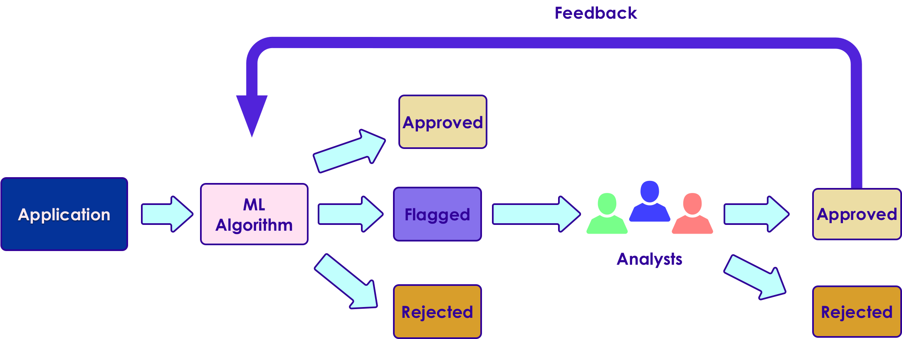

# Machine Learning Primer

---


## Lesson Objectives


 * Learn Machine Learning use cases

 * Understand ML vocabulary

 * Overview of major machine learning algorithms

Notes:


---

# Machine Learning Evolution

---

## Question for Audience

 * Think of something you did today / this week that is AI powered?

Notes:

---
## Demo - Gmail AI Helper


Notes:


---

## Why Machine Learning Matters?


[Link](https://www.youtube.com/watch?v=HcqpanDadyQ)

Notes:

https://www.youtube.com/watch?v=HcqpanDadyQ

---


## What is  Machine Learning


> **"The field of study that gives computers the ability to learn without being explicitly programmed."**  
 -- Arthur Samuel


* Example: Self-driving cars
    - Historical approach:  
    Write a massive program to instruct the car to handle all possible scenarios encountered while driving
        - This is immensely difficult

    - AI approach:  
        - Let AI learn by observing the scenery and your  reactions
        - Once it learnt enough, let the AI predict the next reaction for a scenary


Notes:


---

## Spam Detection - Traditional (Rule Based) Approach

* Here is an example of spam detection rule engine

* The rules are coded by developers

* There could be 100s of 1000s of rules!

```java

if (email.from_ip.one_of("ip1", "ip2", "ip3")) {
  result = "no-spam"
}
else if ( email.text.contains ("free loans", "cheap degrees"))
{
  result = "spam"
}

```

Notes:


---

## Spam Detection - AI Approach


 * Show the algorithm with spam and non-spam emails

 * Algorithm 'learns' which attributes are indicative of spam

 * Then algorithm predicts spam/no-spam on new email


Notes:


---

## How is AI Different from Rule Based Systems


 * Rule based systems are static
    - They are programmed in
    - They don't learn from data

 * AI can learn from data
     - It gets better every day with more data it sees




Notes:

---

# A Brief History of AI


[AI-brief-history.md](AI-brief-history.md)

---


# Machine Learning Use Cases

---

## How ML Can Help a Business

 * Credit Card Application use case

 * In the beginning, all applications are reviewed manually by analysts

     - Approved or rejected based on criteria

 * As the application volume goes up

     - Hire more analysts to keep up with volume
     - Human bias might lead to inconsistent or unfair approval process


Notes:

---


## How ML Can Help a Business


 * Machine Learning algorithm can learn from past loan applications

     - E.g., if applicant already has a credit line and making minimum payments, he/she is likely to default on new credit

 * ML can process applications very quickly and only send "flagged" applications for manual review


Notes:


---

## ML Advantages/Challenges

|Advantages                                   |Challenges                                   |
|-------------------------------------------------------- |-------------------------------------------------------- |
|**- Accurate:** ML can learn from data, the more data it learns from the better it gets <br/>**- Automated:** Bulk of the decisions can be automated <br/>**- Fast:** ML can process data within milliseconds <br/>**- Customizable:** ML algorithms can be adopted for various scenarios <br/>**- Scalable:** ML algorithms can scale for large amount of data       |<br/>**- Data prep:**  Data may not be in ready-to-use form <br/>**- Accuracy:** Measuring accuracy can get complicated <br/>**- Algorithm Choice:** Different algorithms perform differently, choosing the best algorithm is very important   |


Notes:


---

## Machine Learning Applications


 * Detect credit card fraud

 * Recommendations
     - Millions of products
     - To millions of users

 * Genome analysis

 * Language translation

Notes:

---


# AI Vocabulary

[AI-vocabulary.md](AI-vocabulary.md)


---

# Machine Learning vs. Deep Learning

[ML-vs-DL.md](ML-vs-DL.md)


---

## AI Software Eco System

|             | Machine Learning                        | Deep Learning                            |
|-------------|-----------------------------------------|------------------------------------------|
| Java        | - Weka <br/>- Mahout                    | - DeepLearning4J                         |
| Python      | - SciKit <br/>- (Numpy, Pandas)         | - Tensorflow <br/>- Theano <br/>- Caffe  |
| R           | - Many libraries                        | - Deepnet <br/>- Darch                   |
| Distributed | - H20 <br/>- Spark                      | - H20 <br/>- Spark                       |
| Cloud       | - AWS <br/>- Azure  <br/>- Google Cloud | - AWS  <br/>- Azure  <br/>- Google Cloud |

Notes:


---


## Machine Learning and Big Data

 * Until recently most of the machine learning is done on "single computer" (with lots of memory-100s of GBs)

 * Most R/Python/Java libraries are "single node based"

 * Now Big Data tools make it possible to run machine learning algorithms at massive scale-distributed across a cluster


Notes:


---

## Machine Learning vs. Big Data

| Traditional ML                                 | ML on Big Data                               |
|------------------------------------------------|----------------------------------------------|
| All (or most) data fits into single machine    | Data is distributed across multiple machines |
| Data almost / always in memory                 | Memory is scarce                             |
| Optimized for heavy iterative computes         | Optimized for single pass computes           |
| Maintains state between stages                 | stateless                                    |
| CPU bound                                      | IO bound (disk / network).                   |
| GPU (Graphical Processing Unit) seldom engaged | GPUs are utilized increasingly               |            |


Notes:


---

## Tools for Scalable Machine Learning


 *  **Spark ML**
     - Runs on top of popular Spark framework
     - Massively scalable
     - Can use memory (caching) effectively for iterative algorithms
     - Language support: Scala, Java, Python, R


 *  **Cloud Vendors**
     - Ready to go algorithms
     - Visualization tools
     - Wizards to guide
     - Virtually 'unlimited' scale
     - [Amazon Machine Learning](https://aws.amazon.com/machine-learning/), Azure Machine Learning,  Google ML


 
 
 


Notes:

* http://www.kdnuggets.com/2016/04/top-15-frameworks-machine-learning-experts.html
* http://www.infoworld.com/article/2853707/machine-learning/11-open-source-tools-machine-learning.html
* https://aws.amazon.com/machine-learning/


---


## Tools for Scalable Deep Learning


 *  **`TensorFlow`**
     - Based on "data flow graphs"
     - "Tensor" = batches of data
     - Language support: Python, C++
     - Run time: CPU, GPU

<br  clear="all"/>


 *  **`Intel BigDL`**  

     - Deep learning library
     - Built on Apache Spark
     - Language support: Python, Scala


Notes:

* https://www.tensorflow.org/


---

# Machine Learning Algorithms

[ML-Algorithms.md](ML-Algorithms.md)

---

## Elon Musk:  "AI will take over humanity"


Notes:


---

## Lab: Design ML Algorithm


 *  **Problem** :

     - Domestic tension

 *  **Solution** :

     - Buy flowers

 *  **Questions** :

     - How much $$$ to spend

     - Which flowers to choose


Notes:

- Image used with 'Creative Commons Zero' permissions from pexels.com   (https://www.pexels.com/photo/man-in-gray-suit-holding-bouquet-of-pink-and-blue-petaled-flowers-30196/)


---

## Review Questions


 * What is Machine Learning and how is it different from regular programming?

 * Name a few of Machine Learning use cases

 * How does Big Data help Machine Learning?

 * What is supervised learning? Unsupervised learning?

Notes:


---

## Further Reading


 * [Great AI Awakening](https://www.nytimes.com/2016/12/14/magazine/the-great-ai-awakening.html) - New York Times profile of on Google Brain and the people behind it

 * [Gentle Intro to Machine Learning](https://monkeylearn.com/blog/a-gentle-guide-to-machine-learning/)

 * [Machine Learning Basics](https://www.analyticsvidhya.com/blog/2015/06/machine-learning-basics/)

Notes:

* https://www.nytimes.com/2016/12/14/magazine/the-great-ai-awakening.html
* https://monkeylearn.com/blog/a-gentle-guide-to-machine-learning/
* https://www.analyticsvidhya.com/blog/2015/06/machine-learning-basics/
