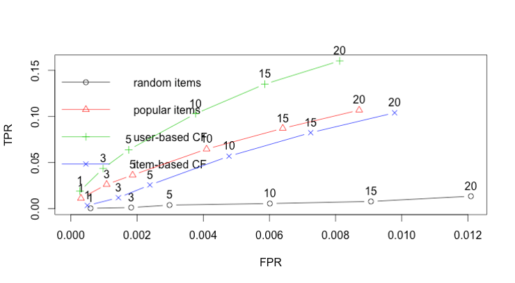

# Recommendations -Spark

---

# Collaborative Filtering in Spark

---

## CF in Spark ML


 * Spark ML implements ALS – Alternating Minimum Squares Algorithm

 *  **org.apache.spark.ml.recommendation.ALS**  **pyspark.ml.recommendation.ALS**

 * The DataFrame-based API for ALS currently only supports integers for user and item ids

Notes:


---

## ALS Parameters

| parameter         	| Description                                                                                             	| default                       	|
|-------------------	|---------------------------------------------------------------------------------------------------------	|-------------------------------	|
| numBlocks         	| number of blocks the users and items will be partitioned into in order to parallelize computation       	| 10                            	|
| rank              	| the number of latent factors in the model                                                               	| 10                            	|
| maxIter           	| maximum number of iterations to run                                                                     	| 10                            	|
| implicitPrefs     	| specifies whether to use the explicit feedback ALS variant or one adapted for implicit feedback data    	| False (use explicit feedback) 	|
| coldStartStrategy 	| How to handle missing ratings data for new user / new item <br/>- NaN : Not a Number <br/>- "drop" : drop this data 	| NaN                           	|

Notes:


---

## ALS


 *  **Handling Explicit / Implicit Feedback**

     - Explicit feedback: User explicitly rated an item

     - Implicit feedback

        * User watched a movie  / played a song

        * User shared the movie on social media ..etc

     - Spark ALS can handle implicit feedback, treating values are numbers indicating strength of likeness

 *  **Cold-start strategy**

     - NaN is good for production

     - But during cross-validation testing / training NaN can present issues.  Use "drop" to eliminate the data from the set

Notes:


---

## ALS Code (Python)


 * ALS class exists in two forms:

     - Dataframe based API: spark.ml.recommendations

     - RDD-based API: spark.mllib.recommendations (more mature)

```text
als = ALS(maxIter=5, regParam=0.01, userCol="userId", itemCol="movieId", ratingCol="rating",coldStartStrategy ="drop")

model = als.fit(training)
datapredictions = model.transform(test)

evaluator = RegressionEvaluator( metricName="rmse", labelCol="rating", predictionCol = "prediction")

rmse = evaluator.evaluate(predictions)

```
<!-- {"left" : 0, "top" : 2.82, "height" : 1.2, "width" : 10.25} -->


Notes:


---

## Evaluating CF Recommendations (ROC)


<!-- {"left" : 0.76, "top" : 1.22, "height" : 5.53, "width" : 8.73} -->


Notes:

https://en.wikipedia.org/wiki/Receiver_operating_characteristic


---

## Lab: Recommendations


 *  **Overview**:

    - Use CF recommender in Spark ML

 *  **Approximate time**:

    - 30 – 40 mins

 *  **Instructions**:

    - Follow 'recommender' lab instructions for Scala or Python


Notes:


---

## Further Reading


 * "[Recommender Systems](https://www.slideshare.net/xamat/recommender-systems-machine-learning-summer-school-2014-cmu
)" – presentation by Xavier Amtriain, Research Director @  Netflix

 * "[Gentle introduction to Recommender systems](https://www.slideshare.net/xamat/recommender-systems-machine-learning-summer-school-2014-cmu
)"

Notes:

* https://www.slideshare.net/xamat/recommender-systems-machine-learning-summer-school-2014-cmu
* https://jessesw.com/Rec-System/


---

# Backup Slides

---

## Preparing Data for MLlib


 * MLlib only looks at integer userid and itemid.

     - Assign your data with unique integer userid and itemid.

 * Preferences are expressed as a double (higher is better)

     - What if your preferences are binary (yes/no)?

        * Assign a number, say, 5.0 for yes, and 1.0 for no.

     - What if preferences are just “implied”?

        * User viewed item as 5.0, no data for unviewed item.

 * MLLib Rating: Integer, Integer, Double

     -  **Rating(**  **userId**  **,**  **itemId**  **, rating)**

Notes:


---

## MLlib Recommendations Model (ALS)


 * Uses the Recommendations.ALS

 * ALS = Alternating Least Squares algorithm

 * Train Model using number of iterations and rank.

 * Class “Rating”, contains a UserId, ItemId, and numeric rating (i.e. 0-5).  

 * Train model using training data:

     -  **`val`**  model  **`=`**   **`ALS`** .train(ratings, rank, numIterations, 0.01)

Notes:

ALS – Alternating Least Squares is an algorithm.


---

## Making a Prediction

* Use prediction method on model (like regression/classification)

    **import org.apache.spark.mllib.recommendation.ALS**

    **import org.apache.spark.mllib.recommendation.Rating**

    **Model.predict (RDDUsersItems)**

     - Input Takes an RDD of user – item pairs as argument (NOT Ratings)

     - Returns RDD of Rating (user, item, double rating)

Notes:
