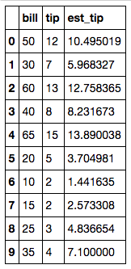

# Session: Regressions in Spark

---

## Lesson Objectives


 * Learn Regression algorithms in Spark ML

Notes:


---

# Linear Regression in Spark

---

## Regression Algorithms In Spark ML

| Algorithms                       	|                                                  	| Class / Package                                             	|
|----------------------------------	|--------------------------------------------------	|-------------------------------------------------------------	|
| Linear Regression                	|                                                  	| org.apache.spark.ml.regression. **LinearRegression**            	|
| Generalized  Linear Models (GLM) 	| -  Logistic  Regression   <br /> -  Poisson Regression 	| org.apache.spark.ml.regression. **GeneralizedLinearRegression** 	|

Notes:


---

## LinearRegression Parameters

| Parameter        	| Function                    	| Description                                                                                                                                                                               	| Default Value 	|
|------------------	|-----------------------------	|-------------------------------------------------------------------------------------------------------------------------------------------------------------------------------------------	|---------------	|
| maxIter          	| setMaxIter(Int)             	| Max number of iterations                                                                                                                                                                  	| 100           	|
| regParam         	| setRegParam(Double)         	| Regulation parameter                                                                                                                                                                      	| 0.0           	|
| elasticNetPa ram 	| setElasticNetParam (Double) 	| ElasticNet mixing parameter.  Range 0 to 1.<br /> - For alpha = 0, the penalty is an L2 penalty<br /> - For alpha = 1, it is an L1 penalty<br /> - For alpha in (0,1), the penalty is a combination of L1 and L2. 	| 0.0  (L2)     	|
| featuresCol      	| setFeaturesCol ()           	| Which column as input features                                                                                                                                                            	| "features"    	|
| predictionCol    	| setPredictionCol ()         	| Output prediction column                                                                                                                                                                  	| "prediction"  	|

Notes:


---

## Example: Tip Calculation


 * Now our tip data includes total bill amount too!

 * Do you see any correlation?


Notes:


---

## Tips vs Bill


 * There is clearly a correlation between bill amount and tip

 * We can fit a line to predict tip

 * This is **linear regression**!


Notes:


---

## Spark Linear Regression Code (Scala)

```
 import org.apache.spark.ml.regression.LinearRegression  

 // Load training data
 val training = spark.read.....  

 val lr = new LinearRegression()  
    .setMaxIter(10)  
    .setRegParam(0.3)  
    .setElasticNetParam(0.8)    

 // Fit the model
 val lrModel = lr.fit(training)  

 // Print the coefficients and intercept for linear regression
 println(s"Coefficients: ${lrModel.coefficients} Intercept: ${lrModel.intercept}")  

 // Summarize the model over the training set and print out some metrics
 val trainingSummary = lrModel.summary
 println(s"numIterations: ${trainingSummary.totalIterations}")
 println(s"objectiveHistory: [${trainingSummary.objectiveHistory.mkString(",")}]")
 trainingSummary.residuals.show()
 println(s"RMSE: ${trainingSummary.rootMeanSquaredError}")
 println(s"r2: ${trainingSummary.r2}")
```
Notes:

TODO – update for tips


---

## Spark Linear Regression Code (Python)  1/4  - Creating Data Frames

```
 #  **** 1 ****

 import numpy as np
 import pandas as pd

 tip_data = pd.DataFrame({     
     'bill' : [50.00, 30.00, 60.00, 40.00, 65.00, 20.00, 10.00, 15.00, 25.00, 35.00],
     'tip' : [12.00, 7.00, 13.00, 8.00, 15.00, 5.00, 2.00, 2.00, 3.00, 4.00]    
     })
print(tip_data)  


#  **** 2 ****
 spark_tips = spark.createDataFrame(tip_data)
 spark_tips.show()
```

 * ** 1 **: importing Numpy and Pandas libraries

 * ** 2 ** : Constructing a Panda dataframe and converting it into Spark dataframe

Notes:


---

## Spark Linear Regression Code (Python)  2/4 – Plotting Data

```
 import matplotlib.pyplot as plt
 plt.scatter(tip_data.bill, tip_data.tip)
 plt.ylabel('tip')
 plt.xlabel('bill')
 plt.show()
```


Notes:


---

## Spark Linear Regression Code (Python) 3/4 – Create a Model, Fit Training Data

```
 from pyspark.ml.regression import LinearRegression 
 from pyspark.ml.feature import VectorAssembler 

 #  **** 3 ****
 assembler = VectorAssembler(inputCols=["bill"], outputCol="features")
 featureVector = assembler.transform(spark_tips)
 featureVector.show()

 #  **** 4 ****
 lr = LinearRegression(maxIter=10, regParam=0.3, elasticNetParam=0.8)
 lrModel = lr.fit(featureVector)

 #  **** 5 ****
 intercept = lrModel.intercept    # This is the intercept  
 slope = lrModel.coefficients[0]  # This is the slope
```
Notes:


---

## Spark Linear Regression Code (Python) 3/4 – Print Model Properties

```
# Print the coefficients and intercept for linear regression  
print("Coefficients: %s" % str(lrModel.coefficients[0]))
print("Intercept: %s" % str(lrModel.intercept))    

# Summarize the model over the training set and print out some metrics
trainingSummary = lrModel.summary
print("numIterations: %d" % trainingSummary.totalIterations)
print("objectiveHistory: %s" % str(trainingSummary.objectiveHistory))
print("RMSE: %f" % trainingSummary.rootMeanSquaredError)
print("r2: %f" % trainingSummary.r2)
trainingSummary.residuals.show()
```

```text
Coefficients: 0.226334605857
Intercept: -0.8217112049846651
numIterations: 3
objectiveHistory: [0.5000000000000002, 0.4158224893708402, 0.10101250448579287]
RMSE: 1.413302
r2: 0.902517
+--------------------+
|           residuals|
+--------------------+
|  1.5049809121494295|
|  1.0316730292835246|
|  ...               |
| -3.0999999999999996|
+--------------------+

```

Notes:


---

## Evaluating Linear Regression Model

  * Plot
  * Residuals
  * R2

Notes:


---

## Evaluating Linear Regression Model - Plot the regression

```
 # Create a list of values in the best fit line
 abline_values = [slope * i + intercept for i in tip_data.bill]

 # Plot the best fit line over the actual values
 plt.scatter(tip_data.bill, tip_data.tip)
 plt.plot(tip_data.bill, abline_values, 'b')
 plt.ylabel('tip')
 plt.xlabel('bill')
 plt.title("Fit Line")
 plt.show()
```


Notes:


---

## Evaluating Linear Regression Model – Calculate Coefficient of Determination (R2)

 * R2 is between 0 and 1.1 is perfect fit!

 * Here our R2 is 0.90 -> pretty good fit !

```
 # Summarize the model over the training set and print out some metrics
 trainingSummary = lrModel.summary
 print("RMSE: %f" % trainingSummary.rootMeanSquaredError)
 print("r2: %f" % trainingSummary.r2)

# output
# RMSE: 1.413302
# r2: 0.902517
```

Notes:


---

## Evaluating Linear Regression Model – Plot Residuals

  * Residuals are the error / difference between the actual tip and predicted tip

  * We want it to be as small as possible

  * Overall residuals should be close to zeroWe don't want model that always predicts high or low


Notes:


---

## Evaluating Linear Regression Model – Estimate Tip

```
 a = lrModel.coefficients[0]   # -0.8217112049846651
 b = lrModel.intercept         # 0.226334605857*   

 tip_for_100 = a * 100 + b   
 print(tip_for_100)   # 21.81     

 # add estimated tip to dataframe  
 tip_data['est_tip'] = tip_data.bill * a + b
 tip_data
```



Notes:


---

## Evaluating Linear Regression Model – Estimate Tip

```
 ## Adding Estimated Tip column to Spark dataframe
 # This is a bit tricky. We need to use the sql expr function to make this work.
 # The formula: (bill * a) + b

 from pyspark.sql.functions import expr  
 formula = "(bill * " + str(a) + ") + " + str(b)
 print(formula)  

 spark_tips_with_est = spark_tips.withColumn("est_tip", expr(formula))
 spark_tips_with_est.show()
```

```text
(bill * 0.226334605857) + -0.8217112049846651

+----+----+------------------+
|bill| tip|           est_tip|
+----+----+------------------+
|50.0|12.0|10.495019087865336|
|30.0| 7.0| 5.968326970725334|
|60.0|13.0|12.758365146435334|
|40.0| 8.0| 8.231673029295335|
|65.0|15.0|13.890038175720335|
|20.0| 5.0|3.7049809121553343|
|10.0| 2.0|1.4416348535853347|
|15.0| 2.0| 2.573307882870335|
|25.0| 3.0| 4.836653941440335|
|35.0| 4.0|7.1000000000103345|
+----+----+------------------+

```

Notes:


---

## Lab: Linear Regression


  *  **Overview**:
     - Use ML Linear Regression
  *  **Approximate time**:
     - 20-40 mins
  *  **Instructions**:
     - LIR-1: tip data, to get started with APIs

     - LIR-2: house prices


Notes:


---

# Multiple Linear Regression in Spark

---

## Problem: House Prices

 | Sale Price $ 	| Bedrooms 	| Bathrooms 	| Sqft_Living 	| Sqft_Lot 	|
|--------------	|----------	|-----------	|-------------	|----------	|
| 280,000      	| 6        	| 3         	| 2,400       	| 9,373    	|
| 1,000,000    	| 4        	| 3.75      	| 3,764       	| 20,156   	|
| 745,000      	| 4        	| 1.75      	| 2.060       	| 26,036   	|
| 425,000      	| 5        	| 3.75      	| 3,200       	| 8,618    	|
| 240,000      	| 4        	| 1.75      	| 1,720       	| 8,620    	|
| 327,000      	| 3        	| 1.5       	| 1,750       	| 34,465   	|
| 347,000      	| 4        	| 1.75      	| 1,860       	| 14,650   	|


  * Multiple factors decide house prices

  * It is not a simple  Y ~ X any more

  * We will use  **multiple linear regression**

Notes:


---

## Multiple Linear Regression


 * Outcome depends on multiple variables

Notes:


---

## Multiple Linear Regression in Spark


  * Spark.ml.LinearRegression supports MLR out of the box

  * When creating a featureVector, we will have multiple columns are input

     - ["Bedrooms", "Bathrooms", "SqFtTotLiving", "SqFtLot"]

     - Order doesn't matter

Notes:


---

## Multiple Linear Regression in Spark – Code (Python)

```
import numpy as np
import pandas as pd
import matplotlib.pyplot as plt
from pyspark.ml.regression import LinearRegression
from pyspark.ml.feature import VectorAssembler

housePrices = spark.read.csv("/data/house-prices/house-sales-full.csv", header=True, inferSchema=True)
housePrices.show()
## too many attributes / columns

## select a few attributes
housePrices_compact = housePrices_compact.show()
housePrices.select("SalePrice", "Bedrooms", "Bathrooms", "SqFtTotLiving", "SqFtLot")

housePrices_compact.count() ## 27,063 observations

```


Notes:


---

## Multiple Linear Regression in Spark – Code (Python)


```text
Row count = 27063


+---------+--------+---------+-------------+-------+
|SalePrice|Bedrooms|Bathrooms|SqFtTotLiving|SqFtLot|
+---------+--------+---------+-------------+-------+
|   280000|       6|      3.0|         2400|   9373|
|  1000000|       4|     3.75|         3764|  20156|
|   745000|       4|     1.75|         2060|  26036|
|   425000|       5|     3.75|         3200|   8618|
|   240000|       4|     1.75|         1720|   8620|
|   349900|       2|      1.5|          930|   1012|
|   327500|       3|      1.5|         1750|  34465|
|   347000|       4|     1.75|         1860|  14659|
|   220400|       2|      1.0|          990|   5324|
|   437500|       4|      2.0|         1980|  10585|
|   150000|       2|      1.0|          840|  12750|
|   300000|       3|      1.0|         1750|   5200|
+---------+--------+---------+-------------+-------+

```

Notes:


---

## Multiple Linear Regression in Spark – Code (Python)

```
assembler = VectorAssembler(inputCols=["Bedrooms", "Bathrooms","SqFtTotLiving", "SqFtLot"], outputCol="features")

featureVector = assembler.transform(housePrices_compact)
featureVector = featureVector.withColumnRenamed("SalePrice", "label") featureVector.show(10,False) # display 10 rows and all column data without truncating

```


```text
+-------+--------+---------+-------------+-------+-------------------------+
|label  |Bedrooms|Bathrooms|SqFtTotLiving|SqFtLot|features                 |
+-------+--------+---------+-------------+-------+-------------------------+
|280000 |6       |3.0      |2400         |9373   |[6.0,3.0,2400.0,9373.0]  |
|1000000|4       |3.75     |3764         |20156  |[4.0,3.75,3764.0,20156.0]|
|745000 |4       |1.75     |2060         |26036  |[4.0,1.75,2060.0,26036.0]|
|425000 |5       |3.75     |3200         |8618   |[5.0,3.75,3200.0,8618.0] |
|240000 |4       |1.75     |1720         |8620   |[4.0,1.75,1720.0,8620.0] |
|349900 |2       |1.5      |930          |1012   |[2.0,1.5,930.0,1012.0]   |
|327500 |3       |1.5      |1750         |34465  |[3.0,1.5,1750.0,34465.0] |
|347000 |4       |1.75     |1860         |14659  |[4.0,1.75,1860.0,14659.0]|
|220400 |2       |1.0      |990          |5324   |[2.0,1.0,990.0,5324.0]   |
|437500 |4       |2.0      |1980         |10585  |[4.0,2.0,1980.0,10585.0] |
+-------+--------+---------+-------------+-------+-------------------------+
only showing top 10 rows

```

Notes:


---

## Multiple Linear Regression in Spark – Code (Python)


```
lr = LinearRegression(maxIter=10, regParam=0.3, elasticNetParam=0.8)
lrModel = lr.fit(featureVector)
print("Coefficents:" + str(lrModel.coefficients))
print("Intercept: " + str(lrModel.intercept))
print("RMSE: %f" % lrModel.summary.rootMeanSquaredError)
print("r2: %f" % lrModel.summary.r2)
print("numIterations: %d" % lrModel.summary.totalIterations)
print("objectiveHistory: %s" % str(lrModel.summary.objectiveHistory))
```

```text
Coefficents:[-69405.457812,25714.1481078,274.458312769,-0.0]
Intercept: 105562.58117252712

RMSE: 246442.225880
r2: 0.483214

numIterations: 11
objectiveHistory: [0.5000000000000002, 0.4565457266170319, 0.3376986997173243, 0.30010335871879656, 0.2852977093323423, 0.27654782886180707, 0.2701349132960898, 0.26332624819112604, 0.26138384191458414, 0.25967594157902535, 0.25839392000729794]

```

 *  **Question for the class:**

    Is this model a good fit?  Explain!

Notes:


---

### Multiple Linear Regression in Spark – Code (Python) - Let's Do Some Predictions


```
new_data = pd.DataFrame({'Bedrooms' : [5,3,2],
                         'Bathrooms' : [3,2,1.5],
                         'SqFtTotLiving' : [4400, 1800, 1550],
                         'SqFtLot' : [10000, 5000, 4000]
                        })
new_data_spark = spark.createDataFrame(new_data)
new_featureVector = assembler.transform(new_data_spark)
new_featureVector.show(10,False)

predicted_prices = lrModel.transform(new_featureVector)
predicted_prices.show(10, False)
```

```text
# output: new_feature_vector
+---------+--------+-------+-------------+------------------------+
|Bathrooms|Bedrooms|SqFtLot|SqFtTotLiving|features                |
+---------+--------+-------+-------------+------------------------+
|3.0      |5       |10000  |4400         |[5.0,3.0,4400.0,10000.0]|
|2.0      |3       |5000   |1800         |[3.0,2.0,1800.0,5000.0] |
|1.5      |2       |4000   |1550         |[2.0,1.5,1550.0,4000.0] |
+---------+--------+-------+-------------+------------------------+

```

```text
# output: predicted_prices
+---------+--------+-------+-------------+------------------------+------------------+
|Bathrooms|Bedrooms|SqFtLot|SqFtTotLiving|features                |prediction        |
+---------+--------+-------+-------------+------------------------+------------------+
|3.0      |5       |10000  |4400         |[5.0,3.0,4400.0,10000.0]|1043294.3126218329|
|2.0      |3       |5000   |1800         |[3.0,2.0,1800.0,5000.0] |442799.46693731495|
|1.5      |2       |4000   |1550         |[2.0,1.5,1550.0,4000.0] |430733.2725030012 |
+---------+--------+-------+-------------+------------------------+------------------+

```

Notes:


---

## Lab: Multiple Linear Regression


  *  **Overview**:

     - Use ML Multiple Linear Regression

  *  **Approximate time**:

     - 20-40 mins

  *  **Instructions**:

      - LIR-3: house prices with multiple linear regression


Notes:


---

# Logistic Regression in Spark

---

## Logistic Algorithms in Spark ML


 * Supports

     - Binomial Logistic Regression (binary outcomes, yes/no)

     - Multinomial Logistic Regression (predicts K possible outcomes)

 * Implementation (new ML package)

     - org.apache.spark.ml.classification.LogisticRegression

Notes:


---

## LogisticRegression Parameters

| Parameter 	| Function            	| Description                                                                                                                                                                                                                                                                            	| Default Value 	|
|-----------	|---------------------	|----------------------------------------------------------------------------------------------------------------------------------------------------------------------------------------------------------------------------------------------------------------------------------------	|---------------	|
| maxIter   	| setMaxIter(Int)     	| Max number of iterations                                                                                                                                                                                                                                                               	| 100           	|
| regParam  	| setRegParam(Double) 	| Regulation parameter                                                                                                                                                                                                                                                                   	| 0.0           	|
| family    	| setFamily(String)   	| -binomial: Binary logistic regression with pivoting <br/>- multinomial: Multinomial logistic (softmax) regression without pivoting  <br/>- auto: Automatically select the family based on the number of classes: If numClasses == 1 OR numClasses == 2, set to binomial. Else, set to multinomial 	| "auto"        	|

Notes:


---

## LogisticRegression Parameters

| Parameter        	| Function                    	| Description                                                                                                                                                                            	| Default Value 	|
|------------------	|-----------------------------	|----------------------------------------------------------------------------------------------------------------------------------------------------------------------------------------	|---------------	|
| elasticNetPa ram 	| setElasticNetParam (Double) 	| ElasticNet mixing parameter.  Range 0 to 1.<br/>- For alpha = 0, the penalty is an L2 penalty<br/>- For alpha = 1, it is an L1 penalty<br/>- For alpha in (0,1), the penalty is a combination of L1 and L2. 	| 0.0  (L2)     	|
| featuresCol      	| setFeaturesCol ()           	| Which column as input features                                                                                                                                                         	| features      	|
| predictionCol    	| setPredictionCol ()         	| Output prediction column                                                                                                                                                               	| prediction    	|


Notes:


---

### Example: Applying for Credit Card


 * Here is historical data on credit score and if the credit application is approved

 * What is the chance someone with score of  **700**  getting a credit card approved?

| Credit Score 	| Approved? 	|
|--------------	|-----------	|
| 560          	| No        	|
| 750          	| Yes       	|
| 680          	| Yes       	|
| 650          	| No        	|
| 450          	| No        	|
| 800          	| Yes       	|
| 775          	| Yes       	|
| 525          	| No        	|
| 620          	| No        	|
| 705          	| No        	|
| 830          	| Yes       	|
| 610          	| Yes       	|
| 690          	| No        	|

Notes:

Image credit : (CC) : https://www.flickr.com/photos/cafecredit/27321078025


---

## Plotting Credit Approval Data


Notes:


---

## Logistic Regression in Spark ML Code (Python) 1/4

```
import numpy as np
import pandas as pd
from pyspark.ml.classification import LogisticRegression
from pyspark.ml.feature import VectorAssembler

mydata = pd.DataFrame({
            'score' : [550, 750, 680, 650, 450, 800, 775, 525, 620, 705, 830, 610, 690],
            'approved' : [0,1,1,0,0,1,1,0,0,0,1,1,0]
            })
credit_data = spark.createDataFrame(mydata)
```

* Converting a Pandas dataframe into Spark dataframe

Notes:


---

## Logistic Regression in Spark ML Code (Python) 2/4


 ```
 assembler = VectorAssembler(inputCols=["score"], outputCol="features")
 featureVector = assembler.transform(credit_data)
 featureVector = featureVector.withColumn("label",featureVector.approved)
 featureVector.show()
```

```text
+--------+-----+--------+-----+
|approved|score|features|label|
+--------+-----+--------+-----+
|       0|550.0| [550.0]|    0|
|       1|750.0| [750.0]|    1|
|       1|680.0| [680.0]|    1|
|       0|650.0| [650.0]|    0|
|       0|450.0| [450.0]|    0|
|       1|800.0| [800.0]|    1|
|       1|775.0| [775.0]|    1|
|       0|525.0| [525.0]|    0|
|       0|620.0| [620.0]|    0|
|       0|705.0| [705.0]|    0|
|       1|830.0| [830.0]|    1|
|       1|610.0| [610.0]|    1|
|       0|690.0| [690.0]|    0|
+--------+-----+--------+-----+

```

Notes:


---

## Logistic Regression in Spark ML Code (Python) 3/4


```
lr = LogisticRegression(maxIter=50, regParam=0.3, elasticNetParam=0.8)

# Fit the model
lrModel = lr.fit(featureVector)

# Print the coefficients and intercept for logistic regression
print("Coefficients: " + str(lrModel.coefficients))
print("Intercept: " + str(lrModel.intercept))
```

```text
Coefficients: [0.00231936473739]
Intercept: -1.697546464447156

```

Notes:


---

## Logistic Regression in Spark ML Code (Python) 4/4

```
 lrModel.summary.predictions.show()
```

```text
+--------+-----+--------+-----+--------------------+--------------------+----------+
|approved|score|features|label|       rawPrediction|         probability|prediction|
+--------+-----+--------+-----+--------------------+--------------------+----------+
|       0|550.0| [550.0]|  0.0|[0.42189585888523...|[0.60393682312240...|       0.0|
|       1|750.0| [750.0]|  1.0|[-0.0419770885918...|[0.48950726855595...|       1.0|
|       1|680.0| [680.0]|  1.0|[0.12037844302514...|[0.53005832166779...|       0.0|
|       0|650.0| [650.0]|  0.0|[0.18995938514670...|[0.54734755549913...|       0.0|
|       0|450.0| [450.0]|  0.0|[0.65383233262376...|[0.65787354968202...|       0.0|
|       1|800.0| [800.0]|  1.0|[-0.1579453254610...|[0.46059555225819...|       1.0|
|       1|775.0| [775.0]|  1.0|[-0.0999612070264...|[0.47503048656856...|       1.0|
|       0|525.0| [525.0]|  0.0|[0.47987997731987...|[0.61771953276060...|       0.0|
|       0|620.0| [620.0]|  0.0|[0.25954032726826...|[0.56452329070847...|       0.0|
|       0|705.0| [705.0]|  0.0|[0.06239432459051...|[0.51559352260997...|       0.0|
|       1|830.0| [830.0]|  1.0|[-0.2275262675826...|[0.44336255743359...|       1.0|
|       1|610.0| [610.0]|  1.0|[0.28273397464212...|[0.57021636641005...|       0.0|
|       0|690.0| [690.0]|  0.0|[0.09718479565129...|[0.52427709405754...|       0.0|
+--------+-----+--------+-----+--------------------+--------------------+----------+

```

 *  **Question for the class:** Notice when the prediction differs from actual ('approved')

Notes:


---

## Evaluating Logistics Regression


 * We are going to use ROC curve / Area-Under-Curve measure to evaluate the logistic model

 *  **Note to instructor:** Jump off point to  **ML-Concepts.pptx**


Notes:


---

## Logistic Regression in Spark ML Code (Python) 4/4

```
 trainingSummary = lrModel.summary
 print("areaUnderROC: " + str(trainingSummary.areaUnderROC))  
 ## 0.8571428571428571

 roc_df = trainingSummary.roc.toPandas()
 plt.plot(roc_df['FPR'], roc_df['TPR'])
 plt.xlabel("FPR")
 plt.ylabel("TPR")
 plt.title("ROC Curve")
 plt.plot([0.0, 1.0], [0.0, 1.0], 'r')
```


 * 0 <= AUC <= 1.0

 * Here AUC = 0.857

 * Pretty good !


 


Notes:


---

## Prediction

```
newdata = pd.DataFrame({'score' : [600, 700, 810] })
print(newdata)

spark_newdata = spark.createDataFrame(newdata)
newfeatures = assembler.transform(spark_newdata)
predicted = lrModel.transform(newfeatures)
predicted.show(10, False)

```

```text
   score
0    600
1    700
2    810


+-----+--------+--------------------+--------------------+----------+
|score|features|       rawPrediction|         probability|prediction|
+-----+--------+--------------------+--------------------+----------+
|  600| [600.0]|[0.30592762201597...|[0.57589092990394...|       0.0|
|  700| [700.0]|[0.07399114827744...|[0.51848935254944...|       0.0|
|  810| [810.0]|[-0.1811389728349...|[0.45483867290735...|       1.0|
+-----+--------+--------------------+--------------------+----------+

```

 * TODO : verify thiscredit score 600 has only 14% (probability 0.14) chance of getting approved

 * credit score of 810 has 93% chance of approval

Notes:


---

## LogisticRegression Code (Python) – Full Code

```
import numpy as np
import pandas as pd
from pyspark.ml.classification import LogisticRegression
from pyspark.ml.feature import VectorAssembler

mydata = pd.DataFrame({
     'score' : [550, 750, 680, 650, 450, 800, 775, 525, 620, 705, 830, 610, 690],
     'approved' : [0,1,1,0,0,1,1,0,0,0,1,1,0]
    })

credit_data = spark.createDataFrame(mydata)
assembler = VectorAssembler(inputCols=["score"], outputCol="features") featureVector = assembler.transform(credit_data)
featureVector = featureVector.withColumn("label",featureVector.approved)

lr = LogisticRegression(maxIter=50, regParam=0.3, elasticNetParam=0.8)
lrModel = lr.fit(featureVector)

print("Coefficients: " + str(lrModel.coefficients))
print("Intercept: " + str(lrModel.intercept))
```

Notes:


---

## Lab: Logistic Regression


 *  **Overview**:

     - Learn Logistic Regression

 *  **Approximate time**:

     - 15-20 mins

 *  **Instructions**:

     - LOG-1: Credit card approval

Notes:


---

# Multiple Logistic Regression in Spark

---

## Multiple Logistic Regression


 * So far we have seen ONE predictor determining the outcome

     - Credit score determining  approval / denial

 * We can have multiple factors (independent variables) determining an outcome as well

     - This is called 'multiple logistic regression'


Notes:


---

## Exercise: College Admission


 * Consider college application and admittance data

 *  **Inputs** :

     - GRE:  max 800

     - GPA: 1.0  to4.0

     - Rank: 1 (better) to 4

 *  **Output**

     - Admitted : Yes or No

 * We are going to use Multiple Logistic Regression to predict admission results


---


## Exercise: College Admission


| gre 	| gpa  	| rank 	| admitted 	|
|-----	|------	|------	|----------	|
| 380 	| 3.6  	| 3    	| No       	|
| 660 	| 3.67 	| 3    	| Yes      	|
| 800 	| 4    	| 1    	| Yes      	|
| 640 	| 3.19 	| 4    	| Yes      	|
| 520 	| 2.93 	| 4    	| No       	|
| 760 	| 3.0  	| 2    	| Yes      	|
| 400 	| 3.08 	| 2    	| No       	|
| 700 	| 4.0  	| 1    	| Yes      	|
| 500 	| 3.17 	| 3    	| No       	|

Notes:


---

## Multiple Logistic Regression Code (Python)


 ```
admissions = spark.read.csv("/data/college-admissions/admission-data.csv",header=True, inferSchema=True)
admissions.show()
assembler = VectorAssembler(inputCols=["gre", "gpa","rank"], outputCol="features")
featureVector = assembler.transform(admissions)
featureVector = featureVector.withColumn("label",featureVector["admit"]) featureVector.show()
 ```

```text
# admissions

+-----+---+----+----+
|admit|gre| gpa|rank|
+-----+---+----+----+
|    0|380|3.61|   3|
|    1|660|3.67|   3|
|    1|800| 4.0|   1|
|    1|640|3.19|   4|
|    0|520|2.93|   4|

```

```text
# featureVector

+-----+---+----+----+----------------+-----+
|admit|gre| gpa|rank|        features|label|
+-----+---+----+----+----------------+-----+
|    0|380|3.61|   3|[380.0,3.61,3.0]|    0|
|    1|660|3.67|   3|[660.0,3.67,3.0]|    1|
|    1|800| 4.0|   1| [800.0,4.0,1.0]|    1|
|    1|640|3.19|   4|[640.0,3.19,4.0]|    1|
|    0|520|2.93|   4|[520.0,2.93,4.0]|    0|

```

Notes:


---

## Multiple Logistic Regression Code (Python)

```
lr = LogisticRegression(maxIter=50, regParam=0.3, elasticNetParam=0.8)
lrModel = lr.fit(featureVector)

# Print the coefficients and intercept for logistic regression
print("Coefficients: " + str(lrModel.coefficients))
print("Intercept: " + str(lrModel.intercept)
lrModel.summary.predictions.show()
```

```text
TODO output
```

Notes:


---

## Evaluating Multiple Logistic Regression  Model


```
trainingSummary = lrModel.summary
print("areaUnderROC: " + str(trainingSummary.areaUnderROC))

# ROC curve
roc_df = trainingSummary.roc.toPandas()
plt.plot(roc_df['FPR'], roc_df['TPR'])
plt.xlabel("FPR") plt.ylabel("TPR")
plt.title("ROC Curve")
plt.plot([0.0, 1.0], [0.0, 1.0], 'r')
```

```text
TODO output
```

Notes:


---

## Predict Outcomes Multiple Logistic Regression  Model


```
newdata = pd.DataFrame({'gre' : [600, 700, 800],
                        'gpa' : [4.0, 3.5, 3.2],
                        'rank': [1, 2, 3]}
                        })
print(newdata)

spark_newdata = spark.createDataFrame(newdata)
newfeatures = assembler.transform(spark_newdata)
lrModel.transform(newfeatures).show()
```

```text
TODO output
```

Notes:


---

## Lab: Multiple Logistic Regression


  *  **Overview**:

     - Learn Logistic Regression

  *  **Approximate time**:

     - 15-20 mins

  *  **Instructions**:

     - LOG-2: College Admissions


Notes:
