# Session: Regressions

---

## Algorithm Summary

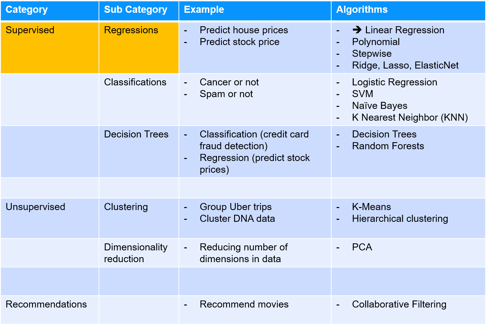


Notes:

http://machinelearningmastery.com/supervised-and-unsupervised-machine-learning-algorithms/


---

# Regressions

---

## What Is Regression Analysis


 * Regression models relationship between  **independent variable(s) (predictor)** and  **dependent variable (target)**

 * Regressions are used to predict 'numeric' data

     - House prices

     - Stock price

Notes:


---

## Regression Algorithms

| Algorithm           	| Description                                                                                                                                                        	| Use Case                                                	|
|---------------------	|--------------------------------------------------------------------------------------------------------------------------------------------------------------------	|---------------------------------------------------------	|
| Linear Regression   	| Establishes  a best fit 'straight line' <br/> <br/>     **Advantages:**    <br/>-  Simple, well understood    <br/>-  Scales to large datasets       <br/><br/>**Disadvantages**  <br/>-  Prone to outliers 	| -  House prices  <br/> -  Stock market 	|
| Logistic Regression 	| -  Calculates  the probability of outcome (success or failure)   <br/>-  Used for **'classification'**  ;)    <br/>-  Needs large sample sizes for accurate prediction       	| -  Mortgage application approval   	|


Notes:

https://www.analyticsvidhya.com/blog/2015/08/comprehensive-guide-regression/


---

## Regression Algorithms

| Algorithm             	| Description                                                                                                                             	| Use Case                	|
|-----------------------	|-----------------------------------------------------------------------------------------------------------------------------------------	|-------------------------	|
| Polynomial Regression 	| If power of independent variable is more than 1.  Y = a * X + b * X<sup>2</sup>   <br/>- Can be prone to overfitting  <br/>- Results can be hard to explain 	|                         	|
| Stepwise Regression   	| -When we have multiple independent variables, automatically selects significant variables  <br/>- No human intervention  <br/>- AIC               	| - House price predictor 	|

Notes:


---

## Regression Algorithms

| Algorithm             	| Description                                                                    	| Use Case 	|
|-----------------------	|--------------------------------------------------------------------------------	|----------	|
| Ridge Regression      	| -used when independent variables are highly correlated <br/>-Uses L2 regularization 	|          	|
| Lasso Regression      	| -Uses L1 regularization                                                        	|          	|
| ElasticNet Regression 	| -Hybrid of Lasso and Ridge regressions                                         	|       &nbsp;   	|

Notes:


---

## Algorithm Summary

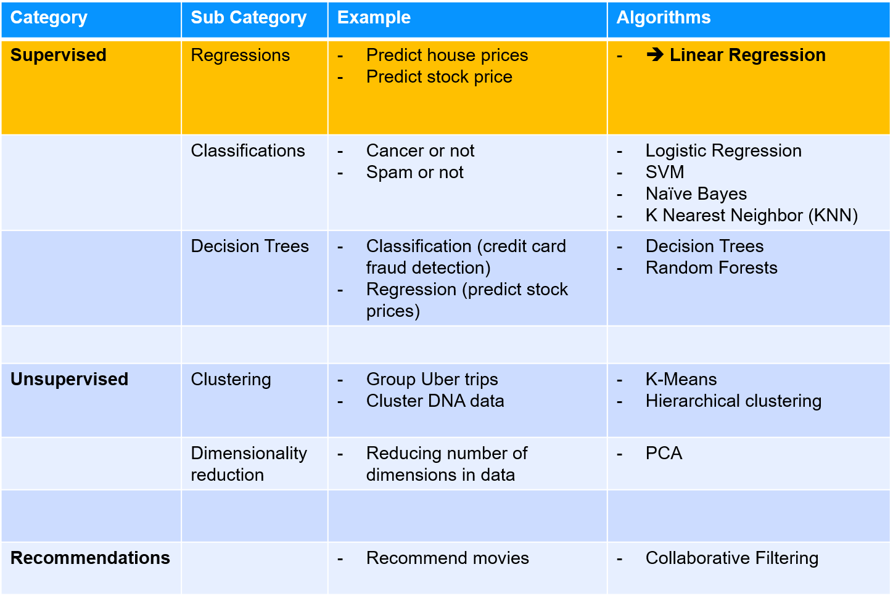

Notes:

http://machinelearningmastery.com/supervised-and-unsupervised-machine-learning-algorithms/


---

# Linear Regression

---

## Problem: Tip Calculation


 * Now our tip data include total bill amount too !

 * Do you see any correlation?

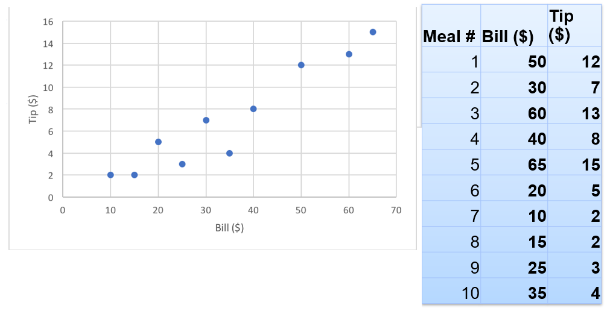

Notes:


---

## Tips vs Bill


 * There is clearly a correlation between bill amount and tip

 * We can fit a line to predict tip

 * This is **linear regression**!

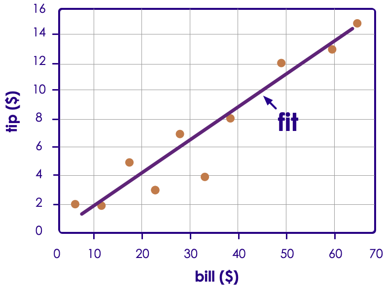


Notes:


---

## Graph Review!


*  **Y = aX + b**

 * Y = 2X + 4

 * 2 - slope of line

 * 4 - intercept
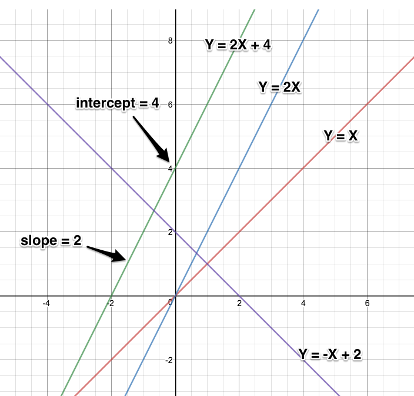

<br/>


|   |                                   |
|---|-----------------------------------|
| Y | Dependent variable (depends on X) |
| X | Independent variable              |
| a | Slope of line                     |
| b | Intercept (line meets y-axis)     |

Notes:


---

## Linear Regression Vocabulary


### **Y = aX + b &nbsp;&nbsp;&nbsp;&nbsp; Y = b<sub>0</sub> + b<sub>1</sub>X**

| Term                   | Description                                                                   | Synonyms                                         |
|------------------------|-------------------------------------------------------------------------------|--------------------------------------------------|
| **Independent Variable**   | The variable used to predict the response.                                    | -X-variable <br/>-Feature <br/>-attribute                  |
| **Response**               | The variable we are trying to predict.                                        | -Y-variable <br/>-Dependent variable <br/>-Target <br/>-Outcome |
| **Intercept**              | The intercept of the regression line - that is, the predicted value when X= 0 | -b , b<sub>0</sub> , β<sub>0</sub>                                     |
| **Regression coefficient** | The slope of the regression line.                                             | -Slope <br/>-parameter estimates <br/>-Weights <br/>-a , b1     |

Notes:


---

## Using Linear Regression for Tips


 * Linear regression model closely resembles algebra model

 *  **Y = a X + b**

 *  **Tip = `a` * bill + `b`**

 * If we figure out 'a' and 'b', then we can estimate tip for any amount


Notes:


---

## Calculating Linear Regression Model


 * Here is my Linear Regression Model coefficients for billing data

    **Tip = `a` * bill + `b`**

	a = 0.242

	b = -1.40000

    **Tip = `0.2428571` * bill - `1.40`**

 Seems like a reasonably good fit

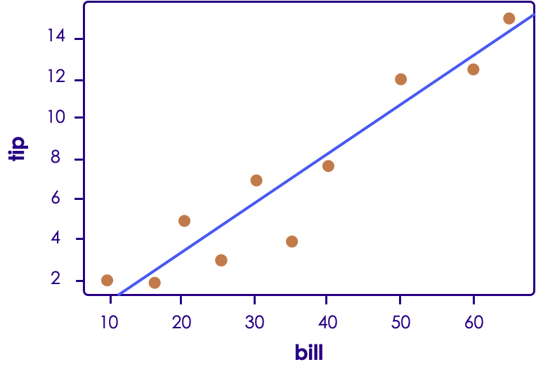


Notes:


---

## Using Linear Regression Model

* **Tip =`0.2428571` * amount - `1.40`**
    
    (Tip = `a` * bill + `b`)

* We can use this formula to predict tips.

* Tip for $100 bill

    = `0.2428571` * 100 - `1.40`

    = `$ 22.88`

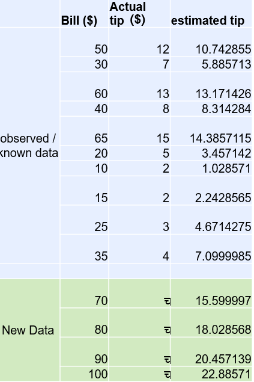


Notes:


Session-Regressions-Using-Linear-Regression-Model.png

---

## Evaluating Our Model Accuracy


 * We are going to use  **RSS (Residual Sum of Squares) or SSE (Sum of Squared Errors)** as our evaluation metric

 * In the following formula

     - Yi = actual value
     - Ŷi (pronounced Y-hat) = predicted value


Notes:

Formula image credit : Creative Commons License : tnstate.edu (http://ww2.tnstate.edu/ganter/BIO%20311%20Ch%2012%20Regression.html)


---

## Quick Recap


 *  **Instructor**

     Residuals are covered in detail in ' **ML-Concepts** ' section.

     Feel free to jump to that section to explain more.

Notes:


---

## Residuals / Errors


 * Let's say my algorithm predicted tip is $10

 *  **Residual**  = difference between  *actual tip*<br/>  and  *predicted tip*

 * Sum of all residuals  =  **ZERO**


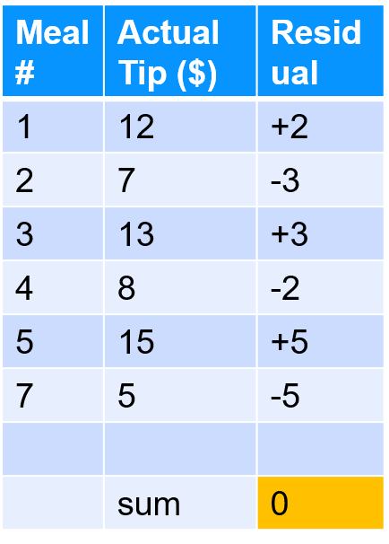

Notes:


---

## Sum of Squared Errors (SSE)


 * Squaring residuals

     - To make the positive

     - To amplify 'outliers' (large deviations)

 * Goal is to minimize SSE

     - Minimize errors


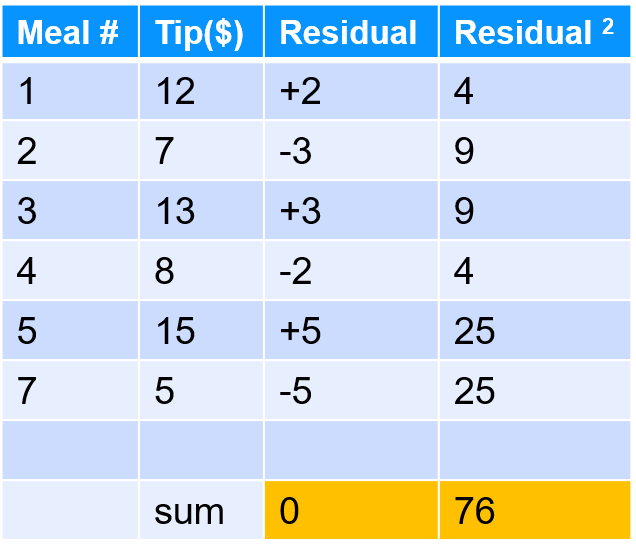


Notes:


---

## Sum of Squared Errors (SSE)


 * Also known as

    **Residual Sum of Squares (RSS)**  

    **Sum of Squared Residuals (SSR)**

 * In Regressions RSS/SSE is a measure used to select / optimize models

 * Lower RSS indicates a tighter model fit to data

 * Example

     - If model-A yields  RSS = 70

     - And model-B yields RSS=50

     - Model-B might be better fit

 * In this formula

     - Y<sub>i</sub> : actual value
     - Ŷ<sub>i</sub> : predicted value

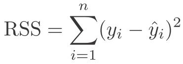

Notes:

https://en.wikipedia.org/wiki/Residual_sum_of_squares


---

## Fitted Values & Residuals


 * Data doesn't fall exactly on line

 * There is usually a 'delta' or 'error' between actual value and predicted value

 * Residual Sum of Squares( **RSS** ) / Sum of the Squared Errors ( **SSE** ) / Sum of Squared Residuals ( **SSR** ):measures this

 * Fitting algorithms try to minimize RSS

| Term          | Description                                                                    | Synonyms                 |
|---------------|--------------------------------------------------------------------------------|--------------------------|
| Fitted values | The estimates  obtained from the regression line.                              | -predicted values        |
| Residuals     | The difference between the observed values and the fitted values.              | - errors                 |
| Least squares | The method of fitting a regression by minimizing the sum of squared residuals. | - ordinary least squares |

Notes:


---

## Evaluating Linear Regression Model : RSS


 *  **Quiz for class**

 * Explain the<br/>
  'observed tip' vs.<br/>
   'predicted tip'

 * Why is sum of<br/>
  residuals zero?

 * Why is SSE not<br/>
  zero?

 * Why is there no<br/>
  residual on $100<br/>
   bill ?

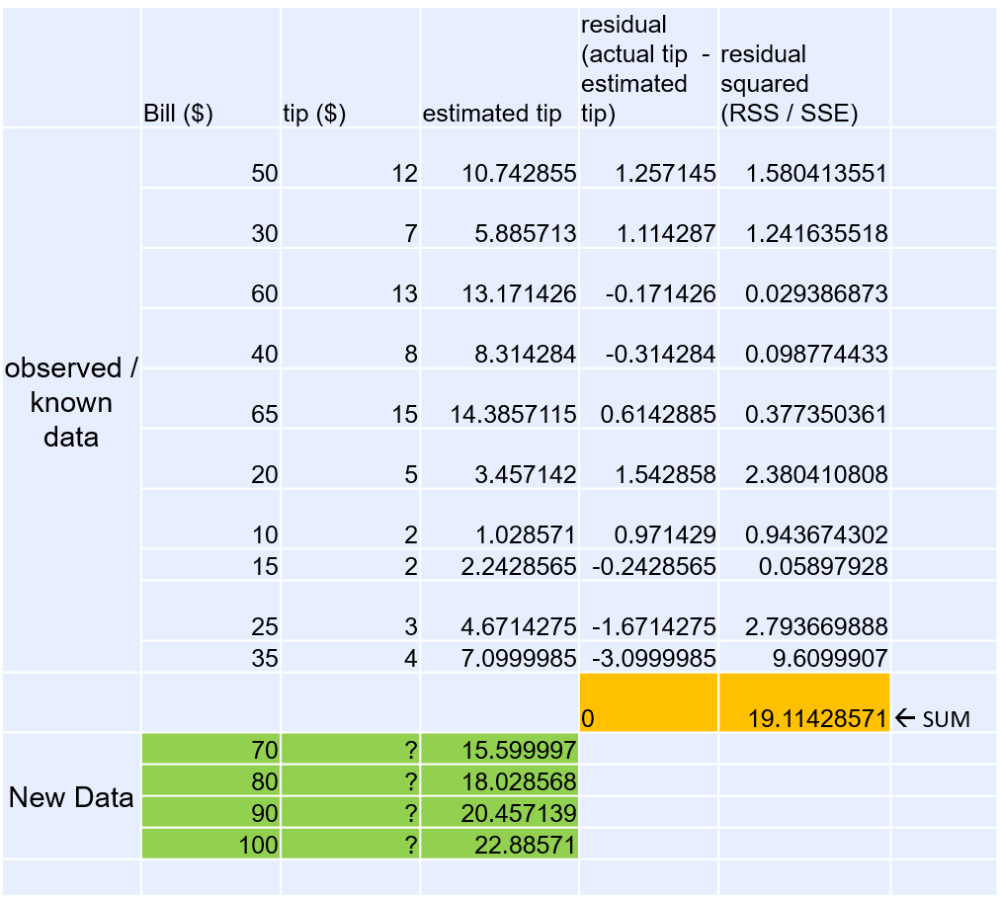


Notes:


---

## Gradient Descent


 * Gradient Descent is a popular optimization algorithm

 * It tweaks the values of parameters ( **coefficients** ) of  **target function** (f) that  **minimizes cost function**

 * Basic idea:

     - Start with initial values of coefficients (zero or random value)

     -  **cost = evaluate (f(coefficients)**

     - Calculate 'derivative' (think calculus) to determinethe 'slope' or 'direction'

     - Update coefficients in the right'direction' and calculate cost again

        *  **'learning rate parameter' (alpha)** determines how much coefficientscan change

     - Iterate  until you find minimum

 * Algorithm will converge after multiple iterations

---
## Gradiant Descent

 * As it gets closer to convergence the 'steps' gets smaller

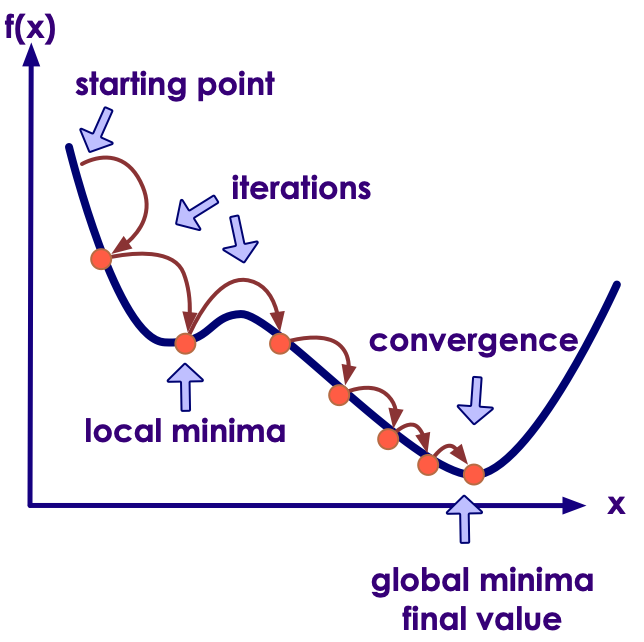


Notes:


---

## Gradient Descent Algorithm


 * Another example in 2D data


Notes:

Image credit to KDNuggets : https://www.kdnuggets.com/2017/04/simple-understand-gradient-descent-algorithm.html


---

## Gradient Descent Demo

  * [Demo 1](http://vis.supstat.com/2013/03/gradient-descent-algorithm-with-r/)


Notes:

Demo1 : http://vis.supstat.com/2013/03/gradient-descent-algorithm-with-r/


---

## Variations of Gradient Descent Algorithms


 *  **Batch Gradient Descent**

     - The cost is calculated for a machine learning algorithm over the entire training dataset for each iteration of the gradient

     - One iteration of the algorithm is called  **one batch** and this form of gradient descent is referred to as batch gradient descent

---

## Variations of Gradient Descent Algorithms

 *  **Stochastic Gradient Descent (SGD)**

     - Classic Gradient Descent can be slow on large datasets (each iteration requires calculation over millions of data points)

     - SGD updates coefficients for each training instance, rather than at the end of the batch of instances

     - Also randomizes training set to

        * reduce coefficients jumping all over the place

        * And to avoid 'getting stuck' at local minima

     - Very effective for large datasets,  requires very few passes (usually 10-20) to converge

Notes:


---

## Evaluating Linear Regression Models


 * What is the accuracy of the model

     - Residual Sum of Squares( **RSS** ) / Sum of the Squared Errors ( **SSE** ) / Sum of Squared Residuals ( **SSR** )

     -  **RMSE**  - Root Mean Square Error

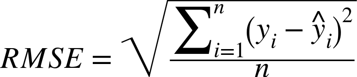&nbsp;&nbsp;&nbsp;


---

## Evaluating Linear Regression Models

 * How well does our regression equation represent data?

     - Two measures

     - correlation coefficient  (r)

     - coefficient of determination  (r<sup>2</sup>) 

 * More advanced

     - t-statistic

     - p-value

Notes:


---

## Quick Recap


 *  **Instructor**

 * Correlation Coefficient is covered in 'Stats-Primer' section.

 * Feel free to go over it for more detail

Notes:


---

## Evaluating Linear Regression: Correlation Coefficient


 *  **Perfect correlation** occurs when

     - r = -1  (negative)

     - Or  r = +1  (positive)

     - This is when the data points all<br/>
      lie in straight line (regression line!)

Notes:


---

## Evaluating Linear Regression: Correlation Coefficient

 * A correlation |r| >= 0.8 is considered  **`strong`**

 * A correlation |r| < 0.5  is considered  **`weak`**

 *  **r =**  **0.9522154 -** pretty strong correlation

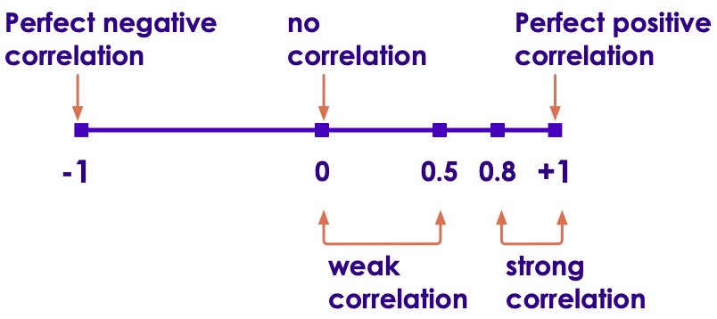

Notes:


---

## Evaluating Linear Regression Model: Coefficient of Determination


 *  **'Coefficient of Determination** ' tells us how well our model 'fits' the data

 * Also referred as  **'R squared** ' / R<sup>2</sup> / r<sup>2</sup>

 * Coefficient of Determination = (Correlation Coefficient)<sup>2</sup>

 * 0 <= r<sup>2</sup> <= 1

     - r<sup>2</sup> = 1 : regression line passes through all data points

---

## Evaluating Linear Regression Model: Coefficient of Determination

 * In our model  
 
    **r<sup>2</sup> = 0.9067141 = 90.67 %** That is a pretty good fit !

 * Represents the percent of the data that is the closest to the line of best fit

     - So in our case : 90.67% of total variation in Y (tips) can be explained by linear relation between Y (tip) and X (bill)

     - The rest is 'unexplained' by the model

Notes:

https://en.wikipedia.org/wiki/Coefficient_of_determination


---

## Preparing Data for Linear Regression

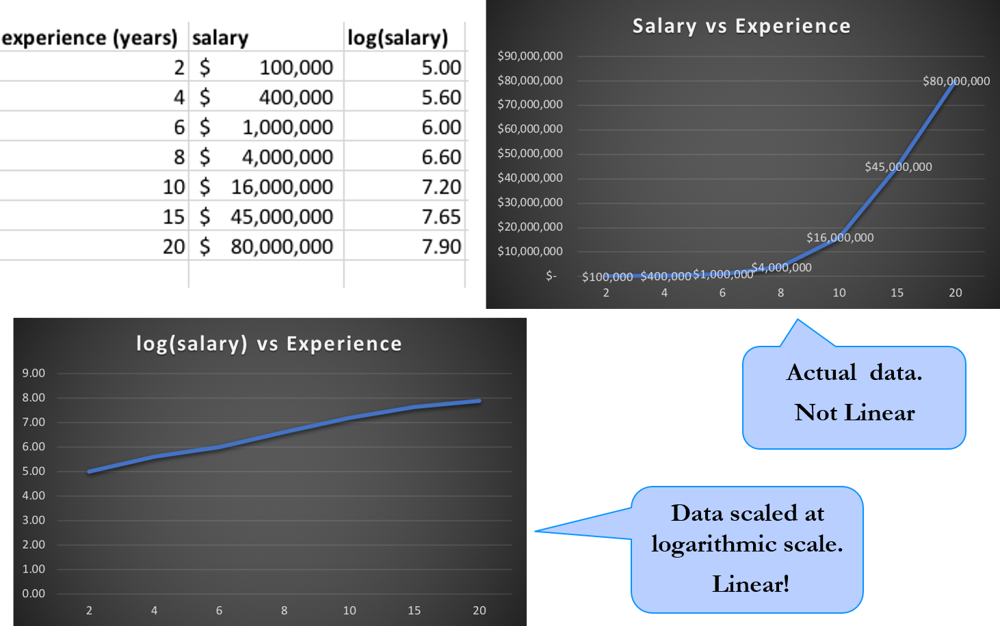


Notes:


---

## Lab: Linear Regressions


 *  **Overview**:

    - Practice Linear Regressions

 *  **Approximate Time**:

    - 30 mins

 *  **Instructions**:

     - LIR-1 : Bill and Tips data

     - Follow  appropriate Python / R / Spark instructions


Notes:


---

# Multiple Linear Regression

---

## Problem: House Prices

| Sale Price $ | Bedrooms | Bathrooms | Sqft_Living | Sqft_Lot |
|--------------|----------|-----------|-------------|----------|
| 280,000      | 6        | 3         | 2,400       | 9,373    |
| 1,000,000    | 4        | 3.75      | 3,764       | 20,156   |
| 745,000      | 4        | 1.75      | 2.06        | 26,036   |
| 425,000      | 5        | 3.75      | 3,200       | 8,618    |
| 240,000      | 4        | 1.75      | 1,720       | 8,620    |
| 327,000      | 3        | 1.5       | 1,750       | 34,465   |
| 347,000      | 4        | 1.75      | 1,860       | 14,650   |

<br/>

 * Multiple factors decide house prices

 * It is not a simple  Y ~ X any more

 * We will use  **multiple linear regression**

Notes:


---

## Multiple Linear Regression

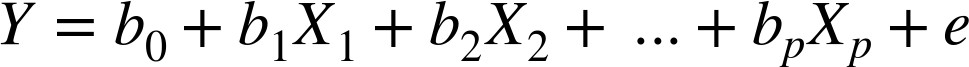


 * Outcome depends on multiple variables
 * **β<sub>1</sub>** , **β<sub>2</sub>** are coefficients
 *  **`e`**  is error / noise

Notes:


---

## Multitple Linear Regression Code ( R )


```text
house.sales = read.csv("house-sales.csv")
# 27,000 entries

# run mlr
house.lm = lm(SalePrice ~ Bedrooms + Bathrooms + SqFtTotLiving + SqFtLot,  
              data = house.prices, na.action = na.omit)

summary(house.lm)

Call:lm(formula = SalePrice ~ Bedrooms + Bathrooms + SqFtTotLiving +     SqFtLot, data = house.prices, na.action = na.omit)

Residuals:
     Min       1Q   Median       3Q      Max
 -1955089  -114575   -13670    81734  9081935

Coefficients:
                  Estimate   Std. Error t value             Pr(>|t|)
(Intercept)   106303.30612   6254.77558  16.996 < 0.0000000000000002 ***
Bedrooms      -65211.73613   2151.67471 -30.307 < 0.0000000000000002 ***
Bathrooms      16274.19139   2970.77108   5.478         0.0000000434 ***
SqFtTotLiving    277.84805      2.66890 104.106 < 0.0000000000000002 ***
SqFtLot           -0.07457      0.05472  -1.363                0.173    

---Signif. codes:  0 '***' 0.001 '**' 0.01 '*' 0.05 '.' 0.1 ' ' 1

Residual standard error: 246400 on 27058 degrees of freedom
Multiple R-squared:  0.4835,	Adjusted R-squared:  0.4834
F-statistic:  6332 on 4 and 27058 DF,  p-value: < 0.00000000000000022

```

Notes:


---

## Interpreting Results


```text
summary(house.lm)

Call:lm(formula = SalePrice ~ Bedrooms + Bathrooms + SqFtTotLiving +     SqFtLot, data = house.prices, na.action = na.omit)

Residuals:
     Min       1Q   Median       3Q      Max
 -1955089  -114575   -13670    81734  9081935

Coefficients:
                  Estimate   Std. Error t value             Pr(>|t|)
(Intercept)   106303.30612   6254.77558  16.996 < 0.0000000000000002 ***
Bedrooms      -65211.73613   2151.67471 -30.307 < 0.0000000000000002 ***
Bathrooms      16274.19139   2970.77108   5.478         0.0000000434 ***
SqFtTotLiving    277.84805      2.66890 104.106 < 0.0000000000000002 ***
SqFtLot           -0.07457      0.05472  -1.363                0.173    

---Signif. codes:  0 '***' 0.001 '**' 0.01 '*' 0.05 '.' 0.1 ' ' 1

...
```

 * Adding one extra 'sqftTotLiving' space increases the house price by $277.85

     - While holding all other variables the same

Notes:


---

## Interpreting Results


```text
summary(house.lm)

Call:lm(formula = SalePrice ~ Bedrooms + Bathrooms + SqFtTotLiving +     SqFtLot, data = house.prices, na.action = na.omit)

Residuals:
     Min       1Q   Median       3Q      Max
 -1955089  -114575   -13670    81734  9081935

Coefficients:
                  Estimate   Std. Error t value             Pr(>|t|)
(Intercept)   106303.30612   6254.77558  16.996 < 0.0000000000000002 ***
Bedrooms      -65211.73613   2151.67471 -30.307 < 0.0000000000000002 ***
Bathrooms      16274.19139   2970.77108   5.478         0.0000000434 ***
SqFtTotLiving    277.84805      2.66890 104.106 < 0.0000000000000002 ***
SqFtLot           -0.07457      0.05472  -1.363                0.173    

---Signif. codes:  0 '***' 0.001 '**' 0.01 '*' 0.05 '.' 0.1 ' ' 1

...
```

  * Question for class:
     - Interpret parameters for 'Bedrooms'


Notes:


---

## Evaluating The Model


 *  **Root Mean Squared Error (RMSE):**

    Square root of the average squared error in predicted values


 *  **Residual Standard Error (RSE):**

    n - observations, p - predictors

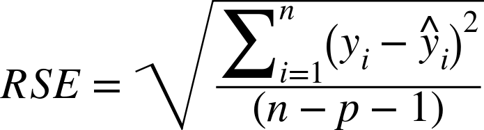


Notes:

Formula images: Creative Commons License : Wikimedia


---

## Coefficient of Determination (R<sup>2</sup>)


 * R<sup>2</sup> ranges from 0 to 1

 * Measures how well the model fits the data
<br/><br/><br/>

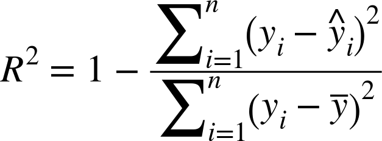

Notes:


---

## Interpreting Results - R2


```text
summary(house.lm)

Call:lm(formula = SalePrice ~ Bedrooms + Bathrooms + SqFtTotLiving +     SqFtLot, data = house.prices, na.action = na.omit)

Residuals:
     Min       1Q   Median       3Q      Max
 -1955089  -114575   -13670    81734  9081935

Coefficients:
                  Estimate   Std. Error t value             Pr(>|t|)
(Intercept)   106303.30612   6254.77558  16.996 < 0.0000000000000002 ***
Bedrooms      -65211.73613   2151.67471 -30.307 < 0.0000000000000002 ***
Bathrooms      16274.19139   2970.77108   5.478         0.0000000434 ***
SqFtTotLiving    277.84805      2.66890 104.106 < 0.0000000000000002 ***
SqFtLot           -0.07457      0.05472  -1.363                0.173    

---Signif. codes:  0 '***' 0.001 '**' 0.01 '*' 0.05 '.' 0.1 ' ' 1

...
Multiple R-squared:  0.4835, ...
...
```


 * R<sup>2</sup> is 0.4835  - not a great fit 

 * See next slide for discussion


Notes:


---

## Class Discussion : Why is the Accuracy Low?


 *  **R<sup>2</sup> is 0.4835** - not a great fit 

 *  **Question for class** : 
 
    Why is R<sup>2</sup>  not close to 1?  (as in why is it not a great fit?)

     - Can you guys come up with some reasons

     - Hint : Look at Sale date in the dataset?  Think about what happened in that time frame

 * Answers are in next slide

Notes:


---

## Class Discussion: Why is the Accuracy Low?


 * May be we are not using enough features / inputs.

     - The original dataset has features like 'Year Built' ,  'Traffic Noise' ..etc.

 * Not enough data?

* Outliers? (remember the house with 33 bedrooms?)

 * Data is skewed?

     - The sales happen the in the span of year 2006 and 2014.

     - We went through a crash in 2008

     - So the we probably have inconsistent data

 * Wrong algorithm?

Notes:


---

## Adding More Variables

```bash
house.lm = lm(SalePrice ~ Bedrooms + Bathrooms + SqFtTotLiving + SqFtLot,   data = house.prices, na.action = na.omit)
```

 * Our current formula included only a few attributes : Bedrooms + Bathrooms + SqFtTotLiving + SqFtLot

 * Can we add more attributes?

```text
house_full <- lm(SalePrice ~ SqFtTotLiving + SqFtLot + Bathrooms + Bedrooms + BldgGrade + PropertyType + NbrLivingUnits + SqFtFinBasement + YrBuilt + YrRenovated + NewConstruction, data=house, na.action=na.omit)
```

Notes:


---

## Deciding Important Variables


 * In Multiple Linear Regressions many predictors determine the value of response

 * How can we know which ones are important?

 * Imagine an equation 
 
    Y = b0 +  b1 X<sub>1</sub>  + b2 X<sub>2</sub>

 * We have two predictors X<sub>1</sub> & X<sub>2</sub> (p = 2)

 * Possible combinations 2<sup>p</sup> = 2<sup>2</sup> = 4

     - No variables

     - X<sub>1</sub> only

     - X<sub>2</sub> only

     - Both X<sub>1</sub> and X<sub>2</sub> 


Notes:


---

## Deciding Important Variables


 * Possible combinations 2p can get large for sizeable p values.

    - P = 10 -> 2<sup>10</sup> -> 1024 combinations
    - P = 20 -> 2<sup>20</sup> -> 1,048,576 (1 million+) combinations


 * Some algorithms to decide important variables quickly

     - Mallow's Cp

     - Akaike Information Criterion (AIC)

     - Bayesian Information Criterion  (BIC)

 * Also Lasso Regularization can be used for variable selection as well (more on this later)

Notes:

"An introduction to Statistical Learning" – Chapter 3


---

## Akaike's Information Criteria (AIC)


 * Adding more variables will reduce RMSE and increase R<sup>2</sup> (towards 1)

 * How ever that doesn't mean we have a better model

 * So we need other measures to evaluate the model

 *  **Akaike's**  **Information Criteria (AIC)**  can be helpful

     - Developed by Hirotugu Akaike, a prominent Japanese statistician

 * If I add 'k' more variables the AIC is penalized by atleast 2k

 * Goal is to find minimal 'AIC'

```text
AIC = 2p  + n log (RSS / n)

p - number of variables
n - number of records

```

Notes:


---

## Deciding Important Variables


 * There are 3 classical approaches

 *  **Forward Selection**

     - Begin with null model (has only intercept, and no variables)

     - Run p simple linear regressions and add to null model that results in lowest RSS

 *  **Backward Selection**

     - Start with all variables

     - Remove variables with largest p-value (least statistically significant)

     - Keep going until desired p-value threshold is reached

 *   **Mixed Selection**

     - Combination of forward / backward selection

Notes:


---

## Calculating AIC - Sample Code ( R )


```text
options(scipen=999)
library(MASS)

house.prices = read.csv("house-sales-full.csv")

# using all attributes for LM
house.lm.full <- lm(SalePrice ~ SqFtTotLiving + SqFtLot + Bathrooms + Bedrooms + BldgGrade + PropertyType + NbrLivingUnits + SqFtFinBasement + YrBuilt + YrRenovated + NewConstruction, data=house.prices, na.action=na.omit)

step <- stepAIC(house.lm.full, direction="both")

step
```

Notes:


---

## Calculating AIC Sample Code ( R )


```text
# original LM formula
house.lm.full <- lm(SalePrice ~ SqFtTotLiving + SqFtLot + Bathrooms + Bedrooms + BldgGrade + PropertyType + NbrLivingUnits + SqFtFinBasement + YrBuilt + YrRenovated + NewConstruction, data=house.prices, na.action=na.omit)
```

```text
step

Call:
lm(formula = SalePrice ~ SqFtTotLiving + Bathrooms + Bedrooms +     BldgGrade + PropertyType + SqFtFinBasement + YrBuilt + NewConstruction,
     data = house.prices, na.action = na.omit)

Coefficients:
              (Intercept)              SqFtTotLiving                  Bathrooms
                5730856.779                    170.255                  37950.708
                   Bedrooms                  BldgGrade  PropertyTypeSingle Family
                 -44124.897                 122498.089                  14862.934
      PropertyTypeTownhouse            SqFtFinBasement                    YrBuilt
                  77562.844                      8.153                  -3286.098
        NewConstructionTRUE                   7886.546  
```

 *  **stepAIC**  has come up with a new formula

 * Dropped attributes : SqFtLot, NbrLivingUnits, YrRenovated, and NewConstruction.

Notes:


---

# Regularized Linear Regression

---

## Regularization


 * Regularization means explicitly restricting a mode

     - to avoid overfitting

     - And to reduce the complexity of the model

 * How to regularize?

     - Removing unnecessary coefficients (b<sub>1</sub>, b<sub>2</sub> ..etc)

     - Keeping coefficient values from getting too large (**`parameter shrinkage`**)

        * Large coefficients amplify certain parameters

 * In the equation below, assume b<sub>1</sub>=20 and b<sub>2</sub>=2000Which variable X<sub>1</sub> or X<sub>2</sub> will have a large impact on outcome?

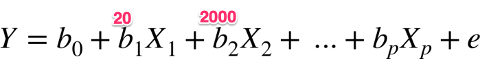


Notes:

Answer X2.. Because it gets multiplied by 2000


---

## Regularization

* We can control regularization by adjusting lambda (ƛ) variable

     - Lambda=0 : no regularization

     - Lambda = small (0.001) : very little regularization

     - Lambda = large (10) : very strong regularization

* Optimal Lambda (ƛ) value depends on particular dataset, and can be calculated using cross validation

Notes:


---

## Ridge vs. Lasso


 * Two types of regularizations

     -  **Lasso Regression** ( **L1 regularization** )

     -  **Ridge Regression (L2 regularization)**

 * Ridge regression will  **'minimize' coefficients close to zero but not to zero**

     - Called  **parameter shrinkage**

 * Lasso regression  **can shrink parameters can also set them zero** !

     - By setting some coefficients to zero, it eliminates certain features

     - Called  **variable/feature selection**

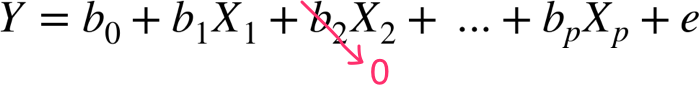


Notes:

https://www.slideshare.net/ShangxuanZhang/ridge-regression-lasso-and-elastic-net


---

## Preparing Data For Linear Regressions


 *  **Linear Assumption:**

    Linear Regression assumes linear relationship between input and output.May be need to transform data (e.g. log transform) to make the relationship linear

 *  **Remove Noise:**

    Remove outlier data

---
## Preparing Data For Linear Regressions

 *  **Remove Collinearity**:

    Linear regression will over-fit your data when you have highly correlated input variables

 *  **Gaussian Distributions**

    Linear regression will make more reliable predictions if your input and output variables have a Gaussian distribution. Transform data (e.g. logarithmic) make their distribution more Gaussian looking for better results

Notes:

---

## Linear Regression: Strengths, Weaknesses, and Parameters

 *  **Strengths**

     - Relatively simple to understand

     - Computationally simple, very fast learners

     - Very scalable to large data sets

 *  **Weaknesses**

     - Will perform poorly if the inputs are not aligned along linear boundary

     - Can under-fit data

 *  **Parameters**

     - Use regularization to minimize overfitting

     - Lasso regularization can also do variable selection

Notes:


---

## Lab: Multiple Linear Regression


 *  **Overview**:

    - Practice Multiple Linear Regressions

 *  **Approximate Time**:

    - 30 mins

 *  **Instructions**:

    - Follow  appropriate Python / R / Spark instructions

      - LIR-2: House prices

      - BONUS Lab : LIR-3: AIC


Notes:


---

## Linear Regression: Further Reading


* [`Very nice  video series by Brandon Foltz`](https://www.youtube.com/playlist?list=PLIeGtxpvyG-LoKUpV0fSY8BGKIMIdmfCi)

Notes:


---

# Logistic Regression

---

## Algorithm Summary

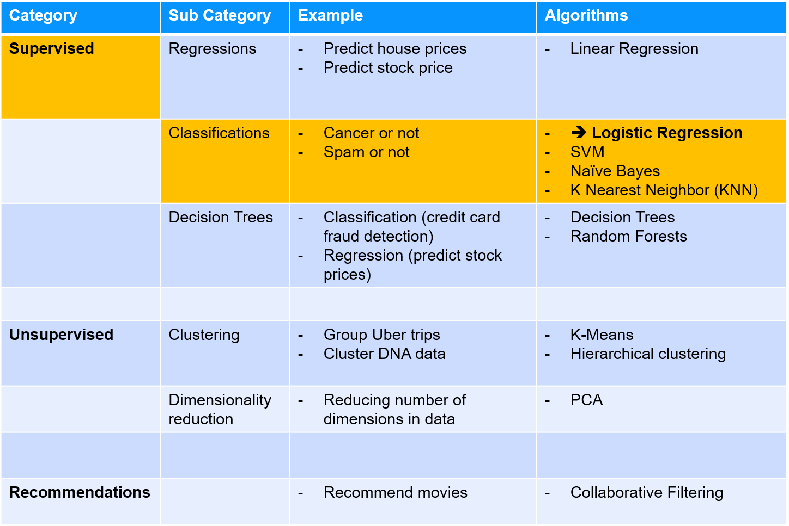


Notes:

http://machinelearningmastery.com/supervised-and-unsupervised-machine-learning-algorithms/


---

## Problem : Applying for Credit Card


 * In US most adults have a 'credit score' (a.k.a. FICO score)

 * Ranges from 300 (very poor) to 850 (excellent)

 * Credit score is a big determining factor when applying for loans / mortgages / credit cards

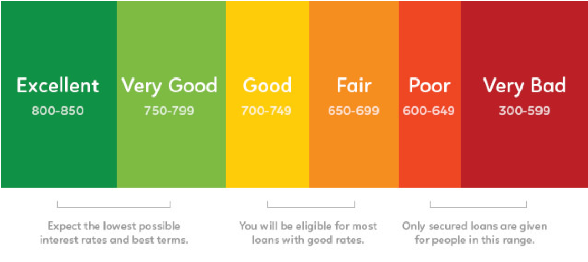


Notes:

Image credit : (CC) : https://www.flickr.com/photos/cafecredit/27321078025


---

### Problem : Applying for Credit Card


 * Here is historical data on credit score and if the credit application is approved

 * What is the chance some one with score of  **700**  getting a credit card approved?


| Credit Score | Approved? |
|--------------|-----------|
| 560          | No        |
| 750          | Yes       |
| 680          | Yes       |
| 650          | No        |
| 450          | No        |
| 800          | Yes       |
| 775          | Yes       |
| 525          | No        |
| 620          | No        |
| 705          | No        |
| 830          | Yes       |
| 610          | Yes       |
| 690          | No        |

Notes:


---

## Plotting Credit Approval Data

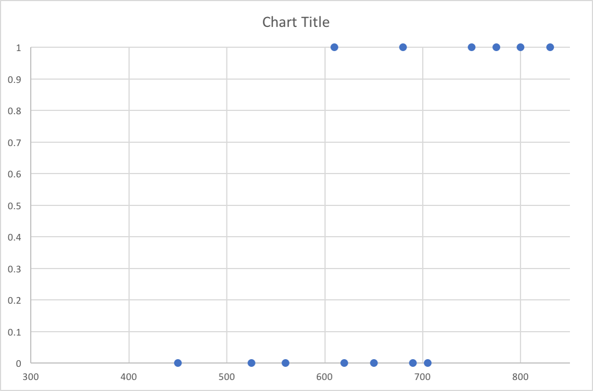


Notes:


---

## Plotting Credit Approval Data


 * X axis = credit score

 * Y axis = 0 (declined)  ,  1 (approved)  ,  nothing in between

 * There is no linear fit line !

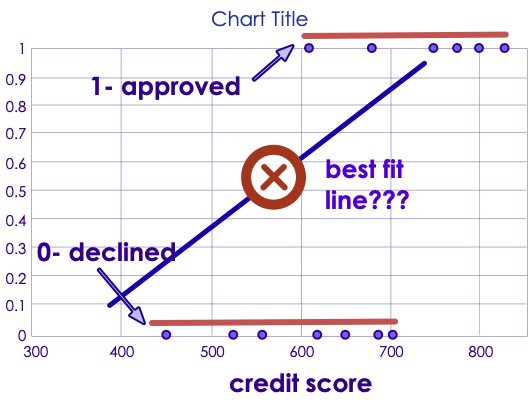


Notes:


---

## Linear vs. Logistic


 * Linear Regression provides continuous Y values

 * Classification gives out discrete output (Spam / Not-Spam)

 * Logistic Regression produces numbers that are probabilities

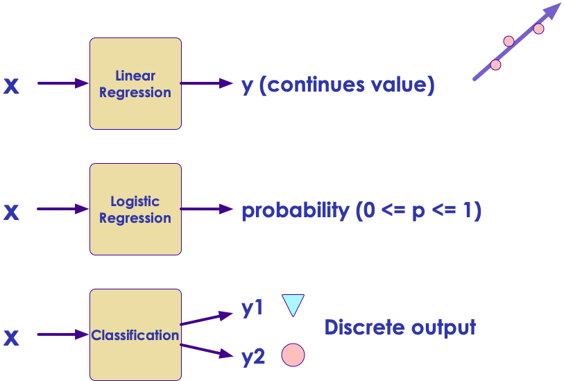

Notes:


---

## Logistic Regression


 * Logistic Regression gives out probability between 0 to 1

     - 70% chance this email is Spam

     - 40% this loan will fail

 * This probability is mapped into<br/>
  binary outcome (true/false,  yes / no)

 * **Logistic uses Regression algorithm,<br/>
  but used for classification**

 * Logistic regression is Linear (classification) algorithm

 * Invented by Sir David Cox<br/>
   (author of 364 books and papers!)


Notes:


---

## Math Behind  Logistic Regression


```text
X : input
Y : output
b0,b1 : coefficients

         (b0 + b1 * X)
      e
Y = ---------------------------
         (b0 + b1 * X)
  1 + e

Rewrite this as:
Log(odds) = ln (y / (1-y)) = b0 + b1* X

Log (odds) =  ln (p / 1-p)    where p is the probability of the event will occur

```

Notes:


---

## Math Behind Logistic Regression

 * 'Logit' function

     - Calculates 'odds'

<br/>
<br/>
<br/>
<br/>
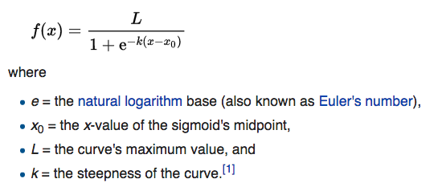

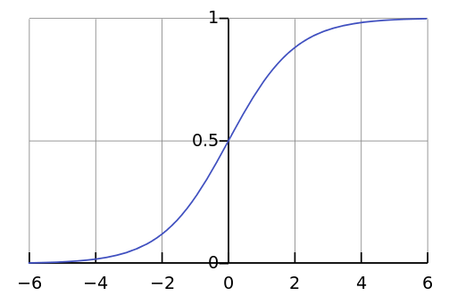

Notes:

Image attribution : https://commons.wikimedia.org/wiki/File%3ALogistic-curve.svg


---

## Applying Logistic Regression To Credit Card Application

```
Coefficients for our credit card problem: b0 = -1.69754 ,  b1 = 0.002319     

For score of 700

        e b0 + b1*X                      exp (-1.69754 + 0.002319 * 700)
 Y = ------------------------- =   ------------------------------------------------   =  0.84
        1 + e b0 + b1 * X               1 + exp (-1.69754 + 0.002319 * 700)

Predicts 84% chance of getting the loan approved.
So this mapped to YES

```
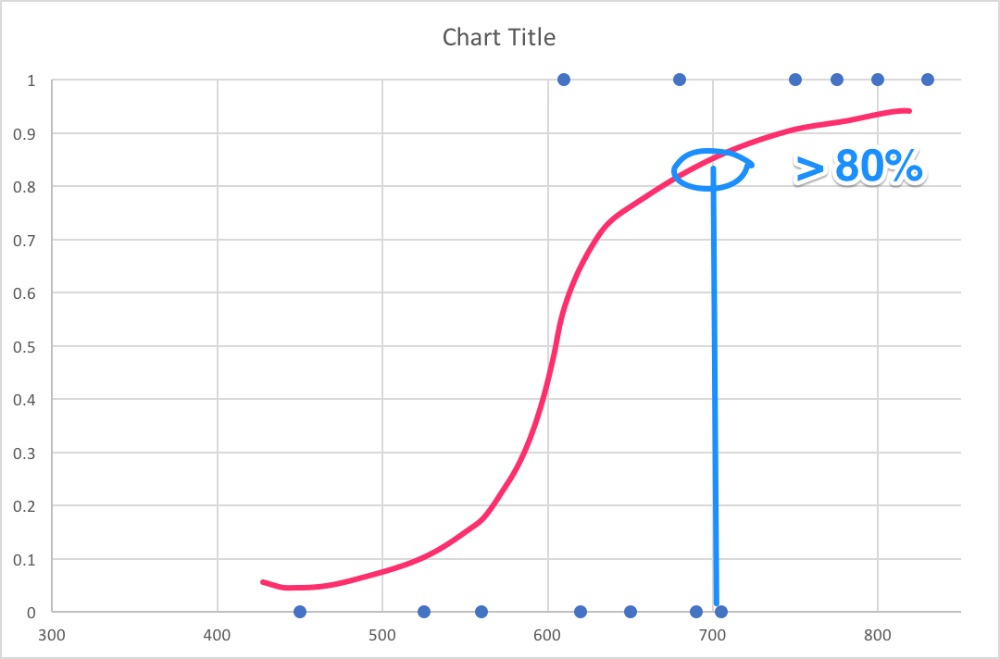

Notes:

---

## Multiple Logistic Regression


 * So far we have seen ONE predictor determining the outcome

     - Credit score determining  approval / denial

 * We can have multiple factors (independent variables) determining an outcome as well

     - This is called 'multiple logistic regression'

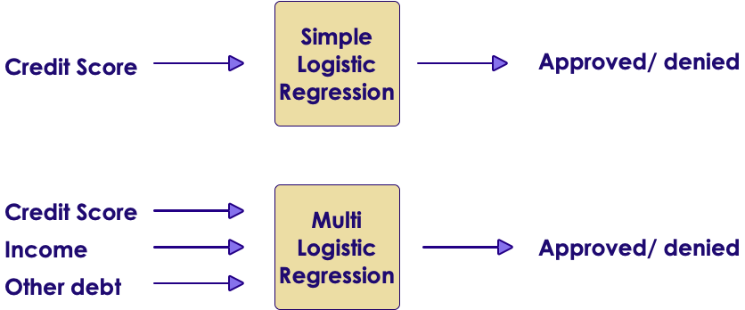


Notes:


---

## Math Behind Multiple Logistic Regression


 * Let's say  
     - β represents parameters

     - X is independent variable (we have more than one)

 * Log(odds) = ln (y / (1-y)) = β<sub>0</sub> + β<sub>1</sub>* X<sub>1</sub> + β<sub>2</sub>* X<sub>2</sub> + …. + β<sub>n</sub>* X<sub>n</sub> <br/><br/>

 * Log (odds) or log-odds ration = 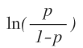

 * Where p is the probably the event will occur


Notes:


---

## Logistic Regression Example


 * We are going to look college admission data

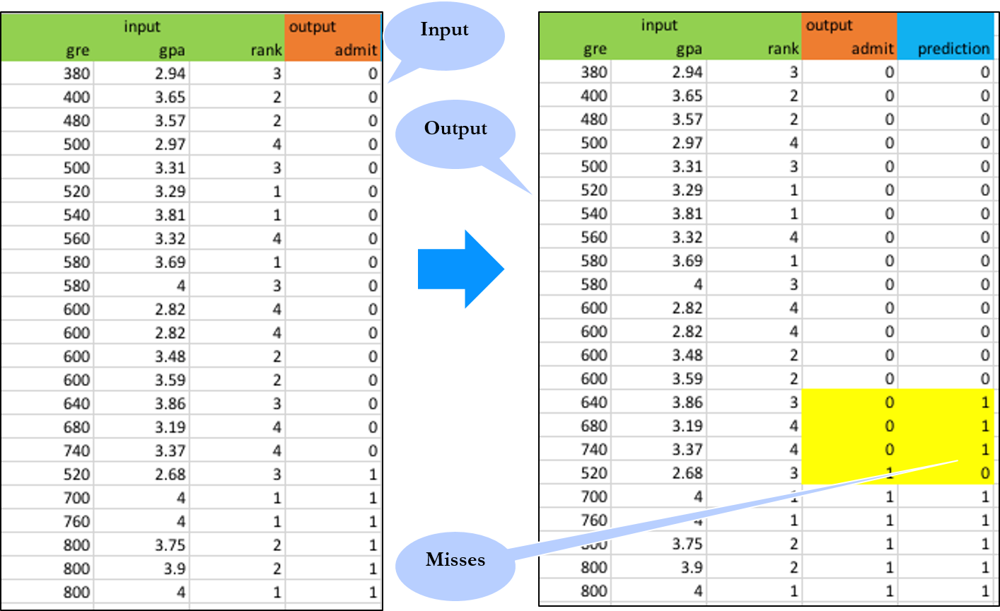


Notes:


---

## Quick Recap


 *  **Instructor**

     - Confusion Matrix and ROC curve are covered in detail in 'ML-Concepts' section.

Notes:


---

## Measuring Accuracy of Logistic Model


 * Since Logistic Regression is used for classification we can use
     - Confusion Matrix
     - ROC and AUC (Area Under Curve)

 * Confusion Matrix:

    correct : 14 + 5 = 19

    missed : 3 + 1 = 4

    accuracy = 19/(19+4) = 82.6%

 * ROC / AUC = 0.874


Notes:


---

## Preparing Data for Logistic Regression


 *  **Binary Output Variable**

    Logistics Regression predicts probability of an instance belonging to default class.  This is snapped into 0 or 1 classification

 *  **Remove Noise**

    Remove outliers from input data

 *  **Gaussian Distribution**

    If you can shape the data into a Gaussian distribution (Logarithmic, etc.) Logistics will yield better results

---

## Preparing Data for Logistic Regression

 *  **Remove Correlated Output**

    Remove highly correlated inputs to avoid overfitting

 *  **Failure to converge**

    Causes

     - Highly correlated input

     - Data is very sparse (lots of zeros in data)

Notes:


---

## Multinomial logistic regression


 * We have seen Logistic Regression predicting binary outcomes

     - Approved / Denied

 * We can use it to calculate 'more than two' states as well

     - multinomial logistic regression

 * For K possible outcomes

     - Chose one outcome as a “pivot”

        * against the pivot outcome

Notes:


---

## Logistic Regression: Strengths, Weaknesses, and Parameters


 * Logistic Regression: Strengths, Weaknesses, and Parameters

 *  **Strengths**

     - Relatively simple to understand

     - Linear algorithm -> Fast learner

     - Works well on high dimensional (100s of features) datasets

     - Very scalable to large data sets

 *  **Weaknesses**

     - Can underfit some times

 *  **Parameters**

     - Use regularization to minimize overfitting

Notes:


---

## Lab: Logistic Regression


 *  **Overview** :

    Practice Logistic Regression

 *  **Approximate Time** :

    30 mins

 *  **Instructions** :

    Follow  appropriate Python / R / Spark instructions

     -  **LOGIT-1 : Credit card approval (single variable)**

     -  **LOGIT-2 : College Admission (multiple variables)**

Notes:


---

## Lab: Cross Validation: Hyper Parameter Tuning


 *  **Overview**:

    - Learn to do Cross Validation

 *  **Approximate Time**:

    - 30 mins

 *  **Instructions**:

     - Follow  appropriate Python / R / Spark instructions

     -  **Cross Validation 1 : Tuning the model**


Notes:


---

## Logistic Regression: Further Readings


Notes:
