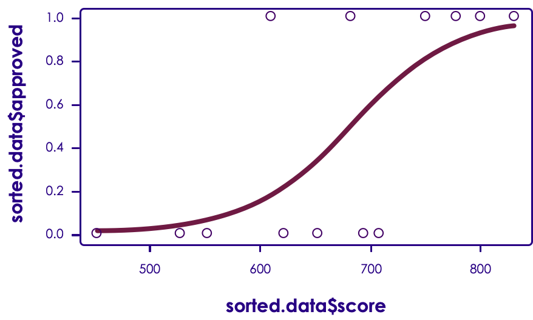

# Supervised Learning in R

---

## Lesson Objectives

---

# Linear Regression

---

## Linear Regression Background


 * Reference : ML-03__Supervised.pptx

Notes:


---

## Tip Calculation Using Linear Regression


 * We will use Linear Regression to predict tips

<!-- {"left" : 4.69, "top" : 2.43, "height" : 3.96, "width" : 5.25} -->


| Meal # 	| Bill ($) 	| Tip ($) 	|
|--------	|----------	|---------	|
| 1      	| 50       	| 12      	|
| 2      	| 30       	| 7       	|
| 3      	| 60       	| 13      	|
| 4      	| 40       	| 8       	|
| 5      	| 65       	| 15      	|
| 6      	| 20       	| 5       	|
| 7      	| 10       	| 2       	|
| 8      	| 15       	| 2       	|
| 9      	| 25       	| 3       	|
| 10     	| 35       	| 4       	|
<!-- {"left" : 0.34, "top" : 1.67, "height" : 5.5, "width" : 4.1, "columnwidth" : [1.23, 1.37, 1.37]} -->

Notes:


---

## Linear Regression in R


 * R has built in Linear Regression: lm

 * Very easy to use!

```text
lm (formula,  data,   [subset] ...)

Formula : usually in   'Y  ~ X'  format
Data : dataframe
Subset : optional specify subset of observations in fitting process

```
<!-- {"left" : 0, "top" : 2.11, "height" : 1.37, "width" : 10.25} -->

```text
# sample usage:
tip_data = data.frame(bill = c(50,30,60,40,65,20,10,15,25,35),
                       tip = c(12,7, 13,8, 15,5, 2, 2, 3, 4))

# calculate linear model
tip.lm = lm (tip ~ bill, data=tip_data)

summary(tip.lm)

```
<!-- {"left" : 0, "top" : 4.83, "height" : 2.2, "width" : 10.25} -->


Notes:


---

## Understanding LM


```text

summary(tip.lm)

Call:lm(formula = tip ~ bill, data = tip_data)

Residuals:
    Min      1Q  Median      3Q     Max
 -3.1000 -0.2964  0.2214  1.0786  1.5429

Coefficients:
            Estimate Std. Error t value Pr(>|t|)    (Intercept) -1.40000    1.08078  -1.295    0.231
bill         0.24286    0.02754   8.818 2.15e-05 ***
- - -
Signif. codes:  
0 '***' 0.001 '**' 0.01 '*' 0.05 '.' 0.1 ' ' 1

Residual standard error: 1.546 on 8 degrees of freedom
Multiple R-squared:  0.9067,	Adjusted R-squared:  0.8951
F-statistic: 77.76 on 1 and 8 DF,  p-value: 2.153e-05

```

Notes:

http://feliperego.github.io/blog/2015/10/23/Interpreting-Model-Output-In-R


---

## Understanding LM

```text
> summary(tip.lm)

Call:lm(formula = tip ~ bill, data = tip_data)

Residuals:
    Min      1Q  Median      3Q     Max
 -3.1000 -0.2964  0.2214  1.0786  1.5429

Coefficients:
            Estimate Std. Error t value Pr(>|t|)    (Intercept) -1.40000    1.08078  -1.295    0.231
bill         0.24286    0.02754   8.818 2.15e-05 ***

```

 * Formula :  **tip ~ bill**

     - Y (target / response variable)  ~ X (predictor)

 * Data is the data frame we used

---

## Understanding LM

```text
> summary(tip.lm)

Call:lm(formula = tip ~ bill, data = tip_data)

Residuals:
    Min      1Q  Median      3Q     Max
 -3.1000 -0.2964  0.2214  1.0786  1.5429

Coefficients:
            Estimate Std. Error t value Pr(>|t|)    (Intercept) -1.40000    1.08078  -1.295    0.231
bill         0.24286    0.02754   8.818 2.15e-05 ***

```

 * Residuals : Difference between 'actual' and 'predicted'
 * Ideally should fit 'standard distribution' -> mean value is zero. Not the case here (close enough)

Notes:


---

## Understanding LM

```text
> summary(tip.lm)

. . .

Coefficients:
            Estimate Std. Error t value Pr(>|t|)    
(Intercept) -1.40000    1.08078  -1.295    0.231
bill         0.24286    0.02754   8.818 2.15e-05 ***
...


```

* Coefficients

     - Slope of line : bill :  **0.24286**

     - Intercept : where line meets Y-axis :  **-1.4** (below zero line (X axis))

Notes:


---


## Understanding LM

```text
> summary(tip.lm)

...

Coefficients:
            Estimate Std. Error t value Pr(>|t|)    
(Intercept) -1.40000    1.08078  -1.295    0.231
bill         0.24286    0.02754   8.818 2.15e-05 ***
- - -
Signif. codes:  
0 '***' 0.001 '**' 0.01 '*' 0.05 '.' 0.1 ' ' 1


```

 * **Pr(>|t|)** should be very small, in our case it is very close to zero

 * Along with  **'**  **Signif**  **. Codecs** ' of  **three stars** is good


Notes:

http://feliperego.github.io/blog/2015/10/23/Interpreting-Model-Output-In-R


---

## Understanding LM

```text
> summary(tip.lm)

...

Residual standard error: 1.546 on 8 degrees of freedom
Multiple R-squared:  0.9067,	Adjusted R-squared:  0.8951
F-statistic: 77.76 on 1 and 8 DF,  p-value: 2.153e-05

```

 *  **Coefficient of Determination (r<sup>2</sup>)** determines how well the model fits data

 * 0 <= r<sup>2</sup> <= 1  ,  close to 1 meaning strong fit

 * Here 0.9067 or  **90.67** % of 'tip' can be explained by 'bill amount'

     - Very strong predictor!

 * ( **Adjusted r<sup>2</sup>**  corrects  **r<sup>2</sup>**  for number of variables considered)


Notes:

http://feliperego.github.io/blog/2015/10/23/Interpreting-Model-Output-In-R


---

## Plotting Regression


```text
tip_data = data.frame(bill = c(50,30,60,40,65,20,10,15,25,35),
                       tip = c(12,7, 13,8, 15,5, 2, 2, 3, 4))
plot(tip_data)
tip.lm = lm (tip ~ bill, data=tip_data)
abline(tip.lm, col='red')  # red line

```
<!-- {"left" : 0, "top" : 0.96, "height" : 1.47, "width" : 10.25} -->


<!-- {"left" : 2.06, "top" : 2.91, "height" : 4.22, "width" : 6.12} -->


Notes:


---

## Calculating Coefficients


```text
# formula : tip = a * bill + b
tip_data = data.frame(bill = c(50,30,60,40,65,20,10,15,25,35),
                       tip = c(12,7, 13,8, 15,5, 2, 2, 3, 4))
tip.lm = lm (tip ~ bill, data=tip_data)

a = coefficients(tip.lm)[[2]]  # 0.2428571
b = coefficients(tip.lm)[[1]]  #  -1.4
intercept = coefficients(tip.lm)[[1]]
slope = coefficients(tip.lm)[[2]]

# for a $100 bill what is the tip?
tip.for.100 = a * 100 + b   
# 22.88571

```
<!-- {"left" : 0, "top" : 1.04, "height" : 3.42, "width" : 10.25} -->

 * Once we figure the  **coefficients a & b** , we can predict tip amount for any bill amount

Notes:


---

## Predicting Tips


```text
# formula : tip = a * bill + b
tip_data = data.frame(bill = c(50,30,60,40,65,20,10,15,25,35),
                       tip = c(12,7, 13,8, 15,5, 2, 2, 3, 4))
tip.lm = lm (tip ~ bill, data=tip_data)

newdata = data.frame(bill = c(100, 200))
predict(tip.lm, newdata)
newdata$est_tip = predict(tip.lm, newdata)
View(newdata)
print(newdata)

# results
 bill  est_tip
1  100 22.88571
2  200 47.17143

```
<!-- {"left" : 0, "top" : 1.06, "height" : 3.91, "width" : 10.25} -->


 * predict ( regression_model, new_data)

Notes:


---

## Predicting Tips


```text
# formula : tip = a * bill + b
tip_data = data.frame(bill = c(50,30,60,40,65,20,10,15,25,35),
                       tip = c(12,7, 13,8, 15,5, 2, 2, 3, 4))
tip.lm = lm (tip ~ bill, data=tip_data)

newdata = data.frame(bill = c(100, 200))
predict(tip.lm, newdata, interval='confidence', level=0.95)

# results
 fit         lwr         upr
1 22.88571   18.60647    27.16496   #   bill = $100
2 47.17143   36.63191    57.71095   #   bill = $200

```
<!-- {"left" : 0, "top" : 1.03, "height" : 3.18, "width" : 10.25} -->

 * Here we see the 'lower' and 'upper' estimates as well

 * For $100 bill, with 95% confidence we can say

     -  **Lower estimate ($18.60) <= tip <= upper estimate ($27.16)**

     - Estimated tip is  $22.88

 * (Homework for students : Read up on 'Confidence Level')

Notes:

https://en.wikipedia.org/wiki/Confidence_interval
https://rpubs.com/Bio-Geek/71339


---

## Linear Regression Sample Code in R


```text
# tip = a * amount + b

tip_data = data.frame ( bill = c(50,30,60,40,65,20,10,15,25,35),
                                  tip = c(12,7, 13,8, 15,5, 2, 2, 3, 4))
View(tip_data) # R Studio
plot(tip_data)

# calculate linear model
tip.lm = lm(tip ~ bill, data=tip_data)
# plot regression against data
abline(tip.lm, col='red')

# determine coefficients
summary(tip.lm)
a = coefficients(tip.lm)[[2]]  # 0.2428571
b = coefficients(tip.lm)[[1]]  #  -1.4
# correlation.coefficient (r)
r = cor(tip_data$tip, tip_data$bill)  # 0.9522154
# coefficient.of.determination (r^2)
rsquared = summary(tip.lm)$r.squared   # 0.9067141

# for a $100 bill what is the tip?
tip.for.100 = a * 100 + b   # 22.88571

# calculate estimated tip using regression
tip_data$est_tip = tip_data$bill * a + b

newdata = data.frame(bill = c(100, 200))
predict(tip.lm, newdata)
newdata$est_tip = predict(tip.lm, newdata)
View(newdata)

```
<!-- {"left" : 0, "top" : 1, "height" : 5.97, "width" : 9.02} -->


Notes:


---

## Lab: LIR-1: Demo


 *  **Overview**:
     - Predicting tips using Linear Regression.

 *  **Instructor will demo this lab**

 *  **Run time**:
    - 10-15 mins


Notes:


---

## Lab: LIR-2: Pollution Estimate


 *  **Overview**:
    - Predicting pollution level using Linear Regression.

 *  **Run time**:
    - 10-15 mins


Notes:


---

## [Optional] Lab: LIR-3: Building Height


 *  **Overview**:
    - Predicting building height using Linear Regression.

 *  **Run time**:
    - 10-15 mins


Notes:


---

## [Optional  /Bonus] Lab: LIR-4 : Tips


 *  **Overview** :

    Predicting using some real world tips data (reshape2 package)

 *  **Run time** :

    10-15 mins

 *  **Answer these questions**:

     - Estimate relationship between  *'bill amount'* and 'tip'

     - How about ' *party-size'*  and ' *tip'*

     - Which attribute (' *bill-amount'*  or ' *party-size'* ) is a better indicator of tip  (Use  *'coefficient of determination* ')


Notes:


---

## Linear Regression in R - Wrap Up


 * Linear Regression is very well supported in R

 * Very easy to use (one liner) !

 * Basic coefficients are easy to calculate

     - Slope

     - Intercept

     - r / r<sup>2</sup>

 * Use 'predict' to estimate new tips

Notes:


---

# Logistic Regression

---

## Generalized Linear Models (GLM)


 * R has implementations of a few GLMs

 * GLM API is    

    glm(formula,   data = x,  family = f)

 *  **family**  : specify a choice of variance and link functions

     - 6 choices

     - Use 'help(glm)'     'help(family)'  to find out more

| Family           	| Variance         	| Link                   	|
|------------------	|------------------	|------------------------	|
| binomial         	| binomial         	| Logit, probit, cloglog 	|
| gaussian         	| gaussian         	| indentity              	|
| gamma            	| gamma            	| inverse, identity, log 	|
| possion          	| possion          	| log, identity, sqrt    	|
| inverse.gaussian 	| inverse.gaussian 	| 1/mu^2                 	|
| quasi            	| user-defined     	| user-defined           	|

Notes:

* http://www.statmethods.net/advstats/glm.html
* http://data.princeton.edu/R/glms.html


---

## 'Sigmoid Curve'  / 'S Curve'


```text
// logistic regression tracks 'S curve'
x <- c(-10:10)
b = 0 # intercept
m = 1 # slope
y <- exp((b + m*x)) / (1 + exp((b + m*x)))
plot(x, y, xlab="X", ylab="P(Y=1)")
title(main="Sigmoid (Logistic) Function")

```

<!-- {"left" : 2.5, "top" : 3.17, "height" : 3.79, "width" : 5.26} -->


Notes:


---

## Using GLM


```text
mydata = data.frame ( score = c(550, 750, 680, 650, 450, 800, 775, 525, 620, 705, 830, 610, 690),
     approved = c(0,1,1,0,0,1,1,0,0,0,1,1,0))
print(mydata)

# score approved
# 550        0
# 750        1
# 680        1
# 650        0
# 450        0
# ...

# logistic regression
mylogit = glm(approved ~ score, data=mydata, family="binomial")

# calculate
mydata$prob = predict (mylogit, newdata=mydata, type = "response")
print(mydata)

# score approved      prob
# 550   0             0.056627207
# 750   1             0.803539879
# 680   1             0.4827639794
# 650   0             0.331324127
# ...

```

Notes:


---

## Predicting With GLM


```text
mydata = data.frame ( score = c(550, 750, 680, 650, 450, 800, 775, 525, 620, 705, 830, 610, 690),
     approved = c(0,1,1,0,0,1,1,0,0,0,1,1,0))

mylogit = glm(approved ~ score, data=mydata, family="binomial")

# predict outcome for new data
newdata = data.frame(score= c(600,700,810))
newdata$prob = predict(mylogit, newdata=newdata, type = "response")
print(newdata)

# score      prob
# 600         0.1470928
# 700         0.5873891
# 810         0.9355370

```


 * We use 'predict' function to estimate the outcomes

 * Credit score of 600 has a probability of 0.147 or 14.7% chance of getting approved (low)

 * Credit score of 810 has a probability of 0.936 or 93.6% chance of getting approved (very high)

Notes:


---

## Plotting GLM


```text
mydata = data.frame ( score = c(550, 750, 680, 650, 450, 800, 775, 525, 620, 705, 830, 610, 690),
     approved = c(0,1,1,0,0,1,1,0,0,0,1,1,0))
mylogit = glm(approved ~ score, data=mydata, family="binomial")

mydata$prob = predict (mylogit, newdata=mydata, type = "response")
# sort data first
sorted.data = mydata [order(mydata$score), ]
# plot data
plot(sorted.data$score, sorted.data$approved)
# plot logistic regression
lines(sorted.data$score, sorted.data$prob, col="red") # red line

```

<!-- {"left" : 2.47, "top" : 3.12, "height" : 3.82, "width" : 5.3} -->


Notes:


---

## Plotting GLM With PopBio Package


```text
mydata = data.frame ( score = c(550, 750, 680, 650, 450, 800, 775, 525, 620, 705, 830, 610, 690),
     approved = c(0,1,1,0,0,1,1,0,0,0,1,1,0))
mylogit = glm(approved ~ score, data=mydata, family="binomial")

# install.packages("pobio")
library(popbio)
logi.hist.plot(mydata$score, mydata$approved, boxp=FALSE)

```

<!-- {"left" : 1.96, "top" : 2.44, "height" : 4.57, "width" : 6.34} -->


Notes:


---

## Logistic Regression Full Code


```text
mydata = data.frame ( score = c(550, 750, 680, 650, 450, 800, 775, 525, 620, 705, 830, 610, 690),
     approved = c(0,1,1,0,0,1,1,0,0,0,1,1,0))
print(mydata)

# logistic regression
mylogit = glm(approved ~ score, data=mydata, family="binomial")

# calculate
mydata$prob = predict (mylogit, newdata=mydata, type = "response")
print(mydata)

# predict approval for new scores
newdata = data.frame(score= c(600,700,810))
newdata$prob = predict(mylogit, newdata=newdata, type = "response")
View(newdata)
print(newdata)

```

Notes:


---

## Lab: LOG-1: Credit Approval (DEMO)


 *  **Overview**: Estimating credit approval using Logistic Regression.

 *   **Instructor to demo this lab**

 *  **Run time**:

    - 10-15 mins

 *  **Solution (Instructor)**:
    -  /data-science/solutions/R/logistic-regression/1-credit-approval-solution.R


Notes:


---

## Multiple Logistic Regression


```text
mortgage = read.csv("mortgage-data.csv")
summary(mortgage)

mylogit = glm (approved ~ fico + salary + debt,
               data = mortgage,
               family = "binomial")

summary(mylogit)

```
<!-- {"left" : 0, "top" : 0.9, "height" : 1.97, "width" : 7.11} -->


| fico 	| salary 	| debt 	| approv ed 	|
|------	|--------	|------	|-----------	|
| 500  	| 32000  	| 0    	| 0         	|
| 760  	| 50000  	| 5000 	| 1         	|
| 700  	| 80000  	| 5000 	| 1         	|

<!-- {"left" : 4.98, "top" : 5.02, "height" : 2.11, "width" : 5.06, "columnwidth" : [1.22, 1.41, 1.41, 1.41]} -->


<!-- {"left" : 4.98, "top" : 5.02, "height" : 2.11, "width" : 5.06} -->


Notes:


---

## Understanding Multiple Logistic Regression


```text
> summary (mylogit)

Call:
glm(formula = approved ~ fico + salary + debt, family = "binomial",     data = mortgage)
...
Coefficients:
                  Estimate     Std. Error z value Pr(>|z|)
(Intercept)    -303.978784 2127284.513698       0        1
fico              0.453919    4171.919768       0        1
salary            0.001060      14.891068       0        1
debt             -0.005716      21.377501       0        1


```
<div align="left">
ln(y/(1-y)) = β0 + β1 * fico +  β2 * salary + β3 * debt<br/>
 β0 (intercept) = -303.9788<br/>
 β1 (fico) = 0.4539185<br/>
 β2 (salary) = 0.001060338<br/>
 β3 (debt) = -0.005715547

</div>
Notes:


---

## Understanding Multiple Logistic Regression


```text
> options(scipen = 99999) # disable scientific notation> coefficients(mylogit)

   (Intercept)           fico         salary           debt
 -303.978784284    0.453918542    0.001060338   -0.005715547

```


 * When fico score goes up by ONE unit, it increases the odd by 0.45

     - Pretty significant

 * When debt goes up ONE unit, it decreases the odd by 0.0057

     - Negative

     - Weak corelation


Notes:


---

### Multiple Logistic Regression With Factor Data


 * Let's look at admission data

 * Here  **'**  **gre** ' and  **'**  **gpa** ' and numeric (behave like numbers)

 * How ever  **'rank** ' can only be 1,2,3,4

     - Can not be 1.5 (does not behave like a number)
     - So we need to turn it into a  **'factor** ' , so GLM treats it properly

<!-- {"left" : 1.02, "top" : 3.49, "height" : 3.42, "width" : 8.21} -->


Notes:


---

## Multiple Logistic Regression With Factors


```text
> admission = read.csv("data/admission-data.csv")
> summary(admission)

admit             gre             gpa             rank       
Min.   :0.0000   Min.   :220.0   Min.   :2.260   Min.   :1.000   
1st Qu.:0.0000   1st Qu.:520.0   1st Qu.:3.130   1st Qu.:2.000   
Median :0.0000   Median :580.0   Median :3.395   Median :2.000   
Mean   :0.3175   Mean   :587.7   Mean   :3.390   Mean   :2.485   
3rd Qu.:1.0000   3rd Qu.:660.0   3rd Qu.:3.670   3rd Qu.:3.000   
Max.   :1.0000   Max.   :800.0   Max.   :4.000   Max.   :4.000

> admission$rank_factor = factor(admission$rank)
> summary(admission)

admit             gre             gpa             rank         rank_factor
Min.   :0.0000   Min.   :220.0   Min.   :2.260   Min.   :1.000   1: 61       
1st Qu.:0.0000   1st Qu.:520.0   1st Qu.:3.130   1st Qu.:2.000   2:151       
Median :0.0000   Median :580.0   Median :3.395   Median :2.000   3:121       
Mean   :0.3175   Mean   :587.7   Mean   :3.390   Mean   :2.485   4: 67       
3rd Qu.:1.0000   3rd Qu.:660.0   3rd Qu.:3.670   3rd Qu.:3.000               
Max.   :1.0000   Max.   :800.0   Max.   :4.000   Max.   :4.000

```

Notes:


---

## Multiple Logistic Regression With Factors


```text
> admission = read.csv("data/admission-data.csv")
> admission$rank_factor = factor(admission$rank)

> mylogit = glm(admit ~ gre + gpa + rank_factor,  
                data=admission, family = "binomial")

```

 * Running GLM against ' **rank_factor** ' not rank

Notes:


---

## Lab: LOG-2 : Mortgage Approval


 *  **Overview**:
    - Estimating mortgage approval using Multiple Logistic Regression.

 *  **Run time**:
    - 10-15 mins

 *  **Solution (Instructor)**:
    - /data-science/solutions/R/logistic-regression/2-mortgage-approval-solution.R


Notes:


---

## Lab: LOG-3: College Admission


 *  **Overview**:

     - Using Multiple Logistic Regression with factored data.

 *  **Run time**:
    - 10-15 mins

 *  **Solution (Instructor)**
    - :/data-science/solutions/R/logistic-regression/3-college-admission-solution.R


Notes:


---


 * Regular text

 * Pay  **special attention** to this

Notes:


---

## Review Questions


Notes:


---

## Lesson Summary


 * S

Notes:
