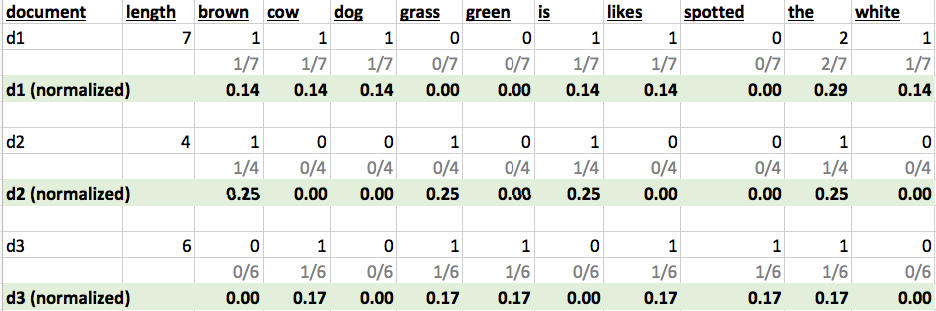

# Text Analytics

---

## Lesson Objectives


Notes:


---

# Text Analytics Overview

---

## Text Analytics Has Become Very Prominent


 * Rise of social media<br/>
 (Twitter / Facebook) allows<br/>
 lots of text exchanges

 * Customer 'chat' interaction

 * Customer emails

 * Unstructured data exists in<br/>
 many forms

 * Mostly underutilized

 * Can use data to great effect<br/>
 given right tools


<!-- {"left" : 5.31, "top" : 2.12, "height" : 3.73, "width" : 4.66} -->


Notes:


---

## Text Use Case: Customer Service Via Social Media


<!-- {"left" : 0.27, "top" : 1.31, "height" : 5.35, "width" : 9.72} -->


Notes:


---

## Text Analytics Use Case: Brand Analytics


<!-- {"left" : 1, "top" : 1.44, "height" : 5.09, "width" : 8.25} -->


Notes:


---

## Text Analytics Use Case : Customer Service


 * Many companies use a "chat now" feature for customer interaction

 * Why not mine this data?


```text
   Mary: Welcome to Ultimate Widgets!  How can I help?

   John: Hi!  I can't get my widget to work.

   Mary: What seems to be the problem?

   John: When I turn on the widget it makes a funny sound.
```
<!-- {"left" : 0, "top" : 2.36, "height" : 2.09, "width" : 10.25} -->


Notes:


---

## Text - Sentiment Analytics

<!-- {"left" : 0.51, "top" : 1.06, "height" : 5.85, "width" : 9.23} -->


Notes:
---

## Text Analytics Tools and Algorithms


 * Tools

     - Text visualizers: Word Cloud

 * 'Bag of Words'

 * TF-IDF

Notes:


---

## Visualizing Text – Word Clouds (State of the Union Speech 2014)


<!-- {"left" : 1.02, "top" : 1.46, "height" : 5.05, "width" : 8.21} -->


Notes:


---

# Bag of Words

---

## 'Bag of Words'


 * Split the document(s) into words

<!-- {"left" : 1.02, "top" : 1.85, "height" : 4.66, "width" : 8.21} -->


Notes:


---

## Tokenizing Text


 * Tokenizing is breaking the text into tokens (words / sentences)

 * Most text algorithms work on 'tokens'

 * Can you spot the differences in word-tokenization below?

<!-- {"left" : 1.02, "top" : 2.89, "height" : 3.79, "width" : 8.21} -->


Notes:


---

## Bag Words Analytics Example: 'Moby Dick' by Herman Melville

<!-- {"left" : 1.02, "top" : 1.28, "height" : 5.41, "width" : 8.21} -->


Notes:


---

## Bag Words Analytics Example2: 'Alice in Wonderland' by Lewis Carrol

<!-- {"left" : 1.89, "top" : 1.31, "height" : 4.21, "width" : 6.47} -->


 * cleaned

Notes:


---

## Bag of Words Example: "Tale of Two Cities" by Charles Dickens


 * We are going to walk through processing some text(slightly modified version)

```text
It was the best of times. It was the worst of times! It was the age of wisdom!!
$123

```

Notes:


---

## Bag of Words Process


 *  **Cleanup**

     -  **Step 1: Lowercase text:**

        (The Sun was bright -> the sun was bright)

     -  **Step 2: Remove punctuations**

        (!  ,   .  #)

     -  **Step 3: Remove numbers (optional)**

        (1, 2, 3)

     -  **Step 4: Remove STOP words (and any other unnecessary words)**  

        ( the, is, in, and)*

 *  **Tokenize**

     - Break text into words  (bag of words)

 *  **Analyze**

Notes:


---

## Text Cleanup: Lowercase, Remove Punctuations


```text
It was the best of times. It was the worst of times! It was the age of wisdom!!
$123

```
<!-- {"left" : 3.92, "top" : 2, "height" : 1.23, "width" : 2.41} -->


```text
it was the best of times. it was the worst of times! it was the age of wisdom!!
$123

```

<!-- {"left" : 2.96, "top" : 5.05, "height" : 0.9, "width" : 4.69} -->


```text
it was the best of times it was the worst of times it was the age of wisdom

```

Notes:


---

## Dealing With Stop Words


 * Stop words occur a lot

     - English (total 153):  *'a', 'about', 'above', 'after', 'again', 'against',..*

     - Spanish (total 313): *'a', 'al', '*  *algo*  *', '*  *algunas*  *', '*  *algunos*  *',*  *...*

     - German (total 231):  *'*  *wie*  *', 'also', '*  *alle*  *', '*  *anderer*  *', 'des',*

 * However they don't contribute much to analytics

     - Usually noise

 * Most text mining packages has a built in stop words dictionaries for various languages

Notes:


---

## Text Cleanup: Remove stop words


```text
it was the best of times it was the worst of times it was the age of wisdom

```
<!-- {"left" : 3.78, "top" : 1.63, "height" : 0.8, "width" : 2.68} -->


```text
English stopwords
 a, able, about, across, after, all, almost, also, am, among, an, and, any, are,
 as, at, be, because, been, but, by, can, cannot, could, dear, did, do, does, 
 either, else, ever, every, for, from, get, got, had, has, have, he, her, hers,
 him, his, how, however, i, if, in, into, is, it, its, just, least, let, like,
 likely, may, me, might, most, must, my, neither, no, nor, not, of, off, often,
 on, only, or, other, our, own, rather, said, say, says, she, should, since, 
 so, some, than, that, the, their, them, then, there, these, they, this, tis,
 to, too, twas, us, wants, was, we, were, what, when, where, which, while,
 who, whom, why, will, with, would, yet, you, your

```
<!-- {"left" :0, "top" : 2.74, "height" : 2.02, "width" : 9.75} -->

<!-- {"left" : 4.69, "top" : 5.07, "height" : 0.77, "width" : 0.87} -->


```text
best times worst times age wisdom

```
<!-- {"left" :0, "top" : 6.43, "height" : 0.54, "width" : 6.28} -->


Notes:


---

## Text Analytic : Word Count


 * Finally we have cleaned up text to do a simple analytics – word count


```text
Original text
It was the best of times. It was the worst of times! It was the age of wisdom!!
$123

```
<!-- {"left" :0, "top" : 1.86, "height" : 0.75, "width" : 9.75} -->


```text
Cleaned text
best times worst times age wisdom

```
<!-- {"left" :0, "top" : 2.87, "height" : 0.81, "width" : 6.28} -->

```text
Cleaned text

Total number of words = 6

+-------+-----+
|   word|count|
+-------+-----+
|  best |    1|
|  times|    2|
|  worst|    1|
|    age|    1|
| wisdom|    1|
+-------+-----+

```
<!-- {"left" :0, "top" : 3.94, "height" : 3.09, "width" : 4.12} -->


Notes:


---

## N-gram analytics


 * N-gram: sequence of  'n' number of words

     - Words have to be sequential

     - Order matters

 * N = 1: unigram (single word)

 * N = 2: bigram

     - "American people"

     - "black cats"

 * N-gram applications:

     - Predict the next word

       "Please call me `back`"

Notes:


---

## Sample N-gram Analytics Results for 'Moby Dick'


 * Moby-dick novel from project Gutenberg

     - 22,108 lines

     - 215,136 words

     - 1,257,274 characters

 * Below the 'bigram' analysis

```text
('of', 'the'): 1873,
('in', 'the'): 1129,
('to', 'the'): 725,
('from', 'the'): 432,
('and', 'the'): 358,
('of', 'his'): 357,
('of', 'a'): 331,
('on', 'the'): 327,
('with', 'the'): 324,
('at', 'the'): 318

```
<!-- {"left" : 4.13, "top" : 3.98, "height" : 1.56, "width" : 4.41} -->


Notes:


---

## Analytics After Stop Words


 * Here we show the results of top bigrams analysis on both

 * Moby-dick.txt

     - Before cleanup: 215,136  words

     - After 'stop word' cleanup: 115,093  words

 <!-- {"left" : 1.02, "top" : 3.09, "height" : 3.8, "width" : 8.21} -->


Notes:


---

## Bag of Words Review


 *  **Pros**

    * Easy to implement, well understood

 *  **Cons**

    * Context is lost.Both sentences below map to same 'bag of words'.But the meaning is very different.

<!-- {"left" : 0.29, "top" : 4.05, "height" : 1.45, "width" : 9.67} -->


Notes:


---

## Jump Off Point


 * Review text processing libraries for  Python / R / Spark

Notes:


---

## Lab: Work With Raw Text


 *  **Overview**: 
 
     - Tokenize / Clean / Stem raw text.

 *  **Builds on previous labs**: 
 
     - None

 *  **Approximate time**:
 
     - 15 mins

 *  **Instructions**:

     - R / Python  / Spark


Notes:


---

## Lab: Text Analytics: ngrams


 *  **Overview**: 
 
     - N-gram analytics

 *  **Builds on previous labs**: 
 
     - None

 *  **Approximate time**: 
  
     -  15 mins

 *  **Instructions**:

     - R / Python  / Spark


Notes:


---

# TF-IDF

---

## Problem: Searching for Relevant Documents


* We have a collection of text documents (emails / docs)

* We want to search for a keyword across documents

* We want to find the most relevant documents that match the search


<p align="left">**Issues to resolve:** </p>

 * Boolean searches (if a document has a keyword) may be not adequate

     - Too many results / too few results

     - Results are not ordered (important)

 * How do we prioritize documents?

    Decide which ones are most important.Think 'Google search': which results to show on the first page

Notes:


---

## TF-IDF


 * "Term Frequency, Inverse Document Frequency"

 * It is a way to score the importance of words (or "terms") in a document based on how frequently they appear across multiple documents

 * Basic algorithm

     - If a word appears frequently in a document, it's important. Give the word a high score

     - But if a word appears in many documents, it's not a unique identifier. Give the word a low score.

 * Common words like "the" and "for", which appear in many documents, will be scaled down.

 * Words that appear frequently in a single document will be scaled up

Notes:


---

## Document Frequency


 * How many times a word occurs in a document


 ```
  Document 1: the brown dog likes the white cow

  Document 2: the grass is brown

  Document 3: the spotted cow likes green grass
```


|   	| brown  	| cow 	| dog 	| grass 	| green 	| is 	| likes 	| spotted 	| the 	| white 	|
|--------	|-----	|-----	|-------	|-------	|----	|-------	|---------	|-----	|-------	|---	|
| d1 (7) 	| 1   	| 1   	| 1     	| 0     	| 0  	| 1     	| 1       	| 0   	| 2     	| 1 	|
| d2 (4) 	| 1   	| 0   	| 0     	| 1     	| 0  	| 1     	| 0       	| 0   	| 1     	| 0 	|
| d3 (6) 	| 0   	| 1   	| 0     	| 1     	| 1  	| 0     	| 1       	| 1   	| 1     	| 0 	|

Notes:


---

## Term Frequency  (TF)


 * A term would appear more times in a lengthier document

 * To normalize, divide the term count by total number of words in document

```
         Number of times term 't' appears in a document
TF(t) = ------------------------------------------------
         Total number of terms in the document

```

 <!-- {"left" : 0.44, "top" : 3.85, "height" : 3.11, "width" : 9.37} -->


Notes:

Source: tf-idf.xls


---

## Inverse Document Frequency (IDF)


 * IDF measures how important a term is

 * When computing TF (previous slide), all terms are considered equally important

 * How ever terms like 'the'  and 'of' (stop words) may appear a lot of times, but have little importance.

 * We need to weigh down frequent terms, and scale up rare ones

 * We use logarithmic scale to get reasonable numbers

 <!-- {"left" : 1.24, "top" : 5.07, "height" : 1.35, "width" : 7.77} -->


Notes:


---

## IDF Example

|                                         |                               |
|-----------------------------------------|-------------------------------|
| Number of words in **document 1**       | 100                           |
| The word **'cat'** appears in document1 | 3 times                       |
| TF (**cat**) in **document 1**          | 3/100= **0.03**               |
|                                         |                               |
| Total number of documents in corpus     | 1 million                     |
| Number of documents with **'cat'**      | 1000                          |
| IDF (**cat**)                           | LN (1,000,000/1000)= **6.91** |
| **TF-IDF (cat in document 1)**          | **0.03 * 6.91= 0.21**         |


Notes:

Source : http://www.tfidf.com/


---

## TF-IDF Example

```
  Document 1: the brown dog likes the white cow
  Document 2: the grass is brown
  Document 3: the spotted cow likes green grass
```

<!-- {"left" : 1.02, "top" : 2.22, "height" : 3.53, "width" : 8.21} -->


**You can play with the excel spreadsheet**

Notes:


---

## TF-IDF Example

```
  Document 1: the brown dog likes the white cow
  Document 2: the grass is brown
  Document 3: the spotted cow likes green grass
```

| term    	| d1   	| d2   	| d3   	| Document rank 	|
|---------	|------	|------	|------	|---------------	|
| brown   	| 0.06 	| 0.10 	| 0    	| d2,  d1       	|
| cow     	| 0.06 	| 0    	| 0.07 	| d3,  d1       	|
| dog     	| 0.16 	| 0    	| 0    	| d1            	|
| grass   	| 0    	| 0.10 	| 0.07 	| d2,  d3       	|
| green   	| 0    	| 0    	| 0.18 	| d3            	|
| is      	| 0.06 	| 0.10 	| 0    	| d2            	|
| likes   	| 0.06 	| 0    	| 0.07 	| d3,  d1       	|
| spotted 	| 0    	| 0    	| 0.18 	| d3            	|
| the     	| 0    	| 0    	| 0    	| All zero      	|
| white   	| 0.16 	| 0    	| 0    	| d1            	|
<!-- {"left" : 1.13, "top" : 2.11, "height" : 5.5, "width" : 7.99, "columnwidth" : [1.39, 1.39, 1.39, 1.39, 1.39]} -->

Notes:


---

## Document Term Matrix (DTM)


 * DTM is a matrix - describes how terms appear in documents

 * Rows correspond to documents

 * Columns correspond to terms

 * It will be a  **sparse**  matrix (not all terms occur on all documents)

     - Libraries need to represent sparse matrix in memory-efficient manner

| Terms -><br/><- documents 	| brown 	| dog 	| black 	| cat 	|
|------------------------	|-------	|-----	|-------	|-----	|
| doc1                   	| x     	| x   	|       	|     	|
| doc2                   	|       	|     	| x     	| x   	|


Notes:


---

## Term Document Matrix (TDM)


 * TDM is transposed DTM

 * Rows correspond to terms

 * Columns correspond to documents

| Documents -><br/><- Terms 	| doc1 	| doc2 	| doc3 	|
|----------------------	|------	|------	|------	|
| brown                	| x    	|      	|      	|
| dog                  	| x    	|      	|      	|
| black                	|      	| x    	|      	|
| cat                  	|      	| x    	| &nbsp;     	|

Notes:


---

## Lab: Text Analytics: TFIDF


 * **Overview**:
    - TFIDF

 * **Builds on previous labs**:
    - None

 * **Approximate time**:
    - 15 mins

 * **Instructions**"
    - R / Python  / Spark


Notes:


---

# word2vec

---

## Why word2vec?


 * Bag of words lose the context information

 * Experiment

     - Randomly change the order of all words in the document

     - What happens to TF-IDF?

 * Enter word2vec

<!-- {"left" : 1.34, "top" : 3.33, "height" : 3.92, "width" : 7.57} -->


Notes:

Source: https://hackernoon.com/word2vec-part-1-fe2ec6514d70


---

## What is a word vector?


 * Word -> (X<sub>1</sub>, X<sub>2</sub>, ..., X<sub>n</sub>)

     - Such as (TF, IDF)

     - But (TF, IDF, …)

Notes:


---

## How We Can Form Word Vectors

 * Add more numbers

 * Frequency based

     - Frequencies of word co-occurrence

 * Prediction based

     - Predictions of word co-occurrence

Notes:


---

## word2vec


 * Invented by Tomas Mikolov + others of Google

 *  **CBOW (Continuous Bag of Words)**

     - Tries to predict a word on bases of it's neighbors.

 *  **SkipGram**

     - Tries to predict the neighbors of a word.

Notes:


---

## Word2Vec in Spark

 <!-- {"left" : 0.26, "top" : 1.67, "height" : 4.64, "width" : 9.73} -->


Notes:

Source: https://spark.apache.org/docs/latest/mllib-feature-extraction.html


---

## Review Questions


Notes:


---

## Lesson Summary


 * Learned Text algorithms

Notes:
