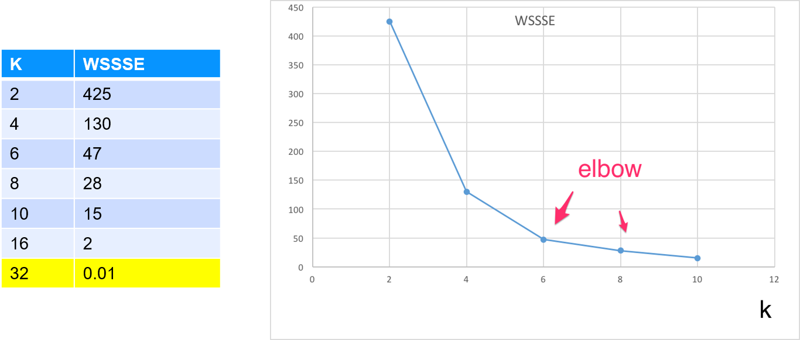
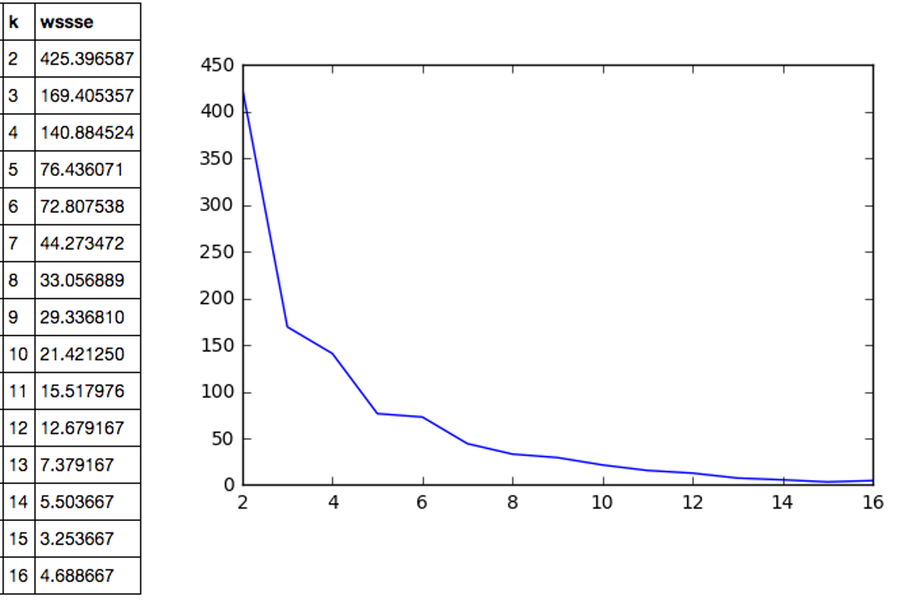

# Session: Unsupervised Learning With Python

---


## Lesson Objectives


 * Learn about Unsupervised algorithms in Python ML

 * Learn use cases

Notes: 

 


---

# Clustering in Python

---

## Clustering Algorithms in Python


 * K-Means

 * Bisecting K-Means

 * LDA

 * Power Iteration Clustering

 * Streaming K-Means

 * Gaussian Mixture

Notes: 


---

# K-Means in Python

---

## Python ML Kmeans API - Python


 *  **sklearn.cluster.KMeans** (self, n_clusters=8, init=‘k-means++’ max_iter=300, tol=0.0001)

Notes: 


---

## Python ML Kmeans API - Python

| Parameter  	| Description                                                                                                                                            	| Default Value 	|
|------------	|--------------------------------------------------------------------------------------------------------------------------------------------------------	|---------------	|
| n_clusters 	| Number of clusters                                                                                                                                     	| 8             	|
| init       	| How to initialize cluster centers. <br/>Possible values: <br/>-"random" : choose random points <br/>-"k-means++ : Uses a well-known algorithm for quicker convergence 	| ”k-means++"   	|
| tol        	| Threshold indicating the convergence o fclusters                                                                                                       	| 1e-4          	|
| maxIter    	| How many iterations                                                                                                                                    	| 20            	|
| n_init     	| Initial seed setting        	|               	| |

Notes: 


---

## Python K-Means Code (Python)

```python
 from sklearn.cluster 
 import KMeans import pandas as pd

 dataset = pd.read_csv(‘mtcars_header.csv)

 mpg_cyl = dataset[[‘model’, ‘mpg’, ‘cyl’]] 
 featureVector = mpg_cyl.iloc[:,1:3].values 
 
 # Start KMeans with 2 clusters
 kmeans = Kmeans(n_clusters=2, n_init=1)
 model = kmeans.fit(featureVector) 
 wssse = model.inertia_
 print(wssse) 
 dataset[‘prediction’] = model.predict(featureVector)
```

Notes: 

 


---

## K-Means Run Output


```text
// for k=2
> model.cluster_centers_
> array([25.478571428571428,4.428571428571428]
[15.899999999999999,7.555555555555555])

```

```text
> predicted.sort_values(["prediction", "mpg”])
+-------------------+----+---+----------+----------+
|model              |mpg |cyl|features  |prediction|
+-------------------+----+---+----------+----------+
|Mazda RX4          |21.0|6  |[21.0,6.0]|0         |
|Mazda RX4 Wag      |21.0|6  |[21.0,6.0]|0         |
|Hornet 4 Drive     |21.4|6  |[21.4,6.0]|0         |
...  
|Cadillac Fleetwood |10.4|8  |[10.4,8.0]|1         |
|Lincoln Continental|10.4|8  |[10.4,8.0]|1         |
|Camaro Z28         |13.3|8  |[13.3,8.0]|1         |
|Duster 360         |14.3|8  |[14.3,8.0]|1         |
|Chrysler Imperial  |14.7|8  |[14.7,8.0]|1         |
+-------------------+----+---+----------+----------+

```


Notes: 


---

## Evaluating K-Means With WSSSE


 * Goal is to  **minimize WSSSE** with  **reasonable effort** 

 * We look for elbows – that indicates a reasonable clustering

 * After the elbow, the improvement is minimal


 *  **Question for class:** At  **k=32**  we have achieved  **WSSSE=0** , as in perfect fit !How is that?




Notes: 


---

## Multiple Runs With K vs. WSSSE


```python
import pandas as pd 

k_wssse = pd.DataFrame(columns=('k', 'wssse')) 

# loop through K 
for k in range(2,17): 
   print ("k=", k) 
   kmeans = KMeans().setK(k).setSeed(1)   
   model = kmeans.fit(featureVector)  
   wssse = model.inertia_    
   print("k={}, wssse={}".format(k,wssse))  
   k_wssse = k_wssse.append( {'k': k, 'wssse': wssse}, ignore_index=True)
   
k_wssse 
```


```text
k= 2
   k=2, wssse=425.39658730158885
k= 3
   k=3, wssse=169.40535714285784
k= 4
   k=4, wssse=140.88452380952572

```

Notes: 


---

## K - WSSSE




Notes: 


---

## Lab: K-Means in Python


 *  **Overview** : 
 
    K-Means in Python

 *  **Approximate time** : 
 
    30-40 mins

 *  **Instructions** : 

     - KMEANS-1 lab (mtcars)

     - KMEANS-2 : Uber trips

     - Bonus Lab : KMEANS-3 : Walmart shopping data

 *  **Answers** : 

     - Upload appropriate HTML files


Notes: 

 


---

# PCA in Python

---

## Python ML Kmeans API - Python


 *  **sklearn.decomposition.PCA**  (self,n_components, init=‘k-means++’     max_iter=300, tol=0.0001)

Notes: 


---

## Python sklearn PCA Parameters

| Parameter    	| Description                                                                                                                                                                                                      	| Default Value 	|
|--------------	|------------------------------------------------------------------------------------------------------------------------------------------------------------------------------------------------------------------	|---------------	|
| n_components 	| Number of principal components                                                                                                                                                                                   	|               	|
| svd_solver   	| How to use SVD to get PCA <br/>- Possible values:<br/>- ”full" : calculate exact SVD<br/>- ”arpack”: truncated SVD for speed <br/>- ”randomized”: uses Halko method for speed <br/>- “auto”: “full” for small data, “randomized” for larger data. 	| ”auto”        	|
| whiten       	| scale output to unit variance                                                                                                                                                                                    	| False         	|
| tol          	| Threshold indicating the convergence o fclusters                                                                                                                                                                 	| 1e-4          	|
| maxIter      	| How many iterations                                                                                                                                                                                              	| 20            	|
| random_state 	| Initial seed setting    	|               	|      |

Notes: 


---

## PCA In Python


Notes: 


---

## PCA Notebook Demo


Notes: 


---

## Review Questions


Notes: 


---

## Further Reading


Notes: 


