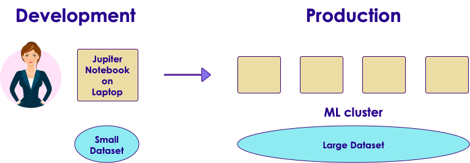
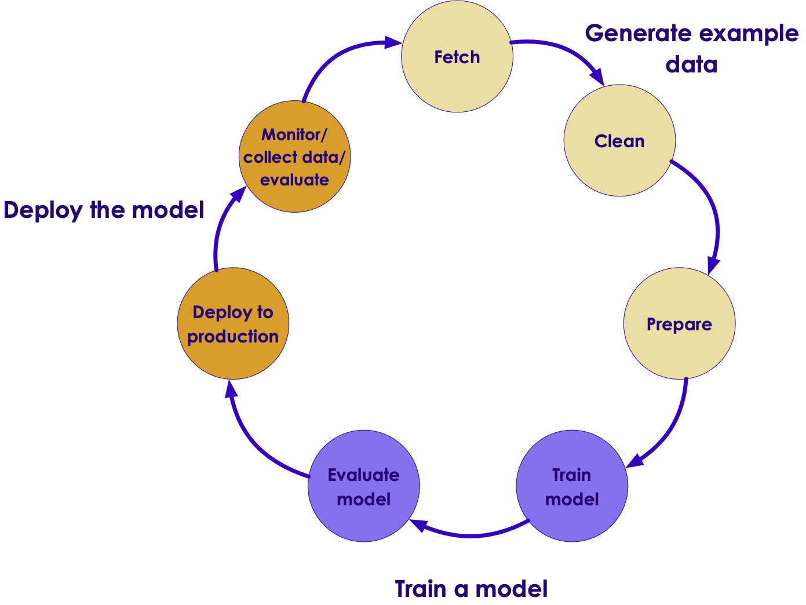
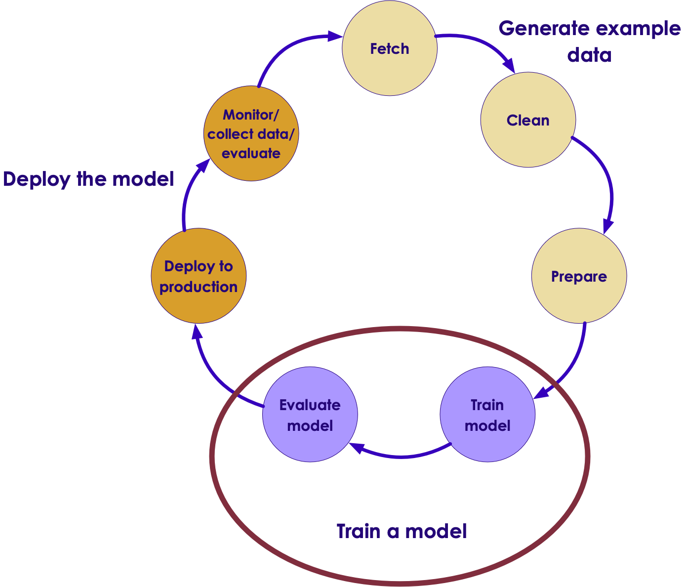
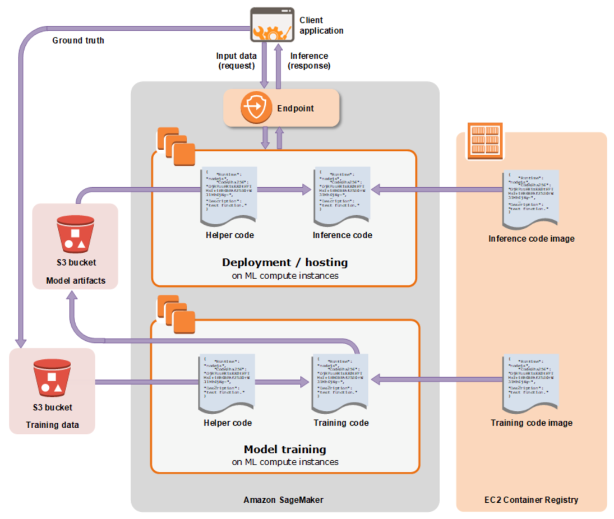
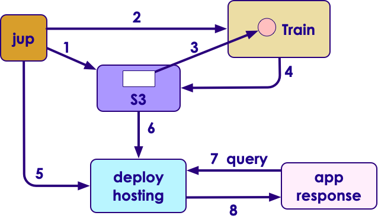

# SageMaker Introduction

---

## Lesson Objectives
  * Learn about SageMaker features
  * Learn SageMaker algorithms

---

# SageMaker Overview

---

## Typical Machine Learning Workflow
  * Data Scientists typically work on small datasets on their laptops
     - They work on a model
  * Once the model is decided, it is deployed on production
     - Usually on a cluster
     - Trained on large amount of data
  * Going from development to deployment isn't always easy

---

## What is Amazon SageMaker?

* Fully managed machine learning service

* Build and training machine learning models

* Deploy models into production hosted environment

---

## What Does SageMaker Provide?

  * **Development**: Jupyter authoring notebook instance
     - For data sources exploration and analysis

  * **Deployment**: Easy deployment at production scale

  * Common machine learning algorithms

     - Optimized for large data sets in distributed mode

  * Optional bring-your-own algorithm

  * Billing: by minutes

---

## How SageMaker Works?

Notes:
Source: https://docs.aws.amazon.com/sagemaker/latest/dg/how-it-works-mlconcepts.html

---

## Step 1: Data Wrangling

  * Data Wrangling involves
     - Obtaining data
     - Cleanup
     - Transform (get it ready for ML)

  * Obtaining Data
     - In house (e.g. user click behavior)
     - Purchase (e.g. from data brokers – user's search history ..etc.)
     - Public data (e.g. Census data)

---

## Step 1: Data Wrangling

  * Clean up
     - Remove invalid data, handle nulls
     - Inconsistent data (e.g. country=US vs.  Country = 'United States'

  * Transform
     - Join with other datasets.
     - E.g. Join house sales data with census data

---

## Step 1: Data Wrangling

  * Data Scientists often spend  a 
 lot of time in 'data wrangling'

  * In SageMaker, we do this part 
 using Jupyter notebook 
  environment provided

  * Data is stored in S3:S3 
 can support small 
  (few Kilo byts to Mega bytes) 
   to huge datasets (TB, PB).

---

## Step 2: Train the Model

  * First choose an algorithm
     - Depends on data
     - Can use algorithms provided 
     by SageMaker
     - Or bring your own

  * Training can consume lot of 
 resources (CPU, GPU, Memory, 
  multiple machines)

     - SageMaker provides elastic 
     scalability on AWS

  * Evaluating the Model:
     - Can use Jupyter notebook
     - Or built in SageMaker APIs

---

## Training a Model with SageMaker

Notes:
Source: https://docs.aws.amazon.com/sagemaker/latest/dg/how-it-works-training.html

---

## Scalable Training in SageMaker

  * SageMaker can automatically spin up many instances to scale training jobs.

---

## Kernels Supported by SageMaker

  * SageMaker native algorithms
  * Spark
     - PySpark, PySpark3, SparkR
  * Anaconda Python
     - python2, python 3
  * Custom Deep Learning Python code
     - TensorFlow (conda_tensorflow)
     - Apache MXNet  (conda_mxnet)
  * Your own algorithms
     - Provided as Docker images

---

## Model Validation in SM

  * Validate
     - Sensitive or specific (a.k.a recall and precision)
     - Offline testing
     - Online testing with % of live data
  * Validate with
     - "Hold out" sets (20-30%)
     - K-fold validation (5-10)

Notes:
TODO

---

## Step 3: Deploy the Model

  * Once the evaluation goes well, we can deploy the model to production:

  * Continuous cycle:
     - Monitor performance of Model
     - train it with more data
     - Deploy again

  * SageMaker makes this process easy

---

## Deploying a SageMaker Model

Notes:
Source: https://docs.aws.amazon.com/sagemaker/latest/dg/how-it-works-hosting.html

---

## SageMaker Machine Learning Steps

  * Explore the data
     - SageMaker managed instance with Jupyter Notebook

  * Train the model:
     - On small sample set using Jupyter notebook instance
     - On large dataset using cluster

  * Validate
     - Offline testing on small subset of data
     - Online testing with % of live data

  * Deploy
---

## Getting Started With SageMaker

  * Start by using the SageMaker console
  * Find an example Jupyter notebook and adapt it
  * Create new training models
  * Use Python or AWS SDK
  * Integrate SageMaker into Apache Spark pipeline

---

## Cleanup Check List

  * In the console
     - Endpoint, configuration, model
     - Notebook instances
  * S3
     - Your buckets
  * IAM
     - Your role
  * Cloudwatch
     - Logs from /aws/sagemaker

---

## Using MXNet

  * MXNet is a neural network library for deep learning
  * Apache open source project
  * Features:
     - Lightweight
     - Multiple language support : Python , R, Scala, Julia
     - GPU support

  * Integrated with SageMaker
     - SageMaker supports MXNet kernel
     - Callable from SageMaker

  * [ https://mxnet.apache.org/ ](https://mxnet.apache.org/)

Notes:
https://mxnet.apache.org/

---

## Using Spark

  * Spark is a modern distributed processing engine

  * Features:
     - Supports multiple languages 
    Scala, Java, Python, R
     - Scales to Big Data

  * SageMaker supports Spark
     - Spark is one of the supported kernels
     - Run your Spark applications in SM
     - SageMakerModel extends the org.apache.spark.ml.
     - SageMaker handles the data transfers

  * Amazon SageMaker Apache Spark Library -  (https://github.com/aws/sagemaker-spark)

---

## Monitoring Amazon SageMaker

  * **Amazon CloudWatch** monitors your AWS resources and applications 
  * Amazon CloudWatch Logs enables you to monitor, store, and access your log files from EC2 instances, AWS CloudTrail
     - That includes logs from SageMaker Docker containes
  * AWS CloudTrail captures API calls and related events made by or on behalf of your AWS account
     - Including SageMaker calls

---

## SageMaker Lab

  * Use: ml-labs-sagemaker/README.html
  * Runtime: 1hr – 1hr 30 mins
  * Instructor: Explain the workflow

---

# SageMaker Algorithms

---

## SageMaker Built-in Algorithms (Difficulty = Easy)

| Example                      	| What it is called      	| What it does                                        	|
|------------------------------	|------------------------	|-----------------------------------------------------	|
| factorization_machines_mnist 	| factorization-machines 	| SVM, improved with FM                               	|
| imageclassification_caltech  	| image-classification   	| Neural network full training or  transfer knowledge 	|
| lda_topic_modeling           	| lda                    	| LDA                                                 	|
| linear_learner_mnist         	| linear-learner         	| Logistic regression Linear regression               	|
| ntm_synthetic                	| ntm                    	| NTM – Neural Topic Modeling, cf. LDA                	|

---

## SageMaker Built-in Algorithms (Difficulty = Easy)

| Example                            	| What it is called 	| What it does                                                            	|
|------------------------------------	|-------------------	|-------------------------------------------------------------------------	|
| pca_mnist3                         	| pca               	| PCA                                                                     	|
| seq2seq_translation                	| seq2seg           	| Machine translation Based on MXNet                                      	|
| xgboost_abalone (continuous valus) 	| xgboost           	| Gradient Boosting Improved Random Forests Learns from previous mistakes 	|
| xgboost_mnist (classifier)         	| Same              	| Same                                                                    	|

---

## SageMaker Applications (Difficulty = Medium)

| Example                            	| What it is called      	| What it does                                                                   	|
|------------------------------------	|------------------------	|--------------------------------------------------------------------------------	|
| breast_cancer_prediction           	| linear-learner         	| Multi-model                                                                    	|
| ensemble_modeling                  	| linear-learner XGBoost 	| Ensemble                                                                       	|
| linear_time_series_forecast        	| linear-learner         	| Adjusted for seasonality                                                       	|
| video_games_sales_xgboost          	| XGBoost                	| Combine data from different review sources                                     	|
| xgboost_direct_marketing_sagemaker 	| XGBoost                	| Dealing with unbalanced classes Cleaning the data to improve model performance 	|

---

## SageMaker Advanced (Difficulty = Hard)

| Example                      	| What it is called              	| What it does                                           	|
|------------------------------	|--------------------------------	|--------------------------------------------------------	|
| data_distribution_types      	| linear-learner                 	| Scaling out Multiple buckets                           	|
| handling_kms_encrypted_data  	| XGBoost                        	| Data is encrypted KMS = Key Management Service         	|
| kmeans_bring_your_own_model  	| Kmeans in Python               	| Model conversion and Deployment                        	|
| scikit_bring_your_own        	| A Python algorithm             	| Creates a Docker container Registers it with SageMaker 	|
| tensorflow_distributed_mnist 	| TensorFlow In Distributed Mode 	| Creating a job that is running a  TensorFlow model     	|

---

# SageMaker API

---

## SageMaker APIs / SDKs

  * Main (RESTful)
     - [https://docs.aws.amazon.com/sagemaker/latest/dg/API_Reference.html](https://docs.aws.amazon.com/sagemaker/latest/dg/API_Reference.html)

  * Python – High Level Python SDK
     - [https://github.com/aws/sagemaker-python-sdk](https://github.com/aws/sagemaker-python-sdk)

  * SparkScala
    - [https://github.com/aws/sagemaker-spark](https://github.com/aws/sagemaker-spark)

  * Amazon SageMaker Apache Spark Library 
    - [https://github.com/aws/sagemaker-spark](https://github.com/aws/sagemaker-spark)

---

## Linear Learner

  * [SageMaker Linear Learner](https://docs.aws.amazon.com/sagemaker/latest/dg/linear-learner.html) is a supervised algorithm

  * Solves regression or classification problems

  * Input
     - (X,Y), where
     - X – multidimensional vector
     - Y – numeric label

  * Input formats
     - recordIO wrapped protobuf 
     - CSV

Notes:
https://docs.aws.amazon.com/sagemaker/latest/dg/linear-learner.html

---

## Linear Learner Hyperparameters

| Parameter Name 	| Description                                                                                                                                  	|
|----------------	|----------------------------------------------------------------------------------------------------------------------------------------------	|
| feature_dim    	| Number of features in input data. Required. Valid values: positive integer Default value: -                                                  	|
| predictor_type 	| Whether the target variable is binary classification or regression. Required. Valid values:  binary_classifier or regressor Default value: - 	|

      

* [https://docs.aws.amazon.com/sagemaker/latest/dg/ll_hyperparameters.html](https://docs.aws.amazon.com/sagemaker/latest/dg/ll_hyperparameters.html)

Notes:
https://docs.aws.amazon.com/sagemaker/latest/dg/ll_hyperparameters.html

---

## Review Questions

* What is SageMaker

* What languages does SageMaker provide

    - Scala? Java? Python? Go?

* SageMaker billing is by

    - Second? Minute? Hour?

* What do you need to clean up?

    - Instances? Redshift? Kinesis? S3?

---

## References

* Official documentation: 
[https://docs.aws.amazon.com/sagemaker/latest/dg/whatis.html](https://docs.aws.amazon.com/sagemaker/latest/dg/whatis.html)

