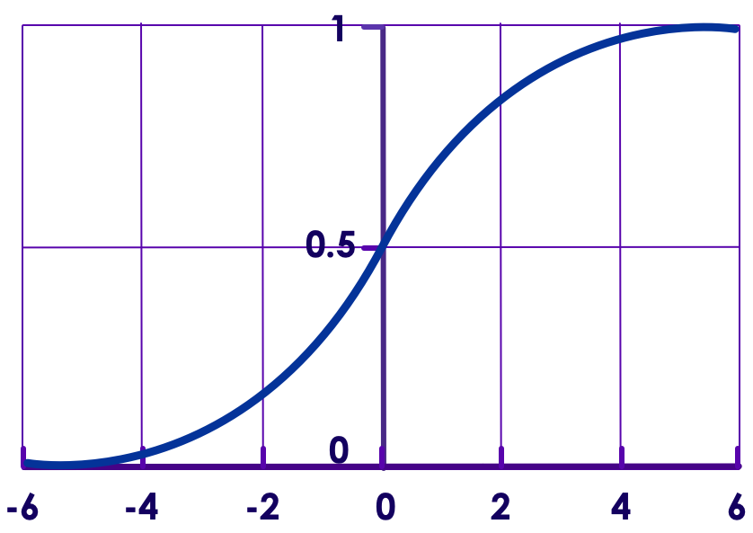

# Logistic Regression in Spark




---

## Lesson Objectives

* Learn Logistic Regression

* Perform Logistic Regression in Spark

Notes:

---

# Logistic Regression

[../generic/Regression-Logistic.md](../generic/Regression-Logistic.md)

---

# Logistic Regression in Spark


---

## Logistic Algorithms in Spark ML

* Supports

    - Binomial Logistic Regression (binary outcomes, yes/no)

    - Multinomial Logistic Regression (predicts K possible outcomes)

* Implementation (new ML package)

    - org.apache.spark.ml.classification.LogisticRegression

Notes:

---

## LogisticRegression Parameters

| Parameter | Function            | Description                                                                                                                                                                                                                                                                                       | Default Value |
|-----------|---------------------|---------------------------------------------------------------------------------------------------------------------------------------------------------------------------------------------------------------------------------------------------------------------------------------------------|---------------|
| maxIter   | setMaxIter(Int)     | Max number of iterations                                                                                                                                                                                                                                                                          | 100           |
| regParam  | setRegParam(Double) | Regulation parameter                                                                                                                                                                                                                                                                              | 0.0           |
| family    | setFamily(String)   | -binomial: Binary logistic regression with pivoting <br/>- multinomial: Multinomial logistic (softmax) regression without pivoting  <br/>- auto: Automatically select the family based on the number of classes: If numClasses == 1 OR numClasses == 2, set to binomial. Else, set to multinomial | "auto"        |
| elasticNetParam | setElasticNetParam (Double) | ElasticNet mixing parameter.  Range 0 to 1.<br/>- For alpha = 0, the penalty is an L2 penalty<br/>- For alpha = 1, it is an L1 penalty<br/>- For alpha in (0,1), the penalty is a combination of L1 and L2. | 0.0  (L2)     |
| featuresCol      | setFeaturesCol ()           | Which column as input features                                                                                                                                                                              | features      |
| predictionCol    | setPredictionCol ()         | Output prediction column                                                                                                                                                                                    | prediction    |

<!-- {"left" : 0.24, "top" : 2, "height" : 1, "width" : 17.07, "columnwidth" : [1.88, 2.27, 10.7, 2.22]} -->

Notes:

---

## Example: Applying for Credit Card

* Here is historical data on credit score and if the credit application is approved

* What is the chance someone with score of  **700**  getting a credit card approved?

| Credit Score | Approved? |
|--------------|-----------|
| 560          | No        |
| 750          | Yes       |
| 680          | Yes       |
| 650          | No        |
| 450          | No        |
| 800          | Yes       |
| 775          | Yes       |
| 705          | No        |
| 830          | Yes       |
| 610          | Yes       |
| 690          | No        |

<!-- {"left" : 5.74, "top" : 5.03, "height" : 5.9, "width" : 6.03, "columnwidth" : [2.65, 3.38]} -->

Notes:

---

## Logistic Regression in Spark ML Code (Python) 1/4

* Converting a Pandas dataframe into Spark dataframe

```python
import numpy as np
import pandas as pd
from pyspark.ml.classification import LogisticRegression
from pyspark.ml.feature import VectorAssembler

mydata = pd.DataFrame({
            'score' : [550, 750, 680, 650, 450, 800, 775, 525, 620, 705, 830, 610, 690],
            'approved' : [0,1,1,0,0,1,1,0,0,0,1,1,0]
            })
credit_data = spark.createDataFrame(mydata)
```
<!-- {"left" : 0.85, "top" : 3, "height" : 3.22, "width" : 15.48} -->

Notes:

---

## Logistic Regression in Spark ML Code (Python) 2/4

```python
 assembler = VectorAssembler(inputCols=["score"], outputCol="features")
 featureVector = assembler.transform(credit_data)
 featureVector = featureVector.withColumn("label",featureVector['approved'])
 featureVector.show()
```
<!-- {"left" : 0.85, "top" : 2.54, "height" : 1.41, "width" : 12.87} -->

```text
+--------+-----+--------+-----+
|approved|score|features|label|
+--------+-----+--------+-----+
|       0|550.0| [550.0]|    0|
|       1|750.0| [750.0]|    1|
|       1|680.0| [680.0]|    1|
|       0|650.0| [650.0]|    0|
|       0|450.0| [450.0]|    0|
|       1|800.0| [800.0]|    1|
|       1|775.0| [775.0]|    1|
|       0|525.0| [525.0]|    0|
|       0|620.0| [620.0]|    0|
|       0|705.0| [705.0]|    0|
|       1|830.0| [830.0]|    1|
|       1|610.0| [610.0]|    1|
|       0|690.0| [690.0]|    0|
+--------+-----+--------+-----+
```
<!-- {"left" : 0.85, "top" : 4.29, "height" : 6.66, "width" : 7.55} -->

Notes:

---

## Logistic Regression in Spark ML Code (Python) 3/4

```python
lr = LogisticRegression(maxIter=50, regParam=0.3, elasticNetParam=0.8)

# Fit the model
lrModel = lr.fit(featureVector)

# Print the coefficients and intercept for logistic regression
print("Coefficients: " + str(lrModel.coefficients))
print("Intercept: " + str(lrModel.intercept))
```
<!-- {"left" : 0.85, "top" : 2.54, "height" : 3.01, "width" : 14.34} -->

```text
Coefficients: [0.00231936473739]
Intercept: -1.697546464447156

```
<!-- {"left" : 0.85, "top" : 6.06, "height" : 1.31, "width" : 9.38} -->

Notes:

---

## Logistic Regression in Spark ML Code (Python) 4/4

```python
 lrModel.summary.predictions.show()
```
<!-- {"left" : 0.85, "top" : 1.74, "height" : 0.69, "width" : 7.82} -->

```text
+--------+-----+--------+-----+--------------------+--------------------+----------+
|approved|score|features|label|       rawPrediction|         probability|prediction|
+--------+-----+--------+-----+--------------------+--------------------+----------+
|       0|550.0| [550.0]|  0.0|[0.42189585888523...|[0.60393682312240...|       0.0|
|       1|750.0| [750.0]|  1.0|[-0.0419770885918...|[0.48950726855595...|       1.0|
|       1|680.0| [680.0]|  1.0|[0.12037844302514...|[0.53005832166779...|       0.0|
|       0|650.0| [650.0]|  0.0|[0.18995938514670...|[0.54734755549913...|       0.0|
|       0|450.0| [450.0]|  0.0|[0.65383233262376...|[0.65787354968202...|       0.0|
|       1|800.0| [800.0]|  1.0|[-0.1579453254610...|[0.46059555225819...|       1.0|
|       1|775.0| [775.0]|  1.0|[-0.0999612070264...|[0.47503048656856...|       1.0|
|       0|525.0| [525.0]|  0.0|[0.47987997731987...|[0.61771953276060...|       0.0|
|       0|620.0| [620.0]|  0.0|[0.25954032726826...|[0.56452329070847...|       0.0|
|       0|705.0| [705.0]|  0.0|[0.06239432459051...|[0.51559352260997...|       0.0|
|       1|830.0| [830.0]|  1.0|[-0.2275262675826...|[0.44336255743359...|       1.0|
|       1|610.0| [610.0]|  1.0|[0.28273397464212...|[0.57021636641005...|       0.0|
|       0|690.0| [690.0]|  0.0|[0.09718479565129...|[0.52427709405754...|       0.0|
+--------+-----+--------+-----+--------------------+--------------------+----------+

```

<!-- {"left" : 0.85, "top" : 2.56, "height" : 3.6, "width" : 10.06} -->

<br/>

* **Question for the class:** Notice when the prediction differs from actual ('approved')

Notes:

---

## Logistic Regression in Spark ML Code (Python) 4/4

```python
 trainingSummary = lrModel.summary
 print("areaUnderROC: " + str(trainingSummary.areaUnderROC))  
 ## 0.8571428571428571

 roc_df = trainingSummary.roc.toPandas()
 plt.plot(roc_df['FPR'], roc_df['TPR'])
 plt.xlabel("FPR")
 plt.ylabel("TPR")
 plt.title("ROC Curve")
 plt.plot([0.0, 1.0], [0.0, 1.0], 'r')
```
<!-- {"left" : 0.85, "top" : 1.6, "height" : 2.84, "width" : 9.86} -->

 <!-- {"left" : 9.83, "top" : 6.25, "height" : 4.94, "width" : 6.91} -->

* Here AUC = 0.857

* Pretty good!

Notes:

---

## Prediction

```python
newdata = pd.DataFrame({'score' : [600, 700, 810] })
print(newdata)

spark_newdata = spark.createDataFrame(newdata)
newfeatures = assembler.transform(spark_newdata)
predicted = lrModel.transform(newfeatures)
predicted.show(10, False)

```
<!-- {"left" : 0.85, "top" : 1.7, "height" : 2.02, "width" : 8.23} -->

```text
   score
0    600
1    700
2    810


+-----+--------+--------------------+--------------------+----------+
|score|features|       rawPrediction|         probability|prediction|
+-----+--------+--------------------+--------------------+----------+
|  600| [600.0]|[0.30592762201597...|[0.57589092990394...|       0.0|
|  700| [700.0]|[0.07399114827744...|[0.51848935254944...|       0.0|
|  810| [810.0]|[-0.1811389728349...|[0.45483867290735...|       1.0|
+-----+--------+--------------------+--------------------+----------+

```
<!-- {"left" : 0.85, "top" : 3.9, "height" : 2.74, "width" : 8.23} -->

<br/>

* TODO: verify this credit score 600 has only 14% (probability 0.14) chance of getting approved
* credit score of 810 has 93% chance of approval

Notes:

---

## LogisticRegression Code (Python) - Full Code

```python
import numpy as np
import pandas as pd
from pyspark.ml.classification import LogisticRegression
from pyspark.ml.feature import VectorAssembler

mydata = pd.DataFrame({
     'score' : [550, 750, 680, 650, 450, 800, 775, 525, 620, 705, 830, 610, 690],
     'approved' : [0,1,1,0,0,1,1,0,0,0,1,1,0]
    })
credit_data = spark.createDataFrame(mydata)

assembler = VectorAssembler(inputCols=["score"], outputCol="features")
featureVector = assembler.transform(credit_data)
featureVector = featureVector.withColumn("label",featureVector.approved)

lr = LogisticRegression(maxIter=50, regParam=0.3, elasticNetParam=0.8)
lrModel = lr.fit(featureVector)

print("Coefficients: " + str(lrModel.coefficients))
print("Intercept: " + str(lrModel.intercept))
```
<!-- {"left" : 0.85, "top" : 2.5, "height" : 6.56, "width" : 15.31} -->

Notes:

---

## Lab: Logistic Regression

<!-- {"left" : 12.43, "top" : 1.51, "height" : 5.73, "width" : 4.29} -->

* **Overview:**
     - Practice Logistic Regression

* **Approximate Time:**
     - 30 mins

* **Instructions:**
    - **LOGIT-1: Credit card approval (single variable)**
    - **LOGIT-2: College Admission (multiple variables)**

Notes:

---

## Lab: Cross Validation: Hyper Parameter Tuning

<!-- {"left" : 12.43, "top" : 1.51, "height" : 5.73, "width" : 4.29} -->

* **Overview:**
    - Learn to do Cross Validation

* **Approximate Time:**
    - 30 mins

* **Instructions:**
    - **Cross Validation 1: Tuning the model**

Notes:

---

## Review and Q&A

<!-- {"left" : 13.07, "top" : 1.89, "height" : 2.69, "width" : 3.63} -->

* Let's go over what we have covered so far

* Any questions?

<!-- {"left" : 4.62, "top" : 4.8, "height" : 5.53, "width" : 8.31} -->

