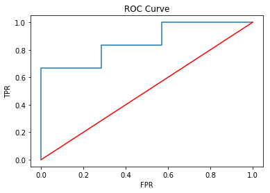

# Classifications in Spark
---


## Lesson Objectives

 * Learn classification algorithms in Spark
 * Logistic Regression
 * SVM (Support Vector Machines)
 * Naive Bayes

Notes:

---

# Classification Intro

[../generic/Classification-Intro.md](../generic/Classification-Intro.md)

---

# Logistic Regression

[../generic/Regression-Logistic.md](../generic/Regression-Logistic.md)


---

# Logistic Regression in Spark

---

## Logistic Algorithms in Spark ML


 * Supports

     - Binomial Logistic Regression (binary outcomes, yes/no)

     - Multinomial Logistic Regression (predicts K possible outcomes)

 * Implementation (new ML package)

     - org.apache.spark.ml.classification.LogisticRegression

Notes:


---

## LogisticRegression Parameters

| Parameter | Function            | Description                                                                                                                                                                                                                                                                                       | Default Value |
|-----------|---------------------|---------------------------------------------------------------------------------------------------------------------------------------------------------------------------------------------------------------------------------------------------------------------------------------------------|---------------|
| maxIter   | setMaxIter(Int)     | Max number of iterations                                                                                                                                                                                                                                                                          | 100           |
| regParam  | setRegParam(Double) | Regulation parameter                                                                                                                                                                                                                                                                              | 0.0           |
| family    | setFamily(String)   | -binomial: Binary logistic regression with pivoting <br/>- multinomial: Multinomial logistic (softmax) regression without pivoting  <br/>- auto: Automatically select the family based on the number of classes: If numClasses == 1 OR numClasses == 2, set to binomial. Else, set to multinomial | "auto"        |
| elasticNetParam | setElasticNetParam (Double) | ElasticNet mixing parameter.  Range 0 to 1.<br/>- For alpha = 0, the penalty is an L2 penalty<br/>- For alpha = 1, it is an L1 penalty<br/>- For alpha in (0,1), the penalty is a combination of L1 and L2. | 0.0  (L2)     |
| featuresCol      | setFeaturesCol ()           | Which column as input features                                                                                                                                                                              | features      |
| predictionCol    | setPredictionCol ()         | Output prediction column                                                                                                                                                                                    | prediction    |

<!-- {"left" : 0.14, "top" : 1.03, "height" : 4.6, "width" : 9.97, "columnwidth" : [1.63, 1.55, 5.53, 1.26]} -->

Notes:


---

### Example: Applying for Credit Card

 * Here is historical data on credit score and if the credit application is approved
 * What is the chance someone with score of  **700**  getting a credit card approved?

| Credit Score | Approved? |
|--------------|-----------|
| 560          | No        |
| 750          | Yes       |
| 680          | Yes       |
| 650          | No        |
| 450          | No        |
| 800          | Yes       |
| 775          | Yes       |
| 705          | No        |
| 830          | Yes       |
| 610          | Yes       |
| 690          | No        |

<!-- {"left" : 3.35, "top" : 3.42, "height" : 4.77, "width" : 3.55, "columnwidth" : [1.74, 1.81]} -->

Notes:


---

## Logistic Regression in Spark ML Code (Python) 1/4

* Converting a Pandas dataframe into Spark dataframe

```python
import numpy as np
import pandas as pd
from pyspark.ml.classification import LogisticRegression
from pyspark.ml.feature import VectorAssembler

mydata = pd.DataFrame({
            'score' : [550, 750, 680, 650, 450, 800, 775, 525, 620, 705, 830, 610, 690],
            'approved' : [0,1,1,0,0,1,1,0,0,0,1,1,0]
            })
credit_data = spark.createDataFrame(mydata)
```
<!-- {"left" : 0, "top" : 1.92, "height" : 2.13, "width" : 10.25} -->

Notes:


---

## Logistic Regression in Spark ML Code (Python) 2/4


 ```python
 assembler = VectorAssembler(inputCols=["score"], outputCol="features")
 featureVector = assembler.transform(credit_data)
 featureVector = featureVector.withColumn("label",featureVector['approved'])
 featureVector.show()
```
<!-- {"left" : 0, "top" : 1.47, "height" : 1.12, "width" : 10.25} -->


```text
+--------+-----+--------+-----+
|approved|score|features|label|
+--------+-----+--------+-----+
|       0|550.0| [550.0]|    0|
|       1|750.0| [750.0]|    1|
|       1|680.0| [680.0]|    1|
|       0|650.0| [650.0]|    0|
|       0|450.0| [450.0]|    0|
|       1|800.0| [800.0]|    1|
|       1|775.0| [775.0]|    1|
|       0|525.0| [525.0]|    0|
|       0|620.0| [620.0]|    0|
|       0|705.0| [705.0]|    0|
|       1|830.0| [830.0]|    1|
|       1|610.0| [610.0]|    1|
|       0|690.0| [690.0]|    0|
+--------+-----+--------+-----+

```
<!-- {"left" : 0, "top" : 3.09, "height" : 5.24, "width" : 5.94} -->


Notes:


---

## Logistic Regression in Spark ML Code (Python) 3/4


```
lr = LogisticRegression(maxIter=50, regParam=0.3, elasticNetParam=0.8)

# Fit the model
lrModel = lr.fit(featureVector)

# Print the coefficients and intercept for logistic regression
print("Coefficients: " + str(lrModel.coefficients))
print("Intercept: " + str(lrModel.intercept))
```
<!-- {"left" : 0, "top" : 1.36, "height" : 2.15, "width" : 10.25} -->

```text
Coefficients: [0.00231936473739]
Intercept: -1.697546464447156

```
<!-- {"left" : 0, "top" : 4.1, "height" : 0.96, "width" : 6.85} -->

Notes:


---

## Logistic Regression in Spark ML Code (Python) 4/4

```
 lrModel.summary.predictions.show()
```
<!-- {"left" : 0, "top" : 1.23, "height" : 0.69, "width" : 7.82} -->

```text
+--------+-----+--------+-----+--------------------+--------------------+----------+
|approved|score|features|label|       rawPrediction|         probability|prediction|
+--------+-----+--------+-----+--------------------+--------------------+----------+
|       0|550.0| [550.0]|  0.0|[0.42189585888523...|[0.60393682312240...|       0.0|
|       1|750.0| [750.0]|  1.0|[-0.0419770885918...|[0.48950726855595...|       1.0|
|       1|680.0| [680.0]|  1.0|[0.12037844302514...|[0.53005832166779...|       0.0|
|       0|650.0| [650.0]|  0.0|[0.18995938514670...|[0.54734755549913...|       0.0|
|       0|450.0| [450.0]|  0.0|[0.65383233262376...|[0.65787354968202...|       0.0|
|       1|800.0| [800.0]|  1.0|[-0.1579453254610...|[0.46059555225819...|       1.0|
|       1|775.0| [775.0]|  1.0|[-0.0999612070264...|[0.47503048656856...|       1.0|
|       0|525.0| [525.0]|  0.0|[0.47987997731987...|[0.61771953276060...|       0.0|
|       0|620.0| [620.0]|  0.0|[0.25954032726826...|[0.56452329070847...|       0.0|
|       0|705.0| [705.0]|  0.0|[0.06239432459051...|[0.51559352260997...|       0.0|
|       1|830.0| [830.0]|  1.0|[-0.2275262675826...|[0.44336255743359...|       1.0|
|       1|610.0| [610.0]|  1.0|[0.28273397464212...|[0.57021636641005...|       0.0|
|       0|690.0| [690.0]|  0.0|[0.09718479565129...|[0.52427709405754...|       0.0|
+--------+-----+--------+-----+--------------------+--------------------+----------+

```

<!-- {"left" : 0, "top" : 2.12, "height" : 3.15, "width" : 8.82} -->

<br/>

 *  **Question for the class:** Notice when the prediction differs from actual ('approved')

Notes:


---


## Logistic Regression in Spark ML Code (Python) 4/4

```python
 trainingSummary = lrModel.summary
 print("areaUnderROC: " + str(trainingSummary.areaUnderROC))  
 ## 0.8571428571428571

 roc_df = trainingSummary.roc.toPandas()
 plt.plot(roc_df['FPR'], roc_df['TPR'])
 plt.xlabel("FPR")
 plt.ylabel("TPR")
 plt.title("ROC Curve")
 plt.plot([0.0, 1.0], [0.0, 1.0], 'r')
```
<!-- {"left" : 0, "top" : 1.29, "height" : 2.95, "width" : 10.25} -->

 <!-- {"left" : 4.56, "top" : 4.89, "height" : 3.86, "width" : 5.4} -->


 * Here AUC = 0.857

 * Pretty good!


Notes:


---

## Prediction

```python
newdata = pd.DataFrame({'score' : [600, 700, 810] })
print(newdata)

spark_newdata = spark.createDataFrame(newdata)
newfeatures = assembler.transform(spark_newdata)
predicted = lrModel.transform(newfeatures)
predicted.show(10, False)

```
<!-- {"left" : 0, "top" : 1.02, "height" : 1.56, "width" : 6.36} -->


```text
   score
0    600
1    700
2    810


+-----+--------+--------------------+--------------------+----------+
|score|features|       rawPrediction|         probability|prediction|
+-----+--------+--------------------+--------------------+----------+
|  600| [600.0]|[0.30592762201597...|[0.57589092990394...|       0.0|
|  700| [700.0]|[0.07399114827744...|[0.51848935254944...|       0.0|
|  810| [810.0]|[-0.1811389728349...|[0.45483867290735...|       1.0|
+-----+--------+--------------------+--------------------+----------+

```
<!-- {"left" : 0, "top" : 2.7, "height" : 2.13, "width" : 6.4} -->

<br/>

 * TODO: verify this credit score 600 has only 14% (probability 0.14) chance of getting approved
 * credit score of 810 has 93% chance of approval

Notes:


---

## LogisticRegression Code (Python) - Full Code

```
import numpy as np
import pandas as pd
from pyspark.ml.classification import LogisticRegression
from pyspark.ml.feature import VectorAssembler

mydata = pd.DataFrame({
     'score' : [550, 750, 680, 650, 450, 800, 775, 525, 620, 705, 830, 610, 690],
     'approved' : [0,1,1,0,0,1,1,0,0,0,1,1,0]
    })
credit_data = spark.createDataFrame(mydata)

assembler = VectorAssembler(inputCols=["score"], outputCol="features")
featureVector = assembler.transform(credit_data)
featureVector = featureVector.withColumn("label",featureVector.approved)

lr = LogisticRegression(maxIter=50, regParam=0.3, elasticNetParam=0.8)
lrModel = lr.fit(featureVector)

print("Coefficients: " + str(lrModel.coefficients))
print("Intercept: " + str(lrModel.intercept))
```
<!-- {"left" : 0, "top" : 1.39, "height" : 4.39, "width" : 10.25} -->

Notes:


---

## Lab: Logistic Regression

<!-- {"left" : 7.11, "top" : 0.85, "height" : 3.78, "width" : 2.83} -->

 *  **Overview:**

     - Practice Logistic Regression

 *  **Approximate Time:**

     - 30 mins

 *  **Instructions:**
    -  **LOGIT-1: Credit card approval (single variable)**
    -  **LOGIT-2: College Admission (multiple variables)**

Notes:

---

## Lab: Cross Validation: Hyper Parameter Tuning

<!-- {"left" : 7.11, "top" : 0.85, "height" : 3.78, "width" : 2.83} -->

 *  **Overview:**

    - Learn to do Cross Validation

 *  **Approximate Time:**

    - 30 mins

 *  **Instructions:**
     -  **Cross Validation 1: Tuning the model**


Notes:

---

# SVM

[../generic/Classification-SVM.md](../generic/Classification-SVM.md)

---

# SVM in Spark

---

## SVM Support in Spark


 * Implemented by  **pyspark.ml.classification.LinearSVC** (python) **org.apache.spark.ml.classification.LinearSVC**   (Scala)

 * Currently supports binary classification.

     - More than 2 classes

 * Only supports linear classification (kernel SVM not supported).

Notes:


---

## SVM Parameters

| Parameter        | Description                                                      | Default Value |
|------------------|------------------------------------------------------------------|---------------|
| maxIter          | Max number of iterations for SGD  fitting                        | 100           |
| regParam         | Misclassification  penalty C                                     | 0             |
| tol              | Convergence tolerance                                            | 1e-6          |
| FitIntercept     | Whether or not to  fit the intercept as well as the coefficients | true          |
| threshold        | Minimum Information Gain per split                               | 0             |
| AggregationDepth | The number of features to aggregate                              | 2             |
| standardization  | Whether to standardize  before running model                     | true          |
| predictionCol    | Output  prediction column                                        | "prediction"  |
| labelCol         | Label  Column                                                    | "label"       |

<!-- {"left" : 0.25, "top" : 1.42, "height" : 6.24, "width" : 9.75} -->

Notes:


---

## SVM Sample Code (Python)
```python
 from pyspark.ml.classification import LinearSVC  
 # Load training data
 training = spark.read(...)

 lsvc = LinearSVC(maxIter=10, regParam=0.1)

 # Fit the model  
 lsvcModel = lsvc.fit(training)

 # Print the coefficients and intercept for linearsSVC
 print("Coefficients: " + str(lsvcModel.coefficients))
 print("Intercept: " + str(lsvcModel.intercept))
 ```
<!-- {"left" : 0, "top" : 1.39, "height" : 3.96, "width" : 10.25} -->


Notes:


---

## Model Evaluation Sample Code (Python)

```python
from pyspark.ml.evaluation import MultiClassClassificationEvaluator  

evaluator = MulticlassClassificationEvaluator(
                labelCol="indexedLabel",
                predictionCol="prediction",
                metricName="accuracy")

accuracy = evaluator.evaluate(predictions)

print("Accuracy = %g " , accuracy)
# 0.76
```
<!-- {"left" : 0, "top" : 1.44, "height" : 2.13, "width" : 10.25} -->

Notes:


---
## Lab: SVM

<!-- {"left" : 6.76, "top" : 0.88, "height" : 4.37, "width" : 3.28} -->


* **Overview:**
    - Work with SVM algorithm

* **Approximate time:**
    - 20-30 mins

* **Instructions:**

    - SVM1 - 'college-admission' data

    - SVM2 - Customer churn data


Notes:

---


# Naïve Bayes

[../generic/Classification-Naive-Bayes.md](../generic/Classification-Naive-Bayes.md)

---

# Naive Bayes in Spark

---


## Naïve Bayes Support in Spark


 * Implemented by  
    - **pyspark.ml.classification.NaïveBayes**  (python)
    - **org.apache.spark.ml.classification.NaïveBayes**  (Scala)

 * Mostly used for text classification

Notes:


---

## Naïve Bayes Parameters

| **Parameter** | **Description**                      | **Default Value** |
|---------------|--------------------------------------|-------------------|
| numIterations | Max number of iterations for fitting | 100               |
| modelType     | 'multinomial' or 'bernoulli'         | 'multinomial'     |
| lambda        | Lambda smoothing                     | 1                 |
| predictionCol | Output prediction column             | "prediction"      |
| labelCol      | Label Column                         | "label"           |

<!-- {"left" : 0.25, "top" : 1.52, "height" : 3.19, "width" : 9.75} -->
Notes:


---

## Naive Bayes in Spark ML (Python) - SPAM classification

```python
## Step 1 - Read Data

dataset = spark.read.format("csv").\
          option('header','true').\
          option('delimiter', '\t').\
          load("/data/spam/SMSSpamCollection.txt")

dataset.printSchema()
dataset.show()
```
<!-- {"left" : 0, "top" : 1.29, "height" : 2.9, "width" : 9.11} -->

```text
root
 |-- isspam: string (nullable = true)
 |-- text: string (nullable = true)

 +------+--------------------+
 |isspam|                text|
 +------+--------------------+
 |   ham|Go until jurong p...|
 |   ham|Ok lar... Joking ...|
 |  spam|Free entry in 2 a...|
 |   ham|U dun say so earl...|

```
<!-- {"left" : 0, "top" : 4.57, "height" : 3.49, "width" : 6.94} -->

---
## Naive Bayes in Spark ML (Python) - SPAM classification

```python
## Step 2 : Shape data

from pyspark.ml.feature import HashingTF, IDF, Tokenizer

tokenizer = Tokenizer(inputCol="text", outputCol="words")
wordsData = tokenizer.transform(dataset)

number_of_features = 2000

hashingTF = HashingTF(inputCol="words", outputCol="rawFeatures", numFeatures=number_of_features)
featurizedData = hashingTF.transform(wordsData)

idf = IDF(inputCol="rawFeatures", outputCol="features")
idfModel = idf.fit(featurizedData)
featureVector2 = idfModel.transform(featurizedData)
featureVector2.show()

```
<!-- {"left" : 0, "top" : 1.67, "height" : 3.02, "width" : 10.25} -->

```text
+------+--------------------+--------------------+--------------------+--------------------+
|isspam|                text|               words|         rawFeatures|            features|
+------+--------------------+--------------------+--------------------+--------------------+
|   ham|Go until jurong p...|[go, until, juron...|(2000,[7,77,165,2...|(2000,[7,77,165,2...|
|   ham|Ok lar... Joking ...|[ok, lar..., joki...|(2000,[20,484,131...|(2000,[20,484,131...|
|  spam|Free entry in 2 a...|[free, entry, in,...|(2000,[30,128,140...|(2000,[30,128,140...|
```
<!-- {"left" : 0, "top" : 5.44, "height" : 1.29, "width" : 10.25} -->

---

## Naive Bayes in Spark ML (Python) - SPAM classification

```python

## Step 3: Shape / index data

from pyspark.ml.feature import StringIndexer

indexer = StringIndexer(inputCol="isspam", outputCol="label")
indexed = indexer.fit(rescaledData).transform(featureVector2)
indexed.select(['text', 'isspam', 'label', 'features']).show()

(train, test) = indexed.randomSplit([.8, .2])
```
<!-- {"left" : 0, "top" : 1.53, "height" : 2.7, "width" : 10.25} -->

```text
+--------------------+------+-----+--------------------+
|                text|isspam|label|            features|
+--------------------+------+-----+--------------------+
|Go until jurong p...|   ham|  0.0|(2000,[7,77,165,2...|
|Ok lar... Joking ...|   ham|  0.0|(2000,[20,484,131...|
|Free entry in 2 a...|  spam|  1.0|(2000,[30,128,140...|
|U dun say so earl...|   ham|  0.0|(2000,[57,372,381...|
```
<!-- {"left" : 0, "top" : 4.85, "height" : 2.32, "width" : 10.25} -->

---
## Naive Bayes in Spark ML (Python) - SPAM classification

```python
from pyspark.ml.classification import NaiveBayes
from pyspark.ml.evaluation import MulticlassClassificationEvaluator

nb = NaiveBayes(smoothing=1.0, modelType="multinomial")
model = nb.fit(train)

predictions = model.transform(test)


evaluator = MulticlassClassificationEvaluator(labelCol="label",
                        predictionCol="prediction",
                        metricName="accuracy")

print("Test set accuracy = " , evaluator.evaluate(predictions))
## 0.86
```
<!-- {"left" : 0, "top" : 1.6, "height" : 3.99, "width" : 10.25} -->


Notes:

---

## Lab: Naïve Bayes

<!-- {"left" : 6.93, "top" : 0.94, "height" : 3.77, "width" : 2.83} -->


* **Overview:** Use Naïve Bayes implementation

* **Approximate Time:** 20-30 min.

* **Instructions:**

    - NB1: Spam classification

    - BONUS: NB2: Income classification

Notes:
