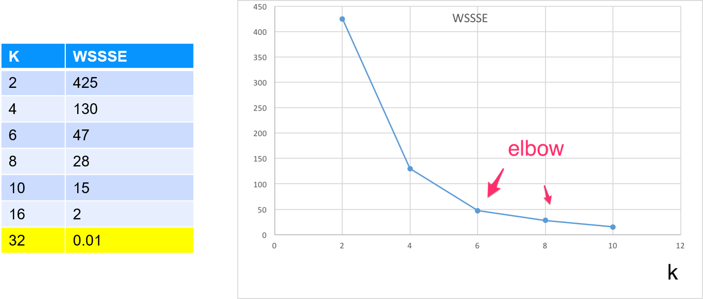

# Clustering in Spark


<!-- {"left" : 2.3, "top" : 2.55, "height" : 8.61, "width" : 12.9} -->

---

## Lesson Objectives

* Learn to use Clustering algorithms in Spark ML

Notes:

---

# Unsupervised Intro

[../generic/Unsupervised-Intro.md](../generic/Unsupervised-Intro.md)

---

# Clustering

[../generic/Clustering.md](../generic/Clustering.md)

---

# Clustering in Spark ML


<!-- {"left" : 2.3, "top" : 2.55, "height" : 8.61, "width" : 12.9} -->

---

## Clustering Algorithms in Spark

* K-Means

* Bisecting K-Means

* LDA

* Power Iteration Clustering

* Streaming K-Means

* Gaussian Mixture

Notes:

---

## K-Means in Spark (Python)

* class: **pyspark.ml.clustering.Kmeans**

```python
from pyspark.ml.feature import VectorAssembler

dataset = spark.read.csv("mtcars_header.csv", header=True, inferSchema=True)
mpg_cyl = dataset.select("model", "mpg", "cyl")
mpg_cyl.show(40)

# select input / output
assembler = VectorAssembler(inputCols=["mpg", "cyl"], outputCol="features")
featureVector = assembler.transform(mpg_cyl)
featureVector.show(40)
```

```text
# mpg_cyl
+-------------------+----+---+
|              model| mpg|cyl|
+-------------------+----+---+
|          Mazda RX4|21.0|  6|
|      Mazda RX4 Wag|21.0|  6|
|         Datsun 710|22.8|  4|
+-------------------+----+---+
```

```text
# feature_vector
+-------------------+----+---+----------+
|              model| mpg|cyl|  features|
+-------------------+----+---+----------+
|          Mazda RX4|21.0|  6|[21.0,6.0]|
|      Mazda RX4 Wag|21.0|  6|[21.0,6.0]|
|         Datsun 710|22.8|  4|[22.8,4.0]|
+-------------------+----+---+----------+
```

---

## K-Means in Spark (Python)

```python
from pyspark.ml.clustering import KMeans

# Start KMeans with 2 clusters
kmeans = KMeans().setK(2).setSeed(1)
model = kmeans.fit(featureVector)
wssse = model.computeCost(featureVector)

predictions =  model.transform(featureVector)
predictions.show()
```
<!-- {"left" : 0.85, "top" : 2.43, "height" : 6.61, "width" : 14.54} -->

```text
+-------------------+----+---+----------+----------+
|model              |mpg |cyl|features  |prediction|
+-------------------+----+---+----------+----------+
|Mazda RX4          |21.0|6  |[21.0,6.0]|0         |
|Mazda RX4 Wag      |21.0|6  |[21.0,6.0]|0         |
...
|Duster 360         |14.3|8  |[14.3,8.0]|1         |
|Chrysler Imperial  |14.7|8  |[14.7,8.0]|1         |
+-------------------+----+---+----------+----------+
```

Notes:

---

## Multiple Runs With K vs. WSSSE

```python
# loop through K  
for k in range(2,32):     
    kmeans = KMeans().setK(k).setSeed(1)     
    model = kmeans.fit(featureVector)     
    wssse = model.computeCost(featureVector)     
    print("k={}, wssse={}".format(k,wssse))     
```
<!-- {"left" : 0.85, "top" : 2.42, "height" : 4.74, "width" : 13.87} -->

```text
k=2, wssse=425.39658730158885
k=3, wssse=169.40535714285784
...
k=32, wssse=0.001
```
<!-- {"left" : 0.85, "top" : 7.41, "height" : 3.12, "width" : 10.25} -->

<!-- {"left" : 3.27, "top" : 6.29, "height" : 4.67, "width" : 10.96} -->

* **Question for class**:  At  k=32  we have achieved  WSSSE=0 , as in perfect fit !How is that?

Notes:

---

## Spark ML Kmeans API - Scala

```scala
import org.apache.spark.ml.clustering.KMeans
import org.apache.spark.ml.feature.VectorAssembler
import org.apache.spark.ml.linalg.Vectors    

// Loads data.  
val dataset = spark.read.option("header", "true").option("inferschema", "true").csv("mtcars_header.csv")
dataset.show(32)  // 32 data points, show all   
// extract the columns we need  
val dataset2 = dataset.select("model", "mpg", "cyl")   

val assembler = new VectorAssembler().setInputCols(Array("mpg", "cyl")).setOutputCol("features")   

val featureVector = assembler.transform(dataset2)
featureVector.show    

// Trains a k-means model, k=2, iterations=10  
val kmeans = new KMeans().setK(2).setMaxIter(10)
val model = kmeans.fit(featureVector)

println("Cluster Centers: ")
model.clusterCenters.foreach(println)    

// Evaluate clustering by computing Within Set Sum of Squared Errors.  
val WSSSE = model.computeCost(featureVector)  

// Print results  
val predicted = model.transform(featureVector)  
// print sorted by 'prediction'  
predicted.sort("prediction").show(32,false)
predicted.sort("prediction", "mpg").show(32,false)
```

<!-- {"left" : 0.85, "top" : 2.49, "height" : 7.42, "width" : 15.15} -->

Notes:

---

## KMeans Parameters

| Parameter     | Description                                                                                                                                               | Default Value |
|---------------|-----------------------------------------------------------------------------------------------------------------------------------------------------------|---------------|
| featuresCol   | Features vectors to consider                                                                                                                              | "features"    |
| predictionCol | Prediction column (where cluster assignment will appear)                                                                                                  | "prediction"  |
| k             | Number of clusters                                                                                                                                        | 2             |
| initMode      | How to initialize cluster centers.<br/> Possible values: <br/>- "random" : choose random points<br/>- "k-means" : to use a parallel variant of k-means++' | k-means       |
| tol           | Threshold indicating   the convergence of clusters                                                                                                        | 1e-4          |
| maxIter       | How many iterations                                                                                                                                       | 20            |
| seed          | Initial seed setting                                                                                                                                      |               |

<!-- {"left" : 0.82, "top" : 2.66, "height" : 1, "width" : 15.85} -->

Notes:

---

## Spark K-Means - Best Practices

* Caching

     - Caching will help, because K-Means iterates over data multiple times

     - With new ML library and dataframes caching is very effective

* Do multiple runs with multiple K values to determine the best range for K

Notes:

---

## Lab: K-Means in Spark

<!-- {"left" : 6.76, "top" : 0.88, "height" : 4.37, "width" : 3.28} -->

* **Overview:**
    - K-Means in Spark

* **Approximate time:**  
    - 30-40 mins

* **Instructions:**
    - **KMEANS-1 lab (mtcars)**

    - **KMEANS-2: Uber trips**

    - **Bonus Lab: KMEANS-3: Walmart shopping data**

Notes:

---

## Review and Q&A

<!-- {"left" : 8.56, "top" : 1.21, "height" : 1.15, "width" : 1.55} -->
<!-- {"left" : 6.53, "top" : 2.66, "height" : 2.52, "width" : 3.79} -->

* Let's go over what we have covered so far

* Any questions?
