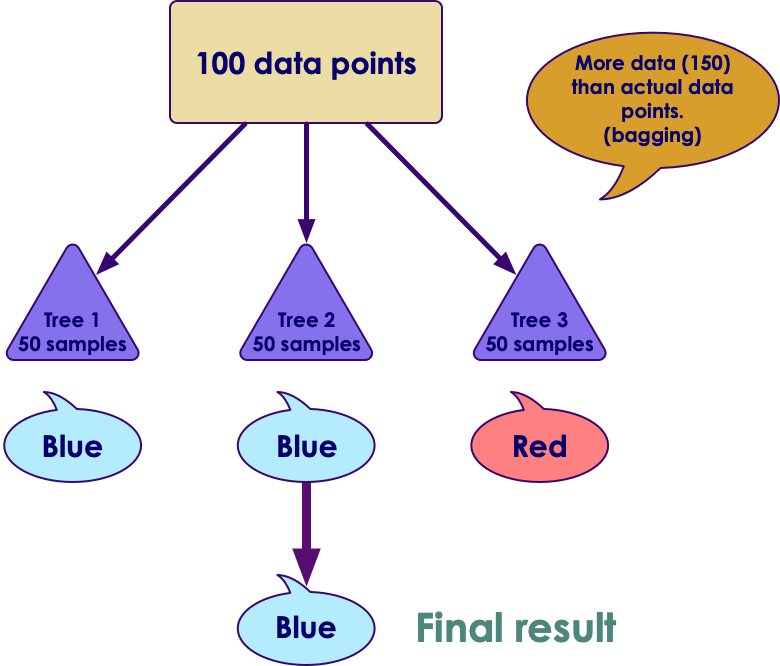

# Ensemble Algorihms in Spark


---

## Lesson Objectives

* Learn Ensemble algorithms in Spark

---

# Random Forests

[../generic/Random-Forest.md](../generic/Random-Forest.md)

---

# Random Forests in Spark


<!-- {"left" : 2.67, "top" : 2.84, "height" : 8.04, "width" : 12.16} -->

---

## Random Forests in Spark

* Classification implementation
    - **pyspark.ml.classification.RandomForestClassifier**    (python)
    - **org.apache.spark.ml.classification.RandomForestClassifier**  (Scala)

* Regression implementation
    - **pyspark.ml.regression.RandomForestClassifier**    (python)
    - **org.apache.spark.ml.regression.RandomForestRegressor** (Scala)

Notes:

---

## Random Forest Classifier

```python
from pyspark.ml.classification import RandomForestClassifer
from pyspark.ml.evaluation import MultiClassClassificationEvaluator

# Load training data
(training, testing) = ...

rf = RandomForestClassifier()
# rf = RandomForestClassifier( numTrees=100)

# Fit the model
model= rf.fit(training)

## predictions
predictions = model.transform(test)

## evaluate
evaluator = MulticlassClassificationEvaluator(metricName="accuracy")
accuracy = evaluator.evaluate(predictions)

print("Accuracy = %g " , accuracy)
```
<!-- {"left" : 0.85, "top" : 2.5, "height" : 3.95, "width" : 14.85} -->

Notes:

---

## Random Forest Regression

```python
from pyspark.ml.regression import RandomForestRegressor
from pyspark.ml.evaluation import RegressionEvaluator

# Load training data
(training, test) = ...

rf = RandomForestRegression(labelColumn='label', featuresCol = 'features')

# Fit the model
model = rf.fit(training)

predictions = model.transform(test)

## Evaluate
evaluator = RegressionEvaluator(metricName="rmse")
rmse = evaluator.evaluate(predictions)

print("RMSE = %g " , rmse)
```
<!-- {"left" : 0.85, "top" : 2.5, "height" : 4.1, "width" : 15.42} -->

---

## RandomForest Parameters

* Most significant parameter is **numTrees**

* Plus all the same parameters as `Decision Trees`
    - These parameters are run on a per-tree basis

<br>

| Parameter   | Description                          | Default Value |
|-----------------|--------------------------------------------|-------------------|
| numtrees        | Max Numbers of trees                       | 20                |
| subSamplingRate | Adjusts Sampling rate of data for boosting | 5                 |

<!-- {"left" : 1.27, "top" : 4.63, "height" : 2.01, "width" : 15.02} -->

Notes:

---

## Lab: Random Forest

<!--{"left" : 12.02, "top" : 1.41, "height" : 6.68, "width" : 5} -->

* **Overview**
    - Implement RF

* **Approximate Time**
    - 30-60 mins

* **Instructions**
     - **RF1: Prosper loan data** (classification)
     - **RF2: Election contribution data** (classification)
     - **RF3: Election contribution data** (regression)

Notes:

---

## Review and Q&A

<!-- {"left" : 8.56, "top" : 1.21, "height" : 1.15, "width" : 1.55} -->
<!-- {"left" : 6.53, "top" : 2.66, "height" : 2.52, "width" : 3.79} -->

* Let's go over what we have covered so far

* Any questions?