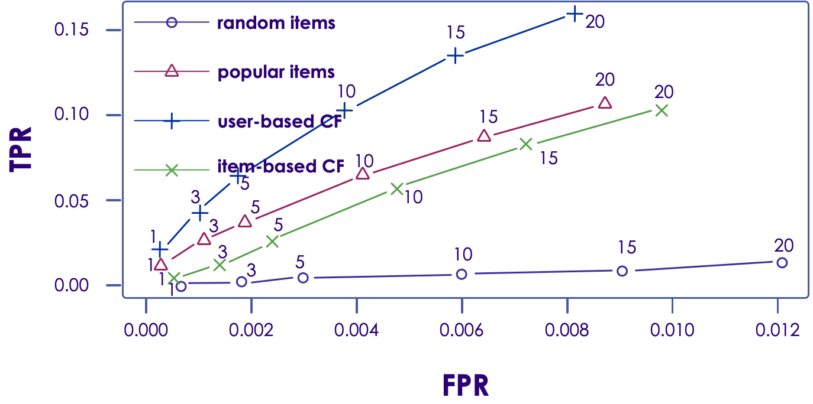

# Recommendations in Spark


---

# Recommendations Intro

[../generic/Recommendations.md](../generic/Recommendations.md)

---

# Collaborative Filtering in Spark

---

## CF in Spark ML

* Spark ML implements ALS - Alternating Minimum Squares Algorithm
  - __org.apache.spark.ml.recommendation.ALS__ (Scala)
  - __pyspark.ml.recommendation.ALS__ (Python)

<br >

| parameter         | Description                                                                                                         | default                       |
|-------------------|---------------------------------------------------------------------------------------------------------------------|-------------------------------|
| numBlocks         | number of blocks the users and items will be partitioned into in order to parallelize computation                   | 10                            |
| rank              | the number of latent factors in the model                                                                           | 10                            |
| maxIter           | maximum number of iterations to run                                                                                 | 10                            |
| implicitPrefs     | specifies whether to use the explicit feedback ALS variant or one adapted for implicit feedback data                | False (use explicit feedback) |
| coldStartStrategy | How to handle missing ratings data for new user / new item <br/>- NaN : Not a Number <br/>- "drop" : drop this data | NaN                           |

<!-- {"left" : 0.94, "top" : 2.82, "height" : 6.48, "width" : 15.62} -->


Notes:

---

## ALS in Spark ML

* **Handling Explicit / Implicit Feedback**
    - Explicit feedback: User explicitly rated an item
    - Implicit feedback
        * User watched a movie  / played a song
        * User shared the movie on social media ..etc
    - Spark ALS can handle implicit feedback, treating values are numbers indicating strength of likeness

* **Cold-start strategy**
    - But during cross-validation testing / training missing-ratings can present issues.  Use "drop" to eliminate missing data from the dataset

Notes:

---

## ALS Code (Python)

* ALS class exists in two forms:

    - Dataframe based API: spark.ml.recommendations
    - RDD-based API: spark.mllib.recommendations (more mature)

```python
import pyspark.ml.recommendation.ALS

als = ALS(maxIter=5, regParam=0.01,
          userCol="userId", itemCol="movieId", ratingCol="rating",
          coldStartStrategy ="drop")

model = als.fit(training)

predictions = model.transform(test)

evaluator = RegressionEvaluator( metricName="rmse",
                labelCol="rating", predictionCol = "prediction")

rmse = evaluator.evaluate(predictions)

```
<!-- {"left" : 0.85, "top" : 3.97, "height" : 4.46, "width" : 12.91} -->


Notes:


---

## Evaluating CF Recommendations (ROC)


<!-- {"left" : 2.67, "top" : 3.01, "height" : 7.7, "width" : 12.15} -->


Notes:

https://en.wikipedia.org/wiki/Receiver_operating_characteristic


---

## Further Reading


 * "[Recommender Systems](https://www.slideshare.net/xamat/recommender-systems-machine-learning-summer-school-2014-cmu
)" - presentation by Xavier Amtriain, Research Director @  Netflix

 * "[Gentle introduction to Recommender systems](https://www.slideshare.net/xamat/recommender-systems-machine-learning-summer-school-2014-cmu
)"

Notes:

* https://www.slideshare.net/xamat/recommender-systems-machine-learning-summer-school-2014-cmu
* https://jessesw.com/Rec-System/

---

## Lab: Recommendations

<!-- {"left" : 6.76, "top" : 0.88, "height" : 4.37, "width" : 3.28} -->

 *  **Overview:**

    - Use CF recommender in Spark ML

 *  **Approximate time:**

    - 30 - 40 mins

 *  **Instructions:**

    - **RECOMMENDATION-1: Movie Lens data**
    - **RECOMMENDATION-2: Scrobler data**


Notes:


---


## Review and Q&A

<!-- {"left" : 8.56, "top" : 1.21, "height" : 1.15, "width" : 1.55} -->
<!-- {"left" : 6.53, "top" : 2.66, "height" : 2.52, "width" : 3.79} -->

* Let's go over what we have covered so far

* Any questions?

---

# Backup Slides

---

## Preparing Data for MLLib


 * MLLib only looks at integer userid and itemid.

     - Assign your data with unique integer userid and itemid.

 * Preferences are expressed as a double (higher is better)

     - What if your preferences are binary (yes/no)?

        * Assign a number, say, 5.0 for yes, and 1.0 for no.

     - What if preferences are just "implied"?

        * User viewed item as 5.0, no data for unviewed item.

 * MLLib Rating: Integer, Integer, Double

     -  **Rating(**userId**,itemId, rating)**

Notes:


---

## MLLib Recommendations Model (ALS)


 * Uses the Recommendations.ALS

 * ALS = Alternating Least Squares algorithm

 * Train Model using number of iterations and rank.

 * Class "Rating", contains a UserId, ItemId, and numeric rating (i.e. 0-5).  

 * Train model using training data:

     -  **`val`**  model  **`=`**   **`ALS`** .train(ratings, rank, numIterations, 0.01)

Notes:

ALS - Alternating Least Squares is an algorithm.


---

## Making a Prediction

* Use prediction method on model (like regression/classification)

    **import org.apache.spark.mllib.recommendation.ALS**

    **import org.apache.spark.mllib.recommendation.Rating**

    **Model.predict (RDDUsersItems)**

     - Input Takes an RDD of user - item pairs as argument (NOT Ratings)

     - Returns RDD of Rating (user, item, double rating)

Notes:
