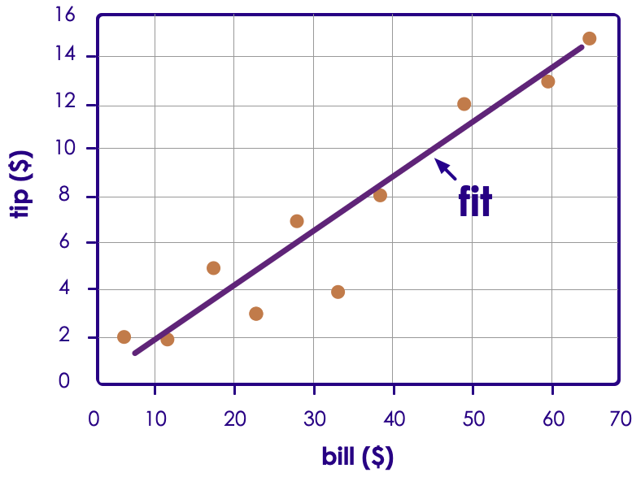
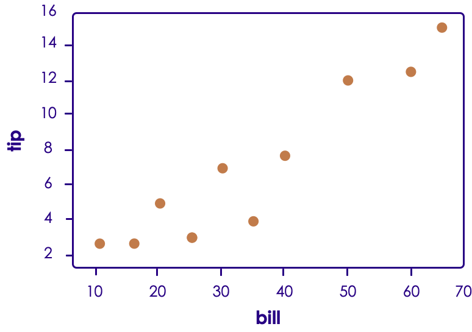
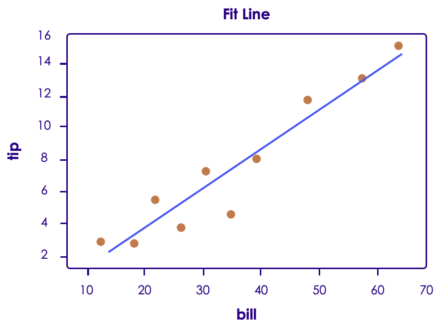
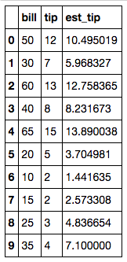

# Regressions in Spark

---

## Regressions Intro

[../generic/Regressions-Intro.md](../generic/Regressions-Intro.md)

---

## Linear Regression

[../generic/Regressions-Linear.md](../generic/Regressions-Linear.md)

---

# Linear Regression in Spark

---

## Regression Algorithms In Spark ML
| Algorithms                       |                                                        | Class / Package                                                 |
|----------------------------------|--------------------------------------------------------|-----------------------------------------------------------------|
| Linear Regression                |                                                        | org.apache.spark.ml.regression. **LinearRegression**            |
| Generalized  Linear Models (GLM) | -  Logistic  Regression   <br /> -  Poisson Regression | org.apache.spark.ml.regression. **GeneralizedLinearRegression** |

<!-- {"left" : 0.25, "top" : 1.62, "height" : 2.46, "width" : 9.75} -->

Notes:


---

## LinearRegression Parameters

| Parameter        | Function                    | Description                                                                                                                                                                                                       | Default Value |
|------------------|-----------------------------|-------------------------------------------------------------------------------------------------------------------------------------------------------------------------------------------------------------------|---------------|
| maxIter          | setMaxIter(Int)             | Max number of iterations                                                                                                                                                                                          | 100           |
| regParam         | setRegParam(Double)         | Regulation parameter                                                                                                                                                                                              | 0.0           |
| elasticNetParam | setElasticNetParam (Double) | ElasticNet mixing parameter.  Range 0 to 1.<br /> - For alpha = 0, the penalty is an L2 penalty<br /> - For alpha = 1, it is an L1 penalty<br /> - For alpha in (0,1), the penalty is a combination of L1 and L2. | 0.0  (L2)     |
| featuresCol      | setFeaturesCol ()           | Which column as input features                                                                                                                                                                                    | "features"    |
| predictionCol    | setPredictionCol ()         | Output prediction column                                                                                                                                                                                          | "prediction"  |


Notes:


---

## Example: Tip Calculation


 * Now our tip data includes total bill amount too!

 * Do you see any correlation?

<!-- {"left" : 1.02, "top" : 2.38, "height" : 4.23, "width" : 8.21} -->


Notes:


---

## Tips vs Bill


 * There is clearly a correlation between bill amount and tip

 * We can fit a line to predict tip

 * This is **linear regression**!

<!-- {"left" : 2.24, "top" : 3.2, "height" : 4.36, "width" : 5.77} -->


Notes:


---

## Spark Linear Regression Code (Scala)

```scala
 import org.apache.spark.ml.regression.LinearRegression  

 // Load training data
 val training = spark.read.....  

 val lr = new LinearRegression()  
    .setMaxIter(10)  
    .setRegParam(0.3)  
    .setElasticNetParam(0.8)    

 // Fit the model
 val lrModel = lr.fit(training)  

 // Print the coefficients and intercept for linear regression
 println(s"Coefficients: ${lrModel.coefficients} Intercept: ${lrModel.intercept}")  

 // Summarize the model over the training set and print out some metrics
 val trainingSummary = lrModel.summary
 println(s"numIterations: ${trainingSummary.totalIterations}")
 println(s"objectiveHistory: [${trainingSummary.objectiveHistory.mkString(",")}]")
 trainingSummary.residuals.show()
 println(s"RMSE: ${trainingSummary.rootMeanSquaredError}")
 println(s"r2: ${trainingSummary.r2}")
```
<!-- {"left" : 0, "top" : 1.15, "height" : 4.85, "width" : 10.25} -->

Notes:

TODO - update for tips


---

## Spark Linear Regression Code (Python)  1/4  - Creating Data Frames

```python
 #  **** 1 ****

import numpy as np
import pandas as pd

tip_data = pd.DataFrame({     
     'bill' : [50.00, 30.00, 60.00, 40.00, 65.00, 20.00, 10.00, 15.00, 25.00, 35.00],
     'tip' : [12.00, 7.00, 13.00, 8.00, 15.00, 5.00, 2.00, 2.00, 3.00, 4.00]    
     })
print(tip_data)  


#  **** 2 ****
spark_tips = spark.createDataFrame(tip_data)
spark_tips.show()
```
<!-- {"left" : 0, "top" : 1.18, "height" : 3.19, "width" : 10.25} -->

<br/>
<br/>

 * **1** importing Numpy and Pandas libraries

 * **2** Constructing a Panda dataframe and converting it into Spark dataframe

Notes:


---

## Spark Linear Regression Code (Python)  2/4 - Plotting Data

```python
 import matplotlib.pyplot as plt
 plt.scatter(tip_data.bill, tip_data.tip)
 plt.ylabel('tip')
 plt.xlabel('bill')
 plt.show()
```
<!-- {"left" : 0, "top" : 1.42, "height" : 1.74, "width" : 7.61} -->

<!-- {"left" : 1.33, "top" : 3.66, "height" : 4.89, "width" : 6.94} -->


Notes:


---

## Spark Linear Regression Code (Python) 3/4 - Create a Model, Fit Training Data

```python
 from pyspark.ml.regression import LinearRegression
 from pyspark.ml.feature import VectorAssembler

 #  **** 3 ****
 assembler = VectorAssembler(inputCols=["bill"], outputCol="features")
 featureVector = assembler.transform(spark_tips)
 featureVector.show()

 #  **** 4 ****
 lr = LinearRegression(maxIter=10, regParam=0.3, elasticNetParam=0.8)
 lrModel = lr.fit(featureVector)

 #  **** 5 ****
 intercept = lrModel.intercept    # This is the intercept  
 slope = lrModel.coefficients[0]  # This is the slope
```
<!-- {"left" : 0, "top" : 1.28, "height" : 3.49, "width" : 10.25} -->

Notes:


---

## Spark Linear Regression Code (Python) 3/4 - Print Model Properties

```python
# Print the coefficients and intercept for linear regression  
print("Coefficients: %s" % str(lrModel.coefficients[0]))
print("Intercept: %s" % str(lrModel.intercept))    

# Summarize the model over the training set and print out some metrics
trainingSummary = lrModel.summary
print("numIterations: %d" % trainingSummary.totalIterations)
print("objectiveHistory: %s" % str(trainingSummary.objectiveHistory))
print("RMSE: %f" % trainingSummary.rootMeanSquaredError)
print("r2: %f" % trainingSummary.r2)
trainingSummary.residuals.show()
```
<!-- {"left" : 0, "top" : 1.15, "height" : 2.62, "width" : 10.25} -->


```text
Coefficients: 0.226334605857
Intercept: -0.8217112049846651
numIterations: 3
objectiveHistory: [0.5000000000000002, 0.4158224893708402, 0.10101250448579287]
RMSE: 1.413302
r2: 0.902517
+--------------------+
|           residuals|
+--------------------+
|  1.5049809121494295|
|  1.0316730292835246|
|  ...               |
| -3.0999999999999996|
+--------------------+

```
<!-- {"left" : 0, "top" : 4.16, "height" : 2.78, "width" : 9.75} -->


Notes:


---

## Evaluating Linear Regression Model

  * Plot
  * R2

Notes:


---

## Evaluating Linear Regression Model - Plot the regression

```python
 # Create a list of values in the best fit line
 abline_values = [slope * i + intercept for i in tip_data.bill]

 # Plot the best fit line over the actual values
 plt.scatter(tip_data.bill, tip_data.tip)
 plt.plot(tip_data.bill, abline_values, 'b')
 plt.ylabel('tip')
 plt.xlabel('bill')
 plt.title("Fit Line")
 plt.show()
```
<!-- {"left" : 0, "top" : 1.24, "height" : 2.65, "width" : 10.25} -->


<!-- {"left" : 2.28, "top" : 4.22, "height" : 4.28, "width" : 5.69} -->


Notes:


---

## Evaluating Linear Regression Model - Calculate Coefficient of Determination (R2)

 * R2 is between 0 and 1.1 is perfect fit!

 * Here our R2 is 0.90 -> pretty good fit!

```python
 # Summarize the model over the training set and print out some metrics
 trainingSummary = lrModel.summary
 print("RMSE: %f" % trainingSummary.rootMeanSquaredError)
 print("r2: %f" % trainingSummary.r2)

# output
# RMSE: 1.413302
# r2: 0.902517
```
<!-- {"left" : 0, "top" : 2.43, "height" : 1.97, "width" : 10.25} -->


Notes:


---


## Evaluating Linear Regression Model - Estimate Tip

<!-- {"left" : 4.13, "top" : 1.23, "height" : 4.09, "width" : 1.99} -->

```python
 a = lrModel.coefficients[0]   # -0.8217112049846651
 b = lrModel.intercept         # 0.226334605857*   

 tip_for_100 = a * 100 + b   
 print(tip_for_100)   # 21.81     

 # add estimated tip to dataframe  
 tip_data['est_tip'] = tip_data.bill * a + b
 tip_data
```

<!-- {"left" : 0, "top" : 5.46, "height" : 2.9, "width" : 9.28} -->


Notes:


---

## Evaluating Linear Regression Model - Estimate Tip

```python
 ## Adding Estimated Tip column to Spark dataframe
 # This is a bit tricky. We need to use the sql expr function to make this work.
 # The formula: (bill * a) + b

 from pyspark.sql.functions import expr  
 formula = "(bill * " + str(a) + ") + " + str(b)
 print(formula)  

 spark_tips_with_est = spark_tips.withColumn("est_tip", expr(formula))
 spark_tips_with_est.show()
```
<!-- {"left" : 0, "top" : 1.24, "height" : 2.21, "width" : 9.75} -->

```text
(bill * 0.226334605857) + -0.8217112049846651

+----+----+------------------+
|bill| tip|           est_tip|
+----+----+------------------+
|50.0|12.0|10.495019087865336|
|30.0| 7.0| 5.968326970725334|
|60.0|13.0|12.758365146435334|
|40.0| 8.0| 8.231673029295335|
|65.0|15.0|13.890038175720335|
|20.0| 5.0|3.7049809121553343|
|10.0| 2.0|1.4416348535853347|
|15.0| 2.0| 2.573307882870335|
|25.0| 3.0| 4.836653941440335|
|35.0| 4.0|7.1000000000103345|
+----+----+------------------+

```
<!-- {"left" : 0, "top" : 3.66, "height" : 4.94, "width" : 8.28} -->


Notes:

---


# Multiple Linear Regression

[../generic/Regressions-Linear-Multi.md](../generic/Regressions-Linear-Multi.md)

---

# Multiple Linear Regression in Spark

---

## Task: Calculate House Prices

| Sale Price $ | Bedrooms | Bathrooms | Sqft_Living | Sqft_Lot |
|--------------|----------|-----------|-------------|----------|
| 280,000      | 6        | 3         | 2,400       | 9,373    |
| 1,000,000    | 4        | 3.75      | 3,764       | 20,156   |
| 745,000      | 4        | 1.75      | 2.060       | 26,036   |
| 425,000      | 5        | 3.75      | 3,200       | 8,618    |
| 240,000      | 4        | 1.75      | 1,720       | 8,620    |
| 327,000      | 3        | 1.5       | 1,750       | 34,465   |
| 347,000      | 4        | 1.75      | 1,860       | 14,650   |

<!-- {"left" : 0.25, "top" : 1.2, "height" : 4, "width" : 9.75} -->

  * Multiple factors decide house prices

  * It is not a simple  Y ~ X any more

  * We will use  **multiple linear regression**

Notes:


---


## Multiple Linear Regression in Spark


  * __spark.ml.LinearRegression__ supports MLR out of the box

  * When creating a featureVector, we will have multiple columns are input

     - ["Bedrooms", "Bathrooms", "SqFtTotLiving", "SqFtLot"]

     - Order doesn't matter

Notes:


---

## Multiple Linear Regression in Spark - Code (Python)

```python
import numpy as np
import pandas as pd
import matplotlib.pyplot as plt
from pyspark.ml.regression import LinearRegression
from pyspark.ml.feature import VectorAssembler

housePrices = spark.read.csv("/data/house-prices/house-sales-full.csv", header=True, inferSchema=True)
housePrices.show()
## too many attributes / columns

## select a few attributes
housePrices_compact = housePrices_compact.show()
housePrices.select("SalePrice", "Bedrooms", "Bathrooms", "SqFtTotLiving", "SqFtLot")

housePrices_compact.count() ## 27,063 observations

```
<!-- {"left" : 0, "top" : 1.35, "height" : 2.68, "width" : 10.25} -->


Notes:


---

## Multiple Linear Regression in Spark - Code (Python)


```text
Row count = 27063


+---------+--------+---------+-------------+-------+
|SalePrice|Bedrooms|Bathrooms|SqFtTotLiving|SqFtLot|
+---------+--------+---------+-------------+-------+
|   280000|       6|      3.0|         2400|   9373|
|  1000000|       4|     3.75|         3764|  20156|
|   745000|       4|     1.75|         2060|  26036|
|   425000|       5|     3.75|         3200|   8618|
|   240000|       4|     1.75|         1720|   8620|
|   349900|       2|      1.5|          930|   1012|
|   327500|       3|      1.5|         1750|  34465|
|   347000|       4|     1.75|         1860|  14659|
|   220400|       2|      1.0|          990|   5324|
|   437500|       4|      2.0|         1980|  10585|
|   150000|       2|      1.0|          840|  12750|
|   300000|       3|      1.0|         1750|   5200|
+---------+--------+---------+-------------+-------+

```
<!-- {"left" : 0, "top" : 1.25, "height" : 5.82, "width" : 9.44} -->

Notes:


---

## Multiple Linear Regression in Spark - Code (Python)

```python
assembler = VectorAssembler(inputCols=["Bedrooms", "Bathrooms",
                    "SqFtTotLiving", "SqFtLot"],
                    outputCol="features")

featureVector = assembler.transform(housePrices_compact)
featureVector = featureVector.withColumnRenamed("SalePrice", "label")
# display 10 rows and all column data without truncating
featureVector.show(10,False)

```
<!-- {"left" : 0, "top" : 1.33, "height" : 2.18, "width" : 10.25} -->


```text
+-------+--------+---------+-------------+-------+-------------------------+
|label  |Bedrooms|Bathrooms|SqFtTotLiving|SqFtLot|features                 |
+-------+--------+---------+-------------+-------+-------------------------+
|280000 |6       |3.0      |2400         |9373   |[6.0,3.0,2400.0,9373.0]  |
|1000000|4       |3.75     |3764         |20156  |[4.0,3.75,3764.0,20156.0]|
|745000 |4       |1.75     |2060         |26036  |[4.0,1.75,2060.0,26036.0]|
|425000 |5       |3.75     |3200         |8618   |[5.0,3.75,3200.0,8618.0] |
|240000 |4       |1.75     |1720         |8620   |[4.0,1.75,1720.0,8620.0] |
|349900 |2       |1.5      |930          |1012   |[2.0,1.5,930.0,1012.0]   |
|327500 |3       |1.5      |1750         |34465  |[3.0,1.5,1750.0,34465.0] |
|347000 |4       |1.75     |1860         |14659  |[4.0,1.75,1860.0,14659.0]|
|220400 |2       |1.0      |990          |5324   |[2.0,1.0,990.0,5324.0]   |
|437500 |4       |2.0      |1980         |10585  |[4.0,2.0,1980.0,10585.0] |
+-------+--------+---------+-------------+-------+-------------------------+
only showing top 10 rows

```
<!-- {"left" : 0, "top" : 4.25, "height" : 3.37, "width" : 9.75} -->

Notes:


---

## Multiple Linear Regression in Spark - Code (Python)


```python
lr = LinearRegression(maxIter=10, regParam=0.3, elasticNetParam=0.8)
lrModel = lr.fit(featureVector)
print("Coefficents:" + str(lrModel.coefficients))
print("Intercept: " + str(lrModel.intercept))
print("RMSE: %f" % lrModel.summary.rootMeanSquaredError)
print("r2: %f" % lrModel.summary.r2)
print("numIterations: %d" % lrModel.summary.totalIterations)
print("objectiveHistory: %s" % str(lrModel.summary.objectiveHistory))
```
<!-- {"left" : 0, "top" : 1, "height" : 2.18, "width" : 10.25} -->

```text
Coefficents:[-69405.457812,25714.1481078,274.458312769,-0.0]
Intercept: 105562.58117252712

RMSE: 246442.225880
r2: 0.483214

numIterations: 11
objectiveHistory: [0.5000000000000002, 0.4565457266170319, 0.3376986997173243,
0.30010335871879656, 0.2852977093323423, 0.27654782886180707, 0.2701349132960898,
0.26332624819112604, 0.26138384191458414, 0.25967594157902535, 0.25839392000729794]

```
<!-- {"left" : 0, "top" : 3.3, "height" : 2.13, "width" : 9.75} -->

<br/>
<br/>

 *  **Question for the class:**

    - Is this model a good fit? Explain!

Notes:


---

### Multiple Linear Regression in Spark - Code (Python) - Let's Do Some Predictions


```python
new_data = pd.DataFrame({'Bedrooms' : [5,3,2],
                         'Bathrooms' : [3,2,1.5],
                         'SqFtTotLiving' : [4400, 1800, 1550],
                         'SqFtLot' : [10000, 5000, 4000]
                        })
new_data_spark = spark.createDataFrame(new_data)
new_featureVector = assembler.transform(new_data_spark)
new_featureVector.show(10,False)

predicted_prices = lrModel.transform(new_featureVector)
predicted_prices.show(10, False)
```
<!-- {"left" : 0, "top" : 1.07, "height" : 3.2, "width" : 10.25} -->

```text
# output: new_feature_vector
+---------+--------+-------+-------------+------------------------+
|Bathrooms|Bedrooms|SqFtLot|SqFtTotLiving|features                |
+---------+--------+-------+-------------+------------------------+
|3.0      |5       |10000  |4400         |[5.0,3.0,4400.0,10000.0]|
|2.0      |3       |5000   |1800         |[3.0,2.0,1800.0,5000.0] |
|1.5      |2       |4000   |1550         |[2.0,1.5,1550.0,4000.0] |
+---------+--------+-------+-------------+------------------------+

```
<!-- {"left" : 0, "top" : 4.44, "height" : 2.26, "width" : 10.25} -->

```text
# output: predicted_prices
+---------+--------+-------+-------------+------------------------+------------------+
|Bathrooms|Bedrooms|SqFtLot|SqFtTotLiving|features                |prediction        |
+---------+--------+-------+-------------+------------------------+------------------+
|3.0      |5       |10000  |4400         |[5.0,3.0,4400.0,10000.0]|1043294.3126218329|
|2.0      |3       |5000   |1800         |[3.0,2.0,1800.0,5000.0] |442799.46693731495|
|1.5      |2       |4000   |1550         |[2.0,1.5,1550.0,4000.0] |430733.2725030012 |
+---------+--------+-------+-------------+------------------------+------------------+

```
<!-- {"left" : 0, "top" : 6.83, "height" : 1.77, "width" : 10.25} -->

Notes:


---


## Regularization

[../generic/ML-Concepts-Regularization.md](../generic/ML-Concepts-Regularization.md)

---
## Review and Q&A

<!-- {"left" : 7.66, "top" : 1.1, "height" : 1.65, "width" : 2.23} -->


- Let's go over what we have covered so far

- Any questions?

<!-- {"left" : 2.18, "top" : 3.77, "height" : 3.93, "width" : 5.9} -->

