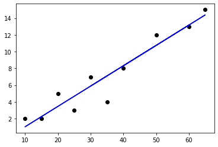
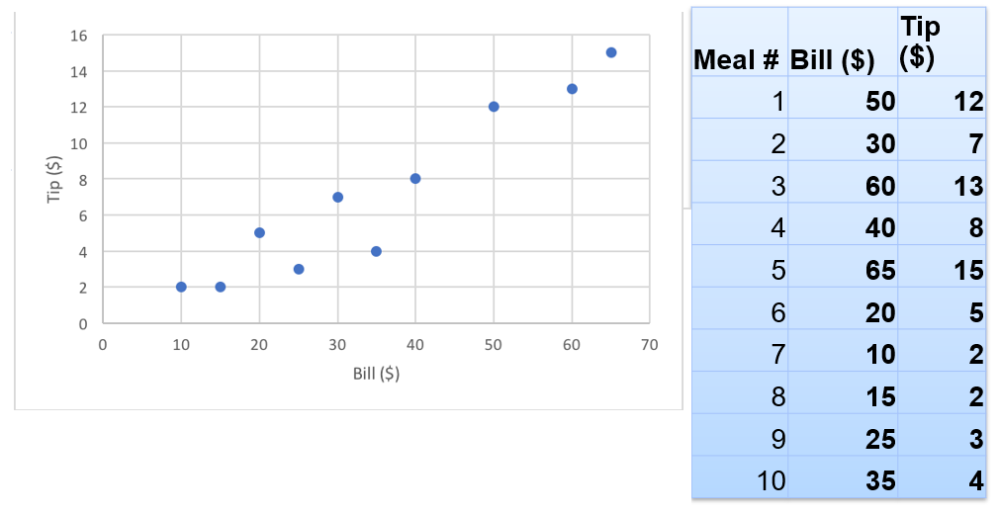
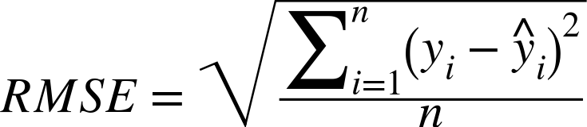
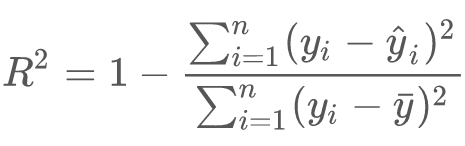
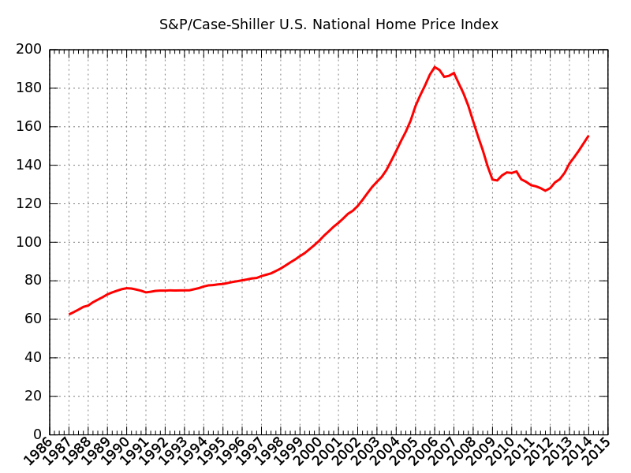

# Regressions in Spark


<!-- {"left" : 2.39, "top" : 2.61, "height" : 8.48, "width" : 12.71} -->

---

# Regressions Intro

[../generic/Regressions-Intro.md](../generic/Regressions-Intro.md)

---

# Linear Regression in Spark

---

## Regression Algorithms In Spark ML

| Algorithms                       |                                                        | Class / Package                                                 |
|----------------------------------|--------------------------------------------------------|-----------------------------------------------------------------|
| Linear Regression                |                                                        | org.apache.spark.ml.regression. **LinearRegression**            |
| Generalized  Linear Models (GLM) | -  Logistic  Regression   <br /> -  Poisson Regression | org.apache.spark.ml.regression. **GeneralizedLinearRegression** |

<!-- {"left" : 1.1, "top" : 3.45, "height" : 1, "width" : 15.3} -->

Notes:

---

## LinearRegression Parameters

| Parameter        | Function                    | Description                                                                                                                                                                                                       | Default Value |
|------------------|-----------------------------|-------------------------------------------------------------------------------------------------------------------------------------------------------------------------------------------------------------------|---------------|
| maxIter          | setMaxIter(Int)             | Max number of iterations                                                                                                                                                                                          | 100           |
| regParam         | setRegParam(Double)         | Regulation parameter                                                                                                                                                                                              | 0.0           |
| elasticNetParam | setElasticNetParam (Double) | ElasticNet mixing parameter.  Range 0 to 1.<br /> - For alpha = 0, the penalty is an L2 penalty<br /> - For alpha = 1, it is an L1 penalty<br /> - For alpha in (0,1), the penalty is a combination of L1 and L2. | 0.0  (L2)     |
| featuresCol      | setFeaturesCol ()           | Which column as input features                                                                                                                                                                                    | "features"    |
| predictionCol    | setPredictionCol ()         | Output prediction column                                                                                                                                                                                          | "prediction"  |

<!-- {"left" : 0.41, "top" : 2.39, "height" : 1, "width" : 16.73, "columnwidth" : [2.46, 3.86, 8.19, 2.22]} -->

Notes:

---

## Example: Tip Calculation

* Now our tip data includes total bill amount too!

* Do you see any correlation?

<!-- {"left" : 2.97, "top" : 3.73, "height" : 5.96, "width" : 11.57} -->

Notes:

---

## Linear Regression in Spark (Scala)

```scala
import org.apache.spark.ml.regression.LinearRegression  

// Load training data
val training = spark.read.....  

val lr = new LinearRegression()  
.setMaxIter(10)  
.setRegParam(0.3)  
.setElasticNetParam(0.8)    

// Fit the model
val lrModel = lr.fit(training)  

// Print the coefficients and intercept for linear regression
println(s"Coefficients: ${lrModel.coefficients} Intercept: ${lrModel.intercept}")  

// Summarize the model over the training set and print out some metrics
val trainingSummary = lrModel.summary
println(s"numIterations: ${trainingSummary.totalIterations}")
println(s"objectiveHistory: [${trainingSummary.objectiveHistory.mkString(",")}]")
trainingSummary.residuals.show()
println(s"RMSE: ${trainingSummary.rootMeanSquaredError}")
println(s"r2: ${trainingSummary.r2}")
```
<!-- {"left" : 0.85, "top" : 2.5, "height" : 6.67, "width" : 14.09} -->

Notes:

---

## Linear Regression in Spark (Python)

```python
import pandas as pd
from pyspark.ml.regression import LinearRegression
from pyspark.ml.feature import VectorAssembler

## Create a pandas df
tip_data = pd.DataFrame({     
     'bill' : [50.00, 30.00, 60.00, 40.00, 65.00, 20.00, 10.00, 15.00, 25.00, 35.00],
     'tip' : [12.00, 7.00, 13.00, 8.00, 15.00, 5.00, 2.00, 2.00, 3.00, 4.00]    
     })

## Convert it to spark dataframe
spark_tips = spark.createDataFrame(tip_data)

## Create a feature vector
assembler = VectorAssembler(inputCols=["bill"], outputCol="features")
featureVector = assembler.transform(spark_tips)

##  Run Linear regression
lr = LinearRegression()
lrModel = lr.fit(featureVector)

## Print out coefficients!
intercept = lrModel.intercept    # This is the intercept  
slope = lrModel.coefficients[0]  # This is the slope

## Print out model metrics
print("RMSE: %f" % lrModel.summary.rootMeanSquaredError)  # RMSE: 1.413302
print("r2: %f" % lrModel.Summary.r2) # r2: 0.902517
```
<!-- {"left" : 0.85, "top" : 2.74, "height" : 3.61, "width" : 14.06} -->

---

## Lab: Linear Regressions

<!-- {"left" : 12.68, "top" : 1.89, "height" : 5.68, "width" : 4.27} -->

* **Overview:**
    - Practice Linear Regressions

* **Approximate Time:**
    - 30 mins

* **Instructions:**
     - Instructor: Please demo this lab
     - LR-1: Bill and Tips data

Notes:

---

# Multiple Linear Regression in Spark

---

## Predict House Prices

| Sale Price   | Bedrooms | Bathrooms | Sqft_Living | Sqft_Lot |
|--------------|----------|-----------|-------------|----------|
| 280,000      | 6        | 3         | 2,400       | 9,373    |
| 1,000,000    | 4        | 3.75      | 3,764       | 20,156   |
| 745,000      | 4        | 1.75      | 2.060       | 26,036   |
| 425,000      | 5        | 3.75      | 3,200       | 8,618    |
| 240,000      | 4        | 1.75      | 1,720       | 8,620    |
| 327,000      | 3        | 1.5       | 1,750       | 34,465   |
| 347,000      | 4        | 1.75      | 1,860       | 14,650   |

<!-- {"left" : 1.17, "top" : 2.5, "height" : 4.01, "width" : 15.15} -->

* Inputs: `Bedrooms, Bathrooms, Sqft_Living, Sqft_Lot`

* What we are predicting : `Sale_Price`

<!-- {"left" : 4.08, "top" : 2, "height" : 0.64, "width" : 9.34} -->

Notes:

---

## Multiple Linear Regression in Spark

```python
from pyspark.ml.feature import VectorAssembler

house_prices = spark.read.csv("house-sales.csv", header=True, inferSchema=True)
house_prices.count() ## 27,063 observations

# create feature vector with a few columns
assembler = VectorAssembler(inputCols=["Bedrooms", "Bathrooms", "SqFtTotLiving", "SqFtLot"],
                    outputCol="features")
feature_vector = assembler.transform(house_prices)
feature_vector = feature_vector.withColumnRenamed("SalePrice", "label")
feature_vector.show();
```
<!-- {"left" : 0.85, "top" : 2.5, "height" : 4.17, "width" : 15.95} -->

```text
# house-sales.csv

| Sale Price $ | Bedrooms | Bathrooms | Sqft_Living | Sqft_Lot |
|--------------|----------|-----------|-------------|----------|
| 280,000      | 6        | 3         | 2,400       | 9,373    |
| 1,000,000    | 4        | 3.75      | 3,764       | 20,156   |
| 745,000      | 4        | 1.75      | 2.06        | 26,036   |
```

```text
# feature vector

+-------+--------+---------+-------------+-------+-------------------------+
|label  |Bedrooms|Bathrooms|SqFtTotLiving|SqFtLot|features                 |
+-------+--------+---------+-------------+-------+-------------------------+
|280000 |6       |3.0      |2400         |9373   |[6.0,3.0,2400.0,9373.0]  |
|1000000|4       |3.75     |3764         |20156  |[4.0,3.75,3764.0,20156.0]|
|745000 |4       |1.75     |2060         |26036  |[4.0,1.75,2060.0,26036.0]|
|425000 |5       |3.75     |3200         |8618   |[5.0,3.75,3200.0,8618.0] |
|240000 |4       |1.75     |1720         |8620   |[4.0,1.75,1720.0,8620.0] |
+-------+--------+---------+-------------+-------+-------------------------+
```

Notes:

---

## Multiple Linear Regression in Spark

```python
from pyspark.ml.regression import LinearRegression

# split data into train/test
(train_data, test_data) = feature_vector.randomSplit([0.8, 0.2], seed=1)

lr = LinearRegression()

lr_model = lr.fit(train_data)   # training

print("Coefficents:" + str(lrModel.coefficients))
print("Intercept: " + str(lrModel.intercept))
```
<!-- {"left" : 0.85, "top" : 1.76, "height" : 2.53, "width" : 11.89} -->

```text
Coefficents:[-69405.457812,25714.1481078,274.458312769,-0.0]
Intercept: 105562.58117252712
```
<!-- {"left" : 0.85, "top" : 4.35, "height" : 3.05, "width" : 13.96} -->

<br/>

Notes:

---

## Evaluating the Regression Model

<!-- {"left" : 2.65, "top" : 6.93, "height" : 1.1, "width" : 5.04} -->

<!-- {"left" : 9.27, "top" : 6.59, "height" : 1.75, "width" : 5.58} -->

* We will use the following metrics

* **Root Mean Squared Error (RMSE)**
    - Average error the model makes per prediction

* **Coefficient of Determination (R<sup>2</sup>)**
    * R<sup>2</sup> ranges from 0 to 1.0
    * Measures how well the model fits the data
    * 1.0 is a perfet fit

```python
print("RMSE: %f" % lrModel.summary.rootMeanSquaredError)
print("r2: %f" % lrModel.summary.r2)
```

```text
RMSE: 246442.225880
r2: 0.483214
```

* **Question for the class:**
    - Is this model a good fit? Explain!

Notes:

---

### Let's Do Some Predictions

```python
new_data = pd.DataFrame({'Bedrooms' : [5,3,2],
                         'Bathrooms' : [3,2,1.5],
                         'SqFtTotLiving' : [4400, 1800, 1550],
                         'SqFtLot' : [10000, 5000, 4000]
                        })
new_data_spark = spark.createDataFrame(new_data)
new_featureVector = assembler.transform(new_data_spark)
new_featureVector.show(10,False)

predicted_prices = lrModel.transform(new_featureVector)
predicted_prices.show(10, False)
```
<!-- {"left" : 0.85, "top" : 2.13, "height" : 3.89, "width" : 12.48} -->

```text
# output: new_feature_vector
+---------+--------+-------+-------------+------------------------+
|Bathrooms|Bedrooms|SqFtLot|SqFtTotLiving|features                |
+---------+--------+-------+-------------+------------------------+
|3.0      |5       |10000  |4400         |[5.0,3.0,4400.0,10000.0]|
|2.0      |3       |5000   |1800         |[3.0,2.0,1800.0,5000.0] |
|1.5      |2       |4000   |1550         |[2.0,1.5,1550.0,4000.0] |
+---------+--------+-------+-------------+------------------------+

```
<!-- {"left" : 0.85, "top" : 6.23, "height" : 2.75, "width" : 12.48} -->

```text
# output: predicted_prices
+---------+--------+-------+-------------+------------------------+------------------+
|Bathrooms|Bedrooms|SqFtLot|SqFtTotLiving|features                |prediction        |
+---------+--------+-------+-------------+------------------------+------------------+
|3.0      |5       |10000  |4400         |[5.0,3.0,4400.0,10000.0]|1043294.3126218329|
|2.0      |3       |5000   |1800         |[3.0,2.0,1800.0,5000.0] |442799.46693731495|
|1.5      |2       |4000   |1550         |[2.0,1.5,1550.0,4000.0] |430733.2725030012 |
+---------+--------+-------+-------------+------------------------+------------------+

```
<!-- {"left" : 0.85, "top" : 9.14, "height" : 2.15, "width" : 12.48} -->

Notes:

---

## Class Discussion: Why is the Accuracy Low?

* **R<sup>2</sup> is 0.4835** - not a great fit

* **Question for class:** Why is R<sup>2</sup>  not close to 1?  (as in why is it not a great fit?)

    - Can you guys come up with some reasons

    - Hint: Look at Sale date in the dataset?  Think about what happened in that time frame

* Answers are in next slide

Notes:

---

## Why is the Accuracy Low?

<!-- {"left" : 4.06, "top" : 2.22, "height" : 0.64, "width" : 9.38} -->

* May be we are not using enough features / inputs.
    - The original dataset has features like 'Year Built' ,  'Traffic Noise' ..etc.

* Not enough data?

* Outliers? (remember the house with 33 bedrooms?)

* Data is skewed?
    - The sales happen the in the span of year 2006 and 2014.
    - We went through a crash in 2008
    - So the we probably have inconsistent data

* Wrong algorithm?

Notes:

---

## Adding More Variables

* Let's add a column called __LandVal__

* This gives us __R<sup>2</sup> = 76%__  (yay!)

```python
from pyspark.ml.feature import VectorAssembler
from pyspark.ml.regression import LinearRegression

house_prices = spark.read.csv("house-sales.csv", header=True, inferSchema=True)
house_prices.count() ## 27,063 observations

# Adding 'LandVal' 
assembler = VectorAssembler(inputCols=["Bedrooms", "Bathrooms", "SqFtTotLiving", "SqFtLot", "LandVal"],
                            outputCol="features")
feature_vector = assembler.transform(house_prices)
feature_vector = feature_vector.withColumnRenamed("SalePrice", "label")

# split data into train/test
(train_data, test_data) = feature_vector.randomSplit([0.8, 0.2], seed=1)

lr = LinearRegression()

lr_model = lr.fit(train_data)   # training

## Print out model metrics
print("r2: %f" % lrModel.Summary.r2) # r2: 0.78
```

<!-- {"left" : 0.85, "top" : 4.09, "height" : 6.37, "width" : 13.44} -->

---

## Deciding Important Variables

<!-- {"left" : 4.06, "top" : 2.22, "height" : 0.64, "width" : 9.38} -->

* In Multiple Linear Regressions many variables/predictors determine the value of response

* How can we know which ones are important?

* For two predictors `X1` & `X2` --> p = 2 --> 2<sup>2</sup> = 4

* For 10 variables, p = 10 --> 2<sup>10</sup> --> 1024 combinations

* For 20 variables, p = 20 --> 2<sup>20</sup> --> 1,048,576 (1 million+) combinations

Notes:

---

## Deciding Important Variables

* Some algorithms to decide important variables quickly
    - Mallow's Cp
    - Akaike Information Criterion (AIC)
    - Bayesian Information Criterion  (BIC)
    - Stepwise Regression

* Also Lasso Regularization can be used for variable selection as well (more on this later)

* Also **`Decision Tree`** and **`Random Forest`** algorithms can determine feature importance

* Reference : See "An introduction to Statistical Learning" – Chapter 3

Notes:

---

## Linear Regression: Strengths, Weaknesses, and Parameters

* **Strengths**
    - Relatively simple to understand
    - Computationally simple, very fast learners
    - Very scalable to large data sets

* **Weaknesses**
    - Will perform poorly if the inputs are not aligned along linear boundary
    - Can under-fit data

* **Parameters**
    - Use regularization to minimize overfitting
    - Lasso regularization can also do variable selection

Notes:

---

## Lab: Multiple Linear Regression

<!-- {"left" : 12.47, "top" : 1.89, "height" : 5.97, "width" : 4.48} -->

* **Overview:**
    - Practice Multiple Linear Regressions

* **Approximate Time:**
    - 30 mins

* **Instructions:**
    - **LR-2: House prices**

Notes:

---

## Bonus Lab: AIC

<!-- {"left" : 12.47, "top" : 1.89, "height" : 5.7, "width" : 4.28} -->

* **Overview:**
    - Automatic feature selection using AIC

* **Approximate Time:**
    - 30 mins

* **Instructions:**
    - **BONUS Lab: LR-3: AIC**

Notes:

---

# Regularization

[../generic/ML-Concepts-Regularization.md](../generic/ML-Concepts-Regularization.md)

---

## Review and Q&A

<!-- {"left" : 13.28, "top" : 1.89, "height" : 2.71, "width" : 3.67} -->

- Let's go over what we have covered so far

- Any questions?

<!-- {"left" : 4.49, "top" : 4.71, "height" : 5.67, "width" : 8.51} -->
