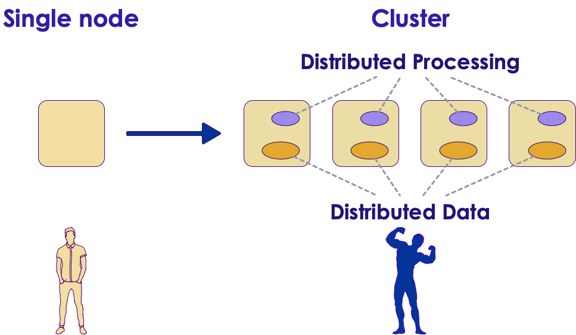
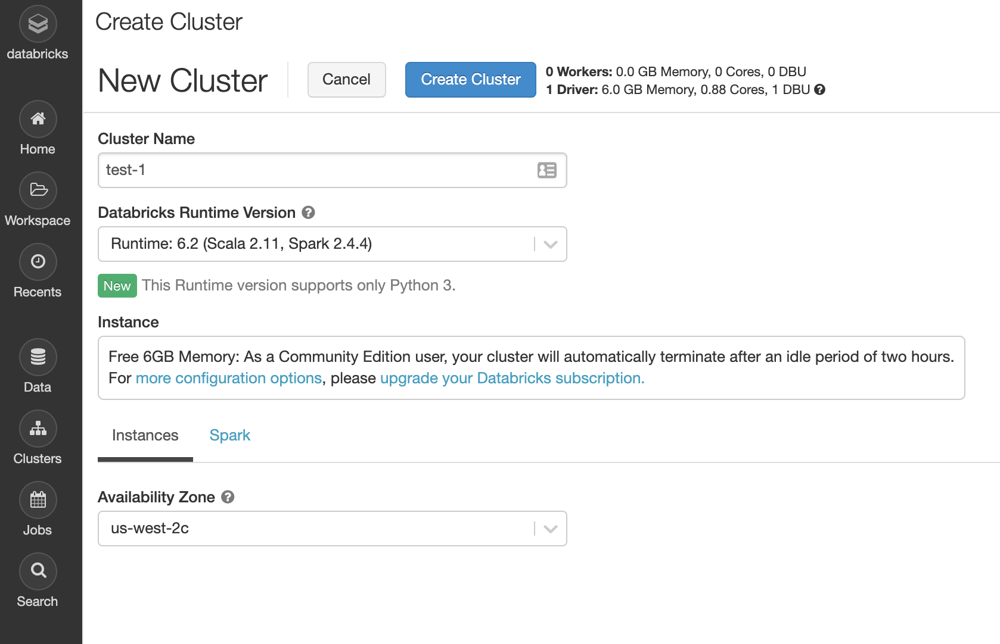
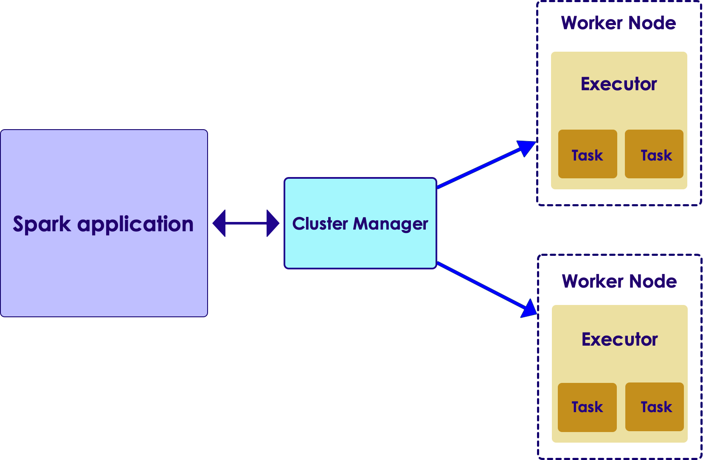
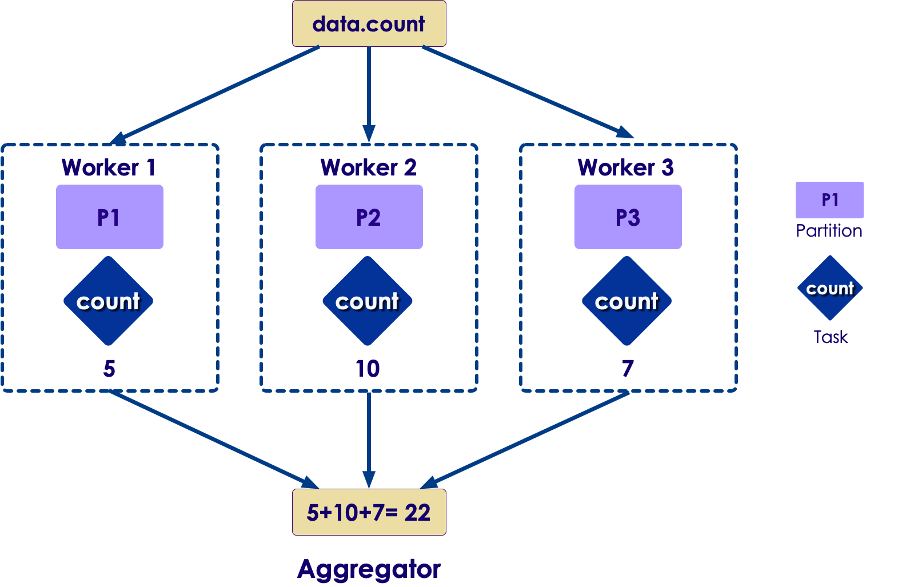
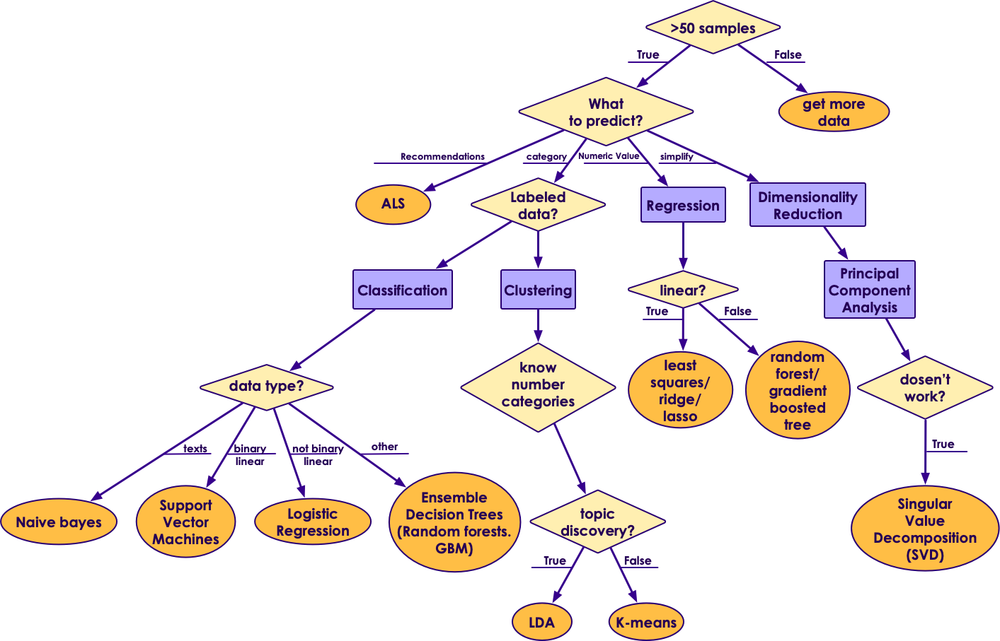
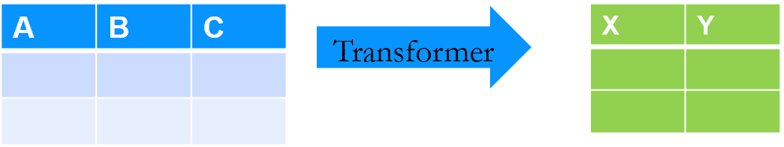

# Spark Machine Learning
---


## Lesson Objectives


* Understand Spark ML library


Notes:

---
## Machine Learning @ Scale

* Traditionally  ML has been performed on small set of data, usually on a single machine

* As the data volume started going up, we needed scale

* And distributed systems like Hadoop/Spark offered a great platform to build scalable ML

<!-- {"left" : 0.58, "top" : 1.83, "height" : 5.41, "width" : 9.08} -->

---

# Quick Spark Primer

---

## Spark Intro

* **To Instructor**:  
Skip this section, if already covered earlier

---

## Spark


<!-- {"left" : 8.11, "top" : 1.11, "height" : 1.01, "width" : 1.91} -->


* [Spark](https://spark.apache.org) is an **open Source distributed computing engine**
    - Very fast: On-disk ops are **10x** faster than MR
    - In-memory ops **100x** faster than MR

* General purpose: MR, SQL, streaming, machine learning, analytics

* Hadoop compatible: Runs over Hadoop, Mesos, Yarn, or standalone

* Plays nicely with Big Data ecosystem (S3, Cassandra, HBase)

* Very easy to use API

* _"Spark is the First Big Data platform to integrate batch, streaming and interactive computations in a unified framework." - stratio.com_

---

## Why is Spark Popular?

* Ease of use
    - Easy to get up and running
    - Develop on laptop, deploy on cluster

* Multiple language support
    - Java, Scala, Python and R
    - Developers (Java/Scala),   Data Scientists (Python, R)

* High performant

* Plays nice with BigData eco system

* Out of the box functionality
    - Modern functional programming constructs
    - Machine Learning / Streaming / Graph processing


Notes:
---

## Spark Components

<!-- {"left" : 0.58, "top" : 1.83, "height" : 5.41, "width" : 9.08} -->


Notes:

---
## Spark Runtimes

* On-Premise
  - Spark is part of most modern Hadoop distributions
  - Spark can also be downloaded and installed as a standalone system

* Hosted solutions
  - Databricks cloud - hosted Spark platform
  - Cloud vendors: Amazon, Azure, Google

<br clear="all" />

<!-- {"left" : 0.32, "top" : 5.52, "height" : 0.37, "width" : 2.19} -->
 &nbsp;  &nbsp;<!-- {"left" : 3, "top" : 5.35, "height" : 0.71, "width" : 2.17} -->
 &nbsp;  &nbsp;<!-- {"left" : 5.56, "top" : 5.38, "height" : 0.63, "width" : 1.68} -->
 &nbsp;  &nbsp;<!-- {"left" : 7.63, "top" : 5.35, "height" : 0.71, "width" : 2.46} -->

---

## Databricks Cloud

<!-- {"left" : 5.58, "top" : 1.26, "height" : 2.8, "width" : 4.34} -->

* A hosted platform of Spark

* Zero maintenance

* Auto scale  based on work loads

* Community edition is free
  - A single node with 6GB memory
  - Notebook environment

* https://community.cloud.databricks.com/

---

## Spark in the Cloud

* Spark is pretty well supported on all major cloud platforms

* Basic idea:
    - Upload data into Cloud storage
    - Spin up on-demand Spark cluster to process your data
    - Shutdown when done
    - Pay for use of compute and storage

* Amazon offers **Elastic Map Reduce (EMR)** that includes Spark

* Google has **DataProc** that provisions Spark clusters

* Azure has **HDInsight*** that includes Spark

<br clear="all" />

<!-- {"left" : 3, "top" : 5.35, "height" : 0.71, "width" : 2.17} -->
 &nbsp;  &nbsp;<!-- {"left" : 5.56, "top" : 5.38, "height" : 0.63, "width" : 1.68} -->
 &nbsp;  &nbsp;<!-- {"left" : 7.63, "top" : 5.35, "height" : 0.71, "width" : 2.46} -->

---

## On Prem Deployment: System Requirements

* Operating system
  - Development: Windows, Mac, Linux
  - Deployment: Linux
* Languages:
    - JDK 8
    - Scala 2.11, 2.12
    - Python 3
* Hardware

| Resource | Development                       | Production                                                        |
|----------|-----------------------------------|-------------------------------------------------------------------|
| CPU      | 2+ core                           | 12+ core                                                          |
| Memory   | 4+ G                              | 256+ G                                                            |
| Disk     | - Single spindle <br/> - Few gigs | - Multiple spindles <br /> - Several Terabytes per node <br />  |

---

## Spark is a Distributed Engine

* Spark distributes the work across many machines to achieve impressive scaling

* Spark has been demonstrated to scale to thousands of nodes!

* Let's look at how Spark scales
    - on Hadoop
    - in the Cloud

---

## Scaling on Hadoop (On Premise)

* Hadoop achieves scale by **co-locating** data and compute
* So applications running on Hadoop cluster, mostly process local data (aka **data locality**)
* Pros:
    - Works well on on-prem architecture (1G-10G networks)
    - Very fast processing, because of data locality
* Cons:
    - The cluster size is fixed; very hard to scale up/down dynamically based on demand

<!-- TODO shiva -->
<!-- {"left" : 6.76, "top" : 0.88, "height" : 4.37, "width" : 3.28} -->
<!-- {"left" : 6.76, "top" : 0.88, "height" : 4.37, "width" : 3.28} -->

---

## Spark Scaling on the Cloud

<!-- TODO shiva -->
  <!-- {"left" : 1.02, "top" : 3.44, "height" : 4.98, "width" : 8.21} -->  

* In Cloud architecture, storage and compute are separate!

* Compute nodes stream data from storage (called buckets)

* For this to work, compute nodes and storage must have **ultra high speed** network

* Google built the next gen network for their data centers  using custom hardware, software, network switches ([source](https://cloudplatform.googleblog.com/2015/06/A-Look-Inside-Googles-Data-Center-Networks.html))

* It can deliver more than **1 Petabit/sec** of total bisection bandwidth.

* To put this in perspective,
    - enough for 100,000 servers to exchange information at 10Gb/s each
    - enough to read the entire scanned contents of the Library of Congress in less than 1/10th of a second

---

## Spark Scaling on the Cloud

<!-- TODO shiva -->
  <!-- {"left" : 1.02, "top" : 3.44, "height" : 4.98, "width" : 8.21} -->  

* Pros:
    - Gives a lot of flexibility on scaling and scheduling computes
    - Can dynamicaly scale compute capacity up/down
    - Leverages massive infrastructure the cloud vendors have
    - Implemented by cloud vendors / hosted platforms

* Cons:
    - Not easily implemented on-prem/in-house
    - Need to be on a cloud environment
    - Costs can add up for storage and compute
---

## Running a Spark Job

* When a Spark application is launched, the following things happen:
    - Spark talks to the **cluster manager (CM)**, to request resources
    - CM allocates resources for the Spark application
    - Spark then distributes the code to **worker nodes**
    - **Executors** on worker nodes start computing
    - Each Executor can employ multiple **tasks** to parallize the work

<!-- TODO shiva -->
<!-- {"left" : 6.76, "top" : 0.88, "height" : 4.37, "width" : 3.28} -->

---
## Parallelizing Computations

<!-- TODO shiva -->
<!-- {"left" : 0.58, "top" : 1.83, "height" : 5.41, "width" : 9.08} -->

* Here is a simple example of doing a COUNT in a distributed way

* Each worker computes the count for the data it has

* And then an 'aggregator (reducer)' combines the results from multiple workers to produce a final count

* Machine learning computations are more complex; But Spark handles the parallelism

---

# Spark ML Intro

---

## Spark ML

<!-- {"left" : 0.74, "top" : 2.07, "height" : 4.93, "width" : 8.77} -->


Notes:


---

## Machine Learning @ Scale

* Going from laptop to cluster requires lot of effort
    - Usually involves multiple teams

* Spark enables laptop-->cluster
    - Develop on laptop
    - Deploy on cluster

* Cloud vendors are trying simplify this too


<!-- TODO shiva -->
<!-- {"left" : 0.58, "top" : 1.83, "height" : 5.41, "width" : 9.08} -->

---

## Scalable ML with Hadoop

* Hadoop was the first popular distributed platform

* 'Mahout' is a machine learning library built on top of Hadoop's MapReduce (MR)
 engine

* How ever, MR wasn't so great for iterative algorithms (machine learning)

---

## Scalable ML on Spark

* One of the design goals of Spark was to be a distributed ML Engine

* Spark engine is much faster than MR; it does great at iterative tasks
    - Lot of ML algorithms iterate over data to find convergence

* Spark includes a native ML library
    - Includes lot of popular algorithms out of the box!
    - And the implementations are parallelized!

* Spark supports caching datasets in memory:
    - Datasets can be entirely cached in memory
    - And then do **in-memory compute** --> Super fast!

* Multiple language APIs are supported: Java / Scala / Python / R
    - **Spark + Python** is a very popluar combination
---

## Spark ML Library Evolution

* Earlier version of Spark ML implementation is **Spark MLLib**
    - It is built on RDD data structures
    - Not the highest performance

* Newer implementation is **Spark ML**
    - Uses newer/faster data structures ('dataframes/datasets')

* Recommended to use the newer **ML** library

* The older library is in maintenance mode

---
## Spark ML Features

* Implements many popular algorithms  (classifications, clustering, regressions, collaborative filtering)
    - All parallelized out of the box!

* Utilities: Linear algebra, statistics, data handling

* Feature Engineering: feature extraction / transformation / dimensionality reduction / selection

* Pipelines: create, evaluate and tune Pipeline

* Persistence: saving and loading of algorithms/models/pipelines

* Multi Language support: Python / Java / Scala / R
    - Equal coverage!

Notes:

---

## Streamlining Prototyping -> deploy


* Data scientists might work on laptop using  R/Python
* Now they want to deploy this at scale, how ever the infrastructure is in Java/Scala
* How?
    - Usually need to re-code it in Java/Scala
    - Extra work
    - Different code path
    - Possible bugs!
    - Updating models is slow!
* [Reference](https://www.slideshare.net/julesdamji/apache-spark-mllib-2x-how-to-productionize-your-machine-learning-models)

<!-- {"left" : 1.84, "top" : 5.39, "height" : 3.33, "width" : 6.58} -->


Notes:

---

## Streamlining Prototyping -> Deploy

* Spark ML has a simple solution:
    - Save the model from laptop
    - Load the saved model on production and deploy
* Saved format language neutral (json + parquet)
* Same model - no need to re-implement
* Fast deploy!
* [Reference](https://www.slideshare.net/julesdamji/apache-spark-mllib-2x-how-to-productionize-your-machine-learning-models)

<!-- {"left" : 3.29, "top" : 3.81, "height" : 4.74, "width" : 6.26} -->

Notes:

---

## ML Algorithm Overview

<!-- {"left" : 1.11, "top" : 2.26, "height" : 5.13, "width" : 8.04} -->


Notes:


---


# ML API

---

## Splitting Data Into Training / Test Subsets


 *  **Dataframe.randomSplit**  **(weights)**

 *  **Dataframe.randomSplit**  **(weights, seed)**

     - Use the 'seed' to consistent split

 * Weights should add up to 1.0

```python
# 70% for training,  30% for testing
(train, test) = df.randomSplit( [0.7, 0.3])

## specify a seed to get reproduceable splits
## seed is any integer
(train, test) = df.randomSplit( [0.7, 0.3], seed=123)

```
<!-- {"left" : 0, "top" : 3.15, "height" : 2.16, "width" : 10.25} -->

Notes:


---

## Training / Test Split  Code (Python)

<!-- {"left" : 2.91, "top" : 1.25, "height" : 3.35, "width" : 5.19} -->

```python
df = spark.range(1,100)
df.show()

(train, test) = df.randomSplit([0.7, 0.3])
print("----training data set-----")
print("count: ", train.count())
train.show()
print("----testing data set-----")
print("count: ", test.count())
test.show()
common = train.intersect(test)
print("----common data set-----")
print("count: ", common.count())
common.show()

```
<!-- {"left" : 0, "top" : 4.83, "height" : 3.54, "width" : 6.31} -->


Notes:


---

## Transformers


 * A Transformer is an algorithm which can transform one DataFrame into another DataFrame.

 * E.g., an ML model is a Transformer which transforms a DataFrame with features into a DataFrame with predictions.

 <!-- {"left" : 0.94, "top" : 3.89, "height" : 1.57, "width" : 8.38} -->


Notes:


---

## Vector Assembler

* Transforms a Dataframe To Another Dataframe
    - By adding (or appending) to a "features" column

<!-- {"left" : 1.1, "top" : 2.8, "height" : 5.05, "width" : 8.21} -->


---

## VectorAssembler Example Code (Python)

```python
from pyspark.ml.feature import VectorAssembler

data = spark.read.csv("mtcars_header.csv", header=True, inferSchema=True)
mpg_cyl = data.select("model", "mpg", "cyl")
mpg_cyl.show()

assembler = VectorAssembler(inputCols=["mpg", "cyl"], outputCol="features")
feature_vector = assembler.transform(mpg_cyl)
feature_vector.show(40)
```
<!-- {"left" : 0, "top" : 1.26, "height" : 2.24, "width" : 10.25} -->

<!-- {"left" : 0.7, "top" : 4.77, "height" : 2.32, "width" : 8.85} -->


Notes:


---

## String Indexer


 * Converts string based values into numeric values

 * Numeric values are in [0, Number of Labels-1]

 * Most frequently used label gets 0 and so on

<!-- {"left" : 1.02, "top" : 3.4, "height" : 3.84, "width" : 8.21} -->


Notes:


---

## String Indexer Example Code (Python)

```python
import pandas as pd
from pyspark.ml.feature import IndexToString, StringIndexer

df_pd = pd.DataFrame({"id":[1,2,3,4,5,6,7],
                      "color":['red', 'white', 'blue', 'blue', 'white' ,'yellow', 'blue' ]})
df_spark = spark.createDataFrame(df_pd)

str_indexer = StringIndexer(inputCol="color", outputCol="colorIndex")
model = str_indexer.fit(df_spark)
indexed = model.transform(df_spark)

```
<!-- {"left" : 0, "top" : 1.31, "height" : 2.03, "width" : 10.25} -->


<!-- {"left" : 0.68, "top" : 4.83, "height" : 2.6, "width" : 8.89} -->


Notes:


---

## Reverse String Indexer Example Code (Python)

```python
converter = IndexToString(inputCol="colorIndex", outputCol="originalColor")
converted = converter.transform(indexed)
converted.show()

```
<!-- {"left" : 0, "top" : 1.7, "height" : 0.89, "width" : 10.25} -->


<!-- {"left" : 0.86, "top" : 3.62, "height" : 2.49, "width" : 8.53} -->


Notes:


---

## One Hot Encoding


 * Most ML algorithms need numeric data
 * So we need to convert categorical / string data into numerical data before training the model
 * Below we see two approaches of encoding 'marital status' data
 * The one in middle has various indexes
 * The one in right creates 'dummy variables' and assigns  true / false to each.
     - Note, only one bit is on
     - This is called  **ONE-HOT-Encoding**   

<!-- {"left" : 0.93, "top" : 5.78, "height" : 2.76, "width" : 8.39} -->


Notes:


---

## Hot Encoder Code (Python)

```python
import pandas as pd
from pyspark.ml.feature import StringIndexer, OneHotEncoder

df2_pd = pd.DataFrame({"id":[1,2,3,4,5,6,7],
                       "status":['married', 'single', 'single',
                                 'divorced', 'married','single', 'married' ]})
df2_spark = spark.createDataFrame(df2_pd)

# first String Indexer
string_indexer = StringIndexer(inputCol="status", outputCol="statusIndex")
model = string_indexer.fit(df2_spark)
indexed = model.transform(df2_spark)

# Then encoder
encoder = OneHotEncoder(inputCol="statusIndex", outputCol="statusVector", dropLast=False)
encoded = encoder.transform(indexed)
encoded.show()

print(encoded.toPandas()) # print pandas df

```
<!-- {"left" : 0, "top" : 1.29, "height" : 3.82, "width" : 10.25} -->


Notes:


---

## Hot Encoder Code (Python)


<!-- {"left" : 0.82, "top" : 1.94, "height" : 5.85, "width" : 8.99} -->


Notes:


---

## Understanding Hot Encoded Sparse Vectors


<!-- {"left" : 1.02, "top" : 1.9, "height" : 5.84, "width" : 8.21} -->


Notes:


---

## Scaling Data


 * Sometimes we want to scale input data, so the algorithms produce better results

 * Scaling prevents against features with very large variances exerting an overly large influence during model training.

 * Consider the following dataSalary with its larger range, might influence the outcome more

 *  Scaling can improve the convergence rate during the optimization process

 * Spark ML has  - Standard Scaler and - MinMax Scaler

| Age | Salary  |
|-----|---------|
| 20  | 50,000  |
| 23  | 65,000  |
| 40  | 100,000 |
| 35  | 86,000  |
| 30  | 75,000  |

<!-- {"left" : 3.36, "top" : 5.77, "height" : 2.41, "width" : 3.54, "columnwidth" : [1.3, 2.24]} -->

Notes:


---

## Scaling: Standard Scalar


 *  **StandardScaler**  standardizes features by scaling to unit variance and around mean (can be zeroed optionally)

 * Uses column summary statistics on the samples in the training set

 * This is a very common pre-processing step

Notes:


---

## Standard Scaler Code 1/2- Python

```python
import pandas as pd
from pyspark.ml.feature import VectorAssembler

df_pd = pd.DataFrame({
  "home_runs": [ 30,  22,  17,  12, 44,   38,  40],
  "salary_in_k":[ 700, 450,340, 250, 1200, 800, 950 ]})
df_spark = spark.createDataFrame(df_pd)
assembler = VectorAssembler(inputCols=["home_runs", "salary_in_k"], outputCol="features")
feature_vector = assembler.transform(df_spark)
feature_vector.show()
```
<!-- {"left" : 0, "top" : 1.38, "height" : 2.1, "width" : 10.25} -->


```text
+---------+-----------+-------------+
|home_runs|salary_in_k|     features|
+---------+-----------+-------------+
|       30|        700| [30.0,700.0]|
|       22|        450| [22.0,450.0]|
|       17|        340| [17.0,340.0]|
|       12|        250| [12.0,250.0]|
|       44|       1200|[44.0,1200.0]|
|       38|        800| [38.0,800.0]|
|       40|        950| [40.0,950.0]|
+---------+-----------+-------------+

```
<!-- {"left" : 0, "top" : 3.95, "height" : 3.18, "width" : 6.94} -->


Notes:


---

## Standard Scaler Code 2/2- Python

```python
from pyspark.ml.feature import StandardScaler

scaler = StandardScaler(inputCol="features",
                        outputCol="scaled_features",
                        withStd=True, withMean=False)

scalerModel = scaler.fit(feature_vector)
scaledData = scalerModel.transform(feature_vector)
scaledData.show()

```
<!-- {"left" : 0, "top" : 1.47, "height" : 2.9, "width" : 9.61} -->


```text
+---------+-----------+-------------+---------------------------------------+
|home_runs|salary_in_k|features     |scaled_features                        |
+---------+-----------+-------------+---------------------------------------+
|30       |700        |[30.0,700.0] |[2.435993828823451,2.03376119068933]   |
|22       |450        |[22.0,450.0] |[1.7863954744705306,1.3074179083002835]|
|17       |340        |[17.0,340.0] |[1.3803965029999554,0.987826864049103] |
|12       |250        |[12.0,250.0] |[0.9743975315293804,0.7263432823890463]|
|44       |1200       |[44.0,1200.0]|[3.572790948941061,3.4864477554674225] |
|38       |800        |[38.0,800.0] |[3.085592183176371,2.324298503644948]  |
|40       |950        |[40.0,950.0] |[3.2479917717646014,2.760104473078376] |
+---------+-----------+-------------+---------------------------------------+

```
<!-- {"left" : 0, "top" : 4.92, "height" : 2.4, "width" : 10.25} -->

Notes:


---

## Scaling : MinMaxScaler


MinMax Scaler allows you to scale data at arbitrary range - 0.0 to 1.0 is default or  0 to 100)

```python
from pyspark.ml.feature import MinMaxScaler

mmScaler = MinMaxScaler(min=1, max=100,
                        inputCol="features",
                        outputCol="scaled_features2")

scaledModel2 = mmScaler.fit(feature_vector)
scaledData2 = scaledModel2.transform(feature_vector)
scaledData2.show(10, False)

```
<!-- {"left" : 0, "top" : 2.46, "height" : 2.9, "width" : 9.61} -->

```text
+---------+-----------+-------------+-----------------------------+
|home_runs|salary_in_k|features     |scaled_features2             |
+---------+-----------+-------------+-----------------------------+
|30       |700        |[30.0,700.0] |[56.6875,47.89473684210526]  |
|22       |450        |[22.0,450.0] |[31.9375,21.842105263157894] |
|17       |340        |[17.0,340.0] |[16.46875,10.378947368421054]|
|12       |250        |[12.0,250.0] |[1.0,1.0]                    |
|44       |1200       |[44.0,1200.0]|[100.0,100.0]                |
|38       |800        |[38.0,800.0] |[81.4375,58.31578947368421]  |
|40       |950        |[40.0,950.0] |[87.625,73.94736842105263]   |
+---------+-----------+-------------+-----------------------------+

```
<!-- {"left" : 0, "top" : 5.71, "height" : 2.76, "width" : 10.25} -->

Notes:


---

## Creating Vectors From Text


 * TF/IDF: Term Frequency/Inverse Document Frequency

     - This essentially means the frequency of a term divided by its frequency in the larger group of documents (the "corpus")

     - Each word in the corpus is then a "dimension" - you would have thousands of dimensions.

 * Word2Vec

     - Created at Google

Notes:


---

## Spark ML Workflow

<!-- {"left" : 1.05, "top" : 1.62, "height" : 5.83, "width" : 8.14} -->


Notes:


---

# Pipelines

---

## ML Pipelines


 * Spark ML Pipelines is a powerful concept combining multiple steps to be carried out as a single unit

     - Reusable, repeatable

     - Makes very modular code

 * This feature is modeled after the Python 'Scikit.Learn' pipeline feature

 * Also allows tuning various parameters of the pipeline.'Hyper Tuning'

Notes:


---

## Pipeline Example


 * Imagine a text processing task.

 * On left are individual steps

 * On right we create a pipeline encompassing multiple steps

 * This pipeline is re-usable by other programs too!

```python
# text processing

df1 = spark.read(...)

# step1 - lower case the text
df2 = df1.lowercase()

# step2 - remove numbers / punctuations
df3 = df2.removeNumbersPunct()

# step3 - break into words
df4 = df3.splitIntoWords()

# step4 - create word vectors
df5 = df4.word2Vec()

# process df5

```
<!-- {"left" : 0, "top" : 3.4, "height" : 4.21, "width" : 6.43} -->

Notes:

---
## Pipeline Example

<!-- {"left" : 4.17, "top" : 2.04, "height" : 4.98, "width" : 1.91} -->


Notes:


---

## Pipeline Concepts


 *  **Dataframe:** Contains data
 *  **Transformer:** Converts one dataframe into another

<!-- {"left" : 2.96, "top" : 2.05, "height" : 0.81, "width" : 4.32} -->

 *  **Estimator:** fits the data in Dataframe to create a transformer.
     - E.g. a learning model is an estimator

<!-- {"left" : 2.93, "top" : 3.99, "height" : 0.7, "width" : 4.4} -->


 *  **Pipeline:** Contains multiple Transformers and Estimators
 *  **Parameter:** Parameters can be passed uniformly to all components within a pipeline

Notes:


---

## Pipeline Example Code (Python)


 * Here we are creating a pipeline consisting of 3 stages
     - Tokenizer:  breaks text into words
     - HashingTF: converts words into Vector
     - And finally, a LogisticRegression model
 * Also note, we train the model on the  **entire**  pipeline in one go!

```python
from pyspark.ml import Pipeline
from pyspark.ml.classification import LogisticRegression
from pyspark.ml.feature import HashingTF, Tokenizer

training_data = spark.read(....)

# Configure an ML pipeline, which consists of three stages: tokenizer, hashingTF, and lr
tokenizer = Tokenizer(inputCol="text", outputCol="words")
hashingTF = HashingTF(inputCol="words", outputCol="features")
lr = LogisticRegression(maxIter=10, regParam=0.001)

pipeline = Pipeline(stages=[tokenizer, hashingTF, lr])

# Fit the pipeline to training documents.
model = pipeline.fit(training_data)
test_data = spark.read(...)
predicted_data = model.predict(test_data)

```
<!-- {"left" : 0, "top" : 3.83, "height" : 3.46, "width" : 10.25} -->


Notes:


---

## Pipeline Explained

 * 3 stage pipeline shown

 * First two (Tokenizer, hashingTF) are transformers (blue),  third LogisticRegression is estimator (red)

 * Pipeline executes 'transform' on first two and 'fit' on Logistic Regression


<!-- {"left" : 0.98, "top" : 4.18, "height" : 2.12, "width" : 8.29} -->

Notes:

 photo courtesy of  spark.apache.org


---

## Lab:  ML Basics


 *  **Overview:**

     - Get familiar with ML APIs in Spark

 *  **Approximate time:**

     - 10 - 15 mins

 *  **Instructions:**

     -  **basics/spark-ml-basics** lab for Scala / Python


Notes:

---
## Further Reading


 * [http://spark.apache.org/docs/latest/ml-guide.html](http://spark.apache.org/docs/latest/ml-guide.html)

 * [https://www.slideshare.net/julesdamji/apache-spark-mllib-2x-how-to-productionize-your-machine-learning-models](https://www.slideshare.net/julesdamji/apache-spark-mllib-2x-how-to-productionize-your-machine-learning-models)

Notes:
