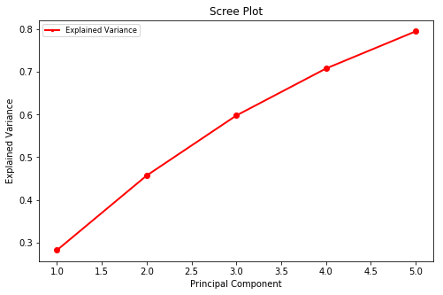

## Dimensionality Reduction

[../generic/Unsupervised-Dimensionality-Reduction.md](../generic/Unsupervised-Dimensionality-Reduction.md)

---

# PCA in Spark ML

---

## PCA in Spark ML

- Class: __pyspark.ml.feature.PCA__

---

## PCA in Spark ML: Sample Code (Python)

```python
from pyspark.ml.feature import PCA
from pyspark.ml.feature import StandardScaler

## abbreviated code
data = spark.read...
feature_vector = VectorAssembler().transform(data)

## recommended to scale feature vector before PCA
scaler = StandardScaler(inputCol="features", outputCol="scaledFeatures",
                        withStd=True, withMean=False)
                        scaler_model = scaler.fit(feature_vector)

# Normalize each feature to have unit standard deviation.
fv_scaled = scaler.fit(feature_vector).transform(feature_vector)


## apply PCA for 5 Principal Component
num_pc = 5
pca = PCA(k=num_pc, inputCol="scaledFeatures", outputCol="pcaFeatures")
model = pca.fit(fv_scaled)
pca_features = model.transform(fv_scaled).select("pcaFeatures")

```
<!-- {"left" : 0.85, "top" : 2.47, "height" : 7.06, "width" : 14.08} -->

---

## PCA in Spark ML: Sample Code (Python)

- Here with 5 Principal Components we are getting 79% coverage! (not bad considering original dataset had 11 features)

```python
## Evaluate variance
variance = model.explainedVariance.toArray()
print(variance)
print ("Original data had {} features,  principal components {}".format(len(data2.columns), num_pc))
print("Cumulative Explained Variance: " + str(np.cumsum(variance)[-1]))
```
<!-- {"left" : 0.85, "top" : 3.7, "height" : 1.55, "width" : 15.6} -->

```
[0.28 0.18 0.14 0.11 0.09]
Original data had 11 features,  principal components 5
Cumulative Explained Variance: 0.7952827473412729
```
<!-- {"left" : 0.85, "top" : 5.65, "height" : 1.55, "width" : 13.2} -->

---

## PCA in Spark ML: Sample Code (Python)

- Correlation matrix for PC components should be mostly zero (remember these Eigen vectors are orthogonal to each other!)

```python
from pyspark.ml.stat import Correlation
import numpy as np

## correlation matrix for PC,  should be very close to zero
corr_pc = Correlation.corr(pca_features, "pcaFeatures").head()[0]
corr_pc_nparr = corr_pc.toArray()

print ("Correlation Matrtix for Principal Components")
np.set_printoptions(precision=2, suppress=True)
print(corr_pc_nparr)

```
<!-- {"left" : 0.85, "top" : 3.51, "height" : 3.92, "width" : 14.26} -->

```
Correlation Matrtix for Principal Components
[[ 1.  0.  0. -0.  0.]
 [ 0.  1. -0.  0.  0.]
 [ 0. -0.  1.  0.  0.]
 [-0.  0.  0.  1. -0.]
 [ 0.  0.  0. -0.  1.]]
```
<!-- {"left" : 0.85, "top" : 7.93, "height" : 2.82, "width" : 11.29} -->

---

## PCA in Spark ML: Sample Code (Python)

```python
import matplotlib.pyplot as plt

variance = model.explainedVariance.toArray()
fig = plt.figure(figsize=(8,5))
sing_vals = np.arange(num_pc) + 1
plt.plot(np.arange(num_pc) + 1, np.cumsum(variance), 'ro-', linewidth=2)
plt.title('Scree Plot')
plt.xlabel('Principal Component')
plt.ylabel('Explained Variance')

leg = plt.legend(['Explained Variance'], loc='best', borderpad=0.3,
                 shadow=False, prop=matplotlib.font_manager.FontProperties(size='small'),
                 markerscale=0.4)

```
<!-- {"left" : 0.85, "top" : 2.01, "height" : 3.47, "width" : 13.32} -->

<!-- {"left" : 4.42, "top" : 5.89, "height" : 5.76, "width" : 8.67} -->


---

## LAB: PCA in Spark ML


 *  **Overview:**  
    - Reduce data dimension with PCA

 *  **Approximate Time:**  
    - 30 mins

 *  **Instructions**  
    - **PCA-1:** Analyze wine quality data


Notes:
