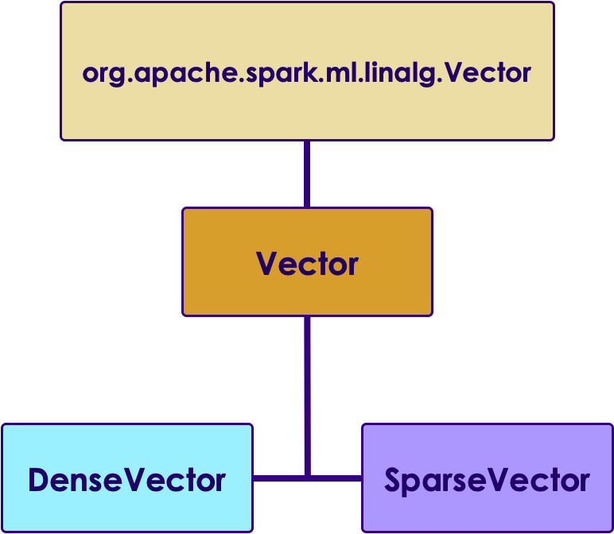

# Backup Slides

---
# Spark ML

---

## ML Vectors


 * One dimensional array of Numerics / Doubles

 *  **DenseVector**

    - When most positions in the vector have value

 *  **SparseVector**

    - When most elements have no value

<!-- {"left" : 11.46, "top" : 1.89, "height" : 4.87, "width" : 5.59} -->


Notes:


---


## DenseVector vs. Sparse Vector

 * DenseVector = simply an array[1,  2,  3,  4,  5]

 * SparseVector
     - We specify size
     - Index array
     - and value array

```text

Vectors.sparse (length,   index array,   value array)  
Vectors.sparse(10,  (0,9),   (100,200) )
# [ 100. 0. 0. 0. 0. 0. 0. 0. 0. 200.]

- Parameters
     - Size is 10
     - first element @ index 0  = 100
     - last element @ index 9 = 200
```
<!-- {"left" : 0.85, "top" : 5.14, "height" : 2.61, "width" : 9.94} -->


Notes:


---

## Creating Vectors (Scala)

* We use  **Vectors**  class to create dense or sparse vectors

```scala
import org.apache.spark.ml.linalg.{Vector, Vectors}

// Create a dense vector (1.0, 0.0, 3.0).
val dv: Vector = Vectors.dense(1.0, 0.0, 3.0)

// Create a sparse vector (1.0, 0.0, 3.0) by specifying its indices
//  and values corresponding to nonzero entries.
val sv1: Vector = Vectors.sparse(3, Array(0, 2), Array(1.0, 3.0))

// Create a sparse vector (1.0, 0.0, 3.0) by specifying its nonzero entries.
val sv2: Vector = Vectors.sparse(3, Seq((0, 1.0), (2, 3.0)))

```
<!-- {"left" : 0.85, "top" : 2.87, "height" : 3.49, "width" : 13.44} -->


Notes:


---

## Creating Vectors (Python)

 * We use  **Vectors**  class to create dense or sparse vectors

```python
from pyspark.ml.linalg import Vectors

v1 = Vectors.dense(3,2,1)
print(v1)
# [3.0,  2.0,   1.0]

## sparse (size of array,  indexe array,  value array)
v2 = Vectors.sparse(10, (0, 9), (100, 200))
print(v2) # (10,[0,9],[100.0,200.0])

print(v2.toArray())
# [ 100.    0.    0.    0.    0.    0.    0.    0.    0.  200.]

```
<!-- {"left" : 0.85, "top" : 3.05, "height" : 3.51, "width" : 11.51} -->


Notes:


