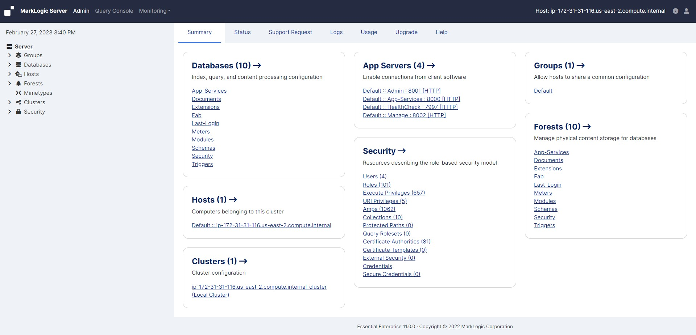

# Administrative Interface

## Accessing the Admin Interface

* Only authorized administrators can log into the Admin Interface

* An authorized administrator is a user who has the admin role or has the admin-ui-user role

* To access the Admin Interface, complete the following procedure:
    - Open the following URL in a browser:
        http://localhost:8001/

            - If you are not accessing the Admin Interface from the same system on which MarkLogic Server is running, you will have to use the IP address or domain name of the server instead of localhost.
    - Log in with your admin username and password

---

## Accessing the Admin Interface (cont...)

* 
    - The summary screen for the Admin Interface displays

         <!-- {"left" : 0.26, "top" : 1.45, "height" : 6.17, "width" : 9.74} -->

---

## Logging Off the Admin Interface

* To log off the Admin Interface, close the browser window used to access the Admin Interface

* This action is sufficient to end the current session and force the user to authenticate again starting another session

---

## Creating and Managing Administrators

* MarkLogic Server administrators are managed by defining which user has the admin role

* This action is sufficient to end the current session and force the user to authenticate again starting another session

---

## The admin-ui-user role

* The admin-ui-user role has a set of base privileges that are required in order to use the Admin UI

* The role allows the user read-only Admin UI usage, but does not give them access to the data, to security configuration, or write access to Server configuration

---

## Starting the Server

* To start MarkLogic Server, use the appropriate system command for your platform:

    - Microsoft Windows: Select Start > Programs > MarkLogic Server > Start MarkLogic Server

    - Red Hat Linux: /sbin/service MarkLogic start

    - Mac OS X: ~/Library/StartupItems/MarkLogic start

---

## Stopping the Server

* Using System Command to Stop MarkLogic Server

    - Microsoft Windows: Select Start > Programs > MarkLogic Server > Stop MarkLogic Server

    - Red Hat Linux: /sbin/service MarkLogic stop

    - Mac OS X: ~/Library/StartupItems/MarkLogic stop

---

## Stopping the Server (cont...)

* Using the Admin Interface to Stop MarkLogic Server

    - Click the Hosts icon on the left tree menu

    - Click on the name of the host you want to shut down.

    - Click the Status tab on the top right.

    - Click Shutdown.

    - A confirmation message displays while shutting down. Click OK to shut down the server

---

## Restarting the Server

* Click the Configure icon on the left tree menu.

* Click the Status tab on the top right.

* Click Restart.

* A confirmation message displays while restarting. Click OK to restart MarkLogic Server.

