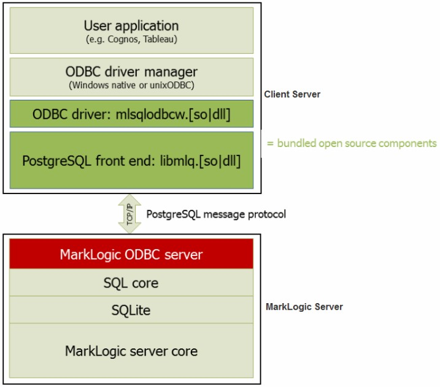

# App_servers

## Creating and Configuring App Servers

* An application is executed on an App Server, which is configured with a specific database, port number, and so on

* Once you have created a database, you can create an App Server

* MarkLogic Server allows you to create three types of App Servers to support different types of applications

    - HTTP App Servers for executing XQuery or JavaScript, and servicing HTTP requests from a client, like a web server

    - XDBC App Servers for Contentbase Connector (XCC) applications that use the Java XCC libraries

    - WebDAV App Servers for accessing a MarkLogic Server database via a WebDAV client

    - ODBC App Servers for accessing a MarkLogic Server database via a SQL client

---

# HTTP Servers

## HTTP Servers

* MarkLogic Server enables you to write web applications by connecting sets of XML or JSON content to HTTP servers that can access server-side XQuery, JavaScript, and REST programs

* These applications can return XHTML, XML, or JSON content to a browser or other HTTP-enabled client application

* HTTP servers are defined at the group level and are accessible by all hosts within the group

---

## HTTP Servers (cont... )

* Each HTTP server provides access to a set of XQuery programs that reside within a specified directory structure

* An HTTP server executes the server-side programs against the database to which it is connected

* HTTP servers execute code, either from a specified location on the file system or from a Modules database

---

## Creating a New HTTP Server

* Go to Lab-10

    https://github.com/elephantscale/marklogic-labs/blob/main/marklogic/10-create_new_http_server.md

---

## Deleting an HTTP Server

* Go to Lab-11

    https://github.com/elephantscale/marklogic-labs/blob/main/marklogic/11-deleting_an_http_server.md

---

# XDBC Servers

## XDBC Servers

* XDBC (XML Database Connector) servers are defined at the group level and are accessible by all hosts within the group

*  Each XDBC server provides access to a specific forest, and to a library (root) of XQuery programs that reside within a specified directory structure

* Applications execute by default against the database that is connected to the XDBC server

* XDBC Servers allow XML Contentbase Connector (XCC) applications to communicate with MarkLogic Server

* XCC is an API used to communicate with MarkLogic Server from Java middleware applications

---

## XDBC Servers (cont...)

* XQuery requests submitted via XCC return results as specified by the XQuery code

* These results can include XML and a variety of other data types

* In order to accept connections from XCC-enabled applications, MarkLogic Server must be configured with an XDBC Server listening on the designated port

* Each XDBC Server connects by default to a specific database within MarkLogic Server, but XCC provides the ability to communicate with any database in the MarkLogic Server cluster to which your application connects (and for which you have the necessary permissions and privileges)

---

## Creating a New XDBC Server

* Go to Lab-12

    https://github.com/elephantscale/marklogic-labs/blob/main/marklogic/12-create_new_xdbc_server.md

---

## Deleting a XDBC Server

* Go to Lab-13

    https://github.com/elephantscale/marklogic-labs/blob/main/marklogic/13-deleting_a_xdbc_server.md

---

# WebDAV Servers

## WebDAV Servers

* A WebDAV server in MarkLogic Server is similar to an HTTP server, but has the following important differences:

    - WebDAV servers cannot execute XQuery code

    - WebDAV servers support the WebDAV protocol to allow WebDAV clients to have read and write access (depending on the security configuration) to a database

    - A WebDAV server only accesses documents and directories in a database; it does not access the file system directly

---

## WebDAV Servers (cont...)

* WebDAV (Web-based Distributed Authoring and Versioning) is a protocol that extends the HTTP protocol to provide the ability to write documents through these HTTP extensions

* You need a WebDAV client to write documents, but you can still read them through HTTP (through a web browser, for example)

---

## Accesses a Database for Read and Write, Not XQuery Execution

* In MarkLogic Server, WebDAV servers are defined at the group level and apply to all hosts within the group

* Each WebDAV server provides access to a single database for reading and writing (dependent on the needed security permissions)

* When a document is read or written via WebDAV, all of its associated data, such as properties, metadata, collections, and so on are also transferred with the document

* In the Admin Interface, you configure a WebDAV server to access a database

---

## Accesses a Database for Read and Write, Not XQuery Execution (cont...)

* Documents stored in that database are accessible for reading via HTTP. The database is also accessible via WebDAV clients for reading, modifying, deleting, and adding documents

* When you add a document via a WebDAV client (by dragging and dropping, for example), you are actually loading a document directly into the database

* When accessing a database via a WebDAV server, you cannot execute XQuery code

---

## Directories

* A WebDAV directory is analogous to a file system directory

* A directory must exist in order to view (via a WebDAV client) any documents in that directory (just like in a filesystem, where you must navigate to a directory in order to access any files in that directory)

* Each document in a directory has a URI that includes the directory URI as a prefix

* Also, each directory visible from a WebDAV server must have the WebDAV root as its prefix, and there must exist a directory with the WebDAV root in the database

---

## Directories (cont...)

* For example, if you have a WebDAV root of http://marklogic.com/, then the URI of all documents and all directories must begin with that root in order to be visible from a WebDAV client

* Also, the directory with a URI http://marklogic.com/ must exist in the database

* Therefore, a document with a URI of http://marklogic.com/file.xml is visible from this WebDAV server, and a directory with a URI of http://marklogic.com/dir/ is also visible

* A directory with a URI of /dir/ and a document with a URI of /dir/file.xml is not visible from this server, however, because its URI does not begin with the WebDAV root

---

## Server Root Directory

* Each WebDAV server has a concept of a root

* The root is the top-level directory accessible from the server; you can access any documents or directories in the database that are children of the root

* The root therefore serves as a prefix for all document and directory URIs accessible through the WebDAV server

* You enter the WebDAV root in the Admin Interface

* The root can be any valid URI

---

## Server Root Directory (cont...)

* The root should always end with a forward slash (/), and if it does not, the Admin Interface will append one to the string provided

* The root should be a unique string that can serve as the top of a directory structure

*  It is common practice to use a WebDAV root of the form http://<company_domain>/, but that is not required

* The following are some examples of WebDAV roots:

    - http://myCompany/marketing/
    - /myCompany/marketing/

---

## Documents in a WebDAV Server

* The main purpose of a WebDAV server is to make it easy for people to store, retrieve, and modify documents in a database

* The documents can be any type, whether they are text documents such as .txt files or source code, binary documents such as image files or Microsoft Word files, or XML documents

* Because the documents are stored in a database, you can create applications that use the content in those documents for whatever purpose you need

---

## Creating a New WebDAV Server

* Go to Lab-14

    https://github.com/elephantscale/marklogic-labs/blob/main/marklogic/14-create_new_webdav_server.md

---

## Deleting a WebDAV Server

* Go to Lab-15

    https://github.com/elephantscale/marklogic-labs/blob/main/marklogic/15-deleting_a_webdav_server.md

---

## Steps to Connect to a Web Folder in Windows Explorer

* Go to Lab-16

    https://github.com/elephantscale/marklogic-labs/blob/main/marklogic/16-connect_to_webdav_from_windows.md

---

# ODBC Servers

## ODBC Servers

* An ODBC server is one of several components that support SQL queries to MarkLogic Server

* The basic purpose of an ODBC server is to return relational-style data resident in MarkLogic Server in response to SQL queries

* The ODBC server returns data in tuple form and manages server state to support a subset of SQL and ODBC statements from Business Intelligence (BI) tools

* As shown in the figure below, an ODBC server connects with a PostgreSQL front end on the client by means of the PostgreSQL message protocol

* The ODBC server accepts SQL queries from the PostgreSQL front end and returns the relational-style data needed by the BI applications to build reports

---

## ODBC Servers (cont...)

 <!-- {"left" : 0.26, "top" : 1.45, "height" : 6.17, "width" : 9.74} -->

---

## Creating a New ODBC Server

* Go to Lab-17

    https://github.com/elephantscale/marklogic-labs/blob/main/marklogic/17-create_new_odbc_server.md

---

## Deleting an ODBC Server

* Go to Lab-18

    https://github.com/elephantscale/marklogic-labs/blob/main/marklogic/18-deleting_an_odbc_server.md

