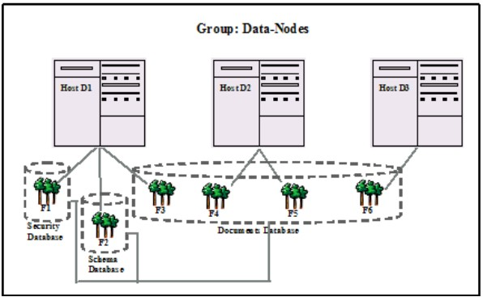

# Database

## Understanding Database

* A database in MarkLogic Server serves as a layer of abstraction between forests and HTTP, WebDAV, or XDBC servers

* A database is made up of data forests that are configured on hosts within the same cluster but not necessarily in the same group

* It enables a set of one or more forests to appear as a single contiguous set of content for query purposes

* Multiple HTTP, XDBC, and WebDAV servers can be connected to the same database, allowing different applications to be deployed over a common content base

---

## Understanding Database (cont...)

* A database can also span forests that are configured on multiple hosts enabling data scalability through hardware expansion

* To ensure database consistency, all forests that are attached to a database must be available in order for the database to be available

* The system databases -- Security, Schemas, Triggers, Modules, Extensions, Last-Login and App-Services -- should all be single forest databases. For high availability, one or two replica forests can and should be configured. But there is no benefit to having multiple master forests in the database

---

## Schemas and Security Databases

* The installation process creates the following auxiliary databases by default - Documents, Last-Login, Schemas, Security, Modules, and Triggers

* Every database points to a security database and a schema database

* Security configuration information is stored in the security database and schemas are stored in the schemas database

* A database can point back to itself for the security and schemas databases, storing the security information and schemas in the same repository as the documents

---

## Schemas and Security Databases (cont...)

* However, security objects created through the Admin Interface are stored in the Security database by default

* MarkLogic recommends leaving databases connected to Security as their security database

---

## Modules Database

* The modules database is an auxiliary database that is used to store executable XQuery, JavaScript, and REST code

* During installation, a database named Modules is created, but any database can be used as a modules database, as long as the HTTP or XDBC server is configured to use it as a modules database

* Also, it is possible to use the same database to store executable modules, to store queryable documents, and/or to store triggers

* If you use a modules database, each executable document in the database must have the root (specified in the HTTP or XDBC server) as a prefix to its URI

---

## Triggers Database

* he triggers database is an auxiliary database that is used to store triggers

* During installation, a database named Triggers is created, but any database can be used as a triggers database

* Also, it is possible to use the same database to store executable modules, to store queryable documents, and/or to store triggers

* A triggers database is required if you are using the Content Processing Framework

* To avoid issues with Marklogic Content Processing when triggers are configured, it is recommended that you do not set a database to be its own Triggers Database

---
## Example of Databases in MarkLogic Server

* This section provides an example which demonstrates the concept of a database and the relationships between a database, a host and a forest in MarkLogic Server

     <!-- {"left" : 0.26, "top" : 1.45, "height" : 6.17, "width" : 9.74} -->

---
## Example of Databases in MarkLogic Server (cont...)

* In the diagram above, Hosts D1, D2 and D3 belong to the Data-Nodes Group

* D1 is the first Host in Data-Nodes Group on which MarkLogic Server is loaded. Three Databases are created by default, Security Database, Schema Database and Documents Database. In the diagram above, 3 Forests, F1, F2 and F3 are configured on Host D1 and assigned to the Security Database, Schema Database and Documents Database respectively

* D2 is the second Host to join the Data-Nodes Group. Forests F4 and F5 are configured on D2 and attached to the Documents Database

* D3 is the third Host to join the Data-Nodes Group and has Forest F6, configured on it. F6 is also assigned to the Documents Database

---

## Lab: Creating a New Database

* Go to Lab-3

    https://github.com/elephantscale/marklogic-labs/blob/main/marklogic/3-create_new_database.md

---

## Attaching Forest to Database

* Go to Lab-4

    https://github.com/elephantscale/marklogic-labs/blob/main/marklogic/4-attach_forest_to_database.md

---

## Loading Documents into a Database

* The documents will be loaded with the default permissions and added to the default collections of the user with which you logged into the Admin Interface

* Go to Lab-5

    https://github.com/elephantscale/marklogic-labs/blob/main/marklogic/5-load_document_into_database.md

---

## Merging a Database

* You can merge all of the forest data in the database using the Admin Interface

* Merging the forests in a database improves performance and is periodically done automatically in the background by MarkLogic Server

* The Merge button allows you to explicitly merge the forest data for this database

* Go to Lab-6

    https://github.com/elephantscale/marklogic-labs/blob/main/marklogic/6-mearging_a_database.md

---

## Clearing a Database

* You can clear all of the forest content from the database using the Admin Interface

* Clearing a database deletes all of the content from all of the forests in the database, but leaves the database configuration intact

* Go to Lab-7

    https://github.com/elephantscale/marklogic-labs/blob/main/marklogic/7-clearing_a_database.md

---

## Disabling a Database

* You can either disable only the database or the database along with all of its forests

* Disabling only the database marks the database as disabled and unmounts all the forests from the database. However, the database forests remain enabled

* Disabling the database and its forests marks the database and each forest as disabled, unmounts all the forests from the database, and clears all memory caches for all the forests in the database

* The database remains unavailable for any query operations while it is disabled

---

## Disabling a Database (cont...)

* Disabling a database does not delete the configuration or document data

* The database and forest can later be re-enabled by clicking Enable

* Go to Lab-8

    https://github.com/elephantscale/marklogic-labs/blob/main/marklogic/8-disabling_a_database.md

---

## Deleting a Database

* A database cannot be deleted if there are any HTTP, WebDAV, or XDBC servers that refer to the database

* Deleting a database detaches the forests that are attached to it, but does not delete them

* The forests remain on the hosts on which they were created with the data intact

* Go to Lab-9

    https://github.com/elephantscale/marklogic-labs/blob/main/marklogic/9-deleting_a_database.md