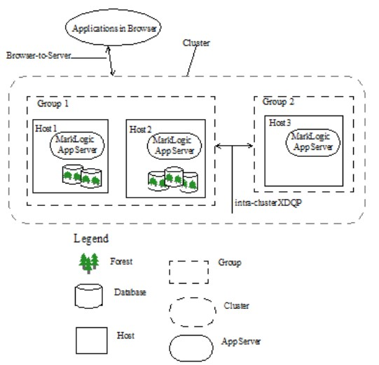

# Marklogic Architecture

## Architecture Overview

 <!-- {"left" : 0.26, "top" : 1.45, "height" : 6.17, "width" : 9.74} -->

---

## Hosts

* A host is an instance of MarkLogic Server

* A host is not configured individually but as a member of a group

*  host is added to the Default group if it is not joined to another group during the installation process

*  For example, in cases where MarkLogic is running in a single host environment, the host is added to the Default group

* Forests are created on hosts and added to a database to interact with HTTP, ODBC, and XDBC Servers running on the same or other hosts

---

## App Servers

* HTTP Servers

* XDBC Servers

* WebDAV Servers

* ODBC Servers

---

## HTTP Servers

* MarkLogic Server enables you to write web applications by connecting sets of XML or JSON content to HTTP servers that can access server-side XQuery, JavaScript, and REST programs

* These applications can return XHTML, XML, or JSON content to a browser or other HTTP-enabled client application

* HTTP servers are defined at the group level and are accessible by all hosts within the group

---

## XDBC Servers

* XDBC (XML Database Connector) servers are defined at the group level and are accessible by all hosts within the group

* Each XDBC server provides access to a specific forest, and to a library (root) of XQuery programs that reside within a specified directory structure

* Applications execute by default against the database that is connected to the XDBC server

---

## WebDAV Servers

* WebDAV (Web-based Distributed Authoring and Versioning) is a protocol that extends the HTTP protocol to provide the ability to write documents through these HTTP extensions

* You need a WebDAV client to write documents, but you can still read them through HTTP (through a web browser, for example)

---

## ODBC Servers

* An ODBC server is one of several components that support SQL queries to MarkLogic Server

* The basic purpose of an ODBC server is to return relational-style data resident in MarkLogic Server in response to SQL queries

* The ODBC server returns data in tuple form and manages server state to support a subset of SQL and ODBC statements from Business Intelligence (BI) tools

---

## Groups

* The basic definitions for group, host, and cluster are the following
    - A group is a set of similarly configured hosts within a cluster.
    - A host is an instance of MarkLogic Server running on a single machine.
    - A cluster is a set of hosts that work together.

     <!-- {"left" : 0.26, "top" : 1.45, "height" : 6.17, "width" : 9.74} -->

---

## Groups (cont...)

* In this example, each machine is set up as a host within the example cluster. Specifically, hosts E1, E2 and E3 belong to a group called Evaluator-Nodes

* They are configured with HTTP servers and XDBC servers to run user applications

* All hosts in the Evaluator-Nodes group have the same MarkLogic Server configuration

* Hosts D1, D2 and D3 belong to a group called Data-Nodes

* Hosts in the Data-Nodes group are configured with data forests and interact with the nodes in the Evaluator-Nodes group to service data requests

---

## Clusters

* In MarkLogic clusters, a common configuration is to have one group defined for the evaluator nodes (hosts that service query requests) and another group defined for the data nodes (hosts to which forests are attached)

---

## Databases

* A database in MarkLogic Server serves as a layer of abstraction between forests and HTTP, WebDAV, or XDBC servers

* A database is made up of data forests that are configured on hosts within the same cluster but not necessarily in the same group

* It enables a set of one or more forests to appear as a single contiguous set of content for query purposes

* Multiple HTTP, XDBC, and WebDAV servers can be connected to the same database, allowing different applications to be deployed over a common content base

---

## Databases (cont...)

* A database can also span forests that are configured on multiple hosts enabling data scalability through hardware expansion

* To ensure database consistency, all forests that are attached to a database must be available in order for the database to be available

---

## Forestes

* A forest is a collection of XML, JSON, text, or binary documents

* Forests are created on hosts and attached to databases to appear as a contiguous set of content for query purposes

* A forest can only be attached to one database at a time

* You cannot load data into a forest that is not attached to a database

* A forest contains in-memory and on-disk structures called stands

---

## Forestes (cont...)

* Each stand is composed of XML, JSON, binary, and/or text fragments, plus index information associated with the fragments

* A forest also contains a separate on-disk Large Data Directory for storing large objects such as large binary documents

* MarkLogic Server stores large objects separately to optimize memory usage, disk usage, and merge time

* A small object is stored directly in a stand as a fragment

* A large object is stored in a stand as a small reference fragment, with the full content stored in the Large Data Directory