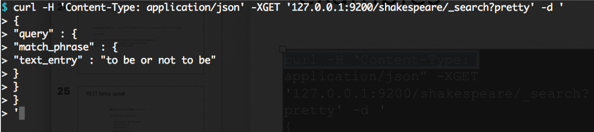
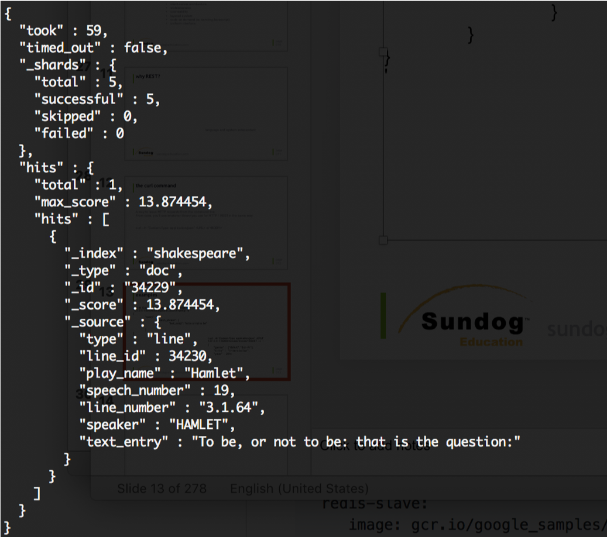
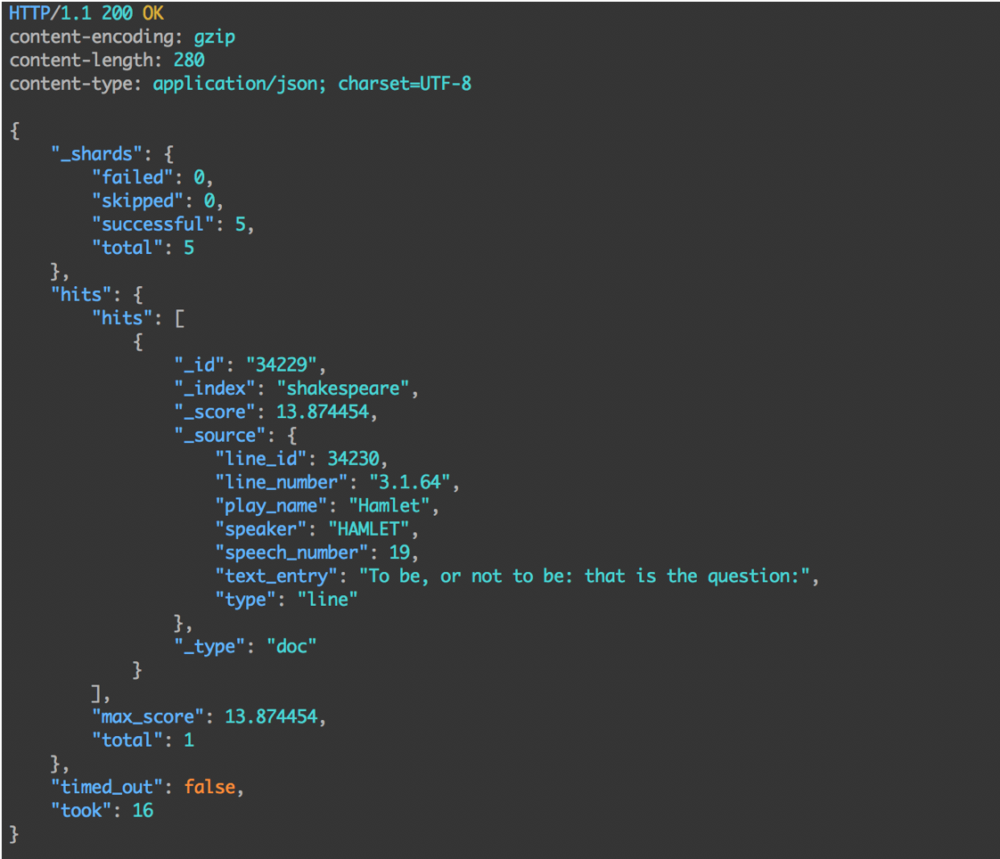

# REST Intro

---

## Anatomy of a HTTP  Request


* METHOD: the “verb” of the request. GET, POST, PUT, or DELETE
* PROTOCOL: what flavor of HTTP (HTTP/1.1)  HOST: what web server you want to talk to  URL: what resource is being requested
* BODY: extra data needed by the server

* HEADERS: user-agent, content-type, etc.


---

## Example: GET request for Google.com

```text
GET /index.html
Protocol: HTTP/1.1
Host: www.google.com  
No body
Headers:
User-Agent: Mozilla/5.0 (Windows; U; Windows NT 6.1; en-US; rv:1.9.1.5) Gecko/20091102 Firefox/3.5.5 (.NET CLR 3.5.30729)  Accept: text/html,application/xhtml+xml,application/xml;q=0.9,*/*;q=0.8
Accept-Language: en-us,en;q=0.5  Accept-Encoding: gzip,deflate
Accept-Charset: ISO-8859-1,utf-8;q=0.7,*;q=0.7  Keep-Alive: 300
Connection: keep-alive
Cookie: PHPSESSID=r2t5uvjq435r4q7ib3vtdjq120  Pragma: no-cache
Cache-Control: no-cache

```

---

## RESTful APIs


* Pragmatic definition: using HTTP requests to communicate with web services

* Examples:

  - GET requests retrieve information (like search results)  PUT requests insert or replace new information  DELETE requests delete information


---

## REST fancy-speak


* **R**epresentational **S**tate **T**ransfer

* Six guiding constraints:
  - client-server architecture
  - statelessness
  - cacheability
  - layered system
  - code on demand (ie, sending Javascript)
  - uniform interface

Notes:


REST stands for Representational State Transfer. (It is sometimes spelled "ReST".) It relies on a stateless, client-server, cacheable communications protocol -- and in virtually all cases, the HTTP protocol is used. REST is an architecture style for designing networked applications.

Representational State Transfer (REST) is an architectural style that defines a set of constraints to be used for creating web services. Web Services that conform to the REST architectural style, or RESTful web services, provide interoperability between computer systems on the Internet.

Roy Fielding articulated ReST in his dissertation at UC Irvine in 2000

---

## Why REST?

* Language and system independent
* Highly scalable 

---

## The Curl Command

* A way to issue HTTP requests from the command line
* From code, you'll use whatever library you use for HTTP / REST in the same way.

```bash
curl –H “Content-Type: application/json” <URL> -d '<BODY>'
```

---

## Examples





---

## Examples





---

## The Httpie Command

* A way to issue HTTP requests from the command line
* Simpler syntax than curl, defaults to 'pretty' output.

```text
http <VERB> <URL> -d '<BODY>'
```


---

## Examples


---

## Examples




---

# Hacking Curl

---

## Make Life Easier


* From your home directory:

* Two ways

* Alias 
`alias curl="/usr/bin/curl -H 'Content-type: application/json' "`

* **Or wrap the command** 

```text
mkdir bin  cd bin
vi curl (Hit I for insert mode)

#!/bin/bash
/usr/bin/curl –H "Content-Type: application/json" "$@"

Esc – wq! – enter

chmod a+x curl
```

Notes:

As I mentioned in Elasticsearch 6 they started requiring Content-Type every single type you connect to the API. This can become tedious 

There are a couple ways to get around this. 
Install httpie and use it 
Create a shell script that automatically passes JSON Content-Type to curl. 

---

## Make Life Easier

* Delete an index
* **curl -XDELETE 127.0.0.1:9200/movies** 

Notes:

As I mentioned in Elasticsearch 6 they started requiring Content-Type every single type you connect to the API. This can become tedious 

There are a couple ways to get around this. 
Install httpie and use it 
Create a shell script that automatically passes JSON Content-Type to curl. 


---

## Remember


* Without this hack, you need to add

* `-H "Content-Type: application/json"`

* to every curl command!

* The rest of the course assumes you have  this in place.

Notes:

Don't do this in production, it is a hack that is only applicable to this course. 


---

