# Developing Microservices with Spring Boot


---


# Demystifying Microservices

---


## Progression of Microservices


 * Business demand as a catalyst for microservices evolution

 * Technology as a catalyst for the microservices evolution

Notes: 

Microservices are one of the increasingly popular architecture patterns next to SOA, complemented by DevOps and cloud. The microservices evolution is greatly influenced by the disruptive digital innovation trends in modern business and the evolution of technologies in the last few years. We will examine these two factors in this section.
In this era of digital transformation, enterprises increasingly adopt technologies as one of the key enablers for radically increasing their revenue and customer base. Enterprises primarily use social media, mobile, cloud, big data, and Internet of Things as vehicles to achieve the disruptive innovations. Using these technologies, enterprises find new ways to quickly penetrate the market, which severely pose challenges to the traditional IT delivery mechanisms.


---

## Business demand as a catalyst for microservices evolution


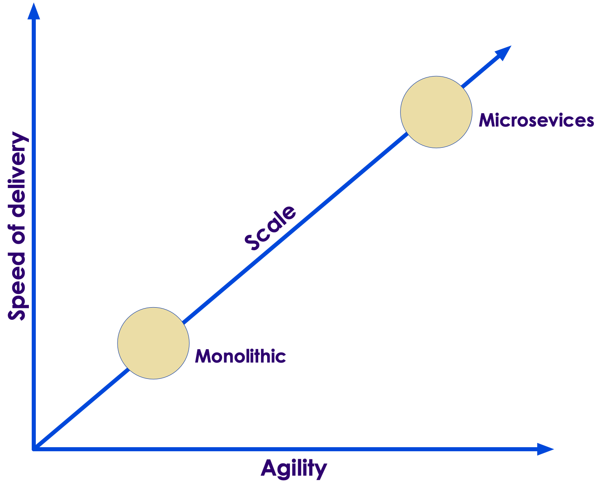

Notes: 

The following graph shows the state of traditional development and microservices against the new enterprise challenges such as agility, speed of delivery, and scale.
Gone are the days when businesses invested in large application developments with the turnaround time of a few years. Enterprises are no longer interested in developing consolidated applications to manage their end-to-end business functions as they did a few years ago.


---

## Business demand as a catalyst for microservices evolution


 * Business demand as a catalyst for microservices evolution

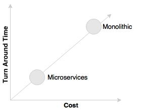

Notes: 

The following graph shows the state of traditional monolithic applications and microservices in comparison with the turnaround time and cost.
Today, for instance, airlines or financial institutions do not invest in rebuilding their core mainframe systems as another monolithic monster. Retailers and other industries do not rebuild heavyweight supply chain management applications, such as their traditional ERPs. Focus has shifted to building quick-win point solutions that cater to specific needs of the business in the most agile way possible.


---

## 


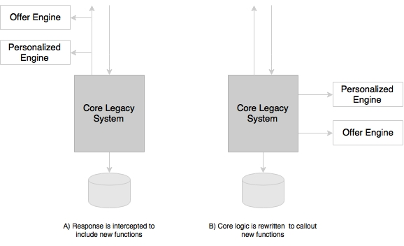

Notes: 

Let's take an example of an online retailer running with a legacy monolithic application. If the retailer wants to innovate his/her sales by offering their products personalized to a customer based on the customer's past shopping, preferences, and so on and also wants to enlighten customers by offering products based on their propensity to buy them, they will quickly develop a personalization engine or offers based on their immediate needs and plug them into their legacy application.
As shown in the preceding diagram, rather than investing in rebuilding the core legacy system, this will be either done by passing the responses through the new functions, as shown in the diagram marked A, or by modifying the core legacy system to call out these functions as part of the processing, as shown in the diagram marked B. These functions are typically written as microservices.
This approach gives organizations a plethora of opportunities to quickly try out new functions with lesser cost in an experimental mode. Businesses can later validate key performance indicators and alter or replace these implementations if required.


---

## Technology as a catalyst for the microservices evolution


 * Platform as a Services (PaaS) 

 * Integration Platform as a Service (iPaaS)

Notes: 

Emerging technologies have also made us rethink the way we build software systems. For example, a few decades back, we couldn't even imagine a distributed application without a two-phase commit. Later, NoSQL databases made us think differently.
Similarly, these kinds of paradigm shifts in technology have reshaped all the layers of the software architecture.
The emergence of HTML 5 and CSS3 and the advancement of mobile applications repositioned user interfaces. Client-side JavaScript frameworks such as Angular, Ember, React, Backbone, and so on are immensely popular due to their client-side rendering and responsive designs.
With cloud adoptions steamed into the mainstream, Platform as a Services (PaaS) providers such as Pivotal CF, AWS, Salesforce.com, IBMs Bluemix, RedHat OpenShift, and so on made us rethink the way we build middleware components. The container revolution created by Docker radically influenced the infrastructure space. These days, an infrastructure is treated as a commodity service.
The integration landscape has also changed with Integration Platform as a Service (iPaaS), which is emerging. Platforms such as Dell Boomi, Informatica, MuleSoft, and so on are examples of iPaaS. These tools helped organizations stretch integration boundaries beyond the traditional enterprise.
NoSQLs have revolutionized the databases space. A few years ago, we had only a few popular databases, all based on relational data modeling principles. We have a long list of databases today: Hadoop, Cassandra, CouchDB, and Neo 4j to name a few. Each of these databases addresses certain specific architectural problems.


---

## Progression of Architecture


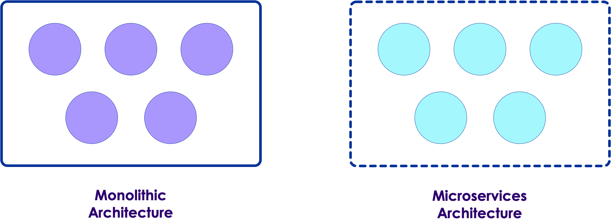

Notes: 

Application architecture has always been evolving alongside demanding business requirements and the evolution of technologies. Architectures have gone through the evolution of age-old mainframe systems to fully abstract cloud services such as AWS Lambda.
Different architecture approaches and styles such as mainframes, client server, N-tier, and service-oriented were popular at different timeframes. Irrespective of the choice of architecture styles, we always used to build one or the other forms of monolithic architectures. The microservices architecture evolved as a result of modern business demands such as agility and speed of delivery, emerging technologies, and learning from previous generations of architectures.
Microservices help us break the boundaries of monolithic applications and build a logically independent smaller system of systems, as shown in the preceding diagram.


---

## Microservices - What is it?


 * Architecture style

Notes: 

Microservices are an architecture style used by many organizations today as a game changer to achieve a high degree of agility, speed of delivery, and scale. Microservices give us a way to develop more physically separated modular applications.
Microservices are not invented. Many organizations such as Netflix, Amazon, and eBay successfully used the divide-and-conquer technique to functionally partition their monolithic applications into smaller atomic units, each performing a single function. These organizations solved a number of prevailing issues they were experiencing with their monolithic applications.
Following the success of these organizations, many other organizations started adopting this as a common pattern to refactor their monolithic applications. Later, evangelists termed this pattern as the microservices architecture.
Microservices originated from the idea of hexagonal architecture coined by Alistair Cockburn. Hexagonal architecture is also known as the Ports and Adapters pattern.


---

## Microservices Architecture


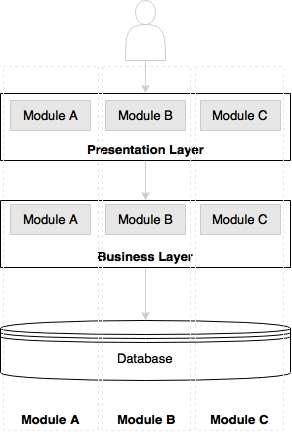

Notes: 

Microservices are an architectural style or an approach to building IT systems as a set of business capabilities that are autonomous, self-contained, and loosely coupled:
The preceding diagram depicts a traditional N-tier application architecture having a presentation layer, business layer, and database layer. The modules A, B, and C represent three different business capabilities. The layers in the diagram represent a separation of architecture concerns. Each layer holds all three business capabilities pertaining to this layer. The presentation layer has web components of all the three modules, the business layer has business components of all the three modules, and the database hosts tables of all the three modules. In most cases, layers are physically spreadable, whereas modules within a layer are hardwired.


---

## Microservices Architecture


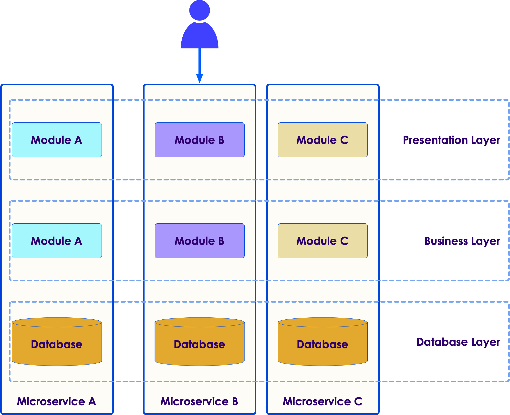

Notes: 

Let's now examine a microservices-based architecture.
As we can note in the preceding diagram, the boundaries are inversed in the microservices architecture. Each vertical slice represents a microservice. Each microservice has its own presentation layer, business layer, and database layer. Microservices are aligned towards business capabilities. By doing so, changes to one microservice do not impact others.
There is no standard for communication or transport mechanisms for microservices. In general, microservices communicate with each other using widely adopted lightweight protocols, such as HTTP and REST, or messaging protocols, such as JMS or AMQP. In specific cases, one might choose more optimized communication protocols, such as Thrift, ZeroMQ, Protocol Buffers, or Avro.
As microservices are more aligned to business capabilities and have independently manageable life cycles, they are the ideal choice for enterprises embarking on DevOps and cloud. DevOps and cloud are two facets of microservices.


---

## Microservices – the honeycomb analogy


 * Microservices – the honeycomb analogy


Notes: 

The honeycomb is an ideal analogy for representing the evolutionary microservices architecture.
In the real world, bees build a honeycomb by aligning hexagonal wax cells. They start small, using different materials to build the cells. Construction is based on what is available at the time of building. Repetitive cells form a pattern and result in a strong fabric structure. Each cell in the honeycomb is independent but also integrated with other cells. By adding new cells, the honeycomb grows organically to a big, solid structure. The content inside each cell is abstracted and not visible outside. Damage to one cell does not damage other cells, and bees can reconstruct these cells without impacting the overall honeycomb.


---

## Principles of Microservices


 * Single responsibility per service

 * Microservices are autonomous

Notes: 

We will now examine some of the principles of the microservices architecture. These principles are a "must have" when designing and developing microservices.


---

## Single responsibility per service


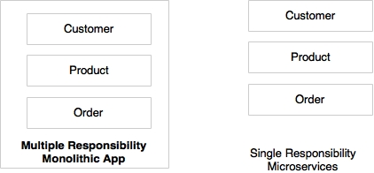

Notes: 

The single responsibility principle is one of the principles defined as part of the SOLID design pattern. It states that a unit should only have one responsibility.
This implies that a unit, either a class, a function, or a service, should have only one responsibility. At no point should two units share one responsibility or one unit have more than one responsibility. A unit with more than one responsibility indicates tight coupling.
As shown in the preceding diagram, Customer, Product, and Order are different functions of an e-commerce application. Rather than building all of them into one application, it is better to have three different services, each responsible for exactly one business function, so that changes to one responsibility will not impair others. In the preceding scenario, Customer, Product, and Order will be treated as three independent microservices.


---

## Microservices are autonomous


 * Microservices are autonomous

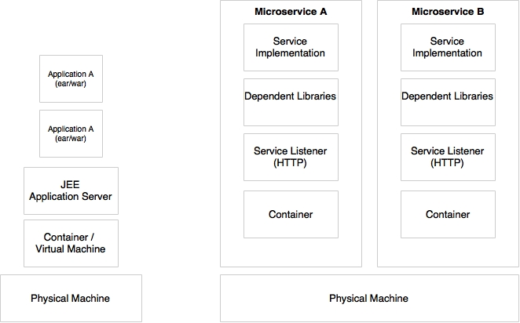

Notes: 

Microservices are self-contained, independently deployable, and autonomous services that take full responsibility of a business capability and its execution. They bundle all dependencies, including library dependencies, and execution environments such as web servers and containers or virtual machines that abstract physical resources.
One of the major differences between microservices and SOA is in their level of autonomy. While most SOA implementations provide service-level abstraction, microservices go further and abstract the realization and execution environment.
In traditional application developments, we build a WAR or an EAR, then deploy it into a JEE application server, such as with JBoss, WebLogic, WebSphere, and so on. We may deploy multiple applications into the same JEE container. In the microservices approach, each microservice will be built as a fat Jar, embedding all dependencies and run as a standalone Java process.
Microservices may also get their own containers for execution, as shown in the preceding diagram. Containers are portable, independently manageable, lightweight runtime environments. Container technologies, such as Docker, are an ideal choice for microservices deployment.


---

## Characteristics of microservices


 * Characteristics of microservices

 * Services are first-class citizens

 * Microservices are lightweight

 * Microservices with polyglot architecture

 * Automation in a microservices environment

 * Microservices with a supporting ecosystem

 * Microservices are distributed and dynamic

 * Antifragility, fail fast, and self-healing

Notes: 

The microservices definition discussed earlier in this chapter is arbitrary. Evangelists and practitioners have strong but sometimes different opinions on microservices. There is no single, concrete, and universally accepted definition for microservices. However, all successful microservices implementations exhibit a number of common characteristics. Therefore, it is important to understand these characteristics rather than sticking to theoretical definitions. Some of the common characteristics are detailed in this section.


---

## Services are first-class citizens


 * Characteristics of services in a microservice

     - Service contract - JSON Schema, WADL, Swagger, and RAML are a few examples.

     - Loose coupling

     - Service abstraction

     - Service reuse

     - Statelessness

     - Services are discoverable

     - Service interoperability

     - Service composeability

Notes: 

In the microservices world, services are first-class citizens. Microservices expose service endpoints as APIs and abstract all their realization details. The internal implementation logic, architecture, and technologies (including programming language, database, quality of services mechanisms, and so on) are completely hidden behind the service API.
Moreover, in the microservices architecture, there is no more application development; instead, organizations focus on service development. In most enterprises, this requires a major cultural shift in the way that applications are built.
In a Customer Profile microservice, internals such as the data structure, technologies, business logic, and so on are hidden. They aren't exposed or visible to any external entities. Access is restricted through the service endpoints or APIs. For instance, Customer Profile microservices may expose Register Customer and Get Customer as two APIs for others to interact with.
As microservices are more or less like a flavor of SOA, many of the service characteristics defined in the SOA are applicable to microservices as well.
The following are some of the characteristics of services that are applicable to microservices as well:
Service contract: Similar to SOA, microservices are described through well-defined service contracts. In the microservices world, JSON and REST are universally accepted for service communication. In the case of JSON/REST, there are many techniques used to define service contracts. JSON Schema, WADL, Swagger, and RAML are a few examples.
Loose coupling: Microservices are independent and loosely coupled. In most cases, microservices accept an event as input and respond with another event. Messaging, HTTP, and REST are commonly used for interaction between microservices. Message-based endpoints provide higher levels of decoupling.
Service abstraction: In microservices, service abstraction is not just an abstraction of service realization, but it also provides a complete abstraction of all libraries and environment details, as discussed earlier.
Service reuse: Microservices are course-grained reusable business services. These are accessed by mobile devices and desktop channels, other microservices, or even other systems.
Statelessness: Well-designed microservices are stateless and share nothing with no shared state or conversational state maintained by the services. In case there is a requirement to maintain state, they are maintained in a database, perhaps in memory.
Services are discoverable: Microservices are discoverable. In a typical microservices environment, microservices self-advertise their existence and make themselves available for discovery. When services die, they automatically take themselves out from the microservices ecosystem.
Service interoperability: Services are interoperable as they use standard protocols and message exchange standards. Messaging, HTTP, and so on are used as transport mechanisms. REST/JSON is the most popular method for developing interoperable services in the microservices world. In cases where further optimization is required on communications, other protocols such as Protocol Buffers, Thrift, Avro, or Zero MQ could be used. However, the use of these protocols may limit the overall interoperability of the services.
Service composeability: Microservices are composeable. Service composeability is achieved either through service orchestration or service choreography.


---

## Microservices are lightweight


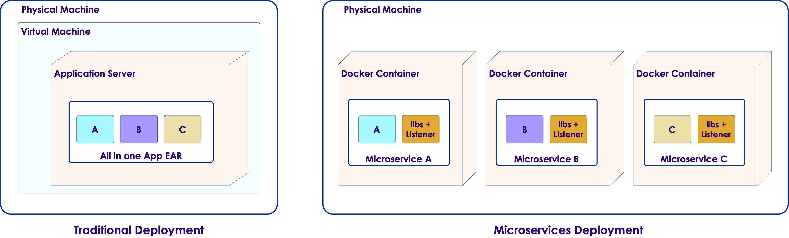

Notes: 

Well-designed microservices are aligned to a single business capability, so they perform only one function. As a result, one of the common characteristics we see in most of the implementations are microservices with smaller footprints.
When selecting supporting technologies, such as web containers, we will have to ensure that they are also lightweight so that the overall footprint remains manageable. For example, Jetty or Tomcat are better choices as application containers for microservices compared to more complex traditional application servers such as WebLogic or WebSphere.
Container technologies such as Docker also help us keep the infrastructure footprint as minimal as possible compared to hypervisors such as VMWare or Hyper-V.
As shown in the preceding diagram, microservices are typically deployed in Docker containers, which encapsulate the business logic and needed libraries. This help us quickly replicate the entire setup on a new machine or on a completely different hosting environment or even to move across different cloud providers. As there is no physical infrastructure dependency, containerized microservices are easily portable.


---

## Microservices with polyglot architecture


 * Different services use different versions of the same technologies. One microservice may be written on Java 1.7, and another one could be on Java 1.8.

 * Different languages are used to develop different microservices, such as one microservice is developed in Java and another one in Scala.

 * Different architectures are used, such as one microservice using the Redis cache to serve data, while another microservice could use MySQL as a persistent data store.

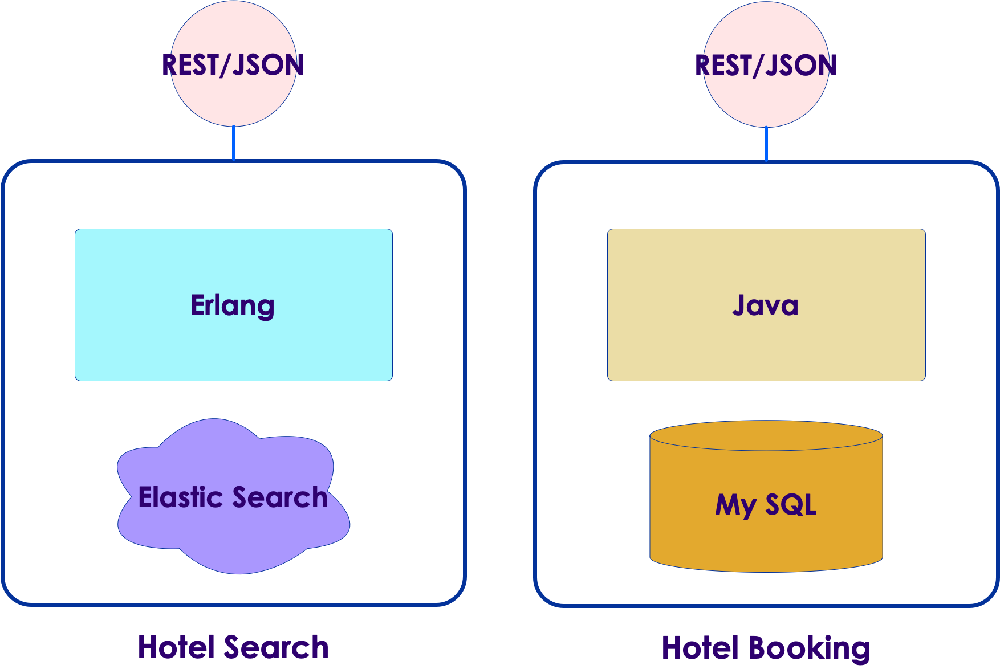

Notes: 

As microservices are autonomous and abstract everything behind service APIs, it is possible to have different architectures for different microservices. A few common characteristics that we see in microservices implementations are:

In the preceding example, as Hotel Search is expected to have high transaction volumes with stringent performance requirements, it is implemented using Erlang. In order to support predictive searching, Elasticsearch is used as the data store. At the same time, Hotel Booking needs more ACID transactional characteristics. Therefore, it is implemented using MySQL and Java. The internal implementations are hidden behind service endpoints defined as REST/JSON over HTTP.


---

## Automation in a microservices environment


 * The development phase

 * The testing phase 

 * Infrastructure provisioning 

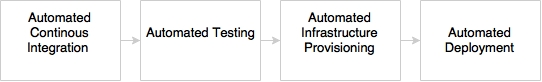

Notes: 

Most of the microservices implementations are automated to a maximum from development to production.
As microservices break monolithic applications into a number of smaller services, large enterprises may see a proliferation of microservices. A large number of microservices is hard to manage until and unless automation is in place. The smaller footprint of microservices also helps us automate the microservices development to the deployment life cycle. In general, microservices are automated end to end—for example, automated builds, automated testing, automated deployment, and elastic scaling.
As indicated in the preceding diagram, automations are typically applied during the development, test, release, and deployment phases:
The development phase is automated using version control tools such as Git together with Continuous Integration (CI) tools such as Jenkins, Travis CI, and so on. This may also include code quality checks and automation of unit testing. Automation of a full build on every code check-in is also achievable with microservices.
The testing phase will be automated using testing tools such as Selenium, Cucumber, and other AB testing strategies. As microservices are aligned to business capabilities, the number of test cases to automate is fewer compared to monolithic applications, hence regression testing on every build also becomes possible.
Infrastructure provisioning is done through container technologies such as Docker, together with release management tools such as Chef or Puppet, and configuration management tools such as Ansible. Automated deployments are handled using tools such as Spring Cloud, Kubernetes, Mesos, and Marathon.


---

## Microservices with a supporting ecosystem


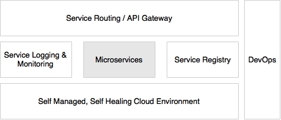

Notes: 

Most of the large-scale microservices implementations have a supporting ecosystem in place. The ecosystem capabilities include DevOps processes, centralized log management, service registry, API gateways, extensive monitoring, service routing, and flow control mechanisms.
Microservices work well when supporting capabilities are in place, as represented in the preceding diagram.


---

## Microservices are distributed and dynamic


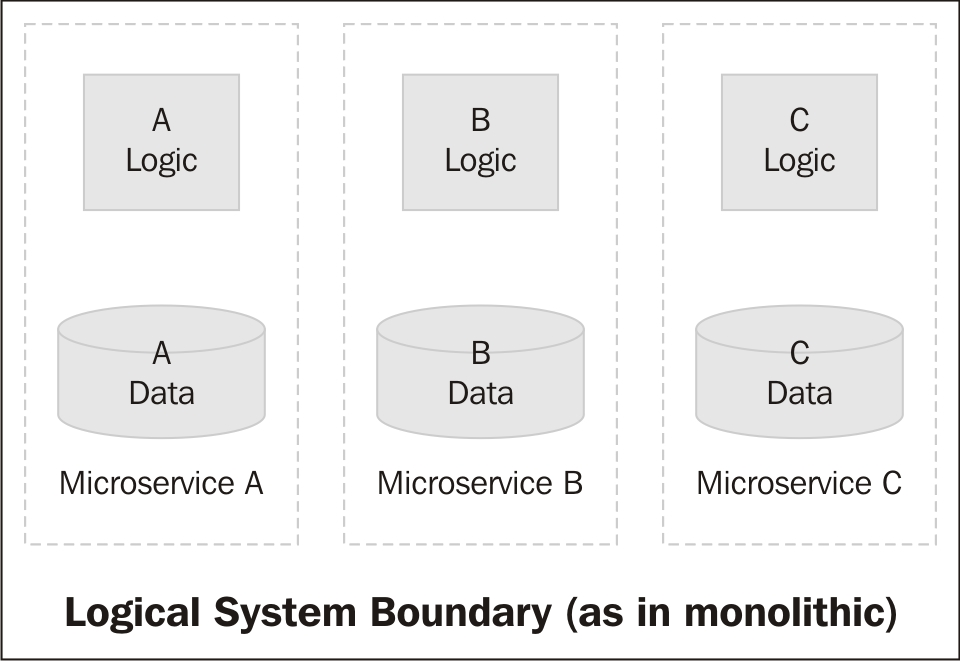

Notes: 

Successful microservices implementations encapsulate logic and data within the service. This results in two unconventional situations: distributed data and logic and decentralized governance.
Compared to traditional applications, which consolidate all logic and data into one application boundary, microservices decentralize data and logic. Each service, aligned to a specific business capability, owns its data and logic.
The dotted line in the preceding diagram implies the logical monolithic application boundary. When we migrate this to microservices, each microservice A, B, and C creates its own physical boundaries.
Microservices don't typically use centralized governance mechanisms the way they are used in SOA. One of the common characteristics of microservices implementations is that they do not relay on heavyweight enterprise-level products, such as Enterprise Service Bus (ESB). Instead, the business logic and intelligence are embedded as a part of the services themselves.


---

## Microservices are distributed and dynamic


 * Microservices are distributed and dynamic

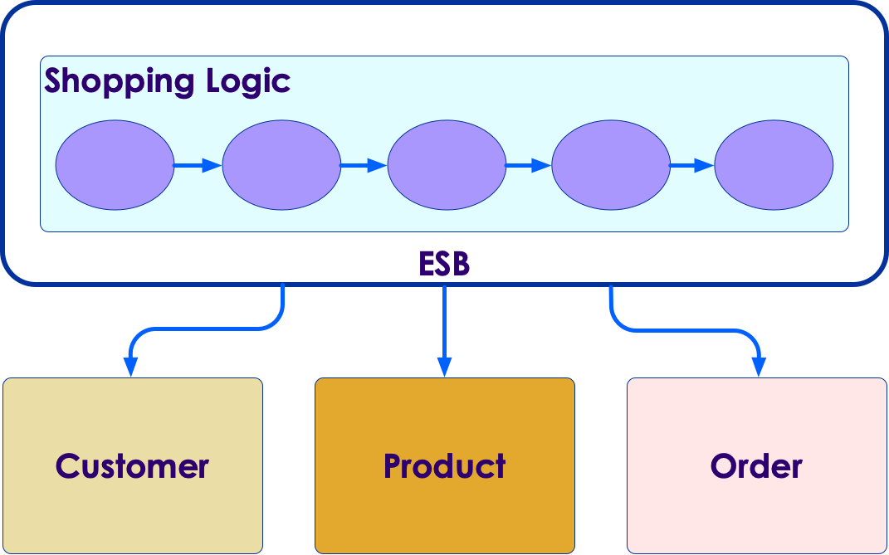

Notes: 

A typical SOA implementation is shown in the preceding diagram. Shopping logic is fully implemented in ESB by orchestrating different services exposed by Customer, Order, and Product. In the microservices approach, on the other hand, Shopping itself will run as a separate microservice, which interacts with Customer, Product, and Order in a fairly decoupled way.
SOA implementations heavily relay on static registry and repository configurations to manage services and other artifacts. Microservices bring a more dynamic nature into this. Hence, a static governance approach is seen as an overhead in maintaining up-to-date information. This is why most of the microservices implementations use automated mechanisms to build registry information dynamically from the runtime topologies.


---

## Antifragility, fail fast, and self-healing


 * Software systems are consistently challenged

 * Fail fast is another concept used to build fault-tolerant, resilient systems

Notes: 

Antifragility is a technique successfully experimented at Netflix. It is one of the most powerful approaches to building fail-safe systems in modern software development.
In the antifragility practice, software systems are consistently challenged. Software systems evolve through these challenges and, over a period of time, get better and better at withstanding these challenges. Amazon's GameDay exercise and Netflix' Simian Army are good examples of such antifragility experiments.
Fail fast is another concept used to build fault-tolerant, resilient systems. This philosophy advocates systems that expect failures versus building systems that never fail. Importance should be given to how quickly the system can fail and if it fails, how quickly it can recover from this failure. With this approach, the focus is shifted from Mean Time Between Failures (MTBF) to Mean Time To Recover (MTTR). A key advantage of this approach is that if something goes wrong, it kills itself, and downstream functions aren't stressed.
Self-healing is commonly used in microservices deployments, where the system automatically learns from failures and adjusts itself. These systems also prevent future failures.


---

## Microservices Examples


 * Holiday Portal

 * A microservice-based order management system

 * A travel agent portal

Notes: 

There is no "one size fits all" approach when implementing microservices. In this section, different examples are analyzed to crystalize the microservices concept.


---

## Holiday Portal


Notes: 

In the first example, we will review a holiday portal, Fly By Points. Fly By Points collects points that are accumulated when a customer books a hotel, flight, or car through the online website. When the customer logs in to the Fly By Points website, he/she is able to see the points accumulated, personalized offers that can be availed of by redeeming the points, and upcoming trips if any.
Let's assume that the preceding page is the home page after login. There are two upcoming trips for Jeo, four personalized offers, and 21,123 loyalty points. When the user clicks on each of the boxes, the details are queried and displayed.


---

## Holiday Portal


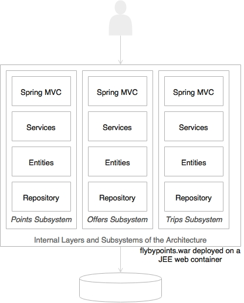

Notes: 

The holiday portal has a Java Spring-based traditional monolithic application architecture, as shown in the following:
As shown in the preceding diagram, the holiday portal's architecture is web-based and modular, with a clear separation between layers. Following the usual practice, the holiday portal is also deployed as a single WAR file on a web server such as Tomcat. Data is stored on an all-encompassing backing relational database. This is a good fit for the purpose architecture when the complexities are few. As the business grows, the user base expands, and the complexity also increases. This results in a proportional increase in transaction volumes. At this point, enterprises should look to rearchitecting the monolithic application to microservices for better speed of delivery, agility, and manageability.


---

## Holiday Portal


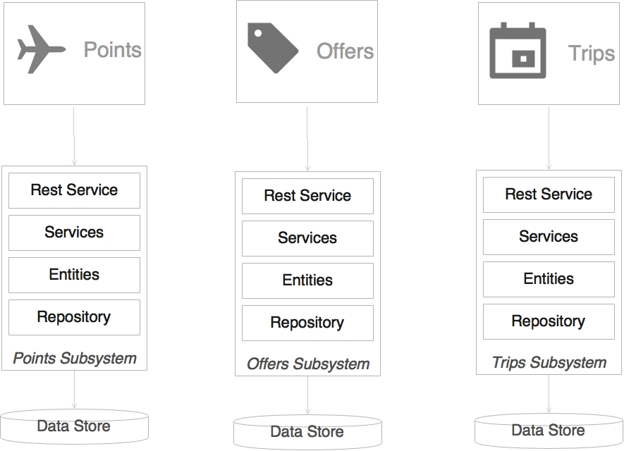

Notes: 

Examining the simple microservices version of this application, we can immediately note a few things in this architecture:
Each subsystem has now become an independent system by itself, a microservice. There are three microservices representing three business functions: Trips, Offers, and Points. Each one has its internal data store and middle layer. The internal structure of each service remains the same.
Each service encapsulates its own database as well as its own HTTP listener. As opposed to the previous model, there is no web server or WAR. Instead, each service has its own embedded HTTP listener, such as Jetty, Tomcat, and so on.
Each microservice exposes a REST service to manipulate the resources/entity that belong to this service.
It is assumed that the presentation layer is developed using a client-side JavaScript MVC framework such as Angular JS. These client-side frameworks are capable of invoking REST calls directly.
When the web page is loaded, all the three boxes, Trips, Offers, and Points will be displayed with details such as points, the number of offers, and the number of trips. This will be done by each box independently making asynchronous calls to the respective backend microservices using REST. There is no dependency between the services at the service layer. When the user clicks on any of the boxes, the screen will be transitioned and will load the details of the item clicked on. This will be done by making another call to the respective microservice.


---

## A microservice-based order management system


 * A microservice-based order management system

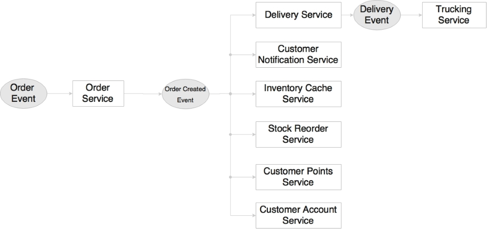

Notes: 

Let's examine another microservices example: an online retail website. In this case, we will focus more on the backend services, such as the Order Service which processes the Order Event generated when a customer places an order through the website:
This microservices system is completely designed based on reactive programming practices.
When an event is published, a number of microservices are ready to kick-start upon receiving the event. Each one of them is independent and does not rely on other microservices. The advantage of this model is that we can keep adding or replacing microservices to achieve specific needs.
In the preceding diagram, there are eight microservices shown. 


---

## A microservice-based order management system


 * Order Service kicks off when Order Event is received. Order Service creates an order and saves the details to its own database.

 * If the order is successfully saved, Order Successful Event is created by Order Service and published.

 * A series of actions take place when Order Successful Event arrives.

 * Delivery Service accepts the event and places Delivery Record to deliver the order to the customer. This, in turn, generates Delivery Event and publishes the event.

 * Trucking Service picks up Delivery Event and processes it. For instance, Trucking Service creates a trucking plan.

 * Customer Notification Service sends a notification to the customer informing the customer that an order is placed.

 * Inventory Cache Service updates the inventory cache with the available product count.

 * Stock Reorder Service checks whether the stock limits are adequate and generates Replenish Event if required.

 * Customer Points Service recalculates the customer's loyalty points based on this purchase.

 *  **Customer Account Service**  updates the order history in the customer's account.

Notes: 

The following activities take place upon the arrival of Order Event:
In this approach, each service is responsible for only one function. Services accept and generate events. Each service is independent and is not aware of its neighborhood. Hence, the neighborhood can organically grow as mentioned in the honeycomb analogy. New services can be added as and when necessary. Adding a new service does not impact any of the existing services.


---

## Travel agent portal


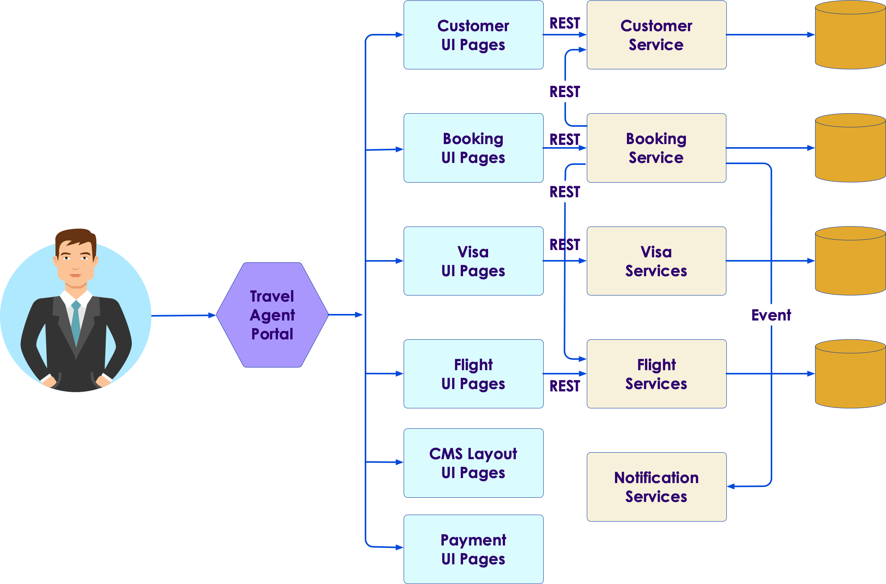

Notes: 

This third example is a simple travel agent portal application. In this example, we will see both synchronous REST calls as well as asynchronous events.
In this case, the portal is just a container application with multiple menu items or links in the portal. When specific pages are requested—for example, when the menu or a link is clicked on—they will be loaded from the specific microservices.
When a customer requests a booking, the following events take place internally:
The travel agent opens the flight UI, searches for a flight, and identifies the right flight for the customer. Behind the scenes, the flight UI is loaded from the Flight microservice. The flight UI only interacts with its own backend APIs within the Flight microservice. In this case, it makes a REST call to the Flight microservice to load the flights to be displayed.
The travel agent then queries the customer details by accessing the customer UI. Similar to the flight UI, the customer UI is loaded from the Customer microservice. Actions in the customer UI will invoke REST calls on the Customer microservice. In this case, customer details are loaded by invoking appropriate APIs on the Customer microservice.
Then, the travel agent checks the visa details for the customer's eligibility to travel to the selected country. This also follows the same pattern as mentioned in the previous two points.
Next, the travel agent makes a booking using the booking UI from the Booking microservice, which again follows the same pattern.
The payment pages are loaded from the Payment microservice. In general, the payment service has additional constraints such as PCIDSS compliance (protecting and encrypting data in motion and data at rest). The advantage of the microservices approach is that none of the other microservices need to be considered under the purview of PCIDSS as opposed to the monolithic application, where the complete application comes under the governing rules of PCIDSS. Payment also follows the same pattern as described earlier.
Once the booking is submitted, the Booking microservice calls the flight service to validate and update the flight booking. This orchestration is defined as part of the Booking microservice. Intelligence to make a booking is also held within the Booking microservice. As part of the booking process, it also validates, retrieves, and updates the Customer microservice.
Finally, the Booking microservice sends the Booking Event, which the Notification service picks up and sends a notification of to the customer.
The interesting factor here is that we can change the user interface, logic, and data of a microservice without impacting any other microservices.
This is a clean and neat approach. A number of portal applications can be built by composing different screens from different microservices, especially for different user communities. The overall behavior and navigation will be controlled by the portal application.
The approach has a number of challenges unless the pages are designed with this approach in mind. Note that the site layouts and static content will be loaded by the Content Management System (CMS) as layout templates. Alternately, this could be stored in a web server. The site layout may have fragments of UIs that will be loaded from the microservices at runtime.


---

## Microservices benefits


 * Supports polyglot architecture

 * Enabling experimentation and innovation

 * Elastically and selectively scalable

 * Allowing substitution

 * Enabling to build organic systems

 * Helping reducing technology debt

 * Allowing the coexistence of different versions

 * Supporting the building of self-organizing systems

 * Supporting event-driven architecture

 * Enabling DevOps

Notes: 

Microservices offer a number of benefits over the traditional multitier, monolithic architectures. This section explains some key benefits of the microservices architecture approach.


---

## Supports polyglot architecture


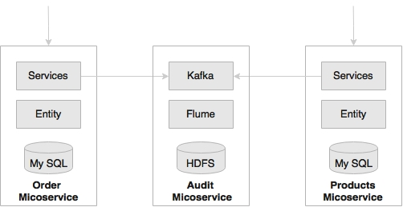

Notes: 

With microservices, architects and developers can choose fit for purpose architectures and technologies for each microservice. This gives the flexibility to design better-fit solutions in a more cost-effective way.
As microservices are autonomous and independent, each service can run with its own architecture or technology or different versions of technologies.
The following shows a simple, practical example of a polyglot architecture with microservices.
There is a requirement to audit all system transactions and record transaction details such as request and response data, the user who initiated the transaction, the service invoked, and so on.
As shown in the preceding diagram, while core services such as the Order and Products microservices use a relational data store, the Audit microservice persists data in Hadoop File System (HDFS). A relational data store is neither ideal nor cost effective in storing large data volumes such as in the case of audit data. In the monolithic approach, the application generally uses a shared, single database that stores Order, Products, and Audit data.
In this example, the audit service is a technical microservice using a different architecture. Similarly, different functional services could also use different architectures.
In another example, there could be a Reservation microservice running on Java 7, while a Search microservice could be running on Java 8. Similarly, an Order microservice could be written on Erlang, whereas a Delivery microservice could be on the Go language. None of these are possible with a monolithic architecture.


---

## Enabling experimentation and innovation


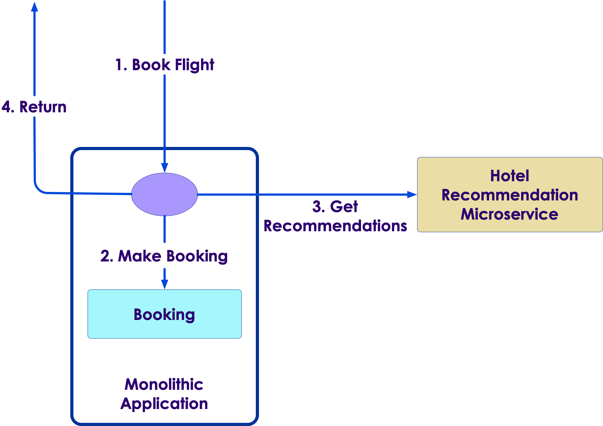

Notes: 

Modern enterprises are thriving towards quick wins. Microservices are one of the key enablers for enterprises to do disruptive innovation by offering the ability to experiment and fail fast.
As services are fairly simple and smaller in size, enterprises can afford to experiment new processes, algorithms, business logics, and so on. With large monolithic applications, experimentation was not easy; nor was it straightforward or cost effective. Businesses had to spend huge money to build or change an application to try out something new. With microservices, it is possible to write a small microservice to achieve the targeted functionality and plug it into the system in a reactive style. One can then experiment with the new function for a few months, and if the new microservice does not work as expected, we can change or replace it with another one. The cost of change will be considerably less compared to that of the monolithic approach.
In another example of an airline booking website, the airline wants to show personalized hotel recommendations in their booking page. The recommendations must be displayed on the booking confirmation page.
As shown in the preceding diagram, it is convenient to write a microservice that can be plugged into the monolithic applications booking flow rather than incorporating this requirement in the monolithic application itself. The airline may choose to start with a simple recommendation service and keep replacing it with newer versions till it meets the required accuracy.


---

## Elastically and selectively scalable


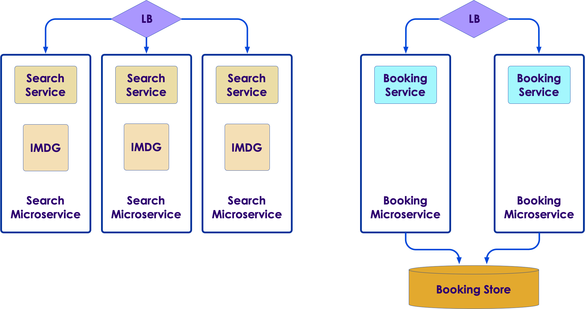

Notes: 

As microservices are smaller units of work, they enable us to implement selective scalability.
Scalability requirements may be different for different functions in an application. A monolithic application, packaged as a single WAR or an EAR, can only be scaled as a whole. An I/O-intensive function when streamed with high velocity data could easily bring down the service levels of the entire application.
In the case of microservices, each service could be independently scaled up or down. As scalability can be selectively applied at each service, the cost of scaling is comparatively less with the microservices approach.
In practice, there are many different ways available to scale an application and is largely subject to the architecture and behavior of the application. Scale Cube defines primarily three approaches to scaling an application:
Scaling the x axis by horizontally cloning the application
Scaling the y axis by splitting different functionality
Scaling the z axis by partitioning or sharding the data
When y axis scaling is applied to monolithic applications, it breaks the monolithic to smaller units aligned with business functions. Many organizations successfully applied this technique to move away from monolithic applications. In principle, the resulting units of functions are in line with the microservices characteristics.
For instance, in a typical airline website, statistics indicate that the ratio of flight searching to flight booking could be as high as 500:1. This means one booking transaction for every 500 search transactions. In this scenario, the search needs 500 times more scalability than the booking function. This is an ideal use case for selective scaling.
The solution is to treat search requests and booking requests differently. With a monolithic architecture, this is only possible with z scaling in the scale cube. However, this approach is expensive because in the z scale, the entire code base is replicated.
In the preceding diagram, Search and Booking are designed as different microservices so that Search can be scaled differently from Booking. In the diagram, Search has three instances, and Booking has two instances. Selective scalability is not limited to the number of instances, as shown in the diagram, but also in the way in which the microservices are architected. In the case of Search, an in-memory data grid (IMDG) such as Hazelcast can be used as the data store. This will further increase the performance and scalability of Search. When a new Search microservice instance is instantiated, an additional IMDG node is added to the IMDG cluster. Booking does not require the same level of scalability. In the case of Booking, both instances of the Booking microservice are connected to the same instance of the database.


---

## Allowing substitution


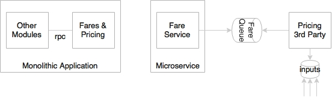

Notes: 

Microservices are self-contained, independent deployment modules enabling the substitution of one microservice with another similar microservice.
Many large enterprises follow buy-versus-build policies to implement software systems. A common scenario is to build most of the functions in house and buy certain niche capabilities from specialists outside. This poses challenges in traditional monolithic applications as these application components are highly cohesive. Attempting to plug in third-party solutions to the monolithic applications results in complex integrations. With microservices, this is not an afterthought. Architecturally, a microservice can be easily replaced by another microservice developed either in-house or even extended by a microservice from a third party.
A pricing engine in the airline business is complex. Fares for different routes are calculated using complex mathematical formulas known as the pricing logic. Airlines may choose to buy a pricing engine from the market instead of building the product in house. In the monolithic architecture, Pricing is a function of Fares and Booking. In most cases Pricing, Fares, and Booking are hardwired, making it almost impossible to detach.
In a well-designed microservices system, Booking, Fares, and Pricing would be independent microservices. Replacing the Pricing microservice will have only a minimal impact on any other services as they are all loosely coupled and independent. Today, it could be a third-party service; tomorrow, it could be easily substituted by another third-party or home-grown service.


---

## Enabling to build organic systems


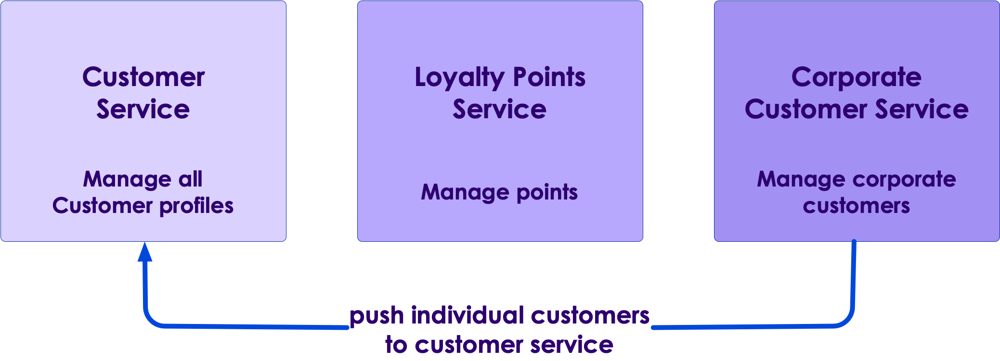

Notes: 

Microservices help us build systems that are organic in nature. This is significantly important when migrating monolithic systems gradually to microservices.
Organic systems are systems that grow laterally over a period of time by adding more and more functions to it. In practice, an application grows unimaginably large in its lifespan, and in most cases, the manageability of the application reduces dramatically over this same period of time.
Microservices are all about independently manageable services. This enable us to keep adding more and more services as the need arises with minimal impact on the existing services. Building such systems does not need huge capital investments. Hence, businesses can keep building as part of their operational expenditure.
A loyalty system in an airline was built years ago, targeting individual passengers. Everything was fine until the airline started offering loyalty benefits to their corporate customers. Corporate customers are individuals grouped under corporations. As the current systems core data model is flat, targeting individuals, the corporate environment needs a fundamental change in the core data model, and hence huge reworking, to incorporate this requirement.
As shown in the preceding diagram, in a microservices-based architecture, customer information would be managed by the Customer microservice and loyalty by the Loyalty Points microservice.
In this situation, it is easy to add a new Corporate Customer microservice to manage corporate customers. When a corporation is registered, individual members will be pushed to the Customer microservice to manage them as usual. The Corporate Customer microservice provides a corporate view by aggregating data from the Customer microservice. It will also provide services to support corporate-specific business rules. With this approach, adding new services will have only a minimal impact on the existing services.


---

## Helping reduce technology debt


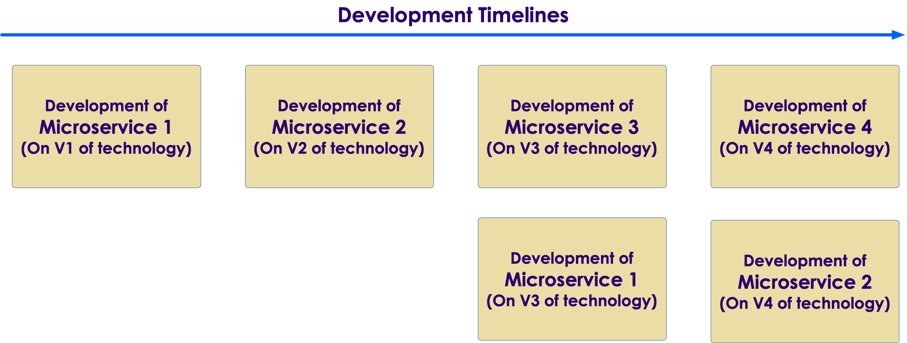

Notes: 

As microservices are smaller in size and have minimal dependencies, they allow the migration of services that use end-of-life technologies with minimal cost.
Technology changes are one of the barriers in software development. In many traditional monolithic applications, due to the fast changes in technologies, today's next-generation applications could easily become legacy even before their release to production. Architects and developers tend to add a lot of protection against technology changes by adding layers of abstractions. However, in reality, this approach does not solve the issue but, instead, results in over-engineered systems. As technology upgrades are often risky and expensive with no direct returns to business, the business may not be happy to invest in reducing the technology debt of the applications.
With microservices, it is possible to change or upgrade technology for each service individually rather than upgrading an entire application.
Upgrading an application with, for instance, five million lines written on EJB 1.1 and Hibernate to the Spring, JPA, and REST services is almost similar to rewriting the entire application. In the microservices world, this could be done incrementally.
As shown in the preceding diagram, while older versions of the services are running on old versions of technologies, new service developments can leverage the latest technologies. The cost of migrating microservices with end-of-life technologies is considerably less compared to enhancing monolithic applications.


---

## Allowing the coexistence of different versions


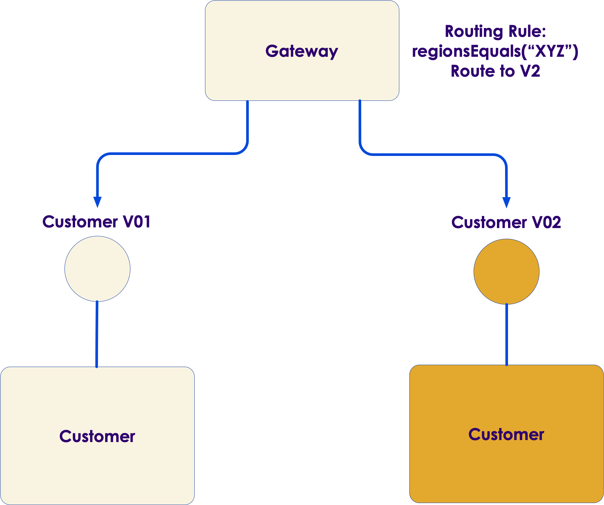

Notes: 

As microservices package the service runtime environment along with the service itself, this enables having multiple versions of the service to coexist in the same environment.
There will be situations where we will have to run multiple versions of the same service at the same time. Zero downtime promote, where one has to gracefully switch over from one version to another, is one example of a such a scenario as there will be a time window where both services will have to be up and running simultaneously. With monolithic applications, this is a complex procedure because upgrading new services in one node of the cluster is cumbersome as, for instance, this could lead to class loading issues. A canary release, where a new version is only released to a few users to validate the new service, is another example where multiple versions of the services have to coexist.
With microservices, both these scenarios are easily manageable. As each microservice uses independent environments, including service listeners such as Tomcat or Jetty embedded, multiple versions can be released and gracefully transitioned without many issues. When consumers look up services, they look for specific versions of services. For example, in a canary release, a new user interface is released to user A. When user A sends a request to the microservice, it looks up the canary release version, whereas all other users will continue to look up the last production version.
Care needs to be taken at the database level to ensure the database design is always backward compatible to avoid breaking the changes.
As shown in the preceding diagram, version 1 and 2 of the Customer service can coexist as they are not interfering with each other, given their respective deployment environments. Routing rules can be set at the gateway to divert traffic to specific instances, as shown in the diagram. Alternatively, clients can request specific versions as part of the request itself. In the diagram, the gateway selects the version based on the region from which the request is originated.


---

## Supporting the building of self-organizing systems


Notes: 

Microservices help us build self-organizing systems. A self-organizing system support will automate deployment, be resilient, and exhibit self-healing and self-learning capabilities.
In a well-architected microservices system, a service is unaware of other services. It accepts a message from a selected queue and processes it. At the end of the process, it may send out another message, which triggers other services. This allows us to drop any service into the ecosystem without analyzing the impact on the overall system. Based on the input and output, the service will self-organize into the ecosystem. No additional code changes or service orchestration is required. There is no central brain to control and coordinate the processes.
Imagine an existing notification service that listens to an INPUT queue and sends notifications to an SMTP server, as shown in the first figure:
Let's assume, later, a personalization engine, responsible for changing the language of the message to the customer's native language, needs to be introduced to personalize messages before sending them to the customer, the personalization engine is responsible for changing the language of the message to the customer's native language.

With microservices, a new personalization microservice will be created to do this job. The input queue will be configured as INPUT in an external configuration server, and the personalization service will pick up the messages from the INPUT queue (earlier, this was used by the notification service) and send the messages to the OUTPUT queue after completing process. The notification services input queue will then send to OUTPUT. From the very next moment onward, the system automatically adopts this new message flow.


---

## Supporting event-driven architecture


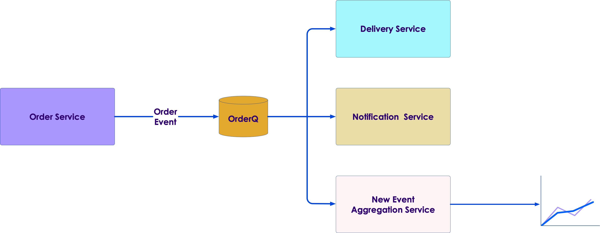

Notes: 

Microservices enable us to develop transparent software systems. Traditional systems communicate with each other through native protocols and hence behave like a black box application. Business events and system events, unless published explicitly, are hard to understand and analyze. Modern applications require data for business analysis, to understand dynamic system behaviors, and analyze market trends, and they also need to respond to real-time events. Events are useful mechanisms for data extraction.
A well-architected microservice always works with events for both input and output. These events can be tapped by any service. Once extracted, events can be used for a variety of use cases.
For example, the business wants to see the velocity of orders categorized by product type in real time. In a monolithic system, we need to think about how to extract these events. This may impose changes in the system.
In the microservices world, Order Event is already published whenever an order is created. This means that it is just a matter of adding a new service to subscribe to the same topic, extract the event, perform the requested aggregations, and push another event for the dashboard to consume.


---

## Enabling DevOps


 * Microservices is a key component of DevOps

 * Microservices is at the center of many DevOps implementation

Notes: 

Microservices are one of the key enablers of DevOps. DevOps is widely adopted as a practice in many enterprises, primarily to increase the speed of delivery and agility. A successful adoption of DevOps requires cultural changes, process changes, as well as architectural changes. DevOps advocates to have agile development, high-velocity release cycles, automatic testing, automatic infrastructure provisioning, and automated deployment.
Automating all these processes is extremely hard to achieve with traditional monolithic applications. Microservices are not the ultimate answer, but microservices are at the center stage in many DevOps implementations. Many DevOps tools and techniques are also evolving around the use of microservices.
Consider a monolithic application that takes hours to complete a full build and 20 to 30 minutes to start the application; one can see that this kind of application is not ideal for DevOps automation. It is hard to automate continuous integration on every commit. As large, monolithic applications are not automation friendly, continuous testing and deployments are also hard to achieve.
On the other hand, small footprint microservices are more automation-friendly and therefore can more easily support these requirements.
Microservices also enable smaller, focused agile teams for development. Teams will be organized based on the boundaries of microservices.


---

## Microservices Relationship with SOA 


 * Service-oriented Integration

 * Legacy modernization

 * Service-oriented Application

 * Monolithic migration using SOA

Notes: 

SOA and microservices follow similar concepts. Earlier in this chapter, we discussed that microservices are evolved from SOA, and many service characteristics are common in both approaches.
However, are they the same or are they different?
As microservices are evolved from SOA, many characteristics of microservices are similar to SOA. Let's first examine the definition of SOA.
The definition of SOA from The Open Group consortium is as follows:
We observed similar aspects in microservices as well. So, in what way are microservices different? The answer is: it depends.
The answer to the previous question could be yes or no, depending upon the organization and its adoption of SOA. SOA is a broader term, and different organizations approached SOA differently to solve different organizational problems. The difference between microservices and SOA is in a way based on how an organization approaches SOA.
In order to get clarity, a few cases will be examined.


---

## Service-oriented Integration


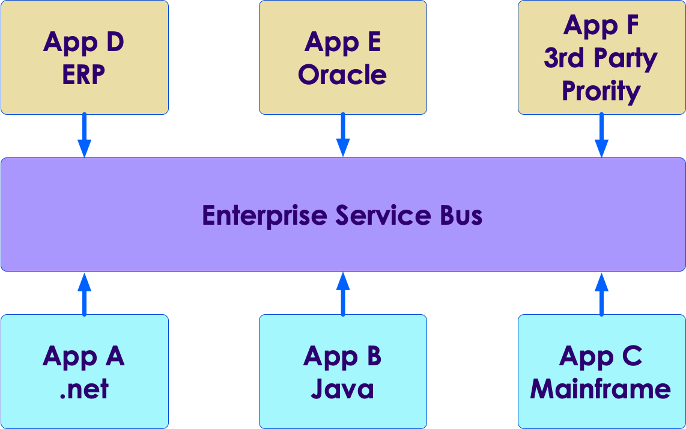

Notes: 

Service-oriented integration refers to a service-based integration approach used by many organizations. Many organizations would have used SOA primarily to solve their integration complexities, also known as integration spaghetti. Generally, this is termed as Service-Oriented Integration (SOI). In such cases, applications communicate with each other through a common integration layer using standard protocols and message formats such as SOAP/XML-based web services over HTTP or JMS. These types of organizations focus on Enterprise Integration Patterns (EIP) to model their integration requirements. This approach strongly relies on heavyweight ESB such as TIBCO Business Works, WebSphere ESB, Oracle ESB, and the likes. Most ESB vendors also packed a set of related products such as rules engines, business process management engines, and so on as an SOA suite. Such organizations' integrations are deeply rooted into their products. They either write heavy orchestration logic in the ESB layer or the business logic itself in the service bus. In both cases, all enterprise services are deployed and accessed via ESB. Theseservices are managed through an enterprise governance model. For such organizations, microservices are altogether different from SOA.


---

## Legacy modernization


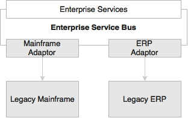

Notes: 

SOA is also used to build service layers on top of legacy applications.  Another category of organizations would use SOA in transformation projects or legacy modernization projects. In such cases, the services are built and deployed in the ESB layer connecting to backend systems using ESB adapters. For these organizations, microservices are different from SOA.


---

## Service-oriented Application


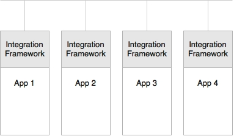

Notes: 

Some organizations adopt SOA at an application level.  In this approach, lightweight integration frameworks, such as Apache Camel or Spring Integration, are embedded within applications to handle service-related cross-cutting capabilities such as protocol mediation, parallel execution, orchestration, and service integration. As some of the lightweight integration frameworks have native Java object support, such applications would even use native Plain Old Java Objects (POJO) services for integration and data exchange between services. As a result, all services have to be packaged as one monolithic web archive. Such organizations could see microservices as the next logical step of their SOA.


---

## Monolithic migration using SOA


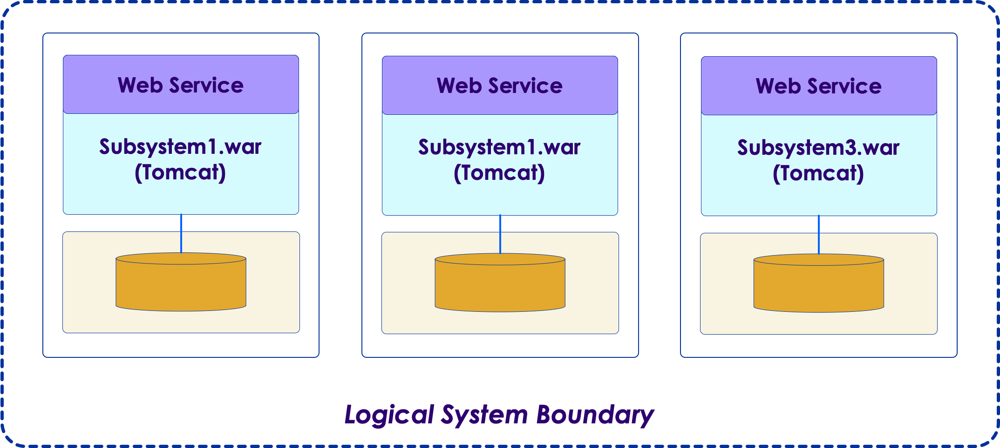

Notes: 

The last possibility is transforming a monolithic application into smaller units after hitting the breaking point with the monolithic system. They would break the application into smaller, physically deployable subsystems, similar to the yaxis scaling approach explained earlier, and deploy them as web archives on web servers or as JARs deployed on some home-grown containers. These subsystems as service would use web services or other lightweight protocols to exchange data between services. They would also use SOA and service design principles to achieve this. For such organizations, they may tend to think that microservices are the same old wine in a new bottle.


---

## Microservices Relationship with Twelve Factor apps


 * Single Code Base

 * Bundling Dependencies

 * Externalizing Configurations

 * Backing Services are Addressable

 * Isolation Between Build, Release and Run

 * Stateless Shared Nothing Processes

 * Exposing Services Through Port Bindings

 * Concurrency to Scale Out

 * Disposability with Minimal Overhead

 * Development and Production Parity

 * Externalizing Logs

 * Package Admin Processes

Notes: 

Cloud computing is one of the rapidly evolving technologies. Cloud computing promises many benefits, such as cost advantage, speed, agility, flexibility, and elasticity. There are many cloud providers offering different services. They lower the cost models to make it more attractive to the enterprises. Different cloud providers such as AWS, Microsoft, Rackspace, IBM, Google, and so on use different tools, technologies, and services. On the other hand, enterprises are aware of this evolving battlefield and, therefore, they are looking for options for de-risking from lockdown to a single vendor.
Many organizations do lift and shift their applications to the cloud. In such cases, the applications may not realize all the benefits promised by cloud platforms. Some applications need to undergo overhaul, whereas some may need minor tweaking before moving to cloud. This by and large depends upon how the application is architected and developed.
For example, if the application has its production database server URLs hardcoded as part of the applications WAR, it needs to be modified before moving the application to cloud. In the cloud, the infrastructure is transparent to the application, and especially, the physical IP addresses cannot be assumed.
How do we ensure that an application, or even microservices, can run seamlessly across multiple cloud providers and take advantages of cloud services such as elasticity?
It is important to follow certain principles while developing cloud native applications.
Twelve-Factor App, forwarded by Heroku, is a methodology describing the characteristics expected from modern cloud-ready applications. Twelve-Factor App is equally applicable for microservices as well. Hence, it is important to understand Twelve-Factor App.


---

## Single Code Base


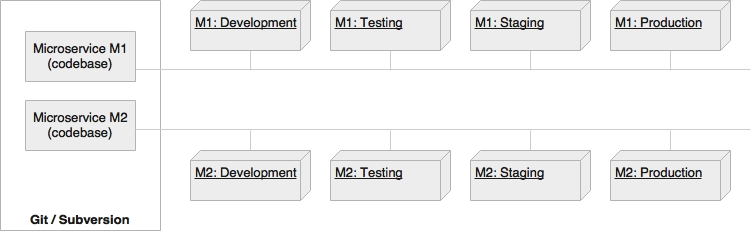

Notes: 

The code base principle advises that each application has a single code base. There can be multiple instances of deployment of the same code base, such as development, testing, and production. Code is typically managed in a source control system such as Git, Subversion, and so on.  Extending the same philosophy for microservices, each microservice should have its own code base, and this code base is not shared with any other microservice. It also means that one microservice has exactly one code base.


---

## Bundling Dependencies


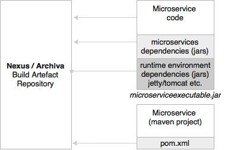

Notes: 

As per this principle, all applications should bundle their dependencies along with the application bundle. With build tools such as Maven and Gradle, we explicitly manage dependencies in a pom.xml or the .gradle file and link them using a central build artifact repository such as Nexus or Archiva. This ensures that the versions are managed correctly. The final executables will be packaged as a WAR file or an executable JAR file, embedding all the dependencies.  In the context of microservices, this is one of the fundamental principles to be followed. Each microservice should bundle all the required dependencies and execution libraries such as the HTTP listener and so on in the final executable bundle.


---

## Externalizing Configurations


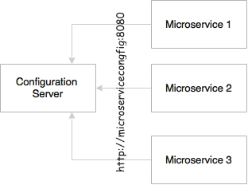

Notes: 

This principle advises the externalization of all configuration parameters from the code. An application's configuration parameters vary between environments, such as support to the e-mail IDs or URL of an external system, username, passwords, queue name, and so on. These will be different for development, testing, and production. All service configurations should be externalized.  The same principle is obvious for microservices as well. The microservices configuration parameters should be loaded from an external source. This will also help to automate the release and deployment process as the only difference between these environments is the configuration parameters.


---

## Backing Services are Addressable


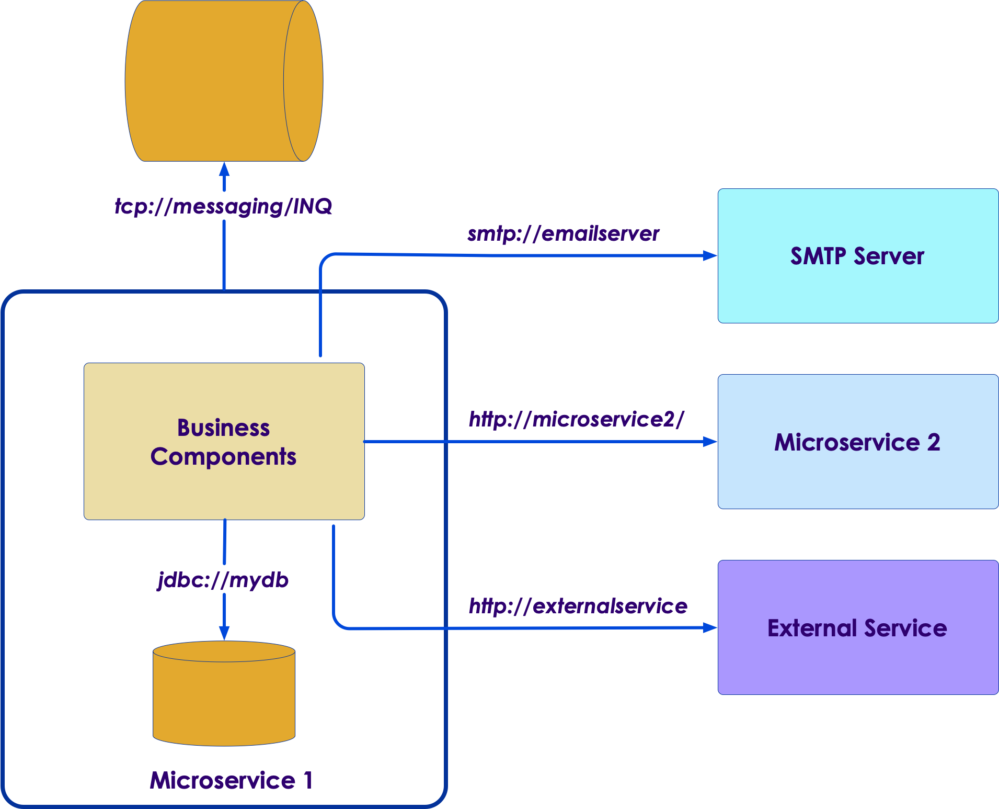

Notes: 

All backing services should be accessible through an addressable URL. All services need to talk to some external resources during the life cycle of their execution. For example, they could be listening or sending messages to a messaging system, sending an e-mail, persisting data to database, and so on. All these services should be reachable through a URL without complex communication requirements.  In the microservices world, microservices either talk to a messaging system to send or receive messages, or they could accept or send messages to other service APIs. In a regular case, these are either HTTP endpoints using REST and JSON or TCP- or HTTP-based messaging endpoints.


---

## Isolation Between Build, Release, and Run


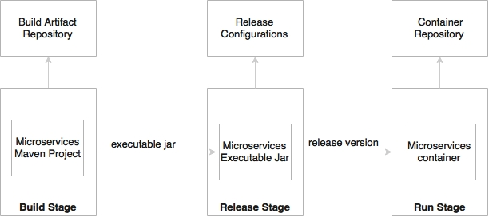

Notes: 

This principle advocates a strong isolation between the build, release, and run stages. The build stage refers to compiling and producing binaries by including all the assets required. The release stage refers to combining binaries with environment-specific configuration parameters. The run stage refers to running application on a specific execution environment. The pipeline is unidirectional, so it is not possible to propagate changes from the run stages back to the build stage. Essentially, it also means that it is not recommended to do specific builds for production; rather, it has to go through the pipeline.  
In microservices, the build will create executable JAR files, including the service runtime such as an HTTP listener. During the release phase, these executables will be combined with release configurations such as production URLs and so on and create a release version, most probably as a container similar to Docker. In the run stage, these containers will be deployed on production via a container scheduler.


---

## Stateless, Shared Nothing Processes


 * Fault tolerant

 * Easily scaled out

Notes: 

This principle suggests that processes should be stateless and share nothing. If the application is stateless, then it is fault tolerant and can be scaled out easily.
All microservices should be designed as stateless functions. If there is any requirement to store a state, it should be done with a backing database or in an in-memory cache.


---

## Exposing Services Through Port Bindings


Notes: 

A Twelve-Factor application is expected to be self-contained. Traditionally, applications are deployed to a server: a web server or an application server such as Apache Tomcat or JBoss. A Twelve-Factor application does not rely on an external web server. HTTP listeners such as Tomcat or Jetty have to be embedded in the service itself.
Port binding is one of the fundamental requirements for microservices to be autonomous and self-contained. Microservices embed service listeners as a part of the service itself.


---

## Concurrency to Scale Out


Notes: 

This principle states that processes should be designed to scale out by replicating the processes. This is in addition to the use of threads within the process.
In the microservices world, services are designed to scale out rather than scale up. The x axis scaling technique is primarily used for a scaling service by spinning up another identical service instance. The services can be elastically scaled or shrunk based on the traffic flow. Further to this, microservices may make use of parallel processing and concurrency frameworks to further speed up or scale up the transaction processing.


---

## Disposability with Minimal Overhead


Notes: 

This principle advocates building applications with minimal startup and shutdown times with graceful shutdown support. In an automated deployment environment, we should be able bring up or bring down instances as quick as possible. If the application's startup or shutdown takes considerable time, it will have an adverse effect on automation. The startup time is proportionally related to the size of the application. In a cloud environment targeting auto-scaling, we should be able to spin up new instance quickly. This is also applicable when promoting new versions of services.
In the microservices context, in order to achieve full automation, it is extremely important to keep the size of the application as thin as possible, with minimal startup and shutdown time. Microservices also should consider a lazy loading of objects and data.


---

## Development and Production Parity


Notes: 

This principle states the importance of keeping development and production environments as identical as possible. For example, let's consider an application with multiple services or processes, such as a job scheduler service, cache services, and one or more application services. In a development environment, we tend to run all of them on a single machine, whereas in production, we will facilitate independent machines to run each of these processes. This is primarily to manage the cost of infrastructure. The downside is that if production fails, there is no identical environment to re-produce and fix the issues.
Not only is this principle valid for microservices, but it is also applicable to any application development.


---

## Externalizing Logs


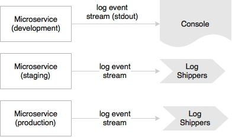

Notes: 

A Twelve-Factor application never attempts to store or ship log files. In a cloud, it is better to avoid local I/Os. If the I/Os are not fast enough in a given infrastructure, it could create a bottleneck. The solution to this is to use a centralized logging framework. Splunk, Greylog, Logstash, Logplex, and Loggly are some examples of log shipping and analysis tools. The recommended approach is to ship logs to a central repository by tapping the logback appenders and write to one of the shippers' endpoints.
In a microservices ecosystem, this is very important as we are breaking a system into a number of smaller services, which could result in decentralized logging. If they store logs in a local storage, it would be extremely difficult to correlate logs between services.
In development, the microservice may direct the log stream to stdout, whereas in production, these streams will be captured by the log shippers and sent to a central log service for storage and analysis.


---

## Package Admin Processes


Notes: 

Apart from application services, most applications provide admin tasks as well. This principle advises to use the same release bundle as well as an identical environment for both application services and admin tasks. Admin code should also be packaged along with the application code.
Not only is this principle valid for microservices, but also it is applicable to any application development.


---

## Microservices Use Cases


 * Migrating a monolithic application due to improvements required in scalability, manageability, agility, or speed of delivery. 

 * Utility computing scenarios such as integrating an optimization service, forecasting service, price calculation service, prediction service, offer service, recommendation service, and so on 

 * Headless business applications or services that are autonomous in nature—for instance, the payment service, login service, flight search service, customer profile service, notification service, and so on. 

 * Micro or macro applications that serve a single purpose and performing a single responsibility. 

 * Backend services of a well-architected, responsive client-side MVC web application (the  **Backend as a Service**  ( **BaaS** ) scenario) load data on demand in response to the user navigation. 

 * Highly agile applications, applications demanding speed of delivery or time to market, innovation pilots, applications selected for DevOps, applications of the System of Innovation type, and so on 

 * Applications that we could anticipate getting benefits from microservices such as polyglot requirements, applications that require  **Command Query Responsibility segregations**  ( **CQRS** ), and so on 

Notes: 

A microservice is not a silver bullet and will not solve all the architectural challenges of today's world. There is no hard-and-fast rule or rigid guideline on when to use microservices.
Microservices may not fit in each and every use case. The success of microservices largely depends on the selection of use cases. The first and the foremost activity is to do a litmus test of the use case against the microservices' benefits. The litmus test must cover all the microservices' benefits we discussed earlier in this chapter. For a given use case, if there are no quantifiable benefits or the cost outweighs the benefits, then the use case may not be the right choice for microservices.
Let's discuss some commonly used scenarios that are suitable candidates for a microservices architecture:
Migrating a monolithic application due to improvements required in scalability, manageability, agility, or speed of delivery. Another similar scenario is rewriting an end-of-life heavily used legacy application. In both cases, microservices present an opportunity. Using a microservices architecture, it is possible to replatform a legacy application by slowly transforming functions to microservices. There are benefits in this approach. There is no humongous upfront investment required, no major disruption to business, and no severe business risks. As the service dependencies are known, the microservices dependencies can be well managed.
Utility computing scenarios such as integrating an optimization service, forecasting service, price calculation service, prediction service, offer service, recommendation service, and so on are good candidates for microservices. These are independent stateless computing units that accept certain data, apply algorithms, and return the results. Independent technical services such as the communication service, the encryption service, authentication services, and so on are also good candidates for microservices.
In many cases, we can build headless business applications or services that are autonomous in nature—for instance, the payment service, login service, flight search service, customer profile service, notification service, and so on. These are normally reused across multiple channels and, hence, are good candidates for building them as microservices.
There could be micro or macro applications that serve a single purpose and performing a single responsibility. A simple time tracking application is an example of this category. All it does is capture the time, duration, and task performed. Common-use enterprise applications are also candidates for microservices.
Backend services of a well-architected, responsive client-side MVC web application (the Backend as a Service (BaaS) scenario) load data on demand in response to the user navigation. In most of these scenarios, data could be coming from multiple logically different data sources as described in the Fly By Points example mentioned earlier.
Highly agile applications, applications demanding speed of delivery or time to market, innovation pilots, applications selected for DevOps, applications of the System of Innovation type, and so on could also be considered as potential candidates for the microservices architecture.
Applications that we could anticipate getting benefits from microservices such as polyglot requirements, applications that require Command Query Responsibility segregations (CQRS), and so on are also potential candidates of the microservices architecture.


---

## When to consider avoiding using Microservices


 * If the organization's policies are forced to use centrally managed heavyweight components such as ESB to host a business logic or if the organization has any other policies that hinder the fundamental principles of microservices

 * If the organization's culture, processes, and so on are based on the traditional waterfall delivery model, lengthy release cycles, matrix teams, manual deployments and cumbersome release processes, no infrastructure provisioning, and so on

Notes: 

If the use case falls into any of these categories, it is a potential candidate for the microservices architecture.
There are few scenarios in which we should consider avoiding microservices:
If the organization's policies are forced to use centrally managed heavyweight components such as ESB to host a business logic or if the organization has any other policies that hinder the fundamental principles of microservices, then microservices are not the right solution unless the organizational process is relaxed.
If the organization's culture, processes, and so on are based on the traditional waterfall delivery model, lengthy release cycles, matrix teams, manual deployments and cumbersome release processes, no infrastructure provisioning, and so on, then microservices may not be the right fit. This is underpinned by Conway's Law. This states that there is a strong link between the organizational structure and software it creates.


---

## Microservices Early Adopters


 *  **Netflix**  (www.netflix.com)

 *  **Uber**  (www.uber.com)

 *  **Airbnb**  (www.airbnb.com)

 *  **Orbitz**  (www.orbitz.com)

 *  **eBay**  (www.ebay.com)

 *  **Amazon**  (www.amazon.com)

 *  **Gilt**  (www.gilt.com)

 *  **Twitter**  (www.twitter.com)

 *  **Nike**  (www.nike.com)

Notes: 

Many organizations have already successfully embarked on their journey to the microservices world. In this section, we will examine some of the frontrunners on the microservices space to analyze why they did what they did and how they did it. We will conduct some analysis at the end to draw some conclusions:
Netflix (www.netflix.com): Netflix, an international on-demand media streaming company, is a pioneer in the microservices space. Netflix transformed their large pool of developers developing traditional monolithic code to smaller development teams producing microservices. These microservices work together to stream digital media to millions of Netflix customers. At Netflix, engineers started with monolithic, went through the pain, and then broke the application into smaller units that are loosely coupled and aligned to the business capability.
Uber (www.uber.com): Uber, an international transportation network company, began in 2008 with a monolithic architecture with a single code base. All services were embedded into the monolithic application. When Uber expanded their business from one city to multiple cities, the challenges started. Uber then moved to SOA-based architecture by breaking the system into smaller independent units. Each module was given to different teams and empowered them to choose their language, framework, and database. Uber has many microservices deployed in their ecosystem using RPC and REST.
Airbnb (www.airbnb.com): Airbnb, a world leader providing a trusted marketplace for accommodation, started with a monolithic application that performed all the required functions of the business. Airbnb faced scalability issues with increased traffic. A single code base became too complicated to manage, resulted in a poor separation of concerns, and ran into performance issues. Airbnb broke their monolithic application into smaller pieces with separate code bases running on separate machines with separate deployment cycles. Airbnb developed their own microservices or SOA ecosystem around these services.
Orbitz (www.orbitz.com): Orbitz, an online travel portal, started with a monolithic architecture in the 2000s with a web layer, a business layer, and a database layer. As Orbitz expanded their business, they faced manageability and scalability issues with monolithic-tiered architecture. Orbitz then went through continuous architecture changes. Later, Orbitz broke down their monolithic to many smaller applications.
eBay (www.ebay.com): eBay, one of the largest online retailers, started in the late 1990s with a monolithic Perl application and FreeBSD as the database. eBay went through scaling issues as the business grew. It was consistently investing in improving its architecture. In the mid 2000s, eBay moved to smaller decomposed systems based on Java and web services. They employed database partitions and functional segregation to meet the required scalability.
Amazon (www.amazon.com): Amazon, one of the largest online retailer websites, was run on a big monolithic application written on C++ in 2001. The well-architected monolithic application was based on a tiered architecture with many modular components. However, all these components were tightly coupled. As a result, Amazon was not able to speed up their development cycle by splitting teams into smaller groups. Amazon then separated out the code as independent functional services, wrapped with web services, and eventually advanced to microservices.
Gilt (www.gilt.com): Gilt, an online shopping website, began in 2007 with a tiered monolithic Rails application and a Postgres database at the back. Similarly to many other applications, as traffic volumes increased, the web application was not able to provide the required resiliency. Gilt went through an architecture overhaul by introducing Java and polyglot persistence. Later, Gilt moved to many smaller applications using the microservices concept.
Twitter (www.twitter.com): Twitter, one of the largest social websites, began with a three-tiered monolithic rails application in the mid 2000s. Later, when Twitter experienced growth in its user base, they went through an architecture-refactoring cycle. With this refactoring, Twitter moved away from a typical web application to an API-based even driven core. Twitter uses Scala and Java to develop microservices with polyglot persistence.
Nike (www.nike.com): Nike, the world leader in apparel and footwear, transformed their monolithic applications to microservices. Similarly to many other organizations, Nike too was run with age-old legacy applications that were hardly stable. In their journey, Nike moved to heavyweight commercial products with an objective to stabilize legacy applications but ended up in monolithic applications that were expensive to scale, had long release cycles, and needed too much manual work to deploy and manage applications. Later, Nike moved to a microservices-based architecture that brought down the development cycle considerably.


---

## Common Theme


 * Monolithic Migrations!

Notes: 

When we analyze the preceding enterprises, there is one common theme. All these enterprises started with monolithic applications and transitioned to a microservices architecture by applying learning and pain points from their previous editions.
Even today, many start-ups begin with monolith as it is easy to start, conceptualize, and then slowly move to microservices when the demand arises. Monolithic to microservices migration scenarios have an added advantage: they have all the information upfront, readily available for refactoring.
Though, for all these enterprises, it is monolithic transformation, the catalysts were different for different organizations. Some of the common motivations are a lack of scalability, long development cycles, process automation, manageability, and changes in the business models.
While monolithic migrations are no-brainers, there are opportunities to build microservices from the ground up. More than building ground-up systems, look for opportunities to build smaller services that are quick wins for business—for example, adding a trucking service to an airline's end-to-end cargo management system or adding a customer scoring service to a retailer's loyalty system. These could be implemented as independent microservices exchanging messages with their respective monolithic applications.
Another point is that many organizations use microservices only for their business-critical customer engagement applications, leaving the rest of the legacy monolithic applications to take their own trajectory.
Another important observation is that most of the organizations examined previously are at different levels of maturity in their microservices journey. When eBay transitioned from a monolithic application in the early 2000s, they functionally split the application into smaller, independent, and deployable units. These logically divided units are wrapped with web services. While single responsibility and autonomy are their underpinning principles, the architectures are limited to the technologies and tools available at that point in time. Organizations such as Netflix and Airbnb built capabilities of their own to solve the specific challenges they faced. To summarize, all of these are not truly microservices, but are small, business-aligned services following the same characteristics.
There is no state called "definite or ultimate microservices". It is a journey and is evolving and maturing day by day. The mantra for architects and developers is the replaceability principle; build an architecture that maximizes the ability to replace its parts and minimizes the cost of replacing its parts. The bottom line is that enterprises shouldn't attempt to develop microservices by just following the hype.
In this chapter, you learned about the fundamentals of microservices with the help of a few examples.
We explored the evolution of microservices from traditional monolithic applications. We examined some of the principles and the mind shift required for modern application architectures. We also took a look at the characteristics and benefits of microservices and use cases. In this chapter, we established the microservices' relationship with service-oriented architecture and Twelve-Factor Apps. Lastly, we analyzed examples of a few enterprises from different industries.
We will develop a few sample microservices in the next chapter to bring more clarity to our learnings in this chapter.


---

## Building Microservices with Spring Boot


 * Setting up the latest Spring development environment

 * Developing RESTful services using the Spring framework

 * Using Spring Boot to build fully qualified microservices

 * Useful Spring Boot features to build production-ready microservices

Notes: 

Developing microservices is not so tedious anymore thanks to the powerful Spring Boot framework. Spring Boot is a framework to develop production-ready microservices in Java.
This session will move from the microservices theory explained in the previous session to hands-on practice by reviewing code samples. This session will introduce the Spring Boot framework and explain how Spring Boot can help build RESTful microservices in line with the principles and characteristics discussed in the previous session. Finally, some of the features offered by Spring Boot to make microservices production-ready will be reviewed.
By the end of this session, you will have learned about:


---

## Setting up a Development Environment


 *  **JDK 1.8** : http://www.oracle.com/technetwork/java/javase/downloads/jdk8-downloads-2133151.html

 *  **Spring Tool Suite 4**  ( **STS** ): https://spring.io/tools/sts/all

 *  **Maven 3.3.1** : https://maven.apache.org/download.cgi

 * We are doing this class based on the following versions of Spring libraries:

 * Spring Framework 4.2.6.RELEASE

 * Spring Boot 2.1.6.RELEASE

Notes: 

Alternately, other IDEs such as IntelliJ IDEA, NetBeans, or Eclipse could be used. Similarly, alternate build tools such as Gradle can be used. It is assumed that the Maven repository, class path, and other path variables are set properly to run STS and Maven projects.


---

## Build a Legacy Rest Appliction with Spring (optional)


 * Please complete LAB 1 : https://jmp.sh/2xiRgOF

Notes: 

PROJECT 1: legacyrest-------------------------------move to legacyrest projectcopy target/session2-1.0.0-BUILD-SNAPSHOT.war to Tomcat's webapps folder start tomcat serveropen http://localhost:8080/ in a browser window

Debug steps:  
Lab 1:  
You can use Spring Starter Project
You can also right click on the project and chose update project
Go to Windows and View Package Explorer
Right click on .java --- go to Source - get getters and setters


---

## Legacy to Microservices


 * Carefully examining the preceding RESTful service will reveal whether this really constitutes a microservice. 

 * At first glance, the preceding RESTful service is a fully qualified interoperable REST/JSON service. 

 * However, it is not fully autonomous in nature. 

     - This is primarily because the service relies on an underlying application server or web container. 

 * This is a traditional approach to developing RESTful services as a web application. However, from the microservices point of view, one needs a mechanism to develop services as executables, self-contained JAR files with an embedded HTTP listener.

     - Spring Boot is a tool that allows easy development of such kinds of services. Dropwizard and WildFly Swarm are alternate server-less RESTful stacks.

Notes: 

In the preceding example, a war was explicitly created and deployed on a Tomcat server.


---

## Use Spring Boot to Build Microservices


 * Spring Boot is a utility framework from the Spring team to bootstrap Spring-based applications and microservices quickly and easily. 

     - The framework uses an opinionated approach over configurations for decision making, thereby reducing the effort required in writing a lot of boilerplate code and configurations. 

 * Using the 80-20 principle, developers should be able to kickstart a variety of Spring applications with many default values. 

     - Spring Boot further presents opportunities for the developers to customize applications by overriding the autoconfigured values.

Notes: 

Spring Boot not only increases the speed of development but also provides a set of production-ready ops features such as health checks and metrics collection. As Spring Boot masks many configuration parameters and abstracts many lower-level implementations, it minimizes the chance of error to a certain extent. Spring Boot recognizes the nature of the application based on the libraries available in the class path and runs the autoconfiguration classes packaged in these libraries.


---

## Use Spring Boot to Build Microservices


 * <dependency>

 * 	<groupId>org.springframework.boot</groupId>

 * 	<artifactId>spring-boot-starter-data-jpa</artifactId>

 * </dependency>

 * <dependency>

 * 	<groupId>org.hsqldb</groupId>

 * 	<artifactId>hsqldb</artifactId>

 * 	<scope>runtime</scope>

 * </dependency>

Notes: 

Often, many developers mistakenly see Spring Boot as a code generator, but in reality, it is not. Spring Boot only autoconfigures build files—for example, POM files in the case of Maven. It also sets properties, such as data source properties, based on certain opinionated defaults. Take a look at the code:

Spring Boot understands that the project is set to use the Spring Data JPA and HSQL databases. It automatically configures the driver class and other connection parameters.
One of the great outcomes of Spring Boot is that it almost eliminates the need to have traditional XML configurations. Spring Boot also enables microservices' development by packaging all the required runtime dependencies in a fat executable JAR file.


---

## Let's Get Started with Spring Boot


 * Using the Spring Boot CLI as a command-line tool

 * Using IDEs such as STS to provide Spring Boot, which are supported out of the box

 * Using the Spring Initializr project at http://start.spring.io

Notes: 

There are different ways that Spring Boot-based application development can be started:


---

## CLI


 * The easiest way to develop and demonstrate Spring Boot's capabilities is using the Spring Boot CLI, a command-line tool.

 * Complete Lab 2:   https://jmp.sh/YW2fGnV

Notes: 

There is no war file created, and no Tomcat server was run. Spring Boot automatically picked up Tomcat as the webserver and embedded it into the application. This is a very basic, minimal microservice. The @RestControllerannotation, used in the previous code, will be examined in detail in the next example.


---

## Lab 3 - Create a Spring Boot Java Microservice with STS


 * Lab 3 : https://jmp.sh/PHm3TQX

Notes: 


---

## POM File


 * <parent>

 *   <groupId>org.springframework.boot</groupId>

 * 	<artifactId>spring-boot-starter-parent</artifactId>

 * 	<version>1.3.4.RELEASE</version>

 * </parent>

Notes: 

The spring-boot-starter-parent pattern is a bill of materials (BOM), a pattern used by Maven's dependency management. BOM is a special kind of POM file used to manage different library versions required for a project. The advantage of using the spring-boot-starter-parent POM file is that developers need not worry about finding the right compatible versions of different libraries such as Spring, Jersey, JUnit, Logback, Hibernate, Jackson, and so on. For instance, in our first legacy example, a specific version of the Jackson library was added to work with Spring 4. In this example, these are taken care of by the spring-boot-starter-parent pattern.
The starter POM file has a list of Boot dependencies, sensible resource filtering, and sensible plug-in configurations required for the Maven builds.
Tip
Refer to https://github.com/spring-projects/spring-boot/blob/1.3.x/spring-boot-dependencies/pom.xml to take a look at the different dependencies provided in the starter parent (version 1.3.x). All these dependencies can be overridden if required.
The starter POM file itself does not add JAR dependencies to the project. Instead, it will only add library versions. Subsequently, when dependencies are added to the POM file, they refer to the library versions from this POM file.


---

## POM File Properties


 * <spring-boot.version>2.1.6.BUILD-SNAPSHOT</spring-boot.version>

 * <hibernate.version>4.3.11.Final</hibernate.version>

 * <jackson.version>2.6.6</jackson.version>

 * <jersey.version>2.22.2</jersey.version>

 * <logback.version>1.1.7</logback.version>

 * <spring.version>4.2.6.RELEASE</spring.version>

 * <spring-data-releasetrain.version>Gosling-SR4</spring-data-releasetrain.version>

 * <tomcat.version>8.0.33</tomcat.version>

Notes: 


---

## More POM File Review


 * <dependencies>

 *    <dependency>

 *   <groupId>org.springframework.boot</groupId>

 *   <artifactId>spring-boot-starter-web</artifactId>

 *    </dependency>

 *    <dependency>

 *   <groupId>org.springframework.boot</groupId>

 *   <artifactId>spring-boot-starter-test</artifactId>

 *   <scope>test</scope>

 *    </dependency>

 * </dependencies>

Notes: 

Reviewing the dependency section, one can see that this is a clean and neat POM file with only two dependencies, as follows:


As web is selected, spring-boot-starter-web adds all dependencies required for a Spring MVC project. It also includes dependencies to Tomcat as an embedded HTTP listener. This provides an effective way to get all the dependencies required as a single bundle. Individual dependencies could be replaced with other libraries, for example replacing Tomcat with Jetty.
Similar to web, Spring Boot comes up with a number of spring-boot-starter-* libraries, such as amqp, aop, batch, data-jpa, thymeleaf, and so on.


---

## Java Version in the POM File


 * `<java.version>1.8</java.version>`

Notes: 

The last thing to be reviewed in the `pom.xml` file is the Java 8 property. By default, the parent POM file adds Java 6. It is recommended to override the Java version to 8 for Spring:


---

## Application.java


 * Spring Boot, by default, generated a org.rvslab.session2.Application.java class under src/main/java to bootstrap, as follows:

```java

@SpringBootApplication

public class Application {
   public static void main(String[] args) {
    	SpringApplication.run(Application.class, args);
  }

}
```

Notes: 

There is only a main method in Application, which will be invoked at startup as per the Java convention. The main method bootstraps the Spring Boot application by calling the run method on SpringApplication. Application.class is passed as a parameter to tell Spring Boot that this is the primary component.


`<application_name>Application.java`

Args in the slides can be server.port etc.  
YAML files are also located at the root where


---

## More Application.java


 * Java code:

```java
@Configuration

@EnableAutoConfiguration

@ComponentScan

public class Application {
}
```

Notes: 

More importantly, the magic is done by the @SpringBootApplication (prior slide) annotation. The @SpringBootApplication annotation is a top-level annotation that encapsulates three other annotations, as shown in the following code snippet:

The @Configuration annotation hints that the contained class declares one or more @Bean definitions. The @Configuration annotation is meta-annotated with @Component; therefore, it is a candidate for component scanning.
The @EnableAutoConfiguration annotation tells Spring Boot to automatically configure the Spring application based on the dependencies available in the class path.


---

## application.properties


 * A default  file is placed under src/main/resources. 

 * It is an important file to configure any required properties for the Spring Boot application.

Notes: 

At the moment, this file is kept empty and will be revisited with some test cases later in this session.

Quick test:  in <NAME>application.properties  just add this and restart
server.port=8282

Tomcat will listen on 8082 then

*just a hint for any paths --- like logging.path    use /    not \    ... even on Windows

*Have the students go here and add a few properties and restart:

https://docs.spring.io/spring-boot/docs/current/reference/html/common-application-properties.html


---

## ApplicationTests.java


 * The last file to be examined is  under src/test/java. 

     - This is a placeholder to write test cases against the Spring Boot application.

Notes: 


---

## Implement a RESTful Web Service : Lab


 * Lab 4 : https://jmp.sh/kQbFFuR

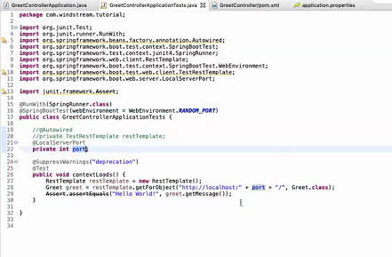

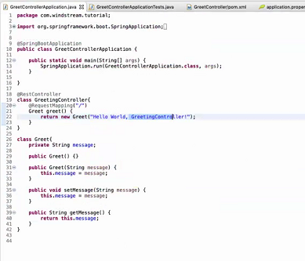

Notes: 

From POM file - rt click on pom file --- run `mvn build install`

https://spring.io/guides/gs/testing-web/

Real solution is in the slides... lab guide needs to be updated


---

## HATEOAS


 * HATEOAS is a REST service pattern in which navigation links are provided as part of the payload metadata. 

 * The client application determines the state and follows the transition URLs provided as part of the state. 

 * This methodology is particularly useful in responsive mobile and web applications in which the client downloads additional data based on user navigation patterns.

Notes: 

In the next example, Spring Initializr will be used to create a Spring Boot project. Spring Initializr is a drop-in replacement for the STS project wizard and provides a web UI to configure and generate a Spring Boot project. One of the advantages of Spring Initializr is that it can generate a project through the website that then can be imported into any IDE.
In the next lab, the concept of HATEOAS (short for Hypertext As The Engine Of Application State) for REST-based services and the HAL (Hypertext Application Language) browser will be examined.
The HAL browser is a handy API browser for hal+json data. HAL is a format based on JSON that establishes conventions to represent hyperlinks between resources. HAL helps APIs be more explorable and discoverable.


---

## HATEOAS : LAB 5


 * https://jmp.sh/n8QVINO

Notes: 

PROJECT 3: session2.boothateoas-------------------------------move to session2.boothateoas project$java target/boothateoas-0.0.1-SNAPSHOT.jar open http://localhost:8080/ in a browser window


---

## Momentum


 * A number of basic Spring Boot examples have been reviewed so far. 

 * The rest of this section will examine some of the Spring Boot features that are important from a microservices development perspective. 

 * In the upcoming sections, we will take a look at how to work with dynamically configurable properties, change the default embedded web server, add security to the microservices, and implement cross-origin behavior when dealing with microservices.

Notes: 


---

## Spring Boot Configuration


 * In this section, the focus will be on the configuration aspects of Spring Boot. 

 * The session2.bootrest project, already developed, will be modified in this section to showcase configuration capabilities. 

 * Copy and paste session2.bootrest and rename the project as session2.boot-advanced.

Notes: 


---

## Spring Boot autoconfiguration


 * Spring Boot uses convention over configuration by scanning the dependent libraries available in the class path. 

 * For each spring-boot-starter-* dependency in the POM file, Spring Boot executes a default AutoConfigurationclass. AutoConfiguration classes use the *AutoConfiguration lexical pattern, where * represents the library. 

     - For example, the autoconfiguration of JPA repositories is done through JpaRepositoriesAutoConfiguration.

 * Run the application with --debug to see the autoconfiguration report. The following command shows the autoconfiguration report for the session2.boot-advanced project:

 *  **$java -jar target/bootadvanced-0.0.1-SNAPSHOT.jar --debug** 

Notes: 

Go to right click on pom
Maven build and make the goal package or install and it will create the jar file.


---

## Autoconfiguration Classes


 * ServerPropertiesAutoConfiguration

 * RepositoryRestMvcAutoConfiguration

 * JpaRepositoriesAutoConfiguration

 * JmsAutoConfiguration

 * You can exclude the autoconfiguration of a library - here is an example:

 * @EnableAutoConfiguration(exclude={DataSourceAutoConfiguration.class})

Notes: 


---

## Overriding default config values


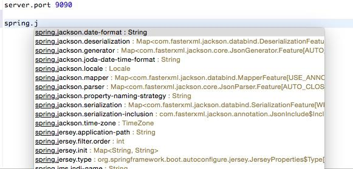

 * It is also possible to override default configuration values using the application.properties file. 

 * STS provides an easy-to-autocomplete, contextual help on application.properties, as shown in the following screenshot:

Notes: 

In the preceding screenshot, server.port is edited to be set as 9090. Running this application again will start the server on port 9090.


---

## Where is the config file?


 * Spring Boot externalizes all configurations into application.properties

 * spring.config.name= # config file name  

 * spring.config.location= # location of config file

 *  **$java -jar target/bootadvanced-0.0.1-SNAPSHOT.jar --spring.config.name=bootrest.properties** 

Notes: 

In order to align with the Twelve-Factor app, configuration parameters need to be externalized from the code. Spring Boot externalizes all configurations into application.properties. However, it is still part of the application's build. Furthermore, properties can be read from outside the package by setting the following properties:

Here, spring.config.location could be a local file location.

The last line launches the Spring Boot application with the externally defined config file


---

## Custom Property Files : Lab 6


 * At startup, SpringApplication loads all the properties and adds them to the Spring Environment class. 

 * Add a custom property to the application.properties file. 

 * In this case, the custom property is named bootrest.customproperty. 

 * Autowire the Spring Environment class into the GreetingController class. 

 * Edit the GreetingController class to read the custom property from Environment and add a log statement to print the custom property to the console.

 * Lab 6 : https://jmp.sh/illuGbD

Notes: 


---

## Default Web Server


 * Embedded HTTP listeners can easily be customized as follows. By default, Spring Boot supports Tomcat, Jetty, and Undertow. Replace Tomcat is replaced with Undertow (This is Lab 6.5):

 * <dependency>

 * 	<groupId>org.springframework.boot</groupId>

 * 	<artifactId>spring-boot-starter-web</artifactId>

 * 	<exclusions>

 *     	<exclusion>

 *         	<groupId>org.springframework.boot</groupId>

 *         	<artifactId>spring-boot-starter-tomcat</artifactId>

 *     	</exclusion>

 * 	</exclusions>

 * </dependency>

 * <dependency>

 * 	<groupId>org.springframework.boot</groupId>

 * 	<artifactId>spring-boot-starter-undertow</artifactId>

 * </dependency>

Notes: 


---

## Securing Microservices with basic security	


 * Adding basic authentication to Spring Boot is pretty simple. Add the following dependency to `pom.xml`. This will include the necessary Spring security library files:

```xml
<dependency>
  <groupId>org.springframework.boot</groupId>
  <artifactId>spring-boot-starter-security</artifactId>
</dependency>
```

Notes: 

It is important to secure microservices. In this section, some basic measures to secure Spring Boot microservices will be reviewed using session2.bootrest to demonstrate the security features.


---

## Securing Microservices with basic security	


 * Open `Application.java` and add @EnableGlobalMethodSecurity to the Application class. This annotation will enable method-level security:

```java
@EnableGlobalMethodSecurity
@SpringBootApplication
public class Application {
    public static void main(String[] args) {
        SpringApplication.run(Application.class, args);
    }
}
```

Notes: 


---

## Securing Microservices with basic security	


 * The default basic authentication assumes the user as being user. The default password will be printed in the console at startup. Alternately, the username and password can be added in application.properties, as shown here:

 * Application.properties:

```text
 security.user.name=guestsecurity.user.password=guest123
```

Notes: 


---

## Securing Microservices with basic security	


 * Here is the Java code:

```java


@Test
public void testSecureService() {
    String plainCreds = "guest:guest123";
    HttpHeaders headers = new HttpHeaders();
    headers.add("Authorization", "Basic " + new String(Base64.encode(plainCreds.getBytes())));
    HttpEntity<String> request = new HttpEntity<String>(headers);
    RestTemplate restTemplate = new RestTemplate();
    ResponseEntity<Greet> response = restTemplate.exchange("http://localhost:8080", HttpMethod.GET, request, Greet.class);
    Assert.assertEquals("Hello World!", response.getBody().getMessage());
}
```

Notes: 

Add a new test case in ApplicationTests to test the secure service results, as in the following:


---

## Securing Microservices with basic security	


 * Securing Microservices with basic security	

 * As shown in the code, a new Authorization request header with Base64 encoding the username-password string is created.

 * Rerun the application using Maven. Note that the new test case passed, but the old test case failed with an exception. The earlier test case now runs without credentials, and as a result, the server rejected the request with the following message:

 *  **org.springframework.web.client.HttpClientErrorException: 401 Unauthorized** 

Notes: 


---

## Securing a Microservice with OAuth2


 * When a client application requires access to a protected resource, the client sends a request to an authorization server. 

 * The authorization server validates the request and provides an access token. 

 * This access token is validated for every client-to-server request. 

 * The request and response sent back and forth depends on the grant type.

 * LAB 7 : OATH2 LAB : https://jmp.sh/C212HLk

Notes: 


---

## Enabling cross-origin access for Microservices	


 * Browsers are generally restricted when client-side web applications running from one origin request data from another origin. Enabling cross-origin access is generally termed as  **CORS**  ( **Cross-Origin Resource Sharing** ).

 * With microservices, as each service runs with its own origin, it will easily get into the issue of a client-side web application consuming data from multiple origins. For instance, a scenario where a browser client accessing Customer from the Customer microservice and Order History from the Order microservices is very common in the microservices world.

 * Spring Boot provides a simple declarative approach to enabling cross-origin requests. 

Notes: 


---

## Enabling cross-origin access for Microservices	


 * Enabling cross-origin access for Microservices	

 * The following example shows how to enable a microservice to enable cross-origin requests:

 * Java code:

```java

@RestController
class GreetingController{
  @CrossOrigin  
  @RequestMapping("/")
  Greet greet(){
    return new Greet("Hello World!");
  }
}


```

Notes: 


---

## Enabling cross-origin access for Microservices	


 * Enabling cross-origin access for Microservices	

 * By default, all the origins and headers are accepted. We can further customize the cross-origin annotations by giving access to specific origins, as follows. The @CrossOrigin annotation enables a method or class to accept cross-origin requests:

 * `@CrossOrigin("http://mytrustedorigin.com")`

 * Global CORS can be enabled using the WebMvcConfigurer bean and customizing the addCorsMappings(CorsRegistry registry) method.

Notes: 


---

## Implementing Spring Boot Messaging: Lab 8


 * Lab 8 :  https://jmp.sh/UGrAhXI

Notes: 


---

## Developing a comprehensive microservice example:  Lab 9	


 * So far, the examples we have considered are no more than just a simple "Hello world." Putting together what we have learned, this section demonstrates an end-to-end Customer Profile microservice implementation. 

 * The Customer Profile microservices will demonstrate interaction between different microservices. 

 * It also demonstrates microservices with business logic and primitive data stores.

 * The Customer Profile microservice exposes methods to  **create, read, update, and delete** ( **CRUD** ) a customer and a registration service to register a customer. 

 * The registration process applies certain business logic, saves the customer profile, and sends a message to the Customer Notification microservice. 

 * The Customer Notification microservice accepts the message sent by the registration service and sends an e-mail message to the customer using an SMTP server. 

 * Asynchronous messaging is used to integrate Customer Profile with the Customer Notification service.

 * Lab 9 : Complete End to End Microservice :  https://jmp.sh/eQfpQFC

Notes: 


---

## Spring Boot Actuators


 * Spring Boot actuators provide an excellent out-of-the-box mechanism to monitor and manage Spring Boot applications in production

 * Lab 10 - https://jmp.sh/wUXrzcs

Notes: 


---

## Monitoring Using JConsole


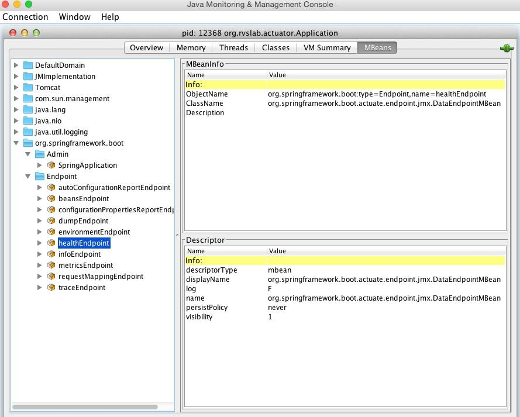

Notes: 

Alternately, we can use the JMX console to see the Spring Boot information. Connect to the remote Spring Boot instance from JConsole. The Boot information will be shown as above


---

## Monitoring Using SSH


 * Spring Boot provides remote access to the Boot application using SSH. The following command connects to the Spring Boot application from a terminal window:

 *  **$ ssh -p 2000 user@localhost** 

 * The password can be customized by adding the shell.auth.simple.user.password property in the application.properties file. The updated application.properties file will look similar to the following:

 * shell.auth.simple.user.password=admin

Notes: 

*If you have an SSH server running - then you can connect at the app server level.  B/c this is dockerized - you can also go in through docker
When connected with the preceding command, similar actuator information can be accessed. Here is an example of the metrics information accessed through the CLI:
help: This lists out all the options available
dashboard: This is one interesting feature that shows a lot of system-level information


---

## Configuring Application Information


 * management.endpoints.web.exposure.include=*

 * info.app.name=Boot Actuator

 * info.app.description=My Greetings Service

 * info.app.version=1.0.0

 * #endpoints.app.name=Boot Actuator

Notes: 

https://docs.spring.io/autorepo/docs/spring-boot/1.3.0.M1/reference/html/production-ready-endpoints.html
The following properties can be set in application.properties to customize application-related information.
 After adding, restart the server and visit the /info endpoint of the actuator to take a look at the updated information, as follows:   you may have to do:  /actuator/info
With Spring Boot 2.0.0.RC1, actuator endpoints must be 1) enabled and 2) exposed.
By default, all endpoints but shutdown are enabled and only health and info are exposed.
In your case, the following should work:
management.endpoints.web.expose=* # if you'd like to expose shutdown: # management.endpoint.shutdown.enabled=true
Note that this changes (again!) as of Spring Boot 2.0.0.RC2:
management.endpoints.web.exposure.include=* # if you'd like to expose shutdown: # management.endpoint.shutdown.enabled=true


---

## 


 * class TPSCounter {  LongAdder count;  int threshold = 2;  Calendar expiry = null;   TPSCounter(){    this.count = new LongAdder();    this.expiry = Calendar.getInstance();    this.expiry.add(Calendar.MINUTE, 1);  }    boolean isExpired(){    return Calendar.getInstance().after(expiry);  }    boolean isWeak(){    return (count.intValue() > threshold);  }    void increment(){     count.increment();  }}

Notes: 

Adding a new custom module to the Spring Boot application is not so complex. 
To demonstrate this feature, assume that if a service gets more than two transactions in a minute, then the server status will be set as Out of Service.
In order to customize this, we have to implement the HealthIndicator interface and override the health method. 
The preceding class is a simple POJO class that maintains the transaction counts in the window. The isWeakmethod checks whether the transaction...


---

## Documenting Microservices


 * The traditional approach of API documentation is either by writing service specification documents or using static service registries. 

 * With a large number of microservices, it would be hard to keep the documentation of APIs in sync.

 * <dependency>    <groupId>io.springfox<...

Notes: 

Microservices can be documented in many ways. 
This section will explore how microservices can be documented using the popular Swagger framework. 
The following example will use Springfox libraries to generate REST API documentation. Springfox is a set of Java- and Spring-friendly libraries.
As Springfox libraries are not part of the Spring suite, edit `pom.xml` and add `Springfox` Swagger library dependencies. Add the above dependencies to the project:


---

## Summary


Notes: 

Summary
In this session, you learned about Spring Boot and its key features to build production-ready applications.
We explored the previous-generation web applications and then how Spring Boot makes developers' lives easier to develop fully qualified microservices. We also discussed the asynchronous message-based interaction between services. Further, we explored how to achieve some of the key capabilities required for microservices, such as security, HATEOAS, cross-origin, configurations, and so on with practical examples. We also took a look at how Spring Boot actuators help the operations teams and also how we can customize it to our needs. Finally, documenting microservices APIs was also explored.
In the next session, we will take a deeper look at some of the practical issues that may arise when implementing microservices. We will also discuss a capability model that essentially helps organizations when dealing with large microservices implementations.


---

## 3 - Microservices Applied


 * Trade-offs between different design choices and patterns to be considered when developing microservices

 * Challenges and anti-patterns in developing enterprise grade microservices

 * A capability model for a microservices ecosystem

Notes: 

Microservices are good, but can also be an evil if they are not properly conceived. Wrong microservice interpretations could lead to irrecoverable failures.
This session will examine the technical challenges around practical implementations of microservices. It will also provide guidelines around critical design decisions for successful microservices development. The solutions and patterns for a number of commonly raised concerns around microservices will also be examined. This session will also review the challenges in enterprise scale microservices development, and how to overcome those challenges. More importantly, a capability model for a microservices ecosystem will be established at the end.
In this session you will learn about the following:


---

## Boundaries


 * One of the most common questions relating to microservices is regarding the size of the service. 

 * How big (mini-monolithic) or how small (nano service) can a microservice be, or is there anything like right-sized services? 

 * Does size really matter?

Notes: 

A quick answer could be "one REST endpoint per microservice", or "less than 300 lines of code", or "a component that performs a single responsibility". But before we pick up any of these answers, there is lot more analysis to be done to understand the boundaries for our services.
Domain-driven design (DDD) defines the concept of a bounded context. A bounded context is a subdomain or a subsystem of a larger domain or system that is responsible for performing a particular function.
Tip
Read more about DDD at http://domainlanguage.com/ddd/.


---

## Domains


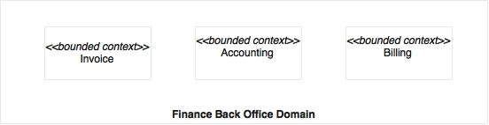

Notes: 

In a finance back office, system invoices, accounting, billing, and the like represent different bounded contexts. These bounded contexts are strongly isolated domains that are closely aligned with business capabilities. In the financial domain, the invoices, accounting, and billing are different business capabilities often handled by different subunits under the finance department.
A bounded context is a good way to determine the boundaries of microservices. Each bounded context could be mapped to a single microservice. In the real world, communication between bounded contexts are typically less coupled, and often, disconnected.
Even though real world organizational boundaries are the simplest mechanisms for establishing a bounded context, these may prove wrong in some cases due to inherent problems within the organization's structures. For example, a business capability may be delivered through different channels such as front offices, online, roaming agents, and so on. In many organizations, the business units may be organized based on delivery channels rather than the actual underlying business capabilities. In such cases, organization boundaries may not provide accurate service boundaries.
A top-down domain decomposition could be another way to establish the right bounded contexts.
There is no silver bullet to establish microservices boundaries, and often, this is quite challenging. Establishing boundaries is much easier in the scenario of monolithic application to microservices migration, as the service boundaries and dependencies are known from the existing system. On the other hand, in a green field microservices development, the dependencies are hard to establish upfront.
The most pragmatic way to design microservices boundaries is to run the scenario at hand through a number of possible options, just like a service litmus test. Keep in mind that there may be multiple conditions matching a given scenario that will lead to a trade-off analysis.


---

## Autonomous functions


 * If the function under review is autonomous by nature, then it can be taken as a microservices boundary. 

 * Autonomous services typically would have fewer dependencies on external functions. 

 * They accept input, use its internal logic and data for computation, and return a result. 

 * All utility functions such as an encryption engine or a notification engine are straightforward candidates.

Notes: 

A delivery service that accepts an order, processes it, and then informs the trucking service is another example of an autonomous service. An online flight search based on cached seat availability information is yet another example of an autonomous function.

Again - what is a good candidate for a microservice


---

## Size of a deployable unit


 * Most of the microservices ecosystems will take advantage of automation, such as automatic integration, delivery, deployment, and scaling. 

 * Microservices covering broader functions result in larger deployment units. 

 * Large deployment units pose challenges in automatic file copy, file download, deployment, and start up times. 

     - For instance, the size of a service increases with the density of the functions that it implements.

Notes: 

A good microservice ensures that the size of its deployable units remains manageable.


---

## Most appropriate function or subdomain


 * Most appropriate function or subdomain

 * It is important to analyze what would be the most useful component to detach from the monolithic application. 

 * This is particularly applicable when breaking monolithic applications into microservices. 

 * This could be based on parameters such as resource-intensiveness, cost of ownership, business benefits, or flexibility.

Notes: 

In a typical hotel booking system, approximately 50-60% of the requests are search-based. In this case, moving out the search function could immediately bring in flexibility, business benefits, cost reduction, resource free up, and so on.


---

## Polyglot architecture


 * One of the key characteristics of microservices is its support for polyglot architecture. 

 * In order to meet different non-functional and functional requirements, components may require different treatments. 

 * It could be different architectures, different technologies, different deployment topologies, and so on. 

 * When components are identified, review them against the requirement for polyglot architectures.

Notes: 

In the hotel booking scenario mentioned earlier, a Booking microservice may need transactional integrity, whereas a Search microservice may not. In this case, the Booking microservice may use an ACID compliance database such as MySQL, whereas the Search microservice may use an eventual consistent database such as Cassandra.


---

## Selective Scaling


 * Selective scaling is related to the previously discussed polyglot architecture. 

 * In this context, all functional modules may not require the same level of scalability. 

 * Sometimes, it may be appropriate to determine boundaries based on scalability requirements.

Notes: 

For example, in the hotel booking scenario, the Search microservice has to scale considerably more than many of the other services such as the Booking microservice or the Notification microservice due to the higher velocity of search requests. In this case, a separate Search microservice could run on top of an Elasticsearch or an in-memory data grid for better response.


---

## Small, agile teams


 * Microservices enable Agile development with small, focused teams developing different parts of the pie. 

 * There could be scenarios where parts of the systems are built by different organizations, or even across different geographies, or by teams with varying skill sets. 

 * This approach is a common practice, for example, in manufacturing industries.

Notes: 

In the microservices world, each of these teams builds different microservices, and then assembles them together. Though this is not the desired way to break down the system, organizations may end up in such situations. Hence, this approach cannot be completely ruled out.
In an online product search scenario, a service could provide personalized options based on what the customer is looking for. This may require complex machine learning algorithms, and hence need a specialist team. In this scenario, this function could be built as a microservice by a separate specialist team.


---

## Single Responsibility


 * In theory, the single responsibility principle could be applied at a method, at a class, or at a service. 

     - However, in the context of microservices, it does not necessarily map to a single service or endpoint.

 * A more practical approach could be to translate single responsibility into single business capability or a single technical capability. 

     - As per the single responsibility principle, one responsibility cannot be shared by multiple microservices. 

     - Similarly, one microservice should not perform multiple responsibilities.

Notes: 

There could, however, be special cases where a single business capability is divided across multiple services. One of such cases is managing the customer profile, where there could be situations where you may use two different microservices for managing reads and writes using a Command Query Responsibility Segregation (CQRS) approach to achieve some of the quality attributes.


---

## Replicate and Change


 * Innovation and speed are of the utmost importance in IT delivery. 

 * Microservices boundaries should be identified in such a way that each microservice is easily detachable from the overall system, with minimal cost of re-writing. 

 * If part of the system is just an experiment, it should ideally be isolated as a microservice.

Notes: 

An organization may develop a recommendation engine or a customer ranking engine as an experiment. If the business value is not realized, then throw away that service, or replace it with another one.
Many organizations follow the startup model, where importance is given to meeting functions and quick delivery. These organizations may not worry too much about the architecture and technologies. Instead, the focus will be on what tools or technologies can deliver solutions faster. Organizations increasingly choose the approach of developing Minimum Viable Products (MVPs) by putting together a few services, and allowing the system to evolve. Microservices play a vital role in such cases where the system evolves, and services gradually get rewritten or replaced.


---

## Coupling and Cohesion


 * Coupling and cohesion are two of the most important parameters for deciding service boundaries. 

 * Dependencies between microservices have to be evaluated carefully to avoid highly coupled interfaces. 

 * A functional decomposition, together with a modeled dependency tree, could help in establishing a microservices boundary. 

 * Avoiding too chatty services, too many synchronous request-response calls, and cyclic synchronous dependencies are three key points, as these could easily break the system.

Notes: 

A successful equation is to keep high cohesion within a microservice, and loose coupling between microservices. In addition to this, ensure that transaction boundaries are not stretched across microservices. A first class microservice will react upon receiving an event as an input, execute a number of internal functions, and finally send out another event. As part of the compute function, it may read and write data to its own local store.


---

## Microservice as a Product


 * DDD also recommends mapping a bounded context to a product. 

 * As per DDD, each bounded context is an ideal candidate for a product. 

 * Think about a microservice as a product by itself. 

 * When microservice boundaries are established, assess them from a product's point of view to see whether they really stack up as product. 

 * It is much easier for business users to think boundaries from a product point of view. 

 * A product boundary may have many parameters, such as a targeted community, flexibility in deployment, sell-ability, reusability, and so on.

Notes: 


---

## Synchronous Communication


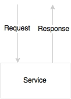

Notes: 

Communication between microservices can be designed either in synchronous (request-response) or asynchronous (fire and forget) styles.
Synchronous style communication
The following diagram shows an example request/response style service:
In synchronous communication, there is no shared state or object. When a caller requests a service, it passes the required information and waits for a response. This approach has a number of advantages.
An application is stateless, and from a high availability standpoint, many active instances can be up and running, accepting traffic. Since there are no other infrastructure dependencies such as a shared messaging server, there are management fewer overheads. In case of an error at any stage, the error will be propagated back to the caller immediately, leaving the system in a consistent state, without compromising data integrity.
The downside in a synchronous request-response communication is that the user or the caller has to wait until the requested process gets completed. As a result, the calling thread will wait for a response, and hence, this style could limit the scalability of the system.
synchronous style adds hard dependencies between microservices. If one service in the service chain fails, then the entire service chain will fail. In order for a service to succeed, all dependent services have to be up and running. Many of the failure scenarios have to be handled using timeouts and loops.


---

## Asynchronous Communication


Notes: 

The following diagram is a service designed to accept an asynchronous message as input, and send the response asynchronously for others to consume:
The asynchronous style is based on reactive event loop semantics which decouple microservices. This approach provides higher levels of scalability, because services are independent, and can internally spawn threads to handle an increase in load. When overloaded, messages will be queued in a messaging server for later processing. That means that if there is a slowdown in one of the services, it will not impact the entire chain. This provides higher levels of decoupling between services, and therefore maintenance and testing will be simpler.
The downside is that it has a dependency to an external messaging server. It is complex to handle the fault tolerance of a messaging server. Messaging typically works with an active/passive semantics. Hence, handling continuous availability of messaging systems is harder to achieve. Since messaging typically uses persistence, a higher level of I/O handling and tuning is required.


---

## Which Style?


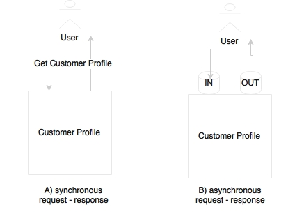

Notes: 

Both approaches have their own merits and constraints. It is not possible to develop a system with just one approach. A combination of both approaches is required based on the use cases. In principle, the asynchronous approach is great for building true, scalable microservice systems. However, attempting to model everything as asynchronous leads to complex system designs.
How does the following example look in the context where an end user clicks on a UI to get profile details?
This is perhaps a simple query to the backend system to get a result in a request-response model. This can also be modeled in an asynchronous style by pushing a message to an input queue, and waiting for a response in an output queue till a response is received for the given correlation ID. However, though we use asynchronous messaging, the user is still blocked for the entire duration of the query.


---

## 


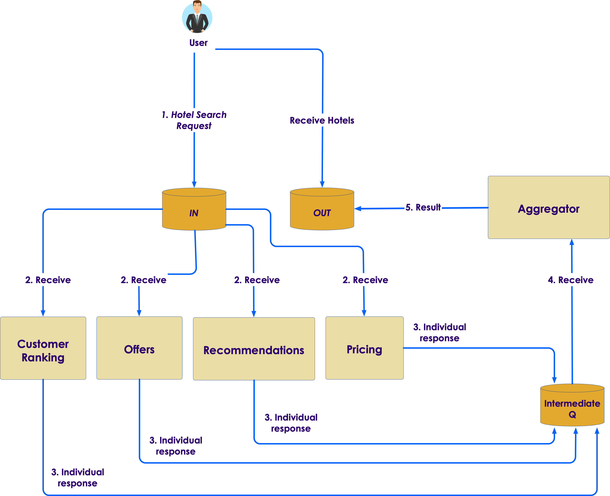

Notes: 

Another use case is that of a user clicking on a UI to search hotels, which is depicted in the following diagram:
This is very similar to the previous scenario. However, in this case, we assume that this business function triggers a number of activities internally before returning the list of hotels back to the user. For example, when the system receives this request, it calculates the customer ranking, gets offers based on the destination, gets recommendations based on customer preferences, optimizes the prices based on customer values and revenue factors, and so on. In this case, we have an opportunity to do many of these activities in parallel so that we can aggregate all these results before presenting them to the customer. As shown in the preceding diagram, virtually any computational logic could be plugged in to the search pipeline listening to the IN queue.
An effective approach in this case is to start with a synchronous request response, and refactor later to introduce an asynchronous style when there is value in doing that.


---

## 


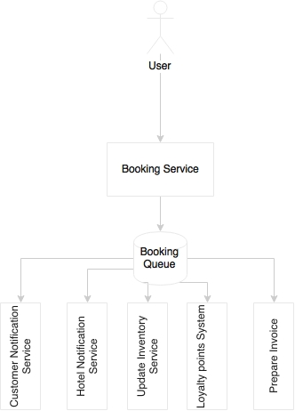

Notes: 

The following example shows a fully asynchronous style of service interactions:
The service is triggered when the user clicks on the booking function. It is again, by nature, a synchronous style communication. When booking is successful, it sends a message to the customer's e-mail address, sends a message to the hotel's booking system, updates the cached inventory, updates the loyalty points system, prepares an invoice, and perhaps more. Instead of pushing the user into a long wait state, a better approach is to break the service into pieces. Let the user wait till a booking record is created by the Booking Service. On successful completion, a booking event will be published, and return a confirmation message back to the user. Subsequently, all other activities will happen in parallel, asynchronously.
In all three examples, the user has to wait for a response. With the new web application frameworks, it is possible to send requests asynchronously, and define the callback method, or set an observer for getting a response. Therefore, the users won't be fully blocked from executing other activities.
In general, an asynchronous style is always better in the microservices world, but identifying the right pattern should be purely based on merits. If there are no merits in modeling a transaction in an asynchronous style, then use the synchronous style till you find an appealing case. Use reactive programming frameworks to avoid complexity when modeling user-driven requests, modeled in an asynchronous style.


---

## Orchestration of Microservices


 * Composability is one of the service design principles. 

 * This leads to confusion around who is responsible for the composing services. 

 * In the SOA world, ESBs are responsible for composing a set of finely-grained services. 

 * In some organizations, ESBs play the role of a proxy, and service providers themselves compose and expose coarse-grained services. 

 * In the SOA world, there are two approaches for handling such situations.

Notes: 


---

## Orchestration


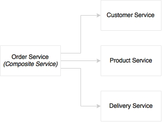

Notes: 

In the orchestration approach, multiple services are stitched together to get a complete function. A central brain acts as the orchestrator. As shown in the diagram, the order service is a composite service that will orchestrate other services. There could be sequential as well as parallel branches from the master process. Each task will be fulfilled by an atomic task service, typically a web service. In the SOA world, ESBs play the role of orchestration. The orchestrated service will be exposed by ESBs as a composite service.


---

## Choreography


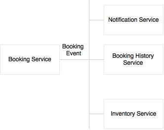

Notes: 

In the choreography approach, there is no central brain. An event, a booking event in this case, is published by a producer, a number of consumers wait for the event, and independently apply different logics on the incoming event. Sometimes, events could even be nested where the consumers can send another event which will be consumed by another service. In the SOA world, the caller pushes a message to the ESB, and the downstream flow will be automatically determined by the consuming services.

Microservices are autonomous. This essentially means that in an ideal situation, all required components to complete their function should be within the service. This includes the database, orchestration of its internal services, intrinsic state management, and so on. The service endpoints provide coarse-grained APIs. This is perfectly fine as long as there are no external touch points required. But in reality, microservices may need to talk to other microservices to fulfil their function.
In such cases, choreography is the preferred approach for connecting multiple microservices together. Following the autonomy principle, a component sitting outside a microservice and controlling the flow is not the desired option. If the use case can be modeled in choreographic style, that would be the best possible way to handle the situation.


---

## Does this work with Choreography?


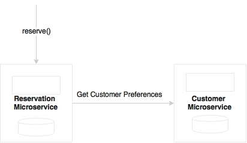

Notes: 

In the preceding example, Reservation and Customer are two microservices, with clearly segregated functional responsibilities. A case could arise when Reservation would want to get Customer preferences while creating a reservation. These are quite normal scenarios when developing complex systems.
Can we move Customer to Reservation so that Reservation will be complete by itself? If Customer and Reservation are identified as two microservices based on various factors, it may not be a good idea to move Customer to Reservation. In such a case, we will meet another monolithic application sooner or later.


---

## Can we make the reservation to Customer call Asynch


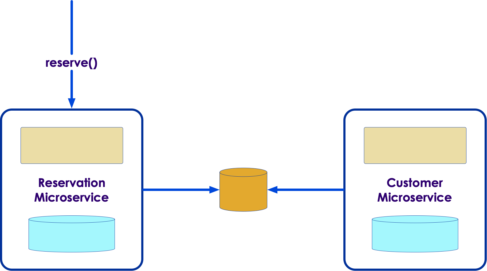

Notes: 

Customer preference is required for Reservation to progress, and hence, it may require a synchronous blocking call to Customer. Retrofitting this by modeling asynchronously does not really make sense.


---

## 


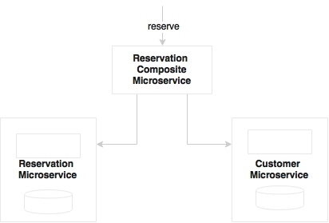

Notes: 

Can we take out just the orchestration bit, and create another composite microservice, which then composes Reservation and Customer?

This is acceptable in the approach for composing multiple components within a microservice. But creating a composite microservice may not be a good idea. We will end up creating many microservices with no business alignment, which would not be autonomous, and could result in many fine-grained microservices.


---

## Can we duplicate customer preference & keep a copy of the preference in the Reservation?


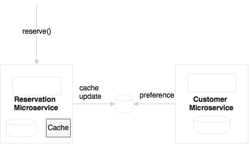

Notes: 

Changes will be propagated whenever there is a change in the master. In this case, Reservation can use customer preference without fanning out a call. It is a valid thought, but we need to carefully analyze this. Today we replicate customer preference, but in another scenario, we may want to reach out to customer service to see whether the customer is black-listed from reserving. We have to be extremely careful in deciding what data to duplicate. This could add to the complexity.


---

## How Many Endpoints in a microservice?


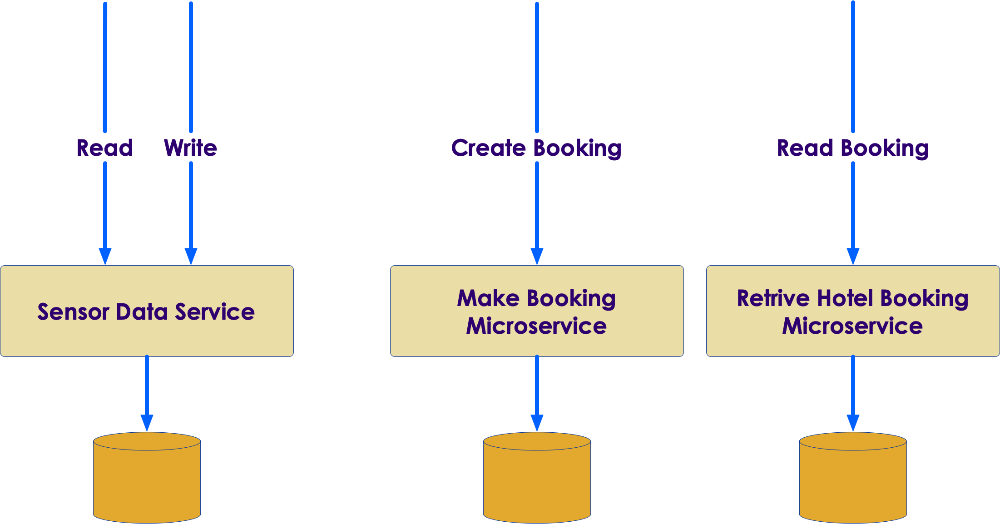

Notes: 

In many situations, developers are confused with the number of endpoints per microservice. The question really is whether to limit each microservice with one endpoint or multiple endpoints:

The number of endpoints is not really a decision point. In some cases, there may be only one endpoint, whereas in some other cases, there could be more than one endpoint in a microservice. For instance, consider a sensor data service which collects sensor information, and has two logical endpoints: create and read. But in order to handle CQRS, we may create two separate physical microservices as shown in the case of Booking in the preceding diagram. Polyglot architecture could be another scenario where we may split endpoints into different microservices.
Considering a notification engine, notifications will be send out in response to an event. The process of notification such as preparation of data, identification of a person, and delivery mechanisms, are different for different events. Moreover, we may want to scale each of these processes differently at different time windows. In such situations, we may decide to break each notification endpoint in to a separate microservice.
In yet another example, a Loyalty Points microservice may have multiple services such as accrue, redeem, transfer, and balance. We may not want to treat each of these services differently. All of these services are connected and use the points table for data. If we go with one endpoint per service, we will end up in a situation where many fine-grained services access data from the same data store or replicated copies of the same data store.
In short, the number of endpoints is not a design decision. One microservice may host one or more endpoints. Designing appropriate bounded context for a microservice is more important.


---

## One microservice per VM or Several?


 * One microservice could be deployed in multiple  **Virtual Machines**  ( **VMs** ) by replicating the deployment for scalability and availability. 

     - This is a no brainer. 

 * The question is whether multiple microservices could be deployed in one virtual machine? 

 * There are pros and cons for this approach. 

     - This question typically arises when the services are simple, and the traffic volume is less.

Notes: 

Consider an example where we have a couple of microservices, and the overall transaction per minute is less than 10. Also assume that the smallest possible VM size available is 2-core 8 GB RAM. A further assumption is that in such cases, a 2-core 8 GB VM can handle 10-15 transactions per minute without any performance concerns. If we use different VMs for each microservice, it may not be cost effective, and we will end up paying more for infrastructure and license, since many vendors charge based on the number of cores.


---

## One VM or Many?


 * Does the VM have enough capacity to run both services under peak usage?

 * Do we want to treat these services differently to achieve SLAs (selective scaling)? 

        * For example, for scalability, if we have an all-in-one VM, we will have to replicate VMs which replicate all services.

 * Are there any conflicting resource requirements? For example, different OS versions, JDK versions, and others.

Notes: 

If all your answers are No, then perhaps we can start with collocated deployment, until we encounter a scenario to change the deployment topology. However, we will have to ensure that these services are not sharing anything, and are running as independent OS processes.
Having said that, in an organization with matured virtualized infrastructure or cloud infrastructure, this may not be a huge concern. In such environments, the developers need not worry about where the services are running. Developers may not even think about capacity planning. Services will be deployed in a compute cloud. Based on the infrastructure availability, SLAs and the nature of the service, the infrastructure self-manages deployments. AWS Lambda is a good example of such a service.


---

## Shared or Embedded Rules Engine?


 * Rules are an essential part of any system. 

 * For example, an offer eligibility service may execute a number of rules before making a yes or no decision. 

 * Either we hand code rules, or we may use a rules engine. 

 * Many enterprises manage rules centrally in a rules repository as well as execute them centrally. 

 * These enterprise rule engines are primarily used for providing the business an opportunity to author and manage rules as well as reuse rules from the central repository. 

 *  **Drools**  is one of the popular open source rules engines. 

 * IBM, FICO, and Bosch are some of the pioneers in the commercial space. 

 * These rule engines improve productivity, enable reuse of rules, facts, vocabularies, and provide faster rule execution using the rete algorithm.

Notes: 

In the context of microservices, a central rules engine means fanning out calls from microservices to the central rules engine. This also means that the service logic is now in two places, some within the service, and some external to the service. Nevertheless, the objective in the context of microservices is to reduce external dependencies:


---

## 


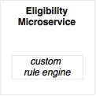

Notes: 

If the rules are simple enough, few in numbers, only used within the boundaries of a service, and not exposed to business users for authoring, then it may be better to hand-code business rules than rely on an enterprise rule engine:


---

## 


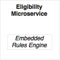

Notes: 

If the rules are complex, limited to a service context, and not given to business users, then it is better to use an embedded rules engine within the service:


---

## 


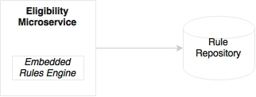

Notes: 

If the rules are managed and authored by business, or if the rules are complex, or if we are reusing rules from other service domains, then a central authoring repository with a locally embedded execution engine could be a better choice.
Note that this has to be carefully evaluated since all vendors may not support the local rule execution approach, and there could be technology dependencies such as running rules only within a specific application server, and so on.


---

## BPM and Workflows with Microservices


 * Coordinating a long-running business process, where some processes are realized by existing assets, whereas some other areas may be niche, and there is no concrete implementation of the processes being in place. BPM allows composing both types, and provides an end-to-end automated process. This often involves systems and human interactions.

 * Process-centric organizations, such as those that have implemented Six Sigma, want to monitor their processes for continuous improvement on efficiency.

 * Process re-engineering with a top-down approach by redefining the business process of an organization.

Notes: 

Business Process Management (BPM) and Intelligent Business Process Management (iBPM) are tool suites for designing, executing, and monitoring business processes.
Typical use cases for BPM are:


---

## BPM and Workflows


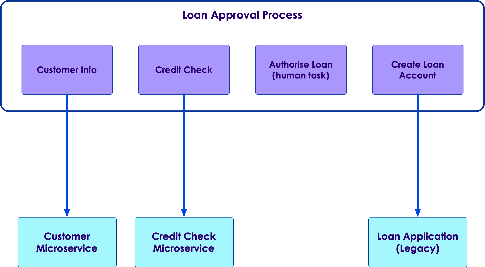

Notes: 

The first scenario is business process re-engineering, or threading an end-to-end long running business process, as stated earlier. In this case, BPM operates at a higher level, where it may automate a cross-functional, long-running business process by stitching a number of coarse-grained microservices, existing legacy connectors, and human interactions. As shown in the preceding diagram, the loan approval BPM invokes microservices as well as legacy application services. It also integrates human tasks.

In this case, microservices are headless services that implement a subprocess. From the microservices' perspective, BPM is just another consumer. Care needs to be taken in this approach to avoid accepting a shared state from a BPM process as well as moving business logic to BPM:


---

## 


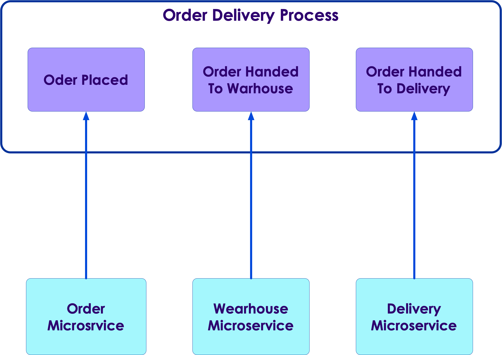

Notes: 

The second scenario is monitoring processes, and optimizing them for efficiency. This goes hand in hand with a completely automated, asynchronously choreographed microservices ecosystem. In this case, microservices and BPM work as independent ecosystems. Microservices send events at various timeframes such as the start of a process, state changes, end of a process, and so on. These events are used by the BPM engine to plot and monitor process states. We may not require a full-fledged BPM solution for this, as we are only mocking a business process to monitor its efficiency. In this case, the order delivery process is not a BPM implementation, but it is more of a monitoring dashboard that captures and displays the progress of the process.
To summarize, BPM could still be used at a higher level for composing multiple microservices in situations where end-to-end cross-functional business processes are modeled by automating systems and human interactions. A better and simpler approach is to have a business process dashboard to which microservices feed state change events as mentioned in the second scenario.


---

## Share Data Stores with Microservices


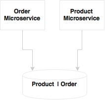

Notes: 

In principle, microservices should abstract presentation, business logic, and data stores. If the services are broken as per the guidelines, each microservice logically could use an independent database:

In the preceding diagram, both Product and Order microservices share one database and one data model. Shared data models, shared schema, and shared tables are recipes for disasters when developing microservices. This may be good at the beginning, but when developing complex microservices, we tend to add relationships between data models, add join queries, and so on. This can result in tightly coupled physical data models.


---

## 


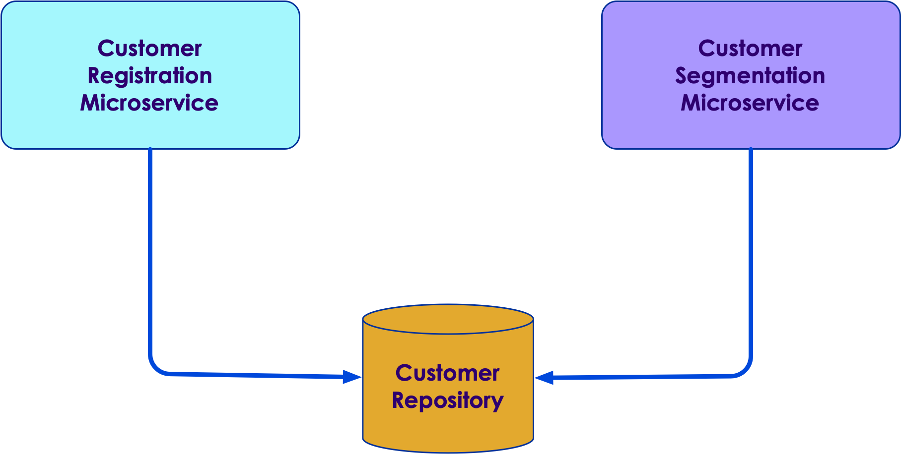

Notes: 

If the services have only a few tables, it may not be worth investing a full instance of a database like an Oracle database instance. In such cases, a schema level segregation is good enough to start with:


---

## 


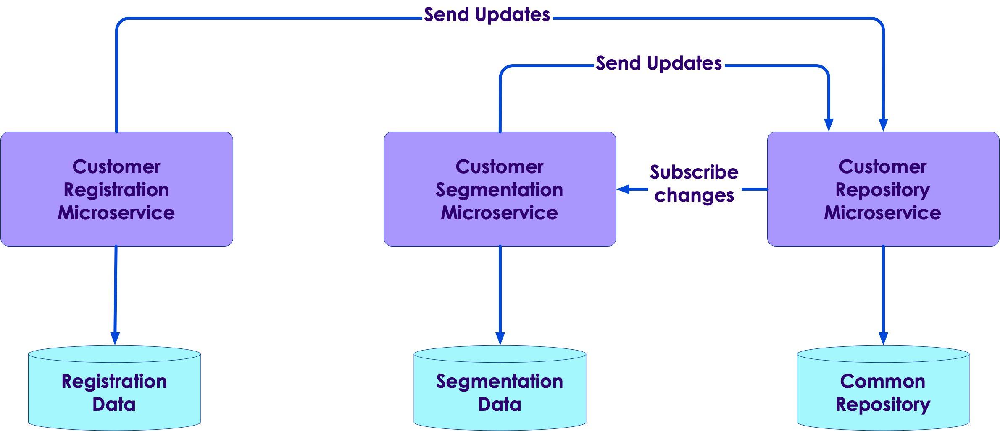

Notes: 

There could be scenarios where we tend to think of using a shared database for multiple services. Taking an example of a customer data repository or master data managed at the enterprise level, the customer registration and customer segmentation microservices logically share the same customer data repository:

As shown in the preceding diagram, an alternate approach in this scenario is to separate the transactional data store for microservices from the enterprise data repository by adding a local transactional data store for these services. This will help the services to have flexibility in remodeling the local data store optimized for its purpose. The enterprise customer repository sends change events when there is any change in the customer data repository. Similarly, if there is any change in any of the transactional data stores, the changes have to be sent to the central customer repository.


---

## Database Transaction Boundaries


 * Transactions in operational systems are used to maintain the consistency of data stored in an RDBMS by grouping a number of operations together into one atomic block. 

 * They either commit or rollback the entire operation. 

 * Distributed systems follow the concept of distributed transactions with a two-phase commit. 

 * This is particularly required if heterogeneous components such as an RPC service, JMS, and so on participate in a transaction.

Notes: 

Is there a place for transactions in microservices? Transactions are not bad, but one should use transactions carefully, by analyzing what we are trying do.
For a given microservice, an RDBMS like MySQL may be selected as a backing store to ensure 100% data integrity, for example, a stock or inventory management service where data integrity is key. It is appropriate to define transaction boundaries within the microsystem using local transactions. However, distributed global transactions should be avoided in the microservices context. Proper dependency analysis is required to ensure that transaction boundaries do not span across two different microservices as much as possible.


---

## Change the Use Case for Tx's with Microservices


 * Eventual consistency is a better option than distributed transactions that span across multiple microservices.

 * Eventual consistency reduces a lot of overheads, but application developers may need to re-think the way they write application code. 

 * This could include remodeling functions, sequencing operations to minimize failures, batching insert and modify operations, remodeling data structure, and finally, compensating operations that negate the effect.

Notes: 

A classical problem is that of the last room selling scenario in a hotel booking use case. What if there is only one room left, and there are multiple customers booking this singe available room? A business model change sometimes makes this scenario less impactful. We could set an "under booking profile", where the actual number of bookable rooms can go below the actual number of rooms (bookable = available - 3) in anticipation of some cancellations. Anything in this range will be accepted as "subject to confirmation", and customers will be charged only if payment is confirmed. Bookings will be confirmed in a set time window.
Now consider the scenario where we are creating customer profiles in a NoSQL database like CouchDB. In more traditional approaches with RDBMS, we insert a customer first, and then insert the customer's address, profile details, then preferences, all in one transaction. When using NoSQL, we may not do the same steps. Instead, we may prepare a JSON object with all the details, and insert this into CouchDB in one go. In this second case, no explicit transaction boundaries are required.


---

## Distributed Tx's


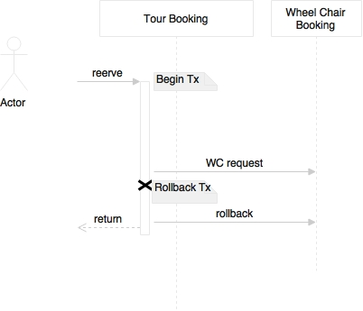

Notes: 

The ideal scenario is to use local transactions within a microservice if required, and completely avoid distributed transactions. There could be scenarios where at the end of the execution of one service, we may want to send a message to another microservice. For example, say a tour reservation has a wheelchair request. Once the reservation is successful, we will have to send a message for the wheelchair booking to another microservice that handles ancillary bookings. The reservation request itself will run on a local transaction. If sending this message fails, we are still in the transaction boundary, and we can roll back the entire transaction. What if we create a reservation and send the message, but after sending the message, we encounter an error in the reservation, the reservation transaction fails, and subsequently, the reservation record is rolled back? Now we end up in a situation where we've unnecessarily created an orphan wheelchair booking:

There are a couple of ways we can address this scenario. The first approach is to delay sending the message till the end. This ensures that there are less chances for any failure after sending the message. Still, if failure occurs after sending the message, then the exception handling routine is run, that is, we send a compensating message to reverse the wheelchair booking.


---

## Service Endpoints


 * One of the important aspects of microservices is service design. 

 * Service design has two key elements: 

 * contract design 

 * protocol selection.

Notes: 


---

## Contract Design


 * The first and foremost principle of service design is simplicity. 

 * The services should be designed for consumers to consume. 

 * A complex service contract reduces the usability of the service. 

 * The  **KISS**  ( **Keep It Simple Stupid** ) principle helps us to build better quality services faster, and reduces the cost of maintenance and replacement. 

 * The  **YAGNI**  ( **You Ain't Gonna Need It** ) is another principle supporting this idea. Predicting future requirements and building systems are, in reality, not future-proofed. 

 * This results in large upfront investment as well as higher cost of maintenance.

Notes: 

Evolutionary design is a great concept. Do just enough design to satisfy today's wants, and keep changing and refactoring the design to accommodate new features as and when they are required. Having said that, this may not be simple unless there is a strong governance in place.


---

## Consumer Driven Contracts


 * CDC is a great idea that supports evolutionary design. 

 * when the service contract gets changed, all consuming applications have to undergo testing. 

 * This makes change difficult. 

     - CDC helps in building confidence in consumer applications. 

 * CDC advocates each consumer to provide their expectation to the provider in the form of test cases so that the provider uses them as integration tests whenever the service contract is changed.

Notes: 

Postel's law is also relevant in this scenario. Postel's law primarily addresses TCP communications; however, this is also equally applicable to service design. When it comes to service design, service providers should be as flexible as possible when accepting consumer requests, whereas service consumers should stick to the contract as agreed with the provider.


---

## Protocol Selection


 * In the SOA world, HTTP/SOAP, and messaging were kinds of default service protocols for service interactions. 

 * Microservices follow the same design principles for service interaction. 

 * Loose coupling is one of the core principles in the microservices world too.

Notes: 

Microservices fragment applications into many physically independent deployable services. This not only increases the communication cost, it is also susceptible to network failures. This could also result in poor performance of services.


---

## Message Oriented Services


 * If we choose an asynchronous style of communication, the user is disconnected, and therefore, response times are not directly impacted. 

 * We may use standard JMS or AMQP protocols for communication with JSON as payload. Messaging over HTTP is also popular, as it reduces complexity. 

 * Many new entrants in messaging services support HTTP-based communication. 

 * Asynchronous REST is also possible, and is handy when calling long-running services.

Notes: 


---

## HTTP and REST endpoints


 * Communication over HTTP is always better for interoperability, protocol handling, traffic routing, load balancing, security systems, and the like. 

 * Since HTTP is stateless, it is more compatible for handling stateless services with no affinity. 

 * Most of the development frameworks, testing tools, runtime containers, security systems, and so on are friendlier towards HTTP.

Notes: 

With the popularity and acceptance of REST and JSON, it is the default choice for microservice developers. The HTTP/REST/JSON protocol stack makes building interoperable systems very easy and friendly. HATEOAS is one of the design patterns emerging for designing progressive rendering and self-service navigations. As discussed in the previous session, HATEOAS provides a mechanism to link resources together so that the consumer can navigate between resources. RFC 5988 – Web Linking is another upcoming standard.


---

## Optimized Communication Protocols


 * If the service response times are stringent, then we need to pay special attention to the communication aspects. 

 * In such cases, we may choose alternate protocols such as Avro, Protocol Buffers, or Thrift for communicating between services. 

 * But this limits the interoperability of services. 

 * The trade-off is between performance and interoperability requirements. 

 * Custom binary protocols need careful evaluation as they bind native objects on both sides—consumer and producer. 

 * This could run into release management issues such as class version mismatch in Java-based RPC style communications.

Notes: 


---

## Shared Libraries


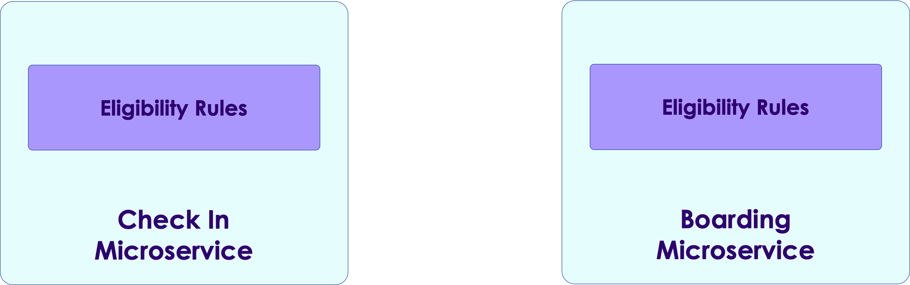

Notes: 

The principle behind microservices is that they should be autonomous and self-contained. In order to adhere to this principle, there may be situations where we will have to duplicate code and libraries. These could be either technical libraries or functional components.

For example, the eligibility for a flight upgrade will be checked at the time of check-in as well as when boarding. If check-in and boarding are two different microservices, we may have to duplicate the eligibility rules in both the services. This was the trade-off between adding a dependency versus code duplication.
It may be easy to embed code as compared to adding an additional dependency, as it enables better release management and performance. But this is against the DRY principle.
Note
DRY principle
Every piece of knowledge must have a single, unambiguous, authoritative representation within a system.
The downside of this approach is that in case of a bug or an enhancement on the shared library, it has to be upgraded in more than one place. 


---

## 


Notes: 

The downside of this approach is that in case of a bug or an enhancement on the shared library, it has to be upgraded in more than one place. This may not be a severe setback as each service can contain a different version of the shared library:

An alternative option of developing the shared library as another microservice itself needs careful analysis. If it is not qualified as a microservice from the business capability point of view, then it may add more complexity than its usefulness. The trade-off analysis is between overheads in communication versus duplicating the libraries in multiple services.


---

## User Interfaces in Microservices


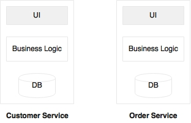

Notes: 

The microservices principle advocates a microservice as a vertical slice from the database to presentation:
In reality, we get requirements to build quick UI and mobile applications mashing up the existing APIs. This is not uncommon in the modern scenario, where a business wants quick turnaround time from IT:


---

## 


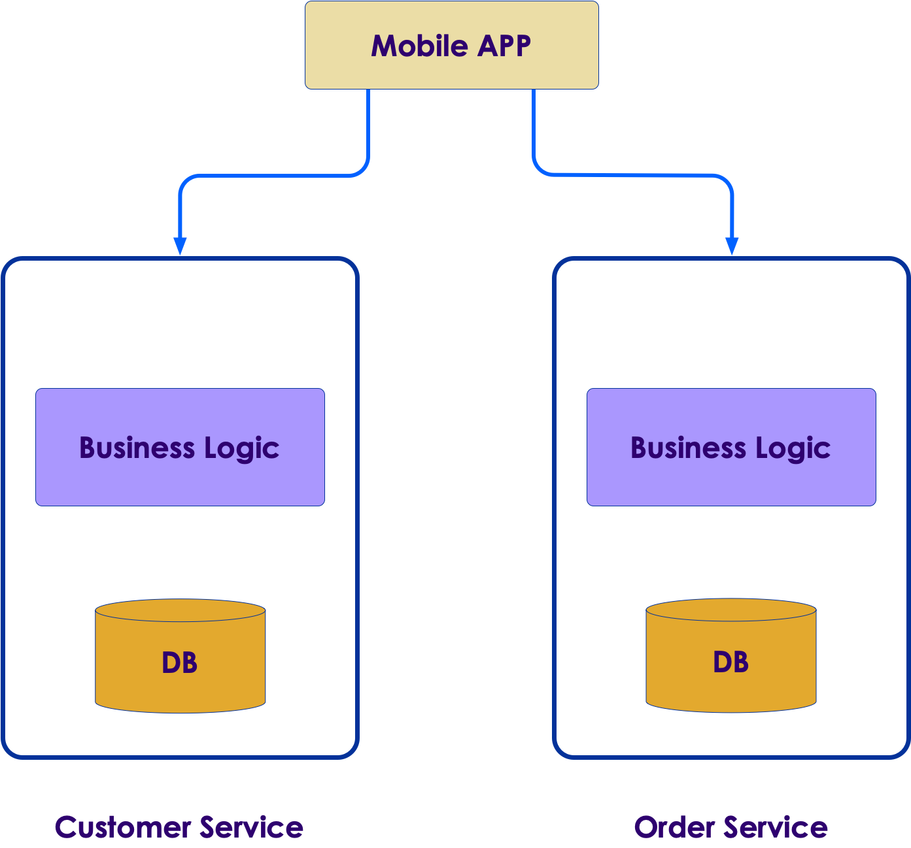

Notes: 

Penetration of mobile applications is one of the causes of this approach. In many organizations, there will be mobile development teams sitting close to the business team, developing rapid mobile applications by combining and mashing up APIs from multiple sources, both internal and external. In such situations, we may just expose services, and leave it for the mobile teams to realize in the way the business wants. In this case, we will build headless microservices, and leave it to the mobile teams to build a presentation layer.


---

## 


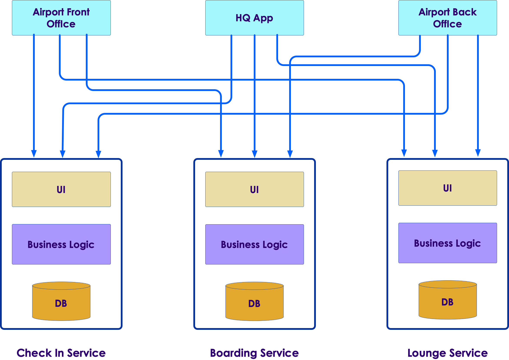

Notes: 

Another category of problem is that the business may want to build consolidated web applications targeted to communities:

For example, the business may want to develop a departure control application targeting airport users. A departure control web application may have functions such as check-in, lounge management, boarding, and so on. These may be designed as independent microservices. But from the business standpoint, it all needs to be clubbed into a single web application. In such cases, we will have to build web applications by mashing up services from the backend.
One approach is to build a container web application or a placeholder web application, which links to multiple microservices at the backend. In this case, we develop full stack microservices, but the screens coming out of this could be embedded in to another placeholder web application. One of the advantages of this approach is that you can have multiple placeholder web applications targeting different user communities, as shown in the preceding diagram. We may use an API gateway to avoid those crisscross connections. We will explore the API gateway in the next section.


---

## API Gateways in Microservices


 * With the advancement of client-side JavaScript frameworks like AngularJS, the server is expected to expose RESTful services. 

 * This could lead to two issues. 

     - The first issue is the mismatch in contract expectations. 

     - The second issue is multiple calls to the server to render a page.

     - We start with the contract mismatch case. For example, GetCustomer may return a JSON with many fields:

 * Customer {  Name:   Address:   Contact: }

Notes: 

In the preceding case, Name, Address, and Contact are nested JSON objects. But a mobile client may expect only basic information such as first name, and last name. In the SOA world, an ESB or a mobile middleware did this job of transformation of data for the client. The default approach in microservices is to get all the elements of Customer, and then the client takes up the responsibility to filter the elements. In this case, the overhead is on the network.


---

## 


 * Customer {

 *   Id: 1

 *   Name: /customer/name/1

 *   Address: /customer/address/1

 *   Contact: /customer/contact/1

 * }

Notes: 

There are several approaches we can think about to solve this case:
In the first approach, minimal information is sent with links as explained in the section on HATEOAS. In the preceding case, for customer ID 1, there are three links, which will help the client to access specific data elements. The example is a simple logical representation, not the actual JSON. The mobile client in this case will get basic customer information. The client further uses the links to get the additional required information.
The second approach is used when the client makes the REST call; it also sends the required fields as part of the query string. In this scenario, the client sends a request with firstname and lastname as the query string to indicate that the client only requires these two fields. The downside is that it ends up in complex server-side logic as it has to filter based on the fields. The server has to send different elements based on the incoming query.


---

## 


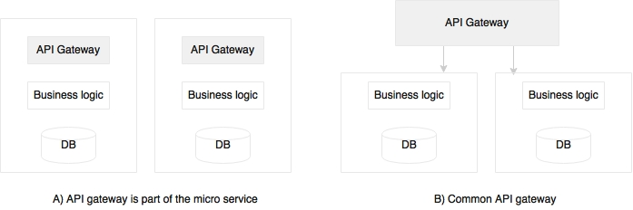

Notes: 

The third approach is to introduce a level of indirection. In this, a gateway component sits between the client and the server, and transforms data as per the consumer's specification. This is a better approach as we do not compromise on the backend service contract. This leads to what is called UI services. In many cases, the API gateway acts as a proxy to the backend, exposing a set of consumer-specific APIs:

There are two ways we can deploy an API gateway. 
The first one is one API gateway per microservice as shown in diagram A. 
The second approach (diagram B) is to have a common API gateway for multiple services. 
The choice really depends on what we are looking for. If we are using an API gateway as a reverse proxy, then off-the-shelf gateways such as Apigee, Mashery, and the like could be used as a shared platform. If we need fine-grained control over traffic shaping and complex transformations, then per service custom API gateways may be more useful.


---

## Service Version Considerations


 * There are three different ways in which we can version REST services:

 * URI versioning

 * Media type versioning

 * Custom header

Notes: 

When we allow services to evolve, one of the important aspect to consider is service versioning. Service versioning should be considered upfront, and not as an afterthought. Versioning helps us to release new services without breaking the existing consumers. Both the old version and the new version will be deployed side by side.
Semantic versions are widely used for service versioning. A semantic version has three components: major, minor, and patch. Major is used when there is a breaking change, minor is used when there is a backward compatible change, and patch is used when there is a backward compatible bug fix.
Versioning could get complicated when there is more than one service in a microservice. It is always simple to version services at the service level compared to the operations level. If there is a change in one of the operations, the service is upgraded and deployed to V2. The version change is applicable to all operations in the service. This is the notion of immutable services.


---

## 3 Ways to Version Services


 * URI versioning

 * Media type versioning

 * Custom header

Notes: 


---

## URI Versioning


 * /api/v3/customer/1234

 * /api/customer/1234  - aliased to v3.


```java

@RestController("CustomerControllerV3")
@RequestMapping("api/v3/customer")
public class CustomerController {

}
```

Notes: 

In URI versioning, the version number is included in the URL itself. In this case, we just need to be worried about the major versions only. Hence, if there is a minor version change or a patch, the consumers do not need to worry about the changes. It is a good practice to alias the latest version to a non-versioned URI, which is done as follows:


---

## Version in the URL Parameter


 * A slightly different approach is to use the version number as part of the URL parameter:

 * `api/customer/100?v=1.5`

 * In case of media type versioning, the version is set by the client on the HTTP Accept header as follows:

 * Accept:  application/vnd.company.customer-v3+json

 * A less effective approach for versioning is to set the version in the custom header:

 * @RequestMapping(value = "/{id}", method = RequestMethod.GET, headers = {"version=3"})

 * public Customer getCustomer(@PathVariable("id") long id) {

 *      //other code goes here.

 * }

Notes: 

In the URI approach, it is simple for the clients to consume services. But this has some inherent issues such as the fact that versioning-nested URI resources could be complex. Indeed, migrating clients is slightly complex as compared to media type approaches, with caching issues for multiple versions of the services, and others. However, these issues are not significant enough for us to not go with a URI approach. Most of the big Internet players such as Google, Twitter, LinkedIn, and Salesforce are following the URI approach.


---

## Design for Cross Origin


 * With microservices, there is no guarantee that the services will run from the same host or same domain. 

     - Composite UI web applications may call multiple microservices for accomplishing a task, and these could come from different domains and hosts.

 * CORS allows browser clients to send requests to services hosted on different domains. 

     - This is essential in a microservices-based architecture.

 * One approach is to enable all microservices to allow cross origin requests from other trusted domains. 

     - The second approach is to use an API gateway as a single trusted domain for the clients.

Notes: 


---

## Handling Shared Reference Data


 * When breaking large applications, one of the common issues which we see is the management of master data or reference data. 

 * Reference data is more like shared data required between different microservices. 

     - City master, country master, and so on will be used in many services such as flight schedules, reservations, and others.

Notes: 


---

## Handling Shared Reference Data Continued


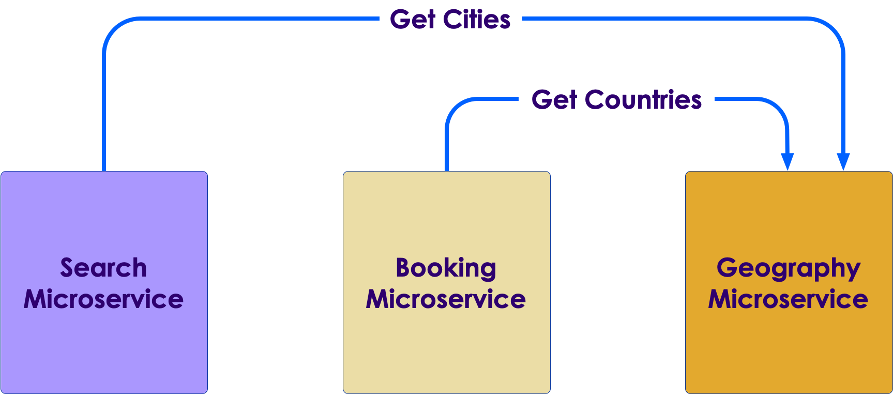

Notes: 

There are a few ways in which we can solve this. For instance, in the case of relatively static, never changing data, then every service can hardcode this data within all the microservices themselves:


---

## Handling Shared Reference Data Continued


Notes: 

Another approach, as shown in the preceding diagram, is to build it as another microservice. This is good, clean, and neat, but the downside is that every service may need to call the master data multiple times. As shown in the diagram for the Search and Booking example, there are transactional microservices, which use the Geography microservice to access shared data:


---

## Handling Shared Reference Data Continued


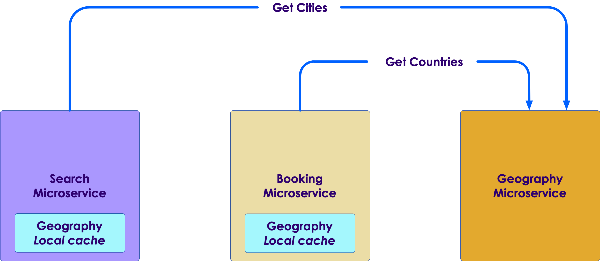

Notes: 

Another option is to replicate the data with every microservice. There is no single owner, but each service has its required master data. When there is an update, all the services are updated. This is extremely performance friendly, but one has to duplicate the code in all the services. It is also complex to keep data in sync across all microservices. This approach makes sense if the code base and data is simple or the data is more static.
Yet another approach is similar to the first approach, but each service has a local near cache of the required data, which will be loaded incrementally. A local embedded cache such as Ehcache or data grids like Hazelcast or Infinispan could also be used based on the data volumes. This is the most preferred approach for a large number of microservices that have dependency on the master data.


---

## Bulk Operations and Microservices


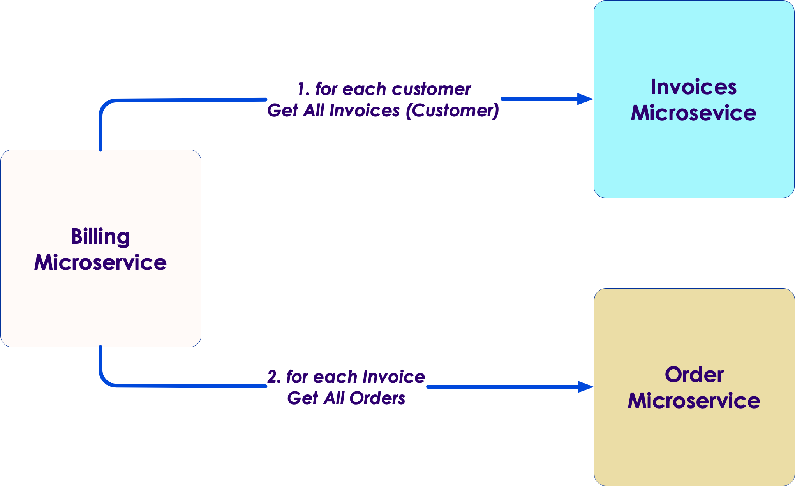

Notes: 

Since we have broken monolithic applications into smaller, focused services, it is no longer possible to use join queries across microservice data stores. This could lead to situations where one service may need many records from other services to perform its function.


---

## Bulk Operations and Microservices Continued


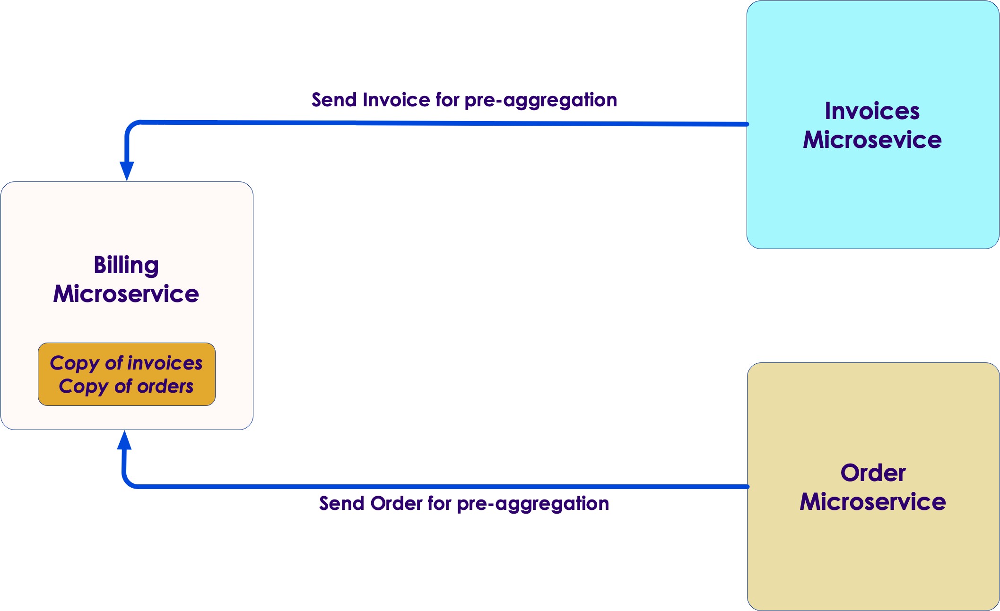

Notes: 

For example, a monthly billing function needs the invoices of many customers to process the billing. To make it a bit more complicated, invoices may have many orders. When we break billing, invoices, and orders into three different microservices, the challenge that arises is that the Billing service has to query the Invoices service for each customer to get all the invoices, and then for each invoice, call the Order service for getting the orders. This is not a good solution, as the number of calls that goes to other microservices are high:


---

## Bulk Operations and Microservices Continued


 * There are two ways we can think about for solving Batch. 

 * The first approach is to pre-aggregate data as and when it is created. 

     - When an order is created, an event is sent out. 

     - Upon receiving the event, the  **Billing**  microservice keeps aggregating data internally for monthly processing. 

     - In this case, there is no need for the  **Billing**  microservice to go out for processing. 

     - The downside of this approach is that there is duplication of data.

 * A second approach, when pre-aggregation is not possible, is to use batch APIs. 

     - In such cases, we call GetAllInvoices, then we use multiple batches, and each batch further uses parallel threads to get orders. 

     - Spring Batch is useful in these situations.

Notes: 


---

## Microservices Challenges


 * Data Islands

 * Logging

 * Monitoring

 * Dependency Management

 * Organizational Culture

 * Governance Challenges

 * Operation Overheads

 * Testing

 * Infrastructure

Notes: 


---

## Data Islands


 * Microservices abstract their own local transactional store, which is used for their own transactional purposes. 

     - The type of store and the data structure will be optimized for the services offered by the microservice.

 * For instance, if we want to develop a customer relationship graph, we may use a graph database like Neo4j, OrientDB, and the like. 

     - A predictive text search to find out a customer based on any related information such as passport number, address, e-mail, phone, and so on could be best realized using an indexed search database like Elasticsearch or Solr.

Notes: 


---

## Data Islands Continued


 * This will place us into a unique situation of fragmenting data into heterogeneous data islands. 

     - For example, Customer, Loyalty Points, Reservations, and others are different microservices, and hence, use different databases. 

     - What if we want to do a near real-time analysis of all high value customers by combining data from all three data stores? 

     -  **This was easy with a monolithic application, because all the data was present in a single database** 

Notes: 


---

## Data Islands Solved


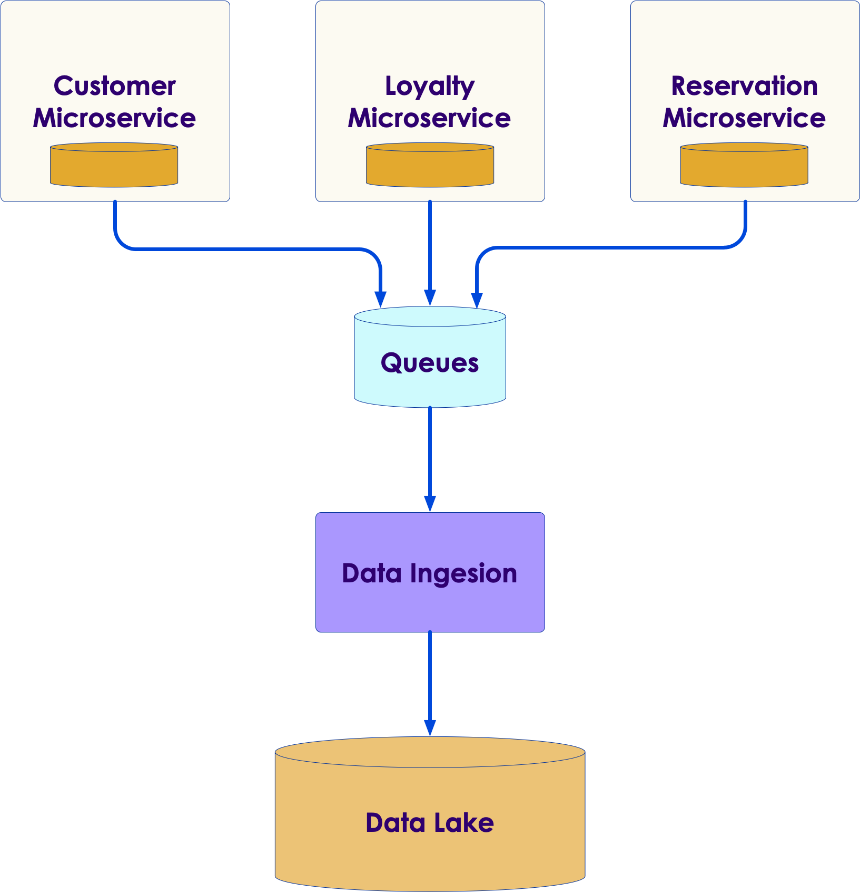

Notes: 

In order to satisfy this requirement, a data warehouse or a data lake is required. Traditional data warehouses like Oracle, Teradata, and others are used primarily for batch reporting. But with NoSQL databases (like Hadoop) and microbatching techniques, near real-time analytics is possible with the concept of data lakes. Unlike the traditional warehouses that are purpose-built for batch reporting, data lakes store raw data without assuming how the data is going to be used. Now the question really is how to port the data from microservices into data lakes.
Data porting from microservices to a data lake or a data warehouse can be done in many ways. Traditional ETL could be one of the options. Since we allow backdoor entry with ETL, and break the abstraction, this is not considered an effective way for data movement. A better approach is to send events from microservices as and when they occur, for example, customer registration, customer update events, and so on. Data ingestion tools consume these events, and propagate the state change to the data lake appropriately. The data ingestion tools are highly scalable platforms such as Spring Cloud Data Flow, Kafka, Flume, and so on.


---

## Logging and Monitoring


 * Log files are a good piece of information for analysis and debugging. 

 * Since each microservice is deployed independently, they emit separate logs, maybe to a local disk. 

 * This results in fragmented logs. 

     - When we scale services across multiple machines, each service instance could produce separate log files. 

     - This makes it extremely difficult to debug and understand the behavior of the services through log mining.

Notes: 


---

## Logging and Monitoring


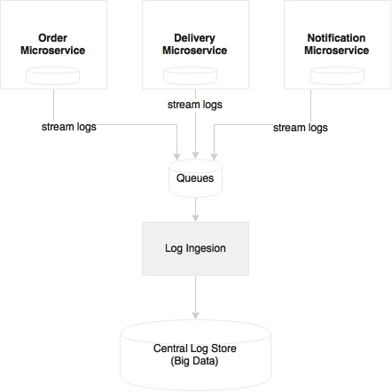

Notes: 

Examining Order, Delivery, and Notification as three different microservices, we find no way to correlate a customer transaction that runs across all three of them:


---

## Logging and Monitoring


 * When implementing microservices, we need a capability to ship logs from each service to a centrally managed log repository. 

 * With this approach, services do not have to rely on the local disk or local I/Os. A second advantage is that the log files are centrally managed, and are available for all sorts of analysis such as historical, real time, and trending. 

 * By introducing a correlation ID, end-to-end transactions can be easily tracked.

Notes: 

With a large number of microservices, and with multiple versions and service instances, it would be difficult to find out which service is running on which server, what's the health of these services, the service dependencies, and so on. This was much easier with monolithic applications that are tagged against a specific or a fixed set of servers.
Apart from understanding the deployment topology and health, it also poses a challenge in identifying service behaviors, debugging, and identifying hotspots. Strong monitoring capabilities are required to manage such an infrastructure.
We will cover the logging and monitoring aspects in Chapter 7, Logging and Monitoring Microservices.


---

## Dependency Management


 * Too many dependencies could raise challenges in microservices. Four important design aspects are stated as follows:

 * Reducing dependencies by properly designing service boundaries.

 * Reducing impacts by designing dependencies as loosely coupled as possible. Also, designing service interactions through asynchronous communication styles.

 * Tackling dependency issues using patterns such as circuit breakers.

 * Monitoring dependencies using visual dependency graphs.

Notes: 

Dependency management is one of the key issues in large microservice deployments. How do we identify and reduce the impact of a change? How do we know whether all the dependent services are up and running? How will the service behave if one of the dependent services is not available?


---

## Corporate Culture


 * One of the biggest challenges in microservices implementation is the organization culture. 

 * To harness the speed of delivery of microservices, the organization should adopt Agile development processes, continuous integration, automated QA checks, automated delivery pipelines, automated deployments, and automatic infrastructure provisioning.

 * Organizations following a waterfall development or heavyweight release management processes with infrequent release cycles are a challenge for microservices development. 

 * Insufficient automation is also a challenge for microservices deployment.

Notes: 

In short, Cloud and DevOps are supporting facets of microservice development. These are essential for successful microservices implementation.


---

## Governance


 * Microservices impose decentralized governance, and this is quite in contrast with the traditional SOA governance. 

     - Organizations may find it hard to come up with this change, and that could negatively impact the microservices development.

 * There are number of challenges that comes with a decentralized governance model. 

     - How do we understand who is consuming a service? 

     - How do we ensure service reuse? 

     - How do we define which services are available in the organization? 

     - How do we ensure enforcement of enterprise policies?

Notes: 

The first thing is to have a set of standards, best practices, and guidelines on how to implement better services. These should be available to the organization in the form of standard libraries, tools, and techniques. This ensures that the services developed are top quality, and that they are developed in a consistent manner.
The second important consideration is to have a place where all stakeholders can not only see all the services, but also their documentations, contracts, and service-level agreements. Swagger and API Blueprint are commonly used for handling these requirements.


---

## CMDB


 * With many microservices, the number of  **configurable items**  ( **CIs** ) becomes too high, and the number of servers in which these CIs are deployed might also be unpredictable. 

 * This makes it extremely difficult to manage data in a traditional  **Configuration Management Database**  (). 

 *  **In most cases, it is more useful to dynamically discover the current running topology than a statically configured CMDB-style deployment topology.** 

Notes: 

Microservices deployment generally increases the number of deployable units and virtual machines (or containers). This adds significant management overheads and increases the cost of operations.
With a single application, a dedicated number of containers or virtual machines in an on-premise data center may not make much sense unless the business benefit is very high. The cost generally goes down with economies of scale. A large number of microservices that are deployed in a shared infrastructure which is fully automated makes more sense, since these microservices are not tagged against any specific VMs or containers. Capabilities around infrastructure automation, provisioning, containerized deployment, and so on are essential for large scale microservices deployments. Without this automation, it would result in a significant operation overhead and increased cost.


---

## Testing


 * Microservices also pose a challenge for the testability of services. 

     - In order to achieve a full-service functionality, one service may rely on another service, and that, in turn, on another service—either synchronously or asynchronously. 

     - The issue is how do we test an end-to-end service to evaluate its behavior? T

     - he dependent services may or may not be available at the time of testing.

 * Service virtualization or service mocking is one of the techniques used for testing services without actual dependencies. 

     - In testing environments, when the services are not available, mock services can simulate the behavior of the actual service. 

     - The microservices ecosystem needs service virtualization capabilities. 

     - However, this may not give full confidence, as there may by many corner cases that mock services do not simulate, especially when there are deep dependencies.

Notes: 

Another approach, as discussed earlier, is to use a consumer driven contract. The translated integration test cases can cover more or less all corner cases of the service invocation.
Test automation, appropriate performance testing, and continuous delivery approaches such as A/B testing, future flags, canary testing, blue-green deployments, and red-black deployments, all reduce the risks of production releases.


---

## Provisioning Infrastructure


 * Manual deployment could severely challenge the microservices rollouts. 

 * If a deployment has manual elements, the deployer or operational administrators should know the running topology, manually reroute traffic, and then deploy the application one by one till all services are upgraded. 

 * With many server instances running, this could lead to significant operational overheads. Moreover, the chances of errors are high in this manual approach.

Notes: 

Microservices require a supporting elastic cloud-like infrastructure which can automatically provision VMs or containers, automatically deploy applications, adjust traffic flows, replicate new version to all instances, and gracefully phase out older versions. The automation also takes care of scaling up elastically by adding containers or VMs on demand, and scaling down when the load falls below threshold.
In a large deployment environment with many microservices, we may also need additional tools to manage VMs or containers that can further initiate or destroy services automatically.


---

## 4 - Microservices se Use Case / Case Study


 * This chapter will introduce BrownField Airline (BF), a fictitious budget airline, and their journey from a monolithic  **Passenger Sales and Service**  ( **PSS** ) application to a next generation microservices architecture. 

 * This section examines the PSS application in detail, and explains the challenges, approach, and transformation steps of a monolithic system to a microservices-based architecture, adhering to the principles and practices that were explained in the previous section.

 * The intention of this case study is to get us as close as possible to a live scenario so that the architecture concepts can be set in stone.

Notes: 

By the end of this chapter, you will have learned about the following:
A real world case for migrating monolithic systems to microservices-based ones, with the BrownField Airline's PSS application as an example
Various approaches and transition strategies for migrating a monolithic application to microservices
Designing a new futuristic microservices system to replace the PSS application using Spring Framework components


---

## 


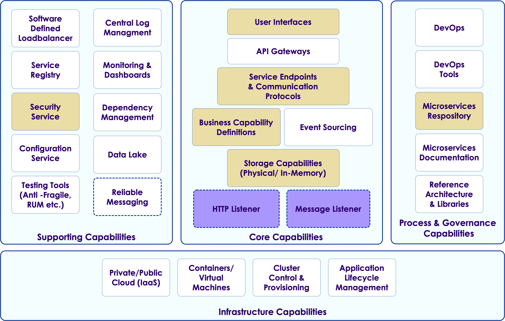

Notes: 

The examples in this chapter explore the following microservices capabilities from the microservices capability model discussed in Chapter 3, Applying Microservices Concepts:
HTTP Listener
Message Listener
Storage Capabilities (Physical/In-Memory)
Business Capability Definitions
Service Endpoints & Communication Protocols
User Interfaces
Security Service
Microservice Documentation
This chapter will build a comprehensive microservices example based on a real world case study.


---

## Understanding the Application


 * Business Process View

 * Functional View

 * Architectural View

 * Design View

 * Implementation View

 * Deployment View

Notes: 

BrownField Airline is one of the fastest growing low-cost, regional airlines, flying directly to more than 100 destinations from its hub. As a start-up airline, BrownField Airline started its operations with few destinations and few aircrafts. BrownField developed its home-grown PSS application to handle their passenger sales and services.


---

## Business Process View


 * The current solution is automating certain customer-facing functions as well as certain internally facing functions. 

 * There are two internally facing functions,  **Pre-flight**  and  **Post-flight** .  **Pre-flight**  functions include the planning phase, used for preparing flight schedules, plans, aircrafts, and so on. 

 *  **Post-flight**  functions are used by the back office for revenue management, accounting, and so on. 

 * The  **Search**  and  **Reserve**  functions are part of the online seat reservation process, and the  **Check-in**  function is the process of accepting passengers at the airport. 

 * The  **Check-in**  function is also accessible to the end users over the Internet for online check-in.

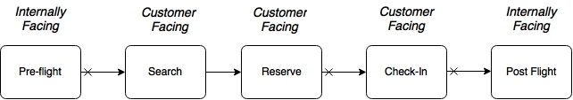

Notes: 

This use case is considerably simplified for discussion purposes. The process view in the following diagram shows BrownField Airline's end-to-end passenger services operations covered by the current PSS solution:

The cross marks at the beginning of the arrows in the preceding diagram indicate that they are disconnected, and occur at different timelines. For example, passengers are allowed to book 360 days in advance, whereas the check-in generally happens 24 hours before flight departure.


---

## Functional View


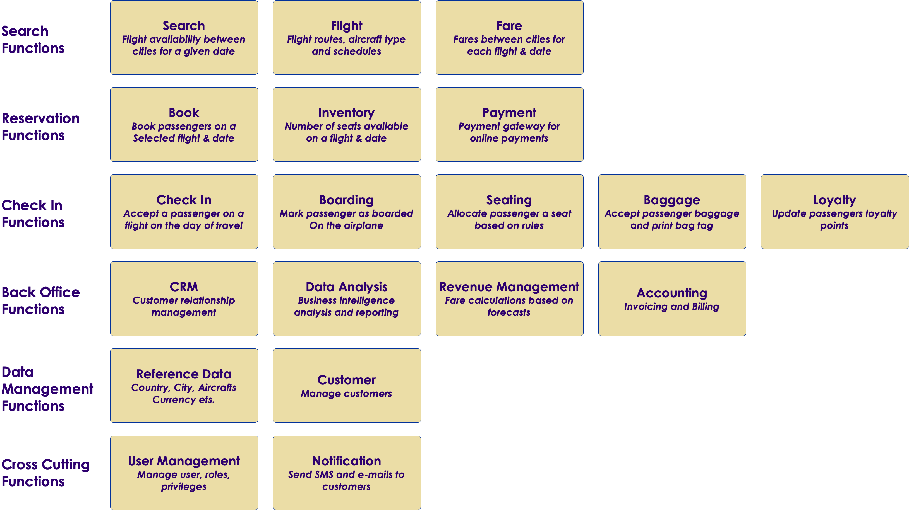

Notes: 

The following diagram shows the functional building blocks of BrownField Airline's PSS landscape. Each business process and its related subfunctions are represented in a row:

Each subfunction shown in the preceding diagram explains its role in the overall business process. Some subfunctions participate in more than one business process. For example, inventory is used in both search as well as in booking. To avoid any complication, this is not shown in the diagram. Data management and cross-cutting subfunctions are used across many business functions.


---

## Architectural View


 * In order to effectively manage the end-to-end passenger operations, BrownField had developed an in-house PSS application, almost ten years back. 

 * This well-architected application was developed using Java and JEE technologies combined with the best-of-the-breed open source technologies available at the time.

 * The architecture has well-defined boundaries. 

 * Also, different concerns are separated into different layers. 

 * The web application was developed as an N-tier, component-based modular system. 

 * The functions interact with each other through well-defined service contracts defined in the form of EJB endpoints.

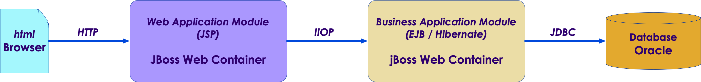

Notes: 


---

## Design View


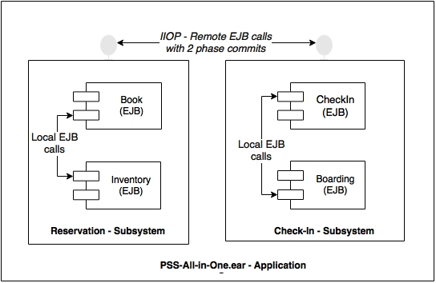

Notes: 

The application has many logical functional groupings or subsystems. Further, each subsystem has many components organized as depicted in the next diagram:
Subsystems interact with each other through remote EJB calls using the IIOP protocol. The transactional boundaries span across subsystems. Components within the subsystems communicate with each other through local EJB component interfaces. In theory, since subsystems use remote EJB endpoints, they could run on different physically separated application servers. This was one of the design goals.


---

## Implementation View


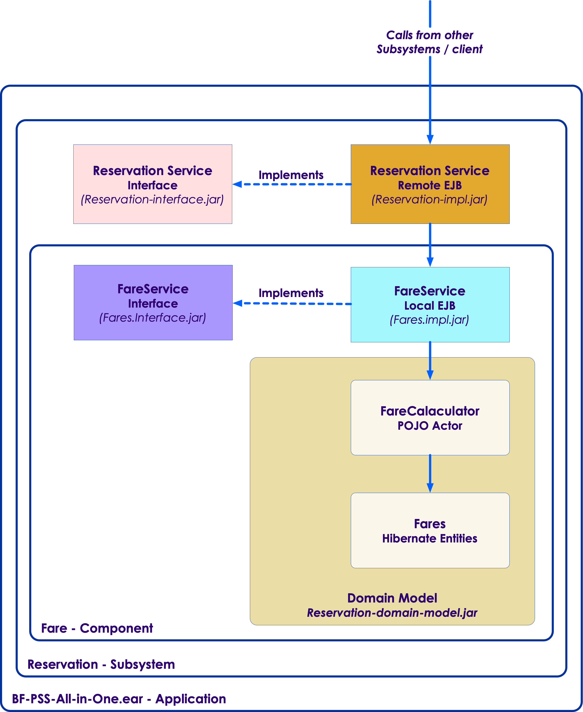

Notes: 

In the preceding diagram, the gray-shaded boxes are treated as different Maven projects, and translate into physical artifacts. Subsystems and components are designed adhering to the program to an interface principle. Interfaces are packaged as separate JAR files so that clients are abstracted from the implementations. The complexity of the business logic is buried in the domain model. Local EJBs are used as component interfaces. Finally, all subsystems are packaged into a single all-in-one EAR, and deployed in the application server.
The implementation view in the following diagram showcases the internal organization of a subsystem and its components. The purpose of the diagram is also to show the different types of artifacts:


---

## Deployment View


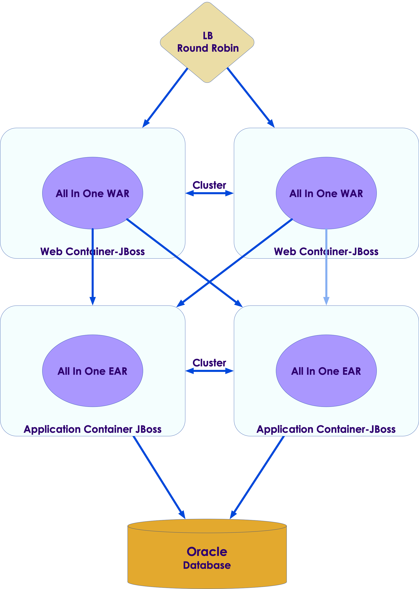

Notes: 

The web modules and business modules were deployed into separate application server clusters. The application was scaled horizontally by adding more and more application servers to the cluster.
Zero downtime deployments were handled by creating a standby cluster, and gracefully diverting the traffic to that cluster. The standby cluster is destroyed once the primary cluster is patched with the new version and brought back to service. Most of the database changes were designed for backward compatibility, but breaking changes were promoted with application outages.


---

## Why Microservices?  (Death of the Monolith)


 * The PSS application was performing well, successfully supporting all business requirements as well as the expected service levels. 

     - The system had no issues in scaling with the organic growth of the business in the initial years.

 * The business has seen tremendous growth over a period of time. 

     - The fleet size increased significantly, and new destinations got added to the network. 

     - As a result of this rapid growth, the number of bookings has gone up, resulting in a steep increase in transaction volumes, up to 200 - to 500 - fold of what was originally estimated.

Notes: 


---

## Why Microservices?  (Death of the Monolith)


 * Pain Points:

     - Stability

     - Outages

     - Agility

Notes: 

The rapid growth of the business eventually put the application under pressure. Odd stability issues and performance issues surfaced. New application releases started breaking the working code. Moreover, the cost of change and the speed of delivery started impacting the business operations profoundly.
An end-to-end architecture review was ordered, and it exposed the weaknesses of the system as well as the root causes of many failures, which were as follows:
Stability: The stability issues are primarily due to stuck threads, which limit the application server's capability to accept more transactions. The stuck threads are mainly due to database table locks. Memory issues are another contributor to the stability issues. There were also issues in certain resource intensive operations that were impacting the whole application.
Outages: The outage window increased largely because of the increase in server startup time. The root cause of this issue boiled down to the large size of the EAR. Message pile up during any outage windows causes heavy usage of the application immediately after an outage window. Since everything is packaged in a single EAR, any small application code change resulted in full redeployment. The complexity of the zero downtime deployment model described earlier, together with the server startup times increased both the number of outages and their duration.
Agility: The complexity of the code also increased considerably over time, partially due to the lack of discipline in implementing the changes. As a result, changes became harder to implement. Also, the impact analysis became too complex to perform. As a result, inaccurate impact analysis often led to fixes that broke the working code. The application build time went up severely, from a few minutes to hours, causing unacceptable drops in development productivity. The increase in build time also led to difficulty in build automation, and eventually stopped continuous integration (CI) and unit testing.


---

## Stop Gap


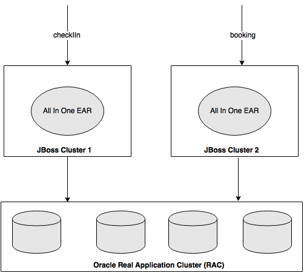

Notes: 

This helped BrownField's IT to scale the application servers. Therefore, the stability issues were controlled. However, this soon resulted in a bottleneck at the database level. Oracle's Real Application Cluster (RAC) was implemented as a solution to this problem at the database layer.
This new scaling model reduced the stability issues, but at a premium of increased complexity and cost of ownership. The technology debt also increased over a period of time, leading to a state where a complete rewrite was the only option for reducing this technology debt.


---

## Retrospection


 * Although the application was well-architected, there was a clear segregation between the functional components. 

     - They were loosely coupled, programmed to interfaces, with access through standards-based interfaces, and had a rich domain model.

 * The obvious question is, how come such a well-architected application failed to live up to the expectations? 

     - What else could the architects have done?

 * It is important to understand what went wrong over a period of time. 

     -  **In the context of this class, it is also important to understand how microservices can avoid the recurrence of these scenarios.** 

Notes: 


---

## Shared Data


 * Almost all functional modules require reference data such as the airline's details, airplane details, a list of airports and cities, countries, currencies, and so on. 

     - For example, fare is calculated based on the point of origin (city), a flight is between an origin and a destination (airports), check-in is at the origin airport (airport), and so on. 

     - In some functions, the reference data is a part of the information model, whereas in some other functions, it is used for validation purposes.

 * Much of this reference data is neither fully static nor fully dynamic. 

     - Addition of a country, city, airport, or the like could happen when the airline introduces new routes. 

     - Aircraft reference data could change when the airline purchases a new aircraft, or changes an existing airplane's seat configuration.

Notes: 

One of the common usage scenarios of reference data is to filter the operational data based on certain reference data. For instance, say a user wishes to see all the flights to a country. In this case, the flow of events could be as follows: find all the cities in the selected country, then all airports in the cities, and then fire a request to get all the flights to the list of resulting airports identified in that country.


---

## Shared Data continued


 * The architects considered multiple approaches when designing the system. 

 * Separating the reference data as an independent subsystem like other subsystems was one of the options considered, but this could lead to performance issues. 

 * The team took the decision to follow an exception approach for handling reference data as compared to other transactions. 

 * Considering the nature of the query patterns discussed earlier, the approach was to use the reference data as a shared library.

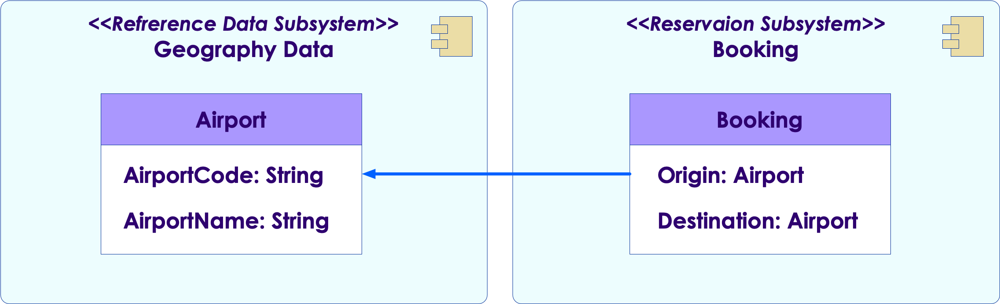

Notes: 

In this case, the subsystems were allowed to access the reference data directly using pass-by-reference semantic data instead of going through the EJB interfaces. This also meant that irrespective of the subsystems, hibernate entities could use the reference data as a part of their entity relationships:

As depicted in the preceding diagram, the Booking entity in the reservation subsystem is allowed to use the reference data entities, in this case Airport, as part of their relationships.


---

## Single Database	


 * Native Queries

 * The Hibernate framework provides a good abstraction over the underlying databases. 

     - It generates efficient SQL statements, in most of the cases targeting the database using specific dialects. 

     - However, sometimes, writing native JDBC SQLs offers better performance and resource efficiency. 

     - In some cases, using native database functions gives an even better performance.

 * The single database approach worked well at the beginning. 

     - But over a period of time, it opened up a loophole for the developers by connecting database tables owned by different subsystems. 

     - Native JDBC SQL was a good vehicle for doing this.

Notes: 

Though enough segregation was enforced at the middle tier, all functions pointed to a single database, even to the same database schema. The single schema approach opened a plethora of issues.


---

## 


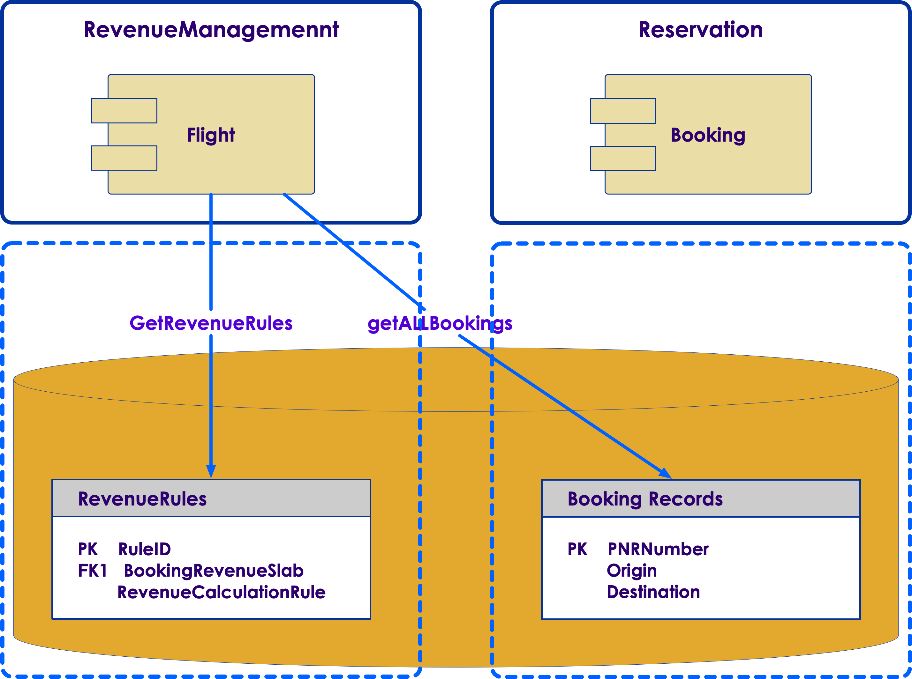

Notes: 

As shown in the preceding diagram, the Accounting component requires all booking records for a day, for a given city, from the Booking component to process the day-end billing. The subsystem-based design enforces Accounting to make a service call to Booking to get all booking records for a given city. Assume this results in N booking records. Now, for each booking record, Accounting has to execute a database call to find the applicable rules based on the fare code attached to each booking record. This could result in N+1 JDBC calls, which is inefficient. Workarounds, such as batch queries or parallel and batch executions, are available, but this would lead to increased coding efforts and higher complexity. The developers tackled this issue with a native JDBC query as an easy-to-implement shortcut. Essentially, this approach could reduce the number of calls from N+1 to a single database call, with minimal coding efforts.
This habit continued with many JDBC native queries connecting tables across multiple components and subsystems. This resulted not only in tightly coupled components, but also led to undocumented, hard-to-detect code.


---

## Single Database continued


 * Another issue that surfaced as a result of the use of a single database was the use of complex stored procedures. 

     - Some of the complex data-centric logic written at the middle layer was not performing well, causing slow response, memory issues, and thread-blocking issues.

 * In order to address this problem, the developers took the decision to move some of the complex business logic from the middle tier to the database tier by implementing the logic directly within the stored procedures. 

     - This decision resulted in better performance of some of the transactions, and removed some of the stability issues. More and more procedures were added over a period of time. 

     - However, this eventually broke the application's modularity.

Notes: 


---

## Domain Boundaries


 * Though the domain boundaries were well established, all the components were packaged as a single EAR file. 

 * Since all the components were set to run on a single container, there was no stopping the developers referencing objects across these boundaries. 

 * Over a period of time, the project teams changed, delivery pressure increased, and the complexity grew tremendously. The developers started looking for quick solutions rather than the right ones. 

 * Slowly, but steadily, the modular nature of the application went away.

Notes: 


---

## Single Database continued


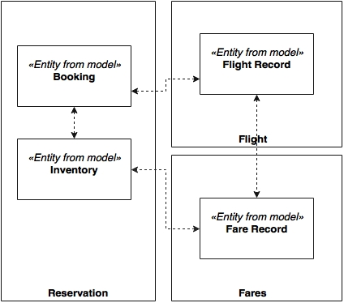

Notes: 

As depicted in the following diagram, hibernate relationships were created across subsystem boundaries:


---

## How can microservices help?


 * There are not many improvement opportunities left to support the growing demand of BrownField Airline's business. 

     - BrownField Airline was looking to re-platform the system with an evolutionary approach rather than a revolutionary model.

 * Microservices is an ideal choice in these situations—for transforming a legacy monolithic application with minimal disruption to the business.

Notes: 


---

## 


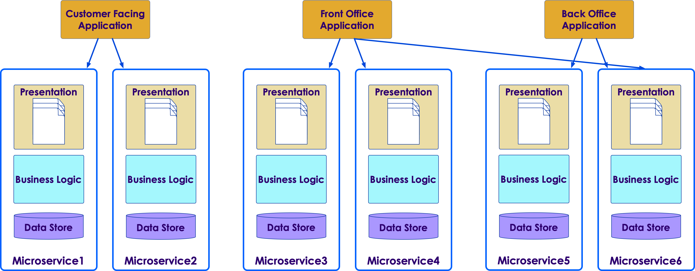

Notes: 

As shown in the preceding diagram, the objective is to move to a microservices-based architecture aligned to the business capabilities. Each microservice will hold the data store, the business logic, and the presentation layer.
The approach taken by BrownField Airline is to build a number of web portal applications targeting specific user communities such as customer facing, front office, and back office. The advantage of this approach lies in the flexibility for modeling, and also in the possibility to treat different communities differently. For example, the policies, architecture, and testing approaches for the Internet facing layer are different from the intranet-facing web application. Internet-facing applications may take advantage of CDNs (Content Delivery Networks) to move pages as close to the customer as possible, whereas intranet applications could serve pages directly from the data center.


---

## Is there a business case for microservices?


 * Service Dependencies

 * Physical Boundaries

 * Selective Scaling

 * Technology Obsolescence

Notes: 

The business case
When building business cases for migration, one of the commonly asked questions is "how does the microservices architecture avoid resurfacing of the same issues in another five years' time?"
Microservices offers a full list of benefits, which you learned in Chapter 1, Demystifying Microservices, but it is important to list a few here that are critical in this situation:


---

## Business Case


 *  **Service dependencies** 

     - While migrating from monolithic applications to microservices, the dependencies are better known, and therefore the architects and developers are much better placed to avoid breaking dependencies and to future-proof dependency issues. 

     - Lessons from the monolithic application helps architects and developers to design a better system.

Notes: 


---

## Business Case


 *  **Physical boundaries** 

     - Microservices enforce physical boundaries in all areas including the data store, the business logic, and the presentation layer. 

     - Access across subsystems or microservices are truly restricted due to their physical isolation. 

     - Beyond the physical boundaries, they could even run on different technologies.

Notes: 


---

## Business Case


 *  **Selective scaling** 

     - Selective scale out is possible in microservices architecture. 

     - This provides a much more cost-effective scaling mechanism compared to the Y-scale approach used in the monolithic scenario.

Notes: 


---

## Business Case


 *  **Technology obsolescence** 

     - Technology migrations could be applied at a microservices level rather than at the overall application level. 

     - Therefore, it does not require a humongous investment.

Notes: 


---

## Plan the microservices migration


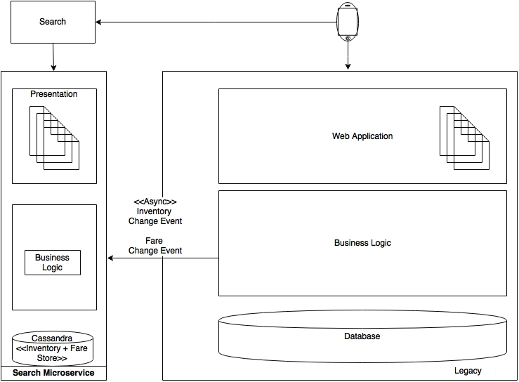

Notes: 

It is not simple to break an application that has millions of lines of code, especially if the code has complex dependencies. How do we break it? More importantly, where do we start, and how do we approach this problem?
The most common approach is the evolutionary approach
The best way to address this problem is to establish a transition plan, and gradually migrate the functions as microservices. At every step, a microservice will be created outside of the monolithic application, and traffic will be diverted to the new service as shown in the following diagram


---

## Key Questions to be Answered


 * Identification of microservices' boundaries

 * Prioritizing microservices for migration

 * Handling data synchronization during the transition phase

 * Handling user interface integration, working with old and new user interfaces

 * Handling of reference data in the new system

 * Testing strategy to ensure the business capabilities are intact and correctly reproduced

 * Identification of any prerequisites for microservice development such as microservices capabilities, frameworks, processes, and so on

Notes: 


---

## Identify Service Boundaries


 * The first and foremost activity is to identify the microservices' boundaries. 

     - This is the most interesting part of the problem, and the most difficult part as well. 

     - If identification of the boundaries is not done properly, the migration could lead to more complex manageability issues.

 * Like in SOA, a service decomposition is the best way to identify services. 

     - However, it is important to note that decomposition stops at a business capability or bounded context. 

     - In SOA, service decomposition goes further into an atomic, granular service level.

Notes: 


---

## Identify Service Boundaries


 * A top-down approach is typically used for domain decomposition. 

 * The bottom-up approach is also useful in the case of breaking an existing system, as it can utilize a lot of practical knowledge, functions, and behaviors of the existing monolithic application.

Notes: 

The previous decomposition step will give a potential list of microservices. It is important to note that this isn't the final list of microservices, but it serves as a good starting point. We will run through a number of filtering mechanisms to get to a final list. The first cut of functional decomposition will, in this case, be similar to the diagram shown under the functional view introduced earlier in this chapter.


---

## Analyze Dependencies


 * Analyzing the manual code and regenerating dependencies.

 * Using the experience of the development team to regenerate dependencies.

 * Using a Maven dependency graph. There are a number of tools we could use to regenerate the dependency graph, such as PomExplorer, PomParser, and so on.

 * Using performance engineering tools such as AppDynamics to identify the call stack and roll up dependencies.

Notes: 

The next step is to analyze the dependencies between the initial set of candidate microservices that we created in the previous section. At the end of this activity, a dependency graph will be produced.
Note
A team of architects, business analysts, developers, release management and support staff is required for this exercise.
One way to produce a dependency graph is to list out all the components of the legacy system and overlay dependencies. This could be done by combining one or more of the approaches listed as follows:


---

## 


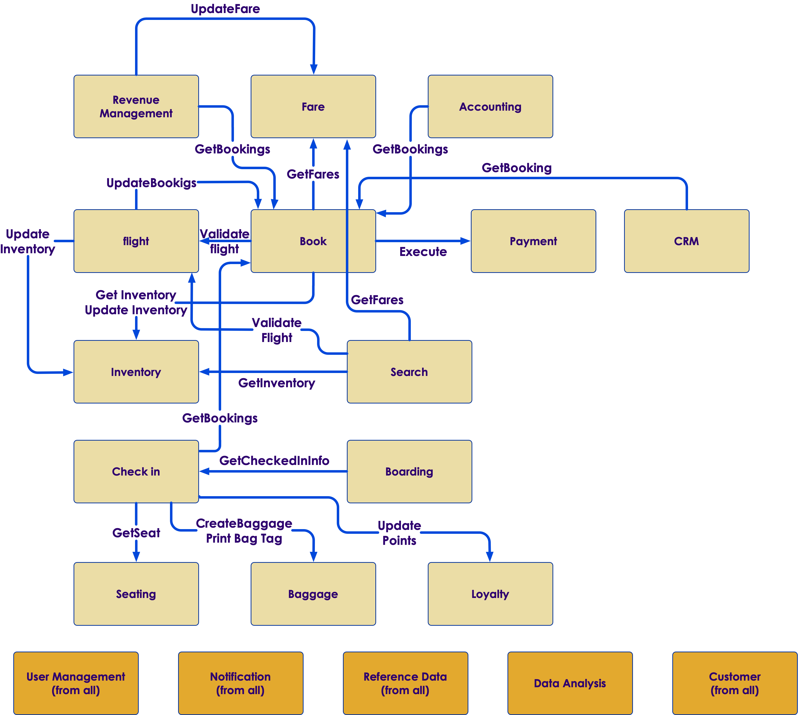

Notes: 

Let us assume that we reproduce the functions and their dependencies as shown in the following diagram:
There are many dependencies going back and forth between different modules. The bottom layer shows cross-cutting capabilities that are used across multiple modules. At this point, the modules are more like spaghetti than autonomous units.
The next step is to analyze these dependencies, and come up with a better, simplified dependency map.


---

## Look for Events (Asynch) as Opposed to Queries (Sync)


 * Dependencies could be query-based or event-based. 

 * Event-based is better for scalable systems. Sometimes, it is possible to convert query-based communications to event-based ones. 

 * In many cases, these dependencies exist because either the business organizations are managed like that, or by virtue of the way the old system handled the business scenario.

Notes: 


---

## 


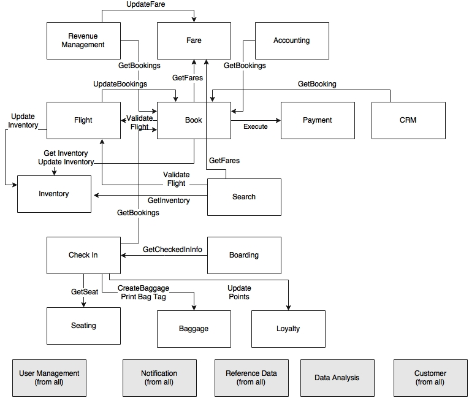


Notes: 

From the previous diagram, we can extract the Revenue Management and the Fares services:
Revenue Management is a module used for calculating optimal fare values, based on the booking demand forecast. In case of a fare change between an origin and a destination, Update Fare on the Fare module is called by Revenue Management to update the respective fares in the Fare module.
An alternate way of thinking is that the Fare module is subscribed to Revenue Management for any changes in fares, and Revenue Management publishes whenever there is a fare change. This reactive programming approach gives an added flexibility by which the Fares and the Revenue Management modules could stay independent, and connect them through a reliable messaging system. This same pattern could be applied in many other scenarios from Check-In to the Loyalty and Boarding modules.


---

## 


Notes: 

Next, examine the scenario of CRM and Booking:
This scenario is slightly different from the previously explained scenario. The CRM module is used to manage passenger complaints. When CRM receives a complaint, it retrieves the corresponding passenger's Booking data. In reality, the number of complaints are negligibly small when compared to the number of bookings. If we blindly apply the previous pattern where CRM subscribes to all bookings, we will find that it is not cost effective:

Examine another scenario between the Check-in and Booking modules. Instead of Check-in calling the Get Bookings service on Booking, can Check-in listen to booking events? This is possible, but the challenge here is that a booking can happen 360 days in advance, whereas Check-in generally starts only 24 hours before the fight departure. Duplicating all bookings and booking changes in the Check-in module 360 days in advance would not be a wise decision as Check-in does not require this data until 24 hours before the flight departure.
An alternate option is that when check-in opens for a flight (24 hours before departure), Check-in calls a service on the Booking module to get a snapshot of the bookings for a given flight. Once this is done, Check-in could subscribe for booking events specifically for that flight. In this case, a combination of query-based as well as event-based approaches is used. By doing so, we reduce the unnecessary events and storage apart from reducing the number of queries between these two services.
In short, there is no single policy that rules all scenarios. Each scenario requires logical thinking, and then the most appropriate pattern is applied.


---

## Events as opposed to subscription updates


 * Apart from the query model, a dependency could be an update transaction as well. Consider the scenario between Revenue Management and Booking

Notes: 


---

## 


Notes: 

In order to do a forecast and analysis of the current demand, Revenue Management requires all bookings across all flights. The current approach, as depicted in the dependency graph, is that Revenue Management has a schedule job that calls Get Booking on Booking to get all incremental bookings (new and changed) since the last synchronization.


---

## 


 * An alternative approach is to send new bookings and the changes in bookings as soon as they take place in the Booking module as an asynchronous push. 

 * The same pattern could be applied in many other scenarios such as from Booking to Accounting, from Flight to Inventory, and also from Flight to Booking. 

 * In this approach, the source service publishes all state-change events to a topic. 

 * All interested parties could subscribe to this event stream and store locally. 

 * This approach removes many hard wirings, and keeps the systems loosely coupled.

Notes: 


---

## 


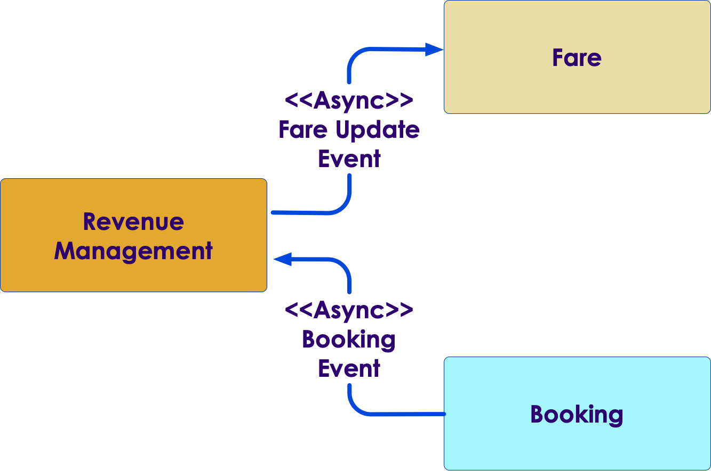

Notes: 

In this case depicted in the preceding diagram, we changed both dependencies and converted them to asynchronous events.

The dependency is depicted in the diagram:


---

## 


Notes: 

One last case to analyze is the Update Inventory call from the Booking module to the Inventory module:
When a booking is completed, the inventory status is updated by depleting the inventory stored in the Inventory service. For example, when there are 10 economy class seats available, at the end of the booking, we have to reduce it to 9. In the current system, booking and updating inventory are executed within the same transaction boundaries. This is to handle a scenario in which there is only one seat left, and multiple customers are trying to book. In the new design, if we apply the same event-driven pattern, sending the inventory update as an event to Inventory may leave the system in an inconsistent state. This needs further analysis, which we will address later in this chapter.


---

## Challenge the requirements


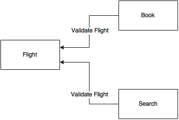

Notes: 

In many cases, the targeted state could be achieved by taking another look at the requirements:
There are two Validate Flight calls, one from Booking and another one from the Search module. The Validate Flight call is to validate the input flight data coming from different channels. The end objective is to avoid incorrect data stored or serviced. When a customer does a flight search, say "BF100", the system validates this flight to see the following things:
Whether this is a valid flight?
Whether the flight exists on that particular date?
Are there any booking restrictions set on this flight?
An alternate way of solving this is to adjust the inventory of the flight based on these given conditions. For example, if there is a restriction on the flight, update the inventory as zero. In this case, the intelligence will remain with Flight, and it keeps updating the inventory. As far as Search and Booking are concerned, both just look up the inventory instead of validating flights for every request. This approach is more efficient as compared to the original approach.
Next we will review the Payment use case. Payment is typically a disconnected function due to the nature of security constraints such as PCIDSS-like standards. The most obvious way to capture a payment is to redirect a browser to a payment page hosted in the Payment service. Since card handling applications come under the purview of PCIDSS, it is wise to remove any direct dependencies from the Payment service. Therefore, we can remove the Booking-to-Payment direct dependency, and opt for a UI-level integration.


---

## Challenge the service boundaries


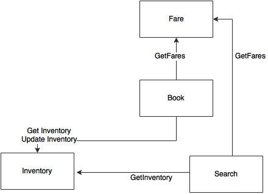

Notes: 

In this section, we will review some of the service boundaries based on the requirements and dependency graph, considering Check-in and its dependencies to Seating and Baggage.
The Seating function runs a few algorithms based on the current state of the seat allocation in the airplane, and finds out the best way to position the next passenger so that the weight and balance requirements can be met. This is based on a number of predefined business rules. However, other than Check-in, no other module is interested in the Seating function. From a business capability perspective, Seating is just a function of Check-in, not a business capability by itself. Therefore, it is better to embed this logic inside Check-in itself.
The same is applicable to Baggage as well. BrownField has a separate baggage handling system. The Baggage function in the PSS context is to print the baggage tag as well as store the baggage data against the Check-in records. There is no business capability associated with this particular functionality. Therefore, it is ideal to move this function to Check-in itself.
The Book, Search, and Inventory functions, after redesigning, are shown in the following diagram:
Similarly, Inventory and Search are more supporting functions of the Booking module. They are not aligned with any of the business capabilities as such. Similar to the previous judgement, it is ideal to move both the Search and Inventory functions to Booking. Assume, for the time being, that Search, Inventory, and Booking are moved to a single microservice named Reservation.

As per the statistics of BrownField, search transactions are 10 times more frequent than the booking transactions. Moreover, search is not a revenue-generating transaction when compared to booking. Due to these reasons, we need different scalability models for search and booking. Booking should not get impacted if there is a sudden surge of transactions in search. From the business point of view, dropping a search transaction in favor of saving a valid booking transaction is more acceptable.


---

## 


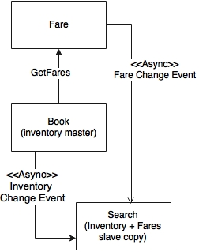

Notes: 

This is an example of a polyglot requirement, which overrules the business capability alignment. In this case, it makes more sense to have Search as a service separate from the Booking service. Let us assume that we remove Search. Only Inventory and Booking remain under Reservation. Now Search has to hit back to Reservation to perform inventory searches. This could impact the booking transactions:

A better approach is to keep Inventory along with the Booking module, and keep a read-only copy of the inventory under Search, while continuously synchronizing the inventory data over a reliable messaging system. Since both Inventory and Booking are collocated, this will also solve the need to have two-phase commits. Since both of them are local, they could work well with local transactions.
Let us now challenge the Fare module design. When a customer searches for a flight between A and B for a given date, we would like to show the flights and fares together. That means that our read-only copy of inventory can also combine both fares as well as inventory. Search will then subscribe to Fare for any fare change events. The intelligence still stays with the Fare service, but it keeps sending fare updates to the cached fare data under Search.


---

## Final Dependency Graph


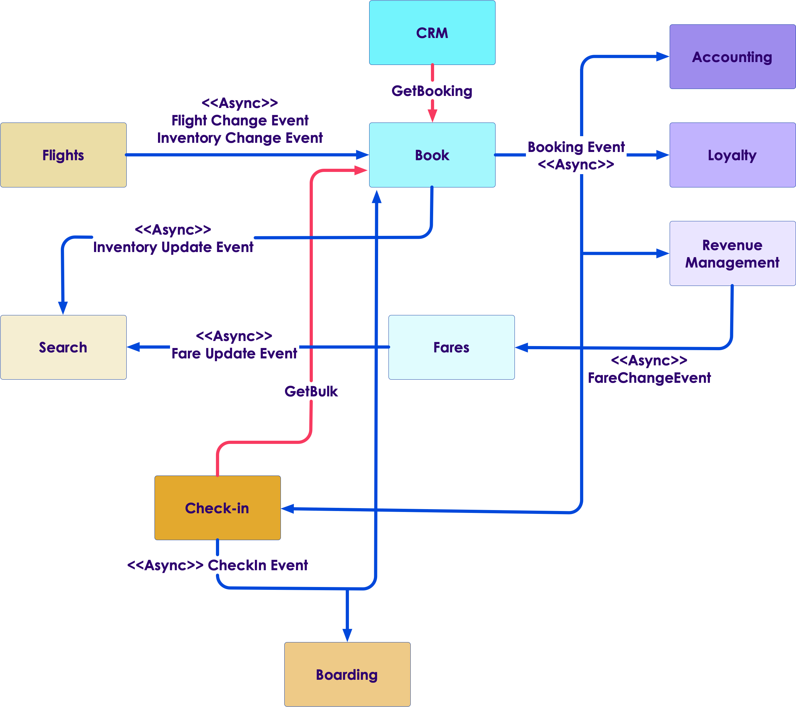

Notes: 

There are still a few synchronized calls, which, for the time being, we will keep as they are.
By applying all these changes, the final dependency diagram will look like the following one:
Now we can safely consider each box in the preceding diagram as a microservice. We have nailed down many dependencies, and modeled many of them as asynchronous as well. The overall system is more or less designed in the reactive style. There are still some synchronized calls shown in the diagram with bold lines, such as Get Bulk from Check-In, Get Booking from CRM, and Get Fare from Booking. These synchronous calls are essentially required as per the trade-off analysis.


---

## Prioritizing Microservices


 *  **Dependency** 

 *  **Transaction volume** 

 *  **Resource utilization** 

 *  **Complexity** 

 *  **Business criticality** 

 *  **Velocity of changes** 

 *  **Innovation** 

Notes: 

We have identified a first-cut version of our microservices-based architecture. As the next step, we will analyze the priorities, and identify the order of migration. This could be done by considering multiple factors explained as follows:
Dependency: One of the parameters for deciding the priority is the dependency graph. From the service dependency graph, services with less dependency or no dependency at all are easy to migrate, whereas complex dependencies are way harder. Services with complex dependencies will also need dependent modules to be migrated along with them.
Accounting, Loyalty, CRM, and Boarding have less dependencies as compared to Booking and Check-in. Modules with high dependencies will also have higher risks in their migration.
Transaction volume: Another parameter that can be applied is analyzing the transaction volumes. Migrating services with the highest transaction volumes will relieve the load on the existing system. This will have more value from an IT support and maintenance perspective. However, the downside of this approach is the higher risk factor.
As stated earlier, Search requests are ten times higher in volume as compared to Booking requests. Requests for Check-in are the third-highest in volume transaction after Search and Booking.
Resource utilization: Resource utilization is measured based on the current utilizations such as CPU, memory, connection pools, thread pools, and so on. Migrating resource intensive services out of the legacy system provides relief to other services. This helps the remaining modules to function better.
Flight, Revenue Management, and Accounting are resource-intensive services, as they involve data-intensive transactions such as forecasting, billing, flight schedule changes, and so on.
Complexity: Complexity is perhaps measured in terms of the business logic associated with a service such as function points, lines of code, number of tables, number of services, and others. Less complex modules are easy to migrate as compared to the more complex ones.
Booking is extremely complex as compared to the Boarding, Search, and Check-in services.
Business criticality: The business criticality could be either based on revenue or customer experience. Highly critical modules deliver higher business value.
Booking is the most revenue-generating service from the business stand point, whereas Check-in is business critical as it could lead to flight departure delays, which could lead to revenue loss as well as customer dissatisfaction.
Velocity of changes: Velocity of change indicates the number of change requests targeting a function in a short time frame. This translates to speed and agility of delivery. Services with high velocity of change requests are better candidates for migration as compared to stable modules.
Statistics show that Search, Booking, and Fares go through frequent changes, whereas Check-in is the most stable function.
Innovation: Services that are part of a disruptive innovative process need to get priority over back office functions that are based on more established business processes. Innovations in legacy systems are harder to achieve as compared to applying innovations in the microservices world.
Most of the innovations are around Search, Booking, Fares, Revenue Management, and Check-in as compared to back office Accounting.
Based on BrownField's analysis, Search has the highest priority, as it requires innovation, has high velocity of changes, is less business critical, and gives better relief for both business and IT. The Search service has minimal dependency with no requirements to synchronize data back to the legacy system.


---

## Data Sync During Migration


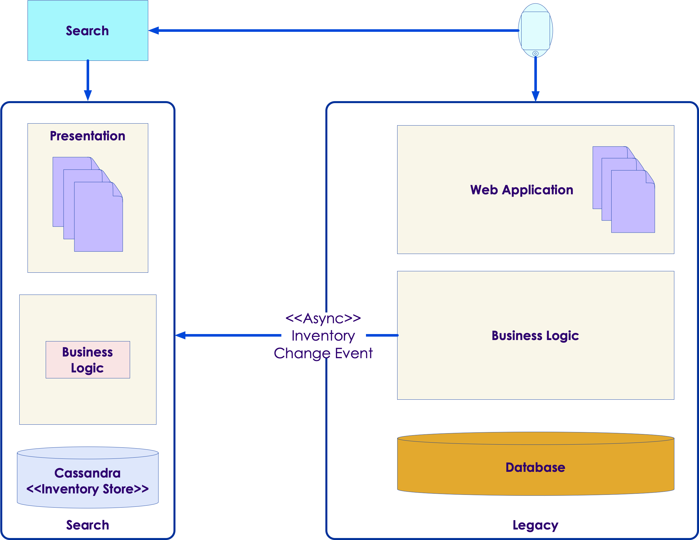

Notes: 

During the transition phase, the legacy system and the new microservices will run in parallel. Therefore, it is important to keep the data synchronized between the two systems.
The simplest option is to synchronize the data between the two systems at the database level by using any data synchronization tool. This approach works well when both the old and the new systems are built on the same data store technologies. The complexity will be higher if the data store technologies are different. The second problem with this approach is that we allow a backdoor entry, hence exposing the microservices' internal data store outside. This is against the principle of microservices.
Let us take this on a case-by-case basis before we can conclude with a generic solution. The following diagram shows the data migration and synchronization aspect once Search is taken out:
Let us assume that we use a NoSQL database for keeping inventory and fares under the Search service. In this particular case, all we need is the legacy system to supply data to the new service using asynchronous events. We will have to make some changes in the existing system to send the fare changes or any inventory changes as events. The Search service then accepts these events, and stores them locally into the local NoSQL store.


---

## 


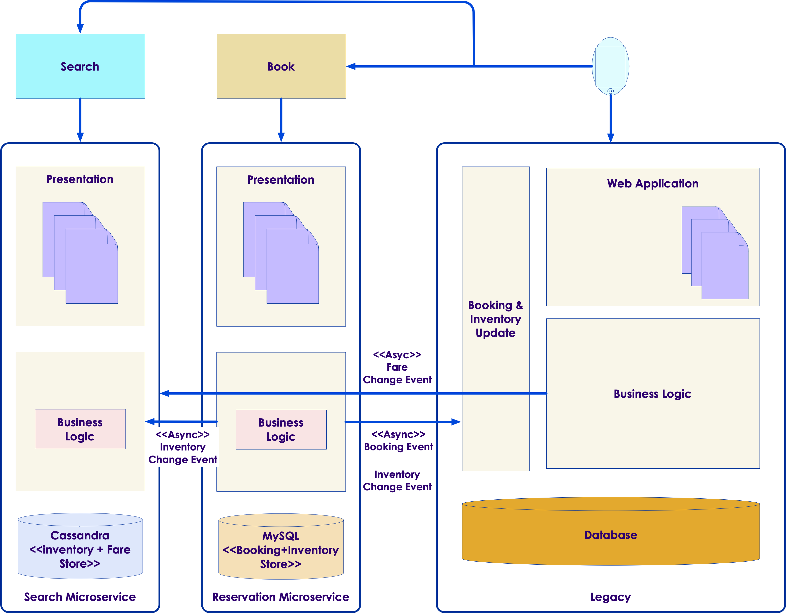

Notes: 

This is a bit more tedious in the case of the complex Booking service.
In this case, the new Booking microservice sends the inventory change events to the Search service. In addition to this, the legacy application also has to send the fare change events to Search. Booking will then store the new Booking service in its My SQL data store.
The most complex piece, the Booking service, has to send the booking events and the inventory events back to the legacy system. This is to ensure that the functions in the legacy system continue to work as before. The simplest approach is to write an update component which accepts the events and updates the old booking records table so that there are no changes required in the other legacy modules. We will continue this until none of the legacy components are referring the booking and inventory data. This will help us minimize changes in the legacy system, and therefore, reduce the risk of failures.
In short, a single approach may not be sufficient. A multi-pronged approach based on different patterns is required


---

## Managing Reference Data


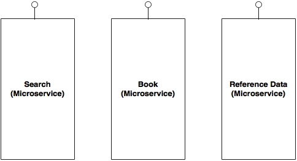

Notes: 

One of the biggest challenges in migrating monolithic applications to microservices is managing reference data. A simple approach is to build the reference data as another microservice itself as shown in the following diagram:
In this case, whoever needs reference data should access it through the microservice endpoints. This is a well-structured approach, but could lead to performance issues as encountered in the original legacy system.


---

## 


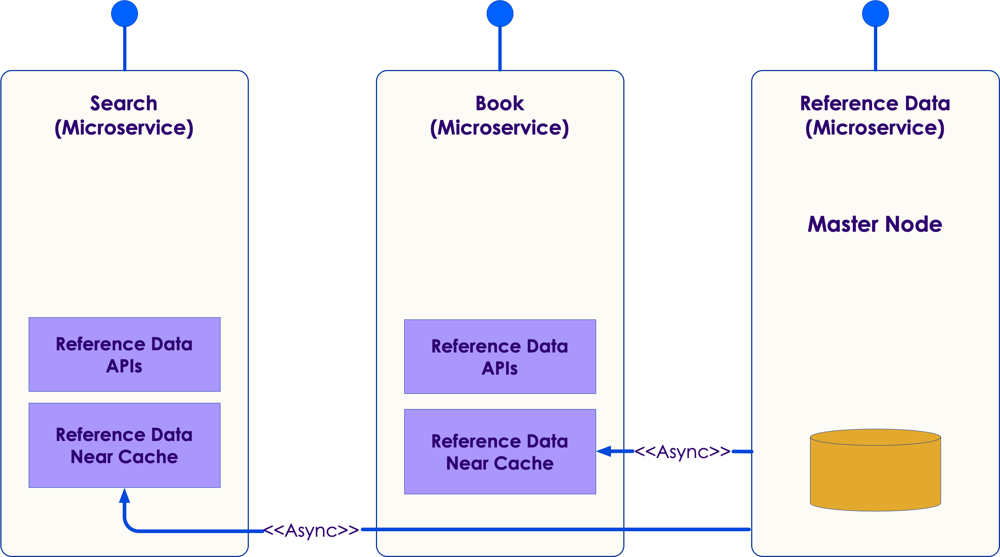

Notes: 

An alternate approach is to have reference data as a microservice service for all the admin and CRUD functions. A near cache will then be created under each service to incrementally cache data from the master services. A thin reference data access proxy library will be embedded in each of these services. The reference data access proxy abstracts whether the data is coming from cache or from a remote service.
This is depicted in the next diagram. The master node in the given diagram is the actual reference data microservice:


---

## 


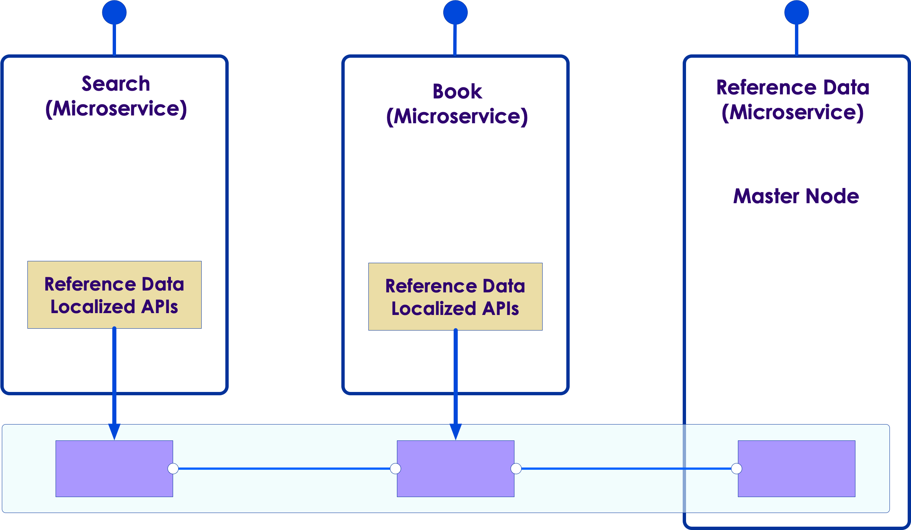

Notes: 

The challenge is to synchronize the data between the master and the slave. A subscription mechanism is required for those data caches that change frequently.
A better approach is to replace the local cache with an in-memory data grid, as shown in the following diagram:
The reference data microservice will write to the data grid, whereas the proxy libraries embedded in other services will have read-only APIs. This eliminates the requirement to have subscription of data, and is much more efficient and consistent.


---

## UI's and Web Apps


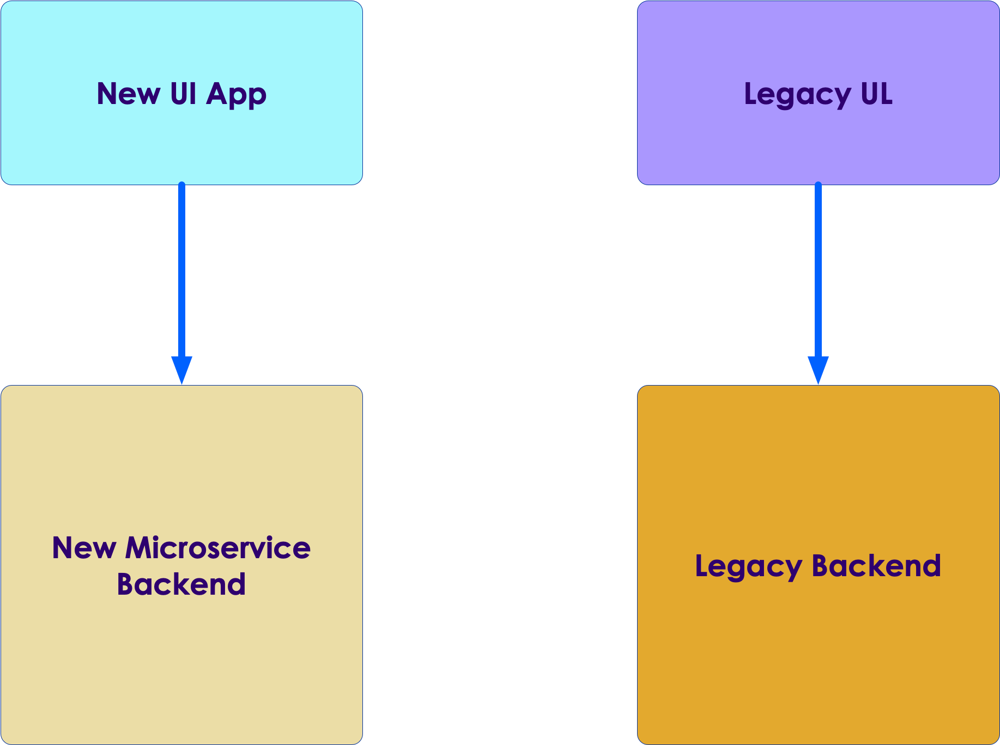

Notes: 

During the transition phase, we have to keep both the old and new user interfaces together. There are three general approaches usually taken in this scenario.
The first approach is to have the old and new user interfaces as separate user applications with no link between them, as depicted in the following diagram:
A user signs in to the new application as well as into the old application, much like two different applications, with no single sign-on (SSO) between them. This approach is simple, and there is no overhead. In most of the cases, this may not be acceptable to the business unless it is targeted at two different user communities.


---

## 


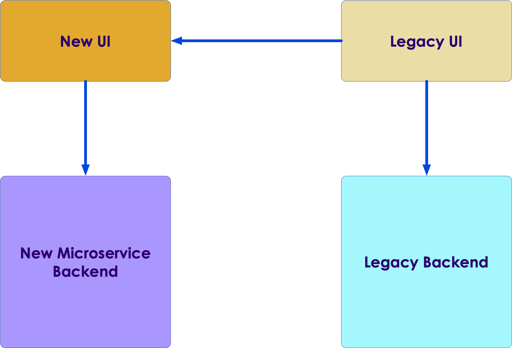

Notes: 

The second approach is to use the legacy user interface as the primary application, and then transfer page controls to the new user interfaces when the user requests pages of the new application:
In this case, since the old and the new applications are web-based applications running in a web browser window, users will get a seamless experience. SSO has to be implemented between the old and the new user interfaces.


---

## 


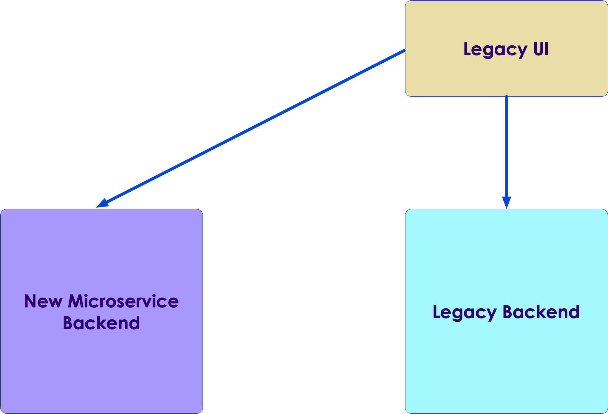

Notes: 

The third approach is to integrate the existing legacy user interface directly to the new microservices backend, as shown in the next diagram:
In this case, the new microservices are built as headless applications with no presentation layer. This could be challenging, as it may require many changes in the old user interface such as introducing service calls, data model conversions, and so on.
Another issue in the last two cases is how to handle the authentication of resources and services.


---

## Session Handling and Security


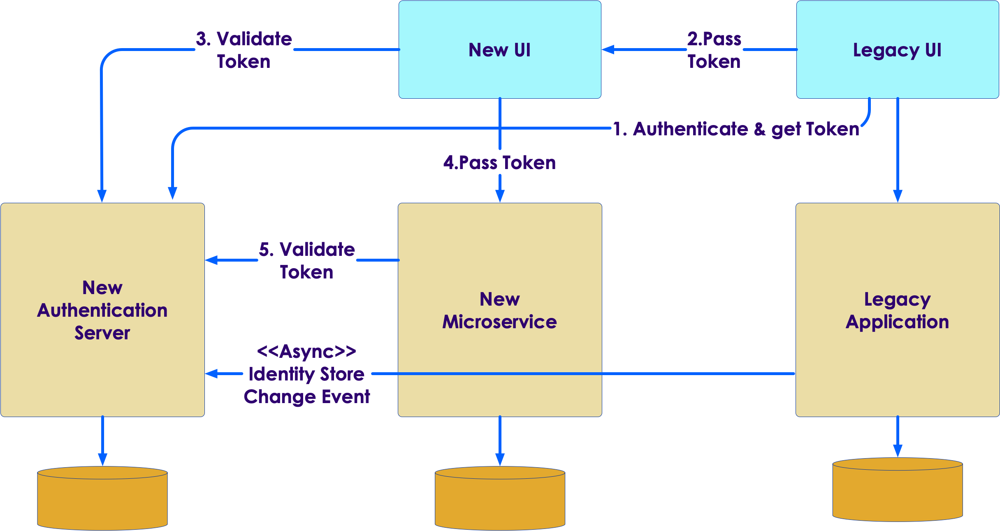

Notes: 

Assume that the new services are written based on Spring Security with a token-based authorization strategy, whereas the old application uses a custom-built authentication with its local identity store.
The following diagram shows how to integrate between the old and the new services:
The simplest approach, as shown in the preceding diagram, is to build a new identity store with an authentication service as a new microservice using Spring Security. This will be used for all our future resource and service protections, for all microservices.
The existing user interface application authenticates itself against the new authentication service, and secures a token. This token will be passed to the new user interface or new microservice. In both cases, the user interface or microservice will make a call to the authentication service to validate the given token. If the token is valid, then the UI or microservice accepts the call.
The catch here is that the legacy identity store has to be synchronized with the new one.


---

## Test Strategy


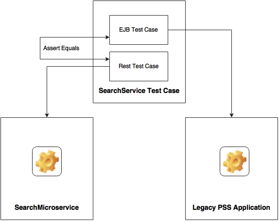

Notes: 

One important question to answer from a testing point of view is how can we ensure that all functions work in the same way as before the migration?
Integration test cases should be written for the services that are getting migrated before the migration or refactoring. This ensures that once migrated, we get the same expected result, and the behavior of the system remains the same. An automated regression test pack has to be in place, and has to be executed every time we make a change in the new or old system.
In the following diagram, for each service we need one test against the EJB endpoint, and another one against the microservices endpoint:


---

## Migrate only what is necessary


 * In the previous sections, we have examined approaches and steps for transforming from a monolithic application to microservices. 

     - It is important to understand that it is not necessary to migrate all modules to the new microservices architecture, unless it is really required. 

     - A major reason is that these migrations incur cost.

Notes: 


---

## Migrate only what is necessary


 * We will review a few such scenarios here. 

     - BrownField has already taken a decision to use an external revenue management system in place of the PSS revenue management function. 

     - BrownField is also in the process of centralizing their accounting functions, and therefore, need not migrate the accounting function from the legacy system. 

     - Migration of CRM does not add much value at this point to the business. 

     - Therefore, it is decided to keep the CRM in the legacy system itself. 

     - The business has plans to move to a SaaS-based CRM solution as part of their cloud strategy. 

     - Also note that stalling the migration halfway through could seriously impact the complexity of the system.

Notes: 


---

## Target Implementation Architecture


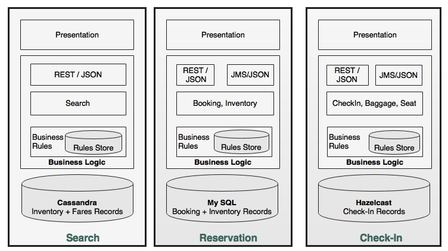

Notes: 

The architecture blueprint shown in the following diagrams consolidates earlier discussions into an architectural view. Each block in the diagram represents a microservice. The shaded boxes are core microservices, and the others are supporting microservices. The diagram also shows the internal capabilities of each microservice. User management is moved under security in the target architecture:


---

## Target Implementation Architecture


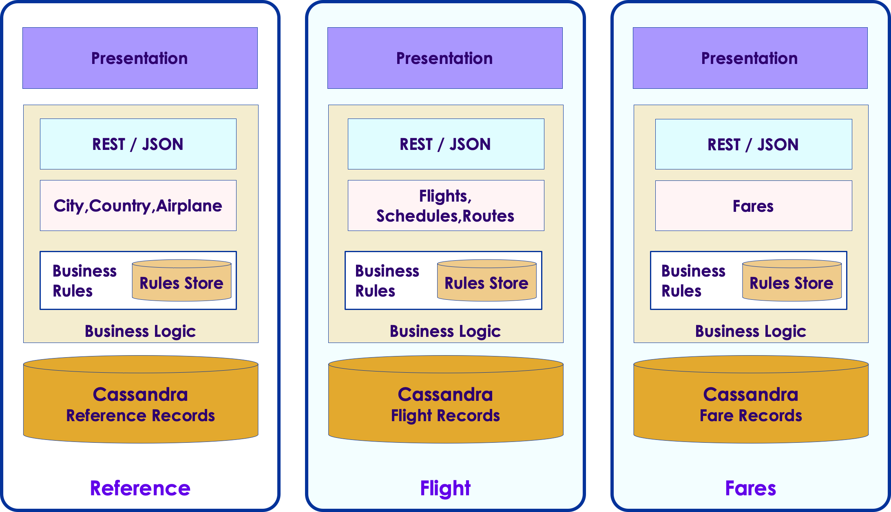

Notes: 

Each service has its own architecture, typically consisting of a presentation layer, one or more service endpoints, business logic, business rules, and database. As we can see, we use different selections of databases that are more suitable for each microservice. Each one is autonomous with minimal orchestration between the services. Most of the services interact with each other using the service endpoints.


---

## Target Implementation Architecture


 * Target Implementation Architecture

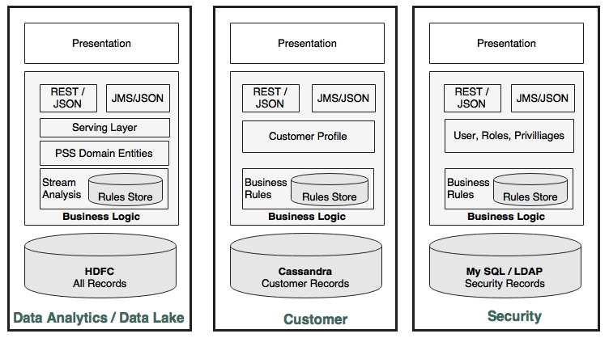

Notes: 


---

## Target Implementation Architecture


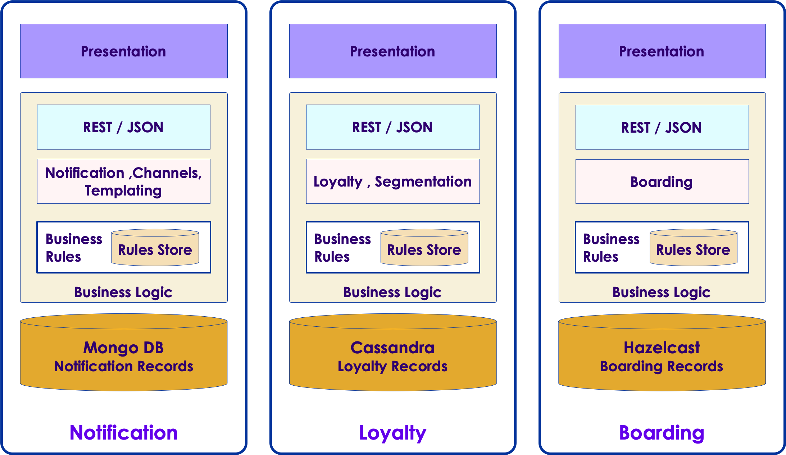

Notes: 


---

## Internal layering of microservices


 * Internal layering of microservices

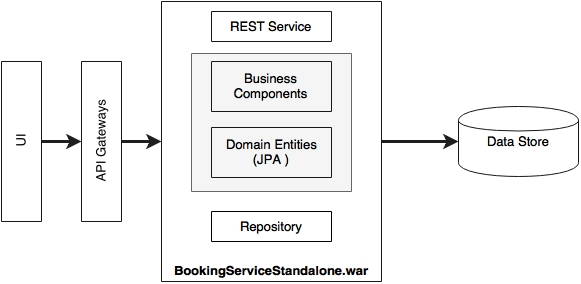

Notes: 

In this section, we will further explore the internal structure of microservices. There is no standard to be followed for the internal architecture of a microservice. The rule of thumb is to abstract realizations behind simple service endpoints.
A typical structure would look like the one shown in the following diagram:
The UI accesses REST services through a service gateway. The API gateway may be one per microservice or one for many microservices—it depends on what we want to do with the API gateway. There could be one or more rest endpoints exposed by microservices. These endpoints, in turn, connect to one of the business components within the service. Business components then execute all the business functions with the help of domain entities. A repository component is used for interacting with the backend data store.


---

## Orchestrating Microservices


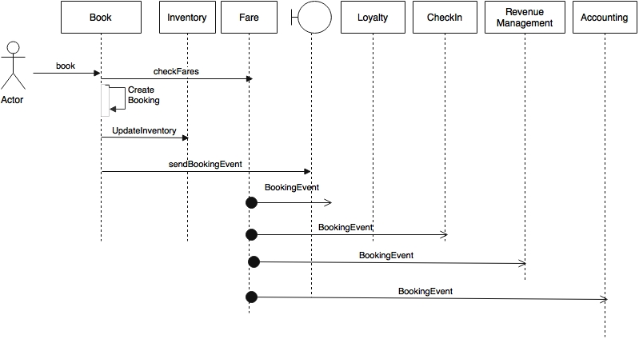

Notes: 

The logic of the booking orchestration and the execution of rules sits within the Booking service. The brain is still inside the Booking service in the form of one or more booking business components. Internally, business components orchestrate private APIs exposed by other business components or even external services:

As shown in the preceding diagram, the booking service internally calls to update the inventory of its own component other than calling the Fare service.
Is there any orchestration engine required for this activity? It depends on the requirements. In complex scenarios, we may have to do a number of things in parallel. For example, creating a booking internally applies a number of booking rules, it validates the fare, and it validates the inventory before creating a booking. We may want to execute them in parallel. In such cases, we may use Java concurrency APIs or reactive Java libraries.
In extremely complex situations, we may opt for an integration framework such as Spring Integration or Apache Camel in embedded mode.


---

## Integration with other systems


 * In the microservices world, we use an API gateway or a reliable message bus for integrating with other non-microservices.

 * Let us assume that there is another system in BrownField that needs booking data. 

     - Unfortunately, the system is not capable of subscribing to the booking events that the Booking microservice publishes. 

     - In such cases, an  **Enterprise Application integration**  ( **EAI** ) solution could be employed, which listens to our booking events, and then uses a native adaptor to update the database.

Notes: 


---

## Managing Shared Libraries


 * Certain business logic is used in more than one microservice. 

 * Search and Reservation, in this case, use inventory rules. 

 * In such cases, these shared libraries will be duplicated in both the microservices.

Notes: 


---

## Exception Handling


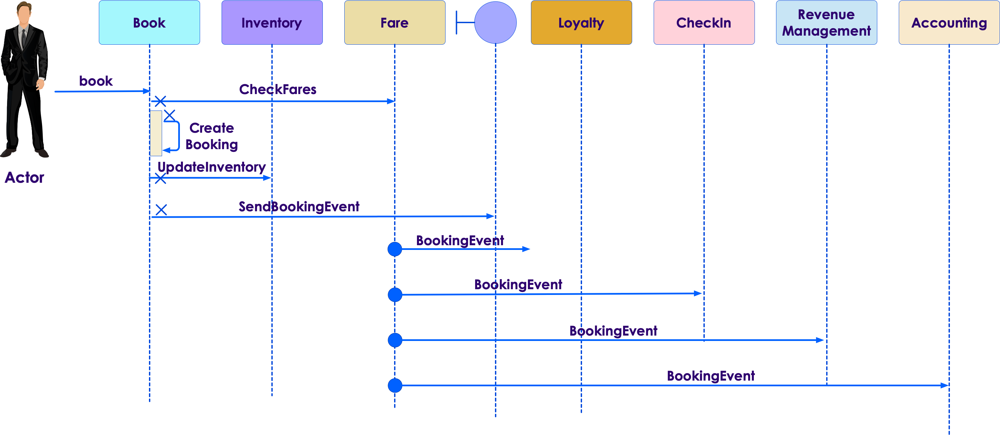

Notes: 

Examine the booking scenario to understand the different exception handling approaches. In the following service sequence diagram, there are three lines marked with a cross mark. These are the potential areas where exceptions could occur:
There is a synchronous communication between Booking and Fare. What if the Fare service is not available? If the Fare service is not available, throwing an error back to the user may cause revenue loss. An alternate thought is to trust the fare which comes as part of the incoming request. When we serve search, the search results will have the fare as well. When the user selects a flight and submits, the request will have the selected fare. In case the Fare service is not available, we trust the incoming request, and accept the Booking. We will use a circuit breaker and a fallback service which simply creates the booking with a special status, and queues the booking for manual action or a system retry.
What if creating the booking fails? If creating a booking fails unexpectedly, a better option is to throw a message back to the user. We could try alternative options, but that could increase the overall complexity of the system. The same is applicable for inventory updates.
In the case of creating a booking and updating the inventory, we avoid a situation where a booking is created, and an inventory update somehow fails. As the inventory is critical, it is better to have both, create booking and update inventory, to be in a local transaction. This is possible as both components are under the same subsystem.


---

## 


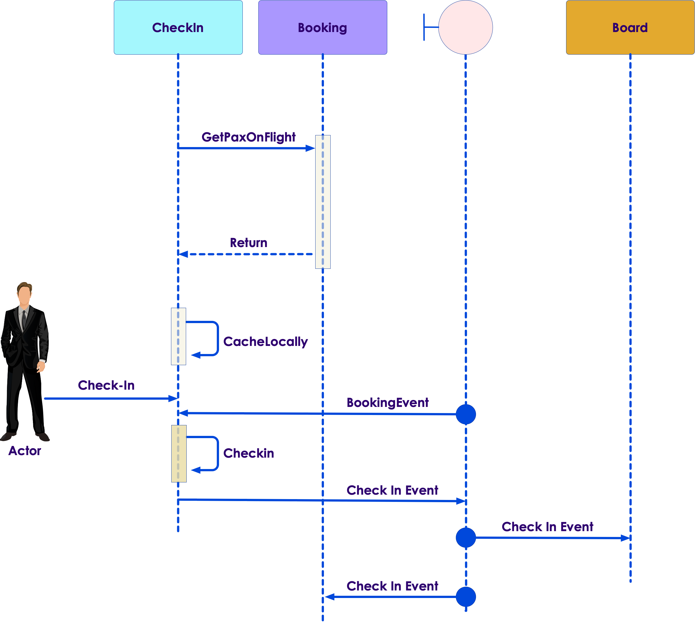

Notes: 

If we consider the Check-in scenario, Check-in sends an event to Boarding and Booking as shown in the next diagram:
Consider a scenario where the Check-in services fail immediately after the Check-in Complete event is sent out. The other consumers processed this event, but the actual check-in is rolled back. This is because we are not using a two-phase commit. In this case, we need a mechanism for reverting that event. This could be done by catching the exception, and sending another Check-in Cancelled event.
In this case, note that to minimize the use of compensating transactions, sending the Check-in event is moved towards the end of the Check-in transaction. This reduces the chance of failure after sending out the event.
On the other hand, what if the check-in is successful, but sending the event failed? We could think of two approaches. The first approach would be to invoke a fallback service to store it locally, and then use another sweep-and-scan program to send the event at a later time. It could even retry multiple times. This could add more complexity and may not be efficient in all cases. An alternate approach is to throw the exception back to the user so that the user can retry. However, this might not always be good from a customer engagement standpoint. On the other hand, the earlier option is better for the system's health. A trade-off analysis is required to find out the best solution for the given situation.


---

## Target View (Lab)


Notes: 


---

## 5 - Reviewing BrownField's PSS Implementation


 * Each microservice exposes a set of REST/JSON endpoints for accessing business capabilities

 * Each microservice implements certain business functions using the Spring framework.

 * Each microservice stores its own persistent data using H2, an in-memory database

 * Microservices are built with Spring Boot, which has an embedded Tomcat server as the HTTP listener

 * RabbitMQ is used as an external messaging service. Search, Booking, and Check-in interact with each other through asynchronous messaging

 * Swagger is integrated with all microservices for documenting the REST APIs.

 * An OAuth2-based security mechanism is developed to protect the microservices

Notes: 

In session 4, Microservices Evolution – A Case Study, we designed and developed a microservice-based PSS system for BrownField Airlines using the Spring framework and Spring Boot. The implementation is satisfactory from the development point of view, and it serves the purpose for low volume transactions. However, this is not good enough for deploying large, enterprise-scale deployments with hundreds or even thousands of microservices.
In session 4, Microservices Evolution – A Case Study, we developed four microservices: Search, Booking, Fares, and Check-in. We also developed a website to test the microservices.
We have accomplished the following items in our microservice implementation so far (above):


---

## Setting Up Environment for BrownField PSS


 * Decision Point:  Spring Cloud or Kubernetes?

Notes: 

In this session, we will amend the BrownField PSS microservices developed in session 4, Microservices Evolution – A Case Study, using Spring Cloud capabilities. We will also examine how to make these services enterprise grade using Spring Cloud components.
Subsequent sections of this session will explore how to scale the microservices developed in the previous session for cloud scale deployments, using some out-of-the-box capabilities provided by the Spring Cloud project. The rest of this session will explore Spring Cloud capabilities such as configuration using the Spring Config server, Ribbon-based service load balancing, service discovery using Eureka, Zuul for API gateway, and finally, Spring Cloud messaging for message-based service interactions. We will demonstrate the capabilities by modifying the BrownField PSS microservices developed in session 4, Microservices Evolution – A Case Study.
In order to prepare the environment for this session, import and rename (session4.* to session5.*) projects into a new STS workspace.


---

## Scaling Microservices with Spring Cloud


 * The Spring Config server for externalizing configuration

 * The Eureka server for service registration and discovery

 * The relevance of Zuul as a service proxy and gateway

 * The implementation of automatic microservice registration...

Notes: 

In order to manage Internet-scale microservices, one requires more capabilities than what are offered by the Spring Boot framework. The Spring Cloud project has a suite of purpose-built components to achieve these additional capabilities effortlessly.
This session will provide a deep insight into the various components of the Spring Cloud project such as Eureka, Zuul, Ribbon, and Spring Config by positioning them against the microservices capability model discussed in session 3, Applying Microservices Concepts. It will demonstrate how the Spring Cloud components help to scale the BrownField Airline's PSS microservices system, developed in the previous session.
By the end of this session, you will learn about the above:


---

## Reviewing Microservices Capabilities


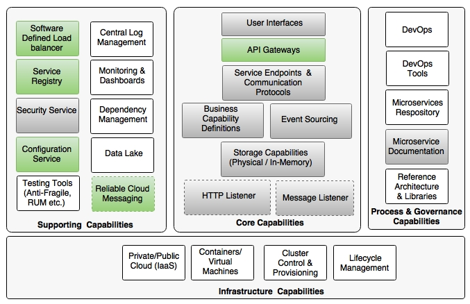

Notes: 

The examples in this session explore the following microservices capabilities from the microservices capability model discussed in session 3, Applying Microservices Concepts:
Software Defined Load Balancer
Service Registry
Configuration Service
Reliable Cloud Messaging
API Gateways


---

## Reviewing BrownField's PSS Implementation


 * Each microservice exposes a set of REST/JSON endpoints for accessing business capabilities

 * Each microservice implements certain business functions using the Spring framework.

 * Each microservice stores its own persistent data using H2, an in-memory database

 * Microservices...

Notes: 

In session 4, Microservices Evolution – A Case Study, we designed and developed a microservice-based PSS system for BrownField Airlines using the Spring framework and Spring Boot. The implementation is satisfactory from the development point of view, and it serves the purpose for low volume transactions. However, this is not good enough for deploying large, enterprise-scale deployments with hundreds or even thousands of microservices.
In session 4, Microservices Evolution – A Case Study, we developed four microservices: Search, Booking, Fares, and Check-in. We also developed a website to test the microservices.
We have accomplished the following items in our microservice implementation so far: (above)


---

## What is Spring Cloud?


 * Implements a set of common patterns

 * Not a cloud solution

Notes: 

The Spring Cloud project is an umbrella project from the Spring team that implements a set of common patterns required by distributed systems, as a set of easy-to-use Java Spring libraries. Despite its name, Spring Cloud by itself is not a cloud solution. Rather, it provides a number of capabilities that are essential when developing applications targeting cloud deployments that adhere to the Twelve-Factor application principles. By using Spring Cloud, developers just need to focus on building business capabilities using Spring Boot, and leverage the distributed, fault-tolerant, and self-healing capabilities available out of the box from Spring Cloud.
The Spring Cloud solutions are agnostic to the deployment environment, and can be developed and deployed in a desktop PC or in an elastic cloud. The cloud-ready solutions that are developed using Spring Cloud are also agnostic and portable across many cloud providers such as Cloud Foundry, AWS, Heroku, and so on. When not...


---

## Setting up the environment for BrownField PSS


Notes: 

Subsequent sections of this session will explore how to scale the microservices developed in the previous session for cloud scale deployments, using some out-of-the-box capabilities provided by the Spring Cloud project. The rest of this session will explore Spring Cloud capabilities such as configuration using the Spring Config server, Ribbon-based service load balancing, service discovery using Eureka, Zuul for API gateway, and finally, Spring Cloud messaging for message-based service interactions. We will demonstrate the capabilities by modifying the BrownField PSS microservices developed in session 4, Microservices Evolution – A Case Study.
In order to prepare the environment for this session...


---

## Spring Cloud Config	


 * From an external JNDI server using JNDI namespace (java:comp/env)

 * Using the Java system properties (System.getProperties()) or using the –D command line option

 * Using the PropertySource configuration:

 * Copy

 * `@PropertySource("file:${CONF_DIR}/application.properties")  `
 * `public class ApplicationConfig {}`

 * Using a command-line parameter pointing a file to an external location:

 * Copy

 *  `java -jar myproject.jar --spring.config.location=`

Notes: 

The Spring Cloud Config server is an externalized configuration server in which applications and services can deposit, access, and manage all runtime configuration properties. The Spring Config server also supports version control of the configuration properties.
In the earlier examples with Spring Boot, all configuration parameters were read from a property file packaged inside the project, either application.properties or application.yaml. This approach is good, since all properties are moved out of code to a property file. Here is the big but... However, when microservices are moved from one environment to another, these properties need to undergo changes, which require an application re-build. This is violation of one of the Twelve-Factor application principles, which advocate one-time build and moving of the binaries across environments.
A better approach is to use the concept of profiles. Profiles, as discussed in session 2, Building Microservices with Spring Boot, is used for partitioning different properties for different environments. The profile-specific configuration will be named application-{profile}.properties. For example, application-development.propertiesrepresents a property file targeted for the development environment.
However, the disadvantage of this approach is that the configurations are statically packaged along with the application. Any changes in the configuration properties require the application to be rebuilt.
There are alternate ways to externalize the configuration properties from the application deployment package. Configurable properties can also be read from an external source in a number of ways: (above)
JNDI operations are expensive, lack flexibility, have difficulties in replication, and are not version controlled. System.properties is not flexible enough for large-scale deployments. The last two options rely on a local or a shared file system mounted on the server.


---

## Spring Cloud Config


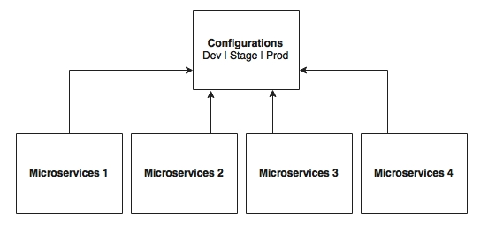

Notes: 


For large scale deployments, a simple yet powerful centralized configuration management solution is required:
As shown in the diagram, all microservices point to a central server to get the required configuration parameters. The microservices then locally cache these parameters to improve performance. The Config server propagates the configuration state changes to all subscribed microservices so that the local cache's state can be updated with the latest changes. The Config server also uses profiles to resolve values specific to an environment.


---

## Spring Cloud Config


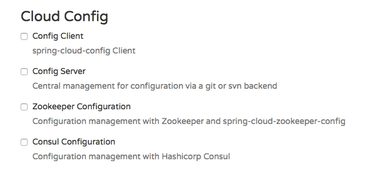

Notes: 

there are multiple options available under the Spring Cloud project for building the configuration server. Config Server, Zookeeper Configuration, and Consul Configuration are available as options. However, this session will only focus on the Spring Config server implementation:

The Spring Config server stores properties in a version-controlled repository such as Git or SVN. The Git repository can be local or remote. A highly available remote Git server is preferred for large scale distributed microservice deployments.


---

## Spring Cloud Config


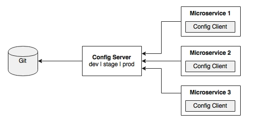

Notes: 

The Spring Cloud Config server architecture is shown in the following diagram:
The Config client embedded in the Spring Boot microservices does a configuration lookup from a central configuration server using a simple declarative mechanism, and stores properties into the Spring environment. The configuration properties can be application-level configurations such as trade limit per day, or infrastructure-related configurations such as server URLs, credentials, and so on.
Unlike Spring Boot, Spring Cloud uses a bootstrap context, which is a parent context of the main application. Bootstrap context is responsible for loading configuration properties from the Config server. The bootstrap context looks for bootstrap.yaml or bootstrap.properties for loading initial configuration properties. To make this work in a Spring Boot application, rename the application.* file to bootstrap.*.


---

## Setting Up the Config Server	


 * Lab 11 - https://jmp.sh/4LfCxpD

Notes: 


---

## Understanding the Config Server URL


 * In the previous section, we used http://localhost:8888/application/default/master to explore the properties. 

 * How do we interpret this URL?

Notes: 

The first element in the URL is the application name. In the given example, the application name should be application. The application name is a logical name given to the application, using the spring.application.name property in bootstrap.properties of the Spring Boot application. Each application must have a unique name. The Config server will use the name to resolve and pick up appropriate properties from the Config server repository. The application name is also sometimes referred to as service ID. If there is an application with the name myapp, then there should be a myapp.properties in the configuration repository to store all the properties related to that application.
The second part of the URL represents the profile. There can be more than one profile configured within the repository for an application. The profiles can be used in various scenarios. The two common scenarios are segregating different environments such as Dev, Test, Stage, Prod, and the like, or segregating server configurations such as Primary, Secondary, and so on. The first one represents different environments of an application, whereas the second one represents different servers where an application is deployed.


---

## Understanding the Config Server URL


 * application-development.propertiesapplication-production.properties

 * These are accessible using the following URLs respectively:

 * http://localhost:8888/application/development

 * http://localhost:8888/application/production

 * In the preceding example, all the following three URLs point to the same configuration:

 * http://localhost:8888/application/default

 * http://localhost:8888/application/master

 * http://localhost:8888/application/default/master

Notes: 

The profile names are logical names that will be used for matching the file name in the repository. The default profile is named default. To configure properties for different environments, we have to configure different files as given in the following example. In this example, the first file is for the development environment whereas the second is for the production environment:
The last part of the URL is the label, and is named master by default. The label is an optional Git label that can be used, if required.
In short, the URL is based on the following pattern: http://localhost:8888/{name}/{profile}/{label}.
The configuration can also be accessed by ignoring the profile. There is an option to have different Git repositories for different profiles. This makes sense for production systems, since the access to different repositories could be different.


---

## Accessing the Config Server from Clients


 * Lab 12 - 

Notes: 

In the previous section, a Config server is set up and accessed using a web browser. In this section, the Search microservice will be modified to use the Config server. The Search microservice will act as a Config client.


---

## Handling configuration changes


 * Lab 13 - 

Notes: 


---

## Spring Cloud Bus for propagating configuration changes	


 * Spring Cloud Bus for propagating configuration changes	

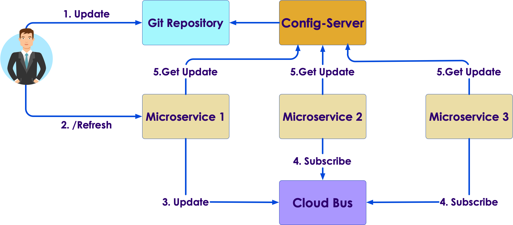

Notes: 

With the preceding approach, configuration parameters can be changed without restarting the microservices. This is good when there are only one or two instances of the services running. What happens if there are many instances? For example, if there are five instances, then we have to hit /refresh against each service instance. This is definitely a cumbersome activity:
The Spring Cloud Bus provides a mechanism to refresh configurations across multiple instances without knowing how many instances there are, or their locations. This is particularly handy when there are many service instances of a microservice running or when there are many microservices of different types running. This is done by connecting all service instances through a single message broker. Each instance subscribes for change events, and refreshes its local configuration when required. This refresh is triggered by making a call to any one instance by hitting the /bus/refresh endpoint, which then propagates the changes through the cloud bus and the common message broker.


---

## Spring Cloud Bus for propagating configuration changes	


 * Lab 14 - 

Notes: 


---

## Setting Up High Availability for the Config server


 * The following diagram shows a high availability architecture for the Config server:

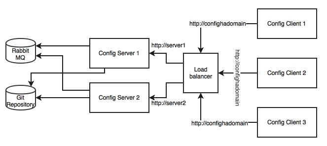

Notes: 

The previous sections explored how to setup the Config server, allowing real-time refresh of configuration properties. However, the Config server is a single point of failure in this architecture.
There are three single points of failure in the default architecture that was established in the previous section. One of them is the availability of the Config server itself, the second one is the Git repository, and the third one is the RabbitMQ server.
The Config server requires high availability, since the services won't be able to bootstrap if the Config server is not available. Hence, redundant Config servers are required for high availability. However, the applications can continue to run if the Config server is unavailable after the services are bootstrapped. In this case, services will run with the last known configuration state. Hence, the Config server availability is not at the same critical level as the microservices availability.


---

## Setting Up the High Availability for the Config Server


 * In order to make the Config server highly available, we need multiple instances of the Config servers. 

 * Since the Config server is a stateless HTTP service, multiple instances of configuration servers can be run in parallel. 

 * Based on the load on the configuration server, a number of instances have to be adjusted. 

Notes: 

The bootstrap.properties file is not capable of handling more than one server address. Hence, multiple configuration servers should be configured to run behind a load balancer or behind a local DNS with failover and fallback capabilities. The load balancer or DNS server URL will be configured in the microservices' bootstrap.properties file. This is with the assumption that the DNS or the load balancer is highly available and capable of handling failovers.
In a production scenario, it is not recommended to use a local file-based Git repository. The configuration server should be typically backed with a highly available Git service. This is possible by either using an external highly available Git service or a highly available internal Git service. SVN can also be considered.
Having said that, an already bootstrapped Config server is always capable of working with a local copy of the configuration. Hence, we need a highly available Git only when the Config server needs to be scaled. Therefore, this too is not as critical as the microservices availability or the Config server availability.
RabbitMQ also has to be configured for high availability. The high availability for RabbitMQ is needed only to push configuration changes dynamically to all instances. Since this is more of an offline controlled activity, it does not really require the same high availability as required by the components.
RabbitMQ high availability can be achieved by either using a cloud service or a locally configured highly available RabbitMQ service.


---

## Monitoring the Config Server Health


 * The health of the server can be monitored using the following actuator URL: http://localhost:8888/health.

Notes: 

The Config server is nothing but a Spring Boot application, and is, by default, configured with an actuator. Hence, all actuator endpoints are applicable for the Config server. 


---

## Config Server for configuration files


 * The name, profile, and label have the same meanings as explained earlier. The path indicates the file name such as logback.xml.

 * This is achievable by using the URL format as follows: /{name}/{profile}/{label}/{path}.

Notes: 

We may run into scenarios where we need a complete configuration file such as logback.xml to be externalized. The Config server provides a mechanism to configure and store such files. This is achievable by using the URL format as follows: /{name}/{profile}/{label}/{path}.


---

## Completing Changes to use the Config Server


 * Java code:

```java

private static final String FareURL = "/fares";

@Value("${fares-service.url}")
private String fareServiceUrl;

Fare = restTemplate.getForObject(fareServiceUrl+FareURL +
       "/get?flightNumber="+record.getFlightNumber() +
       "&flightDate="+record.getFlightDate(),Fare.class);

```

 * As shown in the preceding code snippet, the Fare service URL is fetched through a new property: fares-service.url.

 * We are not externalizing the queue names used in the Search, Booking, and Check-in services at the moment. Later in this session, these will be changed to use Spring Cloud Streams.

Notes: 

The Fare service URL in the booking component will also be externalized:
In order to build this capability to complete BrownField Airline's PSS, we have to make use of the configuration server for all services. All microservices in the examples given in session5.* need to make similar changes to look to the Config server for getting the configuration parameters.
The above are a few key change considerations:


---

## Feign as a declarative REST client


 * In the Booking microservice, there is a synchronous call to Fare. 

 * RestTemplate is used for making the synchronous call. 

 * When using RestTemplate, the URL parameter is constructed programmatically, and data is sent across to the other service. 

 * In more complex scenarios, we will have to get to the details of the HTTP APIs provided by RestTemplate or even to APIs at a much lower level.

Notes: 

Feign is a Spring Cloud Netflix library for providing a higher level of abstraction over REST-based service calls. Spring Cloud Feign works on a declarative principle. When using Feign, we write declarative REST service interfaces at the client, and use those interfaces to program the client. The developer need not worry about the implementation of this interface. This will be dynamically provisioned by Spring at runtime. With this declarative approach, developers need not get into the details of the HTTP level APIs provided by RestTemplate.


---

## Feign as a declarative REST client


 * `Fare fare = restTemplate.getForObject(FareURL +"/get?flightNumber="+record.getFlightNumber()+"&flightDate="+record.getFlightDate(),Fare.class);`

 * pom.xmL:

```xml

<dependency>
  <groupId>org.springframework.cloud</groupId>
  <artifactId>spring-cloud-starter-feign</artifactId>
</dependency>
```

Notes: 

The above code snippet is the existing code in the Booking microservice for calling the Fare service:
In order to use Feign, first we need to change the pom.xml file to include the Feign dependency as follows:


---

## Feign as a declarative REST client


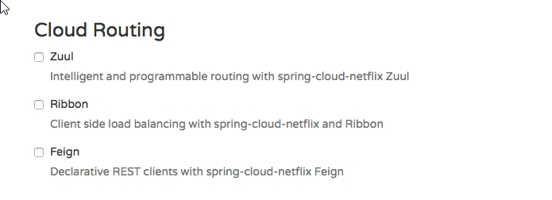

Notes: 

For a new Spring Starter project, Feign can be selected from the starter library selection screen, or from http://start.spring.io/. This is available under Cloud Routing as shown in the following screenshot:


---

## Feign as a declarative REST client

 * Java code:

```java
@FeignClient(name="fares-proxy", url="localhost:8080/fares")
public interface FareServiceProxy {
  @RequestMapping(value = "/get", method=RequestMethod.GET)
  Fare getFare(@RequestParam(value="flightNumber") String flightNumber, 
               @RequestParam(value="flightDate") String flightDate);
}
```


Notes: 

The next step is to create a new FareServiceProxy interface. This will act as a proxy interface of the actual Fare service:
The FareServiceProxy interface has a @FeignClient annotation. This annotation tells Spring to create a REST client based on the interface provided. The value could be a service ID or a logical name. The url indicates the actual URL where the target service is running. Either name or value is mandatory. In this case, since we have url, the name attribute is irrelevant.
Use this service proxy to call the Fare service. In the Booking microservice, we have to tell Spring that Feign clients exist in the Spring Boot application, which are to be scanned and discovered. This will be done by adding @EnableFeignClients at the class level of BookingComponent. Optionally, we can also give the package names to scan.


---

## Feign as a declarative REST client


 * `Fare = fareServiceProxy.getFare(record.getFlightNumber(), record.getFlightDate());`

Notes: 

Change BookingComponent, and make changes to the calling part. This is as simple as calling another Java interface:
Rerun the Booking microservice to see the effect.
The URL of the Fare service in the FareServiceProxy interface is hardcoded: url="localhost:8080/fares".
For the time being, we will keep it like this, but we are going to change this later in this session.


---

## Ribbon for Load Balancing


 * In the previous setup, we were always running with a single instance of the microservice. 

 * The URL is hardcoded both in client as well as in the service-to-service calls.

Notes: 

In the real world, this is not a recommended approach, since there could be more than one service instance. If there are multiple instances, then ideally, we should use a load balancer or a local DNS server to abstract the actual instance locations, and configure an alias name or the load balancer address in the clients. The load balancer then receives the alias name, and resolves it with one of the available instances. With this approach, we can configure as many instances behind a load balancer. It also helps us to handle server failures transparent to the client.
This is achievable with Spring Cloud Netflix Ribbon. Ribbon is a client-side load balancer which can do round-robin load balancing across a set of servers. There could be other load balancing algorithms possible with the Ribbon library...


---

## Eureka for registration and discovery


 * If there is a large number of microservices, and if we want to optimize infrastructure utilization, we will have to dynamically change the number of service instances and the associated servers. It is not easy to predict and preconfigure the server URLs in a configuration file.

 * When targeting cloud deployments for highly scalable microservices, static registration and discovery is not a good solution considering the elastic nature of the cloud environment.

 * In the cloud deployment scenarios, IP addresses are not predictable, and will be difficult to statically configure in a file. We will have to update the configuration file every time there is a change in address.

Notes: 

So far, we have achieved externalizing configuration parameters as well as load balancing across many service instances.
Ribbon-based load balancing is sufficient for most of the microservices requirements. However, this approach falls short in a couple of scenarios:
The Ribbon approach partially addresses this issue. With Ribbon, we can dynamically change the service instances, but whenever we add new service instances or shut down instances, we will have to manually update the Config server. Though the configuration changes will be automatically propagated to all required instances, the manual configuration changes will not work with large scale deployments. When managing large deployments, automation, wherever possible, is paramount.
To fix this gap, the microservices should self-manage their life cycle by dynamically registering service availability, and provision automated discovery for consumers.


---

## Understanding dynamic service registration and discovery


 * Dynamic registration is primarily from the service provider's point of view. 

 * With dynamic registration, when a new service is started, it automatically enlists its availability in a central service registry. 

 * Similarly, when a service goes out of service, it is automatically delisted from the service registry. 

 * The registry always keeps up-to-date information of the services available, as well as their metadata.

Notes: 

Dynamic discovery is applicable from the service consumer's point of view. Dynamic discovery is where clients look for the service registry to get the current state of the services topology, and then invoke the services accordingly. In this approach, instead of statically configuring the service URLs, the URLs are picked up from the service registry.
The clients may keep a local cache of the registry data for faster access. Some registry implementations allow clients to keep a watch on the items they are interested in. In this approach, the state changes in the registry server will be propagated to the interested parties to avoid using stale data.


---

## Understanding dynamic service and registration and discovery


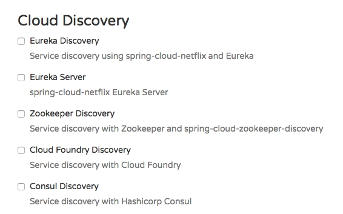

Notes: 

There are a number of options available for dynamic service registration and discovery. Netflix Eureka, ZooKeeper, and Consul are available as part of Spring Cloud, as shown in the http://start.spring.io/ screenshot given next. Etcd is another service registry available outside of Spring Cloud to achieve dynamic service registration and discovery. In this session, we will focus on the Eureka implementation:


---

## Understanding Eureka


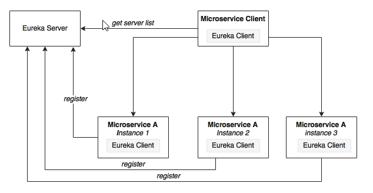

Notes: 

Spring Cloud Eureka also comes from Netflix OSS. The Spring Cloud project provides a Spring-friendly declarative approach for integrating Eureka with Spring-based applications. Eureka is primarily used for self-registration, dynamic discovery, and load balancing. Eureka uses Ribbon for load balancing internally:
As shown in the preceding diagram, Eureka consists of a server component and a client-side component. The server component is the registry in which all microservices register their availability. The registration typically includes service identity and its URLs. The microservices use the Eureka client for registering their availability. The consuming components will also use the Eureka client for discovering the service instances.
When a microservice is bootstrapped, it reaches out to the Eureka server, and advertises its existence with the binding information. Once registered, the service endpoint sends ping requests to the registry every 30 seconds to renew its lease. If a service endpoint cannot renew its lease in a few attempts, that service endpoint will be taken out of the service registry. The registry information will be replicated to all Eureka clients so that the clients have to go to the remote Eureka server for each and every request. Eureka clients fetch the registry information from the server, and cache it locally. After that, the clients use that information to find other services. This information is updated periodically (every 30 seconds) by getting the delta updates between the last fetch cycle and the current one.
When a client wants to contact a microservice endpoint, the Eureka client provides a list of currently available services based on the requested service ID. The Eureka server is zone aware. Zone information can also be supplied when registering a service. When a client requests for a services instance, the Eureka service tries to find the service running in the same zone. The Ribbon client then load balances across these available service instances supplied by the Eureka client. The communication between the Eureka client and the server is done using REST and JSON.


---

## High availability for Eureka


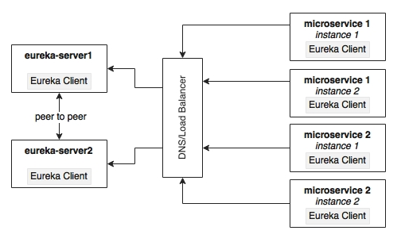

Notes: 

In the previous example, there was only one Eureka server in standalone mode. This is not good enough for a real production system.
The Eureka client connects to the server, fetches registry information, and stores it locally in a cache. The client always works with this local cache. The Eureka client checks the server periodically for any state changes. In the case of a state change, it downloads the changes from the server, and updates the cache. If the Eureka server is not reachable, then the Eureka clients can still work with the last-known state of the servers based on the data available in the client cache. However, this could lead to stale state issues quickly.
This section will explore the high availability for the Eureka server. The high availability architecture is shown in the following diagram:
The Eureka server is built with a peer-to-peer data synchronization mechanism. The runtime state information is not stored in a database, but managed using an in-memory cache. The high availability implementation favors availability and partition tolerance in the CAP theorem, leaving out consistency. Since the Eureka server instances are synchronized with each other using an asynchronous mechanism, the states may not always match between server instances. The peer-to-peer synchronization is done by pointing serviceUrls to each other. If there is more than one Eureka server, each one has to be connected to at least one of the peer servers. Since the state is replicated across all peers, Eureka clients can connect to any one of the available Eureka servers.
The best way to achieve high availability for Eureka is to cluster multiple Eureka servers, and run them behind a load balancer or a local DNS. The clients always connect to the server using the DNS/load balancer. At runtime, the load balancer takes care of selecting the appropriate servers. This load balancer address will be provided to the Eureka clients.


---

## High availability for Eureka


 *  **eureka-server1.properties** eureka.client.serviceUrl.defaultZone:http://localhost:8762/eureka/eureka.client.registerWithEureka:falseeureka.client.fetchRegistry:false **eureka-server2.properties** eureka.client.serviceUrl.defaultZone:http://localhost:8761/eureka/eureka.client.registerWithEureka:falseeureka.client.fetchRegistry:false

Notes: 

This section will showcase how to run two Eureka servers in a cluster for high availability. For this, define two property files: eureka-server1 and eureka-server2. These are peer servers; if one fails, the other one will take over. Each of these servers will also act as a client for the other so that they can sync their states. Two property files are defined in the following snippet. Upload and commit these properties to the Git repository.
The client URLs point to each other, forming a peer network as shown in the following configuration:


---

## High availability for Eureka


 * spring.application.name=eurekaspring.cloud.config.uri=http://localhost:8888

 *  **java -jar –Dserver.port=8761 -Dspring.profiles.active=server1 demo-0.0.1-SNAPSHOT.jar**  **java -jar –Dserver.port=8762 -Dspring.profiles.active=server2 demo-0.0.1-SNAPSHOT.jar** 

Notes: 

Update the bootstrap.properties file of Eureka, and change the application name to eureka. Since we are using two profiles, based on the active profile supplied at startup, the Config server will look for either eureka-server1 or eureka-server2:

Start two instances of the Eureka servers, server1 on 8761 and server2 on 8762:
All our services still point to the first server, server1. Open both the browser windows: http://localhost:8761 and http://localhost:8762.
Start all microservices. The one which opened 8761 will immediately reflect the changes, whereas the other one will take 30 seconds for reflecting the states. Since both the servers are in a cluster, the state is synchronized between these two servers. If we keep these servers behind a load balancer/DNS, then the client will always connect to one of the available servers.
After completing this exercise, switch back to the standalone mode for the remaining exercises.


---

## Setting up the Eureka server


 * Lab 15 - 

Notes: 


---

## Zuul Proxy as the API Gateway


 * Only a selected set of microservices are required by the clients.

 * If there are client-specific policies to be applied, it is easy to apply them in a single place rather than in multiple places. An example of such a scenario is the cross-origin access policy.

 * It is hard to implement client-specific transformations at the service endpoint.

 * If there is data aggregation required, especially to avoid multiple client calls in a bandwidth-restricted environment, then a gateway is required in the middle.

Notes: 

In most microservice implementations, internal microservice endpoints are not exposed outside. They are kept as private services. A set of public services will be exposed to the clients using an API gateway. There are many reasons to do this:


---

## Zuul proxy as the API Gateway


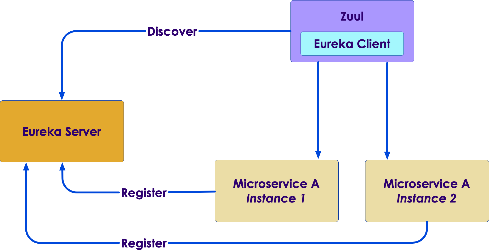

Notes: 

Zuul is a simple gateway service or edge service that suits these situations well. Zuul also comes from the Netflix family of microservice products. Unlike many enterprise API gateway products, Zuul provides complete control for the developers to configure or program based on specific requirements:
The Zuul proxy internally uses the Eureka server for service discovery, and Ribbon for load balancing between service instances.
The Zuul proxy is also capable of routing, monitoring, managing resiliency, security, and so on. In simple terms, we can consider Zuul a reverse proxy service. With Zuul, we can even change the behaviors of the underlying services by overriding them at the API layer.


---

## Zuul 


 * Enforcing authentication and other security policies at the gateway instead of doing that on every microservice endpoint. 

 * Business insights and monitoring can be implemented at the gateway level. Collect real-time statistical data, and push it to an external system for analysis. 

 * API gateways are useful in scenarios where dynamic routing is required based on fine-grained controls. 

 * Handling the load shredding and throttling requirements is another scenario where API gateways are useful. 

 * The Zuul gateway is useful for fine-grained load balancing scenarios. 

 * The Zuul gateway is also useful in scenarios where data aggregation requirements are in place. 

Notes: 

The gateway can handle security policies, token handling, and so on before passing the request to the relevant services behind. 
It can also do basic rejections based on some business policies such as blocking requests coming from certain black-listed users.
This will be handy as we can do this at one place rather than applying it across many microservices.
For example, send requests to different service instances based on business specific values such as "origin country". Another example is all requests coming from a region to be sent to one group of service instances. Yet another example is all requests requesting for a particular product have to be routed to a group of service instances.
This is when we have to control load based on set thresholds such as number of requests in a day. 
For example, control requests coming from a low-value third party online channel.
The Zuul, Eureka client, and Ribbon together provide fine-grained controls over the load balancing requirements.
 Since the Zuul implementation is nothing but another Spring Boot application, the developer has full control over the load balancing.
If the consumer wants higher level coarse-grained services, then the gateway can internally aggregate data by calling more than one service on behalf of the client. 
This is particularly applicable when the clients are working in low bandwidth environments.


---

## Zuul


 * Java code:

```java
public class CustomZuulFilter extends ZuulFilter{
   public Object run(){}
   public boolean shouldFilter(){}
   public int filterOrder(){}
   public String filterType(){}
}

@Beanpublic CustomZuulFilter customFilter() {    return new CustomZuulFilter();}
```

Notes: 

Zuul also provides a number of filters. These filters are classified as pre filters, routing filters, post filters, and error filters. As the names indicate, these are applied at different stages of the life cycle of a service call. Zuul also provides an option for developers to write custom filters. In order to write a custom filter, extend from the abstract ZuulFilter, and implement the following methods:
Once a custom filter is implemented, add that class to the main context. In our example case, add this to the SearchApiGateway class as follows:


---

## Zuul


 * Java code:

```java
@RestController 
class SearchAPIGatewayController {  
  @RequestMapping("/")
  String greet(HttpServletRequest req){
    return "<H1>Search Gateway Powered By Zuul</H1>";  
  }
}

Notes: 

As mentioned earlier, the Zuul proxy is a Spring Boot service. We can customize the gateway programmatically in the way we want. As shown in the following code, we can add custom endpoints to the gateway, which, in turn, can call the backend services:
In the preceding case, it just adds a new endpoint, and returns a value from the gateway. We can further use @Loadbalanced RestTemplate to call a backend service. Since we have full control, we can do transformations, data aggregation, and so on. We can also use the Eureka APIs to get the server list, and implement completely independent load-balancing or traffic-shaping mechanisms instead of the out-of-the-box load balancing features provided by Ribbon.


---

## High Availability of Zuul


 * When a client-side JavaScript MVC such as AngularJS accesses Zuul services from a remote browser.

 * Another microservice or non-microservice accesses services via Zuul

Notes: 

Zuul is just a stateless service with an HTTP endpoint, hence, we can have as many Zuul instances as we need. There is no affinity or stickiness required. However, the availability of Zuul is extremely critical as all traffic from the consumer to the provider flows through the Zuul proxy. However, the elastic scaling requirements are not as critical as the backend microservices where all the heavy lifting happens.
The high availability architecture of Zuul is determined by the scenario in which we are using Zuul. The typical usage scenarios are:
In some cases, the client may not have the capabilities to use the Eureka client libraries, for example, a legacy application written on PL/SQL. In some cases, organization policies do not allow Internet clients to handle client-side load balancing. In the case of browser-based clients, there are third-party Eureka JavaScript libraries available.
It all boils down to whether the client is using Eureka client libraries or not. Based on this, there are two ways we can set up Zuul for high availability.


---

## High availability of Zuul when the client is also a Eureka client


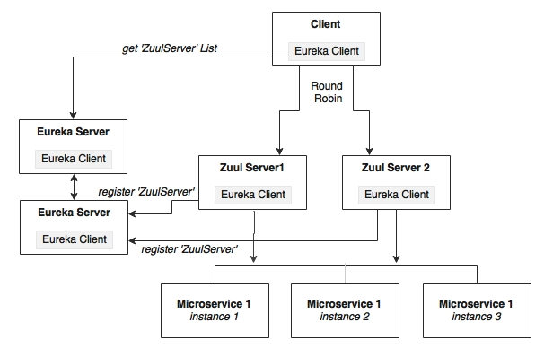

Notes: 

In this case, since the client is also another Eureka client, Zuul can be configured just like other microservices. Zuul registers itself to Eureka with a service ID. The clients then use Eureka and the service ID to resolve Zuul instances:

As shown in the preceding diagram, Zuul services register themselves with Eureka with a service ID, search-apigateway in our case. The Eureka client asks for the server list with the ID search-apigateway. The Eureka server returns the list of servers based on the current Zuul topology. The Eureka client, based on this list picks up one of the servers, and initiates the call.


---

## High Availability of Zuul when the client is also a Eureka client


 * `Flight[] flights = searchClient.postForObject("http://search-apigateway/api/search/get", searchQuery, Flight[].class);`

Notes: 

As we saw earlier, the client uses the service ID to resolve the Zuul instance. In the following case, search-apigateway is the Zuul instance ID registered with Eureka:


---

## High availability when the client is not a Eureka client


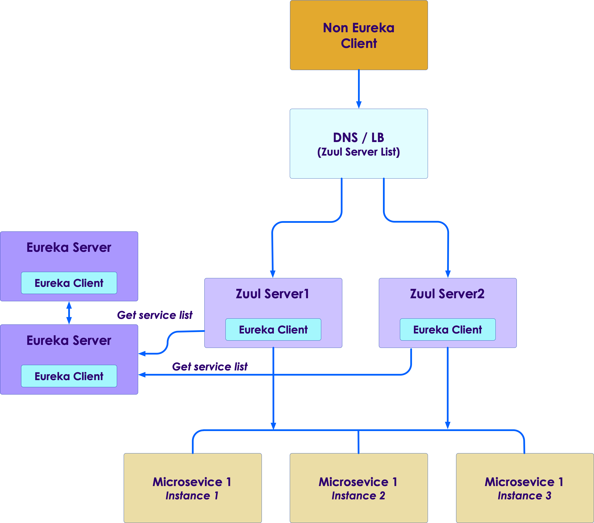

Notes: 

In this case, the client is not capable of handling load balancing by using the Eureka server. As shown in the following diagram, the client sends the request to a load balancer, which in turn identifies the right Zuul service instance. The Zuul instance, in this case, will be running behind a load balancer such as HAProxy or a hardware load balancer like NetScaler:
The microservices will still be load balanced by Zuul using the Eureka server.


---

## Setting up Zuul


 * Lab 16 - 

Notes: 

Unlike the Eureka server and the Config server, in typical deployments, Zuul is specific to a microservice. However, there are deployments in which one API gateway covers many microservices. 


---

## Completing Zuul for all other services


 * Lab 17 - 

 * In the end, we will have the following API gateway projects:

 * `session5.fares-apigateway`

 * `session5.search-apigateway`

 * `session5.checkin-apigateway`

 * `session5.book-apigateway`

Notes: 


---

## Streams for reactive microservices


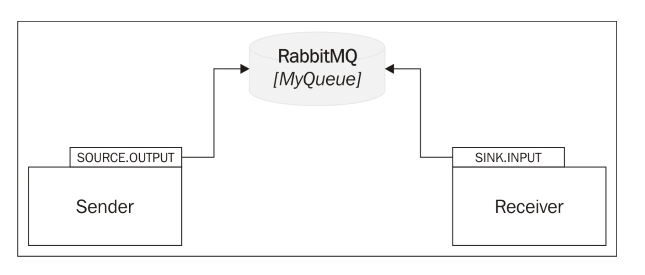

Notes: 

Spring Cloud Stream provides an abstraction over the messaging infrastructure. The underlying messaging implementation can be RabbitMQ, Redis, or Kafka. Spring Cloud Stream provides a declarative approach for sending and receiving messages:

As shown in the preceding diagram, Cloud Stream works on the concept of a source and a sink. The source represents the sender perspective of the messaging, and sink represents the receiver perspective of the messaging.
In the example shown in the diagram, the sender defines a logical queue called Source.OUTPUT to which the sender sends messages. The receiver defines a logical queue called Sink.INPUT from which the receiver retrieves messages. The physical binding of OUTPUT to INPUT is managed through the configuration. In this case, both link to the same physical queue—MyQueue on RabbitMQ. So, while at one end, Source.OUTPUT points to MyQueue, on the other end, Sink.INPUT points to the same MyQueue.
Spring Cloud offers the flexibility to use multiple messaging providers in one application such as connecting an input stream from Kafka to a Redis output stream, without managing the complexities. Spring Cloud Stream is the basis for message-based integration. The Cloud Stream Modules subproject is another Spring Cloud library that provides many endpoint implementations.


---

## Streams for reactive microservices


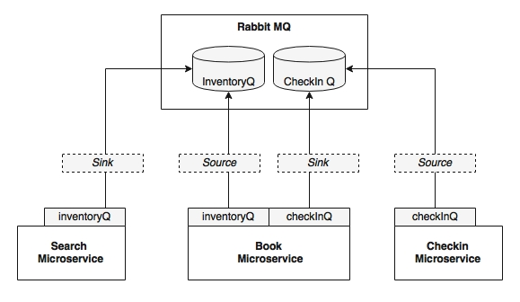

Notes: 

As the next step, rebuild the inter-microservice messaging communication with the Cloud Streams. As shown in the next diagram, we will define a SearchSink connected to InventoryQ under the Search microservice. Booking will define a BookingSource for sending inventory change messages connected to InventoryQ. Similarly, Check-in defines a CheckinSource for sending the check-in messages. Booking defines a sink, BookingSink, for receiving messages, both bound to the CheckinQ queue on the RabbitMQ:


---

## Streams for Reactive Microservices


 * Lab 18 - 

Notes: 


---

## Summarizing the Brownfield PSS Architect


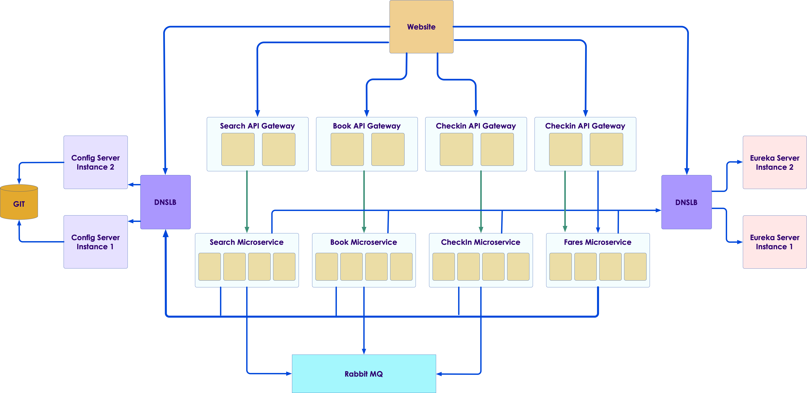

Notes: 

The following diagram shows the overall architecture that we have created with the Config server, Eureka, Feign, Zuul, and Cloud Streams. The architecture also includes the high availability of all components. In this case, we assume that the client uses the Eureka client libraries:


---

## 


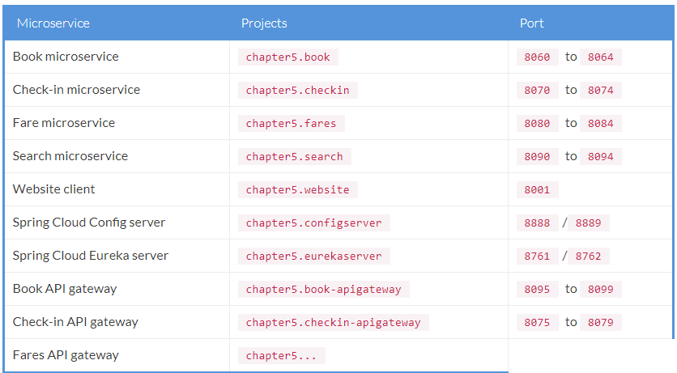

Notes: 

The summary of the projects and the port they are listening on is given in the following table:


---

## Summarizing the BrownField PSS Architecture


 * Lab 19 - 

Notes: 


---

## Summary


 * How to scale a Twelve-Factor Spring Boot microservice using the Spring Cloud project. 

 * Applied to the BrownField Airline's PSS microservice that we developed in the previous session.

Notes: 

We then explored the Spring Config server for externalizing the microservices' configuration, and the way to deploy the Config server for high availability. We also discussed the declarative service calls using Feign, examined the use of Ribbon and Eureka for load balancing, dynamic service registration, and discovery. Implementation of an API gateway was examined by implementing Zuul. Finally, we concluded with a reactive style integration of microservices using Spring Cloud Stream.
BrownField Airline's PSS microservices are now deployable on the Internet scale. Other Spring Cloud components such as Hyterix, Sleuth, and so on will be covered in session 7, Logging and Monitoring Microservices. The next session will demonstrate autoscaling features, extending the BrownField PSS implementation.


---

## 6 - Autoscaling Microservices


 * The basic concept of autoscaling and different approaches for autoscaling

 * The importance and capabilities of a life cycle manager in the context of microservices

 * Examining the custom life cycle manager to achieve autoscaling

 * Programmatically collecting statistics from the Spring Boot actuator and using it to control and shape incoming traffic

Notes: 

Spring Cloud provides the support essential for the deployment of microservices at scale. In order to get the full power of a cloud-like environment, the microservices instances should also be capable of scaling out and shrinking automatically based on traffic patterns.
This session will detail out how to make microservices elastically grow and shrink by effectively using the actuator data collected from Spring Boot microservices to control the deployment topology by implementing a simple life cycle manager.
By the end of this session, you will learn about the following topics:


---

## Reviewing the microservice capability model


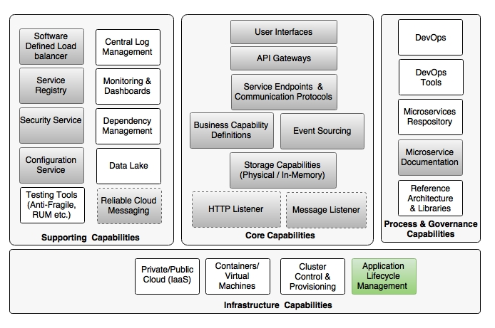

Notes: 

This session will cover the Application Lifecycle Management capability in the microservices capability model discussed in session 3, Applying Microservices Concepts, highlighted in the following diagram:
We will see a basic version of the life cycle manager in this session, which will be enhanced in later sessions.


---

## Scaling microservices with Spring Cloud


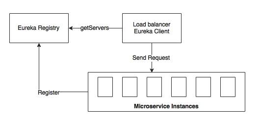

Notes: 

In session 5, Scaling Microservices with Spring Cloud, you learned how to scale Spring Boot microservices using Spring Cloud components. The two key concepts of Spring Cloud that we implemented are self-registration and self-discovery. These two capabilities enable automated microservices deployments. With self-registration, microservices can automatically advertise the service availability by registering service metadata to a central service registry as soon as the instances are ready to accept traffic. Once the microservices are registered, consumers can consume the newly registered services from the very next moment by discovering service instances using the registry service. Registry is at the heart of this automation.
This is quite different from the traditional clustering approach employed by the traditional JEE application servers. In the case of JEE application servers, the server instances' IP addresses are more or less statically configured in a load balancer. Therefore, the cluster approach is not the best solution for automatic scaling in Internet-scale deployments. Also, clusters impose other challenges, such as they have to have exactly the same version of binaries on all cluster nodes. It is also possible that the failure of one cluster node can poison other nodes due to the tight dependency between nodes.
The registry approach decouples the service instances. It also eliminates the need to manually maintain service addresses in the load balancer or configure virtual IPs:


---

## Scaling microservices with Spring Cloud


 *  **Eureka**  is the central registry component for microservice registration and discovery. 

 * The  **Eureka**  client, together with the  **Ribbon**  client, provide client-side dynamic load balancing. 

 * The third component is the  **microservices**  instances developed using Spring Boot with the actuator endpoints enabled.

Notes: 

As shown in the diagram, there are three key components in our automated microservices deployment topology:
REST APIs are used by both consumers as well as providers to access the registry. The registry also holds the service metadata such as the service identity, host, port, health status, and so on.
Consumers use the Eureka client to look up the Eureka server to identify the available instances of a target service. The Ribbon client uses this server list to load-balance between the available microservice instances. In a similar way, if the service instance goes out of service, these instances will be taken out of the Eureka registry. The load balancer automatically reacts to these dynamic topology changes.
However, there is one gap in this approach. When there is need for an additional microservice instance, a manual task is required to kick off a new instance. In an ideal scenario, the starting and stopping of microservice instances also require automation.
For example, when there is a requirement to add another Search microservice instance to handle the increase in traffic volumes or a load burst scenario, the administrator has to manually bring up a new instance. Also, when the Search instance is idle for some time, it needs to be manually taken out of service to have optimal infrastructure usage. This is especially relevant when services run on a pay-as-per-usage cloud environment.


---

## Understanding the concept of autoscaling


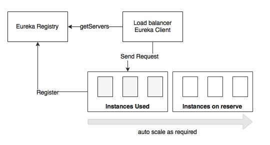

Notes: 

Autoscaling is an approach to automatically scaling out instances based on the resource usage to meet the SLAs by replicating the services to be scaled.
The system automatically detects an increase in traffic, spins up additional instances, and makes them available for traffic handling. Similarly, when the traffic volumes go down, the system automatically detects and reduces the number of instances by taking active instances back from the service:
As shown in the preceding diagram, autoscaling is done, generally, using a set of reserve machines.
As many of the cloud subscriptions are based on a pay-as-you-go model, this is an essential capability when targeting cloud deployments. This approach is often called elasticity. It is also called dynamic resource provisioning and deprovisioning. Autoscaling is an effective approach specifically for microservices with varying traffic patterns. For example, an Accounting service would have high traffic during month ends and year ends. There is no point in permanently provisioning instances to handle these seasonal loads.
In the autoscaling approach, there is often a resource pool with a number of spare instances. Based on the demand, instances will be moved from the resource pool to the active state to meet the surplus demand. These instances are not pretagged for any particular microservices or prepackaged with any of the microservice binaries. In advanced deployments, the Spring Boot binaries are downloaded on demand from an artifact repository such as Nexus or Artifactory.


---

## The benefits of autoscaling


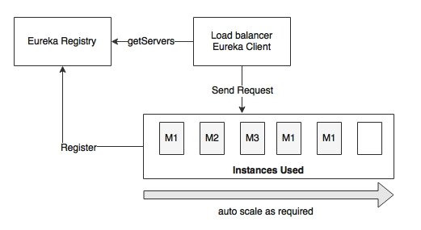

Notes: 

There are many benefits in implementing the autoscaling mechanism. In traditional deployments, administrators reserve a set of servers against each application. With autoscaling, this preallocation is no longer required. This prefixed server allocation may result in underutilized servers. In this case, idle servers cannot be utilized even when neighboring services struggle for additional resources.
With hundreds of microservice instances, preallocating a fixed number of servers to each of the microservices is not cost effective. A better approach is to reserve a number of server instances for a group of microservices without preallocating or tagging them against a microservice. Instead, based on the demand, a group of services can share a set of available resources. By doing so, microservices can be dynamically moved across the available server instances by optimally using the resources:
As shown in the preceding diagram, there are three instances of the M1 microservice, one instance of M2, and one instance of M3 up and running. There is another server kept unallocated. Based on the demand, the unallocated server can be used for any of the microservices: M1, M2, or M3. If M1 has more service requests, then the unallocated instance will be used for M1. When the service usage goes down, the server instance will be freed up and moved back to the pool. Later, if the M2 demand increases, the same server instance can be activated using M2.


---

## Key benefits of autoscaling


 *  **It has high availability and is fault tolerant** : 

 *  **It increases scalability** : 

 *  **It has optimal usage and is cost saving** :

 *  **It gives priority to certain services or group of services** : 

Notes: 

As there are multiple service instances, even if one fails, another instance can take over and continue serving clients. This failover will be transparent to the consumers. If no other instance of this service is available, the autoscaling service will recognize this situation and bring up another server with the service instance. As the whole process of bringing up or bringing down instances is automatic, the overall availability of the services will be higher than the systems implemented without autoscaling. The systems without autoscaling require manual intervention to add or remove service instances, which will be hard to manage in large deployments.  For example, assume that two of instances of the Booking service are running. If there is an increase in the traffic flow, in a normal scenario, the existing instance might become overloaded. In most of the scenarios, the entire set of services will be jammed, resulting in service unavailability. In the case of autoscaling, a new Booking service instance can be brought up quickly. This will balance the load and ensure service availability.
One of the key benefits of autoscaling is horizontal scalability. Autoscaling allows us to selectively scale up or scale down services automatically based on traffic patterns.
 In a pay-as-you-go subscription model, billing is based on actual resource utilization. With the autoscaling approach, instances will be started and shut down based on the demand. Hence, resources are optimally utilized, thereby saving cost.
With autoscaling, it is possible to give priority to certain critical transactions over low-value transactions. This will be done by removing an instance from a low-value service and reallocating it to a high-value service. This will also eliminate situations where a low-priority transaction heavily utilizes resources when high-value transactions are cramped up for resources.


---

## The benefits of autoscaling


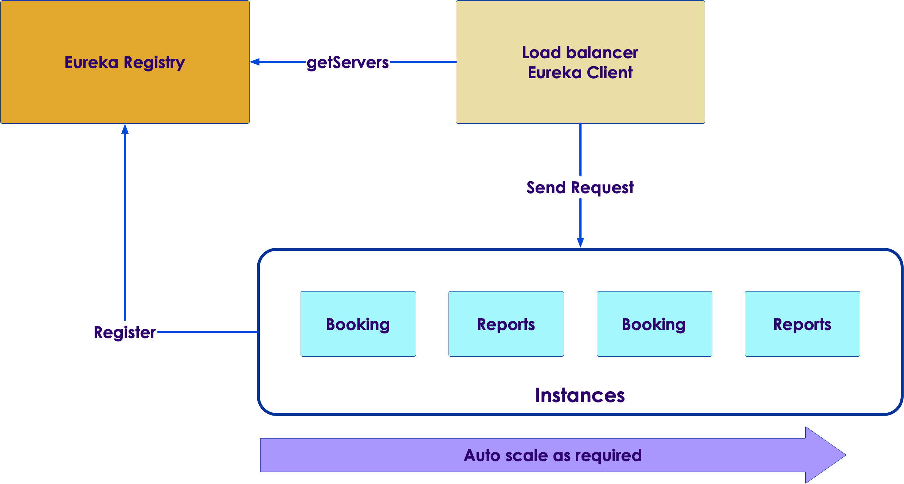

Notes: 

For instance, the Booking and Reports services run with two instances, as shown in the preceding diagram. Let's assume that the Booking service is a revenue generation service and therefore has a higher value than the Reports service. If there are more demands for the Booking service, then one can set policies to take one Reports service out of the service and release this server for the Bookingservice.


---

## Different autoscaling models


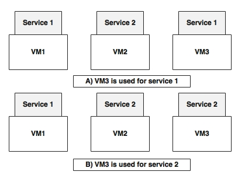

Notes: 

Autoscaling can be applied at the application level or at the infrastructure level. In a nutshell, application scaling is scaling by replicating application binaries only, whereas infrastructure scaling is replicating the entire virtual machine, including application binaries.
In this scenario, scaling is done by replicating the microservices, not the underlying infrastructure, such as virtual machines. The assumption is that there is a pool of VMs or physical infrastructures available to scale up microservices. These VMs have the basic image fused with any dependencies, such as JRE. It is also assumed that microservices are homogeneous in nature. This gives flexibility in reusing the same virtual or physical machines for different services:

As shown in the preceding diagram, in scenario A, VM3 is used for Service 1, whereas in scenario B, the same VM3 is used for Service 2. In this case, we only swapped the application library and not the underlying infrastructure.
This approach gives faster instantiation as we are only handling the application binaries and not the underlying VMs. The switching is easier and faster as the binaries are smaller in size and there is no OS boot required either. However, the downside of this approach is that if certain microservices require OS-level tuning or use polyglot technologies, then dynamically swapping microservices will not be effective.


---

## Autoscaling the infrastructure


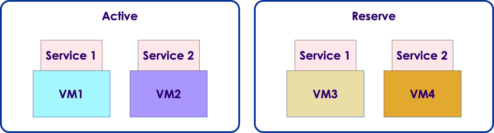

Notes: 

In contrast to the previous approach, in this case, the infrastructure is also provisioned automatically. In most cases, this will create a new VM on the fly or destroy the VMs based on the demand:
As shown in the preceding diagram, the reserve instances are created as VM images with predefined service instances. When there is demand for Service 1, VM3 is moved to an active state. When there is a demand for Service 2, VM4 is moved to the active state.
This approach is efficient if the applications depend upon the parameters and libraries at the infrastructure level, such as the operating system. Also, this approach is better for polyglot microservices. The downside is the heavy nature of VM images and the time required to spin up a new VM. Lightweight containers such as Dockers are preferred in such cases instead of traditional heavyweight virtual machines.


---

## Autoscaling in the cloud


 * Elasticity or autoscaling is one of the fundamental features of most cloud providers. 

 * Cloud providers use infrastructure scaling patterns, as discussed in the previous section. 

 * These are typically based on a set of pooled machines.

Notes: 

For example, in AWS, these are based on introducing new EC2 instances with a predefined AMI. AWS supports autoscaling with the help of autoscaling groups. Each group is set with a minimum and maximum number of instances. AWS ensures that the instances are scaled on demand within these bounds. In case of predictable traffic patterns, provisioning can be configured based on timelines. AWS also provides ability for applications to customize autoscaling policies.
Microsoft Azure also supports autoscaling based on the utilization of resources such as the CPU, message queue length, and so on. IBM Bluemix supports autoscaling based on resources such as CPU usage.
Other PaaS platforms, such as CloudBees and OpenShift, also support autoscaling for Java applications. Pivotal Cloud Foundry supports autoscaling with the help of Pivotal Autoscale. Scaling policies are generally based on resource utilization, such as the CPU and memory thresholds.
There are components that run on top of the cloud and provide fine-grained controls to handle autoscaling. Netflix Fenzo, Eucalyptus, Boxfuse, and Mesosphere are some of the components in this category.


---

## Approaches to Autoscaling


 * This approach is based on real-time service metrics collected through monitoring mechanisms. 

 * Generally, the resource-scaling approach takes decisions based on the CPU, memory, or the disk of machines. 

 * This can also be done by looking at the statistics collected on the service instances themselves, such as heap memory usage.

Notes: 


---

## 


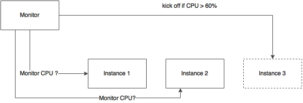

Notes: 

A typical policy may be spinning up another instance when the CPU utilization of the machine goes beyond 60%. Similarly, if the heap size goes beyond a certain threshold, we can add a new instance. The same applies to downsizing the compute capacity when the resource utilization goes below a set threshold. This is done by gradually shutting down server


---

## Approaches to Scaling


 * An example of a  **response sliding window**  is if 60% of the response time of a particular transaction is consistently more than the set threshold value in a 60-second sampling window, increase service instances

 * In a  **CPU sliding window** , if the CPU utilization is consistently beyond 70% in a 5 minutes sliding window, then a new instance is created

 * An example of the  **exception sliding window**  is if 80% of the transactions in a sliding window of 60 seconds or 10 consecutive executions result in a particular system exception, such as a connection timeout due to exhausting the thread pool, then a new service instance is created

Notes: 

In many cases, we will set a lower threshold than the actual expected thresholds. For example, instead of setting the CPU utilization threshold at 80%, set it at 60% so that the system gets enough time to spin up an instance before it stops responding. Similarly, when scaling down, we use a lower threshold than the actual. For example, we will use 40% CPU utilization to scale down instead of 60%. This allows us to have a cool-down period so that there will not be any resource struggle when shutting down instances.
Resource-based scaling is also applicable to service-level parameters such as the throughput of the service, latency, applications thread pool, connection pool, and so on. These can also be at the application level, such as the number of sales orders processing in a service instance, based on internal benchmarking.


---

## Scaling during time frames


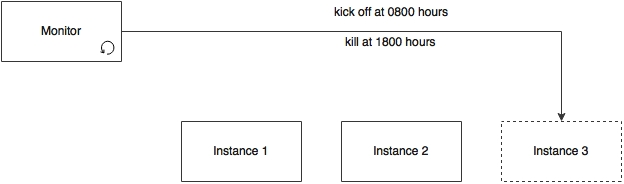

Notes: 

Time-based scaling is an approach to scaling services based on certain periods of the day, month, or year to handle seasonal or business peaks. For example, some services may experience a higher number of transactions during office hours and a considerably low number of transactions outside office hours. In this case, during the day, services autoscale to meet the demand and automatically downsize during the non-office hours

Many airports worldwide impose restrictions on night-time landing. As a result, the number of passengers checking in at the airports during the night time is less compared to the day time. Hence, it is cost effective to reduce the number of instances during the night time.


---

## Scale based on queue length


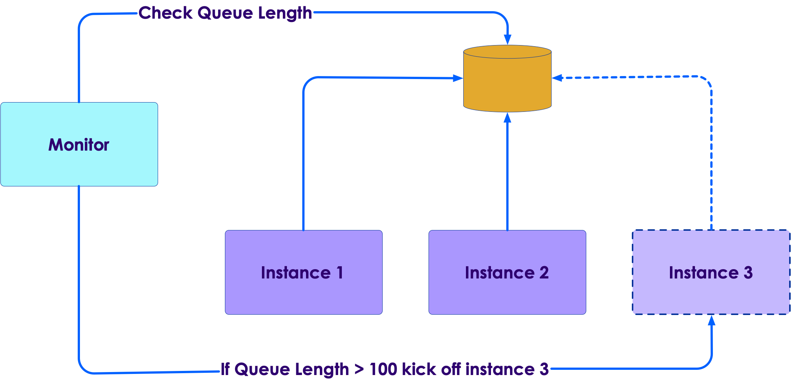

Notes: 

This approach is based on the competing consumer pattern. In this case, a pool of instances is used to consume messages. Based on the message threshold, new instances are added to consume additional messages.


---

## Scale based on business parameters


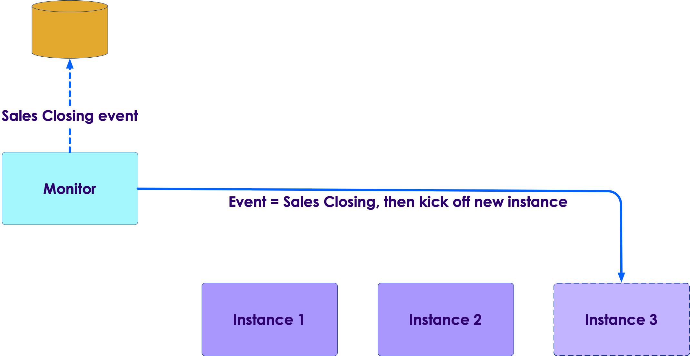

Notes: 

In this case, adding instances is based on certain business parameters—for example, spinning up a new instance just before handling sales closing transactions. As soon as the monitoring service receives a preconfigured business event (such as sales closing minus 1 hour), a new instance will be brought up in anticipation of large volumes of transactions. This will provide fine-grained control on scaling based on business rules:


---

## Predictive Autoscaling


 * Predictive scaling is a new paradigm of autoscaling that is different from the traditional real-time metrics-based autoscaling. 

 * A prediction engine will take multiple inputs, such as historical information, current trends, and so on, to predict possible traffic patterns. 

 * Autoscaling is done based on these predictions. 

 * Predictive autoscaling helps avoid hardcoded rules and time windows. Instead, the system can automatically predict such time windows. 

 * In more sophisticated deployments, predictive analysis may use cognitive computing mechanisms to predict autoscaling.

Notes: 

In the cases of sudden traffic spikes, traditional autoscaling may not help. Before the autoscaling component can react to the situation, the spike would have hit and damaged the system. The predictive system can understand these scenarios and predict them before their actual occurrence. An example will be handling a flood of requests immediately after a planned outage.
Netflix Scryer is an example of such a system that can predict resource requirements in advance.


---

## Capabilities for Scaling


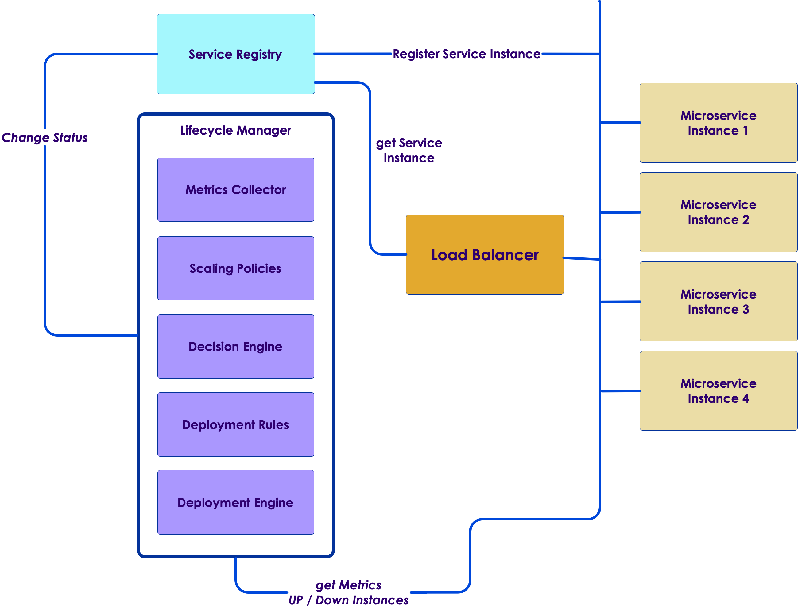

Notes: 

In this section, we will examine how to enhance microservices developed in session 5, Scaling Microservices with Spring Cloud, for autoscaling. We need a component to monitor certain performance metrics and trigger autoscaling. We will call this component the life cycle manager.
The service life cycle manager, or the application life cycle manager, is responsible for detecting scaling requirements and adjusting the number of instances accordingly. It is responsible for starting and shutting down instances dynamically.
In this section, we will take a look at a primitive autoscaling system to understand the basic concepts, which will be enhanced in later sessions.
The capabilities required for an autoscaling system
A typical autoscaling system has capabilities as shown in the following diagram:


---

## Components


 *  **Microservices** : These are sets of the up-and-running microservice instances that keep sending health and metrics information. Alternately, these services expose actuator endpoints for metrics collection. In the preceding diagram, these are represented as  **Microservice 1**  through  **Microservice 4** .

 *  **Service Registry** : A service registry keeps track of all the services, their health states, their metadata, and their endpoint URI.

 *  **Load Balancer** : This is a client-side load balancer that looks up the service registry to get up-to-date information about the available service instances.

 *  **Lifecycle Manager** : The life cycle manger is responsible for autoscaling, which has the following subcomponents:

Notes: 

Metrics Collector: A metrics collection unit is responsible for collecting metrics from all service instances. The life cycle manager will aggregate the metrics. It may also keep a sliding time window. The metrics could be infrastructure-level metrics, such as CPU usage, or application-level metrics, such as transactions per minute.
Scaling policies: Scaling policies are nothing but sets of rules indicating when to scale up and scale down microservices—for example, 90% of CPU usage above 60% in a sliding window of 5 minutes.
Decision Engine: A decision engine is responsible for making decisions to scale up and scale down based on the aggregated metrics and scaling policies.
Deployment Rules: The deployment engine uses deployment rules to decide which parameters to consider when deploying services. For example, a service deployment constraint may say that the instance must be distributed across multiple availability regions or a 4 GB minimum of memory required for the service.
Deployment Engine: The deployment engine, based on the decisions of the decision engine, can start or stop microservice instances or update the registry by altering the health states of services. For example, it sets the health status as "out of service" to take out a service temporarily.


---

## Custom Lifecycle Manager


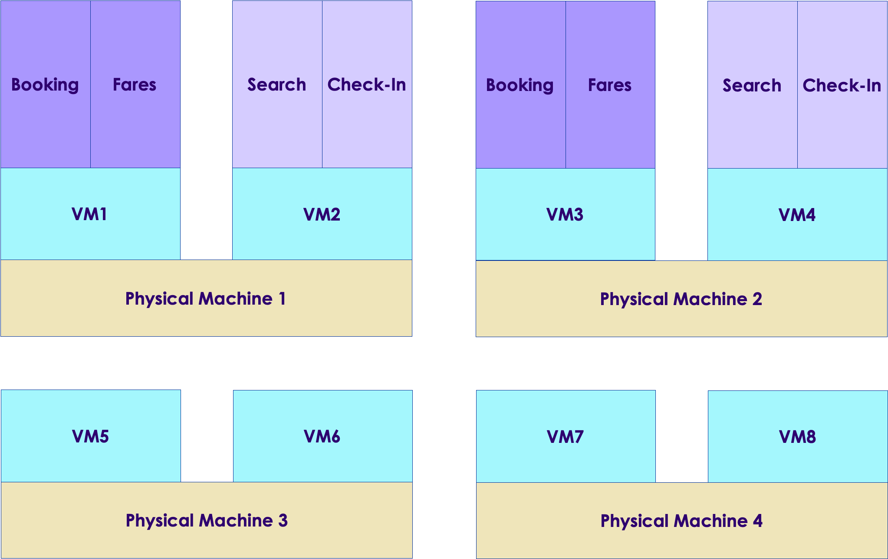

Notes: 

The life cycle manager introduced in this section is a minimal implementation to understand autoscaling capabilities. In later sessions, we will enhance this implementation with containers and cluster management solutions. Ansible, Marathon, and Kubernetes are some of the tools useful in building this capability.
In this section, we will implement an application-level autoscaling component using Spring Boot for the services developed in session 5, Scaling Microservices with Spring Cloud.
The life cycle manager introduced in this section is a minimal implementation to understand autoscaling capabilities. In later sessions, we will enhance this implementation with containers and cluster management solutions. Ansible, Marathon, and Kubernetes are some of the tools useful in building this capability.
In this section, we will implement an application-level autoscaling component using Spring Boot for the services developed in session 5, Scaling Microservices with Spring Cloud.
As shown in the diagram, there are four physical machines. Eight VMs are created from four physical machines. Each physical machine is capable of hosting two VMs, and each VM is capable of running two Spring Boot instances, assuming that all services have the same resource requirements.
Four VMs, VM1 through VM4, are active and are used to handle traffic. VM5 to VM8 are kept as reserve VMs to handle scalability. VM5 and VM6 can be used for any of the microservices and can also be switched between microservices based on scaling demands. Redundant services use VMs created from different physical machines to improve fault tolerance.
Our objective is to scale out any services when there is increase in traffic flow using four VMs, VM5 through VM8, and scale down when there is not enough load. The architecture of our solution is as follows.


---

## 


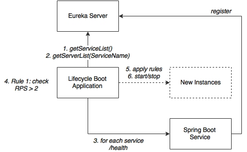

Notes: 

The Spring Boot service represents microservices such as Search, Book, Fares, and Check-in. Services at startup automatically register endpoint details to the Eureka registry. These services are actuator-enabled, so the life cycle manager can collect metrics from the actuator endpoints.
The life cycle manager service is nothing but another Spring Boot application. The life cycle manager has a metrics collector that runs a background job, periodically polls the Eureka server, and gets details of all the service instances. The metrics collector then invokes the actuator endpoints of each microservice registered in the Eureka registry to get the health and metrics information. In a real production scenario, a subscription approach for data collection is better.
With the collected metrics information, the life cycle manager executes a list of policies and derives decisions on whether to scale up or scale down instances. These decisions are either to start a new service instance of a particular type on a particular VM or to shut down a particular instance.
In the case of shutdown, it connects to the server using an actuator endpoint and calls the shutdown service to gracefully shut down an instance.
In the case of starting a new instance, the deployment engine of the life cycle manager uses the scaling rules and decides where to start the new instance and what parameters are to be used when starting the instance. Then, it connects to the respective VMs using SSH. Once connected, it executes a preinstalled script (or passes this script as a part of the execution) by passing the required constraints as a parameter. This script fetches the application library from a central Nexus repository in which the production binaries are kept and initiates it as a Spring Boot application. The port number is parameterized by the life cycle manager. SSH needs to be enabled on the target machines.
In this example, we will use TPM (Transactions Per Minute) or RPM (Requests Per Minute) as sampler metrics for decision making. If the Search service has more than 10 TPM, then it will spin up a new Search service instance. Similarly, if the TPM is below 2, one of the instances will be shut down and released back to the pool.
When starting a new instance, the following policies will be applied:
The number of service instances at any point should be a minimum of 1 and a maximum of 4. This also means that at least one service instance will always be up and running.
A scaling group is defined in such a way that a new instance is created on a VM that is on a different physical machine. This will ensure that the services run across different physical machines.
These policies could be further enhanced. The life cycle manager ideally provides options to customize these rules through REST APIs or Groovy scripts.


---

## Lab 20


Notes: 


---

## 7 - Logging and Monitoring


 * The different options, tools, and technologies for log management

 * The use of Spring Cloud Sleuth in tracing microservices

 * The different tools for end-to-end monitoring of microservices

 * The use of Spring Cloud Hystrix and Turbine for circuit monitoring

 * The use of data lakes in enabling business data analysis

Notes: 

One of the biggest challenges due to the very distributed nature of Internet-scale microservices deployment is the logging and monitoring of individual microservices. It is difficult to trace end-to-end transactions by correlating logs emitted by different microservices. As with monolithic applications, there is no single pane of glass to monitor microservices.
This session will cover the necessity and importance of logging and monitoring in microservice deployments. This session will further examine the challenges and solutions to address logging and monitoring with a number of potential architectures and technologies.


---

## 


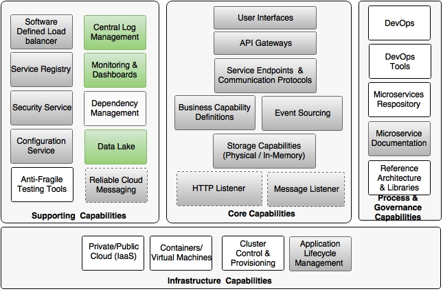

Notes: 

Reviewing the microservice capability model
In this session, we will explore the following microservice capabilities from the microservices capability model discussed in session 3, Applying Microservices Concepts:
Central Log Management
Monitoring and Dashboards
Dependency Management (part of Monitoring and Dashboards)
Data Lake


---

## 


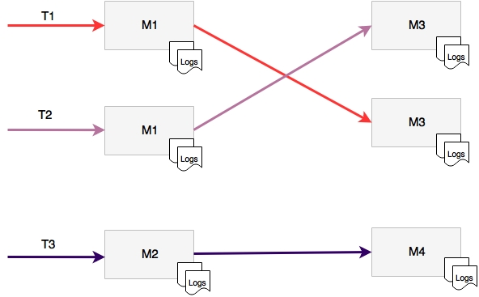

Notes: 

Logs are nothing but streams of events coming from a running process. For traditional JEE applications, a number of frameworks and libraries are available to log. Java Logging (JUL) is an option off the shelf from Java itself. Log4j, Logback, and SLF4J are some of the other popular logging frameworks available. These frameworks support both UDP as well as TCP protocols for logging. Applications send log entries to the console or to the filesystem. File recycling techniques are generally employed to avoid logs filling up all the disk space.
One of the best practices of log handling is to switch off most of the log entries in production due to the high cost of disk IOs. Not only do disk IOs slow down the application, but they can also severely impact scalability. Writing logs into the disk also requires high disk capacity. An out-of-disk-space scenario can bring down the application. Logging frameworks provide options to control logging at runtime to restrict what is to be printed and what not. Most of these frameworks provide fine-grained control over the logging controls. They also provide options to change these configurations at runtime.
On the other hand, logs may contain important information and have high value if properly analyzed. Therefore, restricting log entries essentially limits our ability to understand the application's behavior.
When moved from traditional to cloud deployment, applications are no longer locked to a particular, predefined machine. Virtual machines and containers are not hardwired with an application. The machines used for deployment can change from time to time. Moreover, containers such as Docker are ephemeral. This essentially means that one cannot rely on the persistent state of the disk. Logs written to the disk are lost once the container is stopped and restarted. Therefore, we cannot rely on the local machine's disk to write log files.
As we discussed in session 1, Demystifying Microservices, one of the principles of the Twelve-Factor app is to avoid routing or storing log files by the application itself. In the context of microservices, they will run on isolated physical or virtual machines, resulting in fragmented log files. In this case, it is almost impossible to trace end-to-end transactions that span multiple microservices:

As shown in the diagram, each microservice emits logs to a local filesystem. In this case, microservice M1 calls M3. These services write their logs to their own local filesystems. This makes it harder to correlate and understand the end-to-end transaction flow. Also, as shown in the diagram, there are two instances of M1 and two instances of M2 running on two different machines. In this case, log aggregation at the service level is hard to achieve.


---

## 


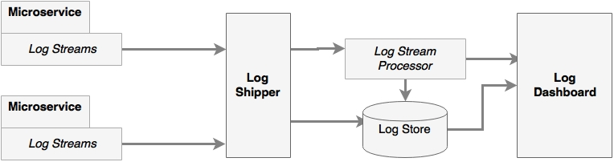

Notes: 

A centralized logging solution : the solution
In order to address the challenges stated earlier, traditional logging solutions require serious rethinking. The new logging solution, in addition to addressing the preceding challenges, is also expected to support the capabilities summarized here:
The ability to collect all log messages and run analytics on top of the log messages
The ability to correlate and track transactions end to end
The ability to keep log information for longer time periods for trending and forecasting
The ability to eliminate dependency on the local disk system
The ability to aggregate log information coming from multiple sources such as network devices, operating system, microservices, and so on
The solution to these problems is to centrally store and analyze all log messages, irrespective of the source of log. The fundamental principle employed in the new logging solution is to detach log storage and processing from service execution environments. Big data solutions are better suited to storing and processing large numbers of log messages more effectively than storing and processing them in microservice execution environments.
In the centralized logging solution, log messages will be shipped from the execution environment to a central big data store. Log analysis and processing will be handled using big data solutions:


---

## The Logging Problem


 * The ability to collect all log messages and run analytics on top of the log messages

 * The ability to correlate and track transactions end to end

 * The ability to keep log information for longer time periods for trending and forecasting

 * The ability to eliminate dependency on the local disk system

 * The ability to aggregate log information coming from multiple sources such as network devices, operating system, microservices, and so on

Notes: 

A centralized logging solution
In order to address the challenges stated earlier, traditional logging solutions require serious rethinking. The new logging solution, in addition to addressing the preceding challenges, is also expected to support the capabilities summarized here:
The solution to these problems is to centrally store and analyze all log messages, irrespective of the source of log. The fundamental principle employed in the new logging solution is to detach log storage and processing from service execution environments. Big data solutions are better suited to storing and processing large numbers of log messages more effectively than storing and processing them in microservice execution environments.
In the centralized logging solution, log messages will be shipped from the execution environment to a central big data store. Log analysis and processing will be handled using big data solutions:


---

## 


Notes: 

Log streams: These are streams of log messages coming out of source systems. The source system can be microservices, other applications, or even network devices. In typical Java-based systems, these are equivalent to streaming Log4j log messages.
Log shippers: Log shippers are responsible for collecting the log messages coming from different sources or endpoints. The log shippers then send these messages to another set of endpoints, such as writing to a database, pushing to a dashboard, or sending it to stream-processing endpoint for further real-time processing.
Log store: A log store is the place where all log messages are stored for real-time analysis, trending, and so on. Typically, a log store is a NoSQL database, such as HDFS, capable of handling large data volumes.
Log stream processor: The log stream processor is capable of analyzing real-time log events for quick decision making. A stream processor takes actions such as sending information to a dashboard, sending alerts, and so on. In the case of self-healing systems, stream processors can even take actions to correct the problems.
Log dashboard: A dashboard is a single pane of glass used to display log analysis results such as graphs and charts. These dashboards are meant for the operational and management staff.
The benefit of this centralized approach is that there is no local I/O or blocking disk writes. It also does not use the local machine's disk space. This architecture is fundamentally similar to the lambda architecture for big data processing.
To read more on the Lambda architecture, go to http://lambda-architecture.net.
It is important to have in each log message a context, message, and correlation ID. The context typically has the timestamp, IP address, user information, process details (such as service, class, and functions), log type, classification, and so on. The message will be plain and simple free text information. The correlation ID is used to establish the link between service calls so that calls spanning microservices can be traced.


---

## 


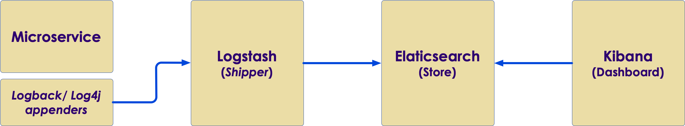

Notes: 

The selection of logging solutions
There are a number of options available to implement a centralized logging solution. These solutions use different approaches, architectures, and technologies. It is important to understand the capabilities required and select the right solution that meets the needs.
Cloud services
There are a number of cloud logging services available, such as the SaaS solution.
Loggly is one of the most popular cloud-based logging services. Spring Boot microservices can use Loggly's Log4j and Logback appenders to directly stream log messages into the Loggly service.
If the application or service is deployed in AWS, AWS CloudTrail can be integrated with Loggly for log analysis.
Papertrial, Logsene, Sumo Logic, Google Cloud Logging, and Logentries are examples of other cloud-based logging solutions.
The cloud logging services take away the overhead of managing complex infrastructures and large storage solutions by providing them as simple-to-integrate services. However, latency is one of the key factors to be considered when selecting cloud logging as a service.
Off-the-shelf solutions
There are many purpose-built tools to provide end-to-end log management capabilities that are installable locally in an on-premises data center or in the cloud.
Graylog is one of the popular open source log management solutions. Graylog uses Elasticsearch for log storage and MongoDB as a metadata store. Graylog also uses GELF libraries for Log4j log streaming.
Splunk is one of the popular commercial tools available for log management and analysis. Splunk uses the log file shipping approach, compared to log streaming used by other solutions to collect logs.
Best-of-breed integration
The last approach is to pick and choose best-of-breed components and build a custom logging solution.
Log shippers
There are log shippers that can be combined with other tools to build an end-to-end log management solution. The capabilities differ between different log shipping tools.
Logstash is a powerful data pipeline tool that can be used to collect and ship log files. Logstash acts as a broker that provides a mechanism to accept streaming data from different sources and sync them to different destinations. Log4j and Logback appenders can also be used to send log messages directly from Spring Boot microservices to Logstash. The other end of Logstash is connected to Elasticsearch, HDFS, or any other database.
Fluentd is another tool that is very similar to Logstash, as is Logspout, but the latter is more appropriate in a Docker container-based environment.
Log stream processors
Stream-processing technologies are optionally used to process log streams on the fly. For example, if a 404 error is continuously occurring as a response to a particular service call, it means there is something wrong with the service. Such situations have to be handled as soon as possible. Stream processors are pretty handy in such cases as they are capable of reacting to certain streams of events that a traditional reactive analysis can't.
A typical architecture used for stream processing is a combination of Flume and Kafka together with either Storm or Spark Streaming. Log4j has Flume appenders, which are useful to collect log messages. These messages are pushed into distributed Kafka message queues. The stream processors collect data from Kafka and process them on the fly before sending it to Elasticsearch and other log stores.
Spring Cloud Stream, Spring Cloud Stream Modules, and Spring Cloud Data Flow can also be used to build the log stream processing.
Log storage
Real-time log messages are typically stored in Elasticsearch. Elasticsearch allows clients to query based on text-based indexes. Apart from Elasticsearch, HDFS is also commonly used to store archived log messages. MongoDB or Cassandra is used to store summary data, such as monthly aggregated transaction counts. Offline log processing can be done using Hadoop's MapReduce programs.
Dashboards
The last piece required in the central logging solution is a dashboard. The most commonly used dashboard for log analysis is Kibana on top of an Elasticsearch data store. Graphite and Grafana are also used to display log analysis reports.


---

## Lab 21


 * Lab 21 - ELK and Kibana :

Notes: 


---

## Tracing


 * With the central logging solution, we can have all the logs in a central storage. However, it is still almost impossible to trace end-to-end transactions. 

 * In order to do end-to-end tracking, transactions spanning microservices need to have a correlation ID.

 * Twitter's Zipkin, Cloudera's HTrace, and Google's Dapper systems are examples of distributed tracing systems. 

 * Spring Cloud provides a wrapper component on top of these using the Spring Cloud Sleuth library.

Notes: 

Distributed tracing works with the concepts of span and trace. The span is a unit of work; for example, calling a service is identified by a 64-bit span ID. A set of spans form a tree-like structure is called a trace.


---

## 


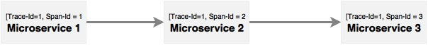

Notes: 

As shown in the diagram, Microservice 1 calls Microservice 2, and Microservice 2 calls Microservice 3. In this case, as shown in the diagram, the same trace ID is passed across all microservices, which can be used to track transactions end to end.
In order to demonstrate this, we will use the Search API Gateway and Search microservices. A new endpoint has to be added in Search API Gateway (session7.search-apigateway) that internally calls the Search service to return data. Without the trace ID, it is almost impossible to trace or link calls coming from the Website to Search API Gateway to Search microservice. In this case, it only involves two to three services, whereas in a complex environment, there could be many interdependent services.


---

## Lab 22 : Sleuth


Notes: 


---

## Monitoring


 * Microservices are truly distributed systems with a fluid deployment topology. 

 * Without sophisticated monitoring in place, operations teams may run into trouble managing large-scale microservices. 

 * Traditional monolithic application deployments are limited to a number of known services, instances, machines, and so on. 

 * This is easier to manage compared to the large number of microservices instances potentially running across different machines. 

 * To add more complication, these services dynamically change their topologies. A centralized logging capability only addresses part of the issue. 

 * It is important for operations teams to understand the runtime deployment topology and also the behavior of the systems. 

 * This demands more than a centralized logging can offer.

Notes: 

In general application, monitoring is more a collection of metrics, aggregation, and their validation against certain baseline values. If there is a service-level breach, then monitoring tools generate alerts and send them to administrators. With hundreds and thousands of interconnected microservices, traditional monitoring does not really offer true value. The one-size-fits-all approach to monitoring or monitoring everything with a single pane of glass is not easy to achieve in large-scale microservices.
One of the main objectives of microservice monitoring is to understand the behavior of the system from a user experience point of view. This will ensure that the end-to-end behavior is consistent and is in line with what is expected by the users.


---

## Why is Monitoring Hard?


 * The statistics and metrics are fragmented across many services, instances, and machines.

 * Heterogeneous technologies may be used to implement microservices, which makes things even more complex. A single monitoring tool may not give all the required monitoring options.

 * Microservices deployment topologies are dynamic, making it impossible to preconfigure servers, instances, and monitoring parameters.

 * If the agents require deep integration with the services or operating systems, then this will be hard to manage in a dynamic environment

 * If these tools impose overheads when monitoring or instrumenting the application, it may lead to performance issues

Notes: 

Many of the traditional monitoring tools are good to monitor monolithic applications but fall short in monitoring large-scale, distributed, interlinked microservice systems. Many of the traditional monitoring systems are agent-based preinstall agents on the target machines or application instances. This poses two challenges:
Many traditional tools need baseline metrics. Such systems work with preset rules, such as if the CPU utilization goes above 60% and remains at this level for 2 minutes, then an alert should be sent to the administrator. It is extremely hard to preconfigure these values in large, Internet-scale deployments.


---

## 


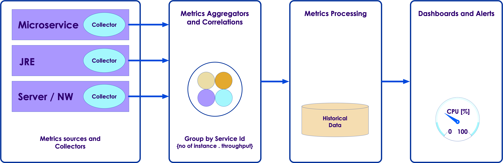

Notes: 

New-generation monitoring applications learn the application's behavior by themselves and set automatic threshold values. This frees up administrators from doing this mundane task. Automated baselines are sometimes more accurate than human forecasts:

Metrics sources and data collectors: Metrics collection at the source is done either by the server pushing metrics information to a central collector or by embedding lightweight agents to collect information. Data collectors collect monitoring metrics from different sources, such as network, physical machines, containers, software components, applications, and so on. The challenge is to collect this data using autodiscovery mechanisms instead of static configurations.
This is done by either running agents on the source machines, streaming data from the sources, or polling at regular intervals.
Aggregation and correlation of metrics: Aggregation capability is required for aggregating metrics collected from different sources, such as user transaction, service, infrastructure, network, and so on. Aggregation can be challenging as it requires some level of understanding of the application's behavior, such as service dependencies, service grouping, and so on. In many cases, these are automatically formulated based on the metadata provided by the sources.
Generally, this is done by an intermediary that accept the metrics.
Processing metrics and actionable insights: Once data is aggregated, the next step is to do the measurement. Measurements are typically done using set thresholds. In the new-generation monitoring systems, these thresholds are automatically discovered. Monitoring tools then analyze the data and provide actionable insights.
These tools may use big data and stream analytics solutions.
Alerting, actions, and dashboards: As soon as issues are detected, they have to be notified to the relevant people or systems. Unlike traditional systems, the microservices monitoring systems should be capable of taking actions on a real-time basis. Proactive monitoring is essential to achieving self-healing. Dashboards are used to display SLAs, KPIs, and so on.
Dashboards and alerting tools are capable of handling these requirements.

Application performance monitoring (APM): This is more of a traditional approach to system metrics collection, processing, alerting, and dashboard rendering. These are more from the system's point of view. Application topology discovery and visualization are new capabilities implemented by many of the APM tools. The capabilities vary between different APM providers.
Synthetic monitoring: This is a technique that is used to monitor the system's behavior using end-to-end transactions with a number of test scenarios in a production or production-like environment. Data is collected to validate the system's behavior and potential hotspots. Synthetic monitoring helps understand the system dependencies as well.
Real user monitoring (RUM) or user experience monitoring: This is typically a browser-based software that records real user statistics, such as response time, availability, and service levels. With microservices, with more frequent release cycle and dynamic topology, user experience monitoring is more important.


---

## Monitoring Tools


 * There are many tools available to monitor microservices. 

 * There are also overlaps between many of these tools. 

 * The selection of monitoring tools really depends upon the ecosystem that needs to be monitored. In most cases, more than one tool is required to monitor the overall microservice ecosystem.

Notes: 

AppDynamics, Dynatrace, and New Relic are top commercial vendors in the APM space, as per Gartner Magic Quadrant 2015. These tools are microservice friendly and support microservice monitoring effectively in a single console. Ruxit, Datadog, and Dataloop are other commercial offerings that are purpose-built for distributed systems that are essentially microservices friendly. Multiple monitoring tools can feed data to Datadog using plugins.
Cloud vendors come with their own monitoring tools, but in many cases, these monitoring tools alone may not be sufficient for large-scale microservice monitoring. For instance, AWS uses CloudWatch and Google Cloud Platform uses Cloud Monitoring to collect information from various sources.
Some of the data collecting libraries, such as Zabbix, statd, collectd, jmxtrans, and so on operate at a lower level in collecting runtime statistics, metrics, gauges, and counters. Typically, this information is fed into data collectors and processors such as Riemann, Datadog, and Librato, or dashboards such as Graphite.
Spring Boot Actuator is one of the good vehicles to collect microservices metrics, gauges, and counters, as we discussed in session 2, Building Microservices with Spring Boot. Netflix Servo, a metric collector similar to Actuator, and the QBit and Dropwizard metrics also fall in the same category of metric collectors. All these metrics collectors need an aggregator and dashboard to facilitate full-sized monitoring.
Monitoring through logging is popular but a less effective approach in microservices monitoring. In this approach, as discussed in the previous section, log messages are shipped from various sources, such as microservices, containers, networks, and so on to a central location. Then, we can use the logs files to trace transactions, identify hotspots, and so on. Loggly, ELK, Splunk, and Trace are candidates in this space.
Sensu is a popular choice for microservice monitoring from the open source community. Weave Scope is another tool, primarily targeting containerized deployments. Spigo is one of the purpose-built microservices monitoring systems closely aligned with the Netflix stack.
Pingdom, New Relic Synthetics, Runscope, Catchpoint, and so on provide options for synthetic transaction monitoring and user experience monitoring on live systems.
Circonus is classified more as a DevOps monitoring tool but can also do microservices monitoring. Nagios is a popular open source monitoring tool but falls more into the traditional monitoring system.
Prometheus provides a time series database and visualization GUI useful in building custom monitoring tools.


---

## Monitoring Microservice Dependencies


 * Mentoring tools such as AppDynamics, Dynatrace, and New Relic can draw dependencies among microservices. End-to-end transaction monitoring can also trace transaction dependencies. Other monitoring tools, such as Spigo, are also useful for microservices dependency management.

 * CMDB tools such as Device42 or purpose-built tools such as Accordance are useful in managing the dependency of microservices.  **Veritas Risk Advisor**  ( **VRA** ) is also useful for infrastructure discovery.

 * A custom implementation with a Graph database, such as Neo4j, is also useful. In this case, a microservice has to preconfigure its direct and indirect dependencies. At the startup of the service, it publishes and cross-checks its dependencies with a Neo4j database.

Notes: 


---

## Lab 23


Notes: 

Spring Cloud Hystrix for fault-tolerant microservices
This section will explore Spring Cloud Hystrix as a library for a fault-tolerant and latency-tolerant microservice implementation. Hystrix is based on the fail fast and rapid recovery principles. If there is an issue with a service, Hystrix helps isolate it. It helps to recover quickly by falling back to another preconfigured fallback service. Hystrix is another battle-tested library from Netflix. Hystrix is based on the circuit breaker pattern.
Note
Read more about the circuit breaker pattern at https://msdn.microsoft.com/en-us/library/dn589784.aspx.
In this section, we will build a circuit breaker with Spring Cloud Hystrix. Perform the following steps to change the Search API Gateway service to integrate it with Hystrix:


---

## Turbine


 * In the previous example, the /hystrix.stream endpoint of our microservice was given in the Hystrix Dashboard. 

 * The Hystrix Dashboard can only monitor one microservice at a time. 

 * If there are many microservices, then the Hystrix Dashboard pointing to the service has to be changed every time we switch the microservices to monitor. 

 * Looking into one instance at a time is tedious, especially when there are many instances of a microservice or multiple microservices.

Notes: 


---

## 


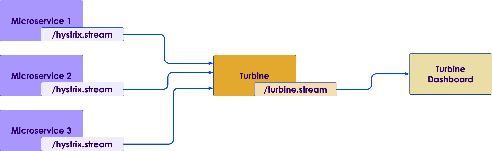

Notes: 

We have to have a mechanism to aggregate data coming from multiple /hystrix.stream instances and consolidate it into a single dashboard view. Turbine does exactly the same thing. Turbine is another server that collects Hystrix streams from multiple instances and consolidates them into one /turbine.stream instance. Now, the Hystrix Dashboard can point to /turbine.stream to get the consolidated information:

Turbine currently works only with different hostnames. Each instance has to be run on separate hosts. If you are testing multiple services locally on the same host, then update the host file (/etc/hosts) to simulate multiple hosts. Once done, bootstrap.properties has to be configured as follows:

eureka.instance.hostname: localdomain2


---

## Turbine Lab	


 * Lab 23 and a Half : 

 * Turbine currently works only with different hostnames. Each instance has to be run on separate hosts. If you are testing multiple services locally on the same host, then update the host file (/etc/hosts) to simulate multiple hosts. Once done, bootstrap.properties has to be configured as follows:

 * eureka.instance.hostname: localdomain2

Notes: 

This example showcases how to use Turbine to monitor circuit breakers across multiple instances and services. We will use the Search service and Search API Gateway in this example. Turbine internally uses Eureka to resolve service IDs that are configured for monitoring.


---

## Big Data and Microservices


 * A data lake or data hub is an ideal solution to handling such scenarios. 

 * An event-sourced architecture pattern is generally used to share the state and state changes as events with an external data store. 

 * When there is a state change, microservices publish the state change as events. Interested parties may subscribe to these events and process them based on their requirements. 

 * A central event store may also subscribe to these events and store them in a big data store for further analysis.

Notes: 


---

## 


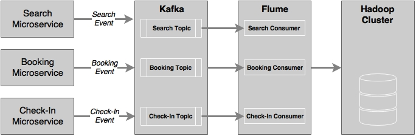

Notes: 

State change events generated from the microservice—in our case, the Search, Booking, and Check-In events—are pushed to a distributed high-performance messaging system, such as Kafka. A data ingestion service, such as Flume, can subscribe to these events and update them to an HDFS cluster. In some cases, these messages will be processed in real time by Spark Streaming. To handle heterogeneous sources of events, Flume can also be used between event sources and Kafka.
Spring Cloud Streams, Spring Cloud Streams modules, and Spring Data Flow are also useful as alternatives for high-velocity data ingestion.


---

## 8 - Containerizing your microservice


 * Containers and virtual machines

 * The private/public cloud

 * The microservices repository

Notes: 


---

## 


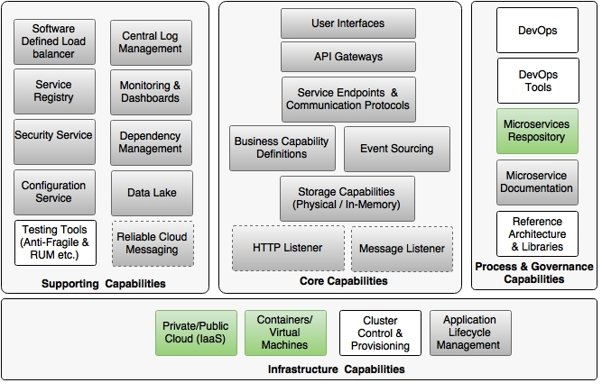

Notes: 


---

## Containers


 * Containers are not revolutionary, ground-breaking concepts. 

 * They have been in action for quite a while. 

 * However, the world is witnessing the re-entry of containers, mainly due to the wide adoption of cloud computing. 

 * The shortcomings of traditional virtual machines in the cloud computing space also accelerated the use of containers. 

 * Container providers such as  **Docker**  simplified container technologies to a great extent, which also enabled a large adoption of container technologies in today's world. 

 * The recent popularity of DevOps and microservices also acted as a catalyst for the rebirth of container technologies.

Notes: 

So, what are containers? Containers provide private spaces on top of the operating system. This technique is also called operating system virtualization. In this approach, the kernel of the operating system provides isolated virtual spaces. Each of these virtual spaces is called a container or virtual engine (VE). 


---

## 


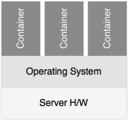

Notes: 

Containers allow processes to run on an isolated environment on top of the host operating system. A representation of multiple containers running on the same host is shown as follows:

Containers are easy mechanisms to build, ship, and run compartmentalized software components. Generally, containers package all the binaries and libraries that are essential for running an application. Containers reserve their own filesystem, IP address, network interfaces, internal processes, namespaces, OS libraries, application binaries, dependencies, and other application configurations.
There are billions of containers used by organizations. Moreover, there are many large organizations heavily investing in container technologies. Docker is far ahead of the competition, supported by many large operating system vendors and cloud providers. Lmctfy, SystemdNspawn, Rocket, Drawbridge, LXD, Kurma, and Calico are some of the other containerization solutions. Open container specification is also under development.


---

## VM versus Container


 * Both virtualization and containerization exhibit exactly the same characteristics. 

 * However, in a nutshell, containers and virtual machines are not the same. 

 * Therefore, it is unfair to make an apple-to-apple comparison between VMs and containers. 

 * Virtual machines and containers are two different techniques and address different problems of virtualization. 

Notes: 

VMs such as Hyper-V, VMWare, and Zen were popular choices for data center virtualization a few years ago. Enterprises experienced a cost saving by implementing virtualization over the traditional bare metal usage. It has also helped many enterprises utilize their existing infrastructure in a much more optimized manner. As VMs support automation, many enterprises experienced that they had to make lesser management effort with virtual machines. Virtual machines also helped organizations get isolated environments for applications to run in.


---

## VM versus Container


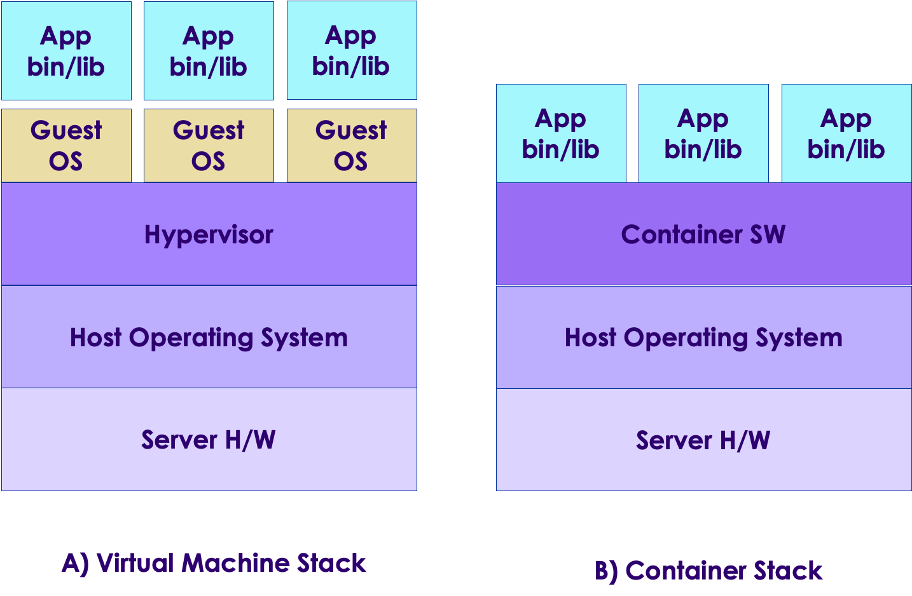

Notes: 

Virtual machines and containers are two different techniques and address different problems of virtualization. This difference is evident from the following diagram:

Virtual machines operate at a much lower level compared to containers. VMs provide hardware virtualization, such as that of CPUs, motherboards, memory, and so on. A VM is an isolated unit with an embedded operating system, generally called a Guest OS. VMs replicate the whole operating system and run it within the VM with no dependency on the host operating system environment. As VMs embed the full operating system environment, these are heavyweight in nature. This is an advantage as well as a disadvantage. The advantage is that VMs offer complete isolation to the processes running on VMs. The disadvantage is that it limits the number of VMs one can spin up in a bare metal due to the resource requirements of VMs.
The size of a VM has a direct impact on the time to start and stop it. As starting a VM in turn boots the OS, the start time for VMs is generally high. VMs are more friendly with infrastructure teams as it requires a low level of infrastructure competency to manage VMs.


---

## VM versus Container


 * In the container world, containers do not emulate the entire hardware or operating system. 

 * Unlike VMs, containers share certain parts of the host kernel and operating system. 

 * There is no concept of guest OS in the case of containers. 

 * Containers provide an isolated execution environment directly on top of the host operating system. 

 * This is its advantage as well as disadvantage. 

 * The advantage is that it is lighter as well as faster. 

 * As containers on the same machine share the host operating system, the overall resource utilization of containers is fairly small. 

 * As a result, many smaller containers can be run on the same machine, as compared to heavyweight VMs.

 * As containers on the same host share the host operating system, there are limitations as well. 

 * For example, it is not possible to set iptables firewall rules inside a container. 

 * Processes inside the container are completely independent from the processes on different containers running on the same host.

Notes: 

Unlike VMs, container images are publically available on community portals. This makes developers' lives much easier as they don't have to build the images from scratch; instead, they can now take a base image from certified sources and add additional layers of software components on top of the downloaded base image.
The lightweight nature of the containers is also opening up a plethora of opportunities, such as automated build, publishing, downloading, copying, and so on. The ability to download, build, ship, and run containers with a few commands or to use REST APIs makes containers more developer friendly. Building a new container does not take more than a few seconds. Containers are now part and parcel of continuous delivery pipelines as well.
In summary, containers have many advantages over VMs, but VMs have their own exclusive strengths. Many organizations use both containers and VMs, such as by running containers on top of VMs.


---

## Container Benefits


 * Self contained

 * Lightweight

 * Scalable

 * Portable

 * Lower License Cost

 * DevOps

 * Version Controlled

 * Reusable

 * Immutable Containers

Notes: 

Self-contained: Containers package the essential application binaries and their dependencies together to make sure that there is no disparity between different environments such as development, testing, or production. This promotes the concept of Twelve-Factor applications and that of immutable containers. Spring Boot microservices bundle all the required application dependencies. Containers stretch this boundary further by embedding JRE and other operating system-level libraries, configurations, and so on, if there are any.
Lightweight: Containers, in general, are smaller in size with a lighter footprint. The smallest container, Alpine, has a size of less than 5 MB. The simplest Spring Boot microservice packaged with an Alpine container with Java 8 would only come to around 170 MB in size. Though the size is still on the higher side, it is much less than the VM image size, which is generally in GBs. The smaller footprint of containers not only helps spin new containers quickly but also makes building, shipping, and storing easier.
Scalable: As container images are smaller in size and there is no OS booting at startup, containers are generally faster to spin up and shut down. This makes containers the popular choice for cloud-friendly elastic applications.
Portable: Containers provide portability across machines and cloud providers. Once the containers are built with all the dependencies, they can be ported across multiple machines or across multiple cloud providers without relying on the underlying machines. Containers are portable from desktops to different cloud environments.
Lower license cost: Many software license terms are based on the physical core. As containers share the operating system and are not virtualized at the physical resources level, there is an advantage in terms of the license cost.
DevOps: The lightweight footprint of containers makes it easy to automate builds and publish and download containers from remote repositories. This makes it easy to use in Agile and DevOps environments by integrating with automated delivery pipelines. Containers also support the concept of build once by creating immutable containers at build time and moving them across multiple environments. As containers are not deep into the infrastructure, multidisciplinary DevOps teams can manage containers as part of their day-to-day life.
Version controlled: Containers support versions by default. This helps build versioned artifacts, just as with versioned archive files.
Reusable: Container images are reusable artifacts. If an image is built by assembling a number of libraries for a purpose, it can be reused in similar situations.
Immutable containers: In this concept, containers are created and disposed of after usage. They are never updated or patched. Immutable containers are used in many environments to avoid complexities in patching deployment units. Patching results in a lack of traceability and an inability to recreate environments consistently.


---

## Microservices and Containers


 * There is no direct relationship between microservices and containers. 

 * Microservices can run without containers, and containers can run monolithic applications. 

     - However, there is a sweet spot between microservices and containers.

Notes: 

Containers are good for monolithic applications, but the complexities and the size of the monolith application may kill some of the benefits of the containers. For example, spinning new containers quickly may not be easy with monolithic applications. In addition to this, monolithic applications generally have local environment dependencies, such as the local disk, stovepipe dependencies with other systems, and so on. Such applications are difficult to manage with container technologies. This is where microservices go hand in hand with containers.


---

## 


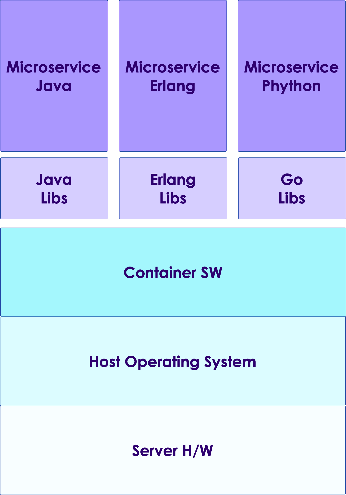

Notes: 

The real advantage of containers can be seen when managing many polyglot microservices—for instance, one microservice in Java and another one in Erlang or some other language. Containers help developers package microservices written in any language or technology in a platform- and technology-agnostic fashion and uniformly distribute them across multiple environments. Containers eliminate the need to have different deployment management tools to handle polyglot microservices. Containers not only abstract the execution environment but also how to access the services. Irrespective of the technologies used, containerized microservices expose REST APIs. Once the container is up and running, it binds to certain ports and exposes its APIs. As containers are self-contained and provide full stack isolation among services, in a single VM or bare metal, one can run multiple heterogeneous microservices and handle them in a uniform way.


---

## Docker


 * Docker is a platform to build, ship, and run lightweight containers based on Linux kernels. 

 * Docker has default support for Linux platforms. It also has support for Mac and Windows using  **Boot2Docker** , which runs on top of Virtual Box.

 * Amazon  **EC2 Container Service**  ( **ECS** ) has out-of-the-box support for Docker on AWS EC2 instances. 

 * Docker can be installed on bare metals and also on traditional virtual machines such as VMWare or Hyper-V.

Notes: 

Introduction to Docker
The previous sections talked about containers and their benefits. Containers have been in the business for years, but the popularity of Docker has given containers a new outlook. As a result, many container definitions and perspectives emerged from the Docker architecture. Docker is so popular that even containerization is referred to as dockerization.


---

## 


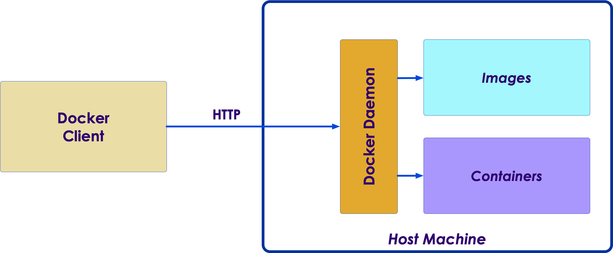

Notes: 

A Docker installation has two key components: a Docker daemon and a Docker client. Both the Docker daemon and Docker client are distributed as a single binary.
The following diagram shows the key components of a Docker installation:


---

## Docker Daemon


 * The Docker daemon is a server-side component that runs on the host machine responsible for building, running, and distributing Docker containers. 

 * The Docker daemon exposes APIs for the Docker client to interact with the daemon. 

 * These APIs are primarily REST-based endpoints. 

 * One can imagine that the Docker daemon as a controller service running on the host machine. 

 * Developers can programmatically use these APIs to build custom clients as well.

Notes: 


---

## Docker Client


 * The Docker client is a remote command-line program that interacts with the Docker daemon through either a socket or REST APIs. 

 * The CLI can run on the same host as the daemon is running on or it can run on a completely different host and connect to the daemon remotely. 

 * Docker users use the CLI to build, ship, and run Docker containers.

Notes: 


---

## Docker Images


 * One of the key concepts of Docker is the image. 

 * A Docker image is the read-only copy of the operating system libraries, the application, and its libraries. 

 * Once an image is created, it is guaranteed to run on any Docker platform without alterations.

 * In Spring Boot microservices, a Docker image packages operating systems such as Ubuntu, Alpine, JRE, and the Spring Boot fat application JAR file. 

 * It also includes instructions to run the application and expose the services

Notes: 


---

## 


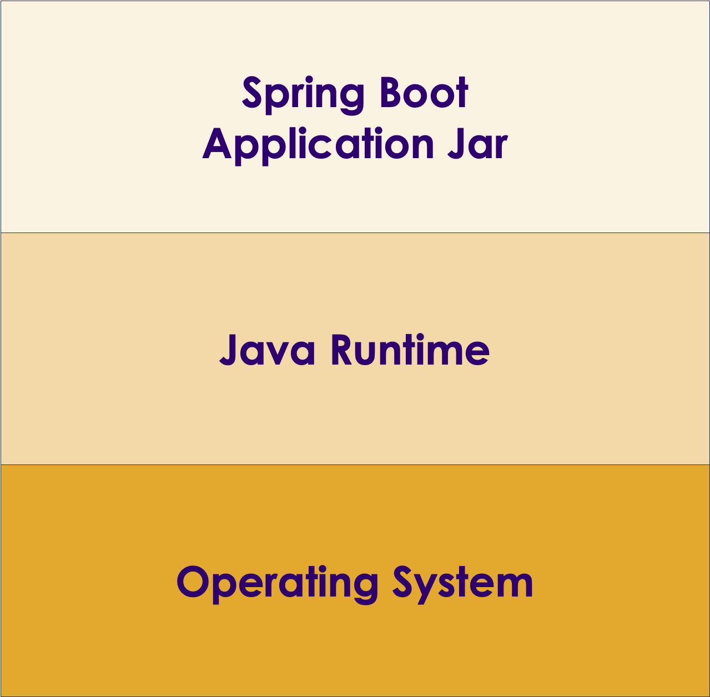

Notes: 

As shown in the diagram, Docker images are based on a layered architecture in which the base image is one of the flavors of Linux. Each layer, as shown in the preceding diagram, gets added to the base image layer with the previous image as the parent layer. Docker uses the concept of a union filesystem to combine all these layers into a single image, forming a single filesystem.
In typical cases, developers do not build Docker images from scratch. Images of an operating system, or other common libraries, such as Java 8 images, are publicly available from trusted sources. Developers can start building on top of these base images. The base image in Spring microservices can be JRE 8 rather than starting from a Linux distribution image such as Ubuntu.


---

## More Docker


 * Every time we rebuild the application, only the changed layer gets rebuilt, and the remaining layers are kept intact. 

 * All the intermediate layers are cached, and hence, if there is no change, Docker uses the previously cached layer and builds it on top. 

 * Multiple containers running on the same machine with the same type of base images would reuse the base image, thus reducing the size of the deployment. 

 * For instance, in a host, if there are multiple containers running with Ubuntu as the base image, they all reuse the same base image. 

 * This is applicable when publishing or downloading images as well

Notes: 


---

## 


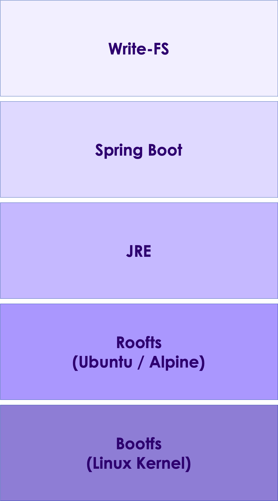

Notes: 

As shown in the diagram, the first layer in the image is a boot filesystem called bootfs, which is similar to the Linux kernel and the boot loader. The boot filesystem acts as a virtual filesystem for all images.
On top of the boot filesystem, the operating system filesystem is placed, which is called rootfs. The root filesystem adds the typical operating system directory structure to the container. Unlike in the Linux systems, rootfs, in the case of Docker, is on a read-only mode.
On top of rootfs, other required images are placed as per the requirements. In our case, these are JRE and the Spring Boot microservice JARs. When a container is initiated, a writable filesystem is placed on top of all the other filesystems for the processes to run. Any changes made by the process to the underlying filesystem are not reflected in the actual container. Instead, these are written to the writable filesystem. This writable filesystem is volatile. Hence, the data is lost once the container is stopped. Due to this reason, Docker containers are ephemeral in nature.
The base operating system packaged inside Docker is generally a minimal copy of just the OS filesystem. In reality the process running on top may not use the entire OS services. In a Spring Boot microservice, in many cases, the container just initiates a CMD and JVM and then invokes the Spring Boot fat JAR.


---

## Docker Containers


 * Docker containers are the running instances of a Docker image. 

 * Containers use the kernel of the host operating system when running. 

 * Hence, they share the host kernel with other containers running on the same host. 

 * The Docker runtime ensures that the container processes are allocated with their own isolated process space using kernel features such as  **cgroups**  and the kernel  **namespace**  of the operating system. 

 * In addition to the resource fencing, containers get their own filesystem and network configurations as well.

Notes: 

The containers, when instantiated, can have specific resource allocations, such as the memory and CPU. Containers, when initiated from the same image, can have different resource allocations. The Docker container, by default, gets an isolated subnet and gateway to the network. The network has three modes.


---

## Docker Registry


 * The Docker registry is a central place where Docker images are published and downloaded from. 

 * The URL https://hub.docker.com is the central registry provided by Docker. The Docker registry has public images that one can download and use as the base registry. 

 * Docker also has private images that are specific to the accounts created in the Docker registry.

Notes: 

Docker also offers Docker Trusted Registry, which can be used to set up registries locally on premises.


---

## Docker File


 * A Dockerfile is a build or scripting file that contains instructions to build a Docker image. 

 * There can be multiple steps documented in the Dockerfile, starting from getting a base image. 

 * A Dockerfile is a text file that is generally named Dockerfile. 

 * The docker build command looks up Dockerfile for instructions to build. 

 * One can compare a Dockerfile to a pom.xml file used in a Maven build.

Notes: 


---

## 


 * As our example also uses RabbitMQ, let's explore how to set up RabbitMQ as a Docker container. The following command pulls the RabbitMQ image from Docker Hub and starts RabbitMQ:

 *  **docker run –net host rabbitmq3** 

 * Ensure that the URL in *-service.properties is changed to the Docker host's IP address. Apply the earlier rule to find out the IP address in the case of Mac or Windows.

Notes: 


---

## Lab - Containerization


Notes: 


---

## Docker Registry Lab


Notes: 


---

## 9 - Deploying your microservice with Kubernetes


 * Containers make services portable by allowing you to package code, dependencies, and the runtime environment together in one artifact. 

 * Deploying containers is generally easier than deploying applications that do not run in containers. 

 * The host does not need to have any special configuration or state; it just needs to be able to execute the container runtime. 

 * The ability to deploy one or more containers on a single host gave rise to another challenge when managing production environments—scheduling and orchestrating containers to run on specific hosts and manage scaling.

Notes: 

Kubernetes is an open source container orchestration tool. It is responsible for scheduling, managing, and scaling your containerized applications. With Kubernetes, you do not need to worry about deploying your container to one or more specific hosts. Instead, you declare what resources your container needs and let Kubernetes decide how to do the work (what host the container runs on, what services it runs alongside, and so on). Kubernetes grew out of the Borg paper (https://research.google.com/pubs/pub43438.html), published by engineers at Google, which described how they managed services in Google's data centers using the Borg cluster manager.


---

## 


 * Kubernetes was started by Google as an open source project in 2014 and has enjoyed widespread adoption by organizations deploying code in containers.

 * Installing and managing a Kubernetes cluster is beyond the scope of this class. 

 *  **Minikube Allows**  you to easily run a single-node Kubernetes cluster on your development machine. 

     - Even though the cluster only has one node, the way you interface with Kubernetes when deploying your service is generally the same, so the steps here can be followed for any Kubernetes cluster.

Notes: 


---

## Lab 28 - Kubernetes


Notes: 


---

## Canary Deployments


 * All the techniques discussed in this session help prevent predictable mistakes, but they do nothing to prevent actual software bugs from negatively impacting users of the software we write. 

 * Canary deployment is a technique for reducing this risk and increasing confidence in new code that is being deployed to production.

Notes: 

With a canary deployment, you begin by shipping your code to a small percentage of production traffic. You can then monitor metrics, logs, traces, or whatever other tools allow you to observe how your software is working. Once you are confident that things are going as they should, you can gradually increase the percentage of traffic that receives your updated version until all production traffic is being served by the newest release of your service.


---

## 


 * Canary deployments used to be very difficult to get right. 

 * Teams shipping software in this way usually had to come up with some kind of feature-toggling solution that would gate requests to certain versions of the application being deployed. 

 * Thankfully, containers have made this much easier, and Kubernetes has made it even more so.

Notes: 

The term canary deployment comes from a technique that coal miners used to use to protect themselves from carbon monoxide or methane poisoning. By having a canary in the mine, the toxic gases would kill the canary before the miners, giving the miners an early warning sign that they should get out. Similarly, canary deployments allow us to expose a subset of users to risk without impacting the rest of the production environment. Thankfully, no animals have to be harmed when deploying code to production environments.


---

## Lab 29 - Kubernetes and Containers


Notes: 


---

