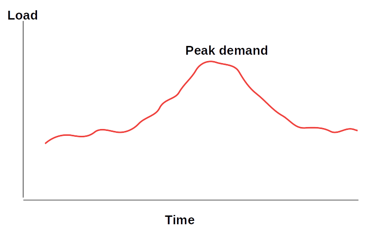

# Monitoring


---

## Objectives
* Learn monitoring tool
* And best practices

---

# Why Monitoring

---

## Monitoring


* [Monitoring at SpaceX](https://pixabay.com/photos/space-center-spacex-control-center-693251/)

 <!-- {"left" : 2.88, "top" : 3.44, "height" : 6.83, "width" : 11.73} -->    


Notes:

---

## Monitoring

* [California ISO (Independent System Operator)](http://www.caiso.com/TodaysOutlook/Pages/index.html) - that monitors California electrical grid

 <!-- {"left" : 9.7, "top" : 2.31, "height" : 3.77, "width" : 7.12} -->    


 <!-- {"left" : 10.1, "top" : 6.44, "height" : 3.64, "width" : 6.81} -->    


---

## Why Monitoring?

* Monitoring helps to keep an eye on sytems and applications

* Helps us identify problem spots before they actually become problems

* Helps us spot trends and patterns

<!-- {"left" : 4.49, "top" : 6.2, "height" : 5.13, "width" : 8.57} -->    


Notes:

---

## Monitoring Best Practices

* Some monitoring is better than no monitoring

* Implement **actionable monitoring**  
Without any action, monitoring is just 'pretty graphs'.  For example, when a problem is detected, an alert should be generated

* **Automate** as much as possible  
Monitoring can generate a lot of data.  Going through all the data manually can be tedious.  We want to implement tools to cut through the data and spot patterns.

* Use **good monitoring tools**   
These tools provide lot of automation and implement best practices

---

## What to Monitor?

 <!-- {"left" : 8.96, "top" : 2.17, "height" : 2.89, "width" : 8.04} -->    

* We want to monitor the following:
  - Cluster, individual nodes and applications

* **Cluster:** Monitor overall cluster status
  - Overall utilization (e.g. 60%)

* **Individual Nodes:** Monitor each machine to identify issues
  - CPU, memory, disk, bandwidth

* **Applications:** Monitor user applications
  - latencies, requests per second ..etc.

---

## Monitoring Architecture


 <!-- {"left" : 3.02, "top" : 2.97, "height" : 7.77, "width" : 11.45} -->    


Notes: 

---

## Monitoring Architecture


* 3 main components: collector, database, visualizer

* **Collector/agent**

  - Collects metrics from the host and pushes to database

* **Database**

  - Collects and stores metrics from various sources

  - Performs aggregations (current rate / last_1m rate / min / max)

  - A time-series database

* **Visualizer**

  - Create nice looking visualizations of metrics

  - Various graphs

Notes: 

---

## Monitoring Database Choices

|             | Prometheus               | Graphite                   | InfluxDB                                 | OpenTSDB                     |
|-------------|--------------------------|----------------------------|------------------------------------------|------------------------------|
| Ease of use | Easy                     | Easy                       | Easy                                     | Considerable effort required |
| Scale       | Small / medium           | Small/medium               | large                                    | Massively scalable           |
| License     | Open source              | Open source                | Open source + premium                    | Open source                  |
| Website     | <https://prometheus.io/> | <https://graphiteapp.org/> | <https://github.com/influxdata/influxdb> | <http://opentsdb.net/>       |

<!-- {"left" : 1.19, "top" : 2.5, "height" : 1, "width" : 15.11} -->    


<!-- {"left" : 0.78, "top" : 7.25, "height" : 2.19, "width" : 2.21} -->    

 <!-- {"left" : 3.69, "top" : 7.64, "height" : 1.41, "width" : 4.38} -->    

 <!-- {"left" : 8.78, "top" : 7.53, "height" : 1.62, "width" : 3.75} -->    


 <!-- {"left" : 13.24, "top" : 7.98, "height" : 0.72, "width" : 3.48} -->    


---

## Visualization - Grafana

 <!-- {"left" : 10.01, "top" : 1.98, "height" : 4.49, "width" : 7.09} -->    

* Modern, Open source

* Very attractive graphs

* Easy to setup and use

* Supports multiple databases: Graphite / Influx / OpenTSDB

* [Grafana.com](https://grafana.com/)


Notes: 

Image used under fair use , source: grafana.org


---

# Cluster Monitoring Tools


---

## Cluster Monitoring Tools

* There are tons of tools availble;  most are open source and very capable.
  - Choose one that works with your environment
* [Prometheus](https://prometheus.io/)
* [Riemann](http://riemann.io/)
* [Sensu](https://sensu.io/)
* [Zabbix](https://www.zabbix.com/)
* [Icninga](https://icinga.com/)
* [Nagios](https://www.nagios.org/projects/nagios-core/)
* [Cacti](https://www.cacti.net/)
* [M/Monit](https://mmonit.com/)
* [LibreNMS](https://www.librenms.org/)
* References
  - [1](https://geekflare.com/best-open-source-monitoring-software/),  [2](https://devopscube.com/best-opensource-monitoring-tools/),  [3](https://geekflare.com/best-open-source-monitoring-software/)

---

## Cluster Monitoring Tools

* **Instructor:** The following slides describe the tools in details.  They are provided as reference.  Cover as necessary.

---

##  Nagios

 <!-- {"left" : 9.35, "top" : 1.89, "height" : 5.54, "width" : 7.92} -->    

* Scalable

* Very well field tested (since 1999!)

* Host level and application level monitoring

* Large plugin library

* <https://www.nagios.org>

---

## Prometheus


 <!-- {"left" : 10.44, "top" : 1.89, "height" : 4.11, "width" : 6.85} -->    

* Open source and very popular

* **Prometheus** database is an excellent time series db
  * PromQL provides easy querying

* Works really well Kubenetes and container environments

* Built in [Alertmanager](https://prometheus.io/docs/alerting/latest/alertmanager/) helps you manage alerts

* [Prometheus website](https://prometheus.io/)

* References
  - [Prometheus Monitoring : The Definitive Guide](https://devconnected.com/the-definitive-guide-to-prometheus-in-2019/)

---

# System Monitoring Tools

---

## Host/System Monitoring Tools

* All the tools mentioned above will monitor overall cluster

* We can also drill down into individual hosts as well

* Example metrics:
  - CPU / Memory / Disk usage
  - Network traffic

* Sometimes we need more detailed information than provided by the tools

* Here are some tools to help with that

---

## Linux System Monitoring Tools

* System load
  - [Top](https://linux.die.net/man/1/top) and vaiants
  - [Atop](https://www.atoptool.nl/)
  - [htop](https://htop.dev/)
  - [glances](https://nicolargo.github.io/glances/)
* System IO stats
  - [vmstat](https://linux.die.net/man/8/vmstat)
  - [iostat](https://linux.die.net/man/1/iostat)
  - [lsof](https://linux.die.net/man/8/lsof)
* Network
  - [Tcp dump](https://www.tcpdump.org/)
  - [Netstat](https://tldp.org/LDP/nag2/x-087-2-iface.netstat.html)
* References:
  - [4 open source tools for Linux system monitoring](https://opensource.com/life/16/2/open-source-tools-system-monitoring)
  - [20 Command Line Tools to Monitor Linux Performance](https://www.tecmint.com/command-line-tools-to-monitor-linux-performance/)

---

## TOP / ATOP / HTOP / GLANCES

* These will give you a snapshot of what is running on your machine


 <!-- {"left" : 1.22, "top" : 3.07, "height" : 3.34, "width" : 7.08} -->&nbsp; &nbsp;  <!-- {"left" : 9.11, "top" : 3.16, "height" : 3.16, "width" : 7.2} -->

 <!-- {"left" : 1.23, "top" : 7.22, "height" : 3.34, "width" : 7.2} -->&nbsp; &nbsp;  <!-- {"left" : 10.02, "top" : 7.22, "height" : 3.34, "width" : 6.28} -->


---

## IO Stats 


 <!-- {"left" : 13.3, "top" : 1.69, "height" : 3.1, "width" : 3.81} -->

* **vmstats** will display memory/disk/thread stats

 <!-- {"left" : 7.58, "top" : 5.05, "height" : 2.36, "width" : 9.52} -->

* **iostats** will display IO stats

* Install using:  
`sudo apt install sysstats`

* References:
  - [Linux Performance Monitoring with Vmstat and Iostat Commands](https://www.tecmint.com/linux-performance-monitoring-with-vmstat-and-iostat-commands/)

---

## LSOF

* **lsof** displays files opened by processes

* It can be handy when diagnosing file IO errors

* For example, IO intensive apps like Kafka and Spark may run out of file handles;  We can use this to see which files are being opened

* References:
  - [10 lsof Command Examples in Linux](https://www.tecmint.com/10-lsof-command-examples-in-linux/)


 <!-- {"left" : 2.87, "top" : 6.84, "height" : 3.07, "width" : 11.75} -->


---

## Lab: Using System Monitoring Tools

 <!-- {"left" : 12.78, "top" : 1.65, "height" : 5.75, "width" : 4.32} -->

* **Overview:**
  - Learn Linux system monitoring tools

* **Approximate run time:**
  - ~15 mins

* **Instructions:**
  - Try the Linux tools we just learned.
  - Try various options for each tool


Notes:

---


# Java Monitoring Tools

---

## Java Monitoring Tools 

* Java is the language of choice for lot of big data systems (Kafa, Spark, Cassandra)

* So being able to monintor Java apps is important part of diagnosing issues

* Following are some tools of trade:
  - [JMX](https://www.oracle.com/java/technologies/javase/javamanagement.html)
  - [jolokia](https://jolokia.org/)
  - [Jconsole](https://docs.oracle.com/javase/7/docs/technotes/guides/management/jconsole.html)
  - [visualVM](https://visualvm.github.io/)
  - [Java Mission Control](https://docs.oracle.com/javacomponents/jmc-5-5/jmc-user-guide/intro.htm#JMCCI109) - Commercial
  - [Java flight recorder](https://docs.oracle.com/javacomponents/jmc-5-4/jfr-runtime-guide/about.htm#JFRUH170) - Commercial


---

## JMX

 <!-- {"left" : 10.92, "top" : 1.89, "height" : 5.93, "width" : 6.25} -->

* **JMX** is tools and interfaces for monitoring Java applications

* Lot of apps can export metrics using JMX interface

* These metrics can be collected by apps and displayed

* References:
  - [10 mins Quick Start JMX Tutorial](https://www.journaldev.com/1352/what-is-jmx-mbean-jconsole-tutorial)


---

## JConsole

* **JConsole** is a GUI monitoring tool
* Uses JMX to collect metrics
* References:
  - [JConsole](https://docs.oracle.com/javase/7/docs/technotes/guides/management/jconsole.html)
  - [Jconsole example](https://www.ibm.com/support/knowledgecenter/SSYKE2_8.0.0/com.ibm.java.vm.80.doc/docs/jconsole.html)


 <!-- {"left" : 12.22, "top" : 1.89, "height" : 3.94, "width" : 4.74} -->


&nbsp; &nbsp;  <!-- {"left" : 12.22, "top" : 6.31, "height" : 3.94, "width" : 4.73} -->

---

## VisualVM

<!-- {"left" : 8.92, "top" : 2.11, "height" : 2.97, "width" : 8.16} -->

 <!-- {"left" : 11.71, "top" : 5.56, "height" : 3.99, "width" : 5.36} -->

* **VisualVM** is a GUI Java profiler
* Can monitor: Heap memory, threads
* References:
  - [VisualVM](https://visualvm.github.io/)
  - [Visual VM guide](https://docs.oracle.com/javase/8/docs/technotes/guides/visualvm/)
  - [Visual VM tutorial](https://dzone.com/articles/all-about-visualvm)

---

## Java Flight Recorder

* **Java Flight Recorder (JFR)** is a tool for collecting diagnostic and profiling data of JVM
  - It is integrated into the Java Virtual Machine (JVM) and causes almost no performance overhead, so it can be used even in heavily loaded production environments

* Start as follows  
__`java -XX:+UnlockCommercialFeatures -XX:+FlightRecorder MyApp`__

* JFR will start instrumenting the app and collecting data

* References:
  - [Java Flight Recorder](https://docs.oracle.com/javacomponents/jmc-5-4/jfr-runtime-guide/about.htm#JFRUH170)
  - [Using Java Flight Recorder tutorial](https://www.baeldung.com/java-flight-recorder-monitoring)

---

## Java Mission Control 

 <!-- {"left" : 10.44, "top" : 2.31, "height" : 4.76, "width" : 6.8} -->

* **Java Mission Control** enables monitoring and managing Java applications without introducing the performance overhead

* For example, can collect data from `java flight recorder`

* Start as  __`jmc`__

* References:
  - [Java Mission Control](https://docs.oracle.com/javacomponents/jmc-5-5/jmc-user-guide/intro.htm#JMCCI109)

---

## Lab: Using Java Monitoring Tools

<!-- {"left" : 12.97, "top" : 1.7, "height" : 5.61, "width" : 4.21} -->

* **Overview:**
  - Experiment with Java monitoring tools

* **Approximate run time:**
  - ~15 mins

* **Instructions:**
  - Try the JVM tools we just learned.


Notes:

---

# Application Monitoring Tools

---

## Application Monitoring

* In previous sections we have learned the following:
  - System level monitoring (CPU, Memory, IO)
  - JVM monitoring (threads, heap size)

* Often times, we need to measure **application specific** metrics that we can not gather from the above

* We need to instrument/profile our application code

* For example, let's say we are saving data to a db, and want to measure the time taken.

```java

long t1 = mark_time();
result = saveToDB(data);
long t2 = mark_time();
// time taken is : t2 - t1
```
<!-- {"left" : 0.8, "top" : 6.71, "height" : 2.13, "width" : 7.53} -->


---

## Application Monitoring Best Practices

* Start early!  Start as you are developing the application.
  - This encourages good monitoring practices; and spot bottlenecks early on

* Prioritize what to monitor;  Profile critical application paths first

* Put in alerts in monitoring system; make sure they work!

* Have a process to monitor alerts.  Figure out who is on 'pager duty'

* References:
  - []

---

# Metrics Library

---

## Metrics Library

* **Metrics**  is a Java library, that is used to report metrics.Formerly known as  **codahale metrics** (authored by Coda Hale)

* Light weight and fast

* Widely used by many projects (Hadoop / Spark / Cassandra)

* Supported various backends: Graphite, Ganglia

* Supported UIs: built-in UI,   JMX

* [Metrics page](http://metrics.dropwizard.io/)

Notes: 


---

## Using Metrics Library


* Metrics is a Java library

* Import the package into project;  Here is a fragment in `pom.xml`

```xml
<dependencies>
  <dependency>
    <groupId>io.dropwizard.metrics</groupId>
    <artifactId>metrics-core</artifactId>
    <version>4.1.2</version>
  </dependency>
</dependencies> 
```
<!-- {"left" : 0.8, "top" : 3.5, "height" : 2.81, "width" : 9.84} -->


Notes: 

---

## Using Metrics Library

```java
import java.util.concurrent.TimeUnit;
import com.codahale.metrics.ConsoleReporter;
import com.codahale.metrics.JmxReporter;
import com.codahale.metrics.MetricFilter;
import com.codahale.metrics.MetricRegistry;
import com.codahale.metrics.graphite.Graphite;
import com.codahale.metrics.graphite.GraphiteReporter;

private final MetricRegistry metrics = new MetricRegistry();

// console reporter
ConsoleReporter consoleReporter =
ConsoleReporter.forRegistry(metrics).convertRatesTo(TimeUnit.SECONDS)
        .convertDurationsTo(TimeUnit.MILLISECONDS).build();
consoleReporter.start(30, TimeUnit.SECONDS);

// graphite
final Graphite graphite = new Graphite(new
InetSocketAddress("localhost", 2003));
final GraphiteReporter graphiteReporter
GraphiteReporter.forRegistry(metrics).prefixedWith("myapp")
  .convertRatesTo(TimeUnit.SECONDS)
  .convertDurationsTo(TimeUnit.MILLISECONDS)
  .filter(MetricFilter.ALL)
  .build(graphite);
graphiteReporter.start(30, TimeUnit.SECONDS);  
```
<!-- {"left" : 0.8, "top" : 2, "height" : 8.9, "width" : 13.9} -->


Notes: 


---

## Metrics Library: Meters


* A meter measures the rate of events over time.(e.g., "requests per second"). 

* In addition to the mean rate, meters also track 1-, 5-, and 15-minute moving averages.

```java
private final Meter requests = metrics.meter("requests");

public void handleRequest(Request request, Response response) {
    requests.mark();
} 
```
<!-- {"left" : 0.8, "top" : 4.58, "height" : 2.13, "width" : 13.81} -->


<!-- {"left" : 3.85, "top" : 7.34, "height" : 3.41, "width" : 9.79} -->


Notes: 


---

## Metrics Library: Counters


* A counter is used to 'count' things.Number of messages in queue, ...etc

* Counter is an AtomicLongCan be incremented or decremented

```java
private final Counter msgCounter = metrics.counter("messages-in
q");

msgCounter.inc();
msgCounter.inc(10);

msgCounter.dec();
msgCounter.dec(5); 

```
<!-- {"left" : 0.8, "top" : 3.44, "height" : 2.81, "width" : 12.14} -->

<!-- {"left" : 3.35, "top" : 6.92, "height" : 4.24, "width" : 10.8} -->


Notes: 


---

## Metrics Library: Histograms


* A  **histogram** measures the statistical distribution of values in a stream of data. 

* In addition to minimum, maximum, mean, etc., it also measures median, 75th, 90th, 95th, 98th, 99th, and 99.9th percentiles.

```java
private final Histogram msgSizes = metrics.histogram( "message_sizes");

msgSizes.update(100);
msgSizes.update(50); 
 
```
<!-- {"left" : 0.8, "top" : 4.65, "height" : 1.58, "width" : 13.82} -->


<!-- {"left" : 2.35, "top" : 7.43, "height" : 3.13, "width" : 12.8} -->


Notes: 


---

## Metrics Library: Timers


 * A  **timer**  measures the duration of piece of code

 * Also measures the rate the code is called

```java
private final Timer timerExec = metrics.timer("execTime"));

Timer.Context context = timerExec.time();
// do some work here
f();  // calling a function
context.stop(); 
```
<!-- {"left" : 0.8, "top" : 3.5, "height" : 2.27, "width" : 11.89} -->

<!-- {"left" : 4.02, "top" : 6.73, "height" : 3.49, "width" : 9.46} -->


Notes: 


---

## Lab: Metrics Labs

* **Overview:**
 - Learn to use Metrics library

* **Approximate Time:**
  - ~30 mins

* **Instructions:**
  - Grab the lab from <https://github.com/elephantscale/learning-metrics>
  - Follow the instructions to get metrics demo running

* **To Instructor:** 
  - Demo this if time permits


Notes: 


---

## References

* ["Site Reliability Engineering" book](https://www.oreilly.com/library/view/site-reliability-engineering/9781491929117/)

---

## Review and Q&A

<!-- {"left" : 13.2, "top" : 1.89, "height" : 2.68, "width" : 3.63} -->    

* Let's go over what we have covered so far

* Any questions?

 <!-- {"left" : 4.85, "top" : 5.79, "height" : 5.2, "width" : 7.8} -->    

