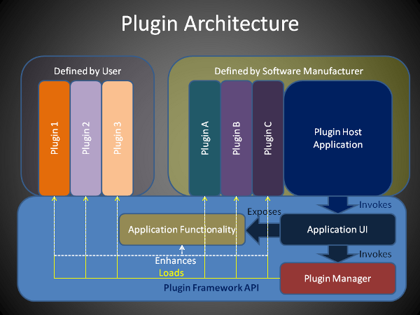

# NiFi Architecture

---

## NiFi Architecture

NiFi executes within a JVM on a host operating system. 

notes:

Image credit: https://docs.cloudera.com/HDPDocuments/HDF3/HDF-3.3.0/apache-nifi-overview/content/nifi-architecture.html

---

## Components

* The main components of the NiFi architecture are: 

  * _Web Server:_ hosts NiFi's HTTP-based command and control API.

  * _Flow Controller:_ encapsulates runtime logic by providing threads for extensions and schedules resources for  extensions.

  * _Extensions:_ essentially plugins, processors for example, that provide functionality for different tasks.

  * _FlowFile Repository:_ where NiFi keeps track of the state currently active flowfiles. 

  * _Content Repository:_ where content bytes of a given FlowFile are kept. By default data is stored as blocks of data in the file system. 

  * _Provenance Repository:_ where all provenance event data is stored. 

---

## Extensible Architecture

* Extension points are defined where various "plugins" can be added to increase the functionality of NiFi 
* Plugins can be defined for processors and the repositories
* The flow controller is the backbone which the extension plug into 

notes:

Image credit: https://www.codeproject.com/Articles/389667/Simple-Plug-in-Architecture-in-Plain-C

---

## Clustering

