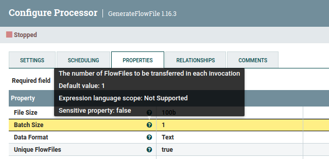
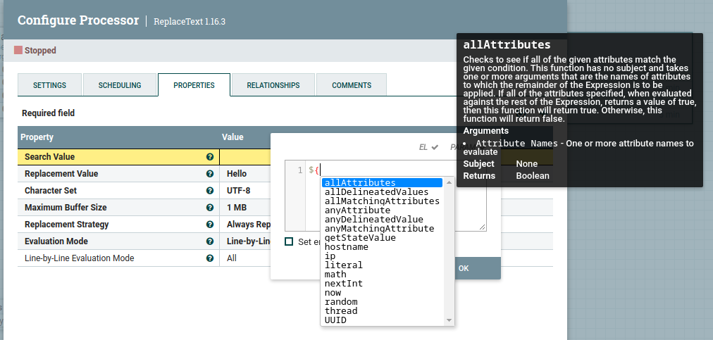

 NiFi Expression Language

---

## Introduction

* A flowfile consists of two main sections
  * The data or content of the file
  * The meta-data or attributes of the flowfile
* Attributes are key-value pairs
  * For example: file name or directory path of the file
* The expression languages allows users to:
  * Reference the attributes
  * Manipulate attribute values
  * Compare attribute values to other values

---

## Structure of a NiFi Expression

* Expressions are always enclosed in the delimiters ${ and }
* The most basic form of an expression is just an attribute name. 
* For example, the expression below will return the value of the filename attribute.
  
```bash
    ${filename}
```
* This value can be manipulated with various functions.
* For example, the file name can be converted to uppercase like this:

```bash
    ${filename:toUpper()}
```
* In this example, the ":" is the function call delimiter.

---

## Escaping Special Characters

* Multiple function calls can be chained together
```bash
    ${filename:toUpper():equals('README.MD')}
```
* There is no limit to the number of function calls that can be chained together
* Any flowfile attribute can be referenced but if the name contains any special characters like '$*{})()...' (including whitespace) then it has to be escaped by using single or double quotes

```bash
    ${'my attribute'}
    ${"value$$7"}
```
---

## Expression Language Hierarchy

* NiFi locates a specific property using the following process:
  1. Search FlowFile for attribute/key
  2. Search Process Group Variables for attribute/key
  3. Search File Registry file for attribute/key
  4. Search NiFi JVM Properties for attribute/key
  5. Search System Environment Variables for attribute/key

* NiFi will search for, and return, the first occurrence of a matching property. 
* If no matching property is found, null is returned.

---

## Expression Language in the Application



* Expressions are often usd for configuring Processor properties. 
  * Not all Processor properties support the Expressions 
* When configuring a component property, the UI provides an Information icon next to the name of the Property. Hovering over this icon with the mouse will provide a tooltip that provides helpful information about the Property. 
  

---

## Expression Language Editor

* When configuring the value of a Processor property, UI provides help with the Expression Language using the Expression Language editor
* Once an Expression is begin by typing ${, the editor begins to highlight parentheses and braces so that the user is easily able to tell which opening parenthesis or brace matches which closing parenthesis or brace.
* The editor also supplies context-sensitive help by providing a list of all functions that can be used at the current cursor position. 
* To activate this feature, press Ctrl+Space on the keyboard. 
* The user is also able to type part of a function name and then press Ctrl+Space to see all functions that can be used that start with the same prefix. 

---

## Expression Language Editor



---

## Functions

* Each function takes zero or more arguments and returns a single value. 
* These functions can then be chained together to create powerful Expressions to evaluate conditions and manipulate values. 
* Data types:  Each argument to a function and each value returned from a function has a specific data type. 
* The Expression Language supports five different data types:
  * String: A sequence of numbers, letters, white space, and special characters.
  * Number: A integer number comprised of one or more digits (0 through 9). 
  * Decimal: A double-precision 64-bit IEEE 754 floating point number
  * Date: A Date is an object that holds a Date and Time. 
  * Boolean: Onene of either true or false.
   
---

## Subjectless Functions

* Some functions do not need a subject (ie. refer to an attribute)
* These are function calls that return general information
  
```bash
    ${hostname()}
```

* These can also be chained

```bash
    ${hostname():toUpper():equals('MYHOST')}
```
* Whitespace is ignored between delimiters so the following are equivalent
  
```bash
    ${hostname():toUpper():equals('MYHOST')}
    ${hostname() : toUpper() : equals('MYHOST')}
```
---

## Subjectless Functions

* _ip_ Returns the IP address of the machine as a string
* _hostname_ Returns the Hostname of the machine as a string
* _UUID_ Returns a randomly generated type 4 UUID.
  
```bash
     ${ip():equals('192.168.1.123')} 
     ${hostname():equals('zorgo')} 
     ${UUID()} -> produces output like: "de305d54-75b4-431b-adb2-eb6b9e546013"
```
* _literal_ Returns its argument as a literal String value.
* _nextInt_ Returns a one-up value (starting at 0) and increasing over the lifetime of the running instance of NiFi. 
  * This value is not persisted across restarts and is not guaranteed to be unique across a cluster.

```bash
    ${literal(2):gt(1)}  returns a true
    if the previous value of nextInt was 6 then
    ${nextInt()} gives the value 7 
```
* Other subjectless functions are thread and getStateValue.
  
---

## Type Coercion  

* After evaluating expression language functions, all attributes are stored as type String.
* The Expression Language is generally able to automatically coerce a value of one data type to the appropriate data type for a function. 
* Type coercion operators can be used to force coercion
* _toString_ converts the subject into a string
* _toNumber_ converts the subject into a number
* _toDecimal_ converts the subject into a decimal number

```bash
    ${fileSize:toNumber():toString()} converts the value of "fileSize" attribute 
                                      to a number and back to a String.
    ${fileSize:toDecimal()} converts the attribute value of "fileSize" to a decimal.
```
---

## Boolean Logic

* Used to compare an attribute value against some other value. 
  * Often used to configure how a Processor should route data. 
* _isNull_  returns true if the subject is null, false otherwise. This is typically used to determine if an attribute exists. "notNull" is the converse
  
```bash
    ${filename:isNull()}    returns true if the "filename" attribute does not exist
                            returns false if the attribute exists.
    {filename:notNull()}    returns true if the "filename" attribute exists. 
```
* _isEmpty_ returns true if the Subject is null, does not contain any characters or contains only white-space (new line, carriage return, space, tab), false otherwise

```bash
    ${literal(" "):isEmpty()} returns true
    ${literal(""):isEmpty()}  also returns true
```
* _equals_ determines if its subject is equal to another String value. _equalsIgnoreCase_ ignores case

```bash
    ${filename:equals('hello.txt')}   true if filename is 'hello.txt'
    ${filename:equalsIgnoreCase('hello.txt')} also true if filename is 'HELLO.txt'
```
---

