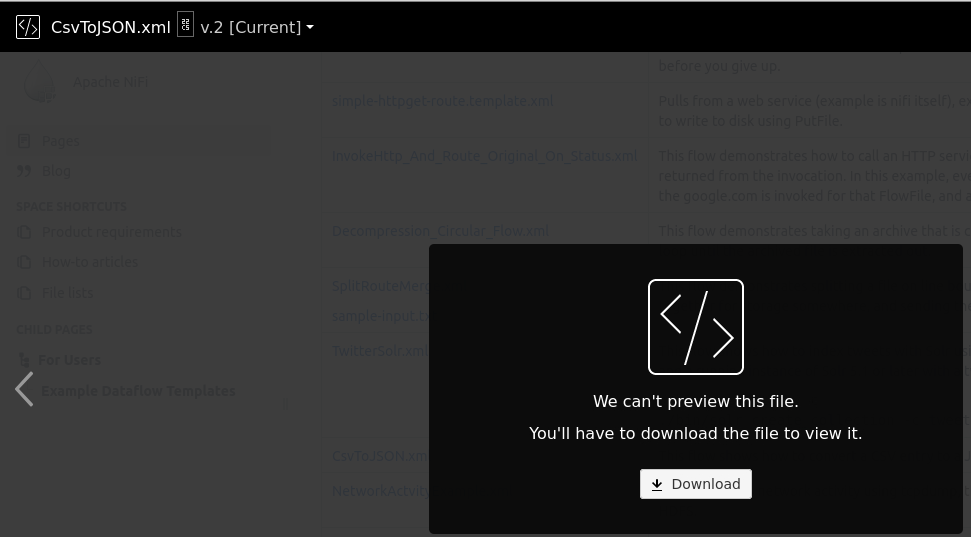
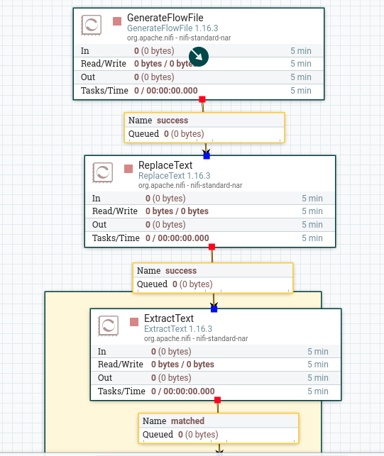
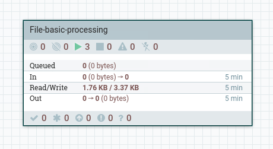

# Apache NiFi

---

## Course objectives

* Getting Started
  - Downloading and Installing NiFi
  - Create first data flow – basic concepts

* NiFi in details
  - Concept of Processors / Connections / Flow Files 
  - NiFi templates, data provenance, monitoring and other NiFi features

* Advanced NiFi
  - Tuning of Processors and Connections
  - Writing custom processors
  - NiFi architecture

---

## Introduction to Apache NiFi

* **“Apache NiFi supports powerful and scalable directed graphs of data routing, transformation, and system mediation logic.”**

---

## Introduction to Apache NiFi

* Automate the flow of data between systems 
  - E.g.: JSON -> Database, FTP-> Hadoop, Kafka -> ElasticSearch, etc…
* Drag and drop interface
* Focus on configuration of processors (i.e. what matters only to the user)
* Scalable across a cluster of machines
* Guaranteed Delivery / No Data Loss 
* Data Buffering / Back Pressure / Prioritization Queuing / Latency vs Throughput

---

## Apache NiFi use cases:

* What Apache NiFi is good at:
  - Reliable and secure transfer of data between systems
  - Delivery of data from sources to analytic platforms
  - Enrichment and preparation of data:
    - Conversion between formats
    - Extraction/Parsing
    - Routing decisions

* What Apache NiFi shouldn’t be used for:
  - Distributed Computation
  - Complex Event processing
  - Joins, rolling windows, aggregates operations

---

## Concept: FlowFile

* It’s basically the data
* Comprised of two elements:
  - Content: the data itself
  - Attributes: Key value pairs associated with the data (creation date, etc.…)

* Gets persisted to disk after creation

---

## Concept: Processor

* Applies a set of transformations and rules to FlowFiles, to generate new FlowFiles
* Any processor can process any FlowFile
* Processors are passing FlowFile references to each other to advance the data processing
* They are all running in parallel (different threads)

 <!-- {"left" : 0.44, "top" : 4.63, "height" : 1.51, "width" : 9.38} -->

---

## Concept: Connector

* It’s basically a queue of all the FlowFiles that are yet to be processed by Processor 2
* Defines rules about how FlowFiles are prioritized (which ones first, which ones not at all)
* Can define backpressure to avoid overflow in the system

 <!-- {"left" : 0.77, "top" : 4.19, "height" : 2.88, "width" : 9.09} -->

---

## NiFi basics: FlowFile, Processor, Connector

<!-- {"left" : 0.28, "top" : 2.43, "height" : 3.51, "width" : 9.68} -->

---

## NiFi: Processors

---

## Summary so far
* Getting Started
  - Downloading and Installing NiFi
  - Create first data flow – basic concepts
  - We created our basic flow
  - We added a processor
  - We added a connector
  - We added a connection
  - We picked up a file, generated more data, etc.

---

## Lab: Create your own processor
* Demo
* Create a processor lab

---

## Bundled and open source processors

* There is no official category for bundled processors
* But we are running a workshop to spark your creativity
* As we go, let us think of use cases for the processors

---

## DataTransformers 

* ReplaceText
  * Change a string of text to another string of text
  * US->USA
* JoltTransformText
  * JSON doc -> JSON doc
  
---

## Routing and mediation
Route on different things
if in my flowfile I have USA - goes to one processor, if I have Germany - goes to another processor

## Execute SQL
execute SQL on the database

---

## Attribute extraction
country field in your json
which country?
chain with routes on attributes

---

## System interaction
* Execute process
* Python process

---

## Data Ingestion

* GetFile
* GetFTP 
* GetHTTP 
* GetHDFS 
* ListenUDP 
* GetKafka…

---

## Sending Data: 
* PutFile, 
* PutFTP, 
* PutKafka, 
* PutEmail…
  * Your would have to create an email service for this

---

## Splitting and Aggregation
* SplitText,
  * 100 rows of text -> 100 FlowFiles
* SplitJson, 
  * Split JSON files into multiple FlowFiles
* SplitXml, 
* MergeContent…
  * For example, write a lot of content to disk

## HTTP 
* GetHTTP, 
* ListenHTTP, 
* PostHTTP
  * Microservice that receives HTTP requests 

---

## Summary of Categorization of processors

* Over 309 bundled processors
  - Data Transformation: ReplaceText, JoltTransformJSON…
  - Routing and Mediation: RouteOnAttribute, RouteOnContent, ControlRate…
  - Database Access: ExecuteSQL, ConvertJSONToSQL, PutSQL...
  - Attribute Extraction: EvaluateJsonPath, ExtractText, UpdateAttribute…
  - System Interaction: ExecuteProcess …
  - Data Ingestion: GetFile, GetFTP, GetHTTP, GetHDFS, ListenUDP, GetKafka…
  - Sending Data: PutFile, PutFTP, PutKafka, PutEmail…
  - Splitting and Aggregation: SplitText, SplitJson, SplitXml, MergeContent…
  - HTTP: GetHTTP, ListenHTTP, PostHTTP…
  - AWS: FetchS3Object, PutS3Object, PutSNS, GetSQS
  
---

## Lab
* Break up in teams
* Create a use case
* Implement the use case in NiFi
* Present the use case to the teams

---

## So far...
* We created our basic flow
  - We added a processor
  - We added a connector
  - We added a connection
  - We picked up a file, generated more data, etc.
  - But really, generating data easily is a problem
    - We need to be able to generate data in a way that is easy to understand and use

---

## Generate data lab

---

## NiFi: Templates

* Templates are a way to export your NiFi flow to other computers and to your colleagues
* They are also a way to try other people's work
* Here's how you get to Templates
  * Go to top right corner of the screen
  * Click on the three bars
  
---

## Template menu

---

## Fresh install - no templates

---

## Find some templates

---

## CVS to JSON template

---

## Upload template

---
## Here is the template

---

## Let us use the template: select it

---

## Let us use the template: use it

---

## Lab - import template

* Let us import the template
* First, the CVS to JSON template
* Now, let us go through this template and analyze it
* Then, import a template of your choice and present its analysis

---

## Process groups

---

## Drag process group

---

## Use the SHIFT key

---

## Note number of components

---

## NiFi: FlowFile Topology

* A FlowFile has two components
  - Attributes:
    - These are the metadata from the FlowFile 
    - Contain information about the content: e.g. when was it created, where is it from, what data does it represent?
  - Content:
    - That’s the actual content of the FlowFile. e.g. it’s the actual content of a file you would read using GetFile

  - A processor can (either or both):
    - Update, add, or remove attributes
    - Change content

