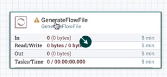

# Apache NiFi + Kafka

---

## NiFi + Kafka


---

## Generate some data



---

## Prepare to log the data


---

## Publish the data to Kafka


---
## Prepare to consume the data


---

## Publish generated data to Kafka


---

## Consume the data from Kafka


---

## Setup data generator


---

## Generate unique FlowFiles


---

## Setup Kafka producer


---

## Topic name


---

## Delivery guarantee


---
## Still need to set relationships


---

## Success and failure


---

## Create topic

```shell
kafka-topics --create --topic nifi-topic --zookeeper localhost:2181 --partitions 3 --replication-factor 1
```

```text
topic: nifi-topic created
```

---

## Start the flow


---

## Consumer in Kafka


---

## Log attributes - terminate after writing 


---

## Kafka is shown as a label


---

## Configure Kafka consumer


---

## It is working!


---
## Rev it up


---

## 1000 messages per second


---

## That's it, folks


---


