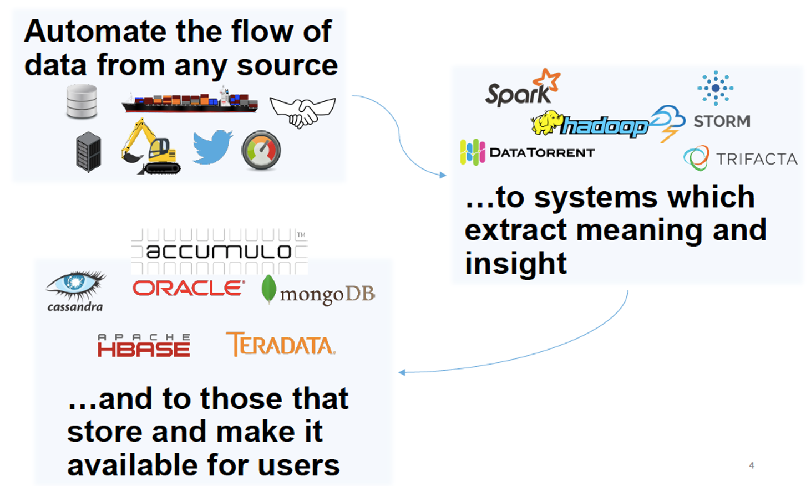
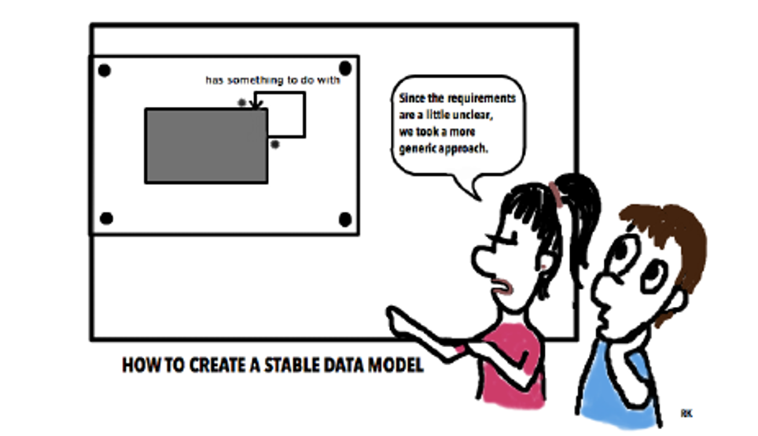
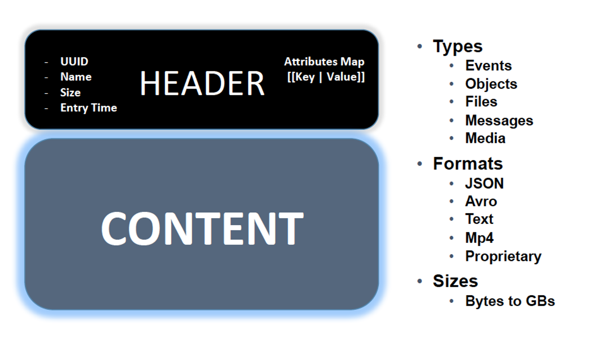
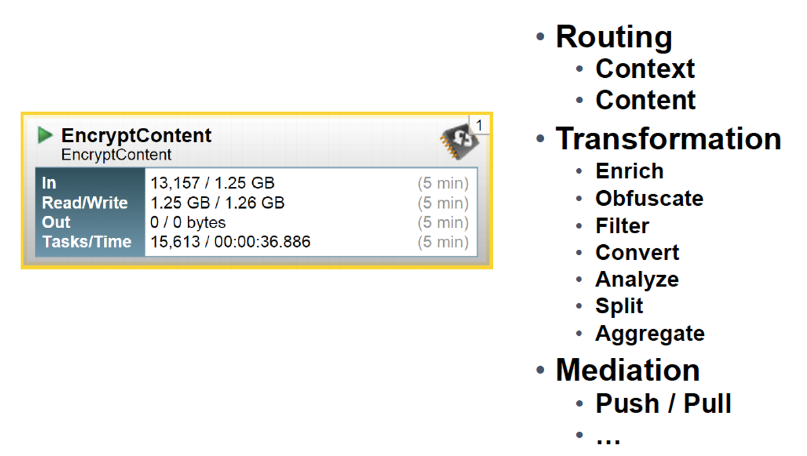
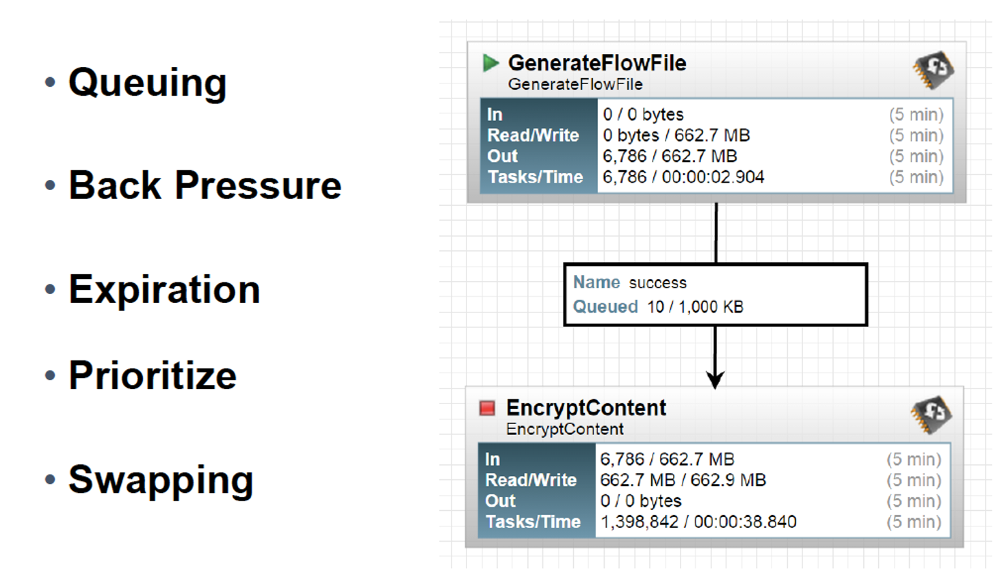
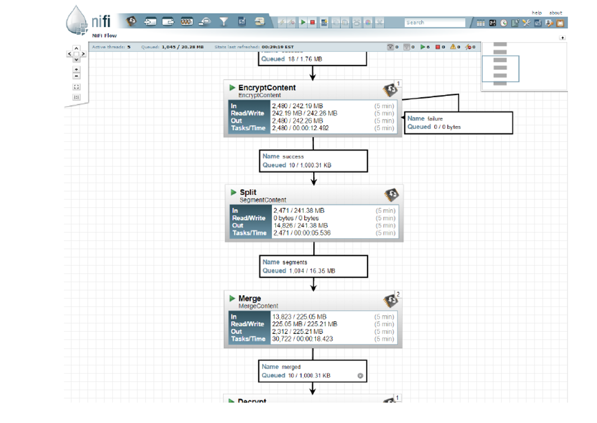
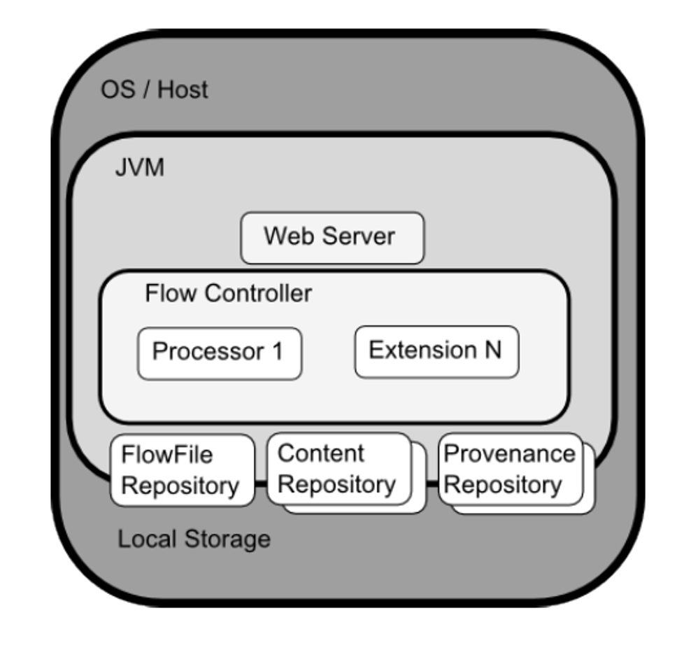
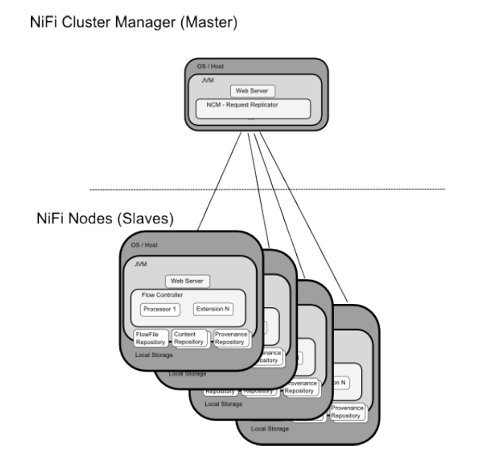
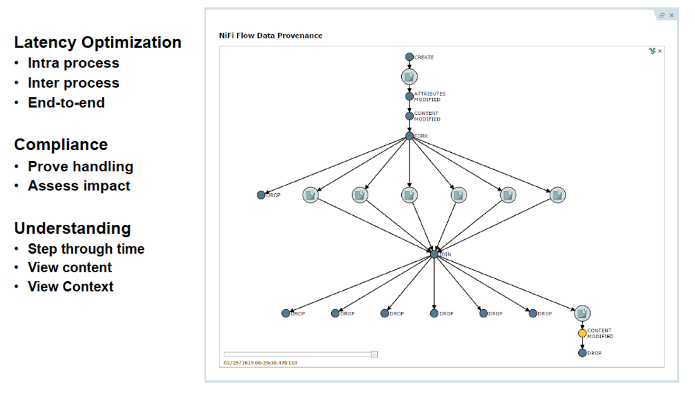

# NiFi Overview

---

## Lesson Objectives

* Understand NiFi motivation
* Relate NiFi’s use cases to one’s own projects
* Plan for NiFi implementation 

---

# Motivation

Notes:

---

## NiFi at a Glance

 <!-- {"left" : 0.44, "top" : 2, "height" : 5.64, "width" : 9.38} -->

Notes:

---

## NiFi Trivia

 <!-- {"left" : 6.92, "top" : 1.24, "height" : 3.1, "width" : 3.17} -->

* Originally developed by the NSA
* Donated to Apache in November 2014
* Continued by Onyara
* Now part of Hortonworks
* NiFi = Niagara Files

Notes:

---

## NiFi Use Cases

* Remote sensor delivery
* Inter-site / global distribution
* Intra-site distribution
* Big Data ingest
* Data Processing (enrichment, filtering, sanitization)

Notes:

---

## Challenges that NiFi Designers Faced

* Transport / Messaging was not enough
* Needed to understand the big picture
* Needed the ability to make *immediate* changes
* Must maintain chain of custody for data
* Rigorous security and compliance requirements

 <!-- {"left" : 1.89, "top" : 4.48, "height" : 3.71, "width" : 6.46} -->

Notes:

---

## Why Transport and Messaging Insufficient

* Data access exceeded resources to transport
* Decoupling systems is about more than the connectivity
* Message sizes ranged from B to GB
* Not all data is created equal
* Needed precise security controls
  - SSL and topic level authorization insufficient

Notes:

---

## NiFi Foundations

 <!-- {"left" : 7.48, "top" : 1.32, "height" : 3.31, "width" : 2.45} -->

* Since enterprises started using software 
* And had to exchange data between systems
* There appeared a need for dataflow managing
* NiFi automates the flow of data between systems
* Many of NiFi ideas date back to this book (2003)

* ”Better Analytics Demands Better Workflow”	
   - Joe Witt (original CTO of NiFi/Onyara)

Notes:

---

## Problems NiFi Solves

* Failures
  - Networks fail
  - Hardware fails
  - Software fails
  - And people make mistakes

* ”Prepare for failure and then nothing fails” – Amazon mantra

Notes:

---
## Other Problems that NiFi Solves

* Data access exceeds capacity to consume
* Boundary conditions are mere suggestions
* Data is dirty
* What is noise one day becomes signal the next
* Priorities of an organization change
* Systems evolve at different rates
* Compliance and security

Notes:

---

# Concepts

---

## NiFi Concepts

 <!-- {"left" : 7.21, "top" : 1.24, "height" : 3.6, "width" : 2.87} -->

* The basic building blocks
* Real-time Command and Control
* The Power of Provenance

Notes:

---

## Flow File

 <!-- {"left" : 0.7, "top" : 2.24, "height" : 5.17, "width" : 8.85} -->

Notes:

---

## Flow File Processor

 <!-- {"left" : 0.6, "top" : 1.98, "height" : 5.12, "width" : 9.05} -->

Notes:

---
## Connections

 <!-- {"left" : 0.43, "top" : 2.08, "height" : 5.48, "width" : 9.39} -->

Notes:

---
## Flow Controller

 <!-- {"left" : 0.62, "top" : 1.82, "height" : 6, "width" : 8.46} -->

Notes:

---

## NiFi Architecture

 <!-- {"left" : 1.9, "top" : 1.73, "height" : 6.19, "width" : 6.45} -->

Notes:

---

## NiFi Clustering Model

 <!-- {"left" : 1.5, "top" : 1.33, "height" : 6.98, "width" : 7.26} -->

Notes:

---

# Benefits

---
## Real Time Command and Control

* Tighten the feedback loop
  - Changes have consequences (good or bad)
  - And you see them as they occur
* Continuous Improvement
  - Compare real-time vs. historical statistics
  - View data provenance
  - View Content at any stage
* Intuitive user experience
  - Visual programming
  - Logical flow graph

Notes:

---

##  The Power of Provenance – Chain of custody

 <!-- {"left" : 0.4, "top" : 2.13, "height" : 5.39, "width" : 9.45} -->

Notes:

---
# Performance
---
## Why is NiFi Fast?

* Flow File Repo
* Write Ahead Log
* Content Repo
* Add more partitions
* Input/Output Streams
* Copy on Write
* Pass by Reference
* Allow tradeoffs of latency vs throughput

Notes:

---

## Review Questions

