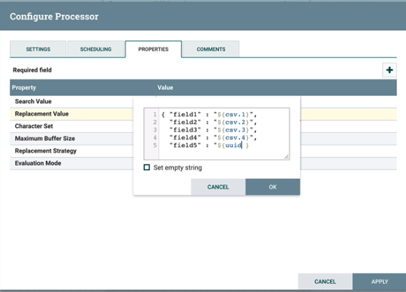
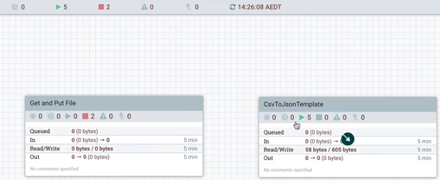
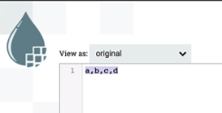
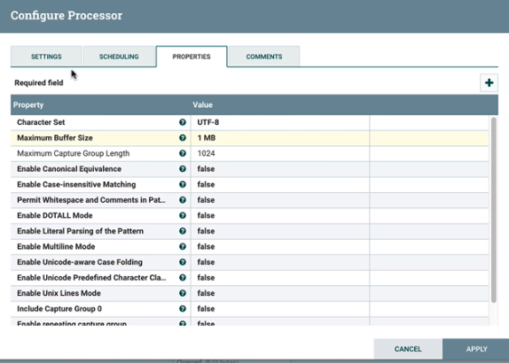

# Apache NiFi in Depth

---

## NiFi: Templates

* Templates are a way to export your NiFi flow to other computers and to your colleagues
* They are also a way to try other people's work
* Here's how you get to Templates
  * Go to top right corner of the screen
  * Click on the three bars

---

## Template menu


---

## Fresh install - no templates


---

## Find some templates


---

## CVS to JSON template


---

## Upload template


---
## Here is the template


---

## Let us use the template: select it


---

## Let us use the template: use it


---

## Lab - import template

* Let us import the template
* First, the CVS to JSON template
* Now, let us go through this template and analyze it
* Then, import a template of your choice and present its analysis

---

## Process groups


---

## Drag process group


---

## Use the SHIFT key


---

## Note number of components


---
## Cleaner look using process groups


---

## Lab - process groups
* Process groups and template exports
* Please do the following lab
* https://github.com/elephantscale/NiFi-labs/blob/main/lab_04.md

---

## FlowFile Review

* We have processors
* They get connected
* Going deeper - FlowFile has two components
  * Attributes (Metadata)
    * Create date
    * Name
    * What does the data represent, etc.
  * Content
    * `myfile.txt`
    * Actual data, perhaps binary content
* So, this is similar to a file on the computer. But - it is a **Flow**File

---

## Processor

* Processor is working with the FlowFile
  * Update, add, or remove attributes (working on attributes)
  * Change content (working on content)
* This so far is theory
* Now, let's go and see how it works in practice

---

## Let's go back to our FlowFile


## Process Group

* Our Process Group is made of five processors
* Let's analyze the processors from the top to the bottom
* The first processor is a **GenerateFlowFile**
* Let us analyze the GenerateFlowFile processor
* Let us go through the properties tabs
* And let us start it
* Right click, investigate the menus

## Go through the five processors
* The first processor enhances the content but does not change the attributes
* The second processor is a **ReplaceText**
* Look at the last line


---

## Here is our RegEx expression


---

## RegEx in detail

```shell
(.+),(.+),(.+),(.+)
a,b,c,d
```

## Here are changed attributes


* We have added csv.1, csv.2, csv.3, csv.4

---

## Use attributes with the expression language


---

## Replace text processor


---

## Creating JSON


---
## Forming JSON


---

## View the content


---

## First use of Expression Language

* We will be talking about the Expression Language
* It is much more than this simple example


---

## We will use the Expression Language
* To create attribute
* To manipulate content
* Let us quickly look at some examples

---

## One more example



---

## One more property


---

## And the new property was generated


---

## Lab - Expression Language

* Follow the steps in the slides above

---

## Monitoring NiFI

* Here is the basic monitoring



---

## Each processor has its own stats


---

## Let's analyze the stats


---

## Change the size


---

## Status history


---

## Stats for your queue


* Queue should not be too big
* Queue should not be too small
* Consider the back pressure

---

## Monitor summary


---

## Summary display


---

## Process groups stats


---


## System diagnostics


---

## 5-min stats


---

## Data Provenance

* We can list what is the connector
* 


---

## Data Provenance

* For that, we click on "List Queue"


---

## Queue

* Let's look at the queue


---

## View detail

* Click on the Information button
* View the details


---

## FlowFile attribute

* Chose the tab "Attributes"
* View the details


---

## Now, let's look at ReplaceText

* Right-click on ReplaceText
* Click on Configure


---

## It will take anything 

* And replace it with `a, b, c, d`


---

## Now, let's run it
* We will see that the attributes did not change
* But the content is replaced with `a, b, c, d`



---

## Let's analyze ExtractText


---

## Data Provenance and Event Search

* As above, data goes from step to step
* But something does not work and you need to debug it
* You can see the event connections
* This is called data provenance


---

## Click on Data provenance


---

## Show lineage


---

## Here's lineage


---

## Slider on the bottom left


---

## Processor relationships

* ExtractText is not guaranteed to work
* The CSV may be broken
* You need to be able to handle errors


---

## Configuration of ExtractText



---

## Matched and unmatched


---


## Add a processor for non-matched


---

## Routing processor


---

## Three routes


---

## Quiz
* How can I export a subset of my flow as a template?
  * A. By selecting many of them while pressing shift and clicking on the export button
  * B. By selecting a process group, entering it, and then exporting the content of the group as a template
  * C. By clicking on the export button and then choosing which processors to export

Notes:

* B is the best practice

---

## Quiz

* Processors can change both Attributes and Content of FlowFiles at the same time
  * A. True
  * B. False

Notes:

* A
---

## Quiz

* You can reference the attribute `my_attribute` using the following Expression Language expression:
  * `%my_attribute`
  * `${my_attribute}`
  * `attributes[my_attribute]`

Notes

* B.

---

---
