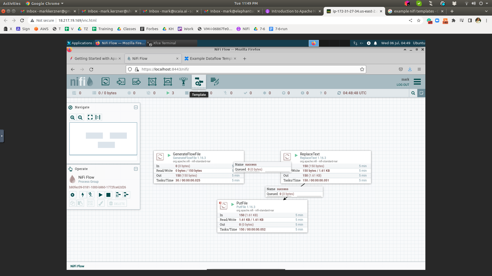

# Apache NiFi in Depth

---

## NiFi: Templates

* Templates are a way to export your NiFi flow to other computers and to your colleagues
* They are also a way to try other people's work
* Here's how you get to Templates
  * Go to top right corner of the screen
  * Click on the three bars

---

## Template menu

---

## Fresh install - no templates

---

## Find some templates

---

## CVS to JSON template

---

## Upload template

---
## Here is the template

---

## Let us use the template: select it

---

## Let us use the template: use it

---

## Lab - import template

* Let us import the template
* First, the CVS to JSON template
* Now, let us go through this template and analyze it
* Then, import a template of your choice and present its analysis

---

## Process groups

---

## Drag process group

---

## Use the SHIFT key

---

## Note number of components

---
## Cleaner look using process groups

---

## Lab - process groups
* Process groups and template exports
* Please do the following lab
* https://github.com/elephantscale/NiFi-labs/blob/main/lab_04.md

---

## FlowFile Review

* We have processors
* They get connected
* Going deeper - FlowFile has two components
  * Attributes (Metadata)
    * Create date
    * Name
    * What does the data represent, etc.
  * Content
    * `myfile.txt`
    * Actual data, perhaps binary content
* So, this is similar to a file on the computer. But - it is a **Flow**File

---

## Processor

* Processor is working with the FlowFile
  * Update, add, or remove attributes (working on attributes)
  * Change content (working on content)
* This so far is theory
* Now, let's go and see how it works in practice

---

