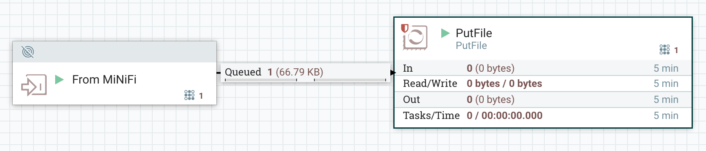

# Mini NiFi - MiNiFi

---

## MiNiFi


* A subproject of Apache NiFi to collect data where it originates. 
  * Complementary data collection approach
  * Supplements the core tenets of NiFi in dataflow management
  * Focusing on the collection of data at the source of its creation. 
  
---

## Setting Up

* Assume MiNiFi is installed -- similar process to installing NiFi and assumes NiFi is installed
* Requires setting up a configuration file (config.yaml)  - most common scenario is
  * Use NiFi's web interface to define a flow
  * Save the flow as a template and download its XML file
  * Use the Converter Toolkit to convert the template XML to an equivalent config.yml
  * Put the config.yml file in $MINIFI_HOME/conf and start the agent.

---

## Configure NiFi to Accept Data

* The other end of the flow is NiFi and it has to be configured to handle data from MiNiFi on an input socket
* In the nifi.conf file:

```text
    # Site to Site properties
    nifi.remote.input.host=
    nifi.remote.input.secure=false
    nifi.remote.input.socket.port=1026
    nifi.remote.input.http.enabled=true
    nifi.remote.input.http.transaction.ttl=30 sec
```
* After restart NiFI and add a MiNiFi port.


---

## Create the Flow

* From the port on the previous slide, Now create a template, download it as an XML file, and download it.
* Use the converter toolkit to create a yaml file
  
```bash
[user@host minifi-toolkit-0.0.1]# ./bin/config.sh transform /path/to/template.xml /output/path/config.yml
```
* Open the config.yml file and add Port and Host to a Properties section at the end of the Input Ports section (at the end of the file):

```yaml
Remote Processing Groups:
- name: http://localhost:8080/nifi
  url: http://localhost:8080/nifi
  comment: ''
  timeout: 30 sec
  yield period: 10 sec
  Input Ports:
  - id: AUTOGENERATED_NIFI_PORT_ID_HERE
    name: MiNiFi-input
    comment: ''
    max concurrent tasks: 1
    use compression: false
    Properties:    
        Port: 1026      
        Host Name: localhost
```

---

## Create the Flow

* Copy the generated config.yml file into $MINIFI/conf/config.yml, and start MiNiFi and after a few seconds, NiFi should be receiving data on the input port:
  



---

## IoT Architecture


* *Edge:* sensors collect information on the digital world and send them to a gateway through a variety of wired and wireless protocols (Serial, RS-485, MODBUS, CAN bus, OPC UA, BLE, WiFi, and so on). 
* *Gateway:* is a device (Raspberry Pi for example) running a MiNiFi agent.
* *MiNiF:* subscribes to topics on different brokers then and forwards every new message to NiFi at the Regional level. 
* *NiFi:* consolidates multiple MiNiFi data sources and routes it to various systems and applications.


Notes

image credit: https://www.freecodecamp.org/news/building-an-iiot-system-using-apache-nifi-mqtt-and-raspberry-pi-ce1d6ed565bc/

---
