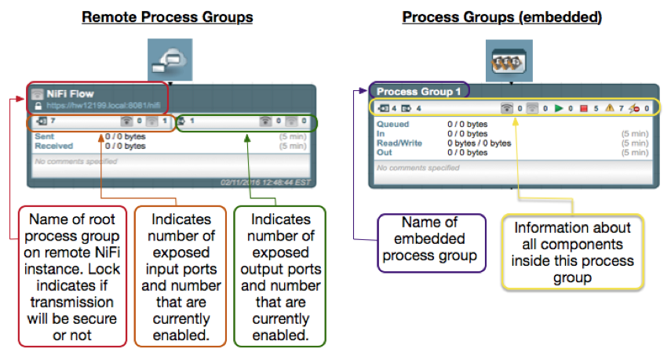
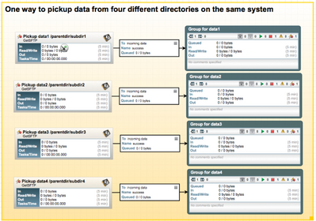
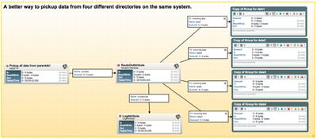
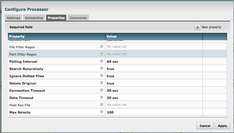
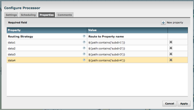
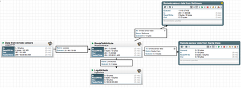
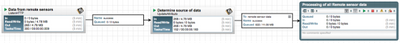

# Dataflow Optimization

---

## Configuration Best Practices

* NiFi dataflow optimization rests on a foundation of a well configured NiFi installation.
* Linux is not well tuned to run NiFi "out of the box"
* The following Linux configuration changes are suggested - these are generic
* _Maximum File Handles_
  * NiFi will at any one time potentially have a very large number of file handles open
  * Increase the limits by editing /etc/security/limits.conf to add something like
```bash
    *  hard  nofile  50000
    *  soft  nofile  50000
```
---

## Configuration Best Practices

* _Maximum Forked Processes_
  * NiFi may be configured to generate a significant number of threads
  * To increase the allowable number, edit /etc/security/limits.conf
```bash
    *  hard  nproc  10000
    *  soft  nproc  10000
```
* You may need to edit /etc/security/limits.d/90-nproc.conf by adding
```bash
    *  soft  nproc  10000
```
* _Increase the number of TCP socket ports available_
  * Important if your flow will be setting up and tearing down a large number of sockets in a small period of time.
```bash
    sudo sysctl -w net.ipv4.ip_local_port_range="10000 65000"
```

---

## Configuration Best Practices

* _Set how long sockets stay in a TIMED_WAIT state when closed_
  * Sockets should not sit and linger too long given that NiFi needs toquickly setup and teardown new sockets. 
```bash
    // for kernel 2.6
    sudo sysctl -w net.ipv4.netfilter.ip_conntrack_tcp_timeout_time_wait="1"

    //for kernel 3.0
    sudo sysctl -w net.netfilter.nf_conntrack_tcp_timeout_time_wait="1"
```
* _NiFi should never swap_
  * Swapping hinders NiFi performance
  * Add the following line to /etc/sysctl.conf
  
```bash
    vm.swappiness = 0
```

* For the partitions handling the various NiFi repos, turn off things like atime.
  * Edit the /etc/fstab file and for the partition(s) of interest, add the noatime option.
  
---
 ## Recommended Antivirus Exclusions

* Antivirus software can take a long time to scan large directories and files.
  * If the  AV software locks files or directories during a scan
  * then those resources are unavailable to NiFi processes, causing latency or unavailability of these resources in a NiFi instance/cluster. 
  * Configure your antivirus software to skip scans on the following NiFi directories:
    * content_repository
    * flowfile_repository
    * logs
    * provenance_repository
    * state
---

## What is Dataflow Optimization?

* Optimization isn’t an exact science
* It's a balance between
    * system resources (memory, network, disk space, disk speed and CPU), 
    * the number of files and size of those files, 
    * the types of processors used, 
    * the size of dataflow that has been designed, 
    * and the underlying configuration of NiFi on the system. 
* However, there are some general guidelines that can be followed

---

## Group Common Functionality 



* Group repeated operations into a Process Group. 
  * Optimizes flow by removing redundant operations
  * Pass the data through the group and then continue through the flow
* When repeating the same process in multiple places on the graph, try to put the functionality into a single group.

notes:

image credit; https://community.cloudera.com/t5/Community-Articles/NiFi-Understanding-how-to-use-Process-Groups-and-Remote/ta-p/245486

---

## Use Fewer Processors



* Use the fewest number of processors possible to accomplish the task.  
  * Many NiFi processors support batch processing per thread. 
  * With multiple processors working on smaller subsets of a large dataset you are not taking advantage of the batch processing capability. 
  * For example 
    * 4 GetSFTP processors each pulling from separate directories, with the same parent directory, with 20 files will use 4 threads. (above)
  

notes:

image credit: https://community.cloudera.com/t5/Community-Articles/NiFi-HDF-Dataflow-Optimization-Part-1-of-2/ta-p/245102

---

## Use Fewer Processors



* However, 1 GetSFTP processor will get a listing, from the parent directory, for all files in those sub directories and then pull them all under 1 thread.


notes:

image credit: https://community.cloudera.com/t5/Community-Articles/NiFi-HDF-Dataflow-Optimization-Part-1-of-2/ta-p/245102

---

## Use Fewer Processors



* In this case with a single GetSFTP processor, make sure the property Search Recursively is set to true

notes:

image credit: https://community.cloudera.com/t5/Community-Articles/NiFi-HDF-Dataflow-Optimization-Part-1-of-2/ta-p/245102

---

## Use Fewer Processors



* Configuration of RouteOnAttribute processor being used to separate data pulled by one GetSFTP processor from four different directories using the standard flow file attribute ${path}: 

notes:

image credit: https://community.cloudera.com/t5/Community-Articles/NiFi-HDF-Dataflow-Optimization-Part-1-of-2/ta-p/245102

---

## Use Fewer Processors



* If data were being pushed to NiFi, a similar way to identify the data would be utilizing a user-supplied attribute. 
* This method would work for data coming in from any type of processor that receives data in the flow. 
* In the example above, the data is coming in via a ListenHTTP processor from another NiFi instance with a user added ${remote-sensor} attribute. The receiving NiFi uses that attribute to make a routing decision. 

notes:

image credit: https://community.cloudera.com/t5/Community-Articles/NiFi-HDF-Dataflow-Optimization-Part-1-of-2/ta-p/245102

---

## Use Fewer Processors



* In addition, you can tag data that is already combined using an UpdateAttribute processor so it can be managed through a shared downstream data path that will make use of batch processing. 
* Using a very similar example, say the data is coming in from multiple sensor sources without the user-supplied tag already added. How would NiFi identify the data? In the flow figure above NiFi can use the attribute restlistener.remote.user.dn to identify the source of the data and add the appropriate tag
notes:

image credit: https://community.cloudera.com/t5/Community-Articles/NiFi-HDF-Dataflow-Optimization-Part-1-of-2/ta-p/245102

---