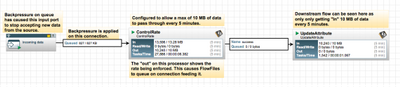
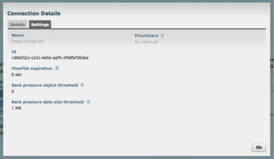
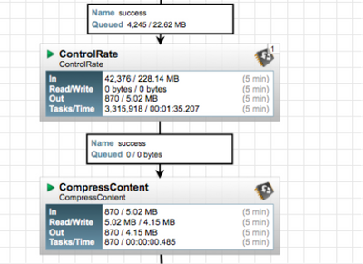
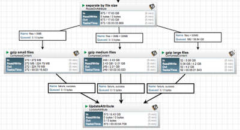
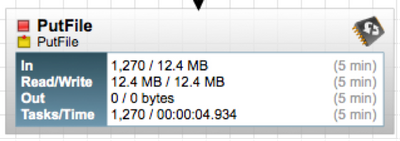

# Dataflow Optimization

---

## Configuration Best Practices

* NiFi dataflow optimization rests on a foundation of a well configured NiFi installation.
* Linux is not well tuned to run NiFi "out of the box"
* The following Linux configuration changes are suggested - these are generic
* _Maximum File Handles_
  * NiFi will at any one time potentially have a very large number of file handles open
  * Increase the limits by editing /etc/security/limits.conf to add something like
```bash
    *  hard  nofile  50000
    *  soft  nofile  50000
```
---

## Configuration Best Practices

* _Maximum Forked Processes_
  * NiFi may be configured to generate a significant number of threads
  * To increase the allowable number, edit /etc/security/limits.conf
```bash
    *  hard  nproc  10000
    *  soft  nproc  10000
```
* You may need to edit /etc/security/limits.d/90-nproc.conf by adding
```bash
    *  soft  nproc  10000
```
* _Increase the number of TCP socket ports available_
  * Important if your flow will be setting up and tearing down a large number of sockets in a small period of time.
```bash
    sudo sysctl -w net.ipv4.ip_local_port_range="10000 65000"
```

---

## Configuration Best Practices

* _Set how long sockets stay in a TIMED_WAIT state when closed_
  * Sockets should not sit and linger too long given that NiFi needs toquickly setup and teardown new sockets. 
```bash
    // for kernel 2.6
    sudo sysctl -w net.ipv4.netfilter.ip_conntrack_tcp_timeout_time_wait="1"

    //for kernel 3.0
    sudo sysctl -w net.netfilter.nf_conntrack_tcp_timeout_time_wait="1"
```
* _NiFi should never swap_
  * Swapping hinders NiFi performance
  * Add the following line to /etc/sysctl.conf
  
```bash
    vm.swappiness = 0
```

* For the partitions handling the various NiFi repos, turn off things like atime.
  * Edit the /etc/fstab file and for the partition(s) of interest, add the noatime option.
  
---
 ## Recommended Antivirus Exclusions

* Antivirus software can take a long time to scan large directories and files.
  * If the  AV software locks files or directories during a scan
  * then those resources are unavailable to NiFi processes, causing latency or unavailability of these resources in a NiFi instance/cluster. 
  * Configure your antivirus software to skip scans on the following NiFi directories:
    * content_repository
    * flowfile_repository
    * logs
    * provenance_repository
    * state
---

## What is Dataflow Optimization?

* Optimization isn’t an exact science
* It's a balance between
    * system resources (memory, network, disk space, disk speed and CPU), 
    * the number of files and size of those files, 
    * the types of processors used, 
    * the size of dataflow that has been designed, 
    * and the underlying configuration of NiFi on the system. 
* However, there are some general guidelines that can be followed

---

## Group Common Functionality 


* Group repeated operations into a Process Group. 
  * Optimizes flow by removing redundant operations
  * Pass the data through the group and then continue through the flow
* When repeating the same process in multiple places on the graph, try to put the functionality into a single group.

notes:

image credit; https://community.cloudera.com/t5/Community-Articles/NiFi-Understanding-how-to-use-Process-Groups-and-Remote/ta-p/245486

---

## Use Fewer Processors


* Use the fewest number of processors possible to accomplish the task.  
  * Many NiFi processors support batch processing per thread. 
  * With multiple processors working on smaller subsets of a large dataset you are not taking advantage of the batch processing capability. 
  * For example 
    * 4 GetSFTP processors each pulling from separate directories, with the same parent directory, with 20 files will use 4 threads. (above)
  

notes:

image credit: https://community.cloudera.com/t5/Community-Articles/NiFi-HDF-Dataflow-Optimization-Part-1-of-2/ta-p/245102

---

## Use Fewer Processors


* However, 1 GetSFTP processor will get a listing, from the parent directory, for all files in those sub directories and then pull them all under 1 thread.


notes:

image credit: https://community.cloudera.com/t5/Community-Articles/NiFi-HDF-Dataflow-Optimization-Part-1-of-2/ta-p/245102

---

## Use Fewer Processors


* In this case with a single GetSFTP processor, make sure the property Search Recursively is set to true

notes:

image credit: https://community.cloudera.com/t5/Community-Articles/NiFi-HDF-Dataflow-Optimization-Part-1-of-2/ta-p/245102

---

## Use Fewer Processors


* Configuration of RouteOnAttribute processor being used to separate data pulled by one GetSFTP processor from four different directories using the standard flow file attribute ${path}: 

notes:

image credit: https://community.cloudera.com/t5/Community-Articles/NiFi-HDF-Dataflow-Optimization-Part-1-of-2/ta-p/245102

---

## Use Fewer Processors


* If data were being pushed to NiFi, a similar way to identify the data would be utilizing a user-supplied attribute. 
* This method would work for data coming in from any type of processor that receives data in the flow. 
* In the example above, the data is coming in via a ListenHTTP processor from another NiFi instance with a user added ${remote-sensor} attribute. The receiving NiFi uses that attribute to make a routing decision. 

notes:

image credit: https://community.cloudera.com/t5/Community-Articles/NiFi-HDF-Dataflow-Optimization-Part-1-of-2/ta-p/245102

---

## Use Fewer Processors


* In addition, you can tag data that is already combined using an UpdateAttribute processor so it can be managed through a shared downstream data path that will make use of batch processing. 
* Using a very similar example, say the data is coming in from multiple sensor sources without the user-supplied tag already added. How would NiFi identify the data? In the flow figure above NiFi can use the attribute restlistener.remote.user.dn to identify the source of the data and add the appropriate tag
notes:

image credit: https://community.cloudera.com/t5/Community-Articles/NiFi-HDF-Dataflow-Optimization-Part-1-of-2/ta-p/245102

---

## Overwhelming the System

* Preventing the dataflows from overwhelming the underlying system
  * This impacts NiFi software stability and/or performance. 
  * Unconstrained, it may produce a severe performance hit. 
  * Likely if dataflows are unbounded and the content repo fills 100%

* Example:
  * 50MB content_repository partition 
  * Data normally is delivered via an input port in groups of 10MB
  * System goes down and comes back online with a backlog of 75MB
* Once the content_repository filled, the input port would start generating errors when trying to write the files it was receiving. 
* Disks where the content_repository resided would be trying write new files while at the same time NiFi would be trying to access the disk to deal with the current flowfiles. 
  
---

## Using Backpressure


* Backpressure can be configured based on number of objects and/or the size of the flowfiles in the connection.

* Using backpressure would be one way to prevent this scenario, as in this example


notes:

image credit: https://community.cloudera.com/t5/Community-Articles/NiFi-HDF-Dataflow-Optimization-Part-2-of-2/ta-p/245113

---

## Using Backpressure

* Backpressure is set in the connection from the input port to the ControlRate processor:
  


* If the backlog of data reaches 1 MB, the input port would not be able to receive data until the backlog dropped below the threshold, then incoming data from the source system would resume
* This configuration allows NiFi to receive the backlog of data at a rate that won't over utilize the system resources. 
* Adding the ControlRate processor to the flow will ensure that the backlog of data will not overwhelm any processors further down the flow path. 
* This method of combining backpressure with the ControlRate processor is easier than trying to set backpressure in every connection through the complete flow path.

---

## Using ControlRate Processors

* A ControlRate processor prevents another processor from becoming overwhelmed and/or overwhelming the overall flow. 
  * For example, the DFM is only able to allocate one concurrent task to the CompressContent processor
  * If the queue becomes too large, that one concurrent task would only be able to scan the queue to determine which flowfile should be compressed next.
  *bIt would spend all of its time looking at its queue and never actually compressing any flow files. 
  Using the above example of the CompressContent processor on the next slide, using a ControlRate processor to prevent the processor from becoming overwhelmed.

---

## Using ControlRate Processors



* The example is using the added filesize attribute to control the rate of data.


---

## Understanding Used Resources

* Understand the resources needed by each processor to fir allow better dataflow performance. 



* The CompressContent processor will use 1 CPU/concurrent task, so if this processor has 4 concurrent tasks and there are four files in the queue, then 4 CPUs will be utilized by this processor until the files have been compressed.
  * For small files this becomes less of a resource bottleneck than dealing with large files. 
  * Have small, medium and large files all go down a separate flow paths into 3 different CompressContent processors, each with their own number of concurrent tasks. 
  * In the example above, all three CompressContent processors have one concurrent task. 

---

## Understanding Used Resources




* Areas to optimize on:
  * In: The amount of data that the Processor has pulled from the queues of its incoming Connections based on a sliding 5-minute window.
  * Read/Write: The total size of the FlowFile content that the Processor has read from disk and written to disk.
  * Out: The amount of data that the Processor has transferred to its outbound Connections. 
  * Tasks/Time: Reflects the number of tasks that completed their run in the last 5 minutes and the reported total amount of time those tasks took to complete

---

