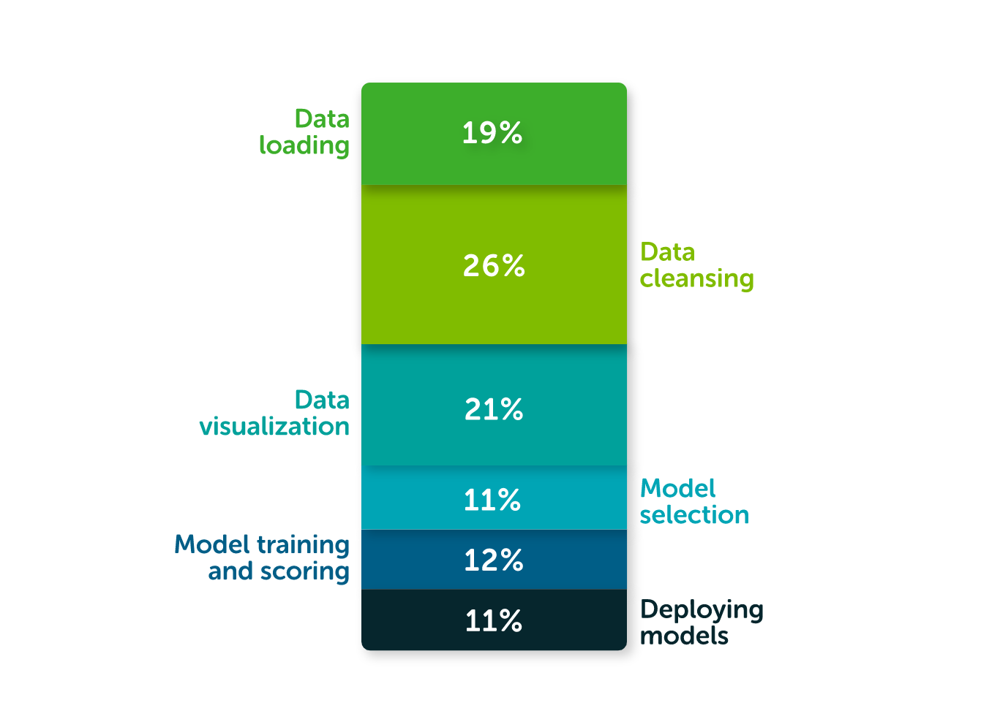

# Data Wrangling

---

## Data Wrangling

 <!-- {"left" : 9.43, "top" : 1.89, "height" : 5.66, "width" : 7.87} -->

* Data scientists spend significant amount of time doing **data wrangling**

* In [Anaconda 2020 survey](https://www.anaconda.com/state-of-data-science-2020) data wrangling takes up up to 45% of time

* This can include cleaning up data, transforming data into a format that can be used by ML algorithms

---

## Data Cleaning

<!-- {"left" : 11.11, "top" : 1.89, "height" : 4.71, "width" : 6.09} -->

* Real world data is hardly in a format for analytics

* We need to do fair amount of cleaning of data before we can analyze it

* This is **not very interesting** part of DA, still very important 😄

* Let's look at some of the techniques for data cleansing in the next lab

---

## Missing Values

* Here is an example of missing data.  How can we fix it?

<br>

| id | age | height_cm |
|----|-----|-----------|
| 1  | 20  | 160       |
| 2  | 15  | 150       |
| 3  | 15  |           |
| 4  | 16  | 180       |
| 5  | 15  | 145       |

* Answer: Next slide

---

## Dealing with Missing Values

* Drop all null values
    - Easiest option
    - But will result in data loss
    - E.g. raw = 10,000 , NULL data = 2000 --> clean data = 8000, 20% data loss

* Be careful about dropping null values.  Some columns can be optional / NULL.
    - E.g. customer data 'twitter' column, that is mostly null.  You may not want to drop a row b/c of this column is null

* Fill in a 'default' value (mean, median, mode)
    - Discuss the difference between mean and median :-)
    - "Height"  (numeric) = mean or median
    - "Hair_color" = black / blonde / grey / silver  (substitute MODE)

---

## Outliers

* What are outliers?
    - Values outside the 'norm'
    - For example some one who is 7ft tall would be an outlier in an elementary school 😄

* How do we detect outliers?
    - Compare mean and median
    - Boxplot 
    - IQR (q3 - q1) or   1.5 * IQR

* How to deal with them?
    - Drop the outliers (drop lowest 5% and top 5% and only consider 90% in the middle)
    - Substitute with another values

---

## Duplicates

* How to detect?
    - Identical rows (column values are identical)
    - Primary keys (e.g. customer_id)

* How do deal with dupes?
    - Drop them

* Here we have dupe records (id=101)

<br>

| id  | name | email          |
|-----|------|----------------|
| 101 | John | john@gmail.com |
| 102 | Jane | jane@gmail.com |
| 101 | John | john@gmail.com |

---

## Incorrect data (Misspellings ...etc)

* Some examples below
    - Do you see any data issues?

* How do we detect these?
    - Analyze column values
    - `distinct(col1)`

* How do we deal with these?
    - Cleanup before analyzing

<br>

|   | state          | country |
|---|----------------|---------|
|   | CA             | US      |
|   | california     | USA     |
|   | WA             | America |
|   | Washington D.C | US      |

---

## Dealing with Dates and Timestamps

* Date formats can be region dependent
    - Question: What is this date ?   **2/3/2022**
    - USA:  MM/DD/YYYY,  EU:  DD/MM/YYYY
    - 2/3/2022 -> US (Feb 03, 2022),  rest (02 March, 2022)
    - Best practice: Always be explicitly : **Aug 01, 2022**
* Timestamps can be tricky to deal with too, with different timezones
    - Always store timestamps in ONE timezone;  UTC is the most common
    - Best practice 1: Store date in ISO format:
        - Pacific Timezone:  **`2023-03-04T22:18:37-08:00`** (see the TZ diff at the end -8 hrs behind UTC)
        - UTC:  **`2023-03-04T22:18:37Z`**  (See the Z at the end)
* Best practice 2: **Unix time**
    - 1/1/1970 : zero unix time also known as **EPOCH**
    - Timestamp can be stored as time elapsed since EPOCH
    - 2020-01-01:00:00:00  is 1577836800 seconds in epoch time
    - https://www.epochconverter.com/ can do conversion between human time <-> unix time

---

## Wrong Type of Data

* Expecting integer or timestamp but got a string?

* How to detect this?
    - `df.info()`
    - `df.dtypes`

* How to convert types?

```python
# create a new column
df['col1_int'] = df['col1'].astype(int)

# overwrite the same column
df['col1'] = df['col1'].astype(int)

# infer date format
df['col2_datetime'] =  pd.to_datetime(df['col2'], infer_datetime_format=True)

# or specify date format
df['col2_datetime'] =  pd.to_datetime(df['col2'], format='%d%b%Y:%H:%M:%S.%f')
```

---

## Lab: Data Cleanup

<!-- {"left" : 6.76, "top" : 0.88, "height" : 4.37, "width" : 3.28} -->

* **Overview:**
    - Cleaning up data

* **Approximate Time:**
    - 30 mins

* **Instructions:**
    - **data-cleanup-1**

Notes:

---