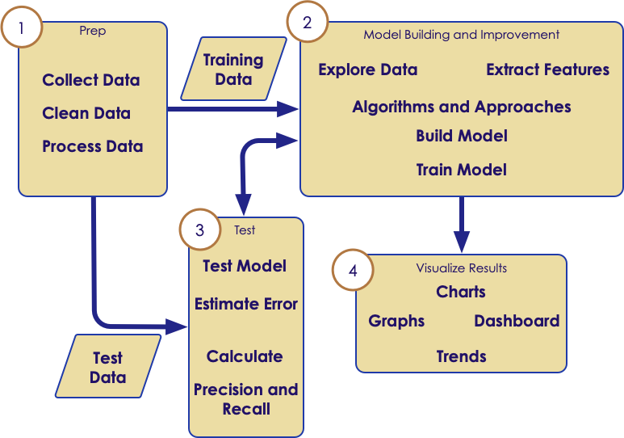

# Data Science Intro
---

## Data Science Intro

<!-- {"left" : 0.25, "top" : 1.45, "height" : 6.17, "width" : 9.74} -->

Notes:

---

## What Is Data Science?

  * “Data-driven application development”

  * A new breed of discipline fueled by

    - Big data  (we have lot more data these days)
    - Lot of intelligence can be mined from this data
    - Technology revolutions like Hadoop & NoSQL that enabled Big Data processing possible

  * Involves multiple disciplines

    - Computer Science
    - Statistics etc.

  * “More data usually beats better algorithms”

    - Anand Rajaraman (Walmart Labs)

  * New hot thing!

Notes:

---

## DDD Example: LinkedIn’s People You May Know

  * Question for class

  * How will you implement this?

  * First version is pretty simple (email matching)

  * ‘finds’

    - Profiles with photos get more clicks
    - ‘you both know this person’ removes creepy factor

<!-- {"left" : 2.56, "top" : 4.32, "height" : 3.96, "width" : 5.14} -->

Notes:

---

## Data Scientist

<!-- {"left" : 0.25, "top" : 1.78, "height" : 6.17, "width" : 9.74} -->

Notes:

---

## Data Scientist

  * “A data scientist is a business analyst working in Silicon Valley.”

    - unknown on Twitter

  * Data Scientist must have a firm grasp on computer science

    - Algorithms & data structures
    - Multiple languages (R, Python, Java, ...)
    - Multiple toolsets & libraries
    - Big Data tools like Hadoop, Spark, ...
    - Machine learning ...

  * Must have solid understanding of

    - Statistics, probabilities, modeling, charts

  * And most importantly must have domain knowledge (banking, healthcare ...)

Notes:

---

## Data Scientist vs. Computer Scientist

| Computer Scientist                                                                 | Data Scientist                                                              |
|------------------------------------------------------------------------------------|-----------------------------------------------------------------------------|
| **Differences:**                                                                   |                                                                             |
| Product-Driven Development                                                         | Data-Driven Development                                                     |
| Usually doesn't care about data                                                    | All About Data                                                              |
| Can work with limited domain experience (e.g., designing a loan processing system) | Need Deep Domain Experience (e.g. doing risk analysis of loan applications) |
|                                                                                    |                                                                             |
| **Similarities:**                                                                  |                                                                             |
| Both Know CS very well (data structures, multiple languages)                       |  &nbsp;                                                                     |

<!-- {"left" : 0.26, "top" : 1.19, "height" : 4.38, "width" : 9.75, "columnwidth" : [4.88, 4.88]} -->

Notes:

---

## Data Scientist vs. Business Analyst

| BusinessAnalyst                                                                 | Data Scientist                           |
|---------------------------------------------------------------------------------|----------------------------------------- |
| **Differences:**                                                                |                                          |
| Usually works with high-level tools (Business Intelligence (BI) tools,,Excel …) | Usually works with languages, packages … |
| Reports                                                                         | ‘Insights’                               |
| “Known Unknowns”                                                                | “UnknownUnknowns”                        |
|                                                                                 |                                          |
| **Similarities:**                                                               |                                          |
| Both have deep domain knowledge (banking etc.)                                  |                                          |
| Need to create good visualizations to narrate the story to others               |    &nbsp;                                |

<!-- {"left" : 0.26, "top" : 1.19, "height" : 5.07, "width" : 9.75, "columnwidth" : [4.88, 4.88]} -->

Notes:

---

## Data Scientists vs. Statisticians

| Statisticians                                      | Data Scientist                                            |
|----------------------------------------------------|-----------------------------------------------------------|
| **Differences:**                                   |                                                           |
| Not much software engineering                      | Lot of development work                                   |
| Use existing tools (Matlab, R, ...)                | Use and create tools that do not exist yet                |
| Usually analyze a ‘sample’ of data                 | Analyze all data using Big Data technologies (Hadoop etc.)|
|                                                    |                                                           |
| **Similarities:**                                  |                                                           |
| Have strong knowledge of stats, modeling techniques|     &nbsp;                                                |

<!-- {"left" : 0.26, "top" : 1.19, "height" : 4.88, "width" : 9.75, "columnwidth" : [4.88, 4.88]} -->

Notes:

---

## Reports vs. Insights

<!-- {"left" : 6.07, "top" : 1.22, "height" : 2.81, "width" : 3.89} -->

  * Reports  (“Known Unknowns”)
    - Weekly sales etc.

  * Insights (“Unknown Unknowns”)
    - Is there a relation between X & Y?

  * Insight example
    - Bill pay data & click stream data

Notes:

---

## So Here Is Data Scientist

<!-- {"left" : 1.03, "top" : 2.2, "height" : 4.67, "width" : 8.18} -->

Notes:

---

## Doing Data Science

  * Problem Definition
    - e.g., better ad targeting to improve click-through-rate

  * Identify appropriate data sources

    - e.g., impression data and social data

  * Collect data

  * Prepare data

    - ETL, Clean, Filter, Aggregate, etc.
    - Summary statistics and descriptive analytics

  * Build/Train/Test model

  * Show results

    - e.g., a dashboard
    - Or, a set of charts and graphs with query capability

Notes:

---

## Problem Definitions

  * This may not be as easy as it seems

  * Known Knowns
    - Daily web traffic

  * Known Unknowns
    - What are most popular pages?
    - Do big connectors matter in a social graph?

  * Unknown Unknowns
    - Is there a connection between ??? and ????

Notes:

---

## Collecting Data

  * Data Sources can be
    - External: government data, public data, ...
    - Internal: collected data (clickstream etc.)

  * External Data challenges
    - Compliance, security concerns, ...
    - How much can we get? API throttling.
    - Is the data in useable format?

  * May need to bring data from different systems and in usually in different formats.
    - Clicklogs are text files.
    - Customer data can be from a database.

Notes:

---

## Data Pipelines

  * Once the ‘one time’ analysis is successful, you may want to do analysis on new data routinely.

  * Need a data pipeline to
    - Gather data from multiple sources
    - Bring them in to a central place (Hadoop, NoSQL, ... ) where analysis can happen
    - Can handle failures in data flow
    - Setup governance policies (masking, expiration, ... )

Notes:

---

## Data Preparation / Cleaning

  * Problems with raw data sets
    - Non-usable format (say in Excel spreadsheet format)
    - Contains errors & wrong values
    - Missing values
    - Data is spread across multiple silos

  * Data scientists spend a lot of time cleaning and massaging raw data, to get them ready for analysis.

  * Crucial part of data science

  * Can consume a lot of time (50% - 80%  of the project!!!)

  * Least sexy

Notes:

---

## Understanding Data

<!-- {"left" : 6.15, "top" : 1.16, "height" : 2.67, "width" : 3.9} -->

  * Before doing ‘deep learning’ of data, understand the data.

  * Basic questions
    - Is there a pattern?
    - Are there lot of outliers?  (May skew analysis. Should we keep these or throw them away?)

  * **Visualizations** can help greatly!
    - Just do some quick & dirty graphs.

  * Identify ‘interesting segments’

  * Need to sample?  Or process entire data set?

Notes:

---

## Model Building

  * Don’t do this until you have a good understanding of data.(See previous section.)

  * Pick right modeling technique
    - Clustering
    - Classifications
    - Etc.

  * Pick the right model for data
    - Don’t get ‘hung up’ on one model.
    - Try a few to identify the best fitting model.
    - Experience counts!

Notes:

---

## Model Validation

  * Models need to be ‘verified’  / ‘validated.’

  * Split the data set into

    - Training set: build / train model
    - Test set: validate the model

  * Initially 70% training, 30% validation.

  * Tweak the dials to decrease training and increase validation.

  * Training set should represent data well enough.

<!-- {"left" : 2.38, "top" : 5.39, "height" : 2.41, "width" : 5.49} -->

Notes:

---

## Visualizations

  * How you tell the results

  * Very very important part!!

  * Good visualizations convey the point to the audience.

  * A good data scientist must learn good visualization techniques.

  * Standard graphs: line, bar, pie, ...

  * Modern visualizations

     - Heat maps
     - Animations (D3JS etc.)

Notes:

---

## Data Science Applications

  * Risk analysis

  * Predictive modeling
    - Stock market, home prices, ...

  * Recommendations
    - Movies, books, shopping, ...

  * Fraud detection
    - Credit card transactions, ...

  * Social media
    - Network effects, connections, recommendations, ...

Notes:

---

## Data Science Methodology: Iterative Learning Process

<!-- {"left" : 0.55, "top" : 1.84, "height" : 5.38, "width" : 9.14} -->

Notes:

---

## Data Analytics Tools

* Traditional tools have good traction.
    - Easy to use UI
    - Commercial support

* Open source is catching up pretty fast!
    - Very big eco system
    - New libraries
    - Almost free

<!-- {"left" : 5.22, "top" : 3.41, "height" : 2.82, "width" : 4.6} -->

Notes:

---

## Open Source Tools

|                                  | R                            | Python                                           | Java                                                                     |
|----------------------------------|------------------------------|--------------------------------------------------|--------------------------------------------------------------------------|
| Popularity                       | Academicroots,  very popular | Very popular for  generic and data  science work | Very popular  generalpurposelanguage,  decent data science  capabilities |
| Opensource  libraries / routines | huge                         | Pretty good                                      | average                                                                  |
| Specific Libraries               | all                          | Scikit, SciPy, NumPy, Panda                      | Weka                                                                     |
| Big Data  Integration            | YES (spark)                  | YES (spark)                                      | YES (spark)                                                              |

<!-- {"left" : 0.26, "top" : 1.22, "height" : 3.65, "width" : 9.75, "columnwidth" : [2.44, 2.44, 2.44, 2.44]} -->

Notes:

---

## Data Science:  The Future

  * “Data scientist: The hot new gig in tech”, Fortune, 2011

  * The internet of things

   - Sensors, sensors everywhere
   - Connected devices driving a deluge of data
   - Most of our current devices will get “smarter” thanks to data

  * Real-time machine learning

   - Able to process, analyze, and learn data in real-time
   - Amazing applications in robotics and automated expert systems (“Google car”)

  * Deep learning

    - Using biological systems to model learning
    - Human brain is a good example – holds tremendous promise

Notes:

---

## Recommended Resources

  * On-line course by Dr. Ng from Stanford University

  * Machine Learning for Hackers

   - Conway and White
   - Practical examples in R

  * Information Theory, Inference, and Learning Algorithms

    - David Mackay
    - Free downloadable PDF!
    - Great introduction to the learning theory

  * Pattern Recognition and Machine Learning

    - Bishop
    - More theoretical but good topical coverage

  * The elements of statistical learning

    - Hastie, Tibshirani, and Friedman

Notes:
