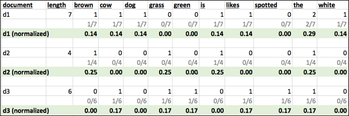
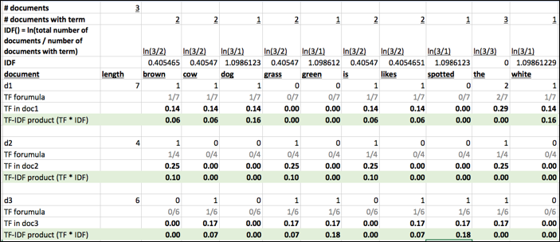

# PYTHON:Gensim
---
## Lesson Objectives

  * Learn about how to build Vectors

---

# Gensim Intro
---

## About Gensim

  * Gensim is an open-source Python package for topic modeling in Python

  * Open source

  * Great for modeling, machine learning, ad-hoc analytics


Notes:

---
# Vectorization
---

## Vectorization

  * Natural language needs to be converted into a vector

    - A vector is some number of dimensions with numeric values
    - Natural language typically has a large number of dimensions.

  * Vectors Are Numeric

Notes:

---
## TF-IDF

  * "Term Frequency, Inverse Document Frequency"

  * It is a way to score the importance of words (or "terms") in a document based on how frequently they appear across multiple documents

  * Basic algorithm

    - If a word appears frequently in a document, it's important.
      - Give the word a high score

    - But if a word appears in many documents, it's not a unique identifier.
      - Give the word a low score.

  * Common words like "the" and "for", which appear in many documents, will be scaled  down.

  * Words that appear frequently in a single document will be scaled up

Notes:

---
## Document Frequency

  * How many times a word occurs in a document

```python
Document 1 : the brown dog likes the white cow
Document 2 : the grass is brown
Document 3 : the spotted cow likes green grass
```
<!-- {"left" : 0.0, "top" : 1.66, "height" : 1.3, "width" : 10.25} -->


|      | brown| cow |dog  | grass |green |is  | likes |spotted |the  | white |
|---   |---   |---  |---  |---	  |---   |--- |---    |---     |---  |---    |
| d1(7)| 1    | 1   | 1   | 0 	  | 0    | 1  | 1     | 0      | 2   | 1     |
| d2(4)| 1    | 0   | 0   | 1 	  | 0    | 1  | 0     | 0      | 1   | 0     |
| d3(6)| 0    | 1   | 0   | 1 	  | 1    | 0  | 1     | 1      | 1   | 0     |

<!-- {"left" : 0.13, "top" : 3.17, "height" : 2.7, "width" : 9.99, "columnwidth" : [0.88, 1.03, 0.75, 0.75, 0.92, 0.92, 0.83, 1, 1.17, 0.83, 0.91]} -->

Notes:

---
## Term Frequency  (TF)

  * A term would appear more times in a lengthier document

  * To normalize, divide the term count by total number of words in document


```python
        Number of times term 't' appears in a document
TF(t) = ----------------------------------------------
        Total number of terms in the document
```
<!-- {"left" : 0.0, "top" : 2.62, "height" : 1.13, "width" : 10.25} -->


<!-- {"left" : 0.25, "top" : 4.19, "height" : 3.24, "width" : 9.75} -->

Notes:

Source : tf-idf.xls

---
## Inverse Document Frequency (IDF)

  * IDF measures how important a term is

  * When computing TF (previous slide), all terms are considered equally important

  * How ever terms like 'the'  and 'of' (stop words) may appear a lot of times, but have little importance.

  * We need to weigh down frequent terms, and scale up rare ones

  * We use logarithmic scale to get reasonable numbers
```python
                  total number of documents
                  IDF(t) = log_e (  ---------------------------------------  )
                  number of documents with term 't' in it
```
<!-- {"left" : 0.0, "top" : 4.72, "height" : 1.36, "width" : 10.25} -->


Notes:

---
## IDF Example


| 	                                  |                          |
|---	                                  |---	                     |
| Number of words in document 1           | 100                      |
| The word **'cat'** appears in document1 | 3 times                  |
| TF **(cat)** in document 1              | 3/100= 0.03              |
|                                         | 	                     |
| Total number of documents in corpus     | 1 million	             |
| Number of documents with **'cat'**      | 1000 	             |
| IDF **(cat)**                           | LN (1,000,000/1000)= 6.91|
| **TF-IDF (cat in document 1)**          | 0.03 * 6.91 = **0.21**   |

<!-- {"left" : 0.25, "top" : 1.15, "height" : 4.5, "width" : 9.75, "columnwidth" : [4.88, 4.88]} -->

Notes:

Source : http://www.tfidf.com/


---

## TF-IDF Example

```python              
Document 1 : the brown dog likes the white cow
Document 2 : the grass is brown
Document 3 : the spotted cow likes green grass
```
<!-- {"left" : 0.0, "top" : 1.35, "height" : 1.3, "width" : 10.25} -->


<!-- {"left" : 0.24, "top" : 3.08, "height" : 4.18, "width" : 9.74} -->


Notes:

---
## TF-IDF Example

```python              
Document 1 : the brown dog likes the white cow
Document 2 : the grass is brown
Document 3 : the spotted cow likes green grass
```
<!-- {"left" : 0.0, "top" : 1.25, "height" : 1.04, "width" : 8.44} -->


| term	 | d1   | d2   |d3   | Document rank |
|---     |---	|---   |---  |---	     |
| brown  | 0.06 | 0.10 | 0   | **d2,  d1**   |
| cow    | 0.06 | 0    | 0.07| **d3,  d1**   |
| dog    | 0.16 | 0    | 0   | **d1** 	     |
| grass  | 0 	| 0.10 | 0.07| **d2,  d3**   |  
| green  | 0 	| 0    | 0.18| **d3** 	     |
| is     | 0.06 | 0.10 | 0   | **d2** 	     |
| likes  | 0.06 | 0    | 0.07| **d3,  d1**   |  
| spotted| 0 	| 0    | 0.18| **d3** 	     |
| the    | 0 	| 0    | 0   | **All zero**  |  
| white  | 0.16 | 0    | 0   | **d1** 	     |  

<!-- {"left" : 0.26, "top" : 2.83, "height" : 5.5, "width" : 9.75, "columnwidth" : [1.95, 1.95, 1.95, 1.95, 1.95]} -->

Notes:

---

## Document Term Matrix (DTM)

  * DTM is a matrix - describes how terms appear in documents

  * Rows correspond to documents

  * Columns correspond to terms

  * It will be a **sparse** matrix (not all terms occur on all documents)

    - Libraries need to represent sparse matrix in memory-efficient manner


| Terms -> <- documents | brown    | dog   |black   | cat   |
|---	                  |---	     |---	   |---     |---	  |
| doc1                  | x        | x     |        |       |
| doc2                  |          | 	     | x      | x     |

<!-- {"left" : 0.51, "top" : 4.39, "height" : 1.5, "width" : 9.23, "columnwidth" : [3.03, 1.46, 1.58, 1.58, 1.58]} -->


Notes:

---
## Term Document Matrix (TDM)

* TDM is transposed DTM

* Rows correspond to terms

* Columns correspond to documents

| Documents -> <- Terms| doc1| doc2 | doc3  |
|---	               |---  |---   |---    |
| brown                | x   |      |       |
| dog                  | x   | 	    |       |
| black                |     | x    |       |
| cat                  |     | x    | &nbsp;|

<!-- {"left" : 0.94, "top" : 2.74, "height" : 2.5, "width" : 8.36, "columnwidth" : [2.99, 1.88, 1.74, 1.75]} -->

Notes:

---
## Latent Semantic Analysis (LSA)

  * Extension of DTM

  * A Means of reducing dimensions on DTM

  * Uses SVD on DTM in order to get a lower dimensional representation

Notes:

---

## Word2Vec and Doc2Vec

  * Word2Vec:

    - Came out of Google
    - A deep neural network that transforms NLP data into vectors.
    - Trained on large multi-petabyte training corpora
    - Takes each individual word as input – can lead to large numbers of dimensions for large documents.

  * Doc2Vec:

    - Word2Vec takes each individual word as input, Doc2Vec takes entire document as input.


Notes:

---

# Topic Modeling
---

## What's wrong with TF-IDF/ Word2Vec

  * Very high dimensionality (thousands – millions of dimensions!

  * Doesn't really look at the relationship between documents in corpus.

Notes:

---

## Topic Modeling

  * Unsupervised Machine Learning Method

  * Finding n-grams that give clusters of documents coherence.

  * What are the key terms / n-grams that identify a cluster of documents?

Notes:

