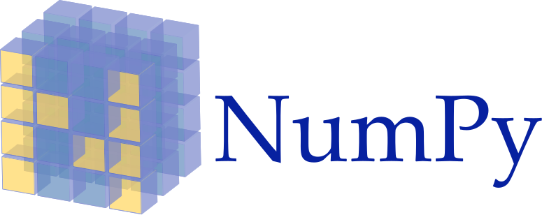

# PYTHON NumPy

  <!-- {"left" : 2.89, "top" : 6.48, "height" : 1, "width" : 2.49} -->


---

## Lesson Objectives

  * Introduction to NumPy and why its needed
  * Creating NumPy arrays
  * Multidimensional Arrays
  * Upcasting and Broadcasting
  * Indexing and Slicing
  * Advanced Array Operations
  * Matrices
  * Sparse Matrices

Notes:

---
# Introduction
---

## About NumPy and Python

<!-- {"left" : 7.45, "top" : 1.23, "height" : 1, "width" : 2.49} -->

  * Python is a rich language with ecosystem.

  * Open source

  * Rich package ecosystem (lots of libraries)

  * Great for modeling, machine learning, ad-hoc analytics

  * Used by scientists, now very popular among data scientists / analysts


Notes:

---

## Why NumPy

  * It adds support for large, multi-dimensional arrays and matrices

  * Fast

    - NumPy does numeric computation in native code
    - (Fast C++)

  * Full Featured

    - Has a large collection of high-level mathematical functions to operate on these arrays
    - Does many types of linear algebra functions
    - Matrix Manipulation

  * Helps Support More Advanced Analytics

    - Most advanced analytics are built on top of NumPy

  * NumPy website - http://www.numpy.org/

Notes:

---
## NumPy and SciPy

<!-- {"left" : 5.62, "top" : 2.78, "height" : 3.5, "width" : 4.6} -->

  * SciPy is a companion package to NumPy

    - Scientific computing
    - Built on top of NumPy

  * Some features:

    - Integrals, Differentiation
    - Linear Algebra
    - FFT

  * Basis of **MANY** other packages:

    - [Link](https://www.scipy.org/topical-software.html)

Notes:

    - https://www.scipy.org/topical-software.html


---

## Lists in Python

  * Python has a native type of sequence: the list.

    - Good for storing small data
    - Not good for multi-dimensional data.
    - Very slow ”at scale”

```python
# A Simple List
>>> a = [1,2,3,4]
>>> print(a[2:3]
[2,3]

# Concatenating Lists
>>> b = [5,6,7,8]
>>> a + b
[1, 2, 3, 4, 5, 6, 7, 8]
```
<!-- {"left" : 0, "top" : 3.22, "height" : 3.21, "width" : 5.58} -->

Notes:

---

# Arrays
---

## NumPy ndarray

  * NumPy Arrays are fast:

    - Native code (C++)
    - N-dimensional arrays

  * Homogeneously typed (usually numeric types: int64, float64, etc.)

  * NumPy needs to be imported
    - `import numpy as np`

  * Syntax to initialize a NumPy array and check its data type


```python
>>> a = np.array([1,2,3,4])
>>> a
array[1, 2, 3, 4]
>>> a.dtype
dtype(‘int64’)
```
<!-- {"left" : 0, "top" : 5.13, "height" : 1.79, "width" : 5.93} -->

Notes:

---

## Enter the Ndarray

* NumPy Arrays are fast:

- Native Code (C++)
- Fast vectorized operations.

* Homogeneously typed (usually numeric types: int64, float64, etc.)

Notes:

---

## An ndarray
 * Here is an example of how to create the array
 * The name of the class is `np.ndarray`)

```python
>>> a = np.array([1,2,3,4])
>>> a
array[1, 2, 3, 4]
>>> a.dtype # What is the type of a?
dtype(‘int64’)
```
<!-- {"left" : 0, "top" : 2.48, "height" : 2.27, "width" : 8.27} -->

Notes:

---

## Array Types

  * Arrays have types: (`np.int64`, `np.float64`, `np.complex` etc.)

  * Types can be inferred implicitly. For Example, NumPy infers the following as `np.int64`

```python
>>> a = np.array([1,2,3,4])
>>> a
array[1, 2, 3, 4]
>>> a.dtype
dtype(‘int64’)
```
<!-- {"left" : 0, "top" : 3.06, "height" : 2.45, "width" : 8.09} -->

---

## Array Types

  * Types can also be specified explicitly. For Example: NumPy may infer the following as  `np.int64`, but we explicitly set the data type to be `np.float64`

```python
>>> a = np.array([1,2,3,4], dtype=np.float64)
>>> a
array[1., 2., 3., 4.]
>>> a.dtype
dtype(‘float64’)
```
<!-- {"left" : 0, "top" : 2.76, "height" : 1.98, "width" : 10.22} -->

Notes:

---
## Creating Arrays - List to ndarray

  * We can convert plain Python list to ndarray:

    - Result will be possibly nested (if multi-dimensional)
    - Single dimensional ndarray (vectors) will be non-nested

```python
>>> a = [1, 2, 3, 4]
>>> a
[1, 2, 3, 4]

>>> a_array = np.array(a)
>>> a_array
array([1, 2, 3, 4])

>>> a_list = a_array.tolist()
>>> a_list
[1, 2, 3, 4]
```
<!-- {"left" : 0, "top" : 2.72, "height" : 3.62, "width" : 6.39} -->

Notes:

---

## Multi-Dim Arrays – shape, reshape, ndim


  * Arrays can be multidimensional

  * Example of a 2D array:

    - `<npArray>.reshape` – Reshapes array into desired dimensions
    - `<npArray>.shape` – Returns shape of the array
    - `<npArray>.ndim` – Returns rank or number of dimensions in array

```python
>>> a = np.arange(15).reshape(3,5)
>>> a
array[[ 0,  1,  2,  3,  4],
      [ 5,  6,  7,  8,  9],
      [10, 11, 12, 13, 14]]
>>> a.shape
(3,5)
>>> a.ndim
2
```
<!-- {"left" : 0, "top" : 4.5, "height" : 3.12, "width" : 7.57} -->

Notes:

---
## Creating Arrays

  * There are many ways to create arrays:

  * Convert from list:  `np.array(mylist)`

  * Pre-initialized with `np.zeroes` or `np.ones` – type `float64`


```python
>>> np.zeroes((2,3)) #float64 by default
array([[0., 0., 0.]
       [0., 0., 0.]]
>>> np.ones((2,3))
array([[1., 1., 1.]
       [1., 1., 1.]]
```
<!-- {"left" : 0, "top" : 2.58, "height" : 2.56, "width" : 10.25} -->

Notes:

---

## Creating Arrays

  * Range with np.arange

```python
>>> np.arange(10, 30, 5)
array([10,15,20,25])
```
<!-- {"left" : 0, "top" : 2.04, "height" : 0.98, "width" : 5.42} -->

<br/>

  * Linspace (n numbers from a to b)

```python
>>> np.linspace(0, 2, 9) 
array([0., 0.25, 0.5, 0.75, 1., 1.25, 1.5, 1.75, 2.])
```
<!-- {"left" : 0, "top" : 4.29, "height" : 0.81, "width" : 9.61} -->

Notes:

---

## Element-wise operations

  * Basic arithmetic (`+`,`-`,`*`, `/`, `//`, `**` ) is performed element-wise (on arrays)

```python
>>> a = np.array([1,2,3,4])
>>> b = np.array([5,6,7,8])
>>> print(a + b)
array([ 6,  8, 10, 12])
>>> print(a - b)
array([-4, -4, -4, -4])
>>> print(a * b)
array([ 5, 12, 21, 32])
>>> print(a / b)
array([0.2, 0.33333333, 0.42857143, 0.5])
>>> print(a // b)
array([ 0, 0, 0, 0])
>>> print(a ** b)
array([1, 64, 2187, 65536])
```
<!-- {"left" : 0, "top" : 2.21, "height" : 4.51, "width" : 8.65} -->

Notes:

---

## Upcasting

  * When mixing types on arrays, results are  always “Upcasted”

    - Upcasting order: int -> float -> complex


```python
>>> a = np.array([1,2,3,4])
>>> a
array([ 1,  2, 3, 4])
>>> a.dtype
dtype('int64')
>>> b = a * 2.5
>>> b
array([2.5, 5., 7.5, 10.])
>>> b.dtype
dtype(’float64')
>>> c = b * (2 + 3j)
>>> c
array([ 5. +7.5j, 10.+15.j , 15.+22.5j, 20.+30.j ])
>>> c.dtype
dtype(’complex128')
```
<!-- {"left" : 0, "top" : 2.15, "height" : 4.54, "width" : 9.94} -->

Notes:

---

## Broadcasting


  * What if arrays have different shapes? How do operations on these arrays work?

  * **Broadcasting** allows arrays to be extended for element-wise operation **in some cases**

  * Compatibility scenarios:

    - Arrays have exactly the same shape: perform element-wise operation (Example – a(3,5) * b(3,5))
    - Array operated on by scalar value: perform element-wise operation using scalar (Example – a(3,5) * 2.5)
    - Arrays with the same number of dimensions (like either 1D/2D/3D and so on) and the length of each dimension is either a common length or 1 (Example – a(3,5) * b(1,5))
    - Arrays with too few dimensions is broadcasted up (Example – a(3,5,2) * b(5) becomes a(3,5,2) * b(1,5))

Notes:

---

## Broadcasting Scenario 1

  * Arrays have exactly the same shape.
  * Perform Element-wise

```python
>>> a = np.array([1,2,3,4]).reshape(2,2)
>>> b = np.array([5,6,7,8]).reshpae(2,2)
>>> a
array([[1, 2],
       [3, 4]])
>>> b
array([[5, 6],
       [7, 8]])
>>> a + b
array([[ 6,  8],
       [10, 12]])
```
<!-- {"left" : 0, "top" : 2.23, "height" : 3.49, "width" : 7.44} -->

---

## Broadcasting Scenario 2:
  * Array times a scalar
  * Notice how scalar product is element-wise
```pycon
>>> a = np.arange(4).reshape(2,2)
>>> a
array([[0, 1],
       [2, 3]])
>>> a * 3.
array([[0., 3.],
       [6., 9.]])
>>>
```
<!-- {"left" : 0, "top" : 2.32, "height" : 2.61, "width" : 6.28} -->

---

## Broadcasting Scenario 3:

  * Matching in one dimension, 1 in other dimension

```pycon
>>> a = np.arange(9.).reshape(3,3)
>>> a
array([[0., 1., 2.],
       [3., 4., 5.],
       [6., 7., 8.]])
>>> b = np.arange(3).reshape(3,1)
>>> b
array([[0],
       [1],
       [2]])
>>> a + b
array([[ 0.,  1.,  2.],
       [ 4.,  5.,  6.],
       [ 8.,  9., 10.]])
```
<!-- {"left" : 0, "top" : 1.73, "height" : 4.36, "width" : 6.44} -->

---

## Broadcasting Scenario 4:

  * Example for broadcasting in 2D arrays


```python
>>> a = np.arange(15).reshape(3,5)
>>> a
array[[ 0,  1,  2,  3,  4],
      [ 5,  6,  7,  8,  9],
      [10, 11, 12, 13, 14]]
>>> b = 3 * np.arange(5, dtype = np.int64)
array([ 0,  3,  6,  9, 12])
>>> print(a * b)
array([[  0,   3,  12,  27,  48],
       [  0,  18,  42,  72, 108],
       [  0,  33,  72, 117, 168]])
```
<!-- {"left" : 0, "top" : 1.62, "height" : 3.76, "width" : 9.19} -->


Notes:

---

## Indexing

  * Single Dimensions can be indexed as follows:

```python
>>> a = np.array([1,2,3,4])
>>> a[1] # zero-based index
2
```
<!-- {"left" : 0, "top" : 1.87, "height" : 1.13, "width" : 5.59} -->

<br/>

  * Multiple Dimensions: use array[m,n] syntax

```python
>>> a = np.arange(15).reshape(3,5)
>>> a
array[[ 0,  1,  2,  3,  4],
      [ 5,  6,  7,  8,  9],
      [10, 11, 12, 13, 14]]
>>> a[1][0] # DON’T DO THIS!! -- Slow
5
>>> a[1,0] #  This is faster
5
```
<!-- {"left" : 0, "top" : 4.18, "height" : 2.81, "width" : 7.34} -->

Notes:

---

## Slicing

  * Syntax: `<npArray>[m : n : i]` – NumPy slices the array from index **“m”** to index **“n-1”** while incrementing the index by **“i”**


```python
>>> a = np.array([1,2,3,4,5])
>>> a[2:4]
array([3, 4])
>>> a[0:4:2] # incrementing index by 2
array([1, 3])
```
<!-- {"left" : 0, "top" : 2.7, "height" : 1.6, "width" : 7.11} -->

<br/>

  * Multi-dimensional array: (separate slices by commas)

```python
>>> a = np.arange(15).reshape(3,5)
>>> a
array([[ 0,  1,  2,  3,  4],
       [ 5,  6,  7,  8,  9],
       [10, 11, 12, 13, 14]])
>>> a[1:3, 1:3] # Row 1 to 2, Column 1 to 2
array([[ 6,  7],
       [11, 12]])
```
<!-- {"left" : 0, "top" : 5.06, "height" : 2.13, "width" : 7.11} -->

Notes:

---

# Advanced Array Operations
---

## Arrays

  * One-dimensional arrays

  * Holds ordered collection of objects

    - Objects all have to be of the SAME TYPE  (no mix-match)

  * Arrays are created using np.array() function

    - v1 = np.array([0,1,2,3,4,5])

  * Access elements from Array using indexes

    - Indexes start with 0: `v1[3] => 3`
    - `v1[np.array([1,3])]` =>  1,3
    - `v1[2:4]` => 2,3


Notes:

---

## NumPy Array Operations

  * Arrays can be operated on just like first class variables

```python
import numpy as np
v1 = np.array([1,2,3,4])
v2 = np.array([10,20,30,40])

v1 + v2
array[11, 22, 33, 44]

v2 - v1
array[9, 18, 27, 36]

v1 * 3
array[3,  6,  9, 12]
```
<!-- {"left" : 0, "top" : 1.76, "height" : 3.99, "width" : 6.3} -->

Notes:

---

## NumPy Array Operations


```python
x = np.array([1,2,3,4,5)

# Length: size of Array
length(x) => 5


# Statistics: min, max, avg, mean, median,
standard deviation, variance
np.mean(x) =>  3
np.median(x) => 3
np.std(x)  =>  1.58
np.var(x) => 2.5
```
<!-- {"left" : 0, "top" : 1.21, "height" : 3.92, "width" : 10.25} -->

Notes:

---
## Advanced Array Operations

  * NumPy calculates **max, min, mean, median, standard deviation** and **variance** by simple function calls


```python
>>> a = np.arange(-3, 7).reshape(2,5)
>>> a
array([[-3, -2, -1, 0, 1],
       [2, 3, 4, 5, 6]])
>>> print(str(np.min(a))+“ at pos ”+str(np.argmin(a)))
-3 at pos 0
>>> print(str(np.max(a))+“ at pos ”+str(np.argmax(a)))
6 at pos 9
>>> np.mean(a)
1.5
>>> np.median(a)
1.5
>>> np.std(a)
2.8722813232690143
>>> np.var(a)
8.25
```
<!-- {"left" : 0, "top" : 2.23, "height" : 4.5, "width" : 9.78} -->

Notes:

---
## NumPy Operations


```python
# Sorting
sort(np.array([1,3,5,4,2))
 1, 2, 3, 4, 5

# Reverse
np.array([1,3,5,4,2])[::-1]
2, 4, 5, 3, 1

# Adding Elements
v1 = np.array([1,2,3,4])
v3 = v1.append([5,6,7])
v3
[1, 2, 3, 4, 5, 6, 7]

# Removing elements
V3.delete[2:4]
[1, 5, 6, 7]
```
<!-- {"left" : 0, "top" : 1.33, "height" : 5.22, "width" : 5.79} -->

Notes:

---
## Advanced Array Operations

  * NumPy works with Python to **reverse** or **sort** elements by simple function calls

```python
>>> a = np.array([1,3,5,4,2])
>>> a
array([1, 3, 5, 4, 2])
>>> a = a[::-1]
>>> a
array([2, 4, 5, 3, 1])
>>> a.sort()
>>> a
array([1, 2, 3, 4, 5])
>>> a[::-1].sort()
array([5, 4, 3, 2, 1])
>>> sorted(a) # Note that sorted outputs a python list
[1, 2, 3, 4, 5]
>>> a = np.array(sorted(a, reverse = True))
array([5, 4, 3, 2, 1])
```
<!-- {"left" : 0, "top" : 2.2, "height" : 4.37, "width" : 10.09} -->

Notes:

---

## Advanced Array Operations

  * NumPy works with Python to **append** or **delete** elements by simple function calls


```python
>>> a = np.array([1,3,5,4,2])
>>> a
array([1, 3, 5, 4, 2])
>>> np.append(a, [7,9,0,6])
>>> a
array([1, 3, 5, 4, 2, 7, 9, 0, 6])
>>> a = np.delete(a, 2) # to remove element with index=2
>>> a
array([1, 3, 4, 2, 7, 9, 0, 6])
```
<!-- {"left" : 0, "top" : 2.14, "height" : 2.72, "width" : 10.25} -->

Notes:

---
## Advanced Array Operations - Filtering

  * Filtering is an important NumPy operation

  * **np.any()** and **np.all()** help in ’or’ and ‘and’ operations

  * It helps in selecting a portion or subset of the original array

```python
>>> a = np.array([1,3,5,-1,-4,4,2,-3,0])
>>> a < 0
array([False, False, False,  True,  True, False, False,  True, False])
>>> a[a < 0]
array([-1, -4, -3])
```
<!-- {"left" : 0, "top" : 2.73, "height" : 1.6, "width" : 10.25} -->

<br/>

  * Example: select only the negative odd number elements

```python
>>> np.all([a<0, a%2!=0], axis = 0)
array([False, False, False,  True, False, False, False,  True, False])
>>> a[np.all([a<0, a%2!=0], axis = 0)]
array([-1, -3])
```
<!-- {"left" : 0, "top" : 5.26, "height" : 1.51, "width" : 10.25} -->

Notes:

---

# Matrices
---

## Matrices

  * NumPy has a special `matrix` class which differs slightly from the array class
  * Matrices in NumPy are basically 2-D arrays (with one difference)
  * They contain elements of the SAME type.


```python
>>> a = np.matrix([1,2,3,4])
>>> a
matrix([[1, 2, 3, 4]])
>>> a = np.matrix([1,2,3,4,5,6]).reshape(2,3)
>>> a
matrix([[1, 2, 3],
        [4, 5, 6]])
```
<!-- {"left" : 0, "top" : 3.59, "height" : 2.55, "width" : 9.95} -->

Notes:

---

## Matrix Manipulation

  * NumPy can represent matrices 2 ways:

    - As 2-D ndarrays (**preferred for Python > 3.5**)

    - np.mat class (subclassed from ndarray) (Python 2.x)

  * Main difference is matrix multiply syntax: (`*` vs `@`)


```python
>>> # Arrays in Python > 3.5
>>> a = np.array([[4, 3], [2, 1]])
>>> b = np.array([[1, 2], [3,4]])
>>> print (a@b) # Matrix Multiply is ‘@’ in Python > 3.5
[[13 20]
 [ 5  8]]
```
<!-- {"left" : 0, "top" : 3.17, "height" : 1.86, "width" : 10.11} -->


```python
>>> # Matrices
>>> a = np.mat(‘4 3; 2 1’)
>>> b = np.mat(‘1 2; 3 4’)
>>> print (a*b) # Matrix Mutiply
[[13 20]
 [ 5  8]]
```
<!-- {"left" : 0, "top" : 5.33, "height" : 1.86, "width" : 6.11} -->

Notes:

---

## Matrix Manipulation

  * NumPy represents matrices as 2D ndarrays in Python >3.5


```python
>>> a = np.matrix([[1,2],[3,4]])
>>> a
matrix([[1, 2],
        [3, 4]])
>>> b = np.matrix([[4,3],[2,1]])
>>> b
matrix([[4, 3],
        [2, 1]])
>>> print(a@b) # dot product for Matrix class ONLY!
matrix([[ 8,  5],
        [20, 13]])
>>> print(np.dot(a,b)) # dot product
matrix([[ 8,  5],
        [20, 13]])
>>> print(np.multiply(a,b)) # elementwise product
matrix([[4, 6],
        [6, 4]])
```
<!-- {"left" : 0, "top" : 1.62, "height" : 5.06, "width" : 9.85} -->

Notes:

---

## Matrix Manipulation

  * NumPy represents matrices as 2D ndarrays in Python >3.5
  * Internally, NumPy stores matrices the same way as 2-D ndarrays in Python > 3.5


```python
>>> a = np.matrix([[1,2],[3,4]])
>>> a
matrix([[1, 2],
        [3, 4]])

>>> print(np.linalg.det(a)) # determinant(a)
-2.0

>>> print(np.inv) # inverse(a)
matrix([[-2. ,  1. ],
        [ 1.5, -0.5]])
```
<!-- {"left" : 0, "top" : 2.53, "height" : 4, "width" : 10.2} -->

Notes:

---

## Identity Matrix

  * Create a basic identity matrix with np.identity(rank)

```python
>>> np.identity(4)
array([[1., 0., 0., 0.],
       [0., 1., 0., 0.],
       [0., 0., 1., 0.],
       [0., 0., 0., 1.]])
```
<!-- {"left" : 0, "top" : 1.78, "height" : 1.6, "width" : 4.94} -->

<br/>

  * Create custom diagonals with np.eye(n,  m, k)


```python
>>> np.eye(5, 8, 1) #Shifted right by 1
array([[0., 1., 0., 0., 0., 0., 0.],
       [0., 0., 1., 0., 0., 0., 0.],
       [0., 0., 0., 1., 0., 0., 0.],
       [0., 0., 0., 0., 1., 0., 0.],
       [0., 0., 0., 0., 0., 1., 0.]])
```
<!-- {"left" : 0, "top" : 4.27, "height" : 1.86, "width" : 7.28} -->

Notes:

---

## Sparse Matrices

  * The `scipy.sparse` namespace has a sparse matrix

  * Great for times where we have a large matrix

    - With few items entered.


```python
>>> mtx = sparse.csr_matrix((3, 4), dtype=np.int8)
>>> mtx.todense()  # Output is a matrix, not 2-D array
Matrix([0,0,0,0],
       [0,0,0,0]
       [0,0,0,0]])
```
<!-- {"left" : 0, "top" : 2.61, "height" : 1.67, "width" : 10.25} -->

<br/>

* `scipy.parse.csr_matrix`: row oriented matrix

* `scipy.sparse.csc_matrix`: column oriented matrix.

Notes:

---
## Entering values for CSR/CSC matrix

  * Here is how we enter the values:

  * We pass in a tuple of the following:

    - The raw data
    - The indices in the matrix that are to be nonzero
    - The corresponding pointers to the raw data.

```python
>>> data = np.array([1,2,3])
>>> rows = np.array([2,4,6])
>>> ptrs = np.array([2,0,1])
>>> mtx = sparse.csr_matrix((data,rows, ptrs), shape=(3,4))
>>> mtx.todense()
Matrix([0,0,3,0],
       [1,0,2,0]
       [0,0,0,0]])
```
<!-- {"left" : 0, "top" : 3.67, "height" : 2.39, "width" : 10.25} -->

Notes:

---

## Lab: NumPy


  * Overview:

    - Use NumPy

  * Approximate time:

    - 5 mins

  * Instructions:

    - **numpy/1-numpy.ipynb**

Notes:
