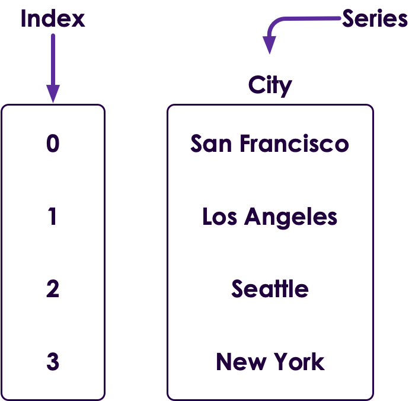
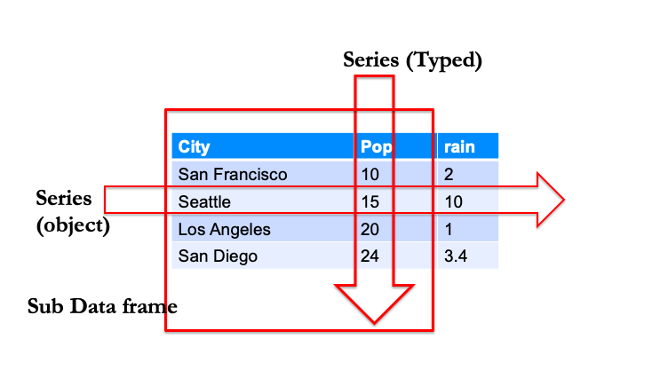

# PYTHON:Pandas

<!-- {"left" : 2.83, "top" : 5.27, "height" : 0.86, "width" : 4.12} -->


---
## Lesson Objectives

* Introduction to Pandas and why its needed
* Creating Pandas Series and DataFrame
* Conducting various operations with a DataFrame
* Descriptive Statistics operations
* More advanced operations like merging, concatenating, sorting etc.
* Working with Pandas and Files
* Reading a real world dataset into pandas and doing some data exploration

---

# Introduction

---

## Why Pandas

  * It adds support for data manipulation, data munging and data preparation and is highly flexible

  * Fast

    - Has an efficient "DataFrame" object
    - Has default and customized indexing

  * Full Featured

    - Has label based indexing, slicing and subsetting of large datasets
    - Can insert columns, append rows etc easily
    - Can group by data for aggregations and transformations

  * Pandas website - https://pandas.pydata.org/

Notes:

---

# Series

---

## Series

<!-- {"left" : 6.84, "top" : 1.09, "height" : 3.1, "width" : 3.19} -->

  * Pandas has a Series type (single column in a database table)
  * All elements in a Series must be of same type (NaN is okay)
  * Defaults to float64 (notice that it is converted!)
  * Pandas needs to be imported

```python
>>> import pandas as pd
>>> cities = pd.Series(['San Francisco', 'Los Angeles',
                         'Seattle', 'New York'])
>>> cities

0    San Francisco
1      Los Angeles
2          Seattle
3         New York
dtype: object
```
<!-- {"left" : 0, "top" : 5.21, "height" : 2.48, "width" : 6.94} -->

Notes:

---
## Series

  * Pandas has a Series type (single column in a database table)
  * All elements in a Series must be of same type (NaN is okay)
  * Defaults to float64 (notice that it is converted!)
  * Pandas needs to be imported
    -  `import pandas as pd`
  * Example - Creating a Series

```python
>>> s = pd.Series([1,3,5,np.nan,6,8])
>>> s
0    1.0
1    3.0
2    5.0
3    NaN
4    6.0
5    8.0
dtype: float64
```
<!-- {"left" : 0.0, "top" : 4.42, "height" : 2.9, "width" : 6.94} -->

Notes:

---


## Dtypes


  * Series in pandas have a `dtype`:

    - types of `np.number` (`float, int`) of lengths `8`,`16`,`32`,`64` (e.g. `float64`, `int8`)
    - `bool` (Boolean)
    - `datetime` types (`datetime64`, `timedelta64`)
    - `Sn` (fixed width string) - not commonly used.
    - `category`: an enum or factor type variable.
    - `object` (a pointer to any object, including a string)

  * Same type (no mix and match)

    - Though `object` types can include pointers to any python object


Notes:

---

## Creating Series

* Here are more examples of creating Series:

```python
>>> data = np.array(["a", "b", "c", "d"])
>>> s = pd.Series(data)
>>> s
0    a
1    b
2    c
3    d
dtype: object
```
<!-- {"left" : 0.0, "top" : 1.78, "height" : 2.2, "width" : 6.41} -->


```python
>>> s = pd.Series(5, index=[0, 1, 2])
>>> print s
0    5
1    5
2    5
dtype: int64
```
<!-- {"left" : 0.0, "top" : 4.17, "height" : 1.88, "width" : 6.43} -->

```python
>>> s = pd.Series(5, index=["a", "b", "c"], dtype = np.complex)
>>> print s
a    (5+0j)
b    (5+0j)
c    (5+0j)
dtype: complex
```
<!-- {"left" : 0.0, "top" : 6.25, "height" : 1.74, "width" : 9.69} -->


Notes:

---

## Retrieving data from Series

  * Here's how we retrieve data

```python
>>> s = pd.Series(["a", "b", "c"], index = [1, 2, "favorite"])
>>> s = pd.Series(s)
>>> s
1			a
2			b
favorite		c
dtype: object
>>> s[0]
'a'
>>> s["favorite"]
'c'
```
<!-- {"left" : 0.0, "top" : 1.65, "height" : 3.22, "width" : 10.25} -->

Notes:

---

## Index

  * Series always have an index (like a virtual column)

  * Index can be of any type (str, int, float)

  * Default index is an int starting with zero (0,1,2…)

    - New rows will have a new index
    - (similar to auto-incrementing primary key)

  * Indexes do **NOT** have to be unique

    - But it is usually better if they are
    - Exception will be raised at data access time if not unique

* Example of custom index:

```python
s = pd.Series({'Jan': 1., 'Feb': 2, 'Mar': 3})
Jan	 1.0
Feb 3.0
Mar 5.0
dtype: float64
```
<!-- {"left" : 0.0, "top" : 5.43, "height" : 1.74, "width" : 8.44} -->

Notes:

---

## Numpy Array versus Pandas Series

|  | Numpy Array | Pandas Series |
|---------------------------|----------------------------------------|----------------------------------------------------------------------------------|
| Is it typed? | Yes, same type. | Yes, same type,  but can use "object" type that  can point to different objects. |
| Multi-Dimensional? | Any number of dimensions | Single Dimensional |
| Has Index? | implicitly an integer index myarray[0] | Explicitly has an settable  index. myseries['abc'],  defaults to integer index. |
| Follows NumPy  interface? | Yes | Yes |
| Convert to numpy array? | Already is! | Series.values |

<!-- {"left" : 0.65, "top" : 1.57, "height" : 3.87, "width" : 8.96, "columnwidth" : [2.81, 3.08, 3.07]} -->

Notes:

---

# DataFrame

---

## Data Frame

  * Data frames hold 'tabular' data.

  * Think 'Excel spreadsheet' or 'database table.'

     - Rows & columns

  * Each column can be a different type.

  * Each row must have same length.

| X | Y | Z |
|---|---|---|
| 1 | 2 | 3 |
| 4 | 5 | 6 |

<!-- {"left" : 3.11, "top" : 3.72, "height" : 1.22, "width" : 4.03, "columnwidth" : [1.34, 1.34, 1.34]} -->

```python
df = pd.DataFrame(
    {'X' : [1, 4],
     'Y' : [2, 5],
     'Z' : [3,6 ]})
```
<!-- {"left" : 0.0, "top" : 5.22, "height" : 1.44, "width" : 3.94} -->

Notes:

---
## DataFrame


  * DataFrame is a 2D data structure to hold 'tabular' data
  * Think of an 'Excel spreadsheet' or a 'database table' with rows and columns
  * Each column can be a different data type
  * Each row must have same length

&nbsp;

| Number | Language | Version |
|--------|----------|---------|
| 1      | python   | 3.7     |
| 2      | java     | 10      |

<!-- {"left" : 5.72, "top" : 3.38, "height" : 1.22, "width" : 4.09, "columnwidth" : [1.22, 1.43, 1.43]} -->
&nbsp;
  * Example - Creating a DataFrame


```python
>>> s = pd.DataFrame({"x" : [1,4], "y" : [2,5], "z" : [3,6]})
>>> s
   x  y  z
0  1  2  3
1  4  5  6
```
<!-- {"left" : 0.0, "top" : 5.3, "height" : 1.62, "width" : 10.21} -->

Notes:

---

## Dataframe

* Dataframe is a collection of series

<!-- {"left" : 0.5, "top" : 2.71, "height" : 2.49, "width" : 9.25} -->


---

## Creating DataFrame

* Here are more examples of creating a DataFrame

```python
>>> data = {'Name' : ['Tom', 'Jack', 'Steve', 'Ricky'], 'Age' : [28, 34, 29, 42]}
>>> df = pd.DataFrame(data)
>>> df
Name  Age
0    Tom   28
1   Jack   34
2  Steve   29
3  Ricky   42
```
<!-- {"left" : 0.0, "top" : 1.7, "height" : 1.88, "width" : 10.27} -->

|   | Name  | Age |
|---|-------|-----|
| 0 | Tom   | 28  |
| 1 | Jack  | 34  |
| 2 | Steve | 29  |
| 3 | Ricky | 42  |

<!-- {"left" : 5.71, "top" : 2.35, "height" : 2.01, "width" : 4.28, "columnwidth" : [1.43, 1.43, 1.43]} -->


```python
>>> data = [{"a":1, "b":2}, {"a":5, "b":10, "c":20}]
>>> df = pd.DataFrame(data, index=['first', 'second'])
>>> df
```
<!-- {"left" : 0.0, "top" : 5.22, "height" : 1.15, "width" : 9.78} -->

Notes:

---

# Operations on DataFrame

---

## Operations on DataFrame - Create

  * Creating a DataFrame for all operations henceforth:

```python
>>> cities = pd.DataFrame({"city" :
["San Francisco", "Seattle", "Los Angeles", "San Diego"],
 "pop" : [10, 15, 20, 24], "rain" : [2, 10, 1, 3.4]})
>>> cities
city  pop  rain
0  San Francisco   10   2.0
1        Seattle   15  10.0
2    Los Angeles   20   1.0
3      San Diego   24   3.4
```
<!-- {"left" : 0.0, "top" : 1.86, "height" : 3.21, "width" : 10.27} -->

|   | city          | pop | rain |
|---|---------------|-----|------|
| 0 | San Francisco | 10  | 2    |
| 1 | Seattle       | 15  | 10   |
| 2 | Los Angeles   | 20  | 1    |
| 3 | San Diego     | 24  | 3.4  |

<!-- {"left" : 2.34, "top" : 5.94, "height" : 2.01, "width" : 5.58, "columnwidth" : [0.95, 2.37, 1.08, 1.18]} -->

Notes:

---

## Operations on DataFrame - dtypes

  * Checking Data Types in a DataFrame


```python
>>> cities.dtypes
city     object
pop       int64
rain    float64
dtype: object
```
<!-- {"left" : 0.0, "top" : 1.76, "height" : 1.74, "width" : 3.61} -->

|   | city          | pop | rain |
|---|---------------|-----|------|
| 0 | San Francisco | 10  | 2    |
| 1 | Seattle       | 15  | 10   |
| 2 | Los Angeles   | 20  | 1    |
| 3 | San Diego     | 24  | 3.4  |

<!-- {"left" : 2.2, "top" : 3.74, "height" : 2.5, "width" : 5.85, "columnwidth" : [1.09, 2.35, 1.14, 1.27]} -->


Notes:

---

## Data Frame: Appending a New Row


| city          | pop    | rain    |
|---------------|--------|---------|
| San Francisco | 10     | 2       |
| Seattle       | 15     | 10      |
| Los Angeles   | 20     | 1       |
| **San Diego** | **24** | **3.4** |

<!-- {"left" : 2.95, "top" : 1.22, "height" : 2.5, "width" : 4.35, "columnwidth" : [2.37, 0.95, 1.03]} -->


```python
>>> cities = pd.DataFrame ({
         'city' : ['San Francisco', 'Seattle', 'Los Angeles'],  
	       'pop' : [10, 15, 20],  
	       'rain' : [2, 10,1]})


>>> sandiego = pd.DataFrame( {'city' :'San Diego','pop':24, 'rain':3.4)

>>> cities = cities.append(sandiego)
```
<!-- {"left" : 0.0, "top" : 4.18, "height" : 2.42, "width" : 10.25} -->

Notes:

---

## Slicing Data Frames


<!-- {"left" : 0.14, "top" : 1.56, "height" : 5.94, "width" : 9.97} -->


Notes:

---

## Data Frame Slicing


<!-- {"left" : 0, "top" : 1.57, "height" : 5.93, "width" : 10.25} -->

Notes:

---

## Accessing a Data Frame by numeric index


| city         	    | pop    | rain  |
|---------------    |------  |------ |
| **San Francisco** | **10** | **2** |
| Seattle           | 15     | 10    |
| Los Angeles       | 20     | 1     |
| San Diego         | 24     | 3.4   |

<!-- {"left" : 2.97, "top" : 1.45, "height" : 2.03, "width" : 4.32, "columnwidth" : [2.08, 1.08, 1.08]} -->


```python
# note we specify row index

> cities.iloc[[0]]  # gets a dataframe of one row

   city  pop  rain
0  San Francisco   10     2
```
<!-- {"left" : 0.0, "top" : 4.01, "height" : 2.03, "width" : 8.94} -->

Notes:

---

## Accessing a Data Frame


| city           | pop    | rain |
|--------------- |------  |------|
| San Francisco  | **10** | 2    |
| Seattle        | **15** | 10   |
| Los Angeles    | **20** | 1    |
| San Diego      | **24** | 3.4  |

<!-- {"left" : 3.01, "top" : 1.47, "height" : 2.03, "width" : 4.24, "columnwidth" : [2.08, 1.08, 1.08]} -->


```python
Columns are returned as series

# by name  dataframe['column_name'] or dataframe.
> cities['pop']  # can also say cities.pop
0  10
1  15
Name: cities, dtype: Int64 [ ]:

# specify index: dataframe[:,idx ]
cities.iloc[:,1]  # gets a series
0 10
1 15
2 20

> cities.iloc[:2].dtype  #gets rain column
float64

# specify column index  :  dataframe.iloc[:, idx]
> cities.iloc[:,1]
10  15  20  24
```
<!-- {"left" : 0.0, "top" : 4.05, "height" : 4.18, "width" : 9.48} -->


Notes:

---

## Accessing a Data Frame using .iloc

| city            | pop   | rain  |
|-------------    |------ |-------|
|**San Francisco**| **10**| 2     |
| **Seattle**     | **15**| 10    |
| **Los Angeles** | **20**| 1     |
| **San Diego**   | **24**| 3.4   |

<!-- {"left" : 2.97, "top" : 1.25, "height" : 2.03, "width" : 4.32, "columnwidth" : [2.08, 1.08, 1.08]} -->

```python
# Sub dataframes are obtained using iloc or by name
# dataframe.iloc[:,[n]] : one column as a dataframe
# dataframe[['colname']] : one column by NAME as a dataframe

> cities.iloc[:,0:2] # dataframe
           city pop
0 San Francisco 10
1       Seattle 15
2   Los Angeles 20

type(cities.iloc[:,[0]])
"Dataframe"
```
<!-- {"left" : 0.0, "top" : 3.62, "height" : 3.59, "width" : 10.25} -->

Notes:

---

## Accessing Dataframes : Series vs. Sub Dataframe


```python
Sub dataframe

> cities.iloc[:,[2]]

  pop
0  10
1  15
2  20
3  24

> type(cities.iloc[:,[2]])
<class 'pandas.core.frame.DataFrame'>
```
<!-- {"left" : 0.0, "top" : 1.51, "height" : 3.78, "width" : 6.94} -->

| Raw   | city          | pop    | rain |
|----   |-------------- |------  |------|
| **0** | San Francisco | **10** | 2    |
| **1** | Seattle       | **15** | 10   |
| **2** | Los Angeles   | **20** | 1    |
| **3** | San Diego     | **24** | 3.4  |

<!-- {"left" : 4.56, "top" : 1.83, "height" : 2.01, "width" : 5.46, "columnwidth" : [0.9, 1.91, 1.24, 1.41]} -->

Notes:

---

## Accessing Dataframes : Series vs. Sub Dataframe

```python
# Series

> cities.iloc[:,1]
0  10
1  15
2  20
3  24

> type(cities.iloc[:,1])
"< 'pandas.core.series.Series'>"
```
<!-- {"left" : 0.0, "top" : 1.56, "height" : 2.61, "width" : 6.11} -->

| city          | pop    | rain |
|---------------|------  |------|
| San Francisco | **10** | 2    |
| Seattle       | **15** | 10   |
| Los Angeles   | **20** | 1    |
| San Diego     | **24** | 3.4  |

<!-- {"left" : 3.08, "top" : 5.06, "height" : 2.01, "width" : 4.09, "columnwidth" : [2.08, 1.1, 0.92]} -->

Notes:

---

## Accessing Dataframe by Index

  * Dataframes, like Series, have an index.

  * By default auto-incrementing integer type.

  * Access with `.loc[]` (not `iloc[]`)

  * Access

```python
cities.loc[[1]]  # gets a dataframe of one row

   city  pop  rain
0  San Francisco   10     2
Cities = cities.set_index(['c1, 'c2', 'c3'])
cities.loc[['c1']]

   city  pop  rain
c1  San Francisco   10     2
```
<!-- {"left" : 0.0, "top" : 3.71, "height" : 2.9, "width" : 8.44} -->

Notes:

---

## Apply function

  * How to do some operation on a column or group of columns?


```python
def clean(x):
    x = x.replace("$", "").replace(",", "").replace(" ", "")
    return float(x)

data['revenue'] = data['Revenue'].apply(clean)
```
<!-- {"left" : 0.0, "top" : 2, "height" : 1.65, "width" : 10.25} -->

Notes:

---

# Using lambda

---

## Using lambda

```
data['revenue'] = data['revenue'].apply(
  lambda x : x.replace("," ""))
```
<!-- {"left" : 0.0, "top" : 1.66, "height" : 0.98, "width" : 8.51} -->

Notes:

---

## Operations on DataFrame - column slicing

  * Slicing a column from a DataFrame - Using <df>.iloc[] (outputs a Series)

```python
>>> cities.iloc[:, 0]
0    San Francisco
1          Seattle
2      Los Angeles
3        San Diego
Name: city, dtype: object
```
<!-- {"left" : 0.0, "top" : 2.33, "height" : 2.28, "width" : 5.55} -->


|       | city              | pop    | rain |
|-----  |---------------    |--------|------|
| **0** | **San Francisco** | 10     | 2    |
| **1** | **Seattle**       | 15     | 10   |
| **2** | **Los Angeles**   | 20     | 1    |
| **3** | **San Diego**     | 24     | 3.4  |

<!-- {"left" : 3.1, "top" : 5.72, "height" : 1.99, "width" : 4.05, "columnwidth" : [0.64, 1.85, 0.78, 0.78]} -->

Notes:

---

## Operations on DataFrame - column slicing

  * Slicing multiple columns from a DataFrame - Using <df>.iloc[] (outputs a DataFrame)

```python
>>> cities.iloc[:, 0:2]
city  pop
0  San Francisco   10
1        Seattle   15
2    Los Angeles   20
3      San Diego   24
```
<!-- {"left" : 0.0, "top" : 2.14, "height" : 2.31, "width" : 5.63} -->

|     | city          | pop    | rain |
|-----|-------------- |--------|------|
| 0   | San Francisco | 10     | 2    |
| 1   | Seattle       | 15     | 10   |
| 2   | Los Angeles   | 20     | 1    |
| 3   | San Diego     | 24     | 3.4  |

<!-- {"left" : 3.1, "top" : 5.3, "height" : 1.99, "width" : 4.05, "columnwidth" : [0.64, 1.85, 0.78, 0.78]} -->

Notes:

---

## Operations on DataFrame - column slicing

  * Slicing a column from a DataFrame (outputs a Series)

```python
>>> cities["city"]
0    San Francisco
1          Seattle
2      Los Angeles
3        San Diego
Name: city, dtype: object
```
<!-- {"left" : 0.0, "top" : 1.77, "height" : 2.31, "width" : 5.62} -->

|     | city              | pop    | rain |
|-----|---------------    |--------|------|
| 0   | **San Francisco** | 10     | 2    |
| 1   | **Seattle**       | 15     | 10   |
| 2   | **Los Angeles**   | 20     | 1    |
| 3   | **San Diego**     | 24     | 3.4  |

<!-- {"left" : 2.87, "top" : 4.95, "height" : 2.03, "width" : 4.53, "columnwidth" : [0.57, 2.08, 0.93, 0.93]} -->

Notes:

---

## Operations on DataFrame - column slicing

  * Slicing multiple columns from a DataFrame (outputs a DataFrame)

```python
>>> cities[["city", "pop"]]
city  pop
0  San Francisco   10
1        Seattle   15
2    Los Angeles   20
3      San Diego   24
```
<!-- {"left" : 0.0, "top" : 2.2, "height" : 2.35, "width" : 6.12} -->

|       | city              | pop    | rain |
|-----  |---------------    |------  |------|
| **0** | **San Francisco** | **10** | 2    |
| **1** | **Seattle**       | **15** | 10   |
| **2** | **Los Angeles**   | **20** | 1    |
| **3** | **San Diego**     | **24** | 3.4  |

<!-- {"left" : 2.87, "top" : 5.38, "height" : 2.03, "width" : 4.53, "columnwidth" : [0.57, 2.08, 0.93, 0.93]} -->

Notes:

---

## Operations on DataFrame - column addition

  * Adding a column to a DataFrame

```python
>>> cities["area"] = pd.Series([231.89, 142.55, 502.76, 372.39])
>>> cities
city  pop  rain    area
0  San Francisco   10   2.0  231.89
1        Seattle   15  10.0  142.55
2    Los Angeles   20   1.0  502.76
3      San Diego   24   3.4  372.39
```
<!-- {"left" : 0.0, "top" : 1.85, "height" : 2.08, "width" : 10.25} -->


|    | city          | pop | rain | **area**   |
|--- |---------------|-----|------|--------    |
| 0  | San Francisco | 10  | 2    | **231.89** |
| 1  | Seattle       | 15  | 10   | **142.55** |
| 2  | Los Angeles   | 20  | 1    | **502.76** |
| 3  | San Diego     | 24  | 3.4  | **372.39** |

<!-- {"left" : 1.79, "top" : 4.38, "height" : 2.01, "width" : 6.67, "columnwidth" : [0.79, 2.08, 1.14, 0.96, 1.71]} -->

Notes:

---

## Operations on DataFrame - column deletion

  * Deleting a column from a DataFrame

```python
>>> a = cities.pop("area")
>>> cities
            city  pop  rain
0  San Francisco   10   2.0
1        Seattle   15  10.0
2    Los Angeles   20   1.0
3      San Diego   24   3.4
>>> a
0    231.89
1    142.55
2    502.76
3    372.39
Name: area, dtype: float64
```
<!-- {"left" : 0.0, "top" : 1.79, "height" : 4.56, "width" : 5.92} -->

Notes:

---

## Operations on DataFrame - column deletion

|   | city          | pop | rain | **area**   |
|---|---------------|-----|------|--------    |
| 0 | San Francisco | 10  | 2    | **231.89** |
| 1 | Seattle       | 15  | 10   | **142.55** |
| 2 | Los Angeles   | 20  | 1    | **502.76** |
| 3 | San Diego     | 24  | 3.4  | **372.39** |

<!-- {"left" : 2.54, "top" : 2.49, "height" : 2.01, "width" : 5.17, "columnwidth" : [0.61, 1.74, 0.84, 0.85, 1.13]} -->

&nbsp;
&nbsp;

| &nbsp;**area** &nbsp;  |
|--------    |
| &nbsp;**231.89** &nbsp;|
| &nbsp;**142.55** &nbsp;|
| &nbsp;**502.76**&nbsp; |
| &nbsp;**372.39**&nbsp; |

<!-- {"left" : 4.61, "top" : 5.43, "height" : 2.03, "width" : 1.04, "columnwidth" : [1.04]} -->

Notes:

---

## Operations on DataFrame - row slicing

  * Slicing a row from a DataFrame - Using <df>.iloc[]

```python
>>> cities[1] # row index 1
<ERROR!!!>
```
<!-- {"left" : 0.0, "top" : 2.06, "height" : 0.88, "width" : 5.38} -->

```python
>>> cities.iloc[1]
city    Seattle
pop          15
rain       10.0
Name: 1, dtype: object
```
<!-- {"left" : 0.0, "top" : 3.73, "height" : 1.6, "width" : 4.11} -->

```python
>>> cities.iloc[[1]]
         pop  rain
city              
Seattle   15  10.0
```
<!-- {"left" : 0, "top" : 6.13, "height" : 1.44, "width" : 4.11} -->

Notes:

---

## Operations on DataFrame - row slicing

  * Slicing multiple rows from a DataFrame - Using <df>.iloc[]

```python
>>> cities.iloc[1:3] # row index 1-3 (excluding 3)
          city  pop  rain
1      Seattle   15  10.0
2  Los Angeles   20   1.0
```
<!-- {"left" : 0.0, "top" : 1.77, "height" : 1.27, "width" : 9.11} -->


|       | city           | pop    | rain   |   	
|---    |--------------  |-----   |-----   |
| 0     | San Francisco  | 10     | 2      |
| **1** | **Seattle**    | **15** | **10** |
| **2** | **Los Angeles**| **20** | **1**  |
| 3     | San Diego      | 24     | 3.4    |    

<!-- {"left" : 3.01, "top" : 3.76, "height" : 2.03, "width" : 4.22, "columnwidth" : [0.69, 1.92, 0.86, 0.75]} -->

Notes:

---

## Operations on DataFrame - row slicing

  * Slicing rows from a DataFrame (outputs a DataFrame)

```python
>>> cities[1:3] # row index 1-3 (excluding 3)
          city  pop  rain
1      Seattle   15  10.0
2  Los Angeles   20   1.0
```
<!-- {"left" : 0.0, "top" : 2.17, "height" : 1.44, "width" : 8.28} -->

|       | city           | pop   | rain |   	
|----   |--------------  |----   |----- |
| 0     | San Francisco  | 10    | 2    |
| **1** | **Seattle**    | **15**| 10   |
| **2** | **Los Angeles**| **20**| 1    |
| 3     | San Diego      | 24    | 3.4  |  

<!-- {"left" : 2.76, "top" : 4.88, "height" : 2.01, "width" : 4.74, "columnwidth" : [0.73, 1.94, 1.01, 1.06]} -->

Notes:

---

## Operations on DataFrame - row slicing

```python
>>> cities[1:4:2] # row index 1-4 (excluding 4, every 2nd element)
        city  pop  rain
1    Seattle   15  10.0
3  San Diego   24   3.4
```
<!-- {"left" : 0.0, "top" : 2.16, "height" : 1.26, "width" : 10.25} -->


|      | city         | pop    | rain   |   	
|---   |--------------|-----   |-----   |
| 0    | San Francisco| 10     | 2      |
| **1**| **Seattle**  | **15** | **10** |
| 2    | Los Angeles  | 20     | 1      |
| **3**| **San Diego**| **24** | **3.4**|

<!-- {"left" : 2.76, "top" : 4.66, "height" : 2.01, "width" : 4.74, "columnwidth" : [0.73, 1.94, 1.01, 1.06]} -->

Notes:

---

## Operations on DataFrame - row addition

  * Appending a row to a DataFrame:


```python
>>> portland = pd.DataFrame({"city" : ["Portland"], "pop" : [12], "rain" : [8.3]})
>>> cities = cities.append(portland)
>>> cities
            city  pop  rain
0  San Francisco   10   2.0
1        Seattle   15  10.0
2    Los Angeles   20   1.0
3      San Diego   24   3.4
0       Portland   12   8.3
```
<!-- {"left" : 0.0, "top" : 1.81, "height" : 2.06, "width" : 10.27} -->

|       | city         | pop   | rain   |   	
|----   |--------------|-----  |------  |
| 0     | San Francisco| 10    | 2      |
| 1     | Seattle      | 15    | 10     |
| 2     | Los Angeles  | 20    | 1      |
| 3     | San Diego    | 24    | 3.4    |
| **0** | **Portland** | **12**| **8.3**|

<!-- {"left" : 2.51, "top" : 4.07, "height" : 2.41, "width" : 5.23, "columnwidth" : [1.01, 1.95, 1.11, 1.15]} -->

Notes:

---

## Operations on DataFrame - reset_index()

  * Reassigning indices in a DataFrame (notice the index of "Portland" changes)


```python
>>> cities = cities.reset_index(drop=True, inplace=True)
>>> cities
            city  pop  rain
0  San Francisco   10   2.0
1        Seattle   15  10.0
2    Los Angeles   20   1.0
3      San Diego   24   3.4
4       Portland   12   8.3
```
<!-- {"left" : 0.0, "top" : 2.28, "height" : 2.65, "width" : 10.25} -->


|    | city         | pop | rain |   	
|----|--------------|-----|------|
| 0  | San Francisco| 10  | 2    |
| 1  | Seattle      | 15  | 10   |
| 2  | Los Angeles  | 20  | 1    |
| 3  | San Diego    | 24  | 3.4  |
| 4  | Portland     | 12  | 8.3  |

<!-- {"left" : 2.51, "top" : 5.67, "height" : 2.41, "width" : 5.23, "columnwidth" : [1.01, 1.95, 1.11, 1.15]} -->

Notes:

---

## Operations on DataFrame - row deletion

  * Deleting a row from a DataFrame:

```python
>>> cities = cities.drop(3)
>>> cities
            city  pop  rain
0  San Francisco   10   2.0
1        Seattle   15  10.0
2    Los Angeles   20   1.0
4       Portland   12   8.3
```
<!-- {"left" : 0.0, "top" : 1.73, "height" : 2.32, "width" : 5.28} -->

|       | city          | pop    | rain   |   	
|----   |---------------|----    |-----   |
| 0     | San Francisco | 10     | 2      |
| 1     | Seattle       | 15     | 10     |
| 2     | Los Angeles   | 20     | 1      |
| **3** | **San Diego** | **24** | **3.4**|
| 4     | Portland      | 12     | 8.3    |

<!-- {"left" : 2.51, "top" : 4.87, "height" : 2.41, "width" : 5.23, "columnwidth" : [1.01, 1.95, 1.11, 1.15]} -->

Notes:

---
## Operations on DataFrame - Sub-setting

  * Re-initializing our DataFrame

```python
>>> cities = pd.DataFrame({"city" :
["San Francisco","Seattle", "Los Angeles",
"San Diego", "Portland"],
 "pop" : [10, 15, 20, 24, 12], "rain" :
[2, 10, 1, 3.4, 8.3], "area" :
[231.89, 142.55, 502.76, 372.39, 145.09]})
>>> cities
            city  pop  rain    area
0  San Francisco   10   2.0  231.89
1        Seattle   15  10.0  142.55
2    Los Angeles   20   1.0  502.76
3      San Diego   24   3.4  372.39
4       Portland   12   8.3  145.09
```
<!-- {"left" : 0.0, "top" : 1.92, "height" : 4.26, "width" : 10.25} -->

Notes:

---
## Operations on DataFrame - Sub-setting

  * Sub-setting - Compare population and land area of Seattle and Los Angeles

```python
>>> cities.iloc[1:3,[0,1,3]]
          city  pop    area
1      Seattle   15  142.55
2  Los Angeles   20  502.76
```
<!-- {"left" : 0.0, "top" : 2.34, "height" : 1.55, "width" : 5.86} -->

Notes:

---

## Operations on DataFrame - Sub-setting

  * Compare iloc outputs of Series and sub-DataFrame

```python
>>> s1 = cities.iloc[1:3,1]
1    15
2    20
Name: pop, dtype: int64
>>> type(s1)
<class 'pandas.core.series.Series'>
```
<!-- {"left" : 0.0, "top" : 1.86, "height" : 1.8, "width" : 5.86} -->

```python
>>> cities.iloc[1:3,[1]]
   pop
1   15
2   20
>>> type(s2)
<class 'pandas.core.frame.DataFrame'>
```
<!-- {"left" : 0.0, "top" : 3.96, "height" : 1.8, "width" : 5.86} -->

Notes:

---

## Operations on DataFrame - set_index()

  * Set a DataFrame column as the index:


```python
>>> cities = cities.set_index("city")
>>> cities
               pop  rain    area
city                            
San Francisco   10   2.0  231.89
Seattle         15  10.0  142.55
Los Angeles     20   1.0  502.76
San Diego       24   3.4  372.39
Portland        12   8.3  145.09
```
<!-- {"left" : 0.0, "top" : 1.71, "height" : 2.9, "width" : 6.94} -->


| city              | pop | rain | area   |
|---------------    |-----|------|--------|
| **San Francisco** | 10  | 2.0  | 231.89 |
| **Seattle**       | 15  | 10.0 | 142.55 |
| **Los Angeles**   | 20  | 1.0  | 502.76 |
| **San Diego**     | 24  | 3.4  | 372.39 |
| **Portland**      | 12  | 8.3  | 145.09 |

<!-- {"left" : 2.55, "top" : 5.4, "height" : 2.41, "width" : 5.15, "columnwidth" : [2.02, 0.91, 1.03, 1.19]} -->

Notes:

---

## Operations on DataFrame - loc[]

  * Access a single DataFrame row with labels as the index:

```python
>>> cities = cities.loc["San Diego"]
pop      24.00
rain      3.40
area    372.39
Name: San Diego, dtype: float64
```
<!-- {"left" : 0.0, "top" : 1.7, "height" : 1.82, "width" : 7.11} -->


```python
>>> cities = cities.loc[["San Diego"]]
           pop  rain    area
city                        
San Diego   24   3.4  372.39
```
<!-- {"left" : 0.0, "top" : 3.78, "height" : 1.44, "width" : 7.11} -->


|   city        | pop    | rain    | area       |
|---------------|-----   |------   |--------    |
| San Francisco | 10     | 2.0     | 231.89     |
| Seattle       | 15     | 10.0    | 142.55     |
| Los Angeles 	| 20     | 1.0     | 502.76     |
| **San Diego** | **24** | **3.4** | **372.39** |
| Portland      | 12     | 8.3     | 145.09     |

<!-- {"left" : 2.55, "top" : 5.61, "height" : 2.41, "width" : 5.15, "columnwidth" : [2.02, 0.91, 1.03, 1.19]} -->

Notes:

---

## Operations on DataFrame - loc[]

  * Access multiple DataFrame rows with labels as the index:


```python
>>> cities = cities.loc[["Seattle", "Los Angeles"]]
               pop  rain
city                    
Seattle         15  10.0
Los Angeles     20   1.0
```
<!-- {"left" : 0.0, "top" : 1.86, "height" : 1.74, "width" : 9.28} -->


|   city         | pop    | rain   |
|--------------- |-----   |-----   |
| San Francisco  | 10     | 2      |
| **Seattle**    | **15** | **10** |
| **Los Angeles**| **20** | **1**  |
| San Diego      | 24     | 3.4    |

<!-- {"left" : 2.82, "top" : 4.4, "height" : 2.01, "width" : 4.62, "columnwidth" : [2.18, 1.23, 1.23]} -->


Notes:

---

# Statistics Operations

---

## Statistics Operations

  * Statistical operations like **max, min, mean, median, standard** **deviation** and **variance** are made simple with function calls

```python
>>> cities.min()
pop      10.00
rain      1.00
area    142.55
dtype: float64
```
<!-- {"left" : 0.0, "top" : 2.28, "height" : 1.76, "width" : 3.79} -->

```python
>>> cities.max()
pop      24.00
rain     10.00
area    502.76
dtype: float64
```
<!-- {"left" : 0.0, "top" : 4.14, "height" : 1.67, "width" : 3.79} -->

```python
>>> cities.mean()
pop      16.200
rain      4.940
area    278.936
dtype: float64
```
<!-- {"left" : 0.0, "top" : 5.91, "height" : 1.67, "width" : 3.79} -->

---

## Statistics Operations

```python
>>> cities.median()
pop      15.00
rain      3.40
area    231.89
dtype: float64
```
<!-- {"left" : 0, "top" : 2.04, "height" : 1.67, "width" : 3.79} -->

```python
>>> cities.std()
pop       5.761944
rain      3.982210
area    156.173023
dtype: float64
```
<!-- {"left" : 0, "top" : 3.86, "height" : 1.67, "width" : 3.79} -->

```python
>>> cities.var()
pop        33.20000
rain       15.85800
area    24390.01298
dtype: float64
```
<!-- {"left" : 0, "top" : 5.68, "height" : 1.67, "width" : 3.79} -->

Notes:

---

## Statistics Operations

  * The describe() function gives a summary of the dataset from a statistical viewpoint


```python
>>> cities.describe()
             pop      rain        area
count   5.000000   5.00000    5.000000
mean   16.200000   4.94000  278.936000
std     5.761944   3.98221  156.173023
min    10.000000   1.00000  142.550000
25%    12.000000   2.00000  145.090000
50%    15.000000   3.40000  231.890000
75%    20.000000   8.30000  372.390000
max    24.000000  10.00000  502.760000
```
<!-- {"left" : 0, "top" : 2.42, "height" : 3.82, "width" : 9.3} -->

Notes:

---

## Lab: Statistics

<!-- {"left" : 7.16, "top" : 1.06, "height" : 3.91, "width" : 2.93} -->


 *  **Overview:**
     - Practice Stats functions in Pandas / Numpy

 *  **Approximate Time:**
     - 10 mins

 *  **Instructions*:*
    - Lab : Basic Stats

 *  **Location:**
    - `stats/1-stats-basics.ipynb`

Notes:


---

# Advanced Operations

---

## Working With Raw Data

  * Datasets are seldom in a format to be used.

  * A big part of data science is:

    - Cleaning data up
    - Combining, Merging, Sorting and manipulating data sets
    - Dealing with missing values

* This is probably the 'not so sexy part of data science'

Notes:

---

## Dealing With Missing Values

  * Missing Data is always a problem in real life datasets

  * Missing values can often skew analysis

  * Fields like Machine Learning often see lower accuracy in model predictions due
    to missing values

  * Python represents them with NA (Not Available)


<!-- {"left" : 1.19, "top" : 4.52, "height" : 2.74, "width" : 7.87} -->


---

## Dealing With Missing Values


  * Use **<df>.dropna()** to remove rows containing at least one **NA** value

  * Use **<df>.fillna()** to fill them with a scalar value


Notes:

---

## Row or Column wise function application
  * Pandas allows operations to be done on a column/row or a group of columns/rows using `apply()`
```python
>>> cities["popPerArea"] = cities.apply(lambda x : cities["pop"] / cities["area"])
>>> cities
               pop  rain    area  popPerArea
city                                        
San Francisco   10   2.0  231.89    0.043124
Seattle         15  10.0  142.55    0.105226
Los Angeles     20   1.0  502.76    0.039780
San Diego       24   3.4  372.39    0.064449
Portland        12   8.3  145.09    0.082707
```
<!-- {"left" : 0, "top" : 2.23, "height" : 2.45, "width" : 10.25} -->

<br/>
<br/>

  * A single operation or a single function can be applied to the entire DataFrame too. This is done using a function similar to apply(), called **applymap()**

Notes:

---

## Sorting - Rows - by values


  * Pandas allows sorting (by values) to be done on the entire DataFrame using `sort_values()`

```python
>>> cities = cities.sort_values("rain", ascending = False) # sorts by values
>>> cities
               pop  rain    area  popPerArea
city                                        
Seattle         15  10.0  142.55    0.105226
Portland        12   8.3  145.09    0.082707
San Diego       24   3.4  372.39    0.064449
San Francisco   10   2.0  231.89    0.043124
Los Angeles     20   1.0  502.76    0.039780
```
<!-- {"left" : 0, "top" : 2.36, "height" : 2.02, "width" : 10.25} -->

Notes:

---

## Sorting - Rows - by index

  * Pandas allows sorting (by index) to be done on the entire DataFrame using `sort_index()`

```python
>>> cities = cities.sort_index() # sorts by index label
>>> cities
               pop  rain    area  popPerArea
city                                        
Los Angeles     20   1.0  502.76    0.039780
Portland        12   8.3  145.09    0.082707
San Diego       24   3.4  372.39    0.064449
San Francisco   10   2.0  231.89    0.043124
Seattle         15  10.0  142.55    0.105226
```
<!-- {"left" : 0, "top" : 2.2, "height" : 2.65, "width" : 9.94} -->

Notes:

---

## Sorting - Rows - by index

  * The `ascending` parameter can be set to `False` for sorting in descending order

```python
>>> cities = cities.sort_index(ascending = False)
>>> cities
```
<!-- {"left" : 0, "top" : 2.4, "height" : 0.81, "width" : 8.94} -->

Notes:

---

## Sorting - Columns - by column header

  * Pandas allows sorting (by column header) to be done on the entire DataFrame using `sort_index(axis = 1)`

```python
>>> cities = cities.sort_index(axis = 1) # sorts by column header
>>> cities
                 area  pop  popPerArea  rain
city                                        
Los Angeles    502.76   20    0.039780   1.0
Portland       145.09   12    0.082707   8.3
San Diego      372.39   24    0.064449   3.4
San Francisco  231.89   10    0.043124   2.0
Seattle        142.55   15    0.105226  10.0
```
<!-- {"left" : 0, "top" : 2.02, "height" : 2.34, "width" : 10.25} -->

Notes:

---

## Splitting data into groups

  * The following adds another column "state" to our DataFrame


```python
>>> cities["state"] = ["CA", "OR", "CA", "CA", "WA"]
>>> cities
                 area  pop  popPerArea  rain state
city                                              
Los Angeles    502.76   20    0.039780   1.0    CA
Portland       145.09   12    0.082707   8.3    OR
San Diego      372.39   24    0.064449   3.4    CA
San Francisco  231.89   10    0.043124   2.0    CA
Seattle        142.55   15    0.105226  10.0    WA
```
<!-- {"left" : 0, "top" : 1.93, "height" : 2.73, "width" : 9.48} -->

| city         | area   | pop | popPerArea | rain | state |
|--------------|--------|-----|------------|------|-------|
| Los Angeles  | 502.76 | 20  | 0.039780   | 1.0  | CA    |
| Portland     | 145.09 | 12  | 0.082707   | 8.3  | OR    |
| San Diego    | 372.39 | 24  | 0.064449   | 3.4  | CA    |
| San Francisco| 231.89 | 10  | 0.043124   | 2.0  | CA    |
| Seattle      | 142.55 | 15  | 0.105226   | 10.0 | WA    |

<!-- {"left" : 1.69, "top" : 5.24, "height" : 3, "width" : 6.86, "columnwidth" : [1.87, 1.07, 0.82, 1.63, 0.75, 0.75]} -->

Notes:

---

## Splitting data into groups

  * The following splits our DataFrame into groups

```python
>>> group = cities.groupby("state")
>>> group.get_group("CA")
                 area  pop  popPerArea  rain state
city                                              
Los Angeles    502.76   20    0.039780   1.0    CA
San Diego      372.39   24    0.064449   3.4    CA
San Francisco  231.89   10    0.043124   2.0    CA
```
<!-- {"left" : 0, "top" : 1.9, "height" : 2.32, "width" : 9.11} -->

| city             | area       | pop    | popPerArea   | rain    | state |
|---------------   |--------    |-----   |------------  |-----    |-------|
| **Los Angeles**  | **502.76** | **20** | **0.039780** | **1.0** | **CA**|
| Portland         | 145.09     | 12     | 0.082707     | 8.3     | OR    |
| **San Diego**    | **372.39** | **24** | **0.064449** | **3.4** | **CA**|
| **San Francisco**| **231.89** | **10** | **0.043124** | **2.0** | **CA**|
| Seattle          | 142.55     | 15     | 0.105226     | 10.0    | WA    |

<!-- {"left" : 1, "top" : 4.82, "height" : 3, "width" : 8.25, "columnwidth" : [2.01, 1.5, 1.1, 1.78, 1.1, 0.88]} -->

Notes:

---

## Concatenating DataFrames

  * The following first creates two new DataFrames

```python
>>> left = pd.DataFrame({'id':[1,2,3,4,5], 'Name':
['Alice', 'Bob', 'Cathy', 'Dustin', 'Elsa'], 'subject':
['Math', 'Physics', 'Chemistry', 'History', 'CS']})
>>> right = pd.DataFrame({'id':[6,7,8,9,10],
'Name':['Felton', 'Gloria', 'Hilson', 'Icarus',
 'John'], 'subject_id':['History', 'Math', 'Math', 'CS', 'Biology']})
```
<!-- {"left" : 0, "top" : 1.72, "height" : 2.42, "width" : 10.24} -->

```python
>>> left
   id    Name    subject
0   1   Alice       Math
1   2     Bob    Physics
2   3   Cathy  Chemistry
3   4  Dustin    History
4   5    Elsa         CS
```
<!-- {"left" : 0, "top" : 4.51, "height" : 1.68, "width" : 3.77} -->

```python
>>> right
   id    Name  subject
0   6  Felton  History
1   7  Gloria     Math
2   8  Hilson     Math
3   9  Icarus       CS
4  10    John  Biology
```
<!-- {"left" : 0, "top" : 6.55, "height" : 1.81, "width" : 3.77} -->

Notes:

---

## Concatenating DataFrames - row-wise

  * The following concatenates DataFrames row-wise

```python
>>> concat0 = pd.concat([left, right], axis = 0)
>>> concat0
   id    Name    subject
0   1   Alice       Math
1   2     Bob    Physics
2   3   Cathy  Chemistry
3   4  Dustin    History
4   5    Elsa         CS
0   6  Felton    History
1   7  Gloria       Math
2   8  Hilson       Math
3   9  Icarus         CS
4  10    John    Biology
```
<!-- {"left" : 0, "top" : 1.94, "height" : 3.71, "width" : 8.78} -->

Notes:

---
## Concatenating DataFrames - column-wise

  * The following concatenates DataFrames column-wise


```python
>>> concat1 = pd.concat([left, right], axis = 1)
>>> concat1
   id    Name    subject  id    Name  subject
0   1   Alice       Math   6  Felton  History
1   2     Bob    Physics   7  Gloria     Math
2   3   Cathy  Chemistry   8  Hilson     Math
3   4  Dustin    History   9  Icarus       CS
4   5    Elsa         CS  10    John  Biology
```
<!-- {"left" : 0, "top" : 2.03, "height" : 2.39, "width" : 8.78} -->

Notes:

---

## Merging DataFrames

  * The following creates one more DataFrame

```python
>>> toMerge = pd.DataFrame({ 'id':[1,5,2,6,10],
'Name': ['Alice', 'Elsa', 'Bob',
'Felton', 'John'],
'subject_id':['Physics',
'Math', 'History', 'CS', 'CS']})
>>> toMerge
   id    Name subject_id
0   1   Alice    Physics
1   5    Elsa       Math
2   2     Bob    History
3   6  Felton         CS
4  10    John         CS
```
<!-- {"left" : 0, "top" : 2, "height" : 4.01, "width" : 9.75} -->

Notes:

---

## Merging DataFrames

  * The following merges "concat0 "+"toMerge" to one DataFrame

```python
>>> merged = pd.merge(concat0, toMerge, how = "outer")
>>> merged
   id    Name    subject subject_id
0   1   Alice       Math    Physics
1   2     Bob    Physics    History
2   3   Cathy  Chemistry        NaN
3   4  Dustin    History        NaN
4   5    Elsa         CS       Math
5   6  Felton    History         CS
6   7  Gloria       Math        NaN
7   8  Hilson       Math        NaN
8   9  Icarus         CS        NaN
9  10    John    Biology         CS
```
<!-- {"left" : 0, "top" : 2, "height" : 3.71, "width" : 9.78} -->

  * Notice that pd.merge() takes into account common values


Notes:

---

## Lab: Dataframes in Pandas

  * Overview:

    - Learn Python Data frames

  * Approximate time:

    - 15 minutes

  * Instructions:

    - **pandas/1-intro**

Notes:

---

# Pandas and Files

---

## Reading Data From Files

  * Python can read from a variety of files.

  * Text : CSV, TSV   - `pd.read_csv()`, `pd.read_table()`

  * JSON: pd.read_json- `pd.read_json()`

  * Excel spreadsheets  - `pd.read_excel()`

  * Stata/SAS files - `pd.read_stata()`, `pd.read_sas()`

  * More handy functions in  `read_*`


```python
# reading a file
df = pd.read_csv(file)

# reading a URL
df_url = pd.read_csv('http://somedomain.com/data.csv')
```
<!-- {"left" : 0, "top" : 4.53, "height" : 1.6, "width" : 9.78} -->

Notes:

---

## Reading data from files - Schema Inference

  * `pd.read_csv()` will try to infer the data schema

  * Column Header

    - It will infer first line as header
    - No header? => Sets header = None
    - Can also explicitly set column headers with the names attribute
      - `pd.read_csv(fileName, names=['one', 'two', 'three'])`

  * `pd.read_json()`,` pd.read_parquet()` will read metadata

    - No need for header or column names

Notes:

---

## Inferring types

  * Pandas `read_csv` and similar functions will try to infer types

  * Strings and types that appear to be mixed are treated as type object (pointer to value) - which are basically strings.

    - Dirty data may lead to numeric columns being wrongly interpreted as type object
    - May need to do some cleanup here.
    - It is possible to explicitly define data type for a Series


Notes:

---

## Reading From Databases

  * Pandas has good connectivity with databases.
  * Any DB-API compliant database package will work.
    - example: `pyodbc` (ODBC Protocol)
    - various other packages
  * Importing large datasets (> 1GB) from DB could be slow.

  * For faster imports:

    - 1) export data out of DB as CSV etc.
    - 2) then import the file into Python


Notes:

---
## Reading from Databases

  * Example: Open connection to sqllite database, then call pandas

```python
>>> import pandas as pd
>>> import sqlite3
>>> conn = sqlite3.connect("flights.db")
>>> df = pd.read_sql_query("select * from airlines limit 5;", conn)
>>> df
```
<!-- {"left" : 0, "top" : 2.61, "height" : 2.09, "width" : 10.25} -->

Notes:

---

## Saving data to files


  * `df.to_*` family supports exporting to multiple formats

  * Can use `<df>.to_csv("fileName")`, `<df>.to_excel("fileName")`, `<df>.to_dict("fileName")`, `<df>.to_json("fileName")` etc

  * Example:

<br/>

```python
>>> df.to_csv("flights.csv", sep = '\t', encoding = "utf-8", index = False)
```
<!-- {"left" : 0, "top" : 3.88, "height" : 0.78, "width" : 10.25} -->

  * Note :

    - Separator is `','` by default, but can be changed to `'\t'` etc
    - Encoding can be changed, UTF-8 preferred.
    - Python will write the index too, unless you say (index = False)

  * There are many other `pd.to_*()` type functions

Notes:

---


## Dealing With Missing Values

  * **Question:**

  Is the rainfall in Los Angeles in March zero?

  * Missing values can often 'skew' analysis.

  * Python represents them with `np.nan`, also known as **NA**  (Not Available).

  * Use `df.dropna()` to remove **NA** values.

  * Use `df.fillna()` to fill them with a value (more on this later)


<!-- {"left" : 0.81, "top" : 5.83, "height" : 2.4, "width" : 8.62} -->

Notes:

---

## Combining Datasets: concat()

  * `concat()` will merge two DataFrames column-wise


<!-- {"left" : 0.17, "top" : 2.16, "height" : 4.74, "width" : 9.91} -->


Notes:

---

## Combining Dataframes : merge()

  * `merge()` will try to take into account common column names and row names


<!-- {"left" : 0.73, "top" : 2.48, "height" : 4.69, "width" : 8.79} -->

Notes:

---

## Dealing With Duplicates

  * Often data sets have duplicates

  * It is a good practice to check for duplicates as part of the cleanup phase

  * This is called **'de-duping'**

  * Use `df.drop_duplicates()`  function

Notes:

---

## Sorting Data Frames : sort_values()

  * `sort_values()` function can help you sort a DataFrame by columns


```python
> citystats.sort_values('pop', ascending=True)


           city pop rain
1 San Francisco  10    2
2       Seattle  15   10
3   Los Angeles  20    1
4     San Diego  20    2
```
<!-- {"left" : 0, "top" : 2.25, "height" : 2.39, "width" : 8.44} -->

Notes:

---

## Sorting Data Frames : sort_values()

  * Reverse sorting

```python
> citystats.sort_values('pop', ascending=False)


           city pop rain
3   Los Angeles  20    1
4     San Diego  20    2
2       Seattle  15   10
1 San Francisco  10    2
```
<!-- {"left" : 0, "top" : 1.89, "height" : 2.56, "width" : 9.22} -->

Notes:

---

## describe() function

  * **describe()** function gives you a quick glance of data

  * Tells us:  Min, max, median, …

  * Gives a 'good feel' for the data

  * Also tells quantiles (25%, 50%, 75%)

```python
>>> df.describe()       numeric
count      3.0
mean       2.0
std        1.0
min        1.0
25%        1.5
50%        2.0
75%        2.5
max        3.0
```
<!-- {"left" : 0, "top" : 3.5, "height" : 2.65, "width" : 5.94} -->

Notes:

---

## Dealing With Categorical Variables

  * Pandas can help us in dealing with categorical variables

    - `type="category"`

  * `factorize()`

    - Indexes and converts data into a index

  * `get_dummies()`

    - Converts into a group of "one-hot" encoded variables.


Notes:

---

## Exploring Data

  * Pandas is a great tool for exploring datasets

  * We are going to view the NYCFlights13 dataset

    - All flights to or from NYC airports in 2013

  * Think of some interesting analytics that YOU can do with this data


Notes:

---

## Pandas Visualization

  * Pandas allows us to do some quick visualizations

  * Wraps content in matplotlib (covered later)

  * We will do some basic Pandas visualizations in this lab.

Notes:

---

## Lab: Exploring Pandas

  * Overview:

    - Explore NYC flights dataset, and do some

  * Approximate time:

    - 45 minutes

  * Instructions:

    - **pandas/2-Exploring_Pandas**

Notes:

---

## Review Questions

* What are the main data models in Pandas?

* How is Numpy Array different from Pandas Series?

* When do you use a Pandas Dataframe?
