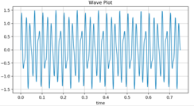

# Python: SciPy

---

## Lesson Objectives

  * Introduction to SciPy

  * Brief introductions to various to sub-packages in SciPy

Notes:

---

## Introduction to SciPy

  * Scipy is a scientific library for Python and is open source

  * It depends on NumPy

  * Scipy website - https://www.scipy.org/


Notes:

---

## Why SciPy

  * **Key advantage**  - Provides a very user friendly API to write code for various scientific computing domains including:

    - scipy.cluster – Vector Quantization
    - scipy.constants – Physical and mathematical constants
    - scipy.fftpack – Fourier Transform
    - scipy.integrate – Integration routines
    - scipy.interpolate – Interpolation
    - scipy.linalg – Linear Algebra routines
    - scipy.optimize – Optimization
    - scipy.sparse – Sparse matrices
    - scipy.stats – Statistics

Notes:

---

## Basics

  * Basic NumPy functions are included in SciPy, since NumPy is a part of (or the base of) SciPy

  * Examples of included functions:

    - np.zeros()
    - np.ones()
    - np.arange()
    - np.linspace()
    - np.array()
    - np.matrix()
    - and more ...

Notes:

---

# scipy.cluster
---

## scipy.cluster

  * scipy.cluster is used for vector quantization and primarily K-Means clustering

  * K-Means clustering is an unsupervised machine learning algorithm to find clusters in  unlabeled data (will be covered with machine learning)

  * Let’s do a whiteboard analysis on K-Means clustering algorithm

Notes:

---

## scipy.cluster

  * K-Means clustering

```python
from scipy.cluster.vq import kmeans,vq,whiten
from numpy import vstack,array
from numpy.random import rand

# data generation with three features
data = vstack((rand(100,3) + array([.5,.5,.5]),rand(100,3)))
# whitening of data
data = whiten(data)
# print data
print(data)

# computing K-Means with K = 3
centroids,_ = kmeans(data,3)
# print centroids
print(centroids)
# assign each sample to a cluster
clx,_ = vq(data,centroids)
# check clusters of observation
print(clx)
```
<!-- {"left" : 0.0, "top" : 1.89, "height" : 5.29, "width" : 10.25} -->

Notes:

---

## scipy.cluster
 * K-Means outputs from previous slide (data in 3 clusters):

- print(data)

```python
[[2.38038384e+00 2.12280702e+00 2.16947796e+00]
 [2.88261030e+00 3.05264701e+00 2.32604159e+00]
 [1.39628218e+00 2.67195040e+00 2.73329337e+00]
 [1.85570613e+00 1.44755357e+00 1.37267120e+00]
 [3.40103919e+00 1.83791819e+00 3.45083827e+00]
……………………
……………………
```
<!-- {"left" : 0.0, "top" : 2.43, "height" : 2.54, "width" : 10.25} -->

Notes:

---

## scipy.cluster

- print(centroids)

```python
[[1.21886134 1.13825823 1.0813865 ]
 [3.15339406 2.74945654 2.78052967]
 [1.77053939 2.2379303  2.33445638]]
```
<!-- {"left" : 0.0, "top" : 1.91, "height" : 1.13, "width" : 7.18} -->

<br/>

- print(clx)

```python
[2 1 2 0 1 1 2 2 1 2 1 1 1 1 1 2 1 2 1 1 1 1 1 1 1 1 1 1 1 2 2 1 1 1 2 1 2
 2 1 2 0 1 1 1 0 1 1 1 2 1 1 2 2 1 1 2 1 2 2 2 2 2 2 1 2 1 2 2 2 1 2 2 1 1
 1 1 1 1 1 2 2 2 2 2 2 1 2 2 2 1 1 1 2 1 1 2 2 1 2 1 0 2 0 0 0 0 0 2 0 0 2
 0 0 0 2 0 0 0 0 0 0 0 0 0 0 0 0 2 0 0 0 0 0 2 0 0 0 0 0 0 0 0 0 0 0 2 0 0
 0 0 2 0 0 0 0 2 0 0 0 0 0 0 0 0 0 0 0 0 0 0 0 0 2 0 0 0 0 2 2 0 0 0 0 0 0
 0 0 0 0 0 0 0 0 0 0 0 0 0 2 0]
```
<!-- {"left" : 0.0, "top" : 4.08, "height" : 1.91, "width" : 10.25} -->

Notes:

---

# scipy.constants
---

## scipy.constants

  * This package provides various physical and mathematical constants

```python
>>> from scipy.constants import *
>>> pi
3.141592653589793
>>> c
299792458.0
>>> h
6.62607004e-34
>>> e
1.6021766208e-19
>>> R
8.3144598
>>> k
1.38064852e-23
>>> m_e
9.10938356e-31
```
<!-- {"left" : 0.0, "top" : 2.27, "height" : 5.1, "width" : 7.55} -->

Notes:

---

# scipy.fftpack

---

## scipy.fftpack

  * scipy.fft is used for computing Fourier Transformations and Inverse Fourier Transformations

  * What is a Fourier Transformation?

    - https://www.youtube.com/watch?v=spUNpyF58BY


Notes:

---

## scipy.fftpack


  * Example:


```python
from scipy.fftpack import fft
import numpy as np
# Number of sample points
N = 600
# sample spacing
T = 1.0 / 800.0
x = np.linspace(0.0, N*T, N)
y = np.sin(50.0*2.0*np.pi*x) + 0.5*np.sin(80.0*2.0*np.pi*x)
yf = fft(y)
xf = np.linspace(0.0, 1.0/(2.0*T), N//2)
import matplotlib.pyplot as plt
plt.figure(figsize=(8,2))
plt.plot(x, y)
plt.grid()
plt.figure(figsize=(8,2))
plt.plot(xf, 2.0/N * np.abs(yf[0:N//2]), color = "r")
plt.grid()
plt.show()
```
<!-- {"left" : 0.0, "top" : 1.7, "height" : 5.67, "width" : 10.25} -->


<!-- {"left" : 2.78, "top" : 6.97, "height" : 1.89, "width" : 3.39} --> &nbsp; &nbsp; <!-- {"left" : 6.47, "top" : 6.94, "height" : 1.96, "width" : 3.52} -->


Notes:

---

# scipy.integrate
---

## scipy.integrate

- Example: Single Integrals –


<!-- {"left" : 5.65, "top" : 1.12, "height" : 1.14, "width" : 2.02} -->


```python
>>> import scipy.integrate
>>> from numpy import exp
>>> f = lambda x:exp(-x**2)
>>> i = scipy.integrate.quad(f, 0, 1)
>>> print(i)
(0.7468241328124271, 8.291413475940725e-15)
```
<!-- {"left" : 0, "top" : 3.01, "height" : 2.38, "width" : 10.14} -->

Notes:

---

## scipy.integrate

- Example: Double Integrals –


<!-- {"left" : 5.17, "top" : 1.15, "height" : 0.91, "width" : 3.58} -->

```python
>>> import scipy.integrate
>>> from numpy import exp
>>> f = lambda x:exp(-x**2)
>>> i = scipy.integrate.quad(f, 0, 1)
>>> print(i)
(0.7468241328124271, 8.291413475940725e-15)
```
<!-- {"left" : 0, "top" : 3.09, "height" : 2.44, "width" : 10.25} -->

Notes:

---

# scipy.interpolate
---

## scipy.interpolate

  * Running interpolation – the code on the next slide will be able to perform a 1D interpolation using interp1d()


<!-- {"left" : 0.32, "top" : 3.09, "height" : 3.55, "width" : 4.7} --> &nbsp; &nbsp;<!-- {"left" : 5.23, "top" : 3.09, "height" : 3.55, "width" : 4.7} -->


Notes:

---

## scipy.interpolate

  * Running interpolation – interp1d()

```python
import numpy as np
from scipy.interpolate import interp1d
import matplotlib.pyplot as plt
x = np.linspace(0, 4, 12)
y = np.cos(x**2/3+4)
print (x,y)
plt.figure(num=1)
plt.plot(x, y,'o')
xnew = np.linspace(0, 4,30)
f1 = interp1d(x, y,kind = 'linear')
f2 = interp1d(x, y, kind = 'cubic')
plt.figure(num=2)
plt.plot(x, y, 'o', xnew, f1(xnew), '-', xnew, f2(xnew), '--')
plt.legend(['data', 'linear', 'cubic', 'nearest'], loc = 'best')
plt.show()
```
<!-- {"left" : 0.0, "top" : 1.63, "height" : 4.24, "width" : 10.25} -->


Notes:

---

## scipy.interpolate

  * Running interpolation – the code on the next slide will be able to perform a smooth spline fit for a 2D surface using bisplev() and bisplrep()


<!-- {"left" : 0.26, "top" : 3.11, "height" : 3.55, "width" : 4.7} --> &nbsp; &nbsp;<!-- {"left" : 5.29, "top" : 3.07, "height" : 3.55, "width" : 4.7} -->


Notes:

---

## scipy.interpolate

  * Running interpolation – bisplev() and bisplrep()

```python
from scipy.interpolate import bisplev
from scipy.interpolate import bisplrep
import numpy as np
import matplotlib.pyplot as plt

x, y = np.mgrid[-1:1:20j, -1:1:20j]
z = (x+y) * np.exp(-6.0*(x*x+y*y))
plt.figure()
plt.pcolor(x, y, z)
plt.colorbar()
plt.title("Sparsely sampled function.")

xnew, ynew = np.mgrid[-1:1:70j, -1:1:70j]
tck = bisplrep(x, y, z, s=0)
znew = bisplev(xnew[:,0], ynew[0,:], tck)
plt.figure()
plt.pcolor(xnew, ynew, znew)
plt.colorbar()
plt.title("Interpolated function."
plt.show()
```
<!-- {"left" : 0.0, "top" : 1.75, "height" : 5.56, "width" : 7.61} -->

Notes:

---
## scipy.interpolate

  * Running interpolation – What are `np.mgrid()`, `bisplev()` and `bisplrep()`?

  * `np.mdgrid()`

    - Returns a multidimensional mesh grid

    - https://docs.scipy.org/doc/numpy/reference/generated/numpy.mgrid.html#numpy.mgrid

Notes:
https://docs.scipy.org/doc/numpy/reference/generated/numpy.mgrid.html#numpy.mgrid

---

## scipy.interpolate

  * `bisplev()` and `bisplrep()`

    - `bisplrep()` takes x, y, z and outputs `tck = [tx, ty, c, kx, ky]`.

    - `bisplev()` takes two 1D vectors whose cross product defines the domain of evaluation and the variable “tck”

    - https://docs.scipy.org/doc/scipy/reference/generated/scipy.interpolate.bisplev.html#scipy.interpolate.bisplev

    - https://docs.scipy.org/doc/scipy/reference/generated/scipy.interpolate.bisplrep.html#scipy.interpolate.bisplrep


Notes:
https://docs.scipy.org/doc/scipy/reference/generated/scipy.interpolate.bisplev.html#scipy.interpolate.bisplev

https://docs.scipy.org/doc/scipy/reference/generated/scipy.interpolate.bisplrep.html#scipy.interpolate.bisplrep


---

# scipy.linalg

---

## scipy.linalg

  * Example: solving a system of linear equations

```python
from scipy import linalg
import numpy as np

a = np.array([[1, 0, 1], [0, -3, 1], [2, 1, 3]])
b = np.array([6, 7, 15])

# Passing the values to the solve function
x = linalg.solve(a, b)

# Printing the result array
print(x)
```
<!-- {"left" : 0.0, "top" : 1.64, "height" : 3.5, "width" : 9.65} -->

```python
array([ 2., -1., 4.])
```
<!-- {"left" : 0.0, "top" : 5.5, "height" : 0.69, "width" : 5.49} -->

Notes:

---

## scipy.linalg

  * Example: finding eigenvalues and eigenvectors

```python
from scipy import linalg
import numpy as np

A = np.array([[1,2],[3,4]])

# Passing the values to the eig function
l, v = linalg.eig(A)
# Printing the result for eigen values and vectors
print(l)
print(v)
```
<!-- {"left" : 0.0, "top" : 1.67, "height" : 3.2, "width" : 9.99} -->

```python
[-0.37228132+0.j  5.37228132+0.j]
[[-0.82456484 -0.41597356]
 [ 0.56576746 -0.90937671]]
```
<!-- {"left" : 0.0, "top" : 5.23, "height" : 1.24, "width" : 7.28} -->


Notes:

---

# scipy.optimize

---

## scipy.optimize

  * There are many optimization algorithms in scipy.optimize

  * What is least squares? (code not as relevant as the concept)

     - https://www.youtube.com/watch?v=yMgFHbjbAW8
Notes:

https://www.youtube.com/watch?v=yMgFHbjbAW8

---

## scipy.optimize

```python
from scipy.optimize import least_squares
import numpy as np
def model(x, u):
return x[0] * (u ** 2 + x[1] * u) / (u ** 2 + x[2] * u + x[3])
def fun(x, u, y):
return model(x, u) - y
def jac(x, u, y):
J = np.empty((u.size, x.size))
den = u ** 2 + x[2] * u + x[3]
num = u ** 2 + x[1] * u
J[:, 0] = num / den
J[:, 1] = x[0] * u / den
J[:, 2] = -x[0] * num * u / den ** 2
J[:, 3] = -x[0] * num / den ** 2
return J
u = np.array([4.0, 2.0, 1.0, 5.0e-1, 2.5e-1, 1.67e-1, 1.25e-1, 
1.0e-1, 8.33e-2, 7.14e-2, 6.25e-2])
y = np.array([1.957e-1, 1.947e-1, 1.735e-1, 1.6e-1, 
8.44e-2, 6.27e-2, 4.56e-2, 3.42e-2, 3.23e-2, 2.35e-2, 2.46e-2])
x0 = np.array([2.5, 3.9, 4.15, 3.9])
res = least_squares(fun, x0, jac=jac, 
bounds=(0, 100), args=(u, y), verbose=1)
# `ftol` termination condition is satisfied.
# Function evaluations 130, initial cost 4.4383e+00, 
final cost 1.5375e-04, first-order optimality 4.92e-08.
print(res.x)
import matplotlib.pyplot as plt
u_test = np.linspace(0, 5)
y_test = model(res.x, u_test)
plt.plot(u, y, 'o', markersize=4, label='data')
plt.plot(u_test, y_test, label='fitted model')
plt.xlabel("u")
plt.ylabel("y")
plt.legend(loc='lower right')
plt.show()
```
<!-- {"left" : 0, "top" : 1.65, "height" : 5.3, "width" : 10.25} -->

Notes:

---

## scipy.optimize


<!-- {"left" : 2.09, "top" : 2.33, "height" : 4.41, "width" : 6.07} -->


Notes:

---

# scipy.sparse

---

## scipy.sparse


  * To generate 2D sparse matrices
  * The scipy.sparse package is great for times where we have a large matrix with very few items entered (It doesn’t make sense to store a huge matrix with all zeros or NAs)

```python
>>> mtx = sparse.csr_matrix((3, 4), dtype=np.int8)
>>> mtx.todense()  # Output is a matrix, not 2-D array
Matrix([0,0,0,0],
       [0,0,0,0]
       [0,0,0,0]])
```
<!-- {"left" : 0, "top" : 2.95, "height" : 2.21, "width" : 10.25} -->


<br/>

  * There are various types of sparse matrices. Two most common are:
     - csr_matrix – Compressed Sparse Row Matrix
     - csc_matrix – Compressed Sparse Column Matrix


Notes:

---

## scipy.sparse

  * Example: To fill in a csr_matrix:

```python
>>> from scipy.sparse import csr_matrix
>>> import numpy as np
>>> data = np.array([1,2,3])
>>> rows = np.array([1,1,0])
>>> cols = np.array([0,2,2])
>>> mtx1 = csr_matrix((data, (rows, cols)), shape = (8,15))
>>> print(mtx1.toarray())
[[0 0 3 0 0 0 0 0 0 0 0 0 0 0 0]
 [1 0 2 0 0 0 0 0 0 0 0 0 0 0 0]
 [0 0 0 0 0 0 0 0 0 0 0 0 0 0 0]
 [0 0 0 0 0 0 0 0 0 0 0 0 0 0 0]
 [0 0 0 0 0 0 0 0 0 0 0 0 0 0 0]
 [0 0 0 0 0 0 0 0 0 0 0 0 0 0 0]]
```
<!-- {"left" : 0, "top" : 1.89, "height" : 4.74, "width" : 10.25} -->

Notes:

---

# scipy.stats

---

## scipy.stats

  * There are various functions under scipy.stats to perform basic statistical functions such as those in the table

&nbsp;

| Function   | Description                                                                        |
|------------|----------------------------------------------------------------------------------  |
| describe() | Computes several  descriptive stats for the data                                	  |
| gmean()    | Computes geometric mean  along the specified axis                                  |
| hmean()    | Computes harmonic mean  along the specified axis                                   |
| kurtosis() | Computes kurtosis                                                                  |
| mode()     | Computes modal value                                                               |
| iqr()      | Computes the IQR of the data  along the specified axis                             |
| zscore()   | Computes zscore of each  value relative to the sample  eman and standard  deviation|

<!-- {"left" : 0.20, "top" : 2.25, "height" : 5.65, "width" : 9.75, "columnwidth" : [4.88, 4.88]} -->

Notes:


---

## Lab: Scipy Stats


  * Overview:

    - Use Scipy Stats

  * Approximate time:

    - 10 mins

  * Instructions:

    - **stats/1-stats-basics.ipynb**

Notes:


